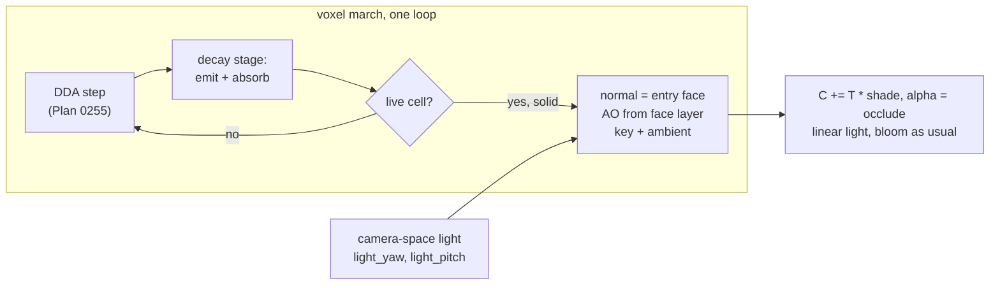

# 0256 — The voxels turn solid

> **Status:** approved 2026-10-08
> **Created:** 2026-10-08
> **Owner skill(s):** dev, human
> **Related ADRs:** [ADR-0269](../adrs/0269-a-solid-voxel-is-lit-by-one-key-light-and-its-own-occlusion-and-its-light-blooms-like-any-other.md) (proposed), [ADR-0268](../adrs/0268-a-3d-automaton-is-a-voxel-system-marched-as-an-emitting-absorbing-volume.md) (proposed), [ADR-0046](../adrs/0046-linear-light-hdr-composite-bloom-tonemap.md), [ADR-0201](../adrs/0201-a-fullscreen-scene-presents-premultiplied-over-the-backdrop.md)
> **Depends on:** [Plan 0255](0255-the-voxel-automaton-glows.md) closed. This plan extends its march, so it runs only after 0255 closes.

## TL;DR

`voxel` gains `present = "solid"`. The same march that draws Plan 0255's glowing volume stops at the
first live cell, and lights that cell's face:

- **Normal:** the face the ray entered, exact from the grid traversal.
- **Light:** one key light in camera space plus an ambient term.
- **Occlusion:** per-corner voxel AO that darkens every crease.

The decay stages in front of the surface still glow. The first visible result is a lit, faceted
structure turning in the camera, with no new pass and no depth buffer.

## Context & problem

Plan 0255 draws a 3D automaton as an emitting, absorbing volume. The owner asked for solid lit cubes
next. Unlit solid cubes are a flat silhouette, so this is the engine's first non-emissive register.
ADR-0269 records the lighting model, why it is camera-space, why the occlusion is voxel AO rather
than a screen-space estimate, and its answer to backlog 0092's open question: a lit surface blooms
like any other light.

## Decision

A structural `present = "glow" | "solid"` on `[voxel]`, with `glow` the default and byte-identical.
Under `solid`:

- **The march.** It accumulates decay-stage emission and absorption as `glow` does, and terminates
  at the first live cell.
- **The shade.** `palette(age) * brightness * shell * (ambient * ao + key * max(0, n . l))`,
  composited under the light gathered so far, with `alpha = occlude` at a hit.
- **The light.** Its direction comes from `light_yaw` and `light_pitch` in camera space.
- **The occlusion.** `ao` mixes in the per-corner occlusion interpolated across the face.

We rejected instanced cube meshes with a depth buffer, a matcap, and a bloom exemption for lit light
(ADR-0269, Alternatives).

## Architecture diagram



## Implementation phases

### Phase 1 — Walking skeleton: the march stops and lights the face
- **Owner skill:** dev
- **What:**
  - Add `present` to `[voxel]`, structural, `glow` by default.
  - Under `solid`, the march terminates at the first live cell and takes the normal from the last
    stepped axis.
  - Shade with the key light and ambient, AO not yet applied.
  - Add the modal params `key`, `ambient`, `light_yaw`, `light_pitch`, each with its `group` and
    `main` (ADR-0256), and declare them inert under `glow` (ADR-0180 rule 4).
  - Add a solid teaching preset under `docs/examples/voxel/`.
- **Files touched:** `core/src/render/scenes/voxel/mod.rs`, `core/src/render/scenes/voxel/shader.rs`,
  `core/src/render/scenes/voxel/tests.rs`, `core/src/preset/schema/raw/voxel.rs`,
  `core/src/preset/schema/load.rs`, `core/tests/fixtures/`, `docs/examples/voxel/`,
  `scripts/docs-shots.mjs`, and the generated `presets/README.md`, `presets/schema/`,
  `presets/preset.schema.json`, `.taplo.toml`, `docs/specs/player-schema.json`.
- **Done when:**
  - `cargo nextest run -p rlx-core --test golden` passes with `RLX_BLESS` unset, so every `glow`
    golden is byte-identical.
  - On a fixture holding one solid 8³ block seen from `yaw = 0.6, pitch = 0.4`, `shot` shows three
    faces at three distinct brightnesses. A test reads the three face centres and finds them
    ordered by `n . l`.
  - With `key = 0` and `ambient = 1`, the three face centres read the same colour, the albedo.

### Phase 2 — Voxel ambient occlusion
- **Owner skill:** dev
- **What:**
  - At a hit, read the occupancy of the cells around the hit face's four corners in the layer the
    ray came from. The classic three-neighbour rule gives each corner 0-3 occluders.
  - Interpolate across the face at the hit point and mix in by `ao` (0 = none).
  - Add a fixture whose structure has an inner corner (an L of two blocks).
- **Files touched:** `core/src/render/scenes/voxel/mod.rs`, `core/src/render/scenes/voxel/shader.rs`,
  `core/src/render/scenes/voxel/tests.rs`, `core/tests/fixtures/`.
- **Done when:**
  - With `ao = 0` the Phase 1 fixtures render byte-identical to Phase 1.
  - With `ao = 1` on the L fixture, the face next to the inner edge reads strictly darker at the
    edge than at its own centre, and a face with no neighbours reads the same at its edge and
    centre.

### Phase 3 — Cost, the golden and the gates
- **Owner skill:** dev
- **What:**
  - Probe `solid` on Plan 0255's three cost fixtures, with `present = "solid"`, on the same adapter,
    resolution and profile as Plan 0255 Phase 3, against `glow` in the same run (ADR-0074).
  - Add a golden for the L fixture at 32³ with AO on, blessed on the software adapter.
  - Add the solid teaching preset to the `sanity`, `animation`, `reactivity` and `distinctness`
    rosters.
- **Files touched:** `core/tests/golden.rs`, `core/tests/golden/`, `core/tests/fixtures/`,
  `core/tests/sanity.rs`, `core/tests/animation.rs`, `core/tests/reactivity.rs`,
  `core/tests/distinctness.rs`, `core/src/render/scenes/voxel/tests.rs`.
- **Done when:**
  - The log carries each fixture's `solid` and `glow` frame times. Each `solid` time on `Floor` is
    inside NFR section 1. The expectation is that `solid` is no slower than `glow` on the same
    fixture, because it terminates earlier. A fixture where it is slower is named, with both times.
  - `cargo nextest run -p rlx-core --test golden` passes with `RLX_BLESS` unset.
  - The four gates pass with the solid preset in their rosters.

### Phase 4 — Documentation and the references
- **Owner skill:** dev
- **What:**
  - `docs/presets.md` gains `present` and the four light params. It states that a lit surface
    blooms like any light, and that `trails` smear shading as if it were light (ADR-0269,
    Negative).
  - The generated files are regenerated.
  - `docs/preset-guide.md` gets the solid picture.
  - The preset-author `## voxel` section gains working ranges for `key`, `ambient` and `ao`, and the
    note that bloom on a solid preset is a choice made through `brightness`.
  - Backlog 0092 gains a dated bullet: ADR-0269 answers its bloom question for `voxel`, and its own
    ask (a matcap on the shape field) stays open.
- **Files touched:** `docs/presets.md`, `presets/README.md`, `presets/schema/`, `.taplo.toml`,
  `docs/preset-guide.md`, `docs/images/`, `docs/design-backlog.md`,
  `.claude/skills/preset-author/references/systems.md`.
- **Done when:**
  - `cargo nextest run -p rlx-core --test suite preset_schema::` passes with no update variable set.
  - `cargo nextest run -p rlx-core --test suite the_parameter_reference_block_is_current` passes.
  - `node scripts/toc.mjs --check`, `node scripts/check-doc-links.mjs`,
    `node scripts/check-reader-prose.mjs` and `node scripts/check-backlog-claims.mjs` pass.

### Phase 5 — The look, judged
- **Owner skill:** human
- **Blocks merge:** no
- **What:** the owner runs the solid teaching preset live with the music track, on `Floor` and
  `Rich`. They judge:
  - whether the structure reads as solid cubes with creases;
  - whether the camera-space light reads well through an orbit;
  - whether the glowing decay haze in front of the surface helps or muddies.
  Then they hand a brief to `preset-author`.
- **Files touched:** none.
- **Done when:** the owner records a keep, or a list of what is off, in this plan's log.

## Data shapes

```rust
// illustrative, not the final interface
pub enum Present { Glow, Solid }      // [voxel] present, structural
// Added to the march uniform under Solid:
//   light_dir: [f32; 3]   camera space, from light_yaw / light_pitch, rotated to world on the CPU
//   key: f32, ambient: f32, ao: f32
```

## Risks & open questions

- **The decay haze may muddy the surface.** On a rule with many decay stages, the haze in front of a
  lit face can wash it out. `density` and `trail` control it. If the judging in Phase 5 says it
  muddies, a later change can make the haze opt-out under `solid`, which this plan does not pre-empt.
- **The grid shows on the faces.** At 64³ on `Floor` the cubes are large and the march target is
  scaled down, so face edges may alias. A one-texel edge darkening from the AO interpolation may
  hide it. Phase 3's golden is where it shows first.
- **Trails smear shading.** A solid preset with `trails` on drags dark faces as if they were dim
  light (ADR-0269, Negative). The documentation says so, and nothing prevents it.
- **No shadows.** Cast shadows are the next thing a solid structure asks for. A shadow ray is a
  second march per pixel, roughly doubling the worst case. That is a followup with its own cost
  probe, not a phase here.

## What this plan does NOT do

- Cast shadows, add specular, or add a world-fixed light.
- Light anything outside `voxel` (backlog 0092's shape-field matcap stays its own decision).
- Add a depth buffer or mesh any cell.
- Ship presets. That belongs to `preset-author` after Phase 5.

## Implementation log

**Lane:**

| phase | owner | state | commit |
|---|---|---|---|
| 1 — Walking skeleton: the march stops and lights the face | dev | not started | |
| 2 — Voxel ambient occlusion | dev | not started | |
| 3 — Cost, the golden and the gates | dev | not started | |
| 4 — Documentation and the references | dev | not started | |
| 5 — The look, judged | human | not started | |

### Notes

### Close triggers

## Followups (after this lands)
