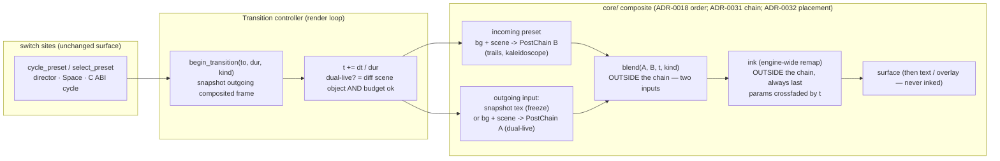

# 0023 — Cross-preset visual transitions: MilkDrop-style dissolves between presets

> **Status:** done (2026-07-26)
> **Created:** 2026-07-23
> **Revised:** 2026-07-25 (against the landed `PostChain`; see "Revision note" below)
> **Owner skill(s):** dev

## Close (2026-07-26)

Landed in five `dev` commits — `2a40f83` (Phase 1: ink leaves the `PostChain` as a terminal engine
post-pass), `4fefce3` (Phase 2: the walking skeleton — `Transition` controller + frozen crossfade on
the cycle path, plus ink's param crossfade), `918ae89` (Phase 3: the blend library — crossfade,
add/burn, luma-dissolve, wipe, behind one shader and a deterministic kind rotation), `5ab441a`
(Phase 4: adaptive dual-live + the budget governor, `CompositeSide`, `scenes::shares_resources`),
`9c0d468` (Phase 5: every switch path dissolves, re-entrancy, `select_preset_now`, the doc sweep).

**Mode 4 review: no blockers, no majors, five minors and one nit.** Verified cold: 137/137
`cargo nextest run -p lmv-core` green (including the hardware-only dual-live trail check, which ran
rather than skipped on the review box), `clippy --workspace --all-targets -D warnings` clean, and
**every golden baseline byte-identical with no re-bless** — Phase 1's behavior-preserving claim holds
in fact, not just in intent. The two hardest things in the plan are right: the snapshot is the
**pre-ink** frame (the chain targets a blend input; ink is downstream of the blend), and ink's
crossfade interpolates *params* feeding one remap rather than mixing two remapped frames
(in RGB, after the HSV conversion). Layering intact — no platform types in `core/`, `Scene` untouched,
the C ABI a doc-comment change only, the blend deliberately not a `PostStage`, and `transition.rs`
carries the panic pragma under `render/`'s recursive hygiene scan.

Two implementer judgment calls, both accepted at review: the "outgoing trail survives the dissolve"
check **requests the default adapter and skips on software** (building the blend's pipeline + targets
mid-run deterministically changes what the trails stage resolves to on WARP; on hardware the
dissolve's opening frame is byte-identical to the ordinary frame it replaces) — the same posture
`tests/background_composite.rs` already takes under ADR-0016, and it was verified red against an
induced restart bug. And the instant-cut escape is a **path**, public `select_preset_now`, rather than
the code constant this plan suggested; a constant would have forced one global answer to a
per-call-site question. It touches neither extension seam, so it is not ADR-worthy.

**Minors, carried to a later `dev` pass** (recorded in `docs/plans/README.md`):

1. `begin_transition` captures `from`/`to` **before** the snap-finish (`render/mod.rs:593-644`), so a
   switch arriving before the in-flight dissolve's capture frame has rendered leaves `from_index`, the
   snapshot and the roster describing different presets — and `cycle_preset`'s `to`, computed from the
   stale roster, absorbs the second press. One-frame window. Fix: snap-finish first, then derive
   `from` from `self.roster.active`.
2. The standalone's post-switch reads name the **outgoing** preset (`standalone/src/main.rs:317`,
   `445`, `480`). The title self-corrects on the periodic refresh; `warn_cap_overflow` does not, so an
   oversized incoming L-system's truncation is announced one switch late — ADR-0007's "never a silent
   cut" quietly slipping.
3. The stateful-incoming hitch was neither pre-warmed nor written down, and `render/mod.rs:589` now
   claims the opposite ("the switch itself never hitches a live show") while a dissolve's opening
   frames build the blend's two surface-sized targets (~16 MB at 1080p) plus the incoming chain's lazy
   offscreens. `CompositeSide::new` itself is free — every stage constructor is lazy — so this is a
   doc fix, not a design one.
4. `dissolve_mode` (`render/mod.rs:654-673`) is the one untested link: both of its inputs
   (`dual_live_eligible`, `shares_resources`) are covered thoroughly, but nothing exercises the
   composition, including its `_ => true` unresolvable-preset arm.
5. `docs/on-device-validation.md` gained no item for `DUAL_LIVE_BUDGET_MS`, which the code itself
   calls "the number to calibrate on a low-end rig".

**Nit:** a surface resize mid-dissolve rebuilds `Blend::Targets` and so discards the frozen snapshot —
the rest of that dissolve fades up from black. Acceptable; worth a comment at the rebuild.

Version **minor 0.15.1 -> 0.16.0** at close.
> **Related ADRs:** [0024-cross-preset-transitions](../adrs/0024-cross-preset-transitions.md);
> [ADR-0032](../adrs/0032-ink-leaves-the-chain-blend-between-chain-and-ink.md) (where the blend sits:
> ink leaves the chain, the blend goes between chain and ink — **this plan implements it**); builds on
> [ADR-0031](../adrs/0031-post-stage-trait-instantiable-composite-chain.md) (the `PostChain` this plan
> instantiates twice), [ADR-0018](../adrs/0018-engine-wide-scene-compositing.md) (engine composite:
> offscreen target + present pass, scenes stop clearing), [ADR-0028](../adrs/0028-final-stage-ink-tone-remap.md)
> (ink remaps the *blended* frame) and Plan 0014 ([ADR-0012](../adrs/0012-stateful-feedback-render-system.md)
> `PingPongField` + [ADR-0013](../adrs/0013-c-abi-v4-render-dt.md) injected `dt`); realizes the
> "cross-preset blending" follow-up deferred by [Plan 0003](done/0003-generative-scenes-and-presets.md)

## Revision note (2026-07-25)

Revised after [Plan 0030](done/0030-composite-chain-and-scene-keying.md) landed, which is what this
plan was sequenced behind. Three things changed and one was newly settled:

- **"Allocate the second target (or generalize the Plan 0018 target into a reusable pair)" is gone.**
  The composite is an owned `PostChain` value; the outgoing side is `PostChain::new(...)` a second
  time. Plan 0030 Phase 2 proved two chains against one device hold fully independent GPU state, with
  a test — so the **trail-field-ownership risk below is answered by construction**, not by verification.
- **"A kaleidoscope or trail stage that assumes it is last may need the blend to sit outside it" is
  answered structurally.** No stage assumes it is last: `route` derives the fold order from the active
  flags, and the last active stage always targets whatever destination the caller passed.
- **Where the blend sits was a real open fork, and it is now decided** in
  [ADR-0032](../adrs/0032-ink-leaves-the-chain-blend-between-chain-and-ink.md). ADR-0028 requires ink
  to remap the *blended* frame, but ADR-0031's bound rules a two-input stage out of the one-input
  `PostStage` trait — and ink was inside the chain, so the per-side chains could not each end in ink.
  **Ink moves out of the chain** (a terminal engine post-pass, symmetric with `Background` as the
  pre-pass); the chain keeps trails + kaleidoscope, the per-preset look; the blend sits between them
  and ink, also outside the trait. That relocation is **Phase 1** below.
- **Ink's params crossfade by `t` during a transition** — a decision this revision adds, since one ink
  pass now serves two presets that each bind their own `ink_*`/`paper_*`.

`PostChain::begin` / `::resolve` already take their final destination as a caller-supplied
`&wgpu::TextureView`, so none of this changes their signatures — the destination is the blend's input
while a transition runs, ink's input otherwise.

## TL;DR

Replace the instant preset **cut** with a MilkDrop-style **dissolve**. An engine `Transition`
controller, driven by injected `dt`, blends the outgoing and incoming presets over ~1 second using a
**small library** of blend kinds (crossfade, additive/burn, luma-dissolve, wipe/slide). The outgoing
side is **snapshotted at transition start** (the freeze path and safety net); the incoming side renders
live; **adaptive** logic re-renders the outgoing scene live too — but only when it is a *different*
scene object than the incoming and the frame budget is healthy, otherwise it falls back to the frozen
snapshot. Policy (duration, kind) is **engine-configured in code**; preset-declared transitions are a
follow-up. **Core-only, C ABI untouched.** First user-visible behavior: press Space and watch one
preset dissolve into the next instead of hard-cutting (Phase 1).

## Context & problem

Preset switching is an instant index bump (`Roster.active` in `render/mod.rs`), so the app reads as a
slideshow. The user asked for MilkDrop's continuous feel, where presets dissolve into one another. A
dissolve needs **two composited frames in one frame** plus a stage that mixes them by a factor `t` —
neither of which exists today (one live scene, drawn straight to the swapchain).

The interview settled the shape (see [ADR-0024](../adrs/0024-cross-preset-transitions.md)):

- **A small transition library**, not just one crossfade — so the blend stage must **sample both
  inputs** (an alpha lerp is out; the additive line/particle families won't composite correctly).
- **Adaptive** fidelity — dual-live when affordable, freeze otherwise — to protect the 60 fps @ 1080p
  iGPU floor (NFR §1) against the heavy stateful families (attractor, reaction-diffusion).
- **Core-level**, so both frontends get it with the C ABI untouched.
- **Built on Plan 0018's composite** (offscreen target + present pass + `Clear`->`Load` scenes),
  reusing that backbone rather than duplicating it.

## Decision

Add a **two-input blend pass** between the composite chain and the ink post-pass, plus a transition
controller in the render loop. The outgoing input is a **snapshot** taken at `begin_transition`; the
incoming preset renders live through its `PostChain`; a blend shader mixes them by `t` (advanced on
injected `dt`) and a `TransitionKind`; ink then remaps the blended result once, with its params
crossfaded by the same `t`. **Adaptive dual-live** re-renders the outgoing scene live into a **second
`PostChain`** *only* when it is a different scene object than the incoming **and** the smoothed frame
time (Plan 0011 `FrameStats`) is under budget; else the snapshot is used. Policy lives in engine code.

Full rationale and the rejected alternatives (single-target alpha, always-dual-live, always-freeze, a
`TransitionScene` wrapper, preset-declared-now) are in ADR-0024. The blend's **placement** — outside
the `PostStage` trait, with ink relocated out of the chain to sit after it — is
[ADR-0032](../adrs/0032-ink-leaves-the-chain-blend-between-chain-and-ink.md), which rejects widening
`PostStage` to two inputs, per-side inking, and a freeze-only path.

## Architecture diagram

Without a transition running the blend is absent entirely and the chain resolves straight into ink's
input (or the surface when ink is off) — the frame path Plan 0030 landed, unchanged.

## Implementation phases

Each phase is one commit with a clear done-when. **Phase 2** is the walking skeleton — an end-to-end
visible dissolve on the simplest path. Phase 1 precedes it because the skeleton's insertion point does
not exist until ink moves; it is behavior-preserving and independently verifiable (byte-identical
goldens), the same shape as Plan 0030's phases, so it is a prerequisite rather than open-ended plumbing.

### Phase 1 — Ink leaves the chain (behavior-preserving)
**Owner skill:** dev
**Area:** core

Per [ADR-0032](../adrs/0032-ink-leaves-the-chain-blend-between-chain-and-ink.md): remove `Ink` from
`PostChain`'s array and make it a terminal post-pass the renderer drives directly, symmetric with
`Background` as the pre-pass. `STAGE_COUNT` becomes 2 and the chain holds trails + kaleidoscope.

**Files touched:** `core/src/render/post.rs`, `core/src/render/ink.rs`, `core/src/render/mod.rs`

**Notes for the implementer:**
- **`PostChain`'s signatures do not change.** `begin`/`resolve` already take the destination as a
  caller-supplied `&wgpu::TextureView`. `draw_frame` computes the terminal target first — ink's input
  when ink is active, else the surface view — and passes it as that argument. Rename the parameter
  from `surface_view` to something honest (`destination`); it stops being the surface specifically.
- `Ink` reverts from a `PostStage` impl to inherent methods. Keep its `PARAMS` const exactly as it is:
  `preset::schema::GLOBAL_PARAMS` reads it for the load-time typo check (ADR-0020), so the preset-facing
  vocabulary must not move.
- The renderer offers a param to `background`, then `chain`, then `ink`, then the scene — same
  first-owner-wins order the namespaces already guarantee. `reset_params` / `reset_resources` gain an
  ink call back alongside the chain's.
- The `INK` position const and the `ink_when_active_is_always_last` routing test retire with the
  relocation — the ordering they asserted is structural now (ink is not in the thing that composes).
  **Do not delete `the_last_active_stage_always_targets_the_surface`**; it still guards the chain.
- `draw_calls` keeps summing: `chain.resolve()` plus ink's returned count (1 when it runs).

**Done when:** `PostChain` holds two stages and no `PostStage` impl mentions ink; `draw_frame` drives
ink after the chain; **every golden baseline is byte-identical with no re-bless** (the pixel path is
unchanged: chain folds into ink's input, ink folds into the surface, exactly as the three-stage chain
did); an ink-on preset still remaps correctly in a `shot` capture and the HUD is still never inked;
`cargo nextest run -p lmv-core` green with the routing tests updated only for the retired stage, not
weakened.

### Phase 2 — Walking skeleton: transition controller + frozen crossfade on the cycle path
**Owner skill:** dev
**Area:** core

Add a `Transition` state to the `Renderer` (`{ to_index, t, dur, kind, outgoing_tex }`). Route
`cycle_preset` through a new `begin_transition(to_index, dur, Crossfade)` instead of the instant swap:
on start, capture the current composited frame into `outgoing_tex` (reuse the Plan 0018 present/capture
machinery); set `Roster.active` to the incoming preset so the composite renders it live through the
chain. Each frame while a transition is active, run a **crossfade** blend of `outgoing_tex` and the
chain's output by `t` into ink's input (or the surface when ink is off), and advance `t += dt / dur`;
when `t >= 1`, finalize (drop the snapshot, resume the normal no-blend path). Freeze-only, one kind,
one switch path.

**Notes for the implementer:**
- **Snapshot the pre-ink frame**, not the presented one: the blend feeds ink, so both its inputs must
  be in the same colour space or the remap applies twice on the outgoing side (ADR-0032).
- Ink's params crossfade by the same `t` — `ink_amount`, `paper_*`, `ink_*` lerp from the outgoing
  preset's evaluated values to the incoming's, so `t = 0` is exactly the outgoing look and `t = 1`
  exactly the incoming one. Hold the outgoing side's values at `begin_transition`; they are already
  evaluated for that frame.

**Done when:** pressing Space (or `cycle_preset`) dissolves the current preset into the next over the
configured duration instead of hard-cutting; a headless `shot --signal` filmstrip across the transition
window shows intermediate **blended** frames (not a single-frame jump), and metrics confirm the mid-frame
differs from both endpoints; `t` advances purely from injected `dt` (no wall-clock), so a capture is
reproducible; a dissolve **between two ink-on presets with different paper/ink colors** shows the poles
moving continuously rather than snapping at either end; goldens still byte-identical with no transition
running.

### Phase 3 — The transition library (blend kinds)
**Owner skill:** dev
**Area:** core

Introduce `TransitionKind { Crossfade, AddBurn, LumaDissolve, Wipe }` and the blend-shader variants
(one pipeline with a kind + `t` uniform, or one pipeline per kind — dev's call). Each kind **samples
both textures** so the additive families blend without alpha artifacts. Wire an engine-default policy
in code: a default duration and a default kind (or a deterministic rotation over the library) chosen at
`begin_transition`. Keep the choice in one place so it is trivially tunable.

**Done when:** each kind renders a correct dissolve in a `shot` filmstrip (crossfade = linear mix;
wipe = a moving boundary; luma-dissolve = brightness-ordered reveal; add/burn = additive mix); a
fragment-field <-> line-scene transition (additive family) shows no alpha/color corruption at mid-blend;
switching the default kind in code changes every transition with no other edit.

### Phase 4 — Adaptive dual-live upgrade + budget governor
**Owner skill:** dev
**Area:** core

When the outgoing and incoming presets resolve to **different scene objects** *and* the smoothed frame
time (Plan 0011 `FrameStats`/`Diag`) is under a budget threshold, re-render the **outgoing** scene live
through a **second `PostChain`** each transition frame and blend two **live** composited frames;
otherwise use the frozen snapshot. Same-scene transitions (one shared scene object) always freeze. If
the budget is blown mid-transition, latch to the snapshot for the remainder (no per-frame flicker
between modes).

**Notes for the implementer:**
- The outgoing side is `PostChain::new(&device, format)` a second time — **not** a duplicated set of
  fields, and **not** a generalized target pair. Plan 0030 Phase 2 proved two chains against one device
  hold fully independent GPU state, including trails' `PingPongField`
  (`post.rs::two_chains_against_one_device_accumulate_independently`); build on that rather than
  re-verifying it.
- Each chain resolves into **its own blend input view** — pass that view as the chain's destination
  argument; that is the whole of the wiring.
- Both chains need their own param routing per frame: the outgoing chain's params come from the
  **outgoing** preset's bindings evaluated against the current `AnalysisFrame`, so the frozen side and
  the live side differ in *what is evaluated*, not in how it is routed.
- On finalize, the incoming chain becomes *the* chain and the outgoing one is dropped — no field is
  shared or leaked, by construction.
- **Scene keying matters here** (Plan 0030): two presets naming the same `SystemKind` resolve to the
  *same* `Box<dyn Scene>`, which is exactly the same-scene case that must freeze. Detect it by kind
  equality, not by preset index.

**Done when:** a light, different-scene transition (e.g. a line scene <-> fragment field) shows **both**
visuals live-animating through the dissolve; a forced-heavy case (attractor <-> reaction-diffusion)
exercises the freeze fallback and holds the frame budget on the dev box (the low-end iGPU 60 fps
confirmation is the standing on-device carry-forward, `docs/on-device-validation.md`); a same-scene
transition is verifiably freeze (asserted via the mode the controller selects), never attempting a
double live render of one object; a dual-live transition **out of** a trails-on preset shows the
outgoing side's trail continuing to accumulate rather than freezing or inheriting the incoming side's.

### Phase 5 — All switch paths, re-entrancy, tests, and docs
**Owner skill:** dev
**Area:** core

Route the remaining switch sites through the controller: `select_preset` / `select_preset_by_name`, the
`director` auto-rotate (Plan 0009), and the C ABI `lmv_cycle_scene` — each starting a transition (with a
defined instant-cut escape if a specific path should stay a hard cut, e.g. leave that a code constant).
Define re-entrancy: a switch arriving mid-transition **snap-finishes** the current one to its target then
starts the new one (simplest correct rule); a `set_presets` hot-reload or a browse-overlay select that
invalidates the in-flight target cancels cleanly to the resolved active index. Add core tests and refresh
docs.

**Done when:** every switch path dissolves (not just cycle); a mid-transition switch lands on the final
requested index with no stuck blend; hot-reload during a transition does not panic or leave a dangling
snapshot; core tests cover the controller as a pure-ish unit — `t` progresses deterministically over a
sequence of `dt`s, finalize lands **exactly** on the target index, a same-scene (same `SystemKind`)
switch forces freeze, and the budget governor selects freeze when fed an over-budget frame time;
`docs/` reflects the landed shape — a short "Transitions" note, the composite diagram (now
`background -> scene -> PostChain -> blend -> ink`), and the **operator-facing** sweep: `README.md`'s
Controls table (Space/preset-select now dissolve rather than cut) and `docs/presets.md` /
`presets/README.md` wherever they describe the composite order or state that ink is the final stage.
`cargo test -p lmv-core`, `clippy -D warnings`, and the `hygiene` panic-pragma guard (any new hot-path
`render/` file included) are green.

## Risks & open questions

- **Plans 0018 and 0030 have both landed** (the hard dependencies, now satisfied). 0018 supplied the
  offscreen target, present pass, and `Clear`->`Load` scenes; 0030 replaced its branch ladder with the
  `PostChain`. The standing instruction survives: where this plan and the code disagree, **trust the
  code**. In particular the composite is now `background -> scene -> PostChain -> [blend] -> ink ->
  surface -> text/overlay`, and `post.rs`'s module docs state the order and the skip rule directly.
- **Blend granularity is settled, but the colour-space trap is real.** The blend mixes each preset's
  **own composited look** (its background, view, trails, kaleidoscope) *before* the engine-wide ink
  remap — [ADR-0032](../adrs/0032-ink-leaves-the-chain-blend-between-chain-and-ink.md). The old worry
  that "a kaleidoscope or trail stage may assume it is last" is answered structurally: no stage assumes
  anything about position, `route` derives the fold order from the active flags, and the last active
  stage targets whatever destination the caller passes. What replaces it is narrower and easier to get
  wrong: **the snapshot must be the pre-ink frame.** Snapshotting the presented (already-inked) frame
  and feeding it to a blend that then inks again double-applies the remap on the outgoing side, and
  with default paper/ink it will look plausible rather than obviously broken.
- **Ink's crossfade is the one new user-visible behavior in this revision.** One ink pass now serves
  two presets that each bind their own `ink_*`/`paper_*`, so the params lerp by `t`. Two failure modes
  to watch: a snap at `t = 0` (holding the incoming preset's params too early) and a mid-dissolve tone
  neither preset configures (lerping in the wrong space — interpolate the *params*, not two remapped
  frames; that latter is the non-linearity ADR-0032 rejected as Alternative B).
- **Stateful incoming hitch.** A lazily-built stateful scene (reaction-diffusion, attractor) builds its
  GPU resources on first render — now at the dissolve's opening frame. The second `PostChain` adds its
  own lazy build to the same frame (trails' `PingPongField`, the kaleidoscope's offscreen). Consider
  pre-warming both on `begin_transition`; if deferred, note the one-time hitch as a known limitation.
- **Trail-field ownership is answered by construction, not verification.** Each `PostChain` owns its
  own `PingPongField` — proven by
  `post.rs::two_chains_against_one_device_accumulate_independently` (Plan 0030 Phase 2), which asserts
  a second chain starts from its own cleared accumulation and then reproduces the first chain's pixels
  when driven through the same history. What is left to get right is **finalize**: the incoming chain
  must become *the* chain and the outgoing one drop, with no frame where both or neither is live.
- **Budget threshold tuning.** The dual-live/freeze cutover threshold is a magic number; keep it a named
  code constant for on-rig calibration (like the director dwell constants), and log the selected mode
  under the diagnostics overlay if cheap.
- **Interaction with Plan 0016 (attractor).** The compute-particle attractor is the heaviest scene and
  the primary freeze-fallback trigger. 0016 **has** landed, so the heavy case is the real
  attractor <-> reaction-diffusion pair.
- **The two-stage chain has less routing coverage than the three-stage one.** ADR-0032 shrinks
  `STAGE_COUNT` to 2, so `post.rs`'s all-combinations sweeps go from eight cases to four. That is
  correct — there is nothing else to enumerate — but it means the chain's contract is proportionally
  less exercised than it was at Plan 0030's close. If a later stage joins the chain, the sweep grows
  back; do not read the smaller sweep as a weakened guard.

## What this plan does NOT do

- **No preset-declared transitions.** The `[transition]` TOML table (per-preset kind/duration) is a
  deliberate follow-up (ADR-0024 Alternative E); v1 policy is engine-configured in code.
- **No beat-quantized transitions.** Firing/finishing a dissolve on a downbeat or bar is out of scope;
  transitions run on a wall-clock-free `dt` timer, not the beat/bar analysis.
- **No new C ABI surface or `Scene`-trait method.** Transitions run inside the render loop off the
  existing switch calls; the plugin gets dissolves through the unchanged `lmv_render_dt`.
- **No new dependency.** Blend shaders and the controller are hand-written; the snapshot reuses the
  Plan 0018 present/capture machinery.
- **No MIDI/UI to pick transitions.** Selection is code policy; exposing it to the operator is later work.
- **Does not change the `PostStage` trait or the chain's fixed-order rule.** ADR-0032 shrinks the
  chain's *membership* only. The trait keeps its seven methods and its one-input `begin`; the blend is
  not a `PostStage` and does not become one.
- **Does not make ink per-preset.** Ink stays the engine-wide remap ADR-0028 describes — one pass on
  the finished frame. The crossfade interpolates its params during a transition; it does not give each
  side its own ink pass (ADR-0032 Alternative B, rejected).
