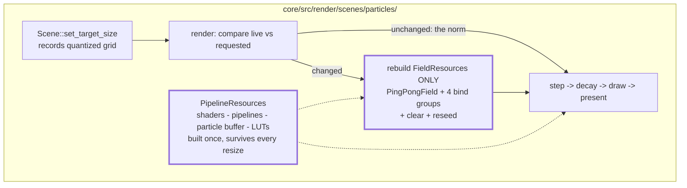

# 0029 — Attractor resize cost + ink-stage followups

> **Status:** done (2026-07-25)
> **Created:** 2026-07-25
> **Owner skill(s):** dev
> **Related ADRs:** [0030](../adrs/0030-scene-target-size-hot-path-hook.md) (the target-size hook this
> plan makes cheap to respond to); [0028](../adrs/0028-final-stage-ink-tone-remap.md) (the ink stage
> this plan tests and de-muddies). Cleans up findings from the Plan
> [0027](done/0027-attractor-ink-and-crisp-trails.md) close review.

## Close summary (Mode 4, 2026-07-25)

Five `dev` phase commits — `773d437` (resource split), `9b927ea` (quantize + aspect-preserving cap),
`59aa298` (ink golden), `dd74d41` (rename + doc corrections), `e375c2e` (project at the target
aspect). Passed the close review with **no blockers and no majors**; two minors and two nits, all
non-blocking and recorded in `docs/plans/README.md`.

Verified at review: `cargo nextest run -p lmv-core` **95/95 green**; `clippy -p lmv-core
--all-targets -D warnings` and `cargo fmt --check` clean. Both new behavioral tests were read and
confirmed non-vacuous, and Phase 5's was confirmed to **fail before the fix** by temporarily
restoring the grid-ratio projection — it reported exactly the predicted 1.329 skew, then 1.00 after.
The resource split is enforced by the types, not a comment: `FieldResources::build` takes
`&PipelineResources` and can reach only the layouts, sampler and decay uniform, so a pipeline cannot
drift back into the rebuilt block. `core/tests/golden/attractor.png` is the only baseline that
changed (the 128x128 capture now takes a 256x256 field), correctly scoped and noted in its commit.
Core-only; **C ABI untouched (v4)**; no new dependency; no wall clock, so fixed-size captures stay
byte-reproducible. ADR-0028 and ADR-0030 were already `accepted` at Plan 0027's close. Version
**patch 0.13.0 -> 0.13.1** at close (a fix-only plan).

Carried out of the review as followups, neither blocking: the particle **re-seed** on a grid change
is now unnecessary (the buffer survives the split) and is the surviving half of the "pops back to its
seed scatter" symptom this plan opened with — moving `needs_upload = true` into the first-build arm
finishes it; and the 256 px quantization floor means every headless capture supersamples (a 128x128
target takes a 256x256 field), so no test exercises the grid==target path any more.

## TL;DR

Make the attractor's new surface-tied trail grid **cheap to change size**, and put the ink stage
under test. Today a window drag rebuilds the attractor's entire GPU resource block — four shader
modules, every pipeline, the 50k-particle buffer, both LUT textures — inside `render`, once per
frame of the drag, and clears the trail each time; the visible result is a hard stutter and a blank
field until you let go, and a trail flash on every fullscreen toggle. This plan splits the
size-dependent resources out, quantizes the grid so most resizes change nothing at all, adds the
golden coverage ADR-0028 left optional, and fixes the two smaller ink/aspect papercuts the review
found.

## Context & problem

Plan 0027 Phase 2 tied the attractor's accumulation grid to its render target, which is the right
call and delivered the sharpness it promised. The Mode 4 review found the *response* to a size change
is too blunt, plus four smaller items:

1. **The rebuild is total and on the hot path.** `core/src/render/scenes/particles/mod.rs:1246`
   stale-checks the grid inside `render` and calls `Resources::build`, which recreates everything —
   including the shaders and pipelines, which do not depend on the grid at all. WGSL→backend shader
   compilation per frame is a multi-hundred-millisecond stall. `standalone/src/main.rs:693` forwards
   every `WindowEvent::Resized`, so a live drag hits this nearly every frame. Worse, the rebuild sets
   `needs_clear`/`needs_upload`, so the field is wiped and particles re-seeded each time and the
   attractor never converges to anything visible during the drag. The double-click fullscreen toggle
   (commit `566fcf8`) is the single-shot version: one rebuild, one trail flash, one visible pop as the
   cloud snaps back to its seed scatter. The existing code comment
   (`particles/mod.rs:515`) acknowledges rebuilding the whole block as a simplification, but reasoned
   about it as a one-off first-frame build, not a per-frame event.
2. **The ink stage has no behavioral test.** Nothing asserts that `ink_amount = 1` inverts anything.
   `sanity`/`animation`/`reactivity` sweep the shipped `attractor_ink` preset and would pass just as
   happily if `Ink::resolve` were a passthrough. ADR-0028 filed an ink golden as optional ("Neutral"),
   which was reasonable before a curated preset depended on the stage; it now ships in one.
3. **The grid cap breaks aspect on ultrawide.** `trail_grid_size` (`particles/mod.rs:85`) clamps each
   axis independently, so a 3440x1440 target yields a 16:9 grid stretched to 21:9 by the
   aspect-ignoring present. Below the cap the grid matches the target exactly and there is no stretch,
   so the attractor's proportions change discontinuously as you cross 2560 wide.
4. **Partial `ink_amount` is documented as a feature and looks like a defect.** The shader blends
   `mix(src, remapped, amount)` (`core/src/render/ink.rs:109`), so a mid amount crossfades toward the
   near-black source and greys the paper — a dirty page, not a faint drawing. `presets/README.md`
   advertises `"0.5"` as a creative middle ground; `presets/attractor_ink.toml` warns against exactly
   that in a comment. The docs contradict each other and the recommendation is the wrong one.
5. **The target-size hook's contract is misdescribed.** `Scene::resize`
   (`core/src/render/scenes/mod.rs:53`) documents "the current **surface** dimensions", but
   `render/mod.rs:715` passes the *scene target* size — the trails/kaleidoscope 1280x720 grid when
   those stages are active. The doc also concedes it "is a hot-path call, not a resize event", which
   makes `resize` the wrong name for it.

## Decision

Split `Resources` along the axis that actually varies — grid-dependent (the `PingPongField` and the
four bind groups that reference its views) versus grid-independent (shaders, pipelines, particle
storage, LUT textures, uniforms) — so a size change rebuilds only the former and keeps the running
simulation. Quantize the requested grid to a coarse step so a drag crosses a handful of sizes rather
than hundreds, and make the cap aspect-preserving. Then close the smaller items: an ink golden
fixture, the doc/name correction on the hook, and an honest line on partial `ink_amount`. We rejected
debouncing the resize on a timer (it needs a wall clock, which the determinism rule keeps out of the
render path, and it only delays the stall rather than removing it) and rejected making the rebuild
asynchronous (a background pipeline build is a whole new concurrency seam for a problem that is
really just "we rebuilt things that never depended on the size").

The trail **clear** on a genuine grid change stays — a differently-sized accumulation field has no
meaningful content to carry over, and the reseed keeps capture determinism honest. What changes is
how rarely it happens: with quantization plus the split, a fullscreen toggle costs one field
reallocation and one trail restart instead of a full pipeline rebuild, and a drag costs a few instead
of one per frame.

## Architecture diagram



## Implementation phases

### Phase 1 — Split the attractor's GPU resources along the grid-dependence axis
- **Owner skill:** dev
- **What:** Break `Resources` into a grid-independent block built once (shader modules, all
  pipelines, the particle storage buffer, both LUT textures, the uniform buffers) and a
  grid-dependent block (`PingPongField` plus the `decay_bg_a/b` and `present_bg_a/b` bind groups that
  bind its views), so a grid change rebuilds only the second.
- **Files touched:** `core/src/render/scenes/particles/mod.rs`.
- **Done when:** changing the trail grid recreates no `wgpu::ShaderModule`, no `RenderPipeline`/
  `ComputePipeline`, and no particle or LUT resource — only the field and its bind groups; the
  existing `core/tests/attractor.rs` contract and the `golden` attractor baseline are unchanged
  (the split is a refactor, not a visual change); `clippy -p lmv-core --all-targets -D warnings`
  clean.

### Phase 2 — Quantize the grid and make the cap aspect-preserving
- **Owner skill:** dev
- **What:** Round the requested grid up to a coarse step (256 px per axis) so most resize deltas
  request the same grid and cost a compare, and replace the per-axis clamp in `trail_grid_size` with a
  single scale factor `min(1, TRAIL_MAX_W/w, TRAIL_MAX_H/h)` applied to both axes so the field keeps
  the target's aspect above the cap as it already does below it.
- **Files touched:** `core/src/render/scenes/particles/mod.rs` (the `trail_grid_size` helper + its
  doc comment), `core/tests/attractor.rs` (unit coverage for the helper).
- **Done when:** `trail_grid_size` is a pure function with direct unit tests asserting the behavioral
  claims — a 3440x1440 target yields a grid whose aspect is within a rounding step of 3440/1440 (not
  16:9); a 1920x1080 target and a 1900x1070 target yield the *same* grid (quantization); no axis ever
  exceeds its cap and no axis is ever 0; the golden attractor baseline at the 128x128 capture size is
  re-blessed **only if** quantization changes it, with a one-line note if so.

### Phase 3 — Golden coverage for the ink stage
- **Owner skill:** dev
- **What:** A headless test asserting the ADR-0028 property nothing currently defends: the remap
  actually inverts tone, and `ink_amount = 0` does not.
- **Files touched:** `core/tests/` (a new test, or an added case in `background_composite.rs` whose
  `fullscreen_scenes_reveal_backdrop` is the pattern to follow), test fixtures as needed.
- **Done when:** a test renders one frozen fixture twice — once with `ink_amount = 0`, once with
  `ink_amount = 1` — and asserts the mean frame luminance **inverts** across the pair (the ink-on
  frame is substantially lighter, since a sparse scene is mostly dark base and therefore mostly
  paper), and that the `ink_amount = 0` capture is byte-identical to the same fixture rendered with no
  `ink_*` binding at all. Skips cleanly with no GPU adapter per ADR-0016.

### Phase 4 — Contract, naming, and doc corrections
- **Owner skill:** dev
- **What:** Rename the target-size hook and fix the three statements the review found untrue.
- **Files touched:** `core/src/render/scenes/mod.rs` (rename `resize` to `set_target_size`; doc says
  it carries the pixel size of *the target this scene renders into this frame*, which is the
  trails/kaleidoscope internal grid when those stages are active, and restates the ADR-0030
  compare-first obligation), `core/src/render/mod.rs` + `core/src/render/scenes/particles/mod.rs`
  (call sites), `core/src/render/ink.rs` (drop the unused `_encoder` parameter on `begin`),
  `presets/README.md` (replace the `"0.5"` recommendation with the honest note that a partial amount
  blends toward the near-black source and greys the paper — bind `ink_amount` between 0 and 1 for a
  *transition*, not as a resting value).
- **Done when:** no doc comment or authoring doc claims the hook receives the surface size; the
  `presets/README.md` guidance on partial `ink_amount` agrees with the warning already in
  `presets/attractor_ink.toml`; `cargo nextest run -p lmv-core` green.

### Phase 5 — Project at the target's aspect, not the grid's
- **Owner skill:** dev
- **What:** Phase 2 fixed the ultrawide squash and introduced a worse one everywhere else, found in
  the Mode 4 review. The draw uniform's `aspect` is the *grid* ratio
  (`particles/mod.rs:1477`), but the present pass stretches the field over the whole target with
  aspect ignored, so a point at field NDC `x` lands at target NDC `x` — the field's own aspect
  cancels out and the only value that produces correct proportions is the **target's**. That was
  invisible while the grid equalled the target below the cap; quantization broke the equality, so a
  1920x1080 window (the standalone's default, `standalone/src/main.rs:660`) takes a 2048x1280 grid
  and draws the attractor **11% too wide**, a 512x384 window takes 512x512 and draws it 33% too
  wide, and a 3 px change from 2880 to 2877 wide flips between 0% and 12%. The correct value is
  already in hand and discarded: `render`'s signature is `_aspect: f32`
  (`particles/mod.rs:1359`) and `draw_frame` computes `scene_aspect` from the same branch that
  computes `scene_size` (`render/mod.rs:692-709`).

  Use `aspect`. Point sprites follow for free — the quad half-extent is `psize` in world units
  divided by the same `aspect`, so round-on-screen holds under the same condition. `trail_grid_size`
  stays exactly as Phase 2 left it: its single-scale-factor cap stops being the aspect mechanism and
  becomes what it should have been, a way to keep the field's sampling near-isotropic.
- **Files touched:** `core/src/render/scenes/particles/mod.rs` (the draw uniform's `aspect` and the
  comment at `1474-1476`, which currently reads as the justification for the defect; the module doc
  at `29-38`, which claims the stretch "stays a near-no-op" because `trail_grid_size` keeps the
  target's aspect — untrue under quantization, and the reason for the wrong call site),
  `core/tests/attractor.rs` (the assertion below).
- **Done when:** a headless test renders the same attractor preset at two **non-square** targets that
  share a target aspect but land on different grid aspects — 1024x768 (grid 1024x768, already step
  multiples, aspect-exact) and 512x384 (grid 512x512, aspect 1.0) — and asserts the normalized
  bounding box of the lit region has the **same** width:height ratio in both, within ~10%. Today
  those two ratios differ by ~33%, so the test fails before the fix and passes after. Skips cleanly
  with no adapter per ADR-0016. The 128x128 golden baseline is **unchanged** — a square capture takes
  a square grid, which is exactly why the whole suite was blind to this (every `core/tests/*.rs`
  capture is 96x96 or 128x128).

## Data shapes

```rust
// illustrative — not the final interface
struct Resources {
    pipelines: PipelineResources, // built once: shaders, pipelines, particle buffer, LUTs, uniforms
    field: FieldResources,        // rebuilt on a grid change: PingPongField + the 4 field bind groups
}

struct FieldResources {
    field: PingPongField,
    decay_bg_a: wgpu::BindGroup,
    decay_bg_b: wgpu::BindGroup,
    present_bg_a: wgpu::BindGroup,
    present_bg_b: wgpu::BindGroup,
    trail_w: u32,
    trail_h: u32,
}
```

## Risks & open questions

- **The bind-group split may not be clean.** If a bind group mixes field views with LUT or uniform
  bindings, it lands in `FieldResources` and gets rebuilt — cheap (a bind group is not a pipeline),
  but it means `PipelineResources` must hand out the layouts and the non-field resources it references.
  Watch for borrow friction between the two blocks; if it gets ugly, keeping the bind-group *layouts*
  in the pipeline block and only the groups in the field block is the escape hatch.
- **Quantization step is a guess.** 256 px per axis is chosen for a drag to cross ~4-8 grids across a
  full-screen-width resize rather than hundreds. Too coarse wastes fill (a 1920-wide window gets a
  2048-wide grid); too fine defeats the point. If it reads wrong on device, it is one constant.
- **The golden luminance assertion needs a margin, not an exact value.** The ink-on frame's mean
  luminance depends on how much of the fixture is lit; assert a decisive gap (ink-on mean well above
  ink-off mean) rather than a tuned constant that re-drifts.
- **Phase 5's bounding-box tolerance is a margin, not a constant.** Quantization changes how much the
  field is up/downsampled, so the glow's outer falloff crosses the lit-pixel threshold at slightly
  different radii between the two captures. ~10% is loose enough for that and tight enough to fail on
  the ~33% shape error it is there to catch; if it proves flaky, widen the threshold on the lit mask
  before widening the tolerance.
- **No wall clock anywhere in this.** The rejected debounce would have needed one; quantization and
  the resource split are both pure, so determinism (NFR §6) is untouched and headless captures at a
  fixed `--size` stay byte-reproducible.

## What this plan does NOT do

- **No engine-wide internal-resolution system.** The reaction-diffusion, trails, and kaleidoscope
  stages keep their fixed grids; unifying the three resolution policies stays the separate future
  decision Plan 0027 already deferred.
- **No `ink_tint` / colour-preserving ink.** Phase 4 makes the *documentation* of partial
  `ink_amount` honest; it does not change the blend. A paper-preserving or colour-bleeding remap is a
  real design question (ADR-0028 flagged it) and needs its own ADR, not a shader tweak here.
- **No async or threaded pipeline building.** Explicitly rejected above.
- **No `Scene`-trait widening.** Phase 4 renames one existing method and corrects its doc; the trait
  gains and loses nothing (ADR-0030's three conditions stand unchanged).
- **No C ABI change, no new dependency, no new DSP.**

## Followups (after this lands)

- Revisit an `ink_tint` / paper-preserving blend as its own ADR if colour-preserving inversion is
  still wanted.
- Generalize the target-sized internal grid to the reaction-diffusion / trails / kaleidoscope stages
  (Plan 0027's carry-forward) — this plan's resource split is the pattern those would follow.
