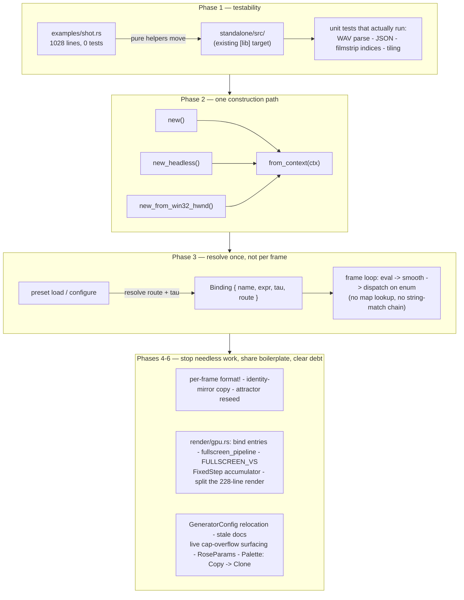

# 0031 — Cleanup pass: testable `shot` helpers, one construction path, load-time param routing, and the accumulated close-review debt

> **Status:** done
> **Created:** 2026-07-25
> **Approved:** 2026-07-25
> **Closed:** 2026-07-26 — six `dev` phase commits (`5244fd2` `shot`'s helpers into the lib,
> `83706a3` `from_context`, `6755014` load-time routes + tau, `64e7145` three per-frame stops,
> `fb024fc` `render/gpu.rs` + the attractor split, `609b9c9` the accumulated debt). Passed Mode 4
> review: **no blockers, no majors**; five minors, three nits. Version **patch 0.16.0 -> 0.16.1**.
> See "Close" at the foot of this file.
> **Owner skill(s):** dev
> **Related ADRs:** none new — this plan carries out existing decisions. Touches code governed by
> [ADR-0007](../adrs/0007-line-geometry-generators.md) (segment cap is never a silent cut),
> [ADR-0019](../adrs/0019-eased-parameters.md) (render-layer easing), and
> [ADR-0021](../adrs/0021-shared-palette-system.md) (baked palette). **Sequenced after
> [Plan 0030](0030-composite-chain-and-scene-keying.md)** — Phase 3 names its chain stages.

## TL;DR

The non-blocking half of the 2026-07-25 codebase-health review, plus the minors that four earlier plan
closes logged and nobody came back for. Six independent phases: get the `shot` CLI's pure helpers under
test, collapse `Renderer`'s three duplicated constructors into one path, resolve each preset binding's
route and easing constant **once at load** instead of every frame, stop three pieces of per-frame work
that aren't needed, share the duplicated GPU boilerplate, and clear the structural/doc debt. Nothing
here changes what a preset looks like; the one user-visible change is that a *live* segment-cap
overflow finally reports itself.

## Context & problem

A codebase-health review (2026-07-25) audited `core/`, `standalone/`, and the plugin shim for
least-knowledge, SOLID, testability, oversized units, and performance. It found **no blockers** — no
platform or audio-source type in `core/`, nothing unsafe on the audio callback, the C ABI still minimal
at v4, the panic pragma on every file the hygiene guard scans. [Plan 0030](0030-composite-chain-and-scene-keying.md)
takes the two findings that block other work. This plan takes the rest:

- **`standalone/examples/shot.rs` is 1028 lines and 45 functions with zero tests**, in a target where
  `#[test]` does not run by default. It contains a hand-rolled WAV parser (50 lines of raw byte
  offsets), a JSON emitter, filmstrip index math, image tiling, and a bitmap glyph table — all pure,
  none tested. It is also the harness the `preset-author` lane trusts to self-verify drafts, so a silent
  bug here corrupts that feedback loop. The crate already carries a `[lib]` target for exactly this
  sharing (ADR-0014 put the preset-dir resolver there at Plan 0015's close).
- **`Renderer` has three constructors that duplicate ~28 lines each** (`new`, `new_headless`,
  `new_from_win32_hwnd`), differing only in how they obtain a `RenderContext`. Every new field is a
  three-place edit — four after Plan 0030 adds the chain.
- **Load-time facts are re-derived per binding, per frame.** `draw_frame` looks each binding's name up
  in a `BTreeMap<String, f32>` for its easing `tau`, then walks a chain of `set_param(&str, ..)` string
  matches to discover which stage owns it. Both answers are fixed the moment the preset loads. The
  per-frame cost is small; the cost that matters is that adding a stage means adding another link to a
  chained `if` **inside the hot loop**.
- **Three pieces of per-frame work are unnecessary**, one of which is a hot-path heap allocation that
  [Plan 0018's close](0018-engine-wide-visual-enrichment.md) already logged and nobody fixed.
- **Duplicated GPU boilerplate**: two `fullscreen_pipeline` implementations, three copies of the
  bind-group-entry helpers, the same fullscreen-triangle WGSL vertex stage pasted into ~8 shader
  strings, and the same 12-line fixed-timestep accumulator in two scenes. The five longest functions in
  the repo are all GPU `build` bodies, and `AttractorScene::render` is 228 lines.
- **Four prior closes logged minors that are still open**: Plan 0016's `GeneratorConfig` living in
  `lines/mod.rs` (so `lines` reaches into `particles::AttractorFamily`), Plan 0018's per-frame `format!`
  and its unsurfaced *live* cap overflow, Plan 0029's now-unnecessary particle reseed, and Plan
  0025/0027's stale "fullscreen opaque pass" comment. Re-reporting them each review is worse than
  closing them.

## Decision

Land the cleanup as six independent, individually-revertable phases, ordered so the first delivers new
test coverage rather than a restructure. Each phase is behavior-preserving except where explicitly
stated (Phase 6 makes a live cap overflow visible, which is the behavior ADR-0007 asked for and Plan
0018 shipped only half of). We fold the four prior-close minors into the phases they belong to rather
than tracking them separately — several are literally the same finding this review re-derived, and a
debt item that survives four reviews is not going to be fixed by a fifth mention.

## Architecture diagram



## Implementation phases

### Phase 1 — `shot`'s pure helpers move to `standalone/src/` and get real tests
- **Owner skill:** dev
- **What:** Move the pure, side-effect-free helpers out of the example and into the existing library
  target, then unit-test them; the example keeps arg parsing, GPU capture, and file I/O.
- **Files touched:** `standalone/src/lib.rs` (or new sibling modules under `standalone/src/`),
  `standalone/examples/shot.rs`
- **Notes for the implementer:**
  - The clear candidates are the ones with no GPU, no filesystem, and no `Args`: `read_wav_16bit`'s
    parsing core (split the byte-slice parse from the file read), `filmstrip_indices`, `parse_size`,
    `apply_set`, `parse_param`, `synth_signal`, `le_u16`/`le_u32`, `tile_filmstrip`, `json_matrix` /
    `num` / `json_string`, and `glyph_for`.
  - `#[test]` in an `examples/` target does **not** run under `cargo test` by default — that is the
    whole reason this code is untested. Moving it is the fix; do not try to make the example test
    itself.
  - Do not move the orchestration (`shot`, `contact_sheet`, `filmstrip`, `report`) or anything holding
    a `Renderer` — that would drag GPU dependencies into the lib for no benefit.
  - Keep the CLI's observable behavior identical, including the `[source]` provenance label and the
    exit codes Plan 0015 pinned (`--presets` / `--preset-file` error rather than silently falling back).
- **Done when:** `cargo test -p standalone --lib` covers the moved helpers with assertions on the
  behavioral claims, not on shapes — a truncated/garbage WAV header is a clean `Err` and never a panic
  or a wrong sample count; a 16-bit stereo WAV decodes to the interleaved sample count and
  `AudioFormat` its header declares; `filmstrip_indices` spans the available hops and errors when the
  requested strip exceeds the audio length; `json_string` escapes quotes/backslashes/control characters
  so a preset name containing a quote cannot produce invalid JSON; `tile_filmstrip` produces the
  expected canvas dimensions for a known frame set and errors on an empty one; `apply_set` rejects an
  unknown band name. Plus: `shot --report`, `--contact-sheet`, and a `--signal` filmstrip all still
  produce the same output they do today (run them and compare), and `clippy -p standalone --all-targets
  -D warnings` is clean.

### Phase 2 — One `Renderer` construction path
- **Owner skill:** dev
- **What:** Extract `Renderer::from_context(ctx) -> Self`; reduce the three public constructors to
  context acquisition plus a call.
- **Files touched:** `core/src/render/mod.rs`
- **Notes for the implementer:** the `unsafe` on `new_from_win32_hwnd` belongs to obtaining the surface
  from a raw HWND, not to the rest of construction — keep the `unsafe` boundary exactly where it is and
  as narrow as it is. `configure_active_scene()` must still run at the end of every path (it is what
  builds a line scene's geometry for roster index 0).
- **Done when:** the post-context construction sequence appears exactly once in the file; all three
  constructors still work — the standalone launches and renders, the headless capture tests pass, and
  the `#[cfg(windows)]` HWND path still compiles (it has no test; confirm by build, and say so at
  review rather than implying coverage); goldens byte-identical.

### Phase 3 — Resolve each binding's route and easing constant once, at load
- **Owner skill:** dev
- **What:** Give `Binding` its resolved easing `tau` and its resolved destination, so the frame loop
  evaluates, smooths, and dispatches without a map lookup or a string-match chain.
- **Files touched:** `core/src/preset/schema.rs`, `core/src/render/mod.rs`, `core/src/render/post.rs`
- **Notes for the implementer:**
  - Where the resolution happens is a real choice: `tau` can be resolved at parse time in `schema.rs`
    (it comes from the preset's own `[smoothing]` table), but the **route** depends on which stages
    exist, which is a render-layer fact — so resolve the route in `configure_active_scene`, which
    already runs on every active-preset change and is already the off-hot-path hook. Do not make
    `preset/` depend on the render layer's stage list.
  - An unknown param name must keep today's behavior exactly: silently ignored, not an error. (Making it
    a surfaced warning is **Plan 0019's** job, and Plan 0019's mechanism will want this resolution step
    to hang the warning off — mention that in a comment so the two plans meet cleanly rather than
    colliding.)
  - Keep `ParamSmoother`'s keying working: it is indexed by binding position and reset on preset change
    and capture rebuild. Do not let this refactor change when it resets, or captures stop being pure.
- **Done when:** the per-frame binding loop contains no `BTreeMap` lookup and no chained
  `set_param` fallthrough; `ParamSmoother`'s existing unit tests are untouched and green; a unit test
  asserts route resolution assigns each namespace to its owner (`bg_*`, `trails`, `kaleido_*`,
  `ink_*`/`paper_*`, everything else to the scene) and that an unknown name resolves to "ignored"
  without error; the `[smoothing]` determinism test (`smoothed_preset_capture_is_deterministic`) still
  passes unmodified; and goldens byte-identical.

### Phase 4 — Stop three pieces of per-frame work that aren't needed
- **Owner skill:** dev
- **What:** Remove a hot-path allocation, a redundant per-frame buffer copy, and a redundant GPU upload.
- **Files touched:** `core/src/render/scenes/lines/mod.rs`, `.../lines/parametric.rs`,
  `.../lines/lsystem.rs`, `.../lines/star.rs`, `core/src/render/scenes/particles/mod.rs`
- **Notes for the implementer:**
  - **The `format!` (closes Plan 0018's close-review minor 1, re-found by this review):** all three line
    scenes build `CapOverflow { context: format!("mirror x{}", order) }` inside `update` — a heap
    allocation every frame for as long as an audio-driven `mirror_order` sits over the cap. Make
    `context` a small enum (`Mirror(u32)` / `Depth(u32)`) that formats only in `Display`. The `Display`
    output must not change — the standalone prints it and ADR-0007 requires the message stay
    informative.
  - **The identity-mirror copy:** `parametric.rs` always routes the sampled curve through
    `replicate_mirror` into a second buffer, even at the default identity spec (order 1, no reflect) — a
    full copy of the segment set every frame in the common un-mirrored case. Skip the copy at identity
    (draw the sampled buffer, or swap the two). The three line scenes share this shape; check each.
  - **The attractor reseed (closes Plan 0029's close-review minor 1):** the particle buffer now survives
    a grid change (Plan 0029 split `PipelineResources` from `FieldResources`), so re-flagging
    `needs_upload` on a grid rebuild is no longer necessary and is the surviving half of "a fullscreen
    toggle pops the cloud back to its seed scatter". Move `needs_upload = true` into the first-build arm
    only. Determinism does not need it: a headless capture holds one target size.
- **Done when:** no `format!`/`String` allocation remains on any per-frame path in
  `core/src/render/scenes/` (the load-time L-system depth message may still allocate — it runs once at
  `configure`); the overflow message a user sees is unchanged (assert `Display` output in a test); the
  existing cap-overflow tests (`oversized_mirror_surfaces_a_cap_overflow`,
  `overflow_truncates_and_reports_the_drop`) pass unmodified; a test pins that the identity mirror spec
  yields exactly the sampled geometry (no drop, no transform); resizing the window during an attractor
  preset no longer restarts the point cloud from its seed scatter (a manual on-device check — state it
  as such at review, it has no automated proof); and goldens byte-identical.

### Phase 5 — Share the GPU boilerplate; break up the two longest functions
- **Owner skill:** dev
- **What:** One home for the repeated wgpu descriptor helpers and the fullscreen-triangle vertex stage;
  one `FixedStep` accumulator; `AttractorScene::render` split along the paragraph boundaries its own
  comments already mark.
- **Files touched:** `core/src/render/gpu.rs` (new), `core/src/render/trails.rs`,
  `core/src/render/ink.rs`, `core/src/render/kaleidoscope.rs`, `core/src/render/background.rs`,
  `core/src/render/scenes/particles/mod.rs`, `core/src/render/scenes/reaction_diffusion.rs`,
  `core/src/render/scenes/fragment_field.rs`
- **Notes for the implementer:**
  - Collapse the three copies of the bind-group-entry helpers into one set
    (`texture(binding, filterable)`, `sampler(binding)`, `uniform(binding, visibility)`), the two
    `fullscreen_pipeline` implementations plus `field_pipeline`/`surface_pipeline` into one
    parameterized by target format and blend state, and the ~8 pasted fullscreen-triangle vertex stages
    into a `FULLSCREEN_VS` prelude the shader strings `concat!`.
  - **The UV convention differs between shaders** — some flip Y (`0.5 - 0.5 * p.y`), some do not. That
    is not incidental; verify each call site before sharing the prelude, and if two conventions are
    genuinely needed, provide two constants rather than one with a flag. A wrong flip is a
    vertically-mirrored effect that a golden will catch, but understand it rather than blessing it.
  - `FixedStep { accumulator, step, max_substeps }` with `advance(&mut self, dt) -> u32` replaces the
    identical 12 lines in the attractor and reaction-diffusion `advance` methods. Unit-test the drain,
    the `MAX_SUBSTEPS` clamp, and the sub-step remainder carry — behavior that currently has no direct
    test at all.
  - Splitting `render` is mechanical: `rebuild_if_stale`, `upload_uniforms`, `encode_steps`,
    `encode_trail_pass`, `encode_present`. **Do not reorder or merge any GPU call**; the pass order and
    the ping-pong `swap()` placement are load-bearing.
  - The pragma matters: `core/src/render/gpu.rs` is a new file under `render/`, so the hygiene guard
    requires the panic-denial block at its top.
- **Done when:** each of the shared helpers exists exactly once and every former copy is deleted (grep
  proves it); `FixedStep` has unit tests for drain / clamp / carry; `AttractorScene::render` is under
  ~80 lines with the extracted steps named; `cargo nextest run -p lmv-core` green; `hygiene` green
  (the new file carries the pragma); `clippy -p lmv-core --all-targets -D warnings` clean; and **every
  golden baseline byte-identical** — the shader-prelude sharing is the one change in this plan that can
  silently alter pixels, so an unchanged golden suite is the acceptance criterion, not a re-bless.

### Phase 6 — Structural and doc debt; two ergonomics fixes
- **Owner skill:** dev
- **What:** Close the remaining prior-close minors and two signature/type hazards the review flagged.
- **Files touched:** `core/src/render/scenes/mod.rs`, `core/src/render/scenes/lines/mod.rs`,
  `core/src/render/scenes/lines/curves.rs`, `core/src/render/scenes/lines/parametric.rs`,
  `core/src/render/scenes/reaction_diffusion.rs`, `core/src/render/palette.rs`,
  `core/src/preset/schema.rs`, `standalone/src/main.rs`, plus (added at Plan 0030's close)
  `core/src/render/post.rs`, `core/src/render/context.rs`, `core/src/render/overlay.rs`,
  `core/src/render/scenes/lines/renderer.rs`, `core/src/render/scenes/particles/mod.rs`
- **Notes for the implementer:**
  - **Cache the frame's `Routing` (Plan 0030 close-review minor 1):** `PostChain::begin`
    (`post.rs:284`) and `PostChain::resolve` (`:310`) each call `self.routing()` independently. That
    is safe today only because no stage's `active()` changes between them — a whole frame's
    correctness rests on an incidental property, and Plan 0023's blend stage is controller-driven, so
    it is exactly the case that could break it. Have `begin` store the `Routing` and `resolve` consume
    it, so "one routing decision per frame" is structural. A stored `Routing` is `Copy` and
    fixed-size, so this costs nothing.
  - **`cargo doc -p lmv-core` warnings (Plan 0030 close-review minor 2):** ten intra-doc links resolve
    to private items — `context.rs`, `overlay.rs`, `lines/renderer.rs`, `lines/mod.rs` (×2),
    `particles/mod.rs` (×4), `reaction_diffusion.rs`. All pre-existing and all outside Plan 0030's
    scope, which is why that plan's Phase 4 done-when went unmet rather than being force-fixed. These
    are one-line fixes (drop the link, or point it at a public item); the phase is done when
    `cargo doc -p lmv-core --no-deps` is **warning-free**.
  - **Stale routing narration (Plan 0030 close-review nit):** `schema.rs:137` still says
    `GLOBAL_PARAMS` are "the four compositing stages **the renderer** routes to before the scene".
    Three of the four are now offered by the `PostChain`; the renderer only routes `bg_*` directly.
  - **`GeneratorConfig` relocation (closes Plan 0016's close-review minor 2):** the shared structural-
    config enum lives in `lines/mod.rs`, so the line module now reaches into
    `particles::AttractorFamily` for a variant that has nothing to do with lines. Move the enum (and
    `CapOverflow`, if it travels naturally with it) up to `scenes/mod.rs`, where every scene family can
    see it without a sideways dependency. Re-export from the old path only if that keeps the diff sane.
  - **Stale comment (closes Plan 0025/0027's carried minor):** `reaction_diffusion.rs` still calls its
    present "a fullscreen opaque pass, so it covers the backdrop as before" — untrue since Plan 0025
    switched it to premultiplied-alpha over the backdrop.
  - **Live cap-overflow surfacing (closes Plan 0018's close-review minor 2):** `warn_cap_overflow` runs
    only on a preset change, so a per-frame mirror overflow driven by an audio expression is tracked and
    never reported. Poll `cap_overflow()` from the shell and report it — but **rate-limit it**: an
    unthrottled `eprintln!` every frame is its own bug. Report on the transition into overflow (and,
    optionally, once on recovery), not continuously.
  - **`RoseParams` (m6):** `curves::maurer_rose` takes 11 positional `f32`s behind
    `#[allow(clippy::too_many_arguments)]`; its own tests read as an unlabelled number soup where a
    transposed pair compiles fine and draws a different curve. A `#[derive(Clone, Copy)] RoseParams`
    struct is free at runtime. Update the tests to named-field construction — that is most of the value.
  - **`Palette` drops `Copy` (m7):** it is 6144 bytes (`[Rgb; 256] × 2`) and `Copy`, so any accidental
    by-value use is a silent 6 KB memcpy. Keep `Clone`; the deliberate copies in `set_palette` become
    explicit `.clone()`.
- **Done when:** no module under `scenes/lines/` references `particles::`; the RD present comment
  describes what the pass actually does; driving a preset's `mirror_order` past the cap live prints the
  overflow **once** on entry rather than per frame or never (verify by running with such a preset);
  `maurer_rose` takes a params struct and its tests construct it by field name; `Palette` is `Clone` and
  not `Copy` with every call site adjusted; `PostChain::resolve` consumes the `Routing`
  `PostChain::begin` decided rather than recomputing it, with the existing `post.rs` routing tests
  still green and unedited; `cargo doc -p lmv-core --no-deps` emits **zero** warnings;
  `cargo nextest run -p lmv-core` and `cargo test -p standalone` green; goldens byte-identical.

## Data shapes

```rust
// illustrative — not the final interface

/// Phase 3: what a binding resolves to, decided once per active-preset change.
enum ParamRoute {
    /// A post-composite stage, by its fixed index in the chain (Plan 0030).
    Stage(usize),
    /// The active scene's named-parameter surface.
    Scene,
    /// No owner claimed the name — silently ignored, exactly as today.
    /// (Plan 0019 will hang its soft typo warning off this case.)
    Unclaimed,
}

/// Phase 3: `Binding` carries its resolved facts so the frame loop does no lookups.
pub struct Binding {
    pub name: String,
    pub expr: Expr,
    tau: f32,           // from [smoothing]; 0.0 = instant (ADR-0019)
    route: ParamRoute,  // resolved in configure_active_scene, not in preset/
}

/// Phase 4: the cap-overflow context stops allocating on the hot path.
/// `Display` output must stay identical — the shell prints it (ADR-0007).
enum OverflowContext {
    Mirror(u32),  // "mirror x6"
    Depth(u32),   // "depth 6"
}

/// Phase 5: the fixed-timestep accumulator, currently duplicated verbatim in
/// the attractor and reaction-diffusion scenes.
struct FixedStep {
    accumulator: f32,
    step: f32,
    max_substeps: u32,
}
impl FixedStep {
    /// Drain `dt` into whole steps, clamped; the remainder carries. No clock.
    fn advance(&mut self, dt: f32) -> u32;
}

/// Phase 6: 11 positional f32s become one named struct.
#[derive(Clone, Copy)]
pub struct RoseParams {
    pub n: f32,
    pub d: f32,
    pub phase: f32,
    pub radial_offset: f32,
    pub samples: usize,
    pub scale: f32,
    pub rotation: f32,
    pub draw_progress: f32,
    pub color: [f32; 3],
    pub width: f32,
}
```

## Risks & open questions

- **Phase 5's shader prelude is the one place this plan can silently change pixels.** The pasted
  fullscreen-triangle stages do not all use the same UV convention (some flip Y). Sharing them
  carelessly mirrors an effect vertically. Byte-identical goldens are the guard; a shifted baseline here
  means read the shader, not re-bless.
- **`LMV_BLESS=1` rewrites every baseline, not just the failing one.** Several phases claim
  byte-identical goldens as their acceptance criterion, which makes an accidental blanket bless
  especially damaging — it would erase the evidence each phase depends on.
- **Phase 3 must not move the easing reset points.** `ParamSmoother` resets on preset change and on the
  capture scene-rebuild; capture purity (NFR 6) depends on both. The determinism test is the guard, so
  do not modify it to fit the refactor.
- **Phase 6's live overflow reporting is a new output path on the render thread.** `eprintln!` is I/O; a
  per-frame one is a stutter. The rate-limit is not a nicety — it is what keeps the fix from being worse
  than the gap. Edge-trigger it.
- **Phase 2's HWND constructor has no automated coverage** on this machine (the plugin is not compiled
  here). It can only be build-checked; report that honestly at review rather than letting "all three
  constructors work" stand unqualified.
- **Phase 1 grows `standalone`'s library surface.** Keep the moved helpers `pub` only as far as the
  example needs; a wider public surface on a `publish = false` crate is harmless but noisy.
- **Open question for the closer:** the version bump. This is a fix/cleanup plan with one small
  behavior addition (live overflow reporting), so **patch** is the honest call under ADR-0005 — a
  deliberate decision at close, not an automatic one.

## What this plan does NOT do

- **Does not touch the composite chain or scene keying** — that is [Plan 0030](0030-composite-chain-and-scene-keying.md),
  and this plan's Phase 3 assumes it has landed.
- **Does not change any preset's appearance.** No new param, no changed default, no golden re-bless.
- **Does not touch the C ABI** (still v4), the `Scene` trait, the DSP path, or the audio intake.
- **Does not add the surfaced-warning channel** for a `[palette]` declared on a non-colored line scene
  (Plan 0020's close-review minor 1) or for unknown param names. Both want the same soft-warning
  mechanism, which **[Plan 0019](0019-preset-grammar-v2.md)** owns. Phase 3 leaves the hook where 0019
  can reach it.
- **Does not revisit the 256 px trail-grid quantization floor** (Plan 0029's close-review minor 2 — every
  headless capture supersamples, and no test exercises the grid-equals-target path). Changing the floor
  moves a golden baseline, which makes it a behavior change and not cleanup; it belongs in a plan that
  can own the re-bless.
- **Does not refactor the `ffi.rs` entry-point scaffolding.** The eight entry points repeat the same
  null-check + `catch_unwind` + state-access preamble, and a helper would remove ~60 lines — but
  explicitness at an FFI boundary is a defensible choice and the review rated it a nit. Left alone
  deliberately.
- **Does not optimize `capture_audio`'s O(hops × requests) index scan.** Tooling only, off the hot path.
- **Does not add dirty-tracking to the line scenes** (resample + re-upload happens every frame even when
  no bound param changed). That is a real optimization, not a refactor, and it should be driven by a
  measurement rather than by reading the code.

## Followups (after this lands)

- **Measure before optimizing further.** Every performance statement in the originating review was a
  reading of the code, not a profile. If frame time matters, the next step is p99 from the F3 overlay or
  a `shot`-driven measurement on the low-end iGPU (the standing
  [on-device checklist](../on-device-validation.md)) — specifically the line scenes' per-frame resample
  and the fixed-1280x720 trails/kaleidoscope grid on a 1080p+ display.
- **Target-sized internal grids for trails / kaleidoscope / reaction-diffusion**, following the
  `PipelineResources` / `FieldResources` split Plan 0029 established for the attractor. Deferred
  repeatedly; still the right shape when someone picks it up.
- Consider whether `shot`'s hand-rolled WAV reader should stay hand-rolled now that it is tested, or
  whether the tests make a small dependency unnecessary (they probably do — keep it hand-rolled;
  "lightweight is a feature").

## Close (2026-07-26)

Passed Mode 4 review: **no blockers, no majors**; five minors, three nits. Six phase commits, one per
phase, every `**Owner skill:**` tag present and in-vocabulary.

### Verified at review, not taken on trust

- **211/211** `cargo nextest run --workspace` green, all nine GPU suites included.
- **`core/tests/` is byte-untouched across the whole range** (`git diff --stat ee2811c..HEAD --
  core/tests/` is empty), so "every golden baseline byte-identical, no re-bless" — this plan's central
  acceptance criterion, and the one Phase 5 could have silently broken — is true in fact, not by
  assertion.
- `clippy --workspace --all-targets -D warnings` and `fmt --check` clean; **`cargo doc -p lmv-core
  --no-deps` warning-free** (Phase 6's done-when).
- **`lmv-core` line coverage measured at 90.51 %**, up from the 90.13 % Plan 0032 set its
  `COVERAGE_FLOOR: 88` ratchet against — the deletions did not cost coverage.
- Phase 5's grep proof re-run independently: one `fullscreen_pipeline` definition, zero
  `field_pipeline`/`surface_pipeline`, zero local bind-entry helper definitions; the six surviving
  `vs_main` outside `gpu.rs` are genuine instanced/vertex-buffer stages and the six surviving
  `BindGroupLayoutEntry` literals are exactly the disclosed set. Zero `particles::` references under
  `scenes/lines/`.
- **Independent non-vacuity check on Phase 3.** Inducing `ParamRoute::Stage(_) -> Unclaimed` fails
  three tests: the two new routing unit tests *and* `a_dual_live_dissolve_carries_the_outgoing_trail`,
  a pixel-level end-to-end through `evaluate_preset`. The chain route is behaviorally covered, not
  merely unit-asserted.
- The guard that makes `resolve_route`'s dependence on `SystemKind::param_names()` safe is real:
  Plan 0019's `declared_params_match_set_param` is a **strict two-way equality** between each scene's
  `PARAMS` const and its `set_param` arms, so a scene handling an undeclared name — which routing by
  declared vocabulary would now silently drop — cannot exist.
- `smoothed_preset_capture_is_deterministic` untouched; `[smoothing]` non-negative validation still
  runs before the tau fold, so a preset with several problems reports the same error first.

### Accepted deviations

- **Phase 3 routes live on the render-layer `Roster`, keyed by preset index** — not on `Binding`, not
  resolved in `configure_active_scene`. Better than the plan's sketch: a dissolve composites two
  presets in one frame and both sides need routes, and indexing by preset makes a side's routes
  structurally undriftable from the preset it shows. Chain positions stay out of `preset/` as the plan
  required. `Preset::smoothing` was deleted outright once `tau` moved onto `Binding`.
- **Phase 3's plan note was stale and correctly not followed.** It told the implementer that a surfaced
  warning for an unknown param is Plan 0019's job; 0019 has landed and the load-time warning exists.
  Runtime dispatch stays a silent no-op (unchanged), and `ParamRoute::Unclaimed` documents itself as
  where a render-time diagnostic would hang. This was already logged as Plan 0019's close-review minor 3.
- **Phase 5 needed three vertex preludes, not one** — the nine pasted stages used raw NDC, Y-flipped UV
  and un-flipped UV. Three named constants, per the plan's own "provide two constants rather than one
  with a flag".
- **Two approved scope expansions:** `render/transition.rs` in Phase 5 (it postdates the plan's file
  list and carried its own copy of the Y-flipped prelude and texture-entry closure) and two `cargo doc`
  warnings in `render/mod.rs` in Phase 6 (added by Plan 0023). Both were required for their done-whens
  to hold literally.
- **Phase 1 shipped `filmstrip_layout`, not the plan's `tile_filmstrip`** — the arithmetic split out and
  tested, the `image` blit left in the example so the PNG codec stays out of `lmv.exe` (ADR-0011,
  ADR-0033 Alt E). Better than the letter of the done-when; `tile_filmstrip` itself stays untested.

### Minors (carried, none blocking)

1. `presets/README.md` still described the segment-cap drop as surfaced "at load-time-style" after
   Phase 6 made the *live* mirror overflow report itself — **fixed in this close commit**.
2. `core/src/render/mod.rs:1007` — `cap_overflow()`'s doc still says "Refreshed on every active-preset
   change …; the standalone surfaces it at load". The second clause is now false; the shell polls it
   every frame. (The body comment three lines down is correct.)
3. `poll_cap_overflow` edge-triggers on the *presence* of `cap_overflow()`, which gives the
   configure-time L-system overflow precedence — so a preset that loads with a depth overflow *and*
   later drives its mirror past the cap never announces the second. Defensible, undocumented.
4. `tile_filmstrip` has no test (see the deviation above).
5. `standalone/src/shot/json.rs` — `num(v)` renders `NaN`/`inf` verbatim, which is invalid JSON. Moved
   unchanged, so pre-existing, but Phase 1's stated purpose is exactly that a silent bug in this
   harness corrupts the `preset-author` feedback loop.

### Nits

- `gpu::texture`/`gpu::sampler` hardcode `ShaderStages::FRAGMENT` while `gpu::uniform` takes
  visibility, which is why the attractor's vertex-visible LUT entries stayed inline. A visibility
  parameter on all three would have absorbed those two copies too.
- `render/mod.rs:56` still re-exports `CapOverflow` through `scenes::lines` after Phase 6 moved the
  type to `scenes/`.
- The lsystem early-return paths don't reset `mirror_overflow`; pre-existing, unrelated to the swap.

### On-device carry-forward

- **Phase 2's `#[cfg(windows)]` HWND constructor is build-checked only** — no automated coverage on
  this machine, since the plugin is not compiled here. The other two paths were verified live (1592
  frames at 165 fps through `Renderer::new`) and by the headless capture tests.
- **Phase 4's attractor claim** — that resizing no longer restarts the point cloud from its seed
  scatter — needs a real window; the plan states it as a manual check.
