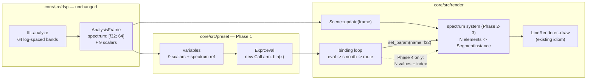

# 0034 — Preset-reachable spectrum: `bin(x)`, a spectrum scene, and per-element evaluation

> **Status:** done
> **Created:** 2026-07-26
> **Approved:** 2026-07-26 — ready for `dev` (a fresh session; the handoff is manual on purpose)
> **Owner skill(s):** dev, human
> **Related ADRs:** [0036](../adrs/0036-preset-reachable-spectrum.md); supplements
> [0002](../adrs/0002-layered-preset-architecture.md),
> [0007](../adrs/0007-line-geometry-generators.md),
> [0020](../adrs/0020-preset-grammar-v2-branching-functions-tempo.md)
> **Backlog entries closed:** [0002](../design-backlog.md)
> **Sequencing:** independent of [Plan 0033](0033-internal-resolution-and-preset-surface.md) — they
> share no files. Either order works; 0033 is approved first.

## TL;DR

A preset can finally reach the spectrum. `bin(x)` reads the engine's already-computed 64-band
log-spaced spectrum at a normalized position, so any parameter of any system can be driven from a
chosen frequency region — which is what "morph the attractor shape from a spectrogram" actually
needs. A new `spectrum` line system draws N elements (bars, polyline, or radial ring) from that same
array, which is the visible readout that was asked for. Both land without new DSP, without a new
render idiom, and without touching the `Scene` trait or the C ABI. Per-element expression evaluation
— one binding evaluated once per element with an implicit `index` — comes last, because the first
two phases already satisfy both original asks and it is the only piece that changes an invariant.

## Context & problem

Backlog entry [0002](../design-backlog.md) is the most-requested capability of the `preset-author`
lane's 2026-07-26 session, raised **twice, unprompted**: "a full spectrogram in several lines... 20-30
points", and "morph the attractor shape from a full spectrogram with a lot of bars". The lane mapped
the three available bands onto three separable structural levers as a workaround and reported the
user's verdict on the result: "represents not sure what... feels very poor."

The report estimates this as the largest item in the batch, needing "both a grammar addition and a
scene". **Three verifications narrow that considerably**, and they are the reason this plan is
shaped the way it is:

1. **The spectrum already exists, normalized and log-spaced.** `dsp/mod.rs:32` —
   `pub const SPECTRUM_BINS: usize = 64`, commented *"Log-frequency bands exposed to scenes"* — and
   `AnalysisFrame` carries `pub spectrum: [f32; SPECTRUM_BINS]`, computed each hop by `fft.rs` over
   logarithmic band edges and already consumed by `novelty.rs`. **No new DSP.** Determinism holds by
   construction: it is already a pure function of the input window (NFR §6).
2. **Every scene already receives it.** `Scene::update(&mut self, frame: &AnalysisFrame)` hands each
   scene all 64 bands every frame. A scene that draws the spectrum needs no new channel and no trait
   widening to see the data.
3. **The renderer already exists.** `LineRenderer::draw(segments: &[SegmentInstance])` serves the
   three existing line systems (ADR-0007). N bars, an N-point polyline and a radial ring of N spokes
   are all segment lists — a fourth consumer of an existing idiom, not a new idiom.

What is genuinely missing is scalar access to a frequency region from an expression, a scene that
draws N elements, and — separately and last — author-controlled per-element mapping.

## Decision

Three separable steps, in the order that puts the user's two asks first (ADR-0036).

`bin(x)` becomes a grammar function reading the existing spectrum at a normalized position with
interpolation between adjacent bands, so a preset never names the engine's bin count. A `spectrum`
line system draws N elements from `frame.spectrum` under a declarative `[spectrum]` config, styled
by ordinary scalar params. Per-element evaluation — a binding evaluated once per element with a
normalized `index` bound — lands last.

We rejected `spectrum[i]` indexing (it would introduce the first non-scalar type into a deliberately
scalar-only language, bringing bounds semantics and a meaning for bare `spectrum` with it), N flat
`band0..band63` variables (a ~73-entry `VAR_COUNT` with no interpolation and no way to address a
computed bin, so per-element mapping would still need a separate mechanism), and a GPU-side spectrum
texture (the right answer for true per-particle spectral response, but the attractor ask is met by
driving its four shape scalars from `bin(x)`, so building it now is a mechanism ahead of its use
case). Full reasoning in ADR-0036.

**A note on scope, stated plainly rather than acted on unilaterally.** Phases 1-3 satisfy both of the
original requests on their own. Phase 4 — per-element evaluation — was chosen deliberately in the
design interview and is kept in full, but it is sequenced last so that its value can be judged
against a working scene rather than in the abstract. If, after Phase 3, the scene's built-in
bin-to-element mapping turns out to be enough, Phase 4 is worth reconsidering rather than reflexively
building; that is a call for the close review, not for `dev` mid-plan.

## Architecture diagram



## Implementation phases

Each phase ships as its own commit. `dev` runs Phases 1-5 in one session; Phase 6 is the user's.

### Phase 1 — `bin(x)` reaches the spectrum
- **Owner skill:** dev
- **What:** The grammar function. Plumbs the existing `AnalysisFrame::spectrum` into `Variables` and
  adds one `Call` arm. This phase alone unlocks the attractor-morphing ask.
- **Files touched:** `core/src/preset/expr.rs`, `core/src/render/mod.rs`, `docs/presets.md`
- **Done when:**
  1. `bin(x)` evaluates the spectrum at normalized position `x`, **interpolating** between adjacent
     bands, so a preset never names `SPECTRUM_BINS`. Unit-tested with a synthetic spectrum: `bin(0)`
     and `bin(1)` hit the first and last band, a midpoint between two known bands returns their
     interpolation, and the function is **total** — out-of-range input clamps, `NaN` input yields a
     finite value, and no input path can panic (the hot-path pragma on `expr.rs` stays intact, so no
     new `unwrap` and no raw indexing).
  2. `bin` is registered as a known function, so an arity mistake is the same surfaced load error as
     any other call, and the existing grammar tests covering unknown identifiers still hold.
  3. The variable bundle is **not** copied per binding: `Variables` carries the spectrum without the
     per-binding evaluation path taking a 264-byte copy. State how in the commit body — a borrow with
     a lifetime, or by-value construction with by-reference evaluation.
  4. An end-to-end binding test proves it reaches a scene: a stimulus with energy in one narrow
     region drives a bound param via `bin()` to a materially different value than the same preset
     under a stimulus in a different region.
  5. `docs/presets.md` documents `bin(x)` **and its aliasing caveat** — 64 log-spaced bands over
     20 Hz to Nyquist means one call covers a wide musical interval at the top and a narrow one at
     the bottom, so `bin(0.02)` is not reliably "the kick".

### Phase 2 — The `spectrum` system: walking skeleton
- **Owner skill:** dev
- **What:** A fourth `SystemKind` on the existing `LineRenderer`, drawing N bars from
  `frame.spectrum`. Deliberately one layout and a minimal param set — the point of this phase is that
  a preset renders a real spectrum on screen.
- **Files touched:** `core/src/render/scenes/mod.rs`, `core/src/render/scenes/lines/` (new module),
  `core/src/preset/schema.rs`, `presets/` (one preset)
- **Done when:**
  1. A `spectrum` preset renders N vertical bars whose heights track `frame.spectrum`, drawn through
     `LineRenderer` — **no new render idiom**, and the commit body says so explicitly.
  2. The system is reachable the same way every other is: a `SystemKind` arm in the exhaustive
     factory and in `SystemKind::ALL`, its own `PARAMS` const beside its `set_param` match, so the
     Plan 0019 drift guard covers it and an unknown param on this system warns like any other.
  3. A behavioral test asserts it is **audio-reactive in the right place**: a bass-heavy stimulus
     raises the low-index elements and not the high ones, and a treble stimulus does the reverse.
     This is the claim that distinguishes a working spectrum from N bars of noise.
  4. The shipped preset passes the `sanity` / `reactivity` / `animation` floors, and the golden
     fixture for the new system is added per ADR-0023 (a frozen fixture, not a shipped preset).

### Phase 3 — Layouts, element count, and smoothing
- **Owner skill:** dev
- **What:** The `[spectrum]` declarative config and the styling that makes it a *look* rather than a
  debug readout.
- **Files touched:** `core/src/preset/schema.rs`, the spectrum scene, `presets/`,
  `presets/README.md`, `docs/presets.md`
- **Done when:**
  1. `[spectrum]` selects the element **count** (the user's "20-30 points" is the default range) and a
     **layout** among bars, polyline, and radial ring, validated at the load boundary with a surfaced
     error for a bad name — never a panic, matching every other declarative config (ADR-0007).
  2. The scene downsamples 64 bands to the configured element count deterministically, and a unit
     test pins the mapping: element `i` covers a contiguous, non-overlapping, complete range of
     bands, so no band is dropped or double-counted at any count.
  3. Per-element temporal smoothing is available so bars glide rather than strobe, expressed in
     seconds and frame-rate independent on the injected `dt` — the same property ADR-0019 protects
     for `[smoothing]`. If Plan 0033's `{ attack, release }` form has landed, this reuses it rather
     than inventing a second easing vocabulary; if not, it uses a single constant and says so.
  4. The scene honors the shared composite vocabulary the other line systems do — the view transform,
     `mirror_*`, the palette, `thickness`/`brightness` — or `presets/README.md` states precisely which
     it does not and why. A silent no-op is the exact failure backlog 0001 was raised about.
  5. Two or three curated presets ship, showing distinct layouts. `presets/README.md` gains the
     system's parameter row and `docs/presets.md` the `[spectrum]` table.

### Phase 4 — Per-element expression evaluation
- **Owner skill:** dev
- **What:** The author-controlled mapping: a binding evaluated once per element with a normalized
  `index` bound, so `thickness = "0.01 + bin(index) * 0.05"` is authorable.
- **Files touched:** `core/src/preset/expr.rs`, `core/src/render/mod.rs`,
  `core/src/render/scenes/mod.rs`, the spectrum scene, `docs/presets.md`
- **Done when:**
  1. `index` is bound to the element's **normalized 0..1** position (not an integer), so an expression
     composes with `bin(index)` without knowing the element count. Outside a per-element evaluation
     it reads `0`, and that is documented rather than left undefined.
  2. The channel carrying N values to a scene is **narrow and stated**: `dev` names the seam in the
     commit body and it does not become a general "scenes may read presets" inversion. A scene that
     does not opt in is unaffected, and the default path for the other six systems is byte-identical
     — proven by every non-spectrum golden staying unchanged with no re-bless.
  3. Evaluation cost is bounded and reported: N elements × bound params evaluations per frame, with
     the measured per-frame cost at the default element count stated in the commit body. **No
     allocation on that path** — the scratch it writes into is sized at load, not per frame.
  4. A test proves the per-element result actually varies per element (a binding using `index`
     produces a monotonically varying series, not N copies of one value) and that a binding *not*
     using `index` still yields one constant across elements.

### Phase 5 — Docs sweep
- **Owner skill:** dev
- **What:** The required operator-doc sweep for a new system, a new grammar function, and a new
  declarative table.
- **Files touched:** `presets/README.md`, `docs/presets.md`, `docs/preset-palettes.md`, `README.md`
- **Done when:** `presets/README.md` carries the `spectrum` row in the per-system parameter table and
  the `[spectrum]` structural table; `docs/presets.md` documents `bin(x)`, `index`, and the aliasing
  caveat; `docs/preset-palettes.md` states how the palette colors this system; `README.md` stays
  count-free rather than gaining a number that will re-drift. These three preset-facing docs are the
  `preset-author` lane's only catalogue — the lane keeps no private copy on purpose — so this sweep is
  how the lane learns the capability exists.

### Phase 6 — Author against it, on real audio
- **Owner skill:** human
- **What:** The evidence Phase 4's value should be judged on, and the confirmation that the readout is
  legible on real material rather than on synthetic stimuli.
- **Done when:**
  1. The `preset-author` lane is run against the new system on real audio (`shot --audio <clip.wav>`
     for calibration, then live), producing at least one preset the user considers shippable.
  2. The user confirms whether the built-in bin-to-element mapping was sufficient or whether Phase 4's
     per-element expressions were load-bearing — recorded either way, since it decides whether the
     waterfall scene should carry the same mechanism.
  3. Anything still missing returns to the backlog as a new entry rather than being absorbed.

## Data shapes

```rust
// illustrative — not the final interface

// Phase 1: the existing array, reachable. No new DSP; this is already computed.
// dsp/mod.rs: pub const SPECTRUM_BINS: usize = 64;
// AnalysisFrame::spectrum: [f32; SPECTRUM_BINS]   <-- already there

// bin(x): x normalized 0..1 across the log-spaced range, interpolated, total.
//   bin(0.0) -> first band, bin(1.0) -> last band, out-of-range clamps.

// Phase 3: the declarative config, validated once at load (ADR-0007 shape).
pub struct SpectrumConfig {
    pub elements: usize,      // the author's "20-30 points"
    pub layout: SpectrumLayout,
    pub smoothing_secs: f32,  // per-element temporal ease, on injected dt
}

pub enum SpectrumLayout { Bars, Polyline, RadialRing }

// Phase 4: the implicit per-element variable. Normalized so it composes:
//   thickness = "0.01 + bin(index) * 0.05"
```

## Risks & open questions

- **Log-band aliasing will produce surprises.** 64 bands over 20 Hz-Nyquist means the low end is
  finely resolved and the top octave is one or two bands. An author reaching for "the kick" with
  `bin(0.02)` may get rumble. Mitigation is documentation (Phase 1 done-when #5), not a change to the
  band layout — that layout is load-bearing for `novelty` and the existing band split.
- **A spectrum readout can look like a debug overlay rather than art.** Phase 3 exists specifically to
  answer this, and Phase 6 is where it is judged. If bars-with-smoothing still read as a VU meter, the
  radial and polyline layouts are the lever, and the shared composite vocabulary (mirror, palette,
  trails) is what turns it into a look.
- **Phase 4 changes an invariant that has held since ADR-0002** — one expression, one evaluation per
  frame. The risk is not cost (180 evals/frame is affordable) but that the seam becomes a general
  "scenes read presets" inversion. Phase 4 done-when #2 makes naming and narrowing that seam an
  explicit obligation.
- **`Variables` grows by 64 floats.** Harmless once per frame, a real regression if it lands on the
  per-binding path by value. Phase 1 done-when #3 makes that explicit rather than incidental.
- **Open:** whether the spectrum scene should honor `mirror_*`. It is a line system so it structurally
  can, but mirroring a frequency axis may read as nonsense rather than symmetry. Phase 3 done-when #4
  forces a decision and a written reason either way.
- **Open:** whether `bin` should offer a companion that integrates a *range* (`bin_range(lo, hi)`),
  which is what "the kick" actually wants. Deliberately not in this plan — it is cheap to add later
  and easier to design once authors have used `bin`.

## What this plan does NOT do

- **No waterfall spectrogram.** The scrolling time × frequency scene is a separate later plan on the
  `PingPongField` idiom (ADR-0012), agreed in the design interview as "instantaneous first". Nothing
  here blocks it, and it inherits `bin(x)` for free.
- **No GPU-side spectrum texture.** True per-particle or per-pixel spectral response (50 000 attractor
  particles each reacting to their own frequency) is ADR-0036's Alternative C, deliberately deferred
  until a scene needs it. The attractor ask is met by driving its four shape scalars from `bin(x)`.
- **No new DSP whatsoever.** No new transform, no re-banding, no change to `SPECTRUM_BINS`, the band
  edges, or the onset/tempo/novelty paths.
- **No C ABI change** (stays v4) and **no change to the existing `Scene` trait methods**. Phase 4 adds
  a channel; it does not alter `update`, `render`, `set_param`, or `configure`.
- **No new dependency.**

## Followups (after this lands)

- The waterfall spectrogram scene, on the same spectrum surface.
- `bin_range(lo, hi)` if authors ask for band integration rather than point sampling.
- A GPU-side spectrum texture, if and when a scene wants per-particle spectral response.
- Backlog [0005](../design-backlog.md) (bloom) and [0007](../design-backlog.md) (`star_pattern`,
  decided *invest*) remain undesigned.

## Close — 2026-07-27

**Done.** Passed the Mode 4 review with **no blockers**; two majors, four minors and two nits, **all
fixed in `ca99cb1`** rather than carried. Five `dev` phase commits — `a379b28` (`bin(x)`), `2450c2a`
(the `spectrum` system), `a553b2e` (the `[spectrum]` table), `6950c94` (per-element `index`),
`fe11659` (the operator sweep) — plus `ca99cb1` (the review fixes) and `4d41884` (the band-axis
documentation correction).

The plan's central scoping claim **held in fact**: no new DSP, no new render idiom, no `Scene`-trait
change, no C-ABI change (stays v4), no new dependency. The 64-band array already existed on
`AnalysisFrame`, every scene already received it, and `LineRenderer` already drew arbitrary segment
lists, so the eighth `SystemKind` cost an exhaustive-match arm rather than a pipeline.
`Variables` avoided the feared 264-byte per-binding copy **better than the plan proposed** — by
borrowing with a lifetime (`Variables<'a>` holding `spectrum: &'a [f32]`), so the hot path carries a
fat pointer and the bundle never exists.

**Major 1 — a gradient that repeats is not a gradient that is continuous.** All four stop-list
palettes run dark to light, so a full `hue_spread` walk puts the sharpest transition somewhere on the
ring. `Spectrum Corona` demonstrated the falsehood it was written to illustrate — a hard pale-gold to
near-navy seam, reproduced at 700x700. Its palettes are now custom stops re-cut to return to their
starting colour at 1.0.

**Major 2 — Phase 2 taught `sanity`, `reactivity`, `golden` and `distinctness` to light the band
array but not `shot`.** So the surface the `preset-author` lane self-verifies through scored a
spectrum preset on its scalar bindings alone while `cargo test` passed it. The report frames now
mirror `reactivity.rs`. Measured on `Spectrum Comb`: bass 0.040 → 0.084, mid 0.030 → 0.091, treb
0.016 → 0.047, onset 0.000 → 0.119, coverage 0.664 → 0.913. **`--set` is deliberately unchanged** —
it writes the frame scalars and there is no key for the array — and `docs/capturing.md` carries that
as its third calibration trap, pointing at `--signal`/`--audio`.

**The documentation correction is the substantive postscript.** ADR-0036 and this plan both stated
the band resolution profile **backwards**: "64 log-spaced bands over 20 Hz–Nyquist", with "the low
end finely resolved and the top octave one or two bands". Verified against `core/src/dsp/fft.rs` and
by independent numerical replication, **both halves are false**. The range is **35 Hz to 18 kHz**,
and `new()` floors every band at one FFT bin *after* computing the log edges — 23.4 Hz at a
2048-point window — which binds from band 1 to **band 30 (~750 Hz)**. So **31 of the 64 bands are
linear slices, not logarithmic**; band 0 spans 23–47 Hz, *a full octave in one number*; resolution
peaks around 500–800 Hz (band 30 is 0.55 semitones) and settles at ~1.7 semitones above 1 kHz. The
bottom is the array's **coarsest** region musically, which is the opposite of what was written, and
below the crossover the mapping **moves with the sample rate**. `4d41884` replaces the guidance in
`docs/presets.md` and `presets/README.md` with a measured position table and the instruction to read
it rather than compute from a curve. [ADR-0036](../adrs/0036-preset-reachable-spectrum.md) is
**accepted with an Outcome section** recording the correction (the ADR-0034 precedent).

That error propagated once before it was caught: the content lane's first adoption pass (`037825d`)
annotated its probes from the log-edge curve `35 * 514.3^x`, which is accurate above the crossover
and **up to 2.9x wrong below it** — it put `bin(0.14)` at 84 Hz where the real answer is ~246 Hz. The
bindings were tuned by effect and are unchanged; only the comments were wrong, and they are corrected.

**Also learned and now documented:** a band value is the **peak** linear bin within the band, while
`bass`/`mid`/`treb` are **means** over wide ranges — so a single `bin()` measures comparably to a band
scalar on broadband material (~0.02–0.05 against ~0.022) and gains transfer between them unchanged,
but reaches far higher on tonal content. Averaging a few `bin()` calls **spot-samples** a region
rather than integrating it: against a 6.5 kHz tone `bin(0.84)` reads 0.094 while `bin(0.82)` and
`bin(0.88)` read exactly zero. That is the strongest argument yet for the deferred `bin_range(lo,
hi)`, and it is why `docs/presets.md` now says "use `bin()` for selectivity, the band scalars for
regions".

**Minors, all fixed in `ca99cb1`:** the readout spans the frame **height** (~56 % of the width at
16:9) and `Spectrum Comb`'s note had claimed the whole width; that header also said 24 elements
against its own `elements = 26`; `docs/presets.md` had replaced a re-drifting count with another one
("Seven systems" → "Eight systems"), now count-free; and a per-element binding cost **N + 1**
evaluations, because the loop evaluated the expression once at `index = 0` and pushed it through the
smoother before the routing match discarded both — the `uses_index` test now precedes the scalar
eval, and skipping the smoother with it is observationally free since a per-element binding's `tau`
is always `INSTANT` (the loader forces it and warns). **Nits:** `index` normalizes over the *span*
(`i/(n-1)`, so `bin(index)` reaches both ends) while `hue_spread` normalizes over the *count*
(`i/n`, so steps around a closed figure stay even) — documented in both preset docs, since a
hand-walked hue is therefore not identical to `hue_spread = 1`.

**Verified at the close:** `fmt --check` and `clippy --workspace --all-targets -D warnings` clean;
`nextest --workspace` **251/251**; `core/tests/golden/` **byte-untouched**, so no baseline moved.

**Two open items routed to the backlog rather than fixed here:**
[0015](../design-backlog.md) — whether the half-linear axis is a defect to fix (a longer window,
or edges that respect the bin floor) or a characteristic to live with; **ADR-worthy if acted on**.
[0016](../design-backlog.md) — the readout has no `span`/`width` param, so a full-width bar display,
the most conventional form this scene has, is not authorable.

Version **minor 0.17.1 → 0.18.0** at close (a feature plan).
