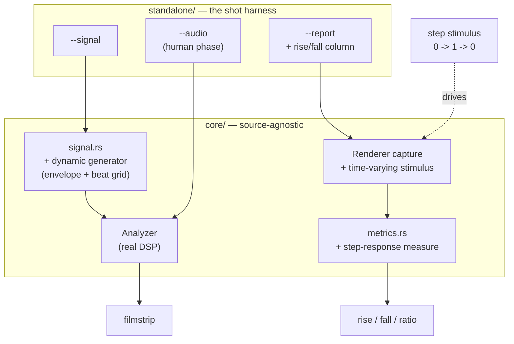

# 0037 — Verifying easing: a transient probe, a signal with dynamics, and the levels authors calibrate against

> **Status:** done — 2026-07-27 (five phase commits `ece3291` / `29bc035` / `6de5ad0` / `bca1457` /
> `b3f18a6`; passed Mode 4 review with **no blockers and no majors** — four minors, four nits. See
> **Close** at the bottom.)
> **Created:** 2026-07-26
> **Approved:** 2026-07-26 — ready for `dev` (a fresh session; the handoff is manual on purpose)
> **Owner skill(s):** dev, human
> **Related ADRs:** [0039](../../adrs/0039-verify-easing-with-a-transient-probe-not-a-committed-clip.md)
> (this plan's decision), [0035](../../adrs/0035-asymmetric-attack-release-easing.md) (the capability it
> makes checkable), [0019](../../adrs/0019-eased-parameters.md) (the `[smoothing]` surface)
> **Backlog entries closed:** [0013](../../design-backlog.md), the unresolved half of
> [0008](../../design-backlog.md), plus [0012](../../design-backlog.md) and [0014](../../design-backlog.md) as
> documentation
> **Amended 2026-07-27, after approval and after Plan 0034 closed.** Two additions, neither changing
> the decision, the phase order, or ADR-0039: **Phase 1 done-when 5** pins that the new time-varying
> stimulus must preserve the `spectrum` lighting `ca99cb1` just added to the very functions this
> phase rewrites, and **Phase 4 done-when 4** picks up the empirical half of
> [backlog 0015](../../design-backlog.md) while the user is already measuring real audio. The plan's
> premise was **re-verified** against the post-0034 tree: `capture_preset` still takes a single
> `&AnalysisFrame` (`core/src/render/mod.rs:1462`) and `--report` is still built on it
> (`standalone/examples/shot.rs:654`), so "the report is identical for any easing constant" holds.

## TL;DR

`[smoothing]` cannot be verified by anything except a human watching the app, because the capture
primitive holds one stimulus for every frame and every synthesized signal is a steady tone. This
plan gives the capture path a **time-varying stimulus**, adds a **step-response probe** whose
rise-versus-fall ratio makes ADR-0035's asymmetric easing directly observable, and adds one
**synthesized generator with musical dynamics**. The calibration question — what levels real material
actually produces — is closed by a `human` phase that measures the user's own audio and records the
numbers, rather than by committing a clip.

## Context & problem

ADR-0035 shipped `{ attack, release }`; 20 presets adopted it in `a070f5a` and more easing changed in
`8b5b2e0` and `66300d6`. **Not one of those edits was checked by anything automated.** Two mechanisms
cause that, and they are independent — fixing either alone leaves the gap open.

**1. The capture primitive holds one stimulus.** `Renderer::capture_preset(name, frame, frames)`
(`core/src/render/mod.rs:1397`) takes a single `&AnalysisFrame` and renders `frames` of it, so every
smoother converges before the pixels are read. `--report` is built entirely on that call
(`standalone/examples/shot.rs:591-650`), so it reports the *settled* response and is identical for
any easing constant — an identity, not a coincidence. Measured: `fragment_kaleido` reported bass
0.228 / mid 0.153 / treb 0.131 both before and after every constant in its `[smoothing]` table
changed, `warp` reverting from an asymmetric pair to symmetric, and `flash` gaining easing it never
had.

**2. No synthesized signal has dynamics.** Measured through Plan 0033 Phase 1's band report:

| `--signal` kind | bass min / mean / max |
|---|---|
| `bass:60` | 0.187 / 0.187 / 0.187 (zero variance) |
| `chord` | 0.058 / 0.059 / 0.060 |
| `noise:7` | 0.012 / 0.022 / 0.039 |
| `click:120` | 0.000 / 0.000 / **0.011** |

`click_track` is the only generator with real transients, and it peaks roughly 50x below the range
shipped presets are gained for.

The cost is concrete rather than theoretical. Authoring `rose_trails`, the content lane rendered five
`thickness` values from 1.10 to 2.30 — **including the untouched original** — and could not tell them
apart, because that preset's 1.25 spin against a max-decay feedback saturates any held stimulus
regardless of the value. It shipped a mid-range guess and said so in the file.

Two problems hide here and conflating them is what kept this unsolved: *does the easing behave*
(wants a controlled stimulus and a measurement) and *are gains calibrated for real material* (wants a
realistic one). This plan separates them and answers both.

## Decision

Per ADR-0039: a **deterministic transient probe** is the primary answer, because it tests the
capability directly rather than approximating the input. A **synthesized dynamic generator** follows,
so filmstrips exercise the DSP with material that rises and falls. A **committed reference clip is
rejected** — repository weight against "lightweight is a feature", plus an unanswered licensing
question — and the calibration numbers it would have supplied come instead from a `human` phase
measuring the user's own audio.

The probe measures the **frame**, not the parameter, so it is a floor on observability rather than a
guarantee: a preset whose visual response saturates still reads flat. That limitation is documented
in Phase 5 rather than left to be rediscovered.

**No CI gate.** Transient response has no fair universal floor — a slow ambient preset legitimately
has a slow rise — and `animation.rs` already shows that failure mode (backlog 0009). The number ships
as a column the content lane reads. A gate can follow once there is evidence about the range real
presets occupy.

## Architecture diagram



## Implementation phases

Each phase ships as its own commit. Phases 1-3 and 5 are `dev`; Phase 4 is the user's.

### Phase 1 — A time-varying stimulus, and a step probe end to end
- **Owner skill:** dev
- **What:** The walking skeleton. The capture path learns to drive a stimulus that *changes*, and one
  purpose-built fixture proves a step response is measurable end to end. This is the phase that
  closes the mechanism in backlog 0013.
- **Files touched:** `core/src/render/mod.rs`, `core/src/render/metrics.rs`,
  `core/tests/fixtures/`, `core/tests/` (a new test or an existing capture suite)
- **Done when:**
  1. The capture path can render N frames whose `AnalysisFrame` varies per frame — a step from
     silence to a held stimulus and back. Whether this is a new method beside `capture_preset` or a
     generalization of it is `dev`'s call, but **the existing `capture_preset` signature and
     behaviour stay working**, since `--report`, `sanity`, `reactivity` and `animation` all consume
     it; say which shape was chosen and why in the commit body.
  2. A **purpose-built fixture** (not a shipped preset) binds one parameter with a near-linear visual
     response, so the probe measures easing rather than a scene's saturation curve. It carries the
     same "do not tune, this is a baseline" header as `core/tests/fixtures/composite_*.toml`.
  3. Two variants of that fixture — one with a **scalar** `[smoothing]` entry, one with
     `{ attack, release }` — produce **measurably different** probe results, and the test asserts the
     *property* rather than a tuned constant: the asymmetric variant's fall-time-to-settle is
     **dramatically longer** than its rise-time, while the scalar variant's two are **equal within
     tolerance**.

     The arithmetic that property rests on, so `dev` can sanity-check the measurement rather than
     tune to it: a one-pole reaches 90 % of a step in `t = tau * ln(10) = 2.303 * tau`, and decays to
     10 % in the same time. So a scalar entry has a fall/rise ratio of **exactly 1.0** by
     construction, and `{ attack = 0.02, release = 0.7 }` has a *parameter-domain* ratio of **35**
     (0.046 s up, 1.61 s down — about 3 frames against 97 at 60 Hz). The **pixel-domain** ratio will
     differ, because the scene's response is not linear; do not assert 35. Assert that the scalar
     case is ~1.0 and the asymmetric case is far from it, and **state the measured pixel-domain
     numbers in the commit body** so the next change has a reference.
  4. Verified non-vacuous: with the two fixtures' `[smoothing]` tables swapped, the test fails.
  5. **Do not regress the spectrum stimuli** (added 2026-07-27, after this plan was approved). Plan
     0034's close landed `ca99cb1`, which made `shot`'s stimulus frames light the log-band `spectrum`
     array — `band_stimuli()` lights the slice its named band summarises (mirroring
     `reactivity.rs`), and `loud_frame()` fills it. **Those are the exact functions this phase
     rewrites to vary over time**, so a regenerated stimulus path can silently drop the lighting and
     undo the close's Major 2. Nothing would catch it: `--report` has no gate, and the in-crate
     suites build their own frames.

     So: every frame the new time-varying path emits **carries a populated `spectrum` alongside the
     scalars**, on the same convention. Prove it behaviorally rather than by inspection — a
     `bin()`-driven or `spectrum`-system preset must still move under the new path. The cheapest
     check is that `--report`'s existing columns for `Spectrum Comb` stay in the region `ca99cb1`
     measured (bass 0.084, mid 0.091, treb 0.047, onset 0.119, coverage 0.913) rather than collapsing
     toward the pre-fix values (0.040 / 0.030 / 0.016 / 0.000 / 0.664).

### Phase 2 — The probe becomes a `--report` column
- **Owner skill:** dev
- **What:** Makes Phase 1's measurement routine for the content lane, which is the point — a
  capability only `dev` can invoke does not close the lane's gap.
- **Files touched:** `standalone/examples/shot.rs`, `standalone/src/shot/json.rs`,
  `standalone/tests/shot_cli.rs`, `docs/capturing.md`
- **Done when:**
  1. `--report` gains a transient column (rise, fall, or their ratio — `dev` picks the presentation
     that reads best in the existing fixed-width table) computed for every preset in the loaded
     library, and `--json` carries the same values.
  2. Running it over the shipped set **separates presets that use `{ attack, release }` from those
     that do not** — at least directionally. **If it does not, that is a finding, not a failure:**
     say so with the numbers, because it would mean the probe cannot see through real presets'
     visual response and Phase 5's documented limitation is larger than expected.
  3. The added wall-clock cost of `--report` over the whole library is measured and stated. It
     already runs six captures per preset; if the probe pushes a full-library report past roughly
     double its current time, `dev` stops and surfaces it rather than absorbing it — the lane runs
     this command constantly and its cheapness is why.

### Phase 3 — A synthesized generator with musical dynamics
- **Owner skill:** dev
- **What:** Closes the stimulus half. One new generator in the source-agnostic core, so a filmstrip
  exercises the DSP with material that actually rises and falls.
- **Files touched:** `core/src/signal.rs`, `standalone/src/shot/args.rs`, `docs/capturing.md`
- **Done when:**
  1. A new `--signal` kind produces an **envelope-shaped, beat-gridded** signal with energy across
     all three bands, and is a pure function of its arguments (no wall clock; seeded randomness only,
     NFR §6) — the invariant every generator in `core/src/signal.rs` already holds.
  2. Its band levels have **real dynamics**, stated as a property because no honest threshold exists
     yet: `max / mean` per band is materially above 1, where every existing kind is at or near 1.0
     (`bass:60` is exactly 1.000, `chord` 1.017, `noise:7` 1.77). Report the measured min/mean/max
     for the new kind in the commit body, from the band report Plan 0033 Phase 1 added.
  3. `docs/capturing.md` states plainly that this kind exercises *dynamics* and is **not** evidence
     about real loopback levels — Phase 4 is what speaks to that.
  4. The existing `--signal` kinds are unchanged and their tests still pass.

### Phase 4 — Measure what real material actually produces
- **Owner skill:** human
- **What:** Closes backlog 0008 item 3 without committing a binary. Only the user has real music and
  a real playback path.
- **Done when:**
  1. The user runs `shot --audio <clip.wav> --strip 8` against one or more files of their own
     choosing — ideally a quiet track and a loud one — and captures the printed band min/mean/max.
  2. Those numbers are recorded in `docs/capturing.md` as the reference range authors calibrate
     gains against, with the material described generically (genre and rough loudness, not a
     filename) so the figures stay meaningful without shipping or naming the audio.
  3. If the measured levels differ substantially from what the shipped library is gained for, that is
     **captured as a new backlog entry**, not fixed here — re-gaining the whole set is a content-lane
     pass with its own scope.
  4. **Opportunistic, while the meter is out** (added 2026-07-27): the same clips answer the
     empirical half of [backlog 0015](../../design-backlog.md) — the band axis is **half linear**, so
     31 of the 64 bands are 23.4 Hz slices and the bottom two octaves, where kick and bass live, are
     the least-resolved part of the array. Note whether that is *audible as a limitation* when
     driving a `bin()` binding from the low end, or merely a documented curiosity. One or two
     sentences appended to backlog 0015 is enough. This is **not** a gate on the phase — it costs
     nothing extra here and would otherwise need its own listening session.

### Phase 5 — The doc sweep
- **Owner skill:** dev
- **What:** The required operator-doc sweep, plus the two documentation-only backlog items that
  belong with it.
- **Files touched:** `docs/capturing.md`, `docs/preset-palettes.md`, `presets/README.md`
- **Done when:**
  1. `docs/capturing.md` documents the transient column and **its limitation** — that it measures the
     frame rather than the parameter, so a preset whose visual response saturates (`rose_trails` is
     the worked example) reads flat regardless of its easing.
  2. **Backlog 0012 as a clarification, not a fix.** The entry's premise was wrong and was corrected
     at promotion: `coverage` (`core/src/render/metrics.rs:69`) uses `is_lit` (`:109`), which is
     `abs_diff > eps` — a symmetric difference from the corner background, so dark-on-light and
     light-on-dark measure identically. `docs/capturing.md` gains a sentence that a low `cover` is
     **expected and correct** for a deliberately sparse or ink-remapped look (`reaction_coral_bloom`
     at 0.128 is healthy), and that the column names suspects rather than convicting them.
  3. **Backlog 0014.** `docs/preset-palettes.md` gains a swatch table for the line scenes' cosine
     `hue` ramp, which is not a hue wheel and is currently undocumented. Note that the three line
     scenes ignore `[palette]` entirely, so this is their only colour control.

     > **Corrected at close (2026-07-27). The seed points this plan shipped with were wrong.** It
     > recorded *0.06 lavender, 0.17 turquoise, 0.30 cyan, 0.46 near-white/green, 0.62 gold,
     > 0.82 rose* — those name the ramp roughly **0.16 further along** than the shader produces.
     > `palette(t)` (`core/src/render/scenes/lines/mod.rs:117`) is three cosines phased
     > 0.10 / 0.42 / 0.62, which gives **0.06 magenta, 0.17 orchid, 0.30 cornflower blue, 0.46 aqua,
     > 0.62 mint, 0.82 amber**. `dev` caught it and did not settle it by arithmetic alone: a 15-point
     > rendered sweep measuring the median chromaticity of each frame's unclipped lit pixels tracks
     > `palette(t)` at every point and is nowhere near `palette(t + 0.16)`. Re-derived independently
     > at review from the shader plus the sRGB transfer curve, which lands inside the committed
     > table's own rows. **The 20-row table in `docs/preset-palettes.md` is the verified ramp** — read
     > it, not this paragraph's history.
  4. No count-bearing sentence is introduced that will re-drift.

## Data shapes

```rust
// illustrative — not the final interface

// Phase 1: the capture path gains a stimulus that varies per frame. Shape is
// dev's call; what matters is that capture_preset's own signature survives.
// A slice indexed by frame and a closure are both reasonable:
fn capture_preset_over(
    &mut self,
    name: &str,
    stimulus: &[AnalysisFrame],   // one per frame
) -> Result<Vec<CaptureImage>, RenderError>;

// Phase 1: the measurement, in core/src/render/metrics.rs beside frame_diff.
// Frames to reach `settle_frac` of the total change, up and down.
pub struct StepResponse {
    pub rise_frames: u32,
    pub fall_frames: u32,
}
// ratio = fall/rise. Scalar [smoothing] => 1.0 by construction; an
// { attack, release } pair => far from 1.0. The pixel-domain value differs
// from the parameter-domain one (35 for 0.02/0.7) and is not asserted.
```

## Risks & open questions

- **The probe may not see through real presets' visual response.** Phase 1 uses a purpose-built
  near-linear fixture precisely so the mechanism is provable; Phase 2 done-when 2 is where we find
  out whether it survives contact with the shipped set, and it is written to make a negative result a
  *reported finding* rather than a phase failure. `rose_trails` is the known-hard case and may simply
  remain unverifiable — its saturation is real, not a measurement artifact.
- **`capture_preset`'s neighbourhood is a production API changed for testing's benefit.** ADR-0039
  accepts this explicitly. The mitigation is done-when 1's requirement that the existing signature
  keeps working, since four suites depend on it.
- **A synthesized "musical" signal risks false confidence.** Someone will read a green probe over a
  dynamic signal as "my gains are right". Phase 3 done-when 3 and Phase 5 both push back on that in
  writing; it is a documentation risk, not a technical one.
- **`--report` is the lane's most-used command and this makes it slower.** Phase 2 done-when 3 makes
  that a stop-and-surface rather than a cost absorbed silently.
- **Open:** whether the transient column should eventually become a gate. Deliberately deferred —
  ADR-0039 records why, and Phase 2's measured spread over the shipped set is the evidence that
  decision would need.

## What this plan does NOT do

- **No committed audio clip**, and no `--audio` change. ADR-0039 records the repository-weight and
  licensing reasons; Phase 4 gets the numbers without the bytes.
- **No CI gate on transient response** — see the Decision section and backlog 0009's precedent.
- **No re-gaining of the shipped presets** even if Phase 4 shows the library is calibrated for the
  wrong levels. That is a content-lane pass and gets its own scope; Phase 4 done-when 3 routes it to
  the backlog.
- **No change to `--report`'s existing columns.** Settled per-band reactivity answers a different and
  still-useful question; ADR-0039 rejects overloading it.
- **No `coverage` code change** — backlog 0012's premise was corrected at promotion and it is a
  documentation item now.
- **No C ABI change, no new dependency, no scene changes.**

## Followups (after this lands)

- Whether the transient column earns a CI gate, decided against Phase 2's measured spread.
- A content-lane re-gain pass, if Phase 4's measurements say the library is calibrated wrong.
- Backlog 0010 (the kaleidoscope fold's out-of-range clamp) and 0011 (the fold axis versus `pan_*`) —
  unrelated to this plan, still waiting, and 0010 is ADR-worthy.

---

## Close (2026-07-27)

Passed Mode 4 review: **no blockers, no majors**; four minors, four nits. Five phase commits —
`ece3291` the time-varying stimulus + the step-response measure, `29bc035` the `--report` columns,
`6de5ad0` `--signal dynamic`, `bca1457` the doc sweep, `b3f18a6` the `human` measurement phase.
`[smoothing]` is observable: `Renderer::capture_preset_over(name, stimulus)` renders one frame per
`AnalysisFrame` and reads each back, and `metrics::step_response` turns a rise segment and a fall
segment into frames-to-settle each way. The identity ADR-0039 opened with — "the report is the same
for any easing constant" — is broken for the first time.

**The shape `dev` chose, and it is the right one.** `capture_preset_over` is a **sibling** of
`capture_preset`, not a generalization: the old method reads the GPU back once per *call*, the new
one once per *frame*, so folding them would have made `sanity`, `reactivity`, `animation` and
`--report` an order of magnitude slower. What they share is the reset preamble, extracted to
`reset_for_capture`, and `easing.rs::holding_one_stimulus_reproduces_capture_preset` pins the two
paths together byte-for-byte so they cannot drift.

**The measure works in linear light, and that is load-bearing rather than a detail.** sRGB's transfer
curve is concave, so a symmetrically eased parameter crosses 90 % of its *pixel* change early going
up and late coming down; `metrics.rs::measuring_in_srgb_would_fake_an_asymmetry` measures the same
synthetic ramp both ways and shows the sRGB reading skewed past 2x. Reusing `frame_diff` would have
made every scalar `[smoothing]` entry read asymmetric.

**Verified at review rather than taken on trust.** `fmt --check` and `clippy --workspace
--all-targets -D warnings` clean; `nextest --workspace` **263/263**; `core/tests/golden/`
**byte-untouched** across the whole range; `core/src/ffi.rs`, `core/src/render/scenes/mod.rs` and all
four manifests untouched, so **C ABI stays v4**, the `Scene` trait is unchanged and no dependency was
added; no preset `.toml` changed. **Non-vacuity reproduced independently**: swapping the two
fixtures' `[smoothing]` tables fails
`a_scalar_smoothing_entry_measures_symmetric_and_an_asymmetric_one_does_not` at
`core/tests/easing.rs:194` reporting *rise 3 fall 61 (ratio 20.33)* where it demands symmetry, and
the asymmetric fixture then reads *34 / 35 / 1.03* — the same four numbers `ece3291` recorded, from a
cold reviewer's tree. **Phase 2's statistic recomputed from the JSON report over `presets/`**:
asymmetric n=24 median `fall/rise` **1.02**, `fall > rise` **12/24**; scalar-only n=14 median
**0.61**, `fall > rise` **0/14** — matching `29bc035` to a rounding digit and one boundary preset,
and matching across a debug/release build change, so the probe is build-invariant too.

**Phase 2 done-when 2 came back a partial negative, exactly as the plan allowed for, and it was
diagnosed rather than absorbed.** The columns separate the two populations *directionally* and lose
the magnitude: `Smooth Pulse` (release 0.60 s) reads `26 / 31` where the purpose-built near-linear
fixture at release 0.5 s reads `3 / 61`, and several presets read `fall` **below** `rise`, which is
backwards for any easing and is the scene's own motion being measured. `dev` tested the obvious
confound — the 48-frame window — by rerunning at 96 and found the separation got **worse**
(scalar-only median 0.60 → 0.92) for double the wall clock, so truncation is not what is hiding the
magnitude. **Review tested the other confound `dev` did not**: the probe renders at 96x96 while the
rest of the report runs at 192x192, and backlog 0009 already documents thin-stroke figures nearly
vanishing at 96 px. Rebuilt with `PROBE_SIZE = 192` and re-run over `presets/`, **every reading moves
by at most two frames and most are identical** — so resolution is not a confound either and
`docs/capturing.md`'s "what it measures is temporal, so resolution buys nothing" is earned. The
scene's visual response is the cause, which is what ADR-0039 predicted and why the plan defers a CI
gate. **Not a failed phase; the documented limitation is simply larger than hoped.**

**Phase 4 (`human`) ran and produced the number the whole calibration question was waiting for.**
Real material peaks where a full-scale sine does (808 bass peak `0.190` against `bass:60`'s `0.187` —
the analyzer attenuates nothing) but its **mean** is `0.007`, about 25x lower. So percussive bindings
calibrated against a synthesized tone are roughly right and **continuous ones are badly over-gained**,
which `docs/capturing.md` now states with the full ladder from `--set 0.8` (~100x) down through
`dynamic:110` (~6x). Routed to **[backlog 0020](../../design-backlog.md)** rather than fixed, per the
phase's own done-when 3. Done-when 4's opportunistic half came back **positive**: driving
`Spectrum Comb` from the 808 clip collapses the whole kick-and-sub region into the first one or two
elements, so **[backlog 0015](../../design-backlog.md) is no longer documentation-only** and is now the
repo's next ADR-worthy design item.

**One edit outside a phase's file list, disclosed in its commit rather than absorbed:** one line of
`print_usage` in `standalone/examples/shot.rs`, enumerating the `--signal` kinds. Shipping a kind the
CLI's own `--help` denies is worse than the edit. **Accepted.**

**Minors** (none blocking; the first is fixed in this close commit):

1. **`README.md`'s pre-push gate timing went stale.** It says "**Measured warm wall time: ~28 s**
   (… tests ~26 s)". The `easing` binary and the now-1.49x-slower full-library `--report` inside
   `shot_cli` are both in the hook's *narrowed* set, and the narrowed set measures **38 s** warm at
   review (the full suite is 121 s, against the stated ~98 s — Plan 0034's suites contribute too).
   **Fixed here.** Whether `easing` should join the nine skipped GPU-heavy suites is a judgement for
   the next plan that touches the hook: it is a real gate on a real capability, and the dominant cost
   is actually `shot_cli`'s full-library report, not `easing`.
2. **`core/src/signal.rs:106-110`'s rustdoc describes a design the code abandoned.** The bullet list
   says "**hat**, on each off-beat: a very short broadband tick" and "**pad**: a three-note chord
   around 220-330 Hz" — but the implementation puts hats on *every eighth* with a ~60 ms decay and a
   one-tap high-pass, and the pad is *two voices five harmonics deep* from 165 Hz to 1.65 kHz. The
   inline comments 60 lines below explain, correctly and at length, why each of those was replaced.
   The public-facing doc comment is the one a reader meets first. `docs/capturing.md:330` is right.
3. **`docs/capturing.md`'s library-precedence section does not warn that level 4 is a stale cache**,
   and the transient columns are far more sensitive to that than the existing ones. Measured at
   review: a default `--report` (no `--presets`) resolves the `%APPDATA%` directory, which on this
   machine holds **36 presets against the repo's 38**, still carries a deleted one, and differs in
   every file — under it `Aurora` reads `1 / 1` and `Rose Bloom` `1 / 1`, against `34 / 16` and
   `24 / 26` from `presets/`. The `[source]` line does name the winner, but nothing says that
   directory is seeded **write-if-absent** and never refreshed (ADR-0014's known cost). One sentence
   there would have closed it.
4. **`docs/capturing.md:81`'s Trap 2 still quantifies the `--set` error as "roughly four times"** and
   does not link forward to the new "What real material actually produces" section, whose ladder puts
   `--set bass=0.8` at **~100x** a real mean. Both are true of different things (a peak versus a
   mean) and the new section is the one an author needs; the older number now reads as the whole
   story to anyone who stops at the traps.

**Nits.** `standalone/examples/shot.rs:655` falls back to `StepResponse { 0, 0 }` via
`transients.get(index).copied().unwrap_or(..)` for an index that cannot be out of range — a real
mismatch would report as "no transient" rather than failing. `core/src/signal.rs`'s determinism test
asserts the 0.9 bound with the message "peak normalization did not hold the 0.9 headroom", but this
generator deliberately does **not** peak-normalize (that was the third dead end); the bound is right,
the message names the mechanism it replaced. The same file's hat comment says "90 ms of decay" where
`exp(-t * 16)` is a 62 ms time constant and the commit body says 60 ms. And `capture_preset_over`
allocates one `CaptureImage` per stimulus frame with no bound — harmless at the probe's 96x96 x 102
frames (~3.8 MB), a foot-gun at a 4K target.

**⚠ Nothing new for the on-device pass.** This plan adds no per-frame work: the probe and the
generator live entirely in the capture/`shot` path, and the app's render loop is untouched.

**[ADR-0039](../../adrs/0039-verify-easing-with-a-transient-probe-not-a-committed-clip.md) accepted.**
Version **minor 0.18.0 -> 0.19.0** (a feature plan: a new core capture primitive, a new measure, a
new `--signal` kind, two new report columns).
