# 0038 — The line family's unreachable levers: `glow`, the readout's geometry, a level curve, and `log`

> **Status:** done — **closed 2026-07-28** after a Mode 4 review in a fresh session.
> All nine phases landed: `a1c67f4` (`glow`), `f3945be` (`span`/`baseline`), `c9121fd` (`curve`),
> `e31ae88` (`log`), `a3f5d04` (the doc sweep), `9739232` (the settle gate), `4863bdd` (the marked
> transient cell), `9a62754` (the non-finite guard), plus `8e84acf` + `ea781d0` (Phase 6, the
> `preset-author` adoption pass). **Verdict: no blockers; one major, five minors, two nits** — the
> major and three minors fixed in the close commit. Verified rather than taken on trust: `fmt
> --check` + `clippy --workspace --all-targets -D warnings` clean, `nextest --workspace`
> **273/273, 0 skipped**, `core/tests/golden/` **byte-untouched**, and `ffi.rs` / `scenes/mod.rs` /
> all four manifests untouched (**C ABI stays v4**, `Scene` unchanged, no new dependency).
> Both new guards reproduced non-vacuously at review: reverting `WINDOW` to 96 fails the shared
> probe on the asymmetric fall *only*, printing exactly the predicted `61`; deleting the
> `Easing::step` finite check fails `a_non_finite_value_cannot_poison_a_smoother_permanently`.
> **Backlog 0016, 0017, 0018 and 0019 all close here**;
> [0021](../design-backlog.md), [0022](../design-backlog.md) and [0023](../design-backlog.md) route
> onward, the last into [Plan 0039](../plans/0039-line-joins.md).
> **Created:** 2026-07-27
> **Approved:** 2026-07-27 — ready for `dev` (a fresh session; the handoff is manual on purpose)
> **Owner skill(s):** dev, human
> **Related ADRs:** [0040](../adrs/0040-spectrum-level-curve-applies-before-the-easing.md) (this
> plan's decision — curve before easing, as a bindable exponent),
> [0036](../adrs/0036-preset-reachable-spectrum.md) (the spectrum surface),
> [0037](../adrs/0037-internal-grid-is-a-resolution-not-a-shape.md) (the constraint on Phase 2),
> [0035](../adrs/0035-asymmetric-attack-release-easing.md) (the easing Phase 3 orders against)
> **Backlog entries closed:** [0016](../design-backlog.md), [0017](../design-backlog.md),
> [0018](../design-backlog.md), [0019](../design-backlog.md)
> **Amended 2026-07-27, after approval — [Plan 0037](done/0037-verifying-easing-transient-probe-and-dynamic-signal.md)
> Phase 1 landed first (`ece3291`), which changes one done-when for the better.** This plan was
> written assuming no transient probe existed, so Phase 3 could only pin ADR-0040's curve-vs-easing
> ordering with a unit test on the pure per-element step. `capture_preset_over` and `step_response`
> now exist, so **Phase 3 done-when 6** measures the ordering claim at the pixel level instead of
> leaving it as an argument. The dependency is on 0037 **Phase 1 only**, which has landed, so this
> is satisfiable today and does not wait on the rest of 0037. Nothing else changes: same decision,
> same phase order, same ADR. Note also that 0037's two `easing_*` fixtures are `parametric_curve`,
> so **Phase 1's byte-identical-goldens claim now covers them too** — `glow` touches that scene.
> **Amended again 2026-07-28, mid-plan, after Phase 3's done-when 6 measurement came back against
> [ADR-0040](../adrs/0040-spectrum-level-curve-applies-before-the-easing.md).** Phases 1–4 have
> landed (`a1c67f4`, `f3945be`, `c9121fd`, `e31ae88`) and Phase 3 did what done-when 6 told it to:
> it measured, found the ADR's justification falsified, retuned nothing, and routed to `architect`.
> The ruling is **[ADR-0040's Outcome](../adrs/0040-spectrum-level-curve-applies-before-the-easing.md#outcome-2026-07-28-after-plan-0038-phase-3s-measurement)**:
> **the shipped ordering stands and no scene code changes**, but its stated rationale ("a perceptually
> even fall") is wrong — both orderings are exponentials of identical shape, and the real difference
> is that ease-then-curve would make the effective release `release / curve`. Two things follow, and
> they are the only changes to this plan: **Phase 5's done-when 3 is rewritten** (it would otherwise
> document the falsified coupling), Phase 5 gains a done-when for the in-code comments that state the
> falsified mechanism, and a new **Phase 7** fixes the probe defect that produced the one part of the
> measurement that was an artifact. Phases 1, 2 and 4 are unaffected; Phase 6 is unaffected.
> **Amended a third time 2026-07-28, from the `architect` review of Phases 5 and 7.** Both phases met
> every done-when and neither is reopened. The review found the corrected mechanism **surviving in
> three places outside those two phases' file lists** — `shot.rs`'s probe comment, the shared probe's
> unreachable guard in `easing.rs`, and `step_response`'s cancellation argument — and one of them is
> corrupting a number the repo prints today: the asymmetric arm's fall reads **61 frames where its own
> fixture header says 69**, exactly the truncation Phase 7 fixed elsewhere. It also found that
> Phase 4's `log` makes `-inf` reachable from silence, where the render layer's smoother turns it into
> a **permanently** NaN binding. Two new phases follow, **both before Phase 6** because they change
> `--report`'s output and Phase 6 reads that table: **Phase 8** (the sweep and the truncated
> measurement) and **Phase 9** (the finite guard). Phases 1-5 and 7 are unaffected.

## TL;DR

Four levers that **already exist inside the engine** are not reachable from a `.toml`. `glow` is an
argument of `LineRenderer::draw` that all four line scenes pass as a hardcoded `1.0`. `SPAN_X` and
`BASELINE_Y` are constants that pin the spectrum readout to ~56 % of the frame width and throw
`mirror_reflect`'s copy against the top edge. And the level→length map is strictly linear, with no
curve reachable except through a workaround that silently discards the scene's own easing.

This plan turns all four into bound parameters, adds `log(x)` to the expression grammar, and does it
**behaviour-preservingly**: every new parameter's default reproduces today's constant exactly, so
Phases 1–4 leave every golden baseline byte-identical. Only Phase 6, a `preset-author` pass, changes
what anything looks like.

## Context & problem

The 2026-07-27 `preset-author` batch (design-backlog 0016–0019) found four gaps in one sitting, all
verified against code. They share a shape worth naming: **the capability is built and the wire is
missing**. None needs a new render idiom, a new pipeline, a `Scene`-trait change or a C-ABI change.

**1. `glow` is plumbed and hardcoded.** `LineRenderer::draw(queue, encoder, view, aspect, glow,
xform, segments)` takes it; `parametric.rs:291`, `lsystem.rs:288`, `star.rs:271` and
`spectrum.rs:639` **all pass `1.0`**. It is the renderer's per-segment falloff — *not* a post-process
bloom, which remains the separate, undesigned backlog 0005. This is the cheapest item in the batch
and the only one that is not spectrum-specific: it lands on the rose, the L-system and the star too,
which is most of the line library.

**2. The readout's width is a constant, and density makes it bite.** `SPAN_X = 1.0`
(`spectrum.rs:78`) means the figure spans 2 world units, which the line renderer maps to the frame
**height** — about **56 % of the width at 16:9**, less on an ultrawide. `zoom` is no substitute: it
scales about the frame centre, so widening also lifts the baseline and grows the elements. It
compounds with element count: `MAX_ELEMENTS = SPECTRUM_BINS` (`spectrum.rs:73`) is the right ceiling,
but at 1920x1080 those 64 elements share **1080 px** — **16.9 px each** — where the full width would
give 30. The width limit is what makes the top of the legal range unusable.

**3. The baseline is a constant, so the mirror is wrong on this scene.** `BASELINE_Y = -0.85`
(`spectrum.rs:81`), and the geometry mirror reflects across the **x-axis** (`lines/mod.rs:227`:
`let y = if reflected { -p[1] } else { p[1] }`). Bars stand upward from `-0.85`, so a reflected copy
stands downward from `+0.85` — against the **top edge**, not mirrored about a shared centre line as
`mirror_reflect` means on every other line scene. Rendered and confirmed. **`pan_y` cannot fix it**
for a structural reason: the mirror runs in `update()` on world coordinates while the view transform
is applied later in the shader, so panning moves the mirrored pair together.

**4. There is no level curve, and no way to write one.** `element_length` is `base + scale * level`
(`spectrum.rs:214`). Audio level is perceptually logarithmic, so a linear readout leaves everything
but the loudest element stubbed. The grammar has `sqrt` and `pow` but **no `log`**. And the only
reachable workaround — bind `base` from `bin(index)`, set `scale = 0` — **discards the `levels` that
`[spectrum] smoothing` eases**, because that easing is scene state, not a binding. So today the
choice is *curve or easing, never both*.

## Decision

Bind all four, and add `log(x)` to the grammar so the shaping vocabulary is not scene-specific.

Per [ADR-0040](../adrs/0040-spectrum-level-curve-applies-before-the-easing.md): the level curve is a
**bindable exponent** (`curve`, default `1.0`), and it applies **before** the per-element easing, so
the smoother operates in the displayed domain the way meter ballistics do. The rejected alternatives
— easing first, a structural named-mode key, both together, and `log` alone — are recorded there.

`span` and `baseline` are **bindable world-space parameters**, not a fit mode.

> **The binding constraint, and it is not negotiable.** A scene that reads its render target's aspect
> to size itself is exactly the [ADR-0037](../adrs/0037-internal-grid-is-a-resolution-not-a-shape.md)
> trap, which has already shipped twice in this codebase (Plan 0029 on the attractor, Plan 0033 on
> the composite). `span` sets a **world** span; the renderer's existing aspect handling maps it. The
> honest consequence, which Phase 5 documents rather than hides: *"fill the width"* is therefore
> aspect-dependent — `span` ≈ 1.78 fills a 16:9 frame and leaves an ultrawide short. That is correct
> behaviour for a world quantity, and a `fit`/`auto` mode is **explicitly out of scope**.

**Everything defaults to today's constant.** `glow = 1.0`, `span = 1.0`, `baseline = -0.85`,
`curve = 1.0`. So Phases 1–4 are behaviour-preserving, and "every golden baseline byte-identical" is
an assertable done-when through Phase 5 — which is what makes this safe to land before Plan 0037's
transient probe exists.

## Architecture diagram

```mermaid
flowchart TD
    subgraph preset["preset .toml"]
        P["[params]<br/>glow · span · baseline · curve"]
        E["expression grammar<br/>+ log(x)"]
    end
    subgraph scene["SpectrumScene::update()"]
        DS["downsample<br/>64 bands -> N levels"]
        CV["curve<br/>level^curve"]
        EA["ease<br/>[spectrum] smoothing"]
        EL["element_length<br/>base + scale * level"]
        BU["build<br/>bars | polyline | radial_ring"]
    end
    subgraph render["LineRenderer"]
        DR["draw(.., glow, ..)"]
    end

    P --> CV
    P --> EL
    P -.span · baseline.-> BU
    P --> DR
    E --> P
    DS --> CV --> EA --> EL --> BU --> DR

    style CV fill:#2d4a22
    style EA fill:#2d4a22
```

The green pair is ADR-0040's ordering decision: **curve then ease**, not the reverse.

## Implementation phases

Each phase ships as its own commit. Phases 1–5 and 7–9 are `dev`; Phase 6 is the user's. **Phases 8
and 9 run before Phase 6**, because Phase 8 changes what `--report` prints and Phase 6 reads that
table before and after its work.

### Phase 1 — `glow` reaches all four line scenes
- **Owner skill:** dev
- **What:** The cheapest win and the widest, so it goes first: it establishes the param-plumbing
  pattern on four scenes at once with no geometry or timing risk. Closes backlog 0019.
- **Files touched:** `core/src/render/scenes/lines/{parametric,lsystem,star,spectrum}.rs`
- **Done when:**
  1. `glow` is a bound parameter on **all four** line scenes — in each scene's `PARAMS` const beside
     its `set_param` arm, so Plan 0019's drift guard covers it — replacing the hardcoded `1.0` at
     each `draw` call site.
  2. **Default is exactly `1.0`, and every golden baseline is byte-identical with no re-bless.** This
     is the phase's real assertion: a `glow` regression would otherwise be invisible.
  3. A rendered check that it is non-vacuous: one capture at a clearly different `glow` differs
     materially from the default. State the measured `frame_diff` in the commit body.
  4. The commit body says plainly that this is the renderer's **per-segment falloff**, not the post
     bloom of backlog 0005, so the two are not later mistaken for each other.

### Phase 2 — `span` and `baseline` become world-space parameters
- **Owner skill:** dev
- **What:** Retires the two constants pinning the readout's geometry. Closes backlog 0016 and 0018.
- **Files touched:** `core/src/render/scenes/lines/spectrum.rs`
- **Done when:**
  1. `span` and `baseline` are bound parameters (in `PARAMS`, whole-figure rather than per-element,
     so a series aimed at either takes its `index = 0` value per the existing trait rule), defaulting
     to **exactly** `1.0` and `-0.85`. `SPAN_X` and `BASELINE_Y` are gone as the source of truth.
  2. **Every golden baseline byte-identical, no re-bless.**
  3. **`baseline = 0` makes `mirror_reflect` mirror about the frame centre** — the symmetric
     "landscape and its reflection" figure — verified by a rendered capture, not by argument. This is
     the 0018 fix and it deliberately costs **no new mirror semantics**: the mirror still reflects
     across the x-axis exactly as it does on the other three line scenes, and moving the baseline to
     the axis is what makes that mean the right thing.
  4. Both are **world** quantities: `grep` the diff and confirm **no aspect or target size is read**
     anywhere in this scene to compute them (ADR-0037). A test or a stated inspection is fine; the
     claim must be checked, not assumed.
  5. `span` is documented as applying to `bars` and `polyline`, and being a **no-op on
     `radial_ring`** — consistent with `radius` already being a no-op on the other two. Same for
     `baseline` on the ring.

### Phase 3 — the level `curve`, applied before the easing
- **Owner skill:** dev
- **What:** ADR-0040's decision. The phase that makes a dB-like readout authorable *without*
  surrendering `[spectrum] smoothing`. Closes backlog 0017.
- **Files touched:** `core/src/render/scenes/lines/spectrum.rs`, `core/tests/` (a unit test on the
  ordering), `core/tests/fixtures/` (a **spectrum** easing fixture for done-when 6)
- **Done when:**
  1. `curve` is a bound parameter, default **exactly `1.0`**, applied as `level.max(0).powf(curve)`
     **to the downsampled level before the smoother**, per ADR-0040. The per-element pipeline reads
     `downsample -> curve -> ease -> element_length`.
  2. **Total on the hot path**: the level is floored at `0` and the exponent clamped to
     `[0.05, 4.0]` before the `powf`, so no author expression yields `pow(0, 0)`, `pow(0, -1)`, a
     `NaN` or an infinite length. Covered by a unit test over degenerate inputs, in the style of the
     grammar's existing totality tests.
  3. **The ordering is pinned by a test, because it is the ADR's whole content and is otherwise
     invisible.** A unit test over the pure per-element step asserts that curving-then-easing differs
     from easing-then-curving for a non-unit `curve` and a non-instant smoother — and **fails if the
     two are swapped**. Assert the *property*, not a tuned constant.
  4. `curve = 1.0` is exactly the identity (`powf(x, 1.0) == x`), so **every golden baseline is
     byte-identical, no re-bless**.
  5. The commit body records the interaction authors will hit first, with the arithmetic: measured
     typical levels are ~0.02–0.05, and at `curve = 0.5` a level of `0.03` becomes `0.173` — a
     **5.8x** boost — so a preset adopting a curve must bring `scale` down by roughly that factor.
     This is the reason the default must stay `1.0`.
  6. **Measure the ordering with Plan 0037's probe, not only with the unit test above** (added
     2026-07-27 — see the header note). Done-when 3 proves the ordering is *implemented as
     specified*; it cannot show the chosen order produces the motion ADR-0040 claims. Plan 0037
     Phase 1 has landed `Renderer::capture_preset_over(name, stimulus)` and
     `metrics::step_response(rise, fall) -> StepResponse` (`ece3291`), so that claim is now directly
     measurable and should not ship on argument.

     Add a **spectrum** easing fixture — the two `easing_*` fixtures Plan 0037 added are
     `parametric_curve` and cannot exercise this path — and drive it with a step whose frames
     populate the **`spectrum` array**, not just the scalar bands, since the element levels come from
     `frame.spectrum`. Capture the fall under a non-unit `curve` **both ways round** and record
     `StepResponse` for each in the commit body.

     **The expected result is ADR-0040's property, stated as a property:** curve-then-ease should
     produce a fall whose measured progress is closer to even across its travel than ease-then-curve,
     which should show a fast start and a long crawl. **No threshold is asserted** — this plan has
     not earned one, and inventing a number here is the Plan 0033 mistake.

     **If the measurement contradicts ADR-0040, stop and route it to `architect`.** Do not retune
     `curve`, the fixture, or the smoother until the numbers agree — a falsified ADR is a finding
     worth an Outcome section (the ADR-0034 and ADR-0036 precedent), not a tuning exercise. Say so
     with the numbers.

### Phase 4 — `log(x)` joins the expression grammar
- **Owner skill:** dev
- **What:** The shaping vocabulary stops being scene-specific. Serves every system, not just this
  scene. Deliberately **after** Phase 3, because it does not substitute for the `curve` param — an
  expression cannot reach the scene's internal `levels`.
- **Files touched:** `core/src/preset/expr.rs`, `core/tests/preset.rs`, `docs/presets.md`
- **Done when:**
  1. `log(x)` is a registered function of **arity 1**, natural logarithm, so `log(0.1, 2)` is the
     same surfaced `WrongArity` load error as any other call and a bare `log` is still
     `UnknownIdent`. `VAR_NAMES`/function-count claims in docs are updated count-free where possible.
  2. It follows **`sqrt`'s existing posture** on degenerate input rather than inventing a new rule:
     `log(0)` is `-inf` and `log(-1)` is `NaN`, documented, with `select`/`max` as the guard idiom.
     Unit-tested at both, plus an exact interior value.
  3. `docs/presets.md` carries the worked dB example, since that is why it exists:
     `20 * log(x) / 2.302585` is decibels, and `log(0.03)` = `-3.5066` gives **-30.5 dB** for a
     typical measured level. State that the constant is `ln(10)` and that there is no `log10`.
  4. The hot-path panic pragma on `expr.rs` stays intact — no new `unwrap`/indexing.
  5. No existing expression changes meaning; the `preset` suite still passes and every shipped preset
     still loads warning-free.

### Phase 5 — the doc sweep
- **Owner skill:** dev
- **What:** The required operator-doc sweep. The three bolded rows of the architect's Mode 4 table
  are all in play here, and this lane's whole design rests on them being true.
- **Files touched:** `presets/README.md`, `docs/presets.md`, `docs/preset-palettes.md` (if `glow`
  belongs beside the colour surface), `core/src/render/scenes/lines/spectrum.rs` (comments only, per
  done-when 6)
- **Done when:**
  1. `presets/README.md`'s per-system roster carries `glow` on **all four** line scenes and `span`,
     `baseline`, `curve` on `spectrum`, with defaults and the whole-figure/per-element distinction.
  2. The `span` aspect consequence is stated honestly: it is a **world** quantity, so `span ≈ 1.78`
     fills a 16:9 frame and leaves an ultrawide short; there is deliberately no `fit` mode, and why.
  3. **Rewritten 2026-07-28 — do not document the coupling as ADR-0040's Consequences section states
     it.** The `curve`↔`scale` interaction is documented with the 5.8x figure from Phase 3: that one
     is real, it is an **amplitude** coupling, and it is the interaction an author hits first. The
     `curve`↔`[spectrum] smoothing` coupling is documented as
     [ADR-0040's Outcome](../adrs/0040-spectrum-level-curve-applies-before-the-easing.md#outcome-2026-07-28-after-plan-0038-phase-3s-measurement)
     **corrects** it: under the shipped ordering the smoother's state *is* the displayed quantity, so a
     fall's time constant is exactly `release` **for every value of `curve`** — the two knobs are
     independent in time. **Do not repeat "the same `release` looks different once a curve is
     engaged"**; that describes the rejected ordering, where the effective release would have been
     `release / curve`. Nor claim an even fall: an exponential covers the first half of its travel in
     30 % of its settling time (`ln2 / ln10`) at any `curve`, and no ordering changes that.
  4. `baseline = 0` is documented as the way to get a centre-mirrored readout, since that is the
     non-obvious fix for a thing that reads as a bug.
  5. No count-bearing sentence is introduced that will re-drift (the "Seven systems" → "Eight
     systems" lesson from Plan 0034's close).
  6. **Added 2026-07-28. No comment left in the code states the falsified mechanism** — the sentences
     are wrong, not merely stale, and a reader has no way to know that from the source. Three sites,
     all comment-only, no behaviour change and goldens untouched:
     - `spectrum.rs` `update()`'s ordering comment ("a slow `release` reads as a perceptually even
       fall. Easing first instead would make a decaying element drop fast through the top of its
       travel and then crawl through the bottom") → the corrected rationale: the smoother's state *is*
       the displayed quantity, so `release` names the same duration at any `curve`, where easing first
       would have made it `release / curve`.
     - The scene unit test's doc comment, which says "during a fall the curve-first value is the
       higher of the two" while the assertion three lines down asserts it is **lower**. The assertion
       is right; the prose is backwards **and** rests on the falsified narrative. Fix the prose, keep
       the assertion.
     - That test's failure message ("the compressive curve is what holds the rejected order up near
       the top of its travel before it crawls") → the real reason the rejected order sits higher: it
       decays at `curve · (1/release)`, so it is simply slower.

### Phase 6 — adopt the new levers in the curated set
- **Owner skill:** human
- **What:** Runs the `preset-author` lane over the shipped presets now that the levers exist. Kept
  out of `dev`'s phases on purpose — this is content, and ADR-0017's lane split holds.
- **Done when:**
  1. At least one `spectrum_*` preset adopts `curve` and `span`, and at least one uses
     `baseline = 0` for a centre-mirrored figure — chosen by eye, verified with `--signal` (not
     `--set`, which cannot drive the spectrum array).
  2. `glow` is used on at least one non-spectrum line preset, since it lands on the whole family and
     the plan should not ship it unexercised.
  3. The behavioral gates still pass over the embedded set (`sanity`, `reactivity`, `animation`,
     `distinctness`), and `--report` is run before/after with the numbers stated.
  4. Any preset whose `scale` is retuned for a `curve` says so in its header, with the factor.

### Phase 7 — the transient probe cannot report a truncated window as a settled one
- **Owner skill:** dev
- **Added 2026-07-28**, from the ADR-0040 ruling. Runs after Phase 5; independent of Phase 6, which
  does not use the transient probe.
- **What:** Phase 3's evenness numbers were an artifact of the instrument, not a property of the two
  orderings. `metrics::frames_to_settle` normalizes against **the segment's own last frame**, so a
  response still travelling at the end of the window supplies a short "total" and crosses every
  threshold early — harder at 0.9 than at 0.5, which is precisely what inflates an evenness reading.
  The rejected arm's effective time constant is `release / curve` = 1.0 s and 2.0 s against a
  `WINDOW` of 1.6 s, so it had 20 % and 45 % of its travel left at the frame taken as settled.

  **The existing guard cannot fire.** `assert!(response.fall_frames < WINDOW)` — commented "the
  measurement is clamped rather than measured" — is unreachable by construction: normalizing against
  the last frame guarantees the threshold is crossed inside the segment, so the return is always
  `< len`. Nothing in Plan 0037's harness can distinguish *settled at frame k* from *still moving at
  frame k*, which is the whole difference between a measurement and a truncation. That is Plan 0037's
  probe rather than this plan's scene, but it is what produced this plan's one wrong conclusion, so it
  is fixed here rather than filed.
- **Files touched:** `core/src/render/metrics.rs`, `core/tests/easing.rs`, `docs/capturing.md`
- **Done when:**
  1. **A settle measurement is normalized against a settled reference, not against whichever frame the
     window happened to end on.** The straightforward shape: the probe's stimulus grows a **settle
     tail** — the final stimulus held well past the measured window — and both directions normalize
     against a frame from that tail. Then "did not settle inside the window" surfaces as the metric
     running to the end of its segment, and the existing `fall_frames < WINDOW` guard becomes a real
     assertion instead of a tautology. Any shape that makes the two states distinguishable is
     acceptable; state the rule in a comment, because the next reader will assume the current one.
  2. **Unit-tested in `metrics.rs` against a synthetic one-pole whose τ exceeds the window** — the
     case the existing test cannot reach. `frames_to_settle_matches_the_one_pole_arithmetic_in_both_directions`
     runs τ = 0.25 s over 120 frames = 8τ, where truncation is ~0.03 % and invisible; that
     configuration is exactly why the defect survived. Assert that a τ of, say, 2 s over the same 120
     frames is **reported as unsettled** rather than as a plausible frame count.
  3. **Phase 3's done-when 6 is re-measured under the fixed instrument and the corrected numbers are
     recorded in the commit body**, replacing `c9121fd`'s. Either window is fine, with the arithmetic
     stated: reaching 99 % of travel takes `4.6 · release / curve`, so at the fixture's
     `release = 0.5` and `curve = 0.5` the rejected arm needs **4.6 s ≈ 276 frames** of fall (and
     9.2 s ≈ 552 at `curve = 0.25`) against today's 96 — or drop the fixture's `release` to **0.15 s**,
     which brings the rejected arm's settle to 1.38 s ≈ 83 frames and fits the window unchanged. If
     the `release` route is taken, `PROBE_EASING` and the twin-check test move with it; the fixture
     header's "do not tune" stands against tuning for a *result*, not against re-scoping the
     instrument so it is valid.
  4. **Stated as a property, not a threshold:** with both arms measured to settlement the two falls
     have the **same shape** — for a step to silence both are exponentials in the displayed level —
     and differ only in **effective speed**, the rejected arm taking about `1/curve` times as long.
     Fall-evenness should therefore come out **equal for the two arms and unchanged by `curve`**,
     near the pure-exponential reference the test already names. If it does not, that is a second
     finding and routes to `architect` the same way this one did.
  5. `docs/capturing.md`'s transient-probe section states the limitation and the rule from done-when 1,
     so the next person measuring an easing knows what the numbers do and do not survive. It is the
     operator doc for this harness and it currently says nothing about window length.

### Phase 8 — the corrected mechanism reaches the two callers Phase 7 did not touch

- **Owner skill:** dev
- **Added 2026-07-28**, from the `architect` review of Phases 5 and 7. Runs **before** Phase 6.
- **What:** Phase 7 fixed the instrument and Phase 5 swept the comments, but each worked from its own
  file list, and the falsified mechanism lives in three places outside both. One of them is not a
  comment: **the shared probe is itself truncated.** `easing_asymmetric.toml` is `release = 0.5` and
  `WINDOW` is 96 frames (1.6 s) — 3.2 τ, a **4.1 %** residual, above Phase 7's own `SETTLE_TOL` of
  `0.02`. The arithmetic: truncation moves the 0.9 crossing from `-0.5·ln(0.1)` = 1.151 s ≈ **69
  frames** to `-0.5·ln(0.137)` = 0.99 s ≈ **61**, and the test prints 61 against a fixture header that
  says "glides back down over about 69". The scalar arm is fine and stays fine — `brightness = 0.25`
  is 6.4 τ inside the same window, a 0.17 % residual.
- **Files touched:** `core/tests/easing.rs`, `core/src/render/metrics.rs` (doc comment),
  `standalone/examples/shot.rs`, `docs/capturing.md`
- **Done when:**
  1. **The shared probe's `fall_frames < WINDOW` assertion is replaced by `segment_settled` on both
     arms** (`easing.rs:188-193`). That assertion is unreachable by construction — Phase 7's whole
     argument — and its message still says "clamped rather than measured", the wording
     `docs/capturing.md` now names as the trap. Its replacement must **fail on today's `WINDOW`**;
     if it passes, `segment_settled` is not measuring what Phase 7 says it measures and that is a
     finding, not a green check.
  2. **`WINDOW` widens until both arms are settled.** `180` frames (3 s = 6 τ of the slowest constant
     either fixture uses, a 0.25 % residual — the same margin the scalar arm already has) is the
     stated target; any value clearing `0.5·ln(50)` = 1.956 s ≈ **118 frames** with margin is
     acceptable. **The existing ratio bounds are expected to survive unchanged** — settled, the
     asymmetric arm reads ≈ 69/3 ≈ 23 against its `> 3.0` and `> 2.5x scalar` bounds, and the scalar
     arm barely moves from 34/35. Retuning a bound is a signal something else changed; say so rather
     than adjusting it quietly. State the measured before/after frame counts in the commit body.
  3. **The suite's wall clock is reported, not assumed.** `WINDOW` multiplies five `step_stimulus`
     captures; the measured baseline is **9.0 s warm** for `--test easing`, and this suite is *in* the
     pre-push subset (`.githooks/pre-push` does not exclude it). Estimated ~1.8x; if it lands far
     above that, say so — a slower gate is a real cost and the `release`-shortening route from
     Phase 7 done-when 3 is still available.
  4. **`shot.rs:557-560` stops stating the falsified mechanism.** "A release constant longer than
     about 0.35 s ... reads **clamped** rather than measured — the asymmetry still shows, the
     magnitude understates" is the corrected sentence verbatim. Replace it with what actually happens:
     a plausible smaller number, biased unevenly across thresholds. The arithmetic for that comment:
     at `PROBE_WINDOW` = 48 (0.8 s), a release above ≈ **0.2 s** already leaves more than
     `SETTLE_TOL` undone.
  5. **`--report` marks a truncated transient cell rather than printing it bare.** `segment_settled`
     exists and the caller publishing numbers for the whole shipped library does not call it. A
     suffix meaning *at least this many* is enough — do not suppress the number and do not widen
     `PROBE_WINDOW` (its comment is right that this is a direct multiplier on the report's wall
     clock). **Report how many cells mark, and over which presets.** Expect many: a 0.8 s window
     truncates any release above ~0.2 s, and most of the ADR-0035 pairs in the set are above that.
     **If cells mark for a reason other than window length** — a scene whose own motion makes the
     response non-monotone, so `segment_settled` refuses it as *not decaying* rather than as *not
     finished* — **say so and leave it marked.** Do not loosen `tol` to make the table quieter; that
     is the same tuning-until-it-agrees the Phase 3 instruction forbade.
  6. **`step_response`'s doc comment stops promising a cancellation that does not happen**
     (`metrics.rs:145-150`: "only equal windows make that bias cancel"). It is false for exactly the
     shipped asymmetric case — with `attack = 0.02` the rise settles in 80 τ and carries **no** bias,
     so there is nothing for the fall's 4 % to cancel against, which is why 61 stood. Equal windows
     are still the right default; the reason is weaker than stated and the honest one is
     `segment_settled`.
  7. **`docs/capturing.md`'s measured snapshot gets the caveat it now needs.** The 2026-07-27 figures
     it quotes — the 1.02 / 0.60 medians, and `Smooth Pulse` "with a 0.60 s release, reads 26 / 31" —
     were all taken at `PROBE_WINDOW` = 48, and 0.6 s against 0.8 s is 1.33 τ with ~26 % of travel
     undone. The page already explains the defect; it must not go on quoting numbers produced by it
     without saying they are subject to it. The `easing` row in the harness table is updated if
     `WINDOW` moved.

### Phase 9 — a non-finite value cannot poison a smoother permanently

- **Owner skill:** dev
- **Added 2026-07-28**, from the same review. Independent of Phase 8; also before Phase 6.
- **What:** Phase 4 shipped `log`, and `log(0)` is `-inf` — which silence produces every time the
  music stops. Traced end to end: `ParamSmoother::smooth` (`render/mod.rs:317`) seeds its state with
  the raw value, then `Easing::step` (`preset/schema.rs:236`) computes `held + alpha * (raw - held)`
  = `-inf + alpha·NaN` = **NaN**. NaN is absorbing here: `raw > held` is false for *every* `raw`, so
  the release branch is taken and the result stays NaN. **The binding is dead for the rest of the
  preset's run** — audio returning does not recover it, only a preset switch (which resets the
  smoother) does. It needs the param to be listed in `[smoothing]` with a positive constant; an
  unlisted param passes `-inf` through and recovers on its own.

  `sqrt(-1)` could already reach this, so the defect predates Phase 4 — but `sqrt` needs a contrived
  negative argument where `log` needs silence, and `docs/presets.md:530` currently calls the result
  "an undefined-looking visual", which describes a frame, not a permanent one.
- **Files touched:** `core/src/preset/schema.rs`, `core/tests/preset.rs`, `docs/presets.md`
- **Done when:**
  1. **The guard goes in `Easing::step`, not in `ParamSmoother`.** That function is documented as the
     single implementation of this vocabulary and both smoothers call it, so one guard covers the
     render layer and the spectrum scene's per-element path alike. It also matches the posture already
     three lines above it, where a non-finite `tau` passes `raw` through.
  2. **Both operands are guarded, because guarding only `raw` does not fix it.** With `held = -inf`
     and a finite `raw`, `raw > held` selects `attack` and `held + alpha * (raw - held)` is
     `-inf + inf` = NaN — so a run that ever stored `-inf` is still poisoned on the *next* frame.
     A non-finite `held` **or** `raw` returns `raw`: a snap, which is what a smoother with no valid
     state should do.
  3. **Unit-tested as the reachable sequence, not as an abstract edge:** silence → `-inf` held →
     audio returns → the binding tracks the finite value again. Assert the recovery, since permanence
     is the actual defect; asserting only "one frame of NaN is avoided" would pass on a fix that
     leaves the state poisoned.
  4. **`docs/presets.md`'s dB section says *permanent*.** "Propagates into a parameter as an
     undefined-looking visual" understates a binding that never comes back. Keep the guard idiom as
     the advice — flooring the input is still the right thing to write — and state what the engine
     now does if you don't, so the two are not confused.
  5. No behaviour changes for any finite input: the `preset` suite still passes, every shipped preset
     still loads warning-free, and the goldens are byte-identical with no re-bless.

## Risks & open questions

- **The `curve`/easing coupling is a documented price, not a solved problem** (ADR-0040's main
  negative). An author who changes `curve` and then finds their `release` feels wrong has hit a real
  interaction. Phase 5 documents it. **Since Plan 0037 Phase 1 landed, it is also measurable** —
  Phase 3 done-when 6 exercises exactly that coupling, so the plan now produces numbers for it
  instead of only a warning. The claims stay stated as *properties* regardless: the probe measures
  the frame, not the parameter, so it is a floor on observability rather than a guarantee.
- **ADR-0040 could be wrong, and Phase 3 is now able to find that out.** Curve-then-ease is a design
  bet made from meter-ballistics reasoning, not from a measurement of this engine. Done-when 6 exists
  so the bet is checked before the surface ships to authors; its instruction on a contradiction is to
  **stop and route to `architect`**, not to tune until the ADR looks right. A falsified ADR gets an
  Outcome section, which this repo has done twice (0034, 0036) and is not a failure.

  > **RESOLVED 2026-07-28 — it was wrong, and this risk entry did its job.** Phase 3 measured, found
  > against the ADR, retuned nothing and routed to `architect`. The ruling is
  > [ADR-0040's Outcome](../adrs/0040-spectrum-level-curve-applies-before-the-easing.md#outcome-2026-07-28-after-plan-0038-phase-3s-measurement):
  > **the ordering stands, no scene code changes, and the justification is replaced** — both orderings
  > produce exponentials of identical shape, so neither is "more even"; the real difference is that
  > ease-then-curve would make the effective release `release / curve`, while the shipped order leaves
  > `release` naming the same duration at any `curve`. Phase 5 done-when 3 and 6 carry the correction;
  > Phase 7 fixes the probe defect that made one half of the measurement an artifact. The general
  > lesson, worth more than the ruling: **a claim about the shape of a one-pole response is arithmetic
  > before it is a measurement** — two lines of algebra on `Easing::step` settle it with no GPU, and
  > would have caught this at design time.
- **Phase 2 is the ADR-0037 trap's natural habitat.** The whole point of `span` is framing, and the
  tempting implementation is "ask how wide the target is". Done-when 4 exists specifically to catch
  that, and it should be checked by grep rather than trusted.
- **`glow`'s visual range is unknown.** Nothing has ever varied it, so its useful span is
  unmeasured — Phase 1's non-vacuity capture is the first data point. If it turns out to be
  uninteresting across its range, that is a finding worth stating rather than quietly shipping a
  no-op param.
- **Unmeasured:** the per-frame cost of 64 `powf` calls is asserted negligible, not measured. It is
  almost certainly noise against the existing per-element work, but no number is claimed.

## What this plan does NOT do

- **No post-process bloom.** Backlog 0005 is a separate, undesigned stage; Phase 1 ships the
  renderer's existing per-segment falloff and the commit says so explicitly.
- **No `fit`/`auto` width mode.** Out of scope by decision, not by omission — it is the ADR-0037
  trap.
- **No true dB mode on the scene.** The exponent approximates the shape; a named `db` family is
  recorded in ADR-0040 as a reasonable later addition if the approximation proves insufficient.
- **No change to the band axis itself.** Backlog 0015 — the half-linear resolution profile — is DSP,
  is ADR-worthy in its own right, and is deliberately not bundled here.
- **No new mirror semantics.** Phase 2 fixes 0018 by moving the baseline, not by special-casing this
  scene's mirror.
- **No `log10`**, no new constants beyond what Phase 4 documents, and **no C-ABI change** (stays v4),
  no `Scene`-trait change, no new dependency.
