# 0039 — Line joins: the stroke stops coming apart at every vertex

> **Status:** done 2026-07-28 — phases 1-4 landed in four commits (`5dfc81c` the per-endpoint flag
> and the shader extension, `b184021` the spectrum polyline plus `core/tests/line_joints.rs`,
> `12e6ab2` the rose / L-system / star, `f78ff2f` the doc sweep) and passed the Mode 4 review:
> **no blockers**, one major, three minors, two nits. Verified rather than trusted: the Phase 1
> byte-identical claim (no line-scene baseline moved), the fail-first evidence for the new pixel
> test (re-run at close — joint `0.6431`/`0.6440` against interiors `0.4885`/`0.4588`), every
> per-producer flag-pattern assertion, and that the join extension takes its aspect from the render
> target's uniform rather than from any grid (ADR-0037). **[ADR-0041](../../adrs/0041-line-joins-are-per-endpoint-on-the-segment-instance.md)
> is accepted, and carries an Outcome section**: its connectivity table's `star_rosette` row is
> wrong — the contact points are shared between adjacent petals, so the rosette is a closed chain and
> Phase 3 flagged only half its joints. That is the review's one major, left unfixed deliberately and
> captured as design-backlog **0024**. **Phase 5 (`human`) is open** — `spectrum_ridge` still ships
> the compromise `thickness = 4.2 + …`, and the constraint that forced it is gone.
> **Created:** 2026-07-28
> **Owner skill(s):** dev, human
> **Related ADRs:** [0041](../../adrs/0041-line-joins-are-per-endpoint-on-the-segment-instance.md)
> (this plan's decision — a per-endpoint joined flag, extend in the shader),
> [0007](../../adrs/0007-line-geometry-generators.md) (the instanced-quad primitive being extended),
> [0023](../../adrs/0023-golden-drift-guard-uses-frozen-fixtures.md) (the re-bless discipline)
> **Backlog entry closed:** [0023](../../design-backlog.md)

## TL;DR

Every line scene draws each segment as an independent quad with its own perpendicular and no join
geometry, so at each direction change the outer corners diverge and leave a wedge of
`width * tan(theta/2)`. `SegmentInstance` gains a per-endpoint **joined** flag; the vertex shader
extends the quad along its own direction by the half-width **only at a flagged end**. Producers with
isolated segments flag nothing and are byte-identical.

## Context & problem

Reported by a user watching `spectrum_ridge` full-screen: "there is gaps between lines, looks very
strange" — a thin dark tick across the stroke at every vertex, on gentle slopes as well as sharp
ones. Confirmed in the shader, not inferred (`core/src/render/scenes/lines/renderer.rs`, `SHADER`):

```wgsl
let nrm  = vec2<f32>(-dir.y, dir.x);
let base = mix(a_s, b_s, c.x);
let pos  = base + nrm * c.y * width;
```

**Why now.** The artifact is as old as the primitive, but the three generator-driven line scenes draw
near-collinear neighbours, so `theta` is small and the wedge is sub-pixel. `spectrum` with
`layout = "polyline"` joins adjacent *frequency bands*, which are uncorrelated — and
[Plan 0038](0038-line-family-unreachable-levers.md)'s `curve` lever exists to **increase** the
height contrast between neighbours. On a polyline, height contrast is turn angle, so the lever
aggravates the artifact exactly by doing its job.

**Why the content lane cannot fix it.** Stroke width is the only preset-side lever, since the wedge
scales with it, and it is weak in both directions: thinning `spectrum_ridge` far enough to hide the
notch drops the figure under `core/tests/animation.rs`'s `0.01` motion floor. It ships at
`thickness = 4.2` — a value chosen against an engine defect rather than for the look. Raising
`elements` makes it *worse*: more points across a fixed `span` shorten the x-step while the
y-differences stay, steepening every turn.

**The constraint that shapes the design.** The five producers disagree about connectivity, and
`SegmentInstance` records none of it:

| Producer | Connectivity |
|----------|--------------|
| `curves.rs::maurer_rose` | chained — every interior vertex is a joint |
| `lsystem.rs` | turtle walk, chained but broken at every branch push/pop |
| `hankin.rs::star_rosette` | pairs sharing a petal tip (the `b` end of both); `m0`/`m1` free |
| `spectrum` `Polyline` | chained |
| `spectrum` `Bars`, `RadialRing` | **isolated** — one segment per element, both ends free |

So a fix that treats all ends alike breaks the isolated cases. At `spectrum_comb`'s shipped
`thickness = 13` the half-width is `13 * WIDTH_SCALE` = `13 * 0.003` = `0.039` (`spectrum.rs:77`;
`SegmentInstance::width` is already documented as a **half**-width in NDC-y, so the extension unit is
the field itself), so extending both ends grows a bar by
`0.078` against a resting length near `0.13` — **+60 % at rest**, bars hanging below `baseline`
(breaking the `baseline = 0` centre-mirror Plan 0038 just shipped), and ring spokes growing inward
through `radius`.

## Decision

Per [ADR-0041](../../adrs/0041-line-joins-are-per-endpoint-on-the-segment-instance.md): a
**per-endpoint joined flag on `SegmentInstance`**, with the vertex shader extending by the
half-width only at flagged ends. Rejected there: unconditional extend, unconditional round cap, a
true miter join, and a disc per interior vertex.

The property that makes this safe to land incrementally: **a producer that flags nothing renders
byte-identically to today.** That is what Phase 1 asserts, and it is why the goldens move only for
the scenes that actually have joints.

## Architecture diagram

```mermaid
flowchart LR
    subgraph prod["producers — each knows its own connectivity"]
        RO["curves.rs<br/>rose: chained"]
        LS["lsystem.rs<br/>chained, breaks at branches"]
        ST["hankin.rs<br/>pairs share the tip"]
        SP["spectrum build()<br/>polyline chained<br/>bars/ring ISOLATED"]
    end
    subgraph prim["LineRenderer — a dumb primitive"]
        SI["SegmentInstance<br/>a · b · color · width<br/>+ joined flags"]
        VS["vertex shader<br/>extend by half-width<br/>at a flagged end only"]
    end
    RO --> SI
    LS --> SI
    ST --> SI
    SP --> SI
    SI --> VS

    style SP fill:#3a2d22
    style VS fill:#2d4a22
```



`spectrum` is highlighted because it is the one producer emitting **both** joined and isolated
geometry, so it is the phase that proves the flag is per-endpoint rather than per-scene.

## Implementation phases

Each phase ships as its own commit. Phases 1–4 are `dev`; Phase 5 is the user's.

### Phase 1 — the flag exists and changes nothing

- **Owner skill:** dev
- **What:** The walking skeleton. Widen the instance, implement the shader extension, and wire
  **every** producer to flag nothing. The whole visual system is unchanged; what lands is the
  mechanism plus the proof it is inert until asked.
- **Files touched:** `core/src/render/scenes/lines/renderer.rs`, and every `SegmentInstance`
  construction site (`curves.rs`, `hankin.rs`, `lsystem.rs`, `spectrum.rs`, `lines/mod.rs`)
- **Done when:**
  1. `SegmentInstance` carries per-endpoint joined state for `a` and `b`. Packing is `dev`'s call
     (a `u32` bitfield or two `f32`s); state the choice and why in the commit body. It must survive
     `bytemuck::Pod` and the existing fixed-capacity buffer without a second upload path.
  2. The vertex shader extends the quad along `dir` by the half-width **only** at a flagged end —
     `a` extends backward, `b` forward, independently.
  3. **Every producer flags nothing, and every golden baseline is byte-identical with no re-bless.**
     This is the phase's real assertion: it proves the extension is genuinely opt-in, and it is what
     makes the later re-blesses attributable to a specific scene rather than to the primitive.
  4. The mirror replicator in `lines/mod.rs` carries the flags through unchanged. A reflected or
     rotated copy has the same connectivity as its source — the geometry moves, the topology does
     not.
  5. `renderer.rs`'s hot-path panic pragma stays intact; no new indexing or `unwrap`.

### Phase 2 — the reported defect: the spectrum polyline joins

- **Owner skill:** dev
- **What:** The narrow, reported case, and the one that proves the per-endpoint design. `spectrum`
  emits chained *and* isolated geometry from one `build()`, so this phase moves the polyline
  goldens while leaving bars and ring provably untouched.
- **Files touched:** `core/src/render/scenes/lines/spectrum.rs`, `core/tests/` (a joint fixture +
  test), `core/tests/golden/`
- **Done when:**
  1. `SpectrumLayout::Polyline` flags every interior endpoint: each segment's `a` is joined except
     the first, each `b` is joined except the last. `Bars` and `RadialRing` flag nothing.
  2. **`Bars` and `RadialRing` goldens are byte-identical, no re-bless** — asserted, not assumed.
     A bar still ends exactly at `baseline + length` and a spoke still starts exactly on `radius`.
     This is the done-when that would have caught the rejected unconditional-extend design.
  3. **A purpose-built zigzag fixture shows no notch, and the test is proven to fail first.** Build
     a `polyline` fixture whose consecutive elements alternate hard between short and long, so the
     turn angle is large and the wedge is many pixels wide. Sample the captured frame along the
     stroke and assert the joint is **not a local luminance minimum** relative to the segment
     interiors either side of it.

     **No threshold is asserted here, and `dev` must not invent one.** Instead: run the new test
     against Phase 1's code (flags off) and confirm it **fails**, then enable the flags and confirm
     it passes. State both results in the commit body. A test that passes before the fix is not
     testing the fix — this is the Plan 0038 Phase 8 discipline, which caught a real tautology.
  4. `spectrum` polyline goldens re-blessed. **Restore every unrelated baseline before committing**
     — `LMV_BLESS` rewrites all of them, not only the failing scene. Say in the commit body which
     files legitimately moved.

### Phase 3 — the three generator scenes

- **Owner skill:** dev
- **What:** The remaining producers, kept separate from Phase 2 because their connectivity is the
  tricky part: the L-system breaks its chain at every branch, and the star joins in pairs at a tip
  rather than in a run.
- **Files touched:** `core/src/render/scenes/lines/{curves,hankin,lsystem}.rs`, `core/tests/`,
  `core/tests/golden/`
- **Done when:**
  1. `maurer_rose` flags every interior vertex of its chain; the first `a` and last `b` stay free.
  2. `lsystem` flags joints **within** a run and leaves them free across a branch push/pop. A branch
     start is not a continuation of the segment before it, and flagging it would extend a stroke
     backward into empty space.
  3. `star_rosette` flags the **tip** end of both segments in each pair and leaves `m0`/`m1` free.
     This is the case that proves per-endpoint was the right granularity: each segment has exactly
     one joined end, and it is the same end (`b`) for both.
  4. **A unit test per producer asserts the flag pattern** — not the pixels. Assert the count and
     positions of joined endpoints for a small known input (a 3-segment rose arc, an L-system with
     one branch, a 5-point star). A producer that silently forgets to flag its joints is the failure
     mode ADR-0041 names, and only a per-producer test catches it.
  5. Goldens re-blessed for these three scenes, with the same restore-the-others discipline as
     Phase 2.

### Phase 4 — the doc sweep

- **Owner skill:** dev
- **What:** The required operator-doc pass. Small here, but `presets/README.md` is the roster the
  content lane authors against and it currently implies a stroke is a run of separate quads.
- **Files touched:** `presets/README.md`, `docs/capturing.md` (only if a harness row moved)
- **Done when:**
  1. The line-art notes say strokes now join at interior vertices, and that `thickness` no longer
     trades against a joint artifact — the reason `spectrum_ridge` was held thin is gone.
  2. No count-bearing sentence is introduced that will re-drift (the Plan 0034 lesson).
  3. If any golden-suite row in `docs/capturing.md` changed meaning, it is updated; if not, say so
     rather than touching the file.

### Phase 5 — take back what the artifact cost

- **Owner skill:** human
- **What:** A `preset-author` pass, kept out of `dev` per ADR-0017's lane split. `spectrum_ridge`
  ships `thickness = 4.2` chosen against the artifact rather than for the look; with the artifact
  gone, that constraint is lifted.
- **Done when:**
  1. `spectrum_ridge`'s `thickness` is re-chosen by eye rather than against the notch, and its
     stroke comment — which currently explains the compromise and points at backlog 0023 — is
     rewritten to match whatever is true afterwards.
  2. The four behavioral gates still pass over the embedded set, with `animation`'s margin stated:
     Ridge sat at `0.0115` against the `0.01` floor when this plan was written, and a thicker stroke
     lights more pixels, so the margin should improve rather than regress.
  3. Verified with `--signal`, since `--set` cannot drive the spectrum band array.

## Risks & open questions

- **A very sharp turn overshoots into a bright dot.** At `theta` near 180 degrees the two extended
  quads overlap along nearly their whole width, and the additive blend reads that as a small bright
  spot rather than a gap. Better than the current failure, but not nothing — and it is exactly what
  a miter limit would have handled. The zigzag fixture in Phase 2 should be built sharp enough to
  *show* this, so the trade is recorded rather than discovered later.
- **A producer that forgets to flag keeps the artifact silently.** There is no validation that a
  flagged end is genuinely shared, nor that an unflagged one is not. Phase 3 done-when 4 answers
  this with a per-producer test; the residual risk is a *future* producer, which nothing catches.
- **The re-bless is the biggest cost and the likeliest place to make a mess.** `LMV_BLESS` rewrites
  every baseline, so each of Phases 2 and 3 must restore unrelated files before committing. If a
  baseline moves in a scene the phase did not touch, that is a finding, not a stale golden.
- **Unmeasured:** the per-frame cost of the extension is asserted negligible — two multiply-adds in
  a vertex shader already doing a rotate and an aspect divide, with no change to instance count or
  buffer size. No number is claimed.
- **Blunt corners are a judgement call made without seeing them.** ADR-0041 accepts softened tips on
  the star and L-system on the argument that a quadratic falloff already blurs more than the
  difference. If Phase 3's re-blessed goldens look wrong to the eye, that is a finding worth routing
  back rather than tuning around.

## What this plan does NOT do

- **No miter join and no miter limit.** Rejected in ADR-0041 on instance-buffer cost (8 floats to
  12) against ADR-0007's fixed-capacity no-alloc budget.
- **No join discs.** Rejected on instance count — the rose reaches `MAX_SEGMENTS = 20_000`, and a
  disc per vertex nearly doubles the per-frame upload.
- **No change to the `Scene` trait, no C-ABI change** (stays v4), and no new dependency.
- **No new preset-facing parameter.** Joining is not authorable and should not be: a stroke that
  comes apart at its vertices is a defect, not a look. If a *deliberately* segmented stroke is ever
  wanted, that is a new lever and a separate decision.
- **No fix for backlog [0022](../../design-backlog.md)** (`--report`'s reactivity columns are blind to
  a level `curve`). Filed in the same session, unrelated mechanism, and it interacts with backlog
  0020 rather than with this.
