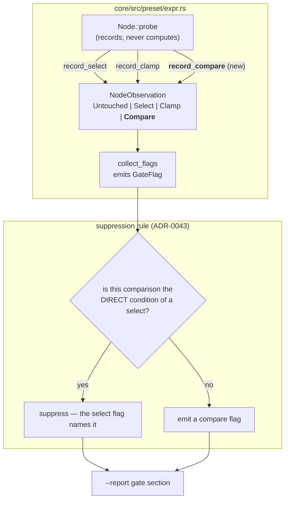

# 0042 — Reachability sees every comparison, and the library is re-audited against it

> **Status:** done 2026-07-30 — all three phases landed (`8c170a3` observe every comparison,
> `e7a40b7` report one-sided unless a select names it, `f50e8cf` the Phase 3 re-audit). Mode 4
> review passed with no blockers: the Outcome section's numbers were re-measured independently
> (14 `GATE` + 2 `COMP` = 16, every one `tempo > N`, 0 genuinely dead), both negative results
> confirmed (the two `min()` band halves and all seven bare comparisons score clean), and the
> `probe`/`collect_flags` index arithmetic verified consistent so a `Compare` observation cannot
> land on an arithmetic node. Two doc-freshness items were fixed in the close commit rather than
> left: `docs/capturing.md` and `docs/presets.md` still described a `select`/`clamp`-only check
> while `COMP` lines were already in real output, and capturing.md still justified the no-CI-gate
> posture with the nine-failing-presets figure this plan measured to zero. Phase 2's done-when
> said "two flags" where ADR-0043 means three; corrected in place.
> **Created:** 2026-07-29
> **Owner skill(s):** dev
> **Related ADRs:** [0043](../../adrs/0043-reachability-reports-comparison-nodes.md) (this plan's
> decision), [0042](../../adrs/0042-reachability-measured-on-the-expression-tree.md) (the mechanism it
> extends)
> **Closes backlog:** [0028](../../design-backlog.md)

## TL;DR

`--report`'s reachability check reports `select()` and `clamp()` nodes only, so a bare comparison
(`reseed = "onset > 0.55"`) is invisible and a dead band gate `min`ed with a live `tempo` gate is
reported as the tempo gate and dismissed. Five of the nine real dead gates found in the 2026-07-29
library audit were invisible to the check that exists to find them. This plan records every
comparison operator as a two-valued observation, reports one that never went both ways unless a
`select()` already names it, and then re-audits the shipped library against the corrected
instrument.

## Context & problem

Plan 0041 shipped tree-measured reachability and it earned its place immediately — it named four
presets whose defining mechanism had never executed. The 2026-07-29 `preset-author` audit fixed
those four, then found **five more of the same defect by grepping every threshold in the library by
hand**, because the check had scored them clean.

Two shapes fall through, both traced to `core/src/preset/expr.rs`:

1. **`Node::probe`'s `Node::Bin` arm only recurses.** `record_select` and `record_clamp` are its
   only writers, and `NodeObservation` has no comparison variant — so a comparison outside a
   `select()` condition is never observed. `reseed = "onset > 0.55"` is the idiomatic boolean-param
   form and contains no `select()` at all; all five attractor presets shipped without ever
   reseeding, each scoring `gates 0`.
2. **`collect_flags` names a `select()`'s whole condition.** For
   `select(min(tempo > 124, bass + treb > 0.38), 4, 1)` it prints the `min(...)`, and the report's
   own guidance says a `tempo` gate is legitimately one-sided under a single-BPM probe — so the
   reader dismisses a flag whose *other* half is separately dead (`bass + treb` peaks near `0.138`).

The second is the damaging one: it reports **clean**, not unknown, on the instrument all three lanes
verify through.

Note this is not the reporting-only change the handoff guessed. `Node::Bin` records nothing today,
so the fix is instrumentation *and* reporting.

## Decision

Per [ADR-0043](../../adrs/0043-reachability-reports-comparison-nodes.md): record the six comparison
operators as a two-valued observation exactly like a `select()` condition, and report one that never
took both values **except where it is the direct condition of an enclosing `select()`** — that
`select()` already reports it, and in better words.

We rejected reporting every comparison including select conditions (doubles today's 20 flags with
the strictly less useful half of each pair), replacing select reporting with comparison reporting
(loses the "its `then` branch never ran" phrasing, and drops `select(beat, a, b)` entirely), and a
static threshold-vs-band-range check with no probe (needs interval arithmetic over the whole
grammar — a second evaluator to keep in step).

Reachability **stays advisory**. ADR-0042 said gate once the library is clean; the honest reading is
that we do not yet know whether it is clean. This plan ends with the evidence, not the gate.

## Architecture diagram



## Implementation phases

### Phase 1 — a comparison is observed

- **Owner skill:** dev
- **What:** `NodeObservation` gains a `Compare { saw_true, saw_false }` variant and `Observations` a
  `record_compare`; `Node::probe`'s `Node::Bin` arm records when — and only when — the operator is
  one of the six comparisons. Arithmetic `Bin` nodes keep recursing without recording.
- **Files touched:** `core/src/preset/expr.rs`
- **Done when:** a probed run of `"onset > 0.55"` against stimuli where `onset` never exceeds `0.55`
  leaves that node observed with `saw_true = false, saw_false = true`, and the same expression
  probed against stimuli that straddle `0.55` records both. An arithmetic node (`bass + mid`)
  records nothing, so the observation array is not populated for every node in the tree.
  `Expr::eval_probed` still returns exactly what `Expr::eval` returns across the whole embedded
  library (the existing `probed_evaluation_returns_exactly_what_eval_returns_across_the_library`
  test continues to pass unmodified — ADR-0042's no-divergence property is not weakened).

### Phase 2 — a comparison is reported, unless a `select()` already names it

- **Owner skill:** dev
- **What:** `collect_flags` gains a `Compare` arm and a `GateKind::Compare`; the recursion carries
  whether the child it is descending into is a `select()`'s direct condition, and suppresses a
  comparison flag exactly there. `shot`'s gate printer gains the wording for the new kind.
- **Files touched:** `core/src/preset/expr.rs`, `standalone/examples/shot.rs`
- **Done when:** `select(bass > 0.3, a, b)` yields exactly **one** flag, the existing select one —
  not two. `reseed = "onset > 0.55"` yields exactly one flag naming the comparison. And
  `select(min(tempo > 124, bass + treb > 0.38), 4, 1)` yields **two comparison flags** naming
  `tempo > 124` and `bass + treb > 0.38` *separately* — **alongside** the select flag on the whole
  `min(...)`, which is retained (ADR-0043 rejects dropping it as its Alternative B), so the finding
  is three flags in total. That composite is the case that reported clean before this plan. Each
  flagged comparison's `source` re-renders as text that parses back to the same tree (the property
  the existing `a_flagged_gate_is_named_in_source_that_compiles_back` test asserts, extended to the
  new kind).

### Phase 3 — re-audit the shipped library and record what is actually there

- **Owner skill:** dev
- **What:** run `--report` over the shipped set with the corrected check and record the result in
  this plan's Outcome section — total flags, how many are the standing `tempo` false positive, and
  how many are genuinely dead. No preset content is edited in this phase; the numbers are the
  deliverable, and they are what the later gating decision is taken on.
- **Files touched:** this plan (Outcome section only)
- **Done when:** the plan carries a measured before/after count from
  `cargo run -p standalone --example shot -- --presets presets --report`, with the genuinely-dead
  flags named per preset, and a one-line recommendation on whether the library is clean enough to
  revisit CI gating. Expect the raw count to **rise** — bare `tempo > N` comparisons now flag too —
  and say so explicitly rather than presenting a larger number as a regression.

## Data shapes

```rust
// illustrative — not the final interface
pub enum NodeObservation {
    Untouched,
    Select { saw_true: bool, saw_false: bool },
    Clamp  { peak_fraction_of_bound: f32 },
    /// A comparison operator that is not a `select()` condition. Same two-valued
    /// shape as `Select` — deliberately, so the reporting logic is shared.
    Compare { saw_true: bool, saw_false: bool },
}
```

## Risks & open questions

- **Noise before signal.** The gate section gets louder, not quieter, until the library is re-gained.
  That is expected and is why Phase 3 reports rather than gates — but if the count rises far enough
  to make the section unreadable, the follow-up is a `tempo`-aware presentation (grouping or
  demoting the known false positive), not a retreat from the check. Out of scope here.
- **Is `==` / `!=` on a float ever meaningfully two-valued?** A preset writing `bass == 0.5` is
  almost certainly a mistake, and it will now flag as one-sided forever. That is arguably the check
  working. Left as-is; if it proves noisy, exempting the two equality operators is a one-line change
  and a note in the ADR.

## What this plan does NOT do

- **It does not gate CI.** Deferred to a decision taken on Phase 3's evidence.
- **It does not edit preset content.** Nine dead gates were already fixed on 2026-07-29 (`e9a1c3c`);
  whatever Phase 3 surfaces is a separate `preset-author` pass.
- **It does not touch the stimulus levels.** `FULL_LEVELS` and `LOW_LEVELS` are unchanged, so every
  historical reactivity number keeps its meaning (ADR-0042).
- **It does not solve the `tempo` false positive.** That needs a multi-BPM probe or an exemption
  rule, and is the natural precondition for gating.

## Outcome — Phase 3 re-audit (2026-07-29)

Measured with `cargo run -p standalone --example shot -- --presets presets --report` over the 36
shipped presets, at HEAD `e7a40b7` (Phases 1–2 landed).

**The library is clean. Every one of the 16 gate flags is the standing `tempo` false positive, and
none is a genuinely dead gate.**

| | count |
|---|---|
| Gate flags **before** this plan (`GATE` only) | **14** |
| Gate flags **after** (`GATE` + `COMP`) | **16** |
| …of which are the `tempo` single-BPM false positive | **16** |
| …of which are **genuinely dead** | **0** |

The before-count needs no rebuild: this change is purely additive — no `select()` flag is suppressed
and `CEIL` is untouched — so the old report is exactly the new one minus its two `COMP` lines. The
190 clamp-ceiling flags are unchanged by this plan and are not part of this count.

All 16 flags, by preset — every one names `tempo > N`:

- `swarm_storm` — 8 (7 `GATE` + 1 `COMP`), all `tempo > 132`: `force`, `spin`, `hue_spread`,
  `palette_mix`, `trails`, `zoom`, `kaleido_order`'s `min(...)`, plus the new `COMP` on the `min`'s
  tempo half.
- `attractor_lorenz` — 7 (6 `GATE` + 1 `COMP`), all `tempo > 124`: `fade`, `size`, `hue_spread`,
  `palette_mix`, `zoom`, `kaleido_order`'s `min(...)`, plus the new `COMP` on the tempo half.
- `rose_zoom` — 1 `GATE`, `tempo > 130` on `zoom`.

### What the corrected instrument proves, by what it did *not* flag

The two negative results are the deliverable, and neither was obtainable before this plan:

1. **The masked band halves are alive.** `min(tempo > 132, bass + mid > 0.055)` in `swarm_storm` and
   `min(tempo > 124, bass + treb > 0.1)` in `attractor_lorenz` each emitted a `COMP` for the *tempo*
   half only. Both operands of a `min` are always evaluated, so the band half was observed and went
   both ways — it is reachable. This is precisely the shape ADR-0043 was built to expose, and it now
   reports the excusable half by name instead of laundering an inexcusable one behind it.
2. **Every bare comparison is alive.** The seven bare-comparison bindings in the shipped set — six
   `reseed = "onset > 0.008…0.012"` (`attractor_clifford`, `_dejong`, `_ink`, `_leviathan`,
   `_lorenz`, `_thomas`) and `rose_web.mirror_reflect = "onset > 0.007"` — produced **zero** flags.
   These are the shape that was invisible to the old check, and against which ADR-0043 recorded that
   the attractor presets "shipped without ever reseeding". They are now visible and they score
   clean, which is direct confirmation that the 2026-07-29 content re-gain (`e9a1c3c`) actually
   took. Without Phase 1 this could only have been asserted, not measured.

### The count rose, as predicted — but by +2, not by 14

The plan and ADR-0043 both expected the raw count to rise, and it did: 14 → 16. **This is not a
regression** — it is two newly-visible flags on a known-benign cause. The rise is far smaller than
Alternative A's projected near-doubling because the suppression rule holds: every other `tempo > N`
in the library is a *direct* `select()` condition and so reports once as a `GATE`, not twice. The
gate section got 14% louder, not 100% louder, and the noise it added is confined to the two `min()`
composites.

### Recommendation on CI gating

**Do not gate yet — but the blocker has changed, and it is now a single known problem.**

ADR-0042 deferred gating until a library audit showed the library was clean. That audit is this
section, and the substantive answer is yes: **0 genuinely dead gates across 36 presets.** The
precondition is met.

What blocks gating is no longer the library, it is the instrument: 16 of 16 flags are false
positives from the 110 BPM single-tempo probe, so a naive "fail if flags > 0" gate would fail CI
permanently and a threshold gate would be tuned to noise. The next step is therefore the `tempo`
false positive — a multi-BPM probe (drive the stimulus above and below each threshold) or an explicit
exemption for `tempo` comparisons — after which "genuinely dead == 0" becomes a gate that is both
meaningful and, on today's library, green. That work is out of scope here, as this plan's
"What this plan does NOT do" states.

Equality operators (`==` / `!=`) produced no flags because no shipped preset uses one on a float, so
the Risks section's noise question stays open and untested by real content.
