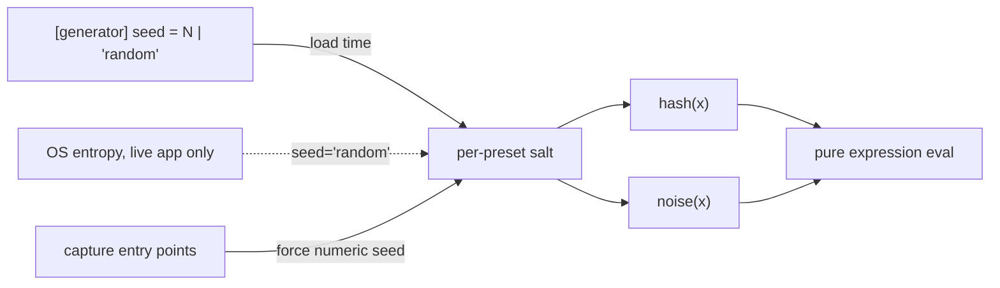

# 0047 — Expression randomness: `hash`, `noise`, and the seed that finally does something

> **Status:** done 2026-07-30 — all three phases shipped on `plan-0047-expression-randomness`
> (`96d39c1` the two salted functions, `d72a4cc` `seed = "random"` + the capture pin, `8f7fc13`
> the docs sweep), merged to `main`. Passed Mode 4 review: **no blockers, no majors**; three
> minors (the pin is test-verified at one of five capture entry points; `docs/capturing.md` and
> NFR §6 not swept) — the two doc minors fixed in this close commit, the test-coverage one left
> as a `dev` followup below. Verified independently at review: all six `draw_frame` call sites
> carry a `SaltMode` (one `Live`, five `Pinned`), no expression evaluation escapes the salt,
> no C ABI change, no new dependency; `fmt`/`clippy`/`nextest` green (305 tests).
> **Created:** 2026-07-30
> **Owner skill(s):** dev
> **Related ADRs:** [0051](../adrs/0051-seeded-grammar-randomness-with-per-run-opt-in.md).
> [docs/roadmap-visual-richness.md](../roadmap-visual-richness.md) R5 (first, small half).

## TL;DR

Two pure grammar functions — `hash(x)` (uniform scatter) and `noise(x)` (smooth value
noise) — salted per preset from the long-reserved `[generator] seed`, plus the opt-in
`seed = "random"` that varies per app launch while every capture path pins a numeric seed
(the ADR-0045 tier-pinning shape). First user-visible behavior: `noise(time * 0.3)`
replaces a four-sine wander in one call, and `hash(beat_index)` makes something different
happen on every beat. Small plan, runs before and independently of Plan 0048.

## Context & problem

Per ADR-0051: no randomness of any kind exists in the grammar; NFR §6 only ever required
*seeded*. This is the cheapest item in R5 and the content lane can use it immediately, so it
runs first. **File fence (the parallelism contract):** this plan touches only
`core/src/preset/expr.rs`, `core/src/preset/schema.rs`, capture entry points, and docs — no
`core/src/render/**`, so it may run in a dev session parallel to the render queue
(0044–0046).

## Decision

Per ADR-0051. Rejected alternatives (strict-only, per-frame entropy, a `[random]` table)
recorded there.

## Architecture diagram

## Implementation phases

### Phase 1 — `hash(x)` and `noise(x)`, salted
- **Owner skill:** dev
- **What:** the two functions in `Func`/`from_name`, a fixed-permutation value-noise and an
  integer-mix hash — allocation-free, no-panic (the expr.rs pragma applies), pure of
  `(argument, salt)`. The salt bakes at load from `[generator] seed` (numeric; absent = 0);
  the schema key stops being documented as reserved. The Plan 0041 review major applies
  here in miniature: any place that re-types the function list (`shot.rs` probe, docs
  tables) is updated in the same commit.
- **Files touched:** `core/src/preset/expr.rs`, `core/src/preset/schema.rs`,
  `standalone/examples/shot.rs` (if it enumerates functions).
- **Done when:** `hash` is uniform-ish over a sweep (a coarse bucket test, property not
  threshold), `noise` is continuous (adjacent arguments differ by less than distant ones,
  asserted relatively) and bounded in [0,1]; the same expression under two different seeds
  differs and under one seed reproduces bit-exactly; wrong arity is a load error like every
  other function.

### Phase 2 — `seed = "random"`, pinned by every capture path
- **Owner skill:** dev
- **What:** the schema accepts `seed = "random"`; the live app draws the salt once at
  preset load; `shot`, goldens, `--report`, and the behavioral gates force the numeric
  fallback (0) — enumerate the entry points against the list `Renderer::capture_preset` /
  `capture_preset_over` / the golden suite, the same set that pins Floor in Plan 0044.
- **Files touched:** `core/src/preset/schema.rs`, `core/src/render/mod.rs` (the capture
  construction path only — coordinate with the render queue; this is the one shared-file
  touch, kept to the capture functions), `standalone/examples/shot.rs`.
- **Done when:** a `seed = "random"` preset captures byte-identically across repeated
  harness runs, and two live-app loads of it produce different salts (asserted via a
  test-only salt readback, not by rendering).

### Phase 3 — Docs sweep
- **Owner skill:** dev
- **What:** `docs/presets.md` — the two functions in the grammar table and the "no
  randomness" paragraph rewritten to the new truth (seeded, and what `"random"` means for
  captures); `presets/README.md` — the `[generator] seed` row updated from "reserved".
- **Done when:** both docs describe the shipped surface; the incommensurate-sines idiom in
  the authoring guidance gains a "you can now just write `noise(time*k)`" pointer.

## Data shapes

No new structs; one schema key widens (`seed: u64 | "random"`), two functions join the
grammar.

## Risks & open questions

- The Phase 2 shared-file touch (`render/mod.rs` capture path) is the only collision
  surface with the render queue; if a render plan is mid-flight in that file, this phase
  waits for its close rather than merging around it.
- `noise` quality is deliberately modest (value noise, one octave); if the content lane
  wants fBm it can sum calls — do not build octave machinery speculatively.

## What this plan does NOT do

- No normalized bands, no phrase time, no axis change (Plan 0048).
- No per-particle/per-segment randomness in scenes — grammar only.
- No `[random]` table (ADR-0051 Alternative C).

## Followups (after this lands)

- The retune pass in Plan 0048 Phase 7 may adopt `noise`/`hash` opportunistically where a
  preset's sine-sum wander is being touched anyway.
- **`dev`, small — widen the pin's test coverage.** `core/tests/seed.rs` proves the pin through
  `capture_preset` only; `capture_at_clock`, `capture_preset_over` and `capture_audio` are pinned
  by code inspection alone. The `step_offscreen` warm-up under `capture_preset` is not covered
  either: the fixture is deliberately a stateless `fragment_field` with no `trails` (the
  configuration WARP is faithful on), so a warm-up frame's salt cannot reach the read-back pixels.
  Two more arms on `a_random_seeded_preset_captures_byte_identically` running the same fixture
  through `capture_preset_over` and `capture_audio` turn a code-review guarantee into a test one.
