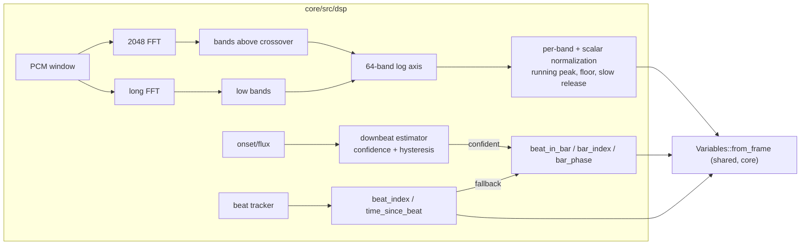

# 0048 — Analysis v2: the dual-resolution axis, normalized bands, phrase time, and the one retune that pays for all of it

> **Status:** done — closed 2026-08-03 after a Mode 4 review with **no blockers**. All seven
> phases ran: `bfd892b` the dual-resolution axis (8192-sample long window, crossover derived at
> band 20 / 246.2 Hz), `ef3b772` normalization with the `*_raw` escapes, `910a6d1` the shared
> `Variables::from_frame`, `81b21d5` ADR-0050 Layer 1, `7a06676` the gated downbeat estimator,
> `909ae4a` the harness/docs recalibration, `0fb26d4` Phase 6's verdicts (recorded below),
> `80c5dff` Phase 7's library retune (368 gains, 36 thresholds, 7 `bin()` positions), `bea5c1e`
> the lane's backlog notes, `fc698cd` the axis-block regeneration that finally met Phase 5's
> done-when. [ADR-0049](../../adrs/0049-analysis-v2-dual-resolution-axis-normalized-bands.md) and
> [ADR-0050](../../adrs/0050-downbeat-and-phrase-tracking-with-confidence-fallback.md) are
> **accepted, each with an Outcome section**. Gate at the close: `fmt --check` clean, `clippy
> --workspace --all-targets -D warnings` clean, `nextest --workspace` **388/388, 0 skipped**;
> reachability **17 flags, all the standing `tempo` false positive, 0 genuinely dead**.
> **Delivers the large half of roadmap R5** (normalization, phrase time, and the axis), and
> spawns three successors: [ADR-0062](../../adrs/0062-clamp-occupancy-is-the-saturation-instrument.md)
> + [ADR-0063](../../adrs/0063-address-the-spectrum-by-frequency.md) + [Plan
> 0056](../0056-clamp-occupancy-and-the-axis-anchor.md), and
> [backlog 0042](../../design-backlog.md) on the estimator's lock rate. See "Close review" at the
> foot of this file.
> **Created:** 2026-07-30
> **Owner skill(s):** dev, human
> **Related ADRs:** [0049](../../adrs/0049-analysis-v2-dual-resolution-axis-normalized-bands.md) (axis + normalization),
> [0050](../../adrs/0050-downbeat-and-phrase-tracking-with-confidence-fallback.md) (phrase time).
> [docs/roadmap-visual-richness.md](../../roadmap-visual-richness.md) R5 (the large half). Runs after Plan 0047.

## TL;DR

The analysis surface becomes worth binding to: a second, longer FFT feeds the low bands so
the 64-band axis is truly logarithmic and the kick/sub region resolves; `bass`/`mid`/`treb`/
`onset` become normalized against their own recent range (raw values stay as `*_raw`);
`beat_index`/`time_since_beat` land unconditionally and `beat_in_bar`/`bar_index`/`bar_phase`
land behind a measured-confidence downbeat estimator that falls back to counters. **This is
deliberately breaking**, and the whole library is retuned once, at the end, verified through
`--report`. First user-visible behavior: a spectrum preset where an 808 line reads as moving
structure instead of one fat bar, and thresholds that mean the same thing on every track.

## Context & problem

ADR-0049 and ADR-0050 carry the full case and the interview's choices (including the two
places the user chose the aggressive option over the recommendation — semantic replacement
and full downbeat tracking — both priced there). **File fence:** `core/src/dsp/**`,
`core/src/preset/expr.rs`, `core/src/preset/schema.rs`, `standalone/examples/shot.rs`,
docs, presets. One named exception: the `Variables` construction site in
`core/src/render/mod.rs`, taken in Phase 3 as a small, coordinated touch (and turned into
the shared constructor Plan 0041's review major asked for, so the duplication dies rather
than doubles).

## Decision

Per ADR-0049 (dual-resolution low end; normalization with `*_raw` escapes; one retune) and
ADR-0050 (two-layer phrase time, confidence-gated downbeat with deterministic fallback).

## Architecture diagram

## Implementation phases

### Phase 1 — The dual-resolution axis
- **Owner skill:** dev
- **What:** the second analysis window (length chosen here by measuring CPU per hop against
  NFR §3 — 4096 first, 8192 only if 4096 still leaves sub-bass bands bin-starved), feeding
  bands below the crossover; band edges re-laid truly logarithmically 35 Hz–18 kHz with
  every band at least one achievable bin. The axis position tables in the docs are
  regenerated from code, not edited by hand.
- **Files touched:** `core/src/dsp/fft.rs`, `core/src/dsp/mod.rs`.
- **Done when:** a swept sine below 250 Hz moves smoothly through multiple distinct bands
  (the 808-collapse reproduction, inverted); no band above the crossover changed its edge
  by more than rounding (asserted from the layout function); measured per-hop analysis cost
  is recorded in the phase commit with the NFR §3 headroom stated.

### Phase 2 — Normalization: `bass`/`mid`/`treb`/`onset` + `*_raw`
- **Owner skill:** dev
- **What:** per-band and per-scalar running normalization in the analyzer (instant attack,
  seconds-scale release, silence floor — properties tested; constants provisional until
  Phase 6). The four familiar names become normalized; `bass_raw`/`mid_raw`/`treb_raw`/
  `onset_raw` join `VAR_NAMES`. The 64-band array presets reach through `bin()` normalizes
  the same way (one rule, no per-surface exceptions).
- **Files touched:** `core/src/dsp/mod.rs`, `core/src/preset/expr.rs`.
- **Done when:** a full-scale sine and the same sine at −20 dB converge to the same
  normalized reading (the portability property); silence stays at 0 (the floor works, noise
  is not amplified); a step from silence reads high immediately (instant attack) and decays
  over seconds (property, not a magic number); `*_raw` reproduce today's values bit-exactly.

### Phase 3 — The shared `Variables` constructor, and the new time counters
- **Owner skill:** dev
- **What:** `Variables::from_frame(&AnalysisFrame, time)` in core replaces the two
  positionally-duplicated construction sites (`render/mod.rs:1192` and `shot.rs:933` — the
  Plan 0041 review major); `beat_index` and `time_since_beat` land unconditionally
  (ADR-0050 Layer 1). This is the one render-file touch; coordinate with the render queue's
  in-flight plan before starting it.
- **Files touched:** `core/src/preset/expr.rs`, `core/src/render/mod.rs` (construction site
  only), `standalone/examples/shot.rs`.
- **Done when:** exactly one construction site exists (grep proves it); the probe and the
  engine bind identical values by construction; `beat_index` is monotone and
  `time_since_beat` resets on each beat under `--signal click`.

### Phase 4 — The downbeat estimator, gated
- **Owner skill:** dev
- **What:** ADR-0050 Layer 2: accent folding over the four 4/4 alignments, confidence with
  hysteresis, `beat_in_bar`/`bar_index`/`bar_phase` published when confident and
  counter-derived otherwise. The ADR's pinned test strategy is the phase's test list
  (accented click locks in all four rotations; unaccented stays in fallback; alignment
  flips take bars, not frames).
- **Files touched:** `core/src/dsp/` (new module), `core/src/preset/expr.rs`.
- **Done when:** the three pinned tests pass; the fallback path is byte-deterministic; the
  confidence value is exposed to diagnostics (not to the grammar — authors get behavior,
  not homework).

### Phase 5 — Harness and docs recalibration
- **Owner skill:** dev
- **What:** `--report`'s realistic-level stimuli and every measured-level table
  (`presets/README.md` bands table, `docs/presets.md` axis/threshold guidance,
  `docs/capturing.md` calibration ladder) re-measured against the new semantics and
  regenerated; the reachability check re-run over the un-retuned library and its flag list
  committed as the *before* record Phase 7 works from.
- **Files touched:** `standalone/examples/shot.rs`, the three docs.
- **Done when:** no doc states a pre-v2 level as current; the before-flags list exists.

### Phase 6 — Real-music validation of the constants
- **Owner skill:** human
- **What:** play 2–3 real tracks (the Plan 0037 Phase 4 material plus something
  sparse/ambient) through the live app with the diagnostics overlay: do normalized levels
  ride the music without pumping (release too fast) or going numb (too slow)? Does the
  downbeat lock on the 4/4 material, stay honestly in fallback on the ambient, and never
  visibly mis-accent? Record impressions and the confidence lock-rate.
- **Done when:** verdicts recorded in this plan; any constant `dev` must move is named with
  the observed symptom. **Stopping condition:** if the downbeat estimator mis-accents
  confidently (not "fails to lock" — *locks wrong*) on ordinary 4/4 material, stop and
  route to `architect`: ADR-0050's gate design gets an Outcome before the retune builds on
  bar variables.

### Phase 7 — The library retune
- **Owner skill:** human
- **What:** run the `preset-author` lane over the full shipped set against the v2 surface
  (the one retune both ADRs sequence everything for): thresholds to normalized semantics,
  the eight `bin()` presets to the new axis, adopting `beat_index`/`bar_phase` where a
  preset's arc wants them. `--report`'s two-level columns and reachability flags are the
  acceptance instrument; Phase 5's before-list is the work list.
- **Done when:** reachability reports no dead gates the author did not deliberately keep
  (each keeper documented in-file, the standing convention); the `animation`/`reactivity`
  gates pass library-wide; the lane's session notes land in the design backlog as usual.

## Data shapes

New variables: `bass_raw`, `mid_raw`, `treb_raw`, `onset_raw`, `beat_index`,
`time_since_beat`, `beat_in_bar`, `bar_index`, `bar_phase` (VAR_COUNT 10 → 19; `Variables`
already borrows, so the copy-cost concern from ADR-0036 does not return). No C ABI change,
no `Scene` change.

## Risks & open questions

- **The retune is the largest content pass since the library rewrite** — it is priced,
  scheduled last, and instrument-verified; but it is real work and the plan does not
  pretend otherwise.
- **Downbeat lock-rate on real music is unknown** until Phase 6; the fallback design means
  the worst case is the counters-only option the interview declined — a safe floor, stated
  in ADR-0050.
- **AGC pumping vs numbness** is a tuning axis with no universally right constant; the
  properties are tested, the feel is Phase 6's job, and the release constant is the one
  most likely to move.
- The Phase 3 render-file touch collides with the render queue if taken mid-flight —
  explicitly sequenced to coordinate, and it is small.
- `--report`'s historical numbers all shift meaning; Phase 5's regeneration is load-bearing
  for every future backlog entry that quotes a level.

## Phase 6 results (2026-08-02, `human`)

Run on the shipped `v0.28.1` release build through WASAPI loopback, diagnostics overlay on,
**8.8 minutes** logged at 1 Hz — 517 rows, **458 with signal** — against roughly half
beat-driven 4/4 material (the Plan 0037 Phase 4 trap/808 clip and similar) and half sparse.
Numbers below are from `diagnostics.log`, not from impressions.

**Normalization: passes. No constant moves.** Levels ride the music across material and use
their range without pumping or going numb, confirmed both by eye and by the log:

| | mean | median | min | max |
|---|---|---|---|---|
| `bass` | 0.421 | 0.363 | 0.007 | 1.000 |
| `mid` | 0.408 | 0.351 | 0.000 | 1.000 |
| `treb` | 0.220 | 0.142 | 0.000 | 1.000 |
| `onset` | 0.198 | 0.138 | 0.000 | 1.000 |

Each band reaches full scale and returns to near zero, with medians well below the means —
the distribution of a signal tracking musical shape rather than one pinned by an AGC at
either end. The release constant, named in the plan's risks as the one most likely to move,
**stays**.

**The downbeat estimator does not mis-accent — and it also barely locks.** The stopping
condition did **not** fire: no confidently-wrong bar line was observed. But
`downbeat_locked` was true in **14 of 458 rows with signal, 3.1 %**, and given the half-and-half
material that is roughly **6 % over the beat-driven half**. Confidence sat at **mean 0.030,
median 0.000** against `CONFIDENCE_THRESHOLD = 0.25` (`core/src/dsp/downbeat.rs:55`), clearing
the gate in **two of eighteen** 30-second windows and peaking at **0.516** — twice the gate, so
the estimator can lock; it just rarely does.

**The absence of a mis-accent is therefore weak evidence, and this record says so.** With the
gate shut 97 % of the time there was little opportunity for one. The stopping condition is
un-fired, not passed.

**What follows, and what deliberately does not.** `beat_in_bar` / `bar_index` / `bar_phase`
were in counter-derived fallback for essentially the whole session, which is ADR-0050's
designed safe floor working as specified — the worst case is the counters-only option the
interview declined. So this is a shortfall, not a defect, and **no constant is named for
`dev` to move**. In particular, lowering `CONFIDENCE_THRESHOLD` to buy lock rate is the one
change this result must *not* be read as recommending: ADR-0050 exists because a confidently
wrong beat 1 is the failure an author cannot work around, and trading the gate for coverage
inverts that. Whether to improve the estimator or re-price the gate is an **ADR-0050
supplement** — architect work, routed to [design-backlog 0042](../../design-backlog.md).

**Phase 7 inherits a qualification.** Its brief says to adopt `beat_index`/`bar_phase` "where
a preset's arc wants them". Layer 1 (`beat_index`, `time_since_beat`) is unconditional and
fully available. Layer 2 (`beat_in_bar`, `bar_index`, `bar_phase`) is, on this evidence,
fallback almost always — so a preset built on it gets counter-derived values, not tracked
ones. The retune should lean on layer 1 and treat layer 2 as decorative until the estimator
earns its gate.

**Field note, incidental:** the governor demoted `rich → floor` at startup on this display.
Unrelated to analysis, but it is the [0044] Phase 4 / [backlog 0031](../../design-backlog.md)
question showing itself unprompted.

## What this plan does NOT do

- No `novelty` graduation or section detection (ADR-0050 Alternative B — stacks later).
- No `bin_range()` integrator (deferred from ADR-0036; the resolved axis makes it worth
  revisiting on its own merits afterward).
- No slew-release smoothing form (backlog 0021 stays parked awaiting an author want).
- No renaming of `bar` (documented misnomer; `bar_phase` is the true quantity).
- No grammar randomness (Plan 0047, which runs first).

## Followups (after this lands)

- ~~Revisit `bin_range(lo, hi)` against the resolved axis.~~ **Designed** —
  [ADR-0063](../../adrs/0063-address-the-spectrum-by-frequency.md) folds it in beside `bin_hz`,
  and Phase 4 of [Plan 0056](../0056-clamp-occupancy-and-the-axis-anchor.md) builds it.
- ADR-0050 Alternative B (novelty/section signal) once bar time has proven itself in
  content. **Not yet earned** — Phase 6 measured bar time at a 3.1 % lock rate, so the
  precondition is unmet; [backlog 0042](../../design-backlog.md) comes first.
- The `--report` ceiling-check threshold minor from Plan 0041's review, if the regenerated
  tables touch that code anyway. **Still open**, and now adjacent to
  [ADR-0062](../../adrs/0062-clamp-occupancy-is-the-saturation-instrument.md), which touches the
  same walk.

## Close review (Mode 4, 2026-08-03)

**Verdict: no blockers, no majors.** Every phase landed with its done-when met, both ADRs
earned an Outcome section, and the two things the closing session was told to check — the
version bump and Phase 5's unmet done-when — are handled here (the latter having already been
repaired by `fc698cd`). Four minors, all doc bookkeeping, all fixed in the close commit.

**Verified at review rather than taken on trust.** `fmt --check` clean; `clippy --workspace
--all-targets -D warnings` clean; `cargo nextest run --workspace` **388/388, 0 skipped**.
Reachability re-run on the *versioned* library (`LMV_PRESET_DIR=./presets` — the default run
silently reports on the seeded `%APPDATA%` copy, which is pre-retune and reads a misleading
zero): **17 flags, and every one is a `tempo` comparison** — nine on Storm at `> 132`, seven on
Lorenz at `> 124`, one on Rose Zoom at `> 130`, all against a single 110 BPM probe. **Zero
genuinely dead gates**, which is Phase 7's done-when proved rather than reported. `core/src/ffi.rs`
and `core/include/` are byte-untouched across all seven phases, so **the C ABI stays v4**;
`Scene` is unchanged; no new dependency; nothing in the plan's diff derives an `aspect` from
anything; every added `expect` is in test code; and `core/tests/hygiene.rs` scans `core/src/dsp`
recursively, so `gain.rs` and `downbeat.rs` were covered by the panic-pragma guard on arrival
(both carry it).

**The tests were opened, not trusted.** Three properties are worth naming because they are the
kind most closes skip. `raw_levels_are_bit_identical_to_the_pre_normalization_build` pins four
literals **measured against `92579ef`**, the commit before the plan — a fact about the old code
this code must match, which is the only form of "unchanged" worth asserting.
`analysis_is_deterministic` **destructures** `AnalysisFrame`, so adding a field stops the file
compiling until it is covered — added precisely because the normalizers and the beat clock are
the kind of state that makes analysis history-dependent behind a passing spot check. And
`the_downbeat_estimator_locks_onto_a_kick_pattern_in_real_audio` drives generated *audio* rather
than idealized accent numbers, with the accent offset to beat 2 so an always-zero tracker fails,
and the unaccented counter-case in the same test.

**Phase 1 deviated from its own done-when, disclosed and counter-asserted — the right way to do
it.** The done-when asked that no band above the crossover move by more than rounding; that is
false as written, because v1's collapse fix-up forced each collapsed edge to `previous + 1` and
overshot the log curve until band 32. Bands 20-31 therefore move, and *that movement is the
defect being removed*. `above_the_chain_every_edge_is_bit_identical_to_v1` asserts identity from
band 32 up **plus** the counter-assertion that 20-31 did move, without which it would pass just
as well if the crossover had swallowed the axis.

**The finding worth carrying is the one lens 4 asks for: what could the development
configuration not see?** Nothing in this project could see the retune's actual work list. The
before-record named 9 broken gates; Phase 7 found 368 mis-scaled terms, **263 of 332 clamped band
terms pinned at the real-music median**, and **14 presets with no live audio term at all** — all
behind a green suite. Every reactivity instrument we own diffs a driven band against *silence*,
where a binding that saturates just above the noise floor scores perfectly. Reachability could
not help either: it watches forks, and a gain contains none. Same shape on the axis: Phase 1
re-pointed every sub-crossover `bin()` probe by about an octave and a half, and `fft.rs`'s lookup
test checks the layout function against the edge table that moved *with* it — internal
consistency with no external anchor. Both are now designed out
([ADR-0062](../../adrs/0062-clamp-occupancy-is-the-saturation-instrument.md),
[ADR-0063](../../adrs/0063-address-the-spectrum-by-frequency.md),
[Plan 0056](../0056-clamp-occupancy-and-the-axis-anchor.md)).

### Minors, all fixed in the close commit

1. **`presets/README.md`'s variable roster still listed 10 of 19** — the exact drift
   [backlog 0035](../../design-backlog.md) raised on 2026-07-30 and asked to ride on the next close
   sweep, on the most-read line of the document the `preset-author` lane is pointed at first. Now
   carries all 19 in `VAR_NAMES` order, with ADR-0050's two layers and the Phase 6 lock-rate
   qualification. Backlog 0035 struck.
2. **`docs/specs/0002-ring-determinism.md` still read "DSP unchanged since Plan 0003"**, and its
   determinism invariant — "the same input **window** MUST produce the same analysis frame" —
   went false the moment normalization and the beat clock landed. Determinism is intact and
   tested; its *unit* moved from the window to the **stream**. Reconciled, with the distinction
   stated (history-dependence is the contract; ambient nondeterminism is still forbidden), and
   the stale "until Plan 0032 lands" gap closed.
3. **`docs/roadmap-visual-richness.md` R5 did not know this landed** — normalization, phrase time
   and the band axis are three of its seven bullets. Struck with what actually shipped, including
   that phrase time landed as a *capability* whose *tracking* is still owed. Sequencing item 2
   also still called R1 "the one to run" after Plan 0045 closed; corrected to R2.
4. **The 64-band array's normalization rule was recorded only in a commit message.** Phase 2's
   done-when says the array normalizes "the same way (one rule, no per-surface exceptions)"; the
   implementation uses **one peak shared across all 64 bands**, which is the right call (per-band
   would drive leakage to 1.0 and destroy `bin(hi) - bin(lo)` as a contrast) but leaves `bin()`
   at ~0.089 against the scalars' 0.28-0.66 — two calibrations, a milder form of exactly what
   Alternative C was rejected for. The authoring docs say so; ADR-0049 did not. Now in its
   Outcome.
