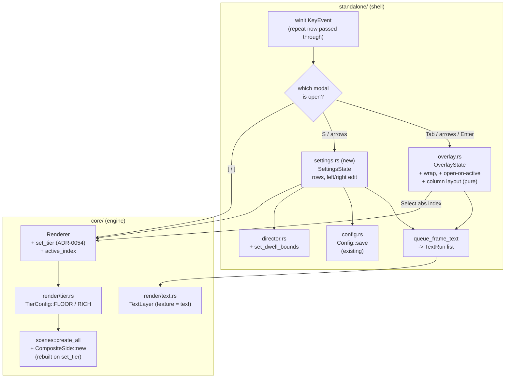

# 0050 — In-app settings, live quality, and a browse overlay that fits

> **Status:** **done 2026-08-04.** All six phases complete. Phase 1 `14cd9e2`, Phase 2 `bed0274`,
> Phase 3 `46b38f6`, Phase 4 `d81a24a`, Phase 5 `19096f1`, and Phase 6 (`human`) run on the machine
> 2026-08-04 — results recorded under that phase below.
> Mode 4 review: **no blockers, no majors**; one wrong design note in Phase 1, which `dev` flagged
> rather than implemented, and one stale preset name in `docs/on-device-validation.md` that Phase 6
> tripped over and this close corrects. Gate on `main` before the bump: `fmt` clean, `clippy -D
> warnings` clean, full `nextest` green.
> **Phase 6 item 3 (the `Rich` calibration) is answered in outline, not as a per-preset table**, and
> the table is deliberately deferred — see that phase for why it is coupled to [0059] Phase 4 and
> why `docs/on-device-validation.md`, which carries it, does not block a close.
> Orthogonal to the render roadmap; it neither blocked nor was blocked by anything.
> **Created:** 2026-07-30
> **Owner skill(s):** dev, human
> **Related ADRs:** [ADR-0054](../../adrs/0054-runtime-tier-switching-rebuilds-on-the-live-context.md)
> (runtime tier switching), supplementing [ADR-0045](../../adrs/0045-quality-tiers-floor-and-rich.md)
> (quality tiers) and [ADR-0009](../../adrs/0009-glyphon-text-rendering.md) (the on-canvas text seam)

## TL;DR

The app gets an operator surface. Quality becomes changeable while it is running — `[` / `]` swap
the tier live, and a new **settings overlay** on `S` gives that a home alongside auto-rotate, dwell,
fullscreen, display and diagnostics, persisting each choice to the `config.toml` that already
exists. At the same time the preset browser stops being awkward: `Tab` opens it **on the preset
you are watching**, the arrows **wrap** at both ends, **holding** an arrow walks the list, and when
the roster is taller than the window the list **flows into columns** instead of scrolling out of
sight. All of it is standalone-shell work over one small new core entry point.

## Context & problem

The user asked for a batch of feedback features, and they share one root: the app has plenty of
capability and almost no way to reach it while it is running.

**Quality is launch-time only.** Three ways to pick a tier exist — `--tier`, `LMV_TIER`, and
`[quality] tier` — and all three are decided before a single frame is drawn. The one thing that can
move a tier afterward is the frame-time governor's one-way demotion. But the tier is a *look*
decision as much as a performance one, and the only moment it can honestly be judged is on the
machine, with the music playing, looking at the picture. Right now that judgement costs a quit, a
file edit and a relaunch. `docs/on-device-validation.md` still carries Plan 0044's `Rich`
calibration as an unrun `human` item partly for this reason.

**There is no settings surface at all.** Five hotkeys (`Space`, `A`, `F`, `D`, `F3`) are the entire
control surface, and the README's controls table is the only map of them. Worse, they are
write-only: `A` toggles auto-rotate and prints to stderr — a window the operator is not looking at —
and it does not even persist the choice, though `Config::save` exists and `F`/`D` both use it. The
dwell bounds that govern auto-rotate are reachable only by editing TOML.

**The browse overlay has three sharp edges.** It opens on row 0 rather than on the active preset, so
`Tab` immediately loses your place in a 34-preset roster. Its arrows clamp at both ends rather than
wrapping, which contradicts `Space`, whose `Roster::next_index` has always cycled. And key
auto-repeat is discarded outright at `standalone/src/main.rs:860` (`!event.repeat`), so holding an
arrow does nothing — every row costs a keystroke.

**The list does not fit.** At `ROW_H = 30` starting at `y = 94`, a 1080p window holds
`floor((1080 - 94) / 30) = 32` rows. The shipped roster is **34 presets**. So the very display this
project is built and demoed on already scrolls, and the two presets past the fold are invisible
until you arrow down to them. Meanwhile the window is 1920 px wide and the longest preset name
("Spectrum Corona") is 15 characters: the space to show the whole roster at once exists, laid out
the wrong way.

## Decision

We add one core entry point and one shell module, and fix the browse overlay in place.

**Quality changes live by rebuilding the engine's tier-dependent GPU resources on the existing
render context** — `Renderer::set_tier` reconstructs the scene roster and composite side against the
new `TierConfig`, keeps the wgpu device, surface, preset roster and active preset, and is a **no-op
on a surface-less (headless) context** so ADR-0045's by-construction golden guarantee survives. The
cost is one visible re-accumulation of trails and feedback, which is the right affordance for an
action the operator asked for. Rejected: an in-place per-scene reconfigure preserving feedback
(every scene, the `PostChain` and the dual-live dissolve chain each need a correct resize path — too
much surface area to buy continuity across a deliberate action), a continuous quality scale (would
supersede rather than supplement ADR-0045, and put the golden suite's `Floor` pin on a continuum),
and restart-to-apply (does not answer the request — the point is to *see* the difference). That is
[ADR-0054](../../adrs/0054-runtime-tier-switching-rebuilds-on-the-live-context.md).

**The settings overlay is a second, independent pure state machine** — `standalone/src/settings.rs`
beside `standalone/src/overlay.rs`, same shape (window-free, its own key and action enums,
unit-tested without winit or a GPU), with the shell routing keys to whichever modal is open. We
rejected generalizing both into one `ui` module with a `Mode` enum: it would rewrite a currently
green 11-test module to share up/down/wrap logic between two modals whose row semantics genuinely
differ (pick-one-and-close versus edit-a-value-in-place).

**The browse overlay's arrows wrap and repeat, and its highlight starts on the active preset.**
Arrows stay overlay-only — nothing new is bound outside it, and the preset does not change until
`Enter`, so the ~1 s dissolve is untouched by any of this. Holding an arrow is ordinary OS key
repeat, newly allowed through for modal navigation keys only.

**The list flows column-major into as many columns as fit.** A pure layout function turns
`(visible rows, surface width, surface height)` into a column count and a per-row `(column, row)`
placement; `Left`/`Right` step one column. Scrolling survives as the fallback for the case where
even the columns cannot hold the roster.

Settings changes persist through the **existing** `Config::save`, which already regenerates
`config.toml` with `toml::to_string_pretty` — no new dependency, and no new persistence mechanism.

## Architecture diagram



## Implementation phases

Each phase ships as its own commit. `dev` runs all phases in one session.

### Phase 1 — `Renderer::set_tier`, and quality moves on a hotkey

- **Owner skill:** dev
- **What:** The live tier swap, end to end: the core entry point plus `[` / `]` bound in the shell,
  so quality is changeable in the running app before any menu exists.
- **Files touched:** `core/src/render/mod.rs` (`set_tier`, `active_index`), `core/src/render/tier.rs`
  (the pure permission predicate), `core/tests/` (new or extended tier test),
  `standalone/src/main.rs` (`[` / `]` bindings, title refresh, demotion-report reset).
- **Design notes `dev` should not have to rediscover:**
  - `from_context` (`core/src/render/mod.rs:689`) is the one construction path and shows exactly what
    is tier-dependent: `scenes::create_all(&device, format, &tier)` and
    `CompositeSide::new(&device, format, &tier)`. `set_tier` rebuilds **those two** and nothing else,
    then clears `incoming_side` and `transition` (a dissolve cannot survive its own chains being
    replaced), calls `configure_active_scene()`, and **re-applies the current surface size** — a
    freshly built scene has not been told how big the window is, and skipping this renders the new
    tier at the wrong resolution.

    **That last clause is wrong, and `set_tier` correctly does not follow it** (`14cd9e2`, flagged
    by `dev` for this review rather than added as a no-op — the right call). There is nothing stale
    to re-apply: `core/src/render/mod.rs:543` calls `scene.set_target_size(...)` on the shared draw
    path **every frame**, and every `PostStage` takes `surface` as an argument to `begin`/`fold`
    rather than caching it at construction. Verified at review. The corroborating evidence the note
    should have been checked against was already in the tree — the frame-time governor's
    `apply_tier` has shipped without it since Plan 0044, which is also why `set_tier` reuses
    `apply_tier` instead of open-coding the rebuild.
  - `tier_pinned = true` and `tier_demoted = false` on every explicit call (ADR-0054). The shell's
    `reported_demotion` latch resets alongside, or a later real demotion prints nothing.
  - The headless guard is `RenderContext::surface.is_none()` (`core/src/render/context.rs:76`).
    Express it as a **pure predicate** (`fn tier_change_permitted(has_surface: bool) -> bool` or
    equivalent) so both branches are testable without a window — a `Renderer` with a surface cannot
    be constructed in CI, so a test that only observes the headless no-op would also pass a
    `set_tier` that does nothing at all.
- **Done when:**
  - A test asserts the pure predicate refuses a surface-less context and permits a surfaced one —
    both directions, so the no-op is not the only thing pinned.
  - A test asserts `Renderer::new_headless(..).set_tier(Tier::Rich)` leaves `tier()` at
    `Tier::Floor`, and that the same renderer's `TierConfig` capacities are still `FLOOR`'s.
  - A test asserts `set_tier` preserves the roster: after the call, `preset_names()` and
    `active_index()` are what they were before it, and `preset_name()` is unchanged.
  - `cargo test -p lmv-core` and the golden suite pass with **every baseline byte-identical** — this
    plan adds no capture path and must move no picture the harness renders.
  - Running the app and pressing `]` then `[` visibly changes the tier: the window title and the
    `F3` overlay both report the new one, and the picture re-accumulates its trails rather than
    continuing unchanged. (Stated as the property; the frame-cost of the rebuild is measured
    eyes-on in Phase 6, not asserted against a number here.)

### Phase 2 — the browser opens where you are, wraps, and repeats

- **Owner skill:** dev
- **What:** `Tab` highlights the active preset; `Up`/`Down` wrap at both ends; holding an arrow
  walks the list.
- **Files touched:** `standalone/src/overlay.rs`, `standalone/src/main.rs`.
- **Design notes:**
  - `OverlayKey::Toggle`'s open branch (`overlay.rs:113`) currently sets `highlight = 0`. It needs
    the active preset's **visible-row** index. Pass the active absolute index in — the module stays
    window-free and roster-free, which is the property that makes it testable.
  - `step` (`overlay.rs:164`) currently clamps with `.min(last)` / `saturating_sub`. Wrap instead.
    **Two existing tests assert the clamp** — `down_clamps_at_the_last_row_no_wrap` and
    `up_clamps_at_the_top`. Replace them with wrap assertions rather than deleting them; a wrap with
    no test is the same as no wrap.
  - Key repeat is dropped wholesale at `main.rs:860` (`!event.repeat`). Let repeats reach
    `handle_key`, and gate there: **a repeat is honoured only for a modal navigation key while a
    modal is open.** Everything else still ignores repeats, or holding `Space` would machine-gun
    preset switches (which is explicitly not what was asked for) and holding `F` would thrash
    fullscreen.
- **Done when:**
  - A test asserts that opening with the active preset at index 7 of 10 highlights row 7, not row 0,
    and that `Enter` immediately after opening re-selects that same preset.
  - A test asserts `Down` from the last row lands on row 0 and `Up` from row 0 lands on the last row.
  - A test asserts that opening with a **filtered** roster in play still clamps into the visible list
    (the existing `on_roster_changed` invariant is not broken by the new open-on-active path).
  - In the running app, holding `Down` scrolls the list continuously and releasing stops it; holding
    `Space` outside the overlay still advances exactly one preset per physical press.

### Phase 3 — the list flows into columns

- **Owner skill:** dev
- **What:** When the roster is taller than the window, the browse list lays out column-major across
  as many columns as fit, and `Left`/`Right` step one column.
- **Files touched:** `standalone/src/overlay.rs` (the pure layout function + `Left`/`Right` keys),
  `standalone/src/main.rs` (`queue_frame_text` draws from the layout; `decode_overlay_key` gains the
  two arrows).
- **Design notes:**
  - The layout is a **pure function** of `(visible_len, surface_width, surface_height)` returning the
    column count, rows per column, and the scroll offset in whole columns — so the whole thing is
    unit-tested without a window, and Phase 6's eyes-on check is confirming pixels rather than logic.
  - `rows_per_col = max(1, floor((height - rows_top) / ROW_H))` where `rows_top = LIST_TOP + ROW_H`
    (94.0), preserving today's vertical arithmetic exactly.
  - Column width is a constant, not a measurement. glyphon shapes a proportional system font and
    `core` exposes no text-measurement API; adding one for this is out of proportion. Derive a
    conservative `COL_W` from `ROW_SIZE = 22` and the widest thing drawn — a `"> "` marker plus a
    preset name — and **truncate a name that overruns its column's character budget with an
    ellipsis**, so an underestimate is cosmetic rather than a collision. The shipped roster's longest
    name is 15 characters, so truncation should never fire on the embedded set; it exists for a
    custom `LMV_PRESET_DIR`.
  - Fall back gracefully in both directions: if `LIST_INSET + cols * COL_W` overruns the surface
    width, reduce the column count; if the roster still does not fit the columns that remain, scroll
    **by whole columns** so the highlighted column is on screen.
  - `Left`/`Right` step by one column (`±rows_per_col` through the flowed sequence) and **clamp**
    rather than wrap — vertical wrap is what the user asked for and horizontal wrap in a
    column-major grid is disorienting. `Down` past the bottom of a column continues at the top of the
    next, which is what column-major already gives for free; `Down` past the very last item wraps to
    the first, as Phase 2 established.
  - This widens `handle_key` to take the layout. That touches all of `overlay.rs`'s existing tests —
    expected and fine; do not add a second parallel entry point to avoid the churn.
- **Done when:**
  - A test asserts that at 1920x1080 the shipped-size roster of 34 lays out in **2 columns of 32 and
    2** (`floor((1080 - 94) / 30) = 32`), and that at 2560x1440 the same roster is **1 column**
    (`floor((1440 - 94) / 30) = 44`, which is `>= 34`). Both numbers are the current constants'
    arithmetic, so a change to `ROW_H` or `LIST_TOP` fails this deliberately.
  - A test asserts `Right` from the last row of column 1 lands in column 2 at the same row, and that
    `Right` from the last column does not move.
  - A test asserts that a window too small for the roster even in columns scrolls by whole columns
    and always keeps the highlighted item on screen.
  - In the running app at 1080p, `Tab` shows all 34 presets at once in two columns with the active
    one highlighted.

### Phase 4 — the settings overlay

- **Owner skill:** dev
- **What:** `S` opens a settings modal listing the operator choices with their current values;
  `Up`/`Down` pick a row, `Left`/`Right` change it, `Esc` or `S` closes; every change applies
  immediately and persists.
- **Files touched:** `standalone/src/settings.rs` (new), `standalone/src/main.rs` (routing, drawing,
  the `A`-hotkey persistence fix), `standalone/src/director.rs` (`set_dwell_bounds`),
  `standalone/src/config.rs` (only if a field is genuinely missing).
- **The rows, and what each one does:**

  | Row | Value shown | `Left`/`Right` | Persists to |
  |-----|-------------|----------------|-------------|
  | Quality | `FLOOR` / `RICH`, suffixed `(auto)`, `(pinned)` or `(demoted)` | swaps tier via `Renderer::set_tier`; pins it | `[quality] tier` |
  | Auto-rotate | `on` / `off` | `Director::toggle_auto` | `[rotate] auto` |
  | Min dwell | `20 s` | ±5 s, floor 5 s, never above max | `[rotate] min_dwell_secs` |
  | Max dwell | `90 s` | ±5 s, never below min | `[rotate] max_dwell_secs` |
  | Fullscreen | `on` / `off` | the existing `toggle_fullscreen` | `[output] fullscreen` (already) |
  | Display | `2 of 3 — <monitor name>` | the existing `cycle_display` | `[output] display`, `display_name` (already) |
  | Diagnostics | `on` / `off` | mirrors `F3` | **not persisted** |
  | Presets | the resolved preset directory | read-only | — |

- **Design notes:**
  - Diagnostics is deliberately session-only. It is a debugging state, and a live show that came up
    with the overlay painted because someone pressed `F3` last week is a worse default than pressing
    `F3` again. No new config field, no new schema surface.
  - Every other row routes through the **existing** `save_config` / `Config::save`, which already
    regenerates the file with `toml::to_string_pretty`. Regeneration drops comments and unknown keys;
    that is the accepted cost and it is already today's behaviour for `F` and `D`.
  - **Fix the standing inconsistency while here:** the `A` hotkey (`main.rs:631`) toggles auto-rotate
    without writing `config.rotate.auto`, unlike `F` and `D` which both persist. Route it through the
    same path as the settings row, so the two controls cannot disagree.
  - Dwell edits must reach the live `Director`, which reads its bounds once in `from_config`
    (`director.rs:76`). Add `set_dwell_bounds(min, max)` preserving the running dwell clock and the
    auto flag; re-deriving a whole `Director` would reset the timer under the operator.
  - **One modal at a time.** `S` opens settings only when browse is closed — while browse is open,
    `S` is a filter character and must stay one. `Tab` while settings is open closes settings and
    opens browse. `Esc` closes whichever is open.
  - `SettingsState` stays pure and window-free like `OverlayState`: it owns the highlighted row and
    emits an action (`SetTier(Tier)`, `ToggleAuto`, `SetDwell{..}`, `ToggleFullscreen`,
    `CycleDisplay`, `ToggleDiagnostics`, `Close`, `Redraw`) that the shell executes. It does **not**
    hold a `Renderer`, a `Window` or a `Config` — that is what makes it testable.
- **Done when:**
  - Tests assert the dwell clamp holds from both sides: raising min past max pins it at max, lowering
    max below min pins it at min, and min never goes below its floor.
  - A test asserts each row's `Left`/`Right` emits the action the table above names, and that
    `Up`/`Down` wrap across the row list the same way the browser does.
  - A test asserts the read-only Presets row emits no action from `Left`/`Right`.
  - In the running app: `S` opens the menu; changing quality on it visibly changes the picture and
    the row's suffix moves from `(auto)` to `(pinned)`; quitting and relaunching comes up on the
    chosen tier, the chosen auto-rotate state and the chosen dwell; and `--tier floor` on the
    relaunch still overrides the persisted pin (the documented precedence is unchanged).

### Phase 5 — the operator docs catch up

- **Owner skill:** dev
- **What:** Every user-observable thing this plan moved is described where an operator looks.
- **Files touched:** `README.md` (the Controls table and the tier flag's paragraph),
  `docs/on-device-validation.md` (Plan 0044's carried `Rich` calibration is now doable in one
  session with `[` / `]` — say so), `docs/nfr.md` (only if a budget statement is now inaccurate).
- **Done when:**
  - The README Controls table lists `[` / `]`, `S`, and the browser's new `Left`/`Right`, and its
    `Tab` row no longer implies a single scrolling column or a highlight that starts at the top.
  - The `--tier` bullet says the in-app control exists and that a menu change pins the tier for the
    session and writes it to `config.toml`, while `--tier` and `LMV_TIER` still win at launch.
  - `docs/on-device-validation.md`'s `Rich` calibration item names the live switch as the way to run
    it. Prefer count-free phrasing throughout — do not write "34 presets" into a doc.
  - **Not swept, deliberately:** `presets/README.md`, `docs/presets.md` and `docs/preset-palettes.md`.
    This plan adds no scene param, no expression-grammar surface and no palette behaviour, so the
    three `preset-author`-facing docs have nothing to catch up on. Confirm that by grepping the diff
    for a `[params]` name rather than by assumption.

### Phase 6 — eyes on the machine

- **Owner skill:** human
- **What:** The three things no test in this repo can see.
- **Done when the user has checked and reported:**
  1. **The tier swap is acceptable in the hand.** Press `]` and `[` a few times with music playing.
     Confirm the hitch is a brief re-accumulation and not a freeze, a hang or a device loss, and that
     it survives being done repeatedly and during a dissolve. Note which presets look worst through
     the transition. (Expect `attractor_clifford` to blow out on `Rich` — that is
     [backlog 0031](../../design-backlog.md), a known defect that Plan [0045] fixes, not a regression
     from this plan.)
  2. **The columns read correctly at the real resolution.** `Tab` on the 2048x1152 display and at
     1080p: all 34 names legible, no overlap into the next column, the active preset obviously
     highlighted, and holding an arrow walking at a comfortable rate.
  3. **The `Rich` calibration, now that it is cheap.** Plan 0044 Phase 4 never ran. With `[` / `]`
     it is an A/B on one machine in one session — record whether the shipped provisional `Rich`
     multipliers hold the frame budget, and route the answer back rather than tuning silently.

#### Phase 6 results — run 2026-08-04

**1. The tier swap is acceptable in the hand — PASS.** The hitch is a brief trails
re-accumulation, not a freeze, hang or device loss. It survives being pressed repeatedly (15
consecutive swaps in one session, every one logging `quality tier: <tier> (pinned)` — so the pin
latches correctly and never falls back to `(auto)`), and it survives being pressed **during** a
dissolve. **The preset that looks worst through the transition is `attractor_lorenz` at `Rich`.**

**2. The columns read correctly — PASS.** Opens on the active preset, highlight obvious, holding an
arrow walks at a comfortable rate, and the list reflows into columns without overlap when the window
is shorter than the roster.

**3. The `Rich` calibration — ANSWERED IN OUTLINE, NOT AS A TABLE.** The per-preset p99 sweep did
not run: the instruction sheet in `docs/on-device-validation.md` names **`rose_kaleidoscope`**, a
preset **retired in the 2026-07-28 library pass**, so the operator went looking for a preset that
does not exist. `docs/design-backlog.md` had already caught that name once; the on-device doc was
never swept. **Corrected in this close** to `fragment_kaleido`, the surviving fold preset.

What the session *did* establish, unprompted and worth more than a missing row: **the shipped
provisional `Rich` multipliers do not hold this display's frame budget.** The governor demoted
`Rich → Floor` within seconds of startup, on the opening preset, before any input —

```
quality tier demoted to floor -- the rich tier did not hold this display's frame budget.
```

— which is Plan 0044's own question answered in the affirmative direction it feared, and it agrees
with item 1's finding that `attractor_lorenz` at `Rich` is the worst thing on screen. **No field is
tuned on this evidence**, per Phase 4's standing rule that no number moves without the measurement
behind it.

**Where the remaining work lives, and why it does not block this close.** The per-preset p99 table
is Plan 0044 Phase 4's, carried in
[`docs/on-device-validation.md`](../../on-device-validation.md), whose own status line says it **does
not block plan closes**. It is also now **coupled to Plan [0059] Phase 4**: `[particles] density`
directly changes how many particles the attractor draws, so calibrating
`TierConfig::RICH.attractor_particles` before the content pass would measure a target that is about
to move — and the attractor is exactly where both signals above point. So the table is deliberately
deferred to after [0059] closes, with the demotion recorded as its first data point.

## Data shapes

```rust
// illustrative — not the final interface

// core/src/render/mod.rs
impl Renderer {
    /// Rebuild the tier-dependent GPU resources at `tier` on the live context
    /// (ADR-0054). Pins the tier and clears the governor's demotion latch.
    /// **No-op on a surface-less (headless) context**, so a golden capture
    /// cannot leave `Tier::Floor`.
    pub fn set_tier(&mut self, tier: Tier) {}

    /// The active preset's roster index — what the browse overlay opens on and
    /// what a tier rebuild restores.
    pub fn active_index(&self) -> usize { 0 }
}

// standalone/src/overlay.rs — the pure layout, unit-tested without a window
pub struct ListLayout {
    pub cols: usize,
    pub rows_per_col: usize,
    /// Scroll offset in whole columns; 0 whenever the roster fits.
    pub col_scroll: usize,
}
pub fn layout(visible_len: usize, width: f32, height: f32) -> ListLayout { .. }

// standalone/src/settings.rs — a second pure state machine beside OverlayState
pub enum SettingsAction {
    None, Redraw, Close,
    SetTier(lmv_core::render::Tier),
    ToggleAuto,
    SetDwell { min_secs: u32, max_secs: u32 },
    ToggleFullscreen,
    CycleDisplay,
    ToggleDiagnostics,
}
```

## Risks & open questions

- **A tier-dependent resource that `set_tier` does not rebuild.** The entry point covers what
  `from_context` covers — `scenes::create_all` and `CompositeSide::new`. A scene that caches a
  capacity outside that path would keep a stale one across a swap, and no golden test can catch it
  because captures are pinned to `Floor` and never call `set_tier`. Mitigation: reuse the two
  constructors verbatim rather than open-coding a rebuild, and state in the review that Phase 6's
  eyes-on A/B is the only check on this. Named in ADR-0054's Negative section.
- **`set_tier` is a public mutator on the type the golden suite uses.** The surface-less guard is
  what keeps ADR-0045's by-construction guarantee, and it must be a real condition rather than a
  doc comment — hence the pure predicate with two-sided tests in Phase 1. Watch for this at review:
  if the guard reads only as a comment, the guarantee is gone.
- **Two sources for "is a modal open".** Once there are two modal state machines, the shell has two
  `is_open()` calls to keep in agreement, and a key routed to the wrong one is a silent swallow.
  Mitigation: a single `fn modal(&self) -> Option<Modal>` in the shell that both routing and the
  redraw path consult, rather than each site testing both flags.
- **The column-width constant is an estimate, not a measurement.** It is derived from the font size,
  not from glyph metrics, because `core` exposes no text-measurement API. Truncation makes an
  underestimate cosmetic; an *over*estimate merely wastes horizontal space. Phase 6 item 2 is what
  confirms it. If it proves badly wrong, the answer is a measurement API on `TextLayer`, which is a
  new plan and an ADR-0009 supplement — not an inline widening here.
- **Key repeat rate is the OS's, not ours.** Windows defaults to roughly a half-second delay then
  ~30/s. Across a 34-row list that is about a second to traverse, which is fine; on a machine with an
  aggressive repeat setting it may feel fast. We deliberately do not throttle, because the arrows
  only move a highlight — no preset switch, no dissolve, nothing expensive per step.
- **Open question: does `config.toml` regeneration bother anyone?** `Config::save` already rewrites
  the file and already drops comments, so this plan changes nothing — but it makes it happen far
  more often. If a hand-annotated config matters later, that is a `toml_edit` dependency and an ADR
  under "lightweight is a feature". Not taken here.

## What this plan does NOT do

- **No C ABI change.** The `extern "C"` surface stays v4. The foobar plugin gets no tier entry point
  and no settings UI — it has a host with its own conventions, and widening the ABI is ADR-0003
  territory.
- **No new hotkey for preset navigation outside the browser.** The arrows stay overlay-only and
  `Enter` still commits, so the ~1 s dissolve and every transition path are untouched by this plan.
  A global prev/next with wrap and repeat was considered in the interview and deliberately not taken.
- **No in-place tier reconfigure.** A tier change resets accumulated feedback. Making it seamless is
  ADR-0054 Alternative A and a later plan if it is ever wanted.
- **No continuous quality slider.** Two named tiers, per ADR-0045.
- **No `Rich` recalibration.** Phase 6 item 3 *measures* and reports; changing `TierConfig::RICH`'s
  numbers is a separate change, and doing it before Plan [0045] lands would measure against a
  ceiling that is about to move (see the plans README's sequencing note).
- **No mouse interaction.** Both modals are keyboard-only; the existing double-click-to-fullscreen
  binding is unchanged and still suppressed while a modal is open.
- **No settings for audio input.** `[input] mode` / `device` stay config-file-only — device
  enumeration is a Windows-only path with its own failure modes, and it deserves its own design.

## Followups (after this lands)

- Audio input device selection in the settings menu (Windows-first; needs the `--list-devices`
  enumeration wired to a live re-open of the capture stream).
- A text-measurement seam on `TextLayer` if the estimated column width proves inadequate
  (ADR-0009 supplement).
- Persisting the diagnostics-overlay state, if it turns out operators want it sticky after all.
