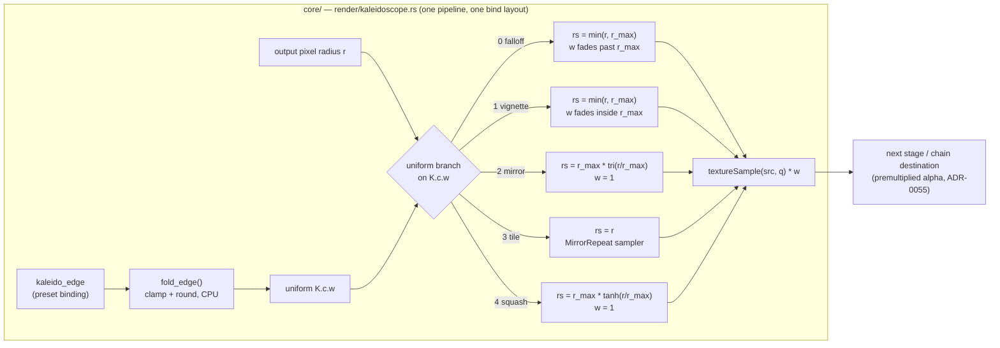

# 0055 — The fold edge becomes a choice: five treatments behind one stepped param, decided in motion

> **Status:** **done 2026-08-04** — Phase 1 `5eac2d7`, the `human` Phase 2 A/B judged 2026-08-04,
> Phase 3 `feba426`, Phase 4 `752eb69`, and the second adoption `2c618de`, on lane
> `plan-0055-fold-edge`, closed together with
> [0052](0052-the-emitter-objects-that-spawn-fall-and-die.md) against one merged tip. Mode 4
> verdict: **landed cleanly, no blockers.** Verified independently of the lane's report — exactly one
> golden baseline added (`composite_kaleido_squash.png`) and none modified, and the post-merge gate
> green. **The A/B is the plan's real product**: five candidates in, three out (`falloff`, `tile`,
> `squash`), `tile` the default, `vignette` and `mirror` deleted — and it falsified both
> [backlog 0037](../../design-backlog.md)'s own bet (`vignette`) and ADR-0061's most confident
> prediction (`mirror`). [ADR-0061](../../adrs/0061-kaleidoscope-edge-treatment-is-a-per-preset-choice.md)
> is accepted **with an Outcome section** recording four claims the implementation falsified. One
> done-when was met by a different instrument than specified and the substitution is argued rather
> than glossed: only `tile` carries the anti-smear guard, because only `tile` can be the smear.
> **Created:** 2026-08-02
> **Owner skill(s):** dev, human
> **Related ADRs:** [0061](../../adrs/0061-kaleidoscope-edge-treatment-is-a-per-preset-choice.md)
> (this plan's decision), [0047](../../adrs/0047-kaleidoscope-fold-domain-disc-with-falloff.md)
> (the fold domain it supplements), [0055](../../adrs/0055-backdrop-leaves-the-post-chain.md)
> (what the falloff fades to), [0058](../../adrs/0058-bind-group-layout-collisions-carry-evidence.md)
> (the layout allowlist this plan moved — `[Uniform, Texture, Sampler, Sampler]` now)
> **Closes:** [design-backlog 0037](../../design-backlog.md); raises
> [design-backlog 0058](../../design-backlog.md)

## TL;DR

The kaleidoscope gains one bindable stepped param, `kaleido_edge`, choosing what happens to the
**56 % of the frame that lies outside the fold's inscribed disc at 16:9**. Five candidate
treatments ship behind it in a single pipeline as a uniform branch; the default is today's
falloff-disc, so nothing moves on adoption. A `human` phase then A/Bs them **in the running app,
in motion, over a lit backdrop**, on a centred figure and a border-filling field, at 16:9 and at
a non-16:9 window — and the losers are deleted. The first user-visible behaviour is that
`fragment_kaleido` can fill its corners while `attractor_leviathan` keeps its vignette, which is
the thing no single treatment can do.

## Context & problem

ADR-0047 shipped the falloff-disc in Plan 0045 and it was confirmed from sixteen rendered stills.
Seen in motion at that plan's close, the user rejected two of its consequences — the residual
rays around a centred figure read as leftovers rather than as a corona, and the disc **crops** a
fullscreen field scene that used to fill the frame. Both are recorded in ADR-0047's Negative
section as accepted cost, so this is a bet not holding, not a defect; and neither is reachable
from a preset, because the fold is a polar operation on a rectangular source and no
`zoom`/`scale`/`kaleido_*` value can paint those corners.

Three facts set the scope, and all three are arithmetic rather than estimate:

- In aspect-corrected space a centred fold has `r_max = 0.5` while the frame's corner radius is
  `0.5 * sqrt(aspect² + 1)` — **2.04x `r_max` at 16:9**.
- The disc covers `π r_max²` of an `aspect x 1` frame, so **55.8 % of the frame lies outside it
  at 16:9**, and the same 55.8 % at 9:16 by symmetry. One treatment is deciding the majority of
  the picture.
- **Thirteen shipped presets bind `kaleido_order`** — `attractor_dejong`, `attractor_leviathan`,
  `attractor_lorenz`, `curve_cathedral`, `fragment_glacier`, `fragment_kaleido`,
  `fragment_supernova`, `fragment_warp`, `lsystem_arrowhead`, `reaction_reef`,
  `reaction_reliquary`, `swarm_dense`, `swarm_storm` — up from the eight design-backlog 0010
  listed. They span both cases the single treatment has to serve.

ADR-0047 declined a per-preset choice because "two address modes double the stage's pipelines"
against the WARP pipeline-count sensitivity. That is true of address modes and false of the
treatments that matter: three of the four candidates are pure functions of the radius and differ
only in how the shader maps `r` to a sample radius and a weight, which is a uniform branch inside
one shader. ADR-0061 records that reasoning and this plan implements it.

## Decision

Ship **all five candidates at once** behind a stepped `kaleido_edge` selector, default 0 =
today's falloff, then let the running app decide which survive. Building the roster first and
choosing second is what makes the choice cheap: every candidate is a few lines in one shader, and
since Plan 0015 an edit to a version-controlled `presets/*.toml` is live in the app in about
150 ms — so the A/B is changing one integer in a preset file and watching, with **no throwaway
debug seam, no hotkey, and no second pipeline**.

We rejected a single new default (Alternative A in ADR-0061 — re-accepts one of the two
rejections, since the treatment cleanest on a field is the one that crops the figure's corona), a
continuous scalar (the candidates differ structurally, not by degree), and a pipeline per
treatment (the expensive shape, and a multiplied exposure to the WARP hazard Plan 0045 hit twice
while adding bloom).

## Architecture diagram



## Implementation phases

### Phase 1 — the selector and the five candidates

- **Owner skill:** dev
- **What:** `kaleido_edge` becomes a bindable named param on the kaleidoscope stage, quantized
  CPU-side, and the shader gains a uniform branch implementing all five treatments in the table
  below. Default 0 (`falloff`) — today's behaviour, unchanged.
- **Files touched:** `core/src/render/kaleidoscope.rs` (the `PARAMS` roster, `set_param`,
  `reset_params`, a `fold_edge` quantizer beside `fold_order`, the `K` uniform's spare `c.w` slot,
  the shader), `core/tests/kaleidoscope.rs` (module docs only in this phase).
- **The roster** — `rs` is the sample radius, `w` the output weight, `m = r / r_max`:

  | Value | Name | `rs` | `w` | Samples outside `[0,1]`? |
  |---|---|---|---|---|
  | 0 | `falloff` | `min(r, r_max)` | `1 - smoothstep(r_max, r_max*(1+band), r)` | no |
  | 1 | `vignette` | `min(r, r_max)` | `1 - smoothstep(r_max*(1-band), r_max, r)` | no |
  | 2 | `mirror` | `r_max * abs(m - 2*round(m/2))` | `1` | no |
  | 3 | `tile` | `r` | `1` | **yes — `MirrorRepeat` sampler** |
  | 4 | `squash` | `r_max * tanh(m)` | `1` | no |

- **Done when:**
  - A preset that does not bind `kaleido_edge` renders **byte-identical** to the current build:
    the whole golden suite passes with **no baseline re-blessed**, including
    `composite_kaleido.png`. This is the phase's load-bearing claim — the branch defaults to the
    arm that already shipped.
  - `fold_edge` never hands the shader a value outside the roster or a fractional one, whatever a
    binding drives it to, and a non-finite value falls back to the default — table-driven, in the
    shape of the existing `fold_order_is_always_integral` / `fold_center_stays_inside_the_frame`
    tests, and asserting *nearest*-integer rather than truncation so an eased sweep lands on the
    step it is closest to.
  - Unit tests on the radius map assert the properties that make each treatment what it claims:
    `falloff`, `vignette`, `mirror` and `squash` all keep `rs` within `[0, r_max]` (so none of
    them can reconstruct a coordinate outside the source — the design-backlog 0010 mechanism);
    `mirror` and `squash` are the **identity below `r_max`** where today's clamp is, so the disc
    interior is untouched by either; and `mirror`'s map is **continuous at `r_max`** — a step
    either side of the boundary converges as the step shrinks, which is the property that makes
    the reflection seamless rather than a visible ring. State the property, not a pixel threshold.
  - One measured consequence is recorded in the module docs because it decides how `mirror`
    reads and is not obvious: at 16:9 the frame corner sits at `m = 2.04`, and
    `abs(2.04 - 2*round(1.02)) = 0.04`, so **the corners sample from 0.04 `r_max` — right next to
    the fold axis**. `mirror` brings the centre of the figure back into the corners. Whether that
    is beautiful or strange is Phase 2's question; that it happens is arithmetic.
  - If `tile` needs a second sampler, note that WGSL requires `textureSample` in **uniform**
    control flow: a branch on a uniform-buffer value qualifies, but sampling twice and selecting
    is the form that cannot be got wrong. Either is acceptable; say in the commit which was taken
    and why.

### Phase 2 — the live A/B, in motion, over a lit backdrop

- **Owner skill:** human
- **What:** Run the app and judge the five treatments against each other on a centred figure and
  a border-filling field, choosing which survive and which is the default.
- **How:** point `LMV_PRESET_DIR` at the repo's `presets/`, run the standalone with real audio,
  and edit the preset file while it runs — the reload is about 150 ms, so the A/B is changing one
  integer and watching. Two edits per preset are needed, not one:
  1. `kaleido_edge = 0` .. `4` in `[params]`, and
  2. **`bg_bright` raised off its floor.** Every fold-binding preset ships a near-black backdrop
     (`attractor_leviathan` is `0.022 + clamp(mid * 2.0, 0, 0.020)`; `fragment_kaleido` sets none
     at all), and a near-black backdrop is exactly the configuration that hid ADR-0047's false
     "fades to the backdrop" claim through sixteen confirmation captures. Judge at a lit one.
     Note design-backlog 0040's ceiling while doing it — coverage-as-alpha means a figure occludes
     what it emits, so past a point the dim parts read as dark speckle.
- **The two scenes, chosen because they are the two the user rejected on:**
  `attractor_leviathan` (centred figure, `kaleido_order` ladder 6/1) and `fragment_kaleido`
  (border-filling field, ladder to 24, eased at `tau = 1.3`).
- **Both aspects.** Judge at 16:9 and at a window that is clearly not 16:9 — portrait if the
  display allows it. The 16:9 dev configuration is what hid design-backlog 0010 for months, and
  the corner-to-`r_max` ratio that governs this whole question is `sqrt(aspect² + 1)`, so it is
  the aspect-dependent thing by construction.
- **Done when:** a written verdict naming (a) which treatments ship, (b) which is the default, and
  (c) for each of the two scenes, which treatment its preset should adopt. Revert the temporary
  `bg_bright` and `kaleido_edge` edits afterwards — Phase 4 makes the real preset changes.
- **Stopping condition:** if no candidate is better than today's default on **either** scene, stop
  and route back to `architect` rather than shipping a selector with one useful value. That is the
  same stopping condition Plan 0045 Phase 2 carried; it did not fire there.

### Phase 3 — delete the losers, set the default, re-scope the guards

- **Owner skill:** dev
- **What:** Reduce the roster to what survived Phase 2, apply the chosen default, and fix the test
  that asserts an invariant three candidates deliberately break.
- **Files touched:** `core/src/render/kaleidoscope.rs`, `core/tests/kaleidoscope.rs`.
- **Done when:**
  - Only surviving treatments remain, renumbered contiguously from 0 with the default at the
    value the roster documents; the deleted arms are gone from the shader, not left dead.
  - **`the_fold_paints_nothing_outside_its_disc` is scoped to the treatments it is true of.** It
    is currently written as a property of *the fold*; it is a property of `falloff` and
    `vignette`. Its name or its module docs must say so, or a later reader takes it as a rule and
    a fill treatment looks like a regression. It must still fail on the pre-ADR-0047 shader — the
    reason it exists — so verify that rather than assuming the re-scoping preserved it.
  - Each surviving fill treatment carries its own property, asserted at a **portrait** aspect on
    the border-filling fixture the disc guard already uses: the out-of-disc region is **covered**
    (it is the crop that was rejected, so coverage is the claim), and it is **not the radial
    smear** — the pre-ADR-0047 defect replicated one border texel outward, constant along each
    ray, so the assertion is that out-of-disc content varies along a ray. Phrase it as that
    property; do not invent a threshold this plan has not measured.
  - If `tile` survived and added a sampler, the kaleidoscope's bind-group layout shape is
    re-derived against ADR-0058's allowlist — not assumed unchanged. If Plan 0053 has landed, its
    assertion is the thing that must stay green; if it has not, record the new shape in the commit
    so 0053 inherits it.

### Phase 4 — one fixture for the new path, the docs, and the content-lane handoff

- **Owner skill:** dev
- **What:** Give a non-default treatment a golden baseline, document the param, and route the
  library retune.
- **Files touched:** `core/tests/fixtures/` (one new fixture + its baseline),
  `presets/README.md`, `core/src/render/kaleidoscope.rs` (module docs),
  `core/tests/fixtures/composite_kaleido.toml` (header note), `docs/design-backlog.md`.
- **Done when:**
  - A golden fixture binds a surviving **non-default** `kaleido_edge` on a border-filling scene,
    so the new path has a pixel baseline of its own. `composite_kaleido.toml` stays on the
    default and stays byte-identical — its header already records two hand re-blesses and why,
    and it should say that the fold's edge is now a choice and that this fixture pins the default
    arm only.
  - `presets/README.md` carries the `kaleido_edge` row: the roster with what each value does, the
    **stepped-param** note (the second one on this stage — point at `kaleido_order`'s), and the
    consequence that a preset easing the selector snaps at the midpoint while a *dissolve* between
    two presets with different treatments blends correctly, because that blends rendered frames.
  - The **13-preset retune is routed, not done here**: a design-backlog entry for `preset-author`
    naming the presets, the two Phase 2 verdicts as the starting recommendation, and its pairing
    with backlog 0038 and 0040, which already retune the same shipped set against a composite that
    moved under it. The one exception worth taking in this plan is `swarm_dense`, whose file
    documents `kaleido_order = "1"` as a **dodge** of design-backlog 0010 — if a fill treatment
    makes the fold usable there, the stale comment goes with it either way.
  - design-backlog 0037 is struck through with a pointer here.

## Data shapes

No new struct, no C ABI change, no `Scene` trait change. The selector rides the existing
kaleidoscope uniform's spare slot:

```rust
// illustrative — not the final interface
#[repr(C)]
struct K {
    v: [f32; 4], // x: order, y: angle, z: aspect, w: unused
    c: [f32; 4], // x,y: fold centre (uv), z: falloff band, w: EDGE TREATMENT (was unused)
}

/// Clamp into the roster, round to an integer, fall back to the default on a
/// non-finite value — the `fold_order` treatment, for the `fold_order` reason.
fn fold_edge(v: f32) -> f32 { /* ... */ }
```

## Risks & open questions

- **The A/B could pick a new default, which moves every fold baseline.** The plan is written so
  the default is a Phase 2 output rather than an assumption. If it changes, `composite_kaleido.png`
  and any other fold-bearing baseline are re-blessed **by hand**, with the numbers and an eyes-on
  description in the fixture header — the discipline that file already documents twice. Not a
  reason to prefer keeping the default; a reason to name the cost before choosing.
- **`mirror` may read as a duplicated figure rather than as a continuation.** At 16:9 the corners
  sample from 0.04 `r_max`, so a centred figure's core reappears in each corner. This is the
  candidate most likely to be either the answer or obviously wrong, and it is why it is judged in
  motion rather than argued.
- **`tile` is the only candidate that can reintroduce the design-backlog 0010 mechanism if it is
  built wrong.** Its whole premise is letting the sample coordinate leave `[0,1]`; that is safe
  *only* because a `MirrorRepeat` sampler defines the read. If it is ever wired to the existing
  `ClampToEdge` sampler by mistake, it is the original defect with a new name. The existing disc
  guard will not catch it — that guard is about painting outside the disc, and `tile` is supposed
  to. If `tile` survives Phase 2, its guard is the ray-variance property in Phase 3, and that
  connection should be stated in its test's docs.
- **Cost.** Four of five candidates are one texture fetch and a few ALU ops — the same as today.
  `tile` is also one fetch if the sampler is selected by a uniform branch, or two if dev takes the
  sample-both-and-select form. The stage only runs when a fold is active at all (order ≥ 2), so
  this is not on the path of a preset that does not fold. No NFR budget moves; if the
  sample-both form is taken, say so in the commit so the next reader knows why there are two
  fetches.
- **`kaleido_edge` is the second stepped param on this stage.** The general hazard is on record
  (an eased param is continuous even when its meaning is discrete); this is the same seam that
  produced it. The mitigation is the same CPU-side quantization, and the reason it goes in Rust
  rather than WGSL is that it keeps the shader's precondition visible.

## What this plan does NOT do

- **It does not retune the thirteen fold-binding presets.** That is content-lane work, routed in
  Phase 4 to `preset-author` alongside backlog 0038 and 0040.
- **It does not reopen the fold's domain.** ADR-0047's core finding — that reconstructing a
  coordinate outside the source and clamping it is the defect — stands, and every candidate here
  respects it.
- **It does not make the edge treatment author-definable.** The roster is a closed set; a
  per-pixel radius map written in the grammar is the grammar-to-WGSL translator ADR-0048 already
  declined.
- **It does not touch `kaleido_center_*`, `kaleido_order`, or the falloff band's width.** The band
  is a constant nobody has asked to move and was not what the complaint was about.
- **It adds no hotkey and no debug env var.** The A/B rides the preset hot-reload that already
  exists; a temporary override would be a second way to set a param, removed a phase later.

## Followups (after this lands)

- The content-lane retune entry created in Phase 4 (13 presets, pairs with backlog 0038 / 0040).
- If `tile` ships, ADR-0058's allowlist carries a new kaleidoscope layout shape — coordinate with
  Plan 0053 whichever lands second.
- ADR-0061 owes an **Outcome** section at this plan's close recording which treatments survived,
  which became the default, and anything the rendering falsified — ADR-0047's own Outcome is the
  model, and it is where two of its alternatives were found to be wrongly modelled.
