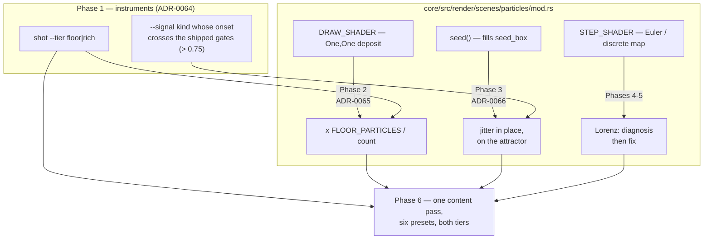

# 0057 — The attractor's compute path: the deposit, the reseed, the butterfly, and one retune

> **Status:** **done 2026-08-03** — Phases 1, 2, 3, 4 and 6 landed; **Phase 5 was deliberately not
> written**, per Phase 4's own instruction to stop and route back to `architect` when the cause turns
> out to be the shared 3-D view basis. It is. That fix is a decision with rejected alternatives and
> owes an ADR, so it becomes a successor plan rather than holding this one open — the plan's Risks
> section anticipated exactly this ("Phase 4 may stop the plan. By construction, and it is why Lorenz
> is last: Phases 1-3 and 6 are complete work without it").
> Phase commits: `8c95cf2` the two instruments, `4d77bff` the deposit, `5bb36c2` the reseed,
> `9d717fc` the Lorenz diagnosis, `b2be2d3` the one content pass.
> Mode 4 review: **no blockers, no majors**; three minors, all doc/bookkeeping, fixed in the close
> commit. Gate on `main` after both lanes met: fmt clean, clippy `-D warnings` clean, **427/427,
> 0 skipped**, and **no golden baseline moved anywhere in the plan** — proved by re-running the suite
> without `LMV_BLESS`, as the Decision said it could be checked in advance. C ABI stays **v4**
> (`core/src/ffi.rs` byte-untouched), no new dependency, nothing added to the audio path.
> Closes [backlog 0031](../../design-backlog.md) outright (both halves, on measurement),
> [0047](../../design-backlog.md) (first half), [0048](../../design-backlog.md) → successor plan, and
> [0050](../../design-backlog.md).
> **Created:** 2026-08-03
> **Owner skill(s):** dev, human
> **Related ADRs:** [0064](../../adrs/0064-a-capture-may-pin-the-rich-tier.md) (Phase 1 — `shot --tier`),
> [0065](../../adrs/0065-the-attractor-deposit-is-normalized-by-particle-count.md) (Phase 2),
> [0066](../../adrs/0066-a-reseed-disturbs-the-cloud-rather-than-replacing-it.md) (Phase 3).
> Supplements [ADR-0045](../../adrs/0045-quality-tiers-floor-and-rich.md).
> Closes [backlog 0047](../../design-backlog.md) (first half), [0048](../../design-backlog.md),
> [0050](../../design-backlog.md), and the mechanism half of [0031](../../design-backlog.md).

## TL;DR

Three defects raised on 2026-08-03 are one subsystem: the attractor's compute path deposits light
without normalizing for particle count (so `Rich` is three stops hot), reseeds by replacing the
cloud with a uniform axis-aligned box (so every reseed flashes a speckled rectangle), and renders
Lorenz as a dust cloud that never resolves into a butterfly. They land in **one plan** because all
three move the same six presets' look, and three plans would retune that family three times.
Phase 1 builds the two instruments that make any of it measurable — a capture that can pin `Rich`,
and a stimulus that can produce a real onset transient — because **none of these three defects can
currently be rendered by this project's harness**, which is why all three shipped behind a green
suite.

## Context & problem

The three ADRs carry the mechanisms. What justifies one plan rather than three is the coupling, and
it is concrete rather than aesthetic:

- **The retune is already half-spent in the wrong direction.** Commit `00d99d0` (2026-08-03)
  brought four attractor presets down — Clifford's `fade` 0.885 → 0.50, `size` 0.62 → 0.28 — to
  survive a 3x deposit at `Rich`. Phase 2 removes that 3x, so those four become conservative at
  *both* tiers and owe a re-raise. Done as three plans, that content pass runs once for the
  deposit, again for the reseed, and again for Lorenz.
- **The reseed and Lorenz meet in the same place.** Lorenz's is the largest seed box in the set
  (`±(20, 26, 24)` about `z = 25`), so "what a reseed looks like" and "how long the cloud takes to
  find the attractor" are the same question for that family, measured on the same capture.
- **All three are invisible for the same reason.** `shot` has no `--tier` and is `Floor` by
  construction, so no capture in this project renders the configuration the app *starts* in; and
  `--set` holds a level constant, so no stimulus can express the transient a reseed is. Building
  those two instruments once serves all three fixes — and it is the sequencing
  [ADR-0049](../../adrs/0049-analysis-v2-dual-resolution-axis-normalized-bands.md) paid for: fix the
  measurement, then do the content once.

The fourth entry from that batch, [backlog 0049](../../design-backlog.md), is deliberately **not**
here — it is Plan 0055's `kaleido_edge` A/B and already designed.

## Decision

One plan, six phases, with the Lorenz work sequenced **last** so that a diagnosis turning into a
research problem does not hold the two mechanical fixes or the content pass. Phase 1 is
instruments; Phases 2 and 3 are the two fixes with a done-when each; Phase 4 is a Lorenz diagnosis
whose output is a named cause rather than a patch; Phase 5 is its fix; Phase 6 is the single
content pass over all six attractor presets.

**No golden baseline moves anywhere in this plan.** That is checkable in advance rather than hoped
for: `core/tests/fixtures/attractor.toml` has no `[particles]` table and no `reseed` binding, so
the one attractor baseline runs the default De Jong family, never reseeds, and never takes the
3-D projection branch — and Phase 2's scalar is exactly `1.0` at `Floor`, which every golden is
pinned to.

## Architecture diagram



## Implementation phases

### Phase 1 — The two instruments

- **Owner skill:** dev
- **What:** (a) `shot --tier floor|rich`, defaulting to `floor`, backed by a second
  explicitly-named headless construction path that takes a tier —
  **`Renderer::new_headless` keeps its signature and keeps pinning `Floor`**, so a capture path
  added later that does not think about tiers still gets `Floor` (Plan 0044's compile-time
  property, preserved deliberately). `shot` continues to ignore `LMV_TIER`. (b) A `--signal` kind
  whose onsets actually cross the shipped reseed gates, so a reseed frame becomes capturable at
  all.
- **Files touched:** `standalone/examples/shot.rs`, `standalone/src/shot/args.rs`,
  `core/src/signal.rs`, the core's headless construction path, `docs/capturing.md`.
- **Done when:**
  - `--tier rich` and `--tier floor` on `attractor_clifford` produce **different** frames, and
    omitting the flag reproduces today's capture byte-for-byte.
  - The new signal drives normalized `onset` **above 0.75** — the highest shipped reseed gate
    (`attractor_clifford.toml:92`; the six range 0.50 to 0.75) — on at least one frame, shown by
    the filmstrip's own printed level table rather than asserted, and a capture at that frame
    visibly reseeds.
  - `docs/capturing.md` documents both, including the sentence that **a `Rich` capture is an
    instrument and never a baseline** (ADR-0064: the `Rich` multipliers are still provisional,
    Plan 0044 Phase 4 having never run).
  - No golden baseline moves.

### Phase 2 — The deposit stops scaling with the tier

- **Owner skill:** dev
- **What:** scale the attractor's additive deposit by `FLOOR_PARTICLES / active_count`
  (ADR-0065), so total deposited light is invariant to particle count.
- **Files touched:** `core/src/render/scenes/particles/mod.rs`, `presets/README.md`,
  `docs/nfr.md` or `core/src/render/tier.rs` docs where the capacity-not-behavior claim is stated.
- **Done when:**
  - Every golden baseline is **byte-identical**, and the reason is asserted directly rather than
    inferred from pixels: a unit test on the scalar itself shows it is exactly `1.0` at `Floor`
    and `1/3` at `Rich`'s shipped count.
  - Captured at both tiers with Phase 1's flag, the same preset's frames agree in overall
    luminance where today the `Rich` frame is about three times the `Floor` one. **Record the
    measured pair in the phase commit rather than asserting a tolerance here** — the two frames
    sample the same distribution at different rates, so they are not expected to be identical and
    this plan has not earned a number for how close they should be.
  - The `Rich` frame is visibly *less noisy* than the `Floor` one at matched exposure, which is
    what the tier now buys.
  - `presets/README.md` and ADR-0045's capacity-not-behavior claim are reconciled: the claim is
    now true for this family, and the doc says why it once was not.

### Phase 3 — The reseed disturbs instead of replacing

- **Owner skill:** dev
- **What:** on the reseed edge, perturb existing particle positions by a bounded family-relative
  jitter instead of re-filling `seed_box` (ADR-0066). `seed_box` stays, used for the initial fill
  and a family change.
- **Files touched:** `core/src/render/scenes/particles/mod.rs`, `presets/README.md`.
- **Done when:**
  - A test over the particle buffer, not the pixels: after a reseed, **no particle lies outside
    the family's own post-convergence extent**, where today a reseed puts essentially the whole
    population into the seed box, most of which is outside it. The test states both directions —
    that the positions *did* change (a reseed that does nothing would otherwise pass).
  - Determinism holds: two runs from the same seed produce identical positions after a reseed
    (`particles/mod.rs:20`'s pure-function-of-seed-and-step-sequence claim).
  - Using Phase 1's stimulus, a capture at the reseed frame shows no axis-aligned edge. This is a
    **new** capture, not a baseline move: no golden binds `reseed`.
  - `presets/README.md`'s `reseed` description stops implying a re-scatter and says what the
    parameter now does.

### Phase 4 — Lorenz: the diagnosis

- **Owner skill:** dev
- **What:** name the cause of the dust cloud, with the capture that discriminates it, **before**
  writing a fix. Record the finding in this plan.
- **The leading hypothesis, and the measurement that settles it.** The draw shader's 3-D branch
  uses **`y` as the vertical** and rotates `x` against `z`
  (`screen = vec2(cx*cs + cz*sn, center.y)`, `particles/mod.rs:355-360`), so the view is x–y at
  rest and z–y at a quarter turn. The Lorenz butterfly lives in the **x–z** plane; neither of
  those views is it, and the x–y projection of Lorenz is a dense core inside a diffuse cloud —
  which is the report, verbatim. Lorenz is the only family this can be wrong for: De Jong and
  Clifford are 2-D and never take the branch, and Thomas is cyclically symmetric, so every basis
  looks alike. **Discriminating capture:** render one frame with the vertical swapped to `z`
  (`screen = vec2(cx*cs + cy*sn, center.z - zc)`). If the butterfly appears, the cause is the view
  basis and not the integration.
- **Checked only if that fails**, with the estimates that make them unlikely, so time is not spent
  on them first: forward-Euler thickening at `h = dt/4 ≈ 0.0042` (`h·|λ| ≈ 0.06` at the shipped
  coefficients — comfortably stable); un-converged seed-box corners (240 frames is 4 Lorenz time
  units, well past when the transient should have decayed); point size against per-frame travel
  (about 1.2 point diameters per frame on the attractor, so the trajectory draws as near-continuous
  rather than dotted).
- **Files touched:** this plan (the recorded finding), plus whatever scratch captures the
  diagnosis needs.
- **Done when:** the cause is named and the discriminating capture is described in the phase
  commit. **If the cause is the shared 3-D view basis, stop here and route back to `architect`** —
  making the projection convention per-family is a decision with rejected alternatives and owes an
  ADR, and `dev` does not write ADRs. Any other cause is a constant or a per-family value and
  Phase 5 takes it directly.

#### FINDING (dev, 2026-08-03) — the cause is the shared 3-D view basis. **The plan stops here.**

**The leading hypothesis is confirmed, and the two alternatives are ruled out by measurement
rather than by the estimates that deprioritized them.**

*Ruled out first — the cloud is converged, so this is not integration.* Read back off the particle
buffer through Phase 3's new `read_positions`, Lorenz occupies **5.89 % of its own bounding volume,
stable from 60 through 240 to 600 frames**, at `x ∈ [-18.0, 19.2]`, `y ∈ [-25.3, 25.4]`,
`z ∈ [4.4, 47.3]` — the classic attractor's bounds. An un-converged seed box reads ~26 % (the
seeded scatter's own figure, measured the same way). Forward-Euler thickening and un-converged
corners would both show as a fill fraction that shrinks with frame count; it does not move.

*The discriminating capture.* Rendered with `SPIN_RATE` pinned to `0` so the capture is the **rest
basis** rather than the 41° the spin reaches by frame 240 — without that pin neither view is the
one being reasoned about, which is why the first attempt at this capture was unreadable.

| basis | rest view | what it renders |
|---|---|---|
| shipped: `vec2(cx*cs + cz*sn, center.y)` | x–y | a hard **X / bowtie** — the two lobes seen edge-on, crossing. This is the reported "dense core inside a diffuse cloud", verbatim |
| swapped: `vec2(cx*cs + cy*sn, center.z - zc)` | x–z | the **butterfly silhouette** — two lobes, the notch top and bottom centre, and the two fixed-point cores visible as vertical streaks at low gain |

So the shared 3-D projection uses `y` as the vertical and rotates `x` against `z`
(`particles/mod.rs:355-360`): the rest view is x–y and the quarter turn is z–y. **The Lorenz
butterfly lives in x–z, and neither shipped view is it.** Thomas is unaffected because it is
cyclically symmetric, and De Jong and Clifford never take the branch.

**Routing back to `architect`, per this phase's own instruction.** Making the projection basis
per-family is a decision with rejected alternatives (per-family basis vs. a preset-facing
parameter vs. re-centring Lorenz's coefficients) and owes an ADR. **Phase 5 is not written.**

**One thing the ADR should know, because a basis fix alone will not clear Phase 5's done-when.**
Corrected to x–z, the figure has the right *silhouette* but still reads as **stipple** rather than
as the banded wings of the iconic plot. That is not a second defect: the scene draws 50 000
**independent samples of the attractor's invariant measure**, whereas the legibility of a Lorenz
plot comes from following *one trajectory* as a continuous curve. Spread over the projected wing
area at 640x360 that is under one point per pixel. The levers that would buy the banding back are
`fade` (longer per-particle streaks) and the particle count — content and capacity, not geometry —
so Phase 6's re-authoring of `attractor_lorenz` is load-bearing for this and should be sequenced
*after* the basis decision, not before. Phase 2 has just returned 3x of headroom to spend on it.

### Phase 5 — Lorenz: the fix

> **NOT RUN — routed to `architect` at this plan's close (2026-08-03), by Phase 4's own
> instruction.** Phase 4 confirmed the cause is the shared 3-D view basis, which makes the fix a
> convention change with rejected alternatives (per-family basis vs. a preset-facing parameter vs.
> re-centring Lorenz's coefficients) rather than a constant. It carries forward to a successor plan
> together with the `attractor_lorenz` re-tune Phase 6 deliberately withheld, and with the
> **stipple** finding below, which a basis fix alone would not clear.

- **Owner skill:** dev
- **What:** apply the fix Phase 4 named. Gated on Phase 4, and on the ADR if Phase 4 routed back.
- **Files touched:** `core/src/render/scenes/particles/mod.rs`.
- **Done when:** the Lorenz figure is legible as its own shape at a rest angle **and** at a quarter
  turn — the two-angle check matters, because a basis fix that only works at one rotation is the
  same defect moved. No other family's capture changes; Thomas is the one to check, since it is the
  other user of the 3-D branch. `attractor.png` is untouched (it runs De Jong).

### Phase 6 — The one content pass

- **Owner skill:** human
- **What:** run the `preset-author` lane over all six attractor presets **once**, judging each at
  both tiers with `--tier`. Three things to settle in the same pass: re-raise the four presets
  `00d99d0` brought down to survive a 3x that no longer exists; judge whether the disturbed reseed
  reads as the percussive accent every header claims (the jitter magnitude is the lever, and
  ADR-0066 says returning to the box is not); and re-author `attractor_lorenz` against a figure
  that now has a shape, where before it was carried by colour.
- **Files touched:** `presets/attractor_*.toml` (six).
- **Done when:** each of the six is judged at both tiers and the commit states which levers moved
  per preset. The tonal-flatness statistic is recorded before and after for each — the same
  measurement `00d99d0` used by hand, available in the harness once [0056] Phase 5 lands. **No
  preset's identity changes**: no palette, family or coefficient moves. This is a re-gain, not a
  re-design.

## Data shapes

```rust
// illustrative — not the final interface

// Phase 1: the tier-taking construction path is named, so a caller that does not
// name it still gets Floor. The existing `new_headless` is unchanged.
Renderer::new_headless(...)             // unchanged: pins Floor, no tier argument
Renderer::new_headless_at_tier(tier, …) // explicit: the only way to leave Floor

// Phase 2: one uniform scalar, 1.0 at Floor by construction.
let deposit_scale = FLOOR_PARTICLES as f32 / active_count as f32;
```

## Risks & open questions

- **Phase 4 may stop the plan.** By construction, and it is why Lorenz is last: Phases 1-3 and 6
  are complete work without it. If it routes back, the content pass can still run on the deposit
  and the reseed, with `attractor_lorenz` revisited after.
- **Phase 1 gives the suite the ability to capture `Rich` and no obligation to bless it.** Stated
  here as well as in ADR-0064 because the temptation arrives with the capability: a `Rich` golden
  would be pinned to constants Plan 0044 Phase 4 has never calibrated.
- **The jitter magnitude is a look constant with no principled value.** Phase 3 picks a starting
  value from the family's own extent; Phase 6 is where it is judged, in motion, at both tiers.
- **Phase 6 wants [0056]'s flatness statistic.** Soft — it can be measured ad hoc the way
  `00d99d0` did, in a scratch directory — but measuring it by hand twice is the specific waste this
  plan exists to avoid, so **sequence [0056] first**.
- **Phase 2 changes what "authored at `Floor`" guarantees**, in the direction of making it true.
  Anyone comparing a pre-change `Rich` screenshot will find the new one dimmer; that is the fix,
  not a regression.
- **No real-time hazard.** The deposit scalar is a uniform written on the existing per-frame path;
  the jitter runs inside the seed path that already runs on the reseed edge. No new allocation, no
  new pass, no audio-thread contact.

## What this plan does NOT do

- **No `[particles]` key for any of it.** All six shipped presets want the same answer to all three
  questions, so the defaults are the decision (ADR-0065 and ADR-0066 both reject the key on that
  ground).
- **No `Rich` golden baselines.** ADR-0064 declines them deliberately, pending Plan 0044 Phase 4.
- **No tier calibration.** Plan 0044 Phase 4 stays open and on-device; this plan makes it cheaper
  to run, not done.
- **No fold work.** [Backlog 0049](../../design-backlog.md) — the fourth entry from the same batch —
  is Plan 0055's `kaleido_edge` A/B, already designed.
- **No change to the reseed *gates*.** Plan 0048's retune set them; this changes what firing one
  looks like, not when it fires.

## Followups (after this lands)

- If Phase 4 routes back, the per-family view-basis ADR and its phase.
- Re-check [backlog 0031](../../design-backlog.md) — Phases 2 and 3 remove both halves of its
  mechanism (the 3x and the box), so it should close on measurement rather than on argument.
- Whether the swarm's additive draw has the same tier asymmetry. No one has reported it; ADR-0065
  is the shape of the answer if they do.

[0056]: 0056-clamp-occupancy-and-the-axis-anchor.md
