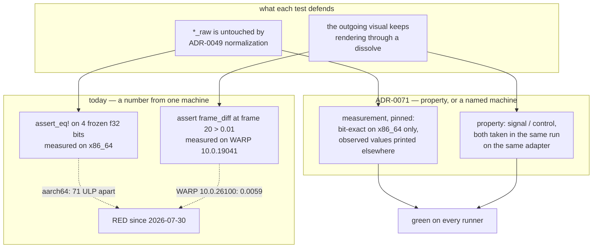

# 0060 — A test number states a property, or names its machine

> **Status:** **done 2026-08-04** — all three phases landed and the Mode 4 review found **no
> blockers**. Phase 1 `1d56600` (both gates state what they can prove) plus `31073f6` (the
> `.config/nextest.toml` `success-output` override, without which Phase 2 would have read nothing
> off a green run); Phase 2 the `human` push, **CI green on all three jobs**, run **30903871856**;
> Phase 3 `a324b21` (the three documentation items) and `ae4c215` (the magnitude claim, on
> hardware). **CI has been green since Phase 1** after five consecutive red pushes.
> **Phase 3 was re-scoped mid-plan by the architect**, by this phase's own route-back clause: the
> CI ratio came back at `0.036654`, under the `0.05` fallback the plan named in advance, so
> [ADR-0074](../../adrs/0074-a-ratio-against-an-in-run-control-is-not-automatically-portable.md) took
> the decision — **no ratio floor on WARP**, the test demoted to a property-only smoke check that
> says so in its own doc, and the magnitude claim moved to hardware. It was then measured **here**,
> once ADR-0074's "hardware we do not have" premise turned out to be false.
> **The hardware reading is the plan's most durable finding, and it is not the one it went looking
> for**: `0.036542` landed on the **CI WARP** reading, not the local one — matching to three figures
> on the ratio and **five on the control**. So WARP 10.0.26100 behaves like hardware and **this
> box's WARP 10.0.19041 is the outlier**, which inverts the mechanism ADR-0074 recorded and hands
> Plan [0053](../0053-the-suite-stops-blessing-what-warp-gets-wrong.md) a sharper question than the one
> it was given. Recorded in ADR-0074's **Outcome** section; see Followups.
> **Verified at close:** `fmt` clean, `clippy -D warnings` clean, full `nextest` green on `main`,
> both dual-live reports reproduced under `--no-capture`, no golden baseline moved, no shipped code
> touched, C ABI unchanged at v4. Version bumped **patch** at this close.
> **Created:** 2026-08-04
> **Owner skill(s):** dev, human
> **Related ADRs:** [0071](../../adrs/0071-a-numeric-test-contract-states-a-property-or-names-its-machine.md)
> (this plan's decision),
> [0074](../../adrs/0074-a-ratio-against-an-in-run-control-is-not-automatically-portable.md) (Phase 3's
> re-scope, taken from Phase 2's readings), [0016](../../adrs/0016-gpu-tests-opt-in-ci-scope.md) (the skip-with-notice
> shape reused here), [0023](../../adrs/0023-golden-drift-guard-uses-frozen-fixtures.md) (whose
> `MEAN_TOL` is the noise floor one threshold is measured against),
> [0049](../../adrs/0049-analysis-v2-dual-resolution-axis-normalized-bands.md) (the raw levels one
> test defends).

## TL;DR

CI has been red since 2026-07-30 — five consecutive pushes — because two tests freeze a number
that only exists on the machine that measured it. One asserts bit-exact `f32` literals taken on
x86_64 and has never once passed on the arm64 macOS runner; the other asserts a pixel-difference
floor of `0.01`, which is **half** the `0.02` this project already calls cross-rasterizer noise,
and which reads `0.045` on the developer's WARP against `0.0059` on the runner's. Phase 1 makes
both gates state only what they can prove on any machine and print everything they observed, which
turns CI green. Phase 2 pushes and reads the two runners' numbers. Phase 3 sets the durable
magnitude contract from those numbers rather than from this box. First user-visible behavior:
none — this plan moves no pixels and changes no shipped code.

**Outcome, 2026-08-04.** Phases 1 and 2 did what they said: CI is green and the numbers are in.
Phase 3's magnitude half **did not survive its own measurement** — the ratio moves 7.3x between two
builds of the same software rasterizer, so it is not the portable quantity the design took it for.
[ADR-0074](../../adrs/0074-a-ratio-against-an-in-run-control-is-not-automatically-portable.md) takes
that decision: no floor, the WARP test demoted to a property-only smoke check that says so in its
own doc, and the magnitude claim deferred to hardware. What this plan set out to do — stop two
tests asserting a number that only exists on one machine — is done either way.

## Context & problem

The user asked why CI was failing. Two tests fail, deterministically, on every run since
`554c3aa` (macOS) and `31ea398e` (Windows). Everything else is healthy: `fmt`, `cargo test --doc`
and `clippy -D warnings` are all clean at `4ab383c`, verified locally — they simply never ran in
CI, because `nextest` aborts the step first.

**`raw_levels_are_bit_identical_to_the_pre_normalization_build` (`core/tests/dsp.rs`).** Four
`f32` levels are asserted to reproduce, bit for bit, literals measured against `92579ef` on an
x86_64 box. On `macos-26-arm64` `bass_raw` diverges by `8.4e-6` relative — about 71 ULP — and it
cannot do otherwise. The fixture builds its own input with `f32::sin` (platform libm), and
`rustfft` dispatches NEON on aarch64 where it dispatches AVX/SSE on x86_64: different rounding
applied to slightly different samples. The test has never passed on that runner. The other three
literals' arm64 values are unknown, because `assert_eq!` inside the loop stops at the first
mismatch.

**`dual_live_keeps_the_outgoing_side_animating` (`core/src/render/mod.rs`).** The assertion is
`frame_diff(frozen[20], live[20]) > 0.01`. The Plan 0045 linear-light merge moved the reading, so a
code change is what turned it red — but the threshold was never sound. `core/tests/golden.rs` sets
`MEAN_TOL = 0.02` as the mean per-channel difference that counts as rasterizer drift rather than
signal. This floor is half of that, and the healthy local reading is 2.25x it. The claim has always
been made inside the band this project already declares to be noise.

Neither number can be re-chosen here. The failing configurations exist only on the runners, and per
Plan [0036](0036-macos-and-windows-release-artifacts.md) Phase 4 there is no Mac on this side at
all. That is what shapes the phases below: the measurement has to come back from CI before the
contract can be written.

## Decision

Both tests are rewritten to [ADR-0071](../../adrs/0071-a-numeric-test-contract-states-a-property-or-names-its-machine.md)'s
rule — state a property that holds on every configuration, or name the configuration the number
came from and skip elsewhere — and the work is sequenced **instrument first**, the pattern Plans
0057 and 0058 both used: land the thing that makes the numbers visible, read them, then set the
contract. The DSP test keeps its bit-exact claim and pins it to x86_64. The render test trades its
absolute floor for a ratio against a control taken in the same run on the same adapter, so the
rasterizer cancels.

We rejected re-measuring the constants per target and keeping them absolute, because that is the
same machine-pinning multiplied and needs a fresh round trip on every runner-image change; and
loosening both thresholds until the runners pass, because for the render test the honest loosening
lands under a third of `MEAN_TOL`, which is a test that noise alone satisfies. Making the render
test hardware-only — its sibling's treatment — was considered and is kept as the documented
fallback if Phase 2's numbers show the ratio cannot survive WARP either.

**The ratio did not survive, and the fallback was not taken as written**
([ADR-0074](../../adrs/0074-a-ratio-against-an-in-run-control-is-not-automatically-portable.md)). What
fails to travel is the **magnitude**, not the property — so the test stays on WARP with its
property-form assertions, gains no floor, and the magnitude claim moves to hardware. The rejection
of a per-target constant table stands and is if anything stronger: the two WARP builds measured
here are not a stable identity to pin against.

## Architecture diagram

## Implementation phases

### Phase 1 — Both gates state what they can prove, and both report what they saw

- **Owner skill:** dev
- **What:** Neither test asserts a number it cannot own on the machine it is running on, and both
  print their full observation so Phase 2 can read it out of the CI log. CI goes green.
- **Files touched:** `core/tests/dsp.rs`, `core/src/render/mod.rs`
- **Detail — DSP.** The four-literal comparison runs under `cfg(target_arch = "x86_64")` and keeps
  `assert_eq!` on the bits exactly as it is. On every other architecture it prints each observed
  value as hex bits, decimal, and relative error against the same literal, plus a one-line notice
  naming where the reference came from (`92579ef`, x86_64) in the ADR-0016 shape. The existing
  non-vacuity counter-assertion — `frame.bass != frame.bass_raw`, that normalization is not a
  no-op — needs no frozen number and **runs on every architecture**, so the test is not vacuous
  where it is pinned.
- **Detail — render.** Replace the single-frame floor with the exact statement of the defect: a
  dual-live dissolve that wrongly held the outgoing side would do the same work freeze does and,
  given this project's determinism contract, render **byte-identically at every frame** — the
  opening-frame `assert_eq!` on raw RGBA already demonstrates the two runs are byte-reproducible
  against each other. So Phase 1 asserts the two modes differ somewhere in the window, which needs
  no threshold, and additionally asserts the control series is non-trivial so a dissolve that is
  not dissolving cannot pass. Print the whole statistic set: the per-frame signal series
  `frame_diff(frozen[i], live[i])`, its peak and mean, the control series
  `frame_diff(frozen[0], frozen[i])` and its peak, and the peak-signal-over-peak-control ratio.
- **Done when:** on x86_64 the four raw levels are still asserted bit-for-bit and the dual-live
  test still fails if the outgoing side is held; on aarch64 the DSP test asserts that normalization
  changes the value and prints the four observed raw levels instead of failing on their bits; the
  dual-live test passes on both the developer's WARP and the runner's while still failing a build
  where freeze and dual-live render identically; and `cargo nextest run` is green locally with the
  full statistic line visible under `--success-output immediate`.

### Phase 2 — The runners report their own numbers

- **Owner skill:** human
- **What:** Push Phase 1 and hand back what the two runners printed. Only the user pushes, and the
  arm64 and CI-WARP configurations exist nowhere else.
- **Files touched:** none (this plan gains a measurements table).
- **Done when:** the CI run for the Phase 1 commit is green on `check (windows-latest)`,
  `check (macos-latest)` and `coverage`, and two readings are recorded in this plan: the four
  arm64 raw levels with their relative errors, and the Windows runner's full dual-live statistic
  line including the ratio. If the run is *not* green, that is the finding and Phase 3 reads it
  instead.
- **Done 2026-08-04**, run **30903871856**, green on all three jobs. Readings below.

#### Phase 2 measurements

Read out of the CI log through the `.config/nextest.toml` `success-output` override (`31073f6`) —
without it both tests would have printed nothing, being passing tests on exactly the green run that
was supposed to produce their numbers.

**arm64 raw levels** (`macos-latest`, `macos-26-arm64`), against the x86_64 literals frozen at
`92579ef`:

| level | observed bits | observed value | relative error |
|---|---|---|---|
| `bass_raw` | `0x386597d6` | `5.4739263e-5` | `8.44e-6` |
| `mid_raw` | `0x3bd581b5` | — | **bit-identical to the reference** |
| `treb_raw` | `0x35f3168e` | `1.8111475e-6` | `1.15e-5` |
| `onset_raw` | `0x348652cd` | `2.501969e-7` | `1.86e-5` |

**`onset_raw` is not the interesting one after all.** This plan's Risks section flagged that a
difference-derived value at `2.502e-7` could diverge by orders of magnitude more than `bass_raw`.
It does not: `1.86e-5` is **2.2x** `bass_raw`'s `8.44e-6`, the same order. All four sit within
`2e-5` relative, and one of them reproduces exactly. Nothing here argues for a cross-architecture
tolerance, but the size of the divergence is now known rather than inferred from a skip — which is
what Phase 3 records in the test's doc comment.

**Windows dual-live statistics** (`windows-latest`, WARP 10.0.26100):

| statistic | local WARP (10.0.19041) | CI WARP (10.0.26100) | spread |
|---|---|---|---|
| peak signal | 0.109573 | **0.009683** | 11.3x |
| peak control | 0.407826 | 0.264177 | 1.54x |
| **ratio** | **0.268675** | **0.036654** | **7.3x** |

`check (windows-latest)` and the instrumented `coverage` job printed `0.036654` **identically**, so
the CI reading is stable rather than a noisy sample. `0.036654` is below the `0.05` fallback
condition named in this plan's Risks, so Phase 3 routed back to `architect` as instructed —
see [ADR-0074](../../adrs/0074-a-ratio-against-an-in-run-control-is-not-automatically-portable.md).

**Coverage: 93.34 % lines against `COVERAGE_FLOOR = 88`** — the first evaluation since 2026-07-30,
and it passes with 5.34 points of slack. The Risks entry that named this as a possible Phase 2
finding is closed: no floor change is owed by this plan, and the followup it would have triggered
is not needed. Note for whoever writes the floor next — Plan
[0061](0061-the-build-stops-paying-for-what-it-is-not-building.md) Phase 2 moves the same number
for a different reason (it removes `ffi.rs` from the gated crate), and this is the reading it moves
from.

### Phase 3 — The magnitude contract is set from those readings

> **Re-scoped 2026-08-04 by the architect**, from Phase 2's readings and this phase's own
> route-back clause. The render half no longer adds a floor;
> [ADR-0074](../../adrs/0074-a-ratio-against-an-in-run-control-is-not-automatically-portable.md) is the
> decision and the reasoning. The DSP and spec halves are **unchanged** — they were never dependent
> on the ratio.

- **Owner skill:** dev
- **What:** Write down what Phase 2 measured, in the three places a future reader will look: the
  render test's doc comment, the DSP test's doc comment, and the determinism spec — **and take the
  magnitude claim on hardware**, which turns out to be available on the dev box rather than gated
  on a `human` phase.
- **Files touched:** `core/src/render/mod.rs`, `core/tests/dsp.rs`,
  `docs/specs/0002-ring-determinism.md`
- **Detail — render.** ~~Add the ratio floor.~~ **No ratio floor.** The ratio moved 7.3x between
  two builds of the same software rasterizer (`0.268675` local against `0.036654` on CI WARP), so it
  is not the portable quantity ADR-0071 took it for, and half the lower reading would be a
  measurement asserted universally — the shape this plan exists to remove. Instead, **demote the
  test's doc comment to what it actually proves on a software adapter**: that dual-live runs, that
  it produces a different picture from freeze somewhere in the window, and that the dissolve is
  dissolving. It must stop reading as a guard on the defect, because on WARP it is not one — this
  plan's own Risks section says the allocation quirk lets a held outgoing side through, and that
  belongs in the test rather than only here. Record both readings and the 11.3x signal spread in
  the comment, and point at ADR-0074. Change no assertion **in the WARP test**.
  **Landed as `a324b21`, with one thing now stale in it.** That commit sent the magnitude claim to
  Plan [0053](../0053-the-suite-stops-blessing-what-warp-gets-wrong.md) Phase 3, which was this plan's
  instruction at the time and was superseded hours later when ADR-0074's premise was corrected. The
  pointer sits at `core/src/render/mod.rs:3223-3225` and is re-pointed by the hardware item below —
  **it is not a second thing to decide.**
- **Detail — the magnitude claim, on hardware (added 2026-08-04, after the deferral's premise
  turned out to be false).** The gate these checks skip on is
  `Renderer::adapter_is_software()` — `device_type == DeviceType::Cpu`
  (`core/src/render/context.rs:148`) — **not** "a discrete GPU", and the hardware-only sibling
  `a_dual_live_dissolve_carries_the_outgoing_trail` **runs and passes on the dev box today**
  (verified 2026-08-04 with `cargo nextest run ... --no-capture`: 7.68 s of real GPU work, no skip
  notice). So the clean measurement is available here and now:
  - Take the same signal/control statistics through `dissolve_at(..., software = false)`, i.e. a
    **second, hardware-only** test beside the WARP one rather than a change to it — the WARP test
    keeps its property form and its printed report, per ADR-0074.
  - **On hardware the confound is gone**: `dissolve_at`'s own docs record that the opening frame is
    byte-identical to the ordinary frame it replaces, so the numerator is the outgoing side
    animating and nothing else. That is why this reading is worth a floor where the WARP one is not.
  - **Report the reading before choosing the floor**, and choose it as at most half of it. If the
    hardware ratio lands near the local WARP `0.269`, say so; if it lands somewhere else entirely,
    that is itself the finding and is worth a sentence in the doc comment.
  - It **skips in CI on both runners** (WARP on Windows, no software Metal on macOS — ADR-0016), so
    it is enforced by the local gate and `.githooks/pre-push`, never by CI. Say that in the test's
    doc rather than letting a future reader assume CI is watching it.
  - **One box is a measurement, not a property.** Name the adapter and the driver version in the
    doc comment, in the ADR-0071 shape. Do not write it as a universal floor.
- **Detail — DSP.** Record the arm64 observations in the test's doc comment as
  observed-but-not-asserted, with their relative errors, so the next reader knows the size of the
  divergence rather than inferring it from a skip. The four values are in the Phase 2 measurements
  table above; note that `mid_raw` reproduces **bit-identically** and that `onset_raw`'s divergence
  is 2.2x `bass_raw`'s rather than the orders of magnitude the Risks section allowed for.
- **Detail — spec.** `docs/specs/0002-ring-determinism.md` requires that the same hops through a
  fresh `Analyzer` produce "a bit-identical sequence of analysis frames". That is true and is not
  what broke — it is a same-machine claim, and `analysis_is_deterministic` runs both analyzers in
  one process. Sharpen it to say so explicitly: bit-identity is contracted **within one build on
  one machine**, and reproduction across architectures is deliberately not claimed. This is the
  sentence whose absence let the frozen-literal test read as though it followed from the spec.
- **Done when:** the dual-live test's doc comment states what it proves on a software adapter and
  what it does not, carries both readings and the spread, and cites ADR-0074
  — with **no assertion added, removed or loosened**, and the printed statistic set left intact;
  the DSP test's doc comment carries the four arm64 values; the determinism spec states the scope
  of its bit-identity clause; `fmt`, `clippy -D warnings` and the full `nextest` run are clean
  locally, and no golden baseline moves. **Landed `a324b21`.**
- **Done when (the hardware item): landed `ae4c215`.** A second, hardware-only test
  (`a_dual_live_dissolve_moves_the_picture_against_its_own_progression`) asserts a ratio floor of
  `0.018` — half the `0.036542` measured on a **non-software** adapter, rounded down; its doc
  comment names the adapter (`AMD Radeon(TM) Graphics`, integrated, `0x1002:0x1638`), driver
  `30.0.13002.1001`, DX12, in the ADR-0071 measurement shape, states that it skips on both CI
  runners so CI never enforces it, and tabulates the hardware reading against both WARP readings.
  The WARP test is untouched apart from that citation, and `a324b21`'s pointer at Plan 0053 Phase 3
  is re-pointed at the new test. Verified non-vacuous by mutation (both sides frozen collapses the
  ratio to exactly `0.000000`), and reproduced at close under `--no-capture`.

#### Phase 3's hardware reading — the finding it did not go looking for

| statistic | this box's hardware | CI WARP 10.0.26100 | local WARP 10.0.19041 |
|---|---|---|---|
| peak signal | 0.009653 | 0.009683 | 0.109573 |
| peak control | 0.264172 | 0.264177 | 0.407826 |
| **ratio** | **0.036542** | **0.036654** | **0.268675** |

The measurement was expected to land near the local WARP `0.268675` — the reading this box produces
and the one ADR-0074 treated as the healthy reference when it sized Alternative A's headroom.
**It landed on the CI reading instead**, matching to three significant figures on the ratio and five
on the control. Two independent statistics reproducing that closely across a software rasterizer and
a hardware DX12 adapter is not coincidence, and it inverts ADR-0074's recorded mechanism: the quirk
is not the *newer* WARP costing more trail history, it is **this box's older WARP inflating the
numerator**, and every local capture — including every golden blessing — is taken on that build.
ADR-0074's decision is unchanged (a number reproducing on two configurations is still a measurement,
not a portable floor), but its Context, one Negative bullet and Alternative A's rejection are all
narrower than they read. Carried in ADR-0074's **Outcome** section and in Followups below.
- **Running alongside Plan [0059](0059-lorenz-finds-its-plane.md), which is live in a parallel
  session as of 2026-08-04.** No file is shared — that plan's Phase 4 is `presets/attractor_*.toml`
  and this one is `core/src/render/mod.rs`, `core/tests/dsp.rs` and `docs/specs/`. Three
  consequences, all mechanical:
  - **Commit with explicit pathspecs** (`git commit -- <paths>`). `git commit` takes the whole
    index, so a file the other session has staged sweeps into your commit otherwise. This repo has
    been bitten by it before.
  - **Expect `target/` lock contention.** Two concurrent cargo invocations produced a Windows
    `LNK1104: cannot open file ...exe` in this session — a stale handle, not a code failure.
    Re-run rather than diagnosing it.
  - **Do not touch `core/tests/sanity.rs`.** [0059] Phase 4 may re-derive coverage floors there;
    this phase has no business in that file.
- ~~**Route back to `architect` if:** Phase 2's ratio does not clear the fallback condition in Risks
  below.~~ **This fired.** The ratio came back at `0.036654`, under the `0.05` condition, and the
  decision was taken in
  [ADR-0074](../../adrs/0074-a-ratio-against-an-in-run-control-is-not-automatically-portable.md) rather
  than by `dev`. The clause worked as designed and is left here as the record of it.

## Risks & open questions

- **The exact-zero property is weaker on WARP than it looks, and this is the main risk.**
  `dissolve_at`'s own docstring records that on WARP, allocating the dissolve's GPU resources
  mid-run resets what the trails feedback resolves to. Dual-live allocates more than freeze does,
  so on WARP the two modes can differ *for that reason alone* — meaning Phase 1's positivity check
  could pass even with the outgoing side held. This is exactly why Phase 3's magnitude half
  matters and why the plan does not stop at Phase 1. Phase 1 is honest about what it is: a gate
  that cannot fail spuriously, not the whole claim.
  **Resolved 2026-08-04 as the shipped state rather than as a risk retired.** Phase 3 no longer
  adds the magnitude half, so this weakness is what CI keeps. ADR-0074 accepts it in writing and
  Phase 3 writes it into the test's own doc comment, where the previous version of this plan left
  it visible only here.
- **The fallback condition, stated in advance.** If Phase 2's CI ratio is below `0.05` — roughly
  a fifth of the local reading, and near where the allocation quirk alone could account for it —
  then the ratio does not separate signal from artifact on WARP, and the honest answer is the
  alternative this plan did not pick: make the test hardware-only alongside its sibling
  `a_dual_live_dissolve_carries_the_outgoing_trail`, accepting that CI stops checking the dissolve.
  Phase 3 routes back to `architect` rather than deciding that.
  **It fired: `0.036654`.** The decision taken was neither the floor nor the fallback as written —
  ADR-0074 takes the fallback's *substance* (no ratio floor) and declines its *mechanism* (the
  test stays on WARP as a property-only smoke check, because what failed to travel is the
  magnitude, not the property). Naming the condition in advance is what made the call cheap; it is
  worth repeating on the next plan that has to read a number off a machine it does not own.
- **`onset_raw` may be the interesting one.** At `2.502e-7` it is small enough that a
  difference-derived value can lose relative precision badly, so its arm64 divergence could be
  orders of magnitude worse than `bass_raw`'s `8.4e-6`. Phase 2 will show it for the first time.
  It changes nothing about the chosen design — the literals are pinned either way — but a large
  number there is worth knowing before anyone proposes a cross-architecture tolerance later.
  **It is not.** `1.86e-5`, 2.2x `bass_raw`'s — same order, and `mid_raw` reproduces bit-exactly.
  The guess did not hold, and the plan was right that it changed nothing about the design.
- **Coverage genuinely lost.** After this, nothing checks the raw band path on aarch64. Named as
  ADR-0071's accepted cost rather than mitigated; the portable sibling
  `normalized_levels_are_portable_across_absolute_gain` still exercises the analyzer there.
- **The coverage job is unmeasured.** `COVERAGE_FLOOR` is 88 and the coverage job has not reached
  its measurement step since 2026-07-30, because the same dual-live failure aborts it. Phase 2's
  green run is the first time in five pushes the ratchet actually gets evaluated; it could fail on
  a number nobody has seen recently. That is a possible Phase 2 finding, not a Phase 1 defect.
  **It did not fail: 93.34 % against 88.** No floor change is owed by this plan and the followup
  below is not needed.

## What this plan does NOT do

- **It does not touch the Plan 0045 linear-light chain.** That series moved the dual-live reading,
  and the reading moving is not evidence the chain is wrong — the test was measuring inside the
  noise band either way. If the linear-light composite has a real defect, finding it is separate
  work and this plan would only have hidden it behind a threshold.
- **It does not add a per-target constant table**, which is ADR-0071's Alternative A.
- **It does not revisit `MEAN_TOL`, the golden baselines, or the WARP-trust work in Plan
  [0053](../0053-the-suite-stops-blessing-what-warp-gets-wrong.md).** 0053 owns whether WARP's output
  should be trusted at all; this plan only stops two thresholds from depending on which WARP ran.
  They touch in one place worth knowing: if 0053's Phase 3 hardware access materializes, the
  hardware-only fallback above becomes cheaper to accept.
- **It moves no golden baseline and no preset.** No `LMV_BLESS` run is expected or authorized;
  see the standing note that blessing is not scoped to one scene.
- **It does not change CI's workflow file**, the job matrix, or the coverage floor.

## Followups (after this lands)

- ~~If Phase 2 shows the coverage ratchet failing on a number nobody has seen since 2026-07-30,
  that is its own small plan~~ — **not needed**, it read 93.34 % against 88.
- ~~ADR-0071's corollary ... Consider adding it to the architect skill's lens 4 at this plan's
  close. Add ADR-0074's corollary alongside it.~~ **Done at this close** — both corollaries are in
  the `architect` skill's lens 4, phrased as the two questions to ask of any numeric assertion in a
  diff.
- ~~**The dual-live magnitude claim is owed on hardware**, at Plan 0053 Phase 3~~ — **paid here,
  `ae4c215`.** The deferral rested on a premise that was false and cheap to check: the gate is
  `Renderer::adapter_is_software()` (`device_type == Cpu`), not "a discrete GPU". Plan 0053 Phase 3
  no longer owes this, and ADR-0074 Alternative C (re-posing the control as the outgoing preset's
  own un-dissolved motion) is no longer a fallback against hardware never arriving — it is now only
  a *better-posed* successor if anyone wants the WARP test to carry a magnitude after all.
- **Two WARP builds disagree 11.3x on the dual-live signal, and the hardware reading says which one
  is wrong.** This entry used to say nothing explained the spread beyond "the allocation quirk costs
  more history on the newer build". `ae4c215` explains it the other way: hardware matches the
  **newer** WARP to five figures on the control, so **10.0.19041 — this box's build — is the
  outlier**, inflating the numerator. The consequence is larger than the original entry's, because
  the golden suite blesses on this box: a `frozen`-only sequence with no dual-live asymmetry in it
  renders 1.54x differently here than on either other configuration, and nothing has looked at what
  else that moves. **This is Plan [0053](../0053-the-suite-stops-blessing-what-warp-gets-wrong.md)'s
  question** — it owns whether WARP's output should be trusted at all — and it is now a sharper one
  than the plan was written against. Recorded in ADR-0074's Outcome section.
- **`dissolve_at`'s doc comment states a machine-specific behaviour as a property of "the DX12 WARP
  rasterizer"** (`core/src/render/mod.rs`), and it is load-bearing: it is the stated reason
  `a_dual_live_dissolve_carries_the_outgoing_trail` is hardware-only and the reason
  `core/tests/background_composite.rs` skips. On the evidence above it is a property of one WARP
  build. That is ADR-0071's own error one level down, in prose rather than in an assertion.
  **Deliberately not edited from a single contrary reading** — one more configuration (a second
  hardware adapter, or a newer local WARP) settles it, and Plan 0053 Phase 3 is where that happens.
- **`0.018` cleared every reading taken so far**, including both WARP ones. ADR-0074 rejected it as
  a universal floor and that rejection stands on its remaining leg, but the question is now open
  rather than settled — see ADR-0074's Outcome. **Do not reopen it on a fourth sample from this
  box**; reopen it on a configuration this project has not yet measured.

[0059]: 0059-lorenz-finds-its-plane.md
