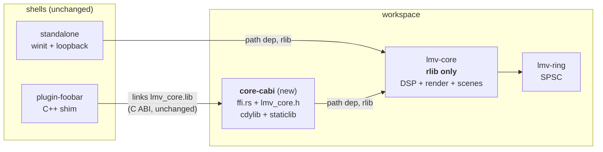
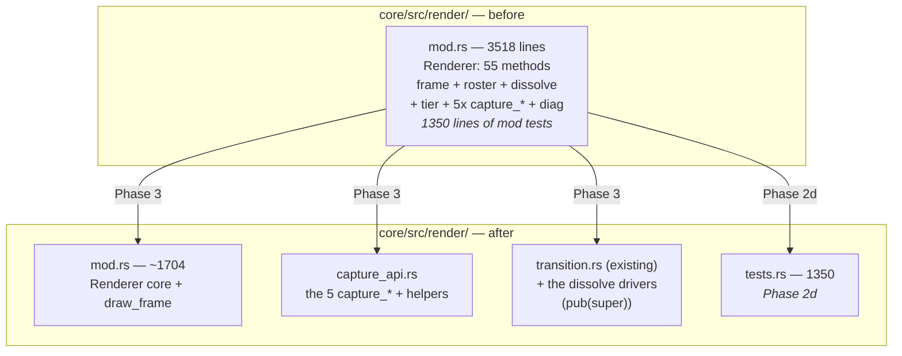
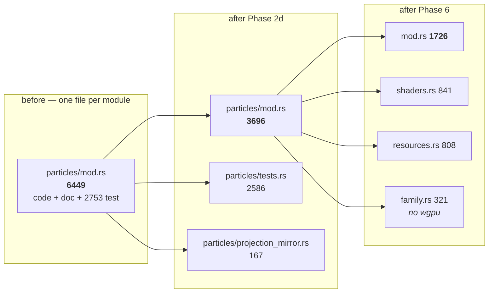
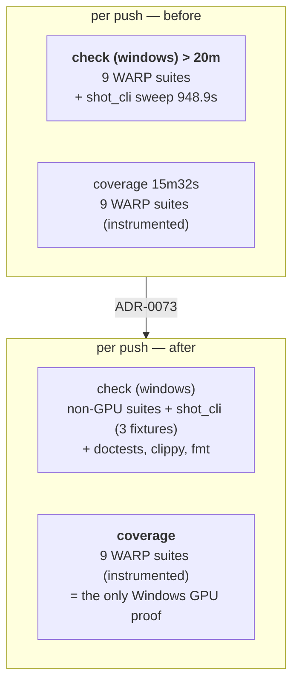

# 0061 — The build stops paying for what it is not building, and the two oversized modules come apart

> **Status:** **done 2026-08-08** — all ten `dev` phases landed (`02a03ba` 1, `e7a68a1` 1b, `d442f7a` 2,
> `55388b2` 2b, `49ca599` 2c, `b449b45` 2d, `f74cb1d` 3, `5bb754c` 4, `1c55476` 4b, `ab5de61` 5,
> `3d36715` 6, `fa76fc5` 7, `800f102` 7b). Mode 4 review: **no blockers, two majors, three minors** —
> all five were doc drift, all five repaired in the close commit. Every phase carries a valid
> `**Owner skill:**` tag; no ADR decision was reversed; `core/tests/golden/` is byte-identical across
> the whole plan by `git diff` (checked as a diff, never as a green suite — `LMV_BLESS` was never set).
> Every numeric done-when was met with margin: `render/mod.rs` 1688 (< 1800), `particles/mod.rs` 1459
> total / 634 code (< 1900 / < 1400), `shot.rs` 618 (< 1200), `docs/plans/README.md` 214 (< 400).
>
> **The two `human` phases are outstanding and are carried forward rather than holding the plan open**
> — neither is runnable by `dev` or by `architect`, and neither blocks anything that has landed.
> **Phase 8** (link the foobar plugin against the extracted crate) needs VS Build Tools plus the
> unpacked foobar SDK; the artifact it links is now `lmv_core_c.lib`, which is exactly what Phase 2's
> rename changed, so this is the check most worth running. **Phase 9** (read a cache-warm CI run)
> is what re-derives `COVERAGE_FLOOR` from the right machine and confirms `coverage` is the longest
> job — the property that would otherwise flip ADR-0073's Alternative A. Both are recorded under
> *Standing* in [`docs/plans/README.md`](../README.md) and in each ADR's `Outcome` section.
>
> **Phase 4b's scoping half landed early and out of sequence** as `1c55476` (2026-08-04, at the
> user's direct request); see the note on that phase for what it satisfies, the one accepted
> deviation, and the coverage gap it opened — **now closed by Phase 4**.
> **Every file measurement was re-taken 2026-08-08** (fourth amendment). The build and CI numbers —
> the 412 MB staticlib, the 33.9 GB of PDBs, the 948.9 s `shot_cli` test — are **still 2026-08-04
> snapshots** and are the ones left to re-measure before acting. This plan's own instruction, **do
> not satisfy a stale number literally**, has now been vindicated three times: the 2026-08-06 Phase 6
> re-measure, its own first pass counting the wrong column, and the 2026-08-08 pass that found the
> 2026-08-06 table already wrong (`shaders.rs` 409 → 785 code lines in two days) and Phase 3's line
> target unreachable by the moves Phase 3 names.
> **Created:** 2026-08-04
> **Amended:** 2026-08-04 — four phases added (1b, 2b, 4b, 9) covering CI wall time, after run
> 30903871856 made the first green measurement available; [ADR-0073](../../adrs/0073-the-windows-ci-critical-path.md)
> **Amended:** 2026-08-04 (second pass) — Phase 4b reconciled against `1c55476`, which implemented
> it ahead of its sequence
> **Amended:** 2026-08-04 (third pass) — **Phase 2c added**: a CI counterpart for the doc-link
> check. The checker and its pre-push step landed at Plan 0060's close (`06d198f`, `cdcd750`) after
> 74 broken links were found across 23 files; the CI half comes here because this plan owns every
> `ci.yml` edit in flight. Independent of 2b/4b and separable from them.
> **Amended:** 2026-08-08 (fourth pass) — **Phases 2d and 7b added, Phase 3's target corrected,
> Phase 6's table re-measured.** The user's re-review request named the goal this plan had been
> approximating: *files are huge and that is bad for context and readability*. Measured against that
> goal rather than against code lines, **Phase 6 as approved did not deliver it** — after its
> four-way split `particles/mod.rs` still stood at ~4,100 total lines, because 2,586 lines of
> `mod tests` stayed behind and no phase moved them. **Phase 2d** is the missing phase: 40.9 % of
> this project's Rust source is inline `#[cfg(test)] mod` blocks, and moving them out of line is a
> pure file move that changes no visibility and no test path. It also repairs **Phase 3**, whose
> "under 2400 lines" was unreachable by the moves it names — at any point in this plan's life.
> **Phase 7b** takes `docs/plans/README.md`, which at 3,516 lines is the largest document in the
> repository and the one the `architect` skill tells every session to read first.
> **Owner skill(s):** dev, human
> **Related ADRs:** [ADR-0072](../../adrs/0072-the-c-abi-ships-from-its-own-crate.md) (new, proposed),
> [ADR-0073](../../adrs/0073-the-windows-ci-critical-path.md) (new, proposed),
> [ADR-0001](../../adrs/0001-rust-core-wgpu-cabi-foobar-shim.md),
> [ADR-0003](../../adrs/0003-c-abi-v1-surface.md),
> [ADR-0016](../../adrs/0016-gpu-tests-opt-in-ci-scope.md),
> [ADR-0017](../../adrs/0017-preset-author-skill-lane.md),
> [ADR-0033](../../adrs/0033-testing-strategy-coverage-ratchet-and-pre-push-gate.md),
> [ADR-0053](../../adrs/0053-plan-lanes-run-in-git-worktrees.md)

## TL;DR

A maintainability audit (2026-08-04, architect Mode 4 on the whole tree) found the architecture
healthy — no layering violations, a clean audio callback, an allocation-free per-frame GPU path,
green clippy — but three localized problems worth a plan: every core edit rebuilds a 412 MB
staticlib no test consumes, `target/debug` carries 33.9 GB of debug symbols across 264 PDBs, and two
modules have grown past the point where a reader can hold them. This plan halves the edit-compile
loop, extracts the C ABI into its own crate ([ADR-0072](../../adrs/0072-the-c-abi-ships-from-its-own-crate.md)),
carves the capture and transition families out of `Renderer`, splits the attractor's
`mod.rs` (3077 lines at drafting, **6449 as of 2026-08-08**; see Phase 6's re-measure) into the
directory it already lives in, and closes four smaller findings. **It moves no pixels** — every
golden baseline must come back byte-identical.

**Amended 2026-08-08 with the finding that the size half of this plan was measuring the wrong
number.** Phases 3 and 6 both stated line targets, and both were derived from *code* lines — tests,
doc comments and blanks excluded — because this plan's opening table found raw counts misleading. That
correction was right for judging whether a module does too many jobs, and **wrong for the goal the
user actually stated**: a reader, and a session's context window, pays for *total* lines. The two
numbers diverge here more than anywhere: **40.9 % of this project's Rust source (19,130 of 46,793
lines) is inline `#[cfg(test)] mod` blocks**, and not one file in the tree uses an out-of-line test
module. Phase 6's four-way split would have left `particles/mod.rs` at ~4,100 total lines — a file
nobody can hold, passing a done-when. **Phase 2d** moves every substantial test module to a sibling
`tests.rs`; it is a pure file move that changes no visibility, no test name and no behaviour, and it
is what makes Phases 3 and 6 deliver what they claim. **Phase 7b** applies the same finding to
`docs/plans/README.md` (3,516 lines, the repo's largest document, read first by every session).

**Amended 2026-08-04 with the same finding on the build machine.** The first green run since
2026-07-30 shows the shipped preset library rendered **three times per push**: once in `check
(windows-latest)`, once instrumented in `coverage` (≈ 1930 duplicated CPU-seconds on two identical
runners at the same moment), and a third time by a single `shot_cli` subprocess test that takes
**948.9 s — 61 % of `check`'s test wall clock** — to assert that some JSON is balanced. That is this
plan's own title applied to CI, so it lands here rather than in a plan of its own. Phase 2b gives the
GPU sweep one owner and Phase 4b takes the shape claim off the critical path (both
[ADR-0073](../../adrs/0073-the-windows-ci-critical-path.md)); Phase 1b tries dependency optimization in
the same `[profile.dev]` table Phase 1 edits; Phase 9 reads the resulting run. **Neither CI phase
works without the other** — see Phase 2b's note.

**Amended again the same day with Phase 2c**, which is a different kind of CI cost: not wall time
but a gate that does not exist. Plan [0060](0060-a-test-number-states-a-property-or-names-its-machine.md)'s
close found **74 broken relative markdown links across 23 files**, accumulated over six consecutive
closes because moving a plan into `plans/done/` breaks links in both directions and nothing checked.
`scripts/check-doc-links.mjs` and its pre-push step exist now; Phase 2c adds the CI job, so the
check stops depending on an opt-in hook. It is seconds on `ubuntu-latest`, touches neither Windows
job, and is separable from 2b/4b.

## Context & problem

The user asked for a review of code size, maintainability and application performance. Raw line
counts are misleading in this repo, because doc comments and inline `mod tests` are the majority of
the biggest files — `core/src/render/tonemap.rs` is 1034 lines holding **10** lines of code, and
`post.rs` is 1630 lines of which 1021 are tests. Corrected for that, only two files carry more than
~1200 lines of actual code:

| File | total | tests | doc/blank | **code** |
|---|---|---|---|---|
| `core/src/render/scenes/particles/mod.rs` | 6449 | 2793 | 1417 | **2239** |
| `core/src/render/mod.rs` | 3518 | 1357 | 1015 | **1146** |
| `core/src/render/scenes/particles/ifs.rs` | 2734 | 1570 | 646 | **518** |
| `core/src/preset/expr.rs` | 1879 | 241 | 614 | **1024** |
| `standalone/examples/shot.rs` | 1622 | 0 | 506 | **1116** |
| `standalone/src/main.rs` | 1415 | 0 | 428 | **987** |

*(Re-measured 2026-08-08 at `f0dbf57`. The 2026-08-04 drafting figures were 3077 / 3272 / — / 1878 /
1621 / 1414 total; `ifs.rs` did not exist in the table because it landed the same day, as `8c621fa`.)*

`expr.rs` is a tokenizer + parser + evaluator + gate analyzer, which is a defensible unit at ~1024
lines; it is **out of scope**. The two that are not defensible:

- **`particles/mod.rs` is a directory module doing a directory's worth of work in one file.**
  `particles/` holds `mod.rs` plus `ifs.rs` — the latter added 2026-08-04 by Plan 0062 — while the
  sibling `lines/` is decomposed into ten files. Five concerns share `mod.rs`: attractor family ODE
  math (`AttractorFamily`/`Basis`, 26 match arms), **785 code lines** of embedded WGSL across four
  shader constants (326 at drafting — Plans 0073 and 0074 nearly doubled it), three GPU resource
  structs, `AttractorScene` plus its `Scene` impl, and five free `encode_*` functions. The
  decomposition the directory implies was never done.

### Two different metrics, and the one this plan was missing (added 2026-08-08)

The table above measures **code**, and that is the right lens for *does this module do too many
jobs*. It is the wrong lens for *can a reader, or a session's context, hold this file* — that is paid
in **total** lines, and the gap between the two columns is where this plan's size half was leaking.

**40.9 % of this project's Rust source — 19,130 of 46,793 lines across `core/src`, `standalone/src`
and `lmv-ring/src` — sits inside inline `#[cfg(test)] mod` blocks.** Seventeen files carry 250 or more
such lines. Not one file in the tree uses an out-of-line test module, so the idiom was never rejected
here; it simply was never adopted. Moving `mod tests { … }` into a sibling `tests.rs` declared
`#[cfg(test)] mod tests;` is a **pure file move**: the child module keeps its position in the module
tree, so `use super::*` still reaches every private item, every test's full path is unchanged, and no
`pub` anywhere in the tree moves. Phase 2d takes it.

| File | total | after 2d | test lines moved |
|---|---|---|---|
| `render/scenes/particles/mod.rs` | 6449 | **3696** | 2753 (`projection_mirror` 167 + `tests` 2586) |
| `render/mod.rs` | 3518 | **2168** | 1350 |
| `render/scenes/particles/ifs.rs` | 2734 | **1164** | 1570 |
| `render/scenes/lines/star.rs` | 2303 | **1262** | 1041 |
| `render/scenes/emitter.rs` | 2177 | **1082** | 1095 |
| `render/scenes/swarm.rs` | 1783 | **753** | 1030 |
| `render/post.rs` | 1659 | **638** | 1021 |
| `render/scenes/lines/spectrum.rs` | 1562 | **826** | 736 |
| `render/tonemap.rs` | 1058 | **483** | 575 |
| `render/scenes/lines/renderer.rs` | 1043 | **535** | 508 |
| ... and seven more at 250-350 lines each | | | |

`tonemap.rs` is the extreme case and the one the opening paragraph already named: 1058 lines holding
**10** of actual code. After Phase 2d it is 483; after nothing else.
- **`Renderer` is a god object.** `impl Renderer` spans `core/src/render/mod.rs:746-2132` — 55
  methods over six responsibilities: frame encoding, preset roster selection, the dissolve state
  machine, the tier governor, **five public `capture_*` methods that are dev-tooling API rather than
  app API**, and diagnostics passthroughs. `draw_frame` is 310 lines and opens with a **33-field
  destructure of `self`**, which is the diagnosis rather than a style choice: it exists because the
  struct carries more than any one frame needs.

Separately, the build configuration taxes every iteration. `core/Cargo.toml` declares
`crate-type = ["rlib", "cdylib", "staticlib"]`; measured, a one-file touch costs ~5.0 s and ~550 MB
of artifact writes against ~2.3 s for `["rlib"]` alone — and the cdylib/staticlib serve only the
foobar shim, which is built by a separate MSVC toolchain and never in CI. Meanwhile `target/debug` is
**55.7 GB**, of which **33.9 GB is 264 PDB files** (25 integration test targets × ~193 MB each, plus
stale hashes). Under [ADR-0053](../../adrs/0053-plan-lanes-run-in-git-worktrees.md) every plan lane pays
that separately, which is the mechanism behind the disk-fill already recorded against a lane.

### The same shape, on the build machine (added 2026-08-04)

The audit measured the *local* build. Run **30903871856** — the first green CI run since 2026-07-30,
made possible by Plan [0060](0060-a-test-number-states-a-property-or-names-its-machine.md) — made the
CI side measurable for the first time, and it is the same finding twice.

| Job | Runner | Wall |
|---|---|---|
| `check` | macos-latest | 3m23s (nextest 132.9 s / 460 tests; every GPU suite skips, ADR-0016) |
| `check` | windows-latest | **> 20m** |
| `coverage` | windows-latest | **15m32s** (nextest 726.6 s / 368 tests) |
| `miri` | ubuntu-latest | 2m19s |
| `deny` | ubuntu-latest | 19s |

- **The `lmv-core` WARP preset sweep runs in both Windows jobs**, uninstrumented in `check` and
  instrumented in `coverage`, concurrently on two identical runners. The eight slowest coverage tests
  — reactivity 409.6 s, animation 364.4 s, sanity 315.2 s, reaction_diffusion 237.9 s,
  attractor_contract 188.5 s, sanity/shape 185.0 s, attractor_aspect 114.8 s, distinctness 114.3 s —
  are ≈ **1930 CPU-seconds**, paid twice.
- **One test is the critical path, and it is not in that duplication.**
  `standalone::shot_cli::the_json_report_is_well_formed_and_carries_its_top_level_keys` runs
  **948.9 s**, **61 %** of `check (windows-latest)`'s nextest wall clock (85 s locally — an 11.2x
  runner penalty, because a subprocess sweeping a directory is serial and nextest cannot parallelize
  it). It lives in `standalone/`, so `coverage`'s `-p lmv-core` never runs it. It asserts that
  `--report --json --presets presets` exits zero, emits balanced JSON, and carries two top-level
  keys. **None of those claims depends on the preset count.**

Both are the same defect as `crate-type = ["rlib", "cdylib", "staticlib"]`: paying again for
something already built. [ADR-0073](../../adrs/0073-the-windows-ci-critical-path.md) takes them.

### The four smaller findings

`standalone/examples/shot.rs` still carries 1117 code lines after
Plan 0031 evacuated its pure helpers; `queue_frame_text` allocates on the frame path; the param-name
triplication is guarded between code and code but **not** between code and `presets/README.md` —
which is the surface `preset-author` authors against per ADR-0017; and `CLAUDE.md` describes the C
ABI as five functions when it has twelve.

## Decision

We take all ten findings in one plan, ordered so a single `dev` session lands everything and only two
verifications remain for the user — a plugin link and a CI run, neither of which `dev` can perform.
The C ABI extraction gets [ADR-0072](../../adrs/0072-the-c-abi-ships-from-its-own-crate.md), because
"leave it, the plugin build is rare" is a nameable rejected alternative and the re-export-shim variant
is a genuine footgun (an rlib's `no_mangle` symbols are not guaranteed to survive into a downstream
cdylib). The two CI findings get [ADR-0073](../../adrs/0073-the-windows-ci-critical-path.md), because
deciding **which job proves the Windows GPU tier** changes what ADR-0033 wrote down about each job,
and because four alternatives lose for reasons a future reader will otherwise re-derive — merging the
two Windows jobs, moving coverage off branch pushes, sampling the sweep, and narrowing the coverage
job instead.

**The CI half is the same finding as the build half, which is why it lives here rather than in its own
number.** `crate-type = ["rlib", "cdylib", "staticlib"]` rebuilds a 412 MB staticlib nothing links;
two Windows jobs render the same 35 presets at the same moment; one subprocess test renders them a
third time to check that braces balance. Three instances of paying again for something the run already
has.

We rejected **majors-only** because the four small items are cheap to carry and leaving them creates
backlog entries that will rot, and **build-config-only** because it leaves the two oversized modules
untouched for another cycle while the review that found them is still fresh.

**Added 2026-08-08: the size half measures both columns, and the test modules move first.** The plan
had been judging file size in *code* lines — right for asking whether a module does too many jobs,
wrong for the goal the user stated, which is that a file be small enough to read and to load into a
session's context. Measured the second way, Phase 6 was going to satisfy its done-when and leave a
4,100-line file. The fix is **Phase 2d**, and it is deliberately the cheapest possible kind of change:
an out-of-line test module sits in the same place in the module tree as the inline one, so nothing
about visibility, test naming or behaviour moves — which is why a phase that touches ~14,000 lines can
be verified by one empty diff. We rejected **making Phase 6's targets stricter instead**, which would
have forced a decomposition the code does not want in order to make room for tests that should not
have been in the file; and **doing the exodus in its own plan**, because Phases 3 and 6 depend on it
arithmetically and shipping them against the old numbers would just re-run the failure this pass
caught.

**Both `human` phases go last, deliberately.** `dev` stops at a `human` tag, so placing the plugin
verification immediately after the extraction would end the session with two-thirds of the plan
unwritten. Phases 4-7 touch nothing the ABI depends on, so nothing is invalidated if the link needs a
follow-up fix. The trade is stated in Risks. Phase 9 (reading the CI run) is `human` for a harder
reason: **no CI measurement can be taken locally, and `dev` does not push** — so the plan is
instrument-then-read in the same shape Plan 0060 used, and for the same reason.

**Dependency optimization is a phase, not an ADR, and the rejected alternative is a comment.** Phase
1b sets `opt-level` for *dependencies only*. Applying it workspace-wide — the obvious simplification a
future reader will reach for — would optimize `lmv-core` itself, and inlining muddies the line
mapping the ADR-0033 ratchet gates on, so the floor would silently start measuring something else.
That belongs next to the setting rather than in a third ADR, so Phase 1b's done-when requires the
comment.

**Phase 6 is gated on Plan 0059.** That plan is in flight and actively editing
`particles/mod.rs` (Phase 1 landed `357a17e`; Phase 1b re-blesses `attractor.png`). Since 0061 runs
last the gate will most likely already be satisfied — it exists so the ordering is explicit rather
than tribal.

## Architecture diagram





Phase 2d applied tree-wide, on the seventeen files carrying 250+ inline test lines. The move is
vertical — nothing crosses a module boundary, because an out-of-line `mod` sits where the inline one
sat.



The CI half, before and after Phases 2b + 4b. The library is rendered three times on the left and
once on the right; the bold box is the workflow's long pole.



## Implementation phases

Each phase ships as its own commit. `dev` runs every `dev`-tagged phase in one session, stopping at
the `human` tag in Phase 8. Phase 9 is the second `human` phase and is read after the user pushes.

**Standing done-when for Phases 1b and 2d-7: the golden suite comes back byte-identical.** These
phases are refactors and configuration; none is allowed to move a pixel. `LMV_BLESS` must **not** be
set in any of them, and a baseline diff is a phase failure, not a re-bless. (Note the standing
hazard: bless is not scoped to the failing scene — see the repo's own history of re-blessing
unrelated baselines.) Phase 1b is in this set because optimizing `naga` and `wgpu` is the one
configuration change in the plan with a *conceivable* path to different pixels; the expectation is
that shader generation is deterministic and the baselines do not move, and the check is how that
stops being an expectation.

### Phase 1 — Stop shipping full debuginfo to 25 test binaries
- **Owner skill:** dev
- **What:** Add a `[profile.dev]` debuginfo setting to the root `Cargo.toml` so the dev profile stops
  emitting the type/variable DWARF that dominates PDB size, while keeping file/line in backtraces.
- **Files touched:** `Cargo.toml`
- **Done when:** `[profile.dev] debug = "line-tables-only"` is set with a comment naming the measured
  problem (55.7 GB `target/debug`, 33.9 GB of it 264 PDBs). From a **clean** `target/`, a
  `cargo build --tests` produces a `target/debug` **measurably smaller** than the same clean build on
  the previous setting, and the commit message records both measured sizes. A test made to panic
  deliberately still reports a `file:line` frame in its backtrace under
  `RUST_BACKTRACE=1` — line tables are retained, so panic diagnosis is not degraded.
  *No threshold is stated because none has been earned: the reduction was not measured during the
  audit, only the composition of the 33.9 GB. Record the number; do not target one.*

### Phase 1b — Optimize dependencies in the dev profile (added 2026-08-04)
- **Owner skill:** dev
- **What:** Add `[profile.dev.package."*"] opt-level = 2` to the root `Cargo.toml` so `wgpu`, `naga`
  and the rest of the dependency graph are compiled optimized while workspace crates stay at
  `opt-level = 0`. Every WARP test in this repo spends most of its time inside `wgpu-core` validation
  and `naga` shader translation, both of which are ours only in the sense that we depend on them.
- **Files touched:** `Cargo.toml`
- **Done when:** The setting is present and carries a comment stating **why it is scoped to
  dependencies**: applying `opt-level` workspace-wide would optimize `lmv-core` itself, and inlining
  muddies the line mapping the ADR-0033 coverage ratchet gates on. Warm `cargo nextest run` wall time
  is recorded **before and after** in the commit message, taken from the same machine and the same
  warm cache, and the same two numbers are taken for the narrowed pre-push set. Golden baselines are
  byte-identical (standing done-when) — this phase is in that set on purpose.
  *No target is stated. The hypothesis that `wgpu-core` validation dominates debug WARP time is
  plausible and **unmeasured** in this repo; if the improvement is small, record the small number and
  keep the setting only if it pays for the cold-build cost it adds. Reverting is one line, and a
  reverted Phase 1b is a legitimate outcome, not a failed phase.*
  *Interacts with Phase 1: both edit `[profile.dev]`, and this one plausibly makes `target/debug`
  **larger** while Phase 1 makes it smaller. Do not read Phase 1's size number as invalidated —
  record both, and do not trade one against the other, because they buy different things (disk vs
  test wall time).*

### Phase 2 — Extract `core-cabi` (ADR-0072)
- **Owner skill:** dev
- **What:** Create the `core-cabi/` workspace member as the only crate declaring `cdylib`/`staticlib`;
  move `ffi.rs`, the C header and the ABI conformance test into it; drop `lmv-core` to
  `crate-type = ["rlib"]`.
- **Files touched:** `Cargo.toml` (members), new `core-cabi/Cargo.toml` + `core-cabi/src/lib.rs`,
  `core/src/ffi.rs` → `core-cabi/src/` (`git mv`), `core/src/lib.rs` (drop `pub mod ffi`),
  `core/include/lmv_core.h` → `core-cabi/include/`, `core/tests/ffi.rs` → `core-cabi/tests/`,
  `core/Cargo.toml`, `core/tests/hygiene.rs`, `plugin-foobar/build.ps1`, `deny.toml` if it names
  members, `.github/workflows/ci.yml`
- **Done when:** A plain `cargo build` produces **no** `lmv_core.lib` and **no** `lmv_core.dll` under
  `target/debug` (the crisp check — a file that must be absent), while
  `cargo build -p lmv-core-cabi` produces both. `cargo nextest run` is green across the workspace with
  the ABI conformance suite running from its new home, and `lmv_abi_version()` still returns `4` — the
  `extern "C"` surface is unchanged, so ADR-0003's version does **not** move. The incremental rebuild
  after touching one `core/src` file is measurably faster than before this phase, with both numbers in
  the commit message (audit measured ~5.0 s → ~2.3 s; confirm, don't assume). `core/tests/hygiene.rs`
  scans the new crate's `src/`, so the panic-denial pragma is still enforced on the ABI — verified by
  temporarily deleting the pragma and watching the guard fail by name. CI gates the new crate's
  coverage, and `COVERAGE_FLOOR` is **re-derived from the first post-move run** and committed with the
  measured number, not carried over at 88.

### Phase 2b — The GPU sweep gets one owner (ADR-0073) (added 2026-08-04)
- **Owner skill:** dev
- **What:** Narrow `check`'s `cargo nextest run` with the nine-binary exclusion `.githooks/pre-push`
  already carries, so the WARP preset sweep runs once per push — instrumented, in `coverage` — instead
  of concurrently in both Windows jobs.
- **Files touched:** `.github/workflows/ci.yml`, `.githooks/pre-push` (comment only)
- **Sequenced after Phase 2** because that phase already rewrites `ci.yml` (adds the `core-cabi`
  crate and re-derives `COVERAGE_FLOOR`); two phases racing one file for no reason is avoidable.
- **Done when:** `check`'s test step is `cargo nextest run -E '<the nine-binary exclusion>'`, with the
  filter written as one string and commented with **ADR-0073** and with the sentence that the
  `coverage` job is now the only place these suites run on Windows. The **union check** passes: the
  `cargo nextest list` output of `check` plus that of `coverage -p lmv-core` covers every test the
  pre-change `check` listed — run both list commands locally, sort, diff, and paste the (empty) diff
  in the commit message. **That diff is the whole safety argument for this phase**; a non-empty diff
  means a suite has fallen through the gap between the workspace run and `-p lmv-core`, and the phase
  is not done. `.githooks/pre-push`'s comment claiming *"CI runs the full suite on every push
  regardless"* is corrected to say CI still runs all of it, now in one job rather than two.
  *The filter is applied on **both** matrix arms, not branched per-OS: macOS already skips every GPU
  suite (ADR-0016), so the exclusion removes nothing there, and a per-OS branch is a second thing to
  keep true.*
  **This phase does not, on its own, shorten the workflow, and must not be reported as if it did.**
  It removes ≈ 1930 duplicated CPU-seconds — a cost win — but `shot_cli`'s 948.9 serial seconds stay
  under `check`, within noise of `coverage`'s entire 932-second job. **Phase 4b is the half that moves
  the wall clock**; this is the half that stops paying twice. Neither is worth landing without the
  other, and Phase 9 measures them together.

### Phase 2c — The doc-link check gets a CI counterpart (added 2026-08-04)
- **Owner skill:** dev
- **What:** Add a small `links` job so the doc-link check is enforced for everyone, rather than only
  by an opt-in hook. `scripts/check-doc-links.mjs` and its `.githooks/pre-push` step already exist
  (`06d198f`, `cdcd750`); this phase adds the CI half and retires the caveat those commits had to
  write in four places.
- **Files touched:** `.github/workflows/ci.yml`, `.githooks/pre-push` (comment only), `README.md`,
  `docs/nfr.md`, `.claude/skills/architect/SKILL.md`
- **Why it is here and not its own plan:** it is a `ci.yml` edit, and this plan already owns every
  `ci.yml` edit in flight. **Sequenced after Phase 2b** for exactly the reason 2b is sequenced after
  Phase 2 — three phases racing one file for no reason is avoidable. It shares *nothing else* with
  2b/4b: it touches neither Windows job, adds no GPU work, and is separable if the wall-time phases
  slip.
- **Shape:** its **own job on `ubuntu-latest`**, beside `deny` — checkout, then
  `node scripts/check-doc-links.mjs` (GitHub's ubuntu images ship Node, so no setup step). Seconds,
  on the cheapest runner, and **nowhere near the Windows critical path**
  [ADR-0073](../../adrs/0073-the-windows-ci-critical-path.md) is fighting.
  *Rejected: folding it into the existing `deny` job as a second step.* It saves one runner
  spin-up and makes a red `deny` ambiguous between a supply-chain failure and a broken link —
  buying seconds with exactly the diagnostic ambiguity ADR-0073 already lists as an accepted cost
  elsewhere. Do not add another one for free.
- **Done when:** a `links` job runs `node scripts/check-doc-links.mjs` on `ubuntu-latest` and is
  green; **verified non-vacuously** by pushing a branch with one deliberately broken link and
  confirming the job goes red naming `file:line` (then removing it) — a link checker that silently
  passes is worse than none, and this repo has shipped a green-suite-blind-spot often enough to owe
  the check. **And the four "no CI counterpart" caveats are removed**, because they become false the
  moment this lands: `.githooks/pre-push`'s header note, the README's pre-push step table paragraph,
  `docs/nfr.md`'s pre-push bullet, and the `architect` skill's step 1b. The hook keeps its
  Node-absent skip — that is about the *hook*, not about CI.
- **It adds a job name to the workflow, which Phase 9 reads.** A seconds-long ubuntu job cannot
  threaten ADR-0073's *"`coverage` is the longest job"* property, so it does not complicate that
  measurement — but Phase 9 should not be surprised by an unfamiliar job in the run.

### Phase 2d — The test modules move out of line (added 2026-08-08)
- **Owner skill:** dev
- **What:** For every source file carrying a substantial inline test module, replace
  `#[cfg(test)] mod tests { … }` with `#[cfg(test)] mod tests;` and move the body to a sibling
  `tests.rs` (or `<name>.rs` for a differently-named module, e.g. `particles/projection_mirror.rs`).
  Nothing else changes: not a test, not an assertion, not a `use`, not a visibility keyword.
- **Files touched:** the seventeen files measured at 250+ test lines (table under *Two different
  metrics*), plus the `tests.rs` each one gains. **`dev` re-derives the list mechanically rather than
  trusting that table** — it is a 2026-08-08 snapshot and this plan has been bitten three times by
  reading one literally.
- **Why this is safe, stated once so the done-when can be short.** An out-of-line module occupies the
  **same position in the module tree** as the inline one it replaces. `core::render::mod::tests`
  written in `render/mod.rs` and written in `render/tests.rs` are both `core::render::tests`. So
  `use super::*` reaches exactly the same private items, every test's full path is character-identical,
  and no `pub` is needed anywhere. This is why the phase is a file move and not a refactor.
- **What does NOT move:** `#[cfg(test)]` on a **function or an impl member** — `read_particles` in
  `particles/mod.rs`, `src_texture` and `map` in `tonemap.rs`, `begin_transition_forced` in
  `render/mod.rs`. Those are test-only members of a type or of the parent module, not modules; moving
  them would be a real refactor with real visibility consequences. Only `#[cfg(test)] mod NAME { … }`
  blocks move.
- **Done when:** `cargo nextest list`, sorted, is **byte-identical before and after**, and that diff
  (empty) is pasted in the commit message. **That is the whole safety argument for this phase** — the
  listing carries every test's full module path, so an empty diff proves simultaneously that no test
  was lost, none was renamed, and none changed its position in the module tree. A non-empty diff means
  something moved that was not supposed to, and the phase is not done.
  Additionally: `git diff` adds **no** `pub`, `pub(crate)` or `pub(super)` token anywhere in the diff —
  if the compiler demands one, a `mod` block was moved to the wrong place or a `#[cfg(test)] fn` was
  moved when it should not have been. No file left with a 250+ line inline test module. `cargo clippy
  --all-targets -- -D warnings` and `cargo fmt --all --check` green. Golden baselines byte-identical
  (standing done-when).
- **The measured outcome, for the commit message:** the three files this plan already owns go
  `particles/mod.rs` 6449 → **3696**, `render/mod.rs` 3518 → **2168**, `particles/ifs.rs` 2734 →
  **1164**. Record the before/after total for every file touched; no threshold is set on the others,
  because the reduction is arithmetic rather than a target to hit.
- **Sequenced before Phases 3 and 6, and this ordering is load-bearing.** Phase 3's line target is
  **unreachable without it** (see there), and Phase 6's four-way split leaves a 4,100-line `mod.rs`
  without it. Both were written against a metric that excluded exactly the lines this phase moves.
- *One accepted cost, stated because it is the reason to think twice: this is the largest diff in the
  plan (~14,000 lines) and it touches files that several live plans also touch. It is tolerable only
  because this plan is sequenced **last** by the user's own instruction, and because `git`'s conflict
  resolution on a pure move is mechanical. If a lane goes live in `post.rs`, `transition.rs` or
  `kaleidoscope.rs` while this is unlanded, take those files in a second commit rather than fighting
  the merge.*

### Phase 3 — Carve the capture and dissolve families out of `Renderer`
- **Owner skill:** dev
- **What:** Move the five public `capture_*` methods and their private helpers into
  `core/src/render/capture_api.rs`, and the dissolve-driving methods next to the transition code, as
  additional `impl Renderer` blocks. Pure code movement — no signature or behavior change.
- **Files touched:** `core/src/render/mod.rs`, new `core/src/render/capture_api.rs`,
  `core/src/render/transition.rs`
- **Depends on Phase 2d**, arithmetically and not just for tidiness — see the corrected target below.
- **The one visibility change, named because the phase used to claim there was none.** A private
  method is visible to the module that defines it *and its descendants*. Every caller of the dissolve
  family (`begin_transition`, `dissolve_mode`, `snap_finish_transition`, `promote_incoming_side`,
  `select_preset_instantly`, `cancel_transition`, `reset_transition_rotation`,
  `begin_transition_forced`) is in `render/mod.rs` — `cycle_preset`, `select_preset*`, `set_presets`,
  `render` — and those stay. Once the callees live in `render::transition`, the **parent** can no
  longer see them, so each moved private method takes `pub(super)`. That grants exactly the
  visibility it has today — the `render` module and its descendants — so **the visibility boundary is
  preserved and only the keyword expressing it changes**. Do not reach for `pub(crate)`; that would
  widen it. The same rule applies to any `capture_*` helper that ends up with a caller outside
  `capture_api.rs` (`capture_at_clock`, `reset_for_capture` and `step_offscreen` have callers only
  inside the family, so they are expected to need nothing — verify rather than assume).
- **Done when:** `core/src/render/mod.rs` contains no `fn capture_` and no `fn begin_transition`,
  and the file is **under 1800 total lines**. The five capture entry points keep their exact public
  paths, so `standalone/examples/shot.rs` and every `core/tests/` caller compile **unchanged** — no
  call site edits in this phase's diff outside the moved code and the `pub(super)` keywords above.
  `cargo nextest run` green; golden baselines byte-identical (standing done-when).
  *The target was **2400** until 2026-08-08 and was unreachable at every point in this plan's life —
  a fact `dev` would have discovered mid-phase and had to litigate. The capture family is 309 lines
  (`mod.rs:1838-2146`) and the dissolve family 155 (`1063-1217`); 464 out of today's 3518 leaves
  3054, and out of the drafting-day 3272 would have left ~2812. Both miss 2400. After Phase 2d the
  file is 2168, the same 464 moves leave **1704**, and 1800 is the same ~100 lines of headroom 2400
  was presumably meant to carry. Re-derive rather than trusting these line numbers.*

### Phase 4 — `shot.rs`: move the report machinery into the library
- **Owner skill:** dev
- **What:** Continue Plan 0031's evacuation — lift the `--report` reactivity/animation/distinctness
  table generation out of the example into `standalone/src/shot/`, leaving the example with argument
  handling, GPU capture and file I/O as its own header says it should own.
- **Files touched:** `standalone/examples/shot.rs`, new `standalone/src/shot/report.rs`,
  `standalone/src/shot/mod.rs`
- **Done when:** `standalone/examples/shot.rs` is under 1200 total lines and the moved report logic
  carries `#[test]` coverage that **actually runs** under `cargo nextest run` — the whole point of the
  library placement, since `#[test]` in an example does not run. `image` remains a dev-dependency and
  nothing under `standalone/src/` names an `image` type (the ADR-0011 / ADR-0033 boundary). The
  `--report` and `--report --json` output for a fixed preset set is **byte-identical** to before the
  move, captured before and diffed after.
  *Target re-verified 2026-08-08: `shot.rs` is 1622 total lines and its report section
  (`shot.rs:602`-EOF) is ~1020 of them, so 1200 is reachable with room. Unlike Phase 3's, this number
  was always sound.*
- **Carries Phase 4b's one outstanding item**, restated here because 4b landed early and this is where
  the item is now taken: **the `--size` / `--frames` reduction for `--report`**, which `1c55476` did
  not take. It was written as "check, don't assume" and is still unchecked — confirm `--report`
  honours those flags before relying on them. It is worth having and is **not** a substitute for 4b's
  scoping; it is the half that keeps the cost from growing with a preset library that grows every
  content plan.

### Phase 4b — A shape claim stops sweeping the library (ADR-0073) (added 2026-08-04)

> **LANDED EARLY, out of sequence, as `1c55476` (2026-08-04)** — at the user's direct request, in
> the same window this plan was being written, and reconciled here rather than reverted. The change
> is correct and the win is real (**85 s → 5.0 s** locally on the one test; the CI figure is Phase
> 9's to read), so reverting a correct fix to satisfy a sequencing preference would cost the wall
> clock and buy nothing. Two things follow, and the second is a live gap:
>
> - **One deviation, accepted.** The fixture library is a **scratch directory written by the test**
>   (`tiny_report_library()`), not the checked-in `standalone/tests/fixtures/report/` this phase
>   suggested. The phase said "e.g." and wanted a `README.md` saying what it is for and why it is
>   small; the helper's doc comment carries exactly that, beside the assertion instead of two
>   directories away. Equal or better, and it adds no files. **The done-when below is otherwise met
>   in full**: three presets across two distinct `SystemKind`s, an added assertion that *both*
>   families reached the map (so a future shrink cannot quietly turn the balance check into a
>   single-object test), the three original assertions unchanged in wording and strength, the
>   before/after wall time in the commit message, and `the_presets_flag_is_reported_as_the_source`
>   still pointing at `presets/`.
> - **The coverage gap this phase's sequencing existed to prevent is now open, and stays open until
>   Phase 4 lands.** The reason 4b was sequenced after Phase 4 was never tidiness: Phase 4 moves the
>   report machinery into `standalone/src/shot/report.rs` under `#[test]`s that actually run, and
>   scoping the subprocess test *first* leaves the report generator's own logic proved only by a
>   three-preset CLI invocation. That is exactly the state the tree is in. **Nothing renders every
>   shipped preset through the real CLI any more** (ADR-0073's accepted cost) *and* nothing yet
>   tests the generator in-process. Phase 4 closes it; until then, treat a `--report` change as
>   under-covered.
> - **Still owed from this phase:** the `--size` / `--frames` reduction, which `1c55476` did not
>   take. It was written as "check, don't assume" and remains unchecked. It is worth having and is
>   not a substitute for the scoping — take it with Phase 4.

- **Owner skill:** dev
- **What:** Scope `standalone/tests/shot_cli.rs`'s
  `the_json_report_is_well_formed_and_carries_its_top_level_keys` to a small fixture directory instead
  of `presets/`. Its three assertions — exit zero, balanced JSON, the top-level keys `source` and
  `families` — are independent of how many presets the report describes.
- **Files touched:** `standalone/tests/shot_cli.rs`, a new small fixture directory (e.g.
  `standalone/tests/fixtures/report/`) with its own `README.md` saying what it is for and why it is
  small
- **Sequenced after Phase 4**, and this ordering is load-bearing rather than tidy. Phase 4 moves the
  report machinery into `standalone/src/shot/report.rs` under `#[test]`s that actually run; scoping
  the subprocess test *before* that move would leave the report generator's own logic proved only by a
  three-preset CLI invocation. Afterwards, the subprocess test is asserting CLI wiring — which is what
  ADR-0033's tier 4 says it is for — and the generator is tested in-process.
- **Done when:** The test invokes `--presets <fixture dir>` and the directory holds **at least two
  distinct `SystemKind`s**, so `families` is genuinely plural and the grouping the key names is
  exercised rather than assumed — assert the key's contents have more than one entry, not just that
  the key exists, or the smaller fixture set has quietly weakened the test. The three original
  assertions are unchanged in wording and strength. Warm wall time for this one test is recorded
  before and after in the commit message (local baseline: **85 s**). Nothing else in `shot_cli.rs`
  changes its preset source — in particular `the_presets_flag_is_reported_as_the_source` keeps
  pointing at `presets/`, because *that* test's claim is about resolving the shipped directory.
  *Take `--size` / `--frames` reduction as well if `--report` honours them (unverified — check, don't
  assume). It is worth having and is **not** a substitute: it leaves the cost proportional to a preset
  count that grows every content plan.*

### Phase 5 — Reuse the frame-path text buffers
- **Owner skill:** dev
- **What:** Hold `queue_frame_text`'s `texts`/`meta` vectors as `AppState` fields and `clear()` them
  per frame instead of allocating fresh ones.
- **Files touched:** `standalone/src/main.rs`
- **Done when:** `queue_frame_text` contains no `Vec::new()` / `vec![]`; the two buffers are
  `AppState` fields cleared at entry, so a steady-state frame allocates only when content grows past
  the retained capacity. The `TextRun` borrow of `texts` still type-checks against the reused
  buffer. The app runs and the overlay, settings modal and browse list are unchanged on screen.
  *An early return is explicitly **not** the fix: `text_layer.end_frame()` clears the queue every
  frame, so the runs must be re-queued each frame — reuse is the only correct shape.*

### Phase 6 — Split `particles/` into the directory it already is

> **Re-measured twice, 2026-08-06 and 2026-08-08. The tables below are the live ones; the earlier
> numbers are gone rather than archived.** The history worth keeping is one sentence long: on
> 2026-08-06 the file was 5672 total / 1912 code and the split projected an 883-line residual; two
> days later it was 6449 / 2239, with `shaders.rs` alone going **409 → 785** code lines as Plans 0073
> and 0074 grew `STEP_SHADER` and `DRAW_SHADER`. **The conclusion has now survived three
> re-measures** — the residual is 803, no fifth file is needed — but no individual number in it has
> survived one. The 2026-08-06 pass also caught itself counting *non-test* lines against a target
> derived from *code*, which is this plan's own "raw line counts are misleading here" finding
> catching the architect applying it.
>
> **What changed materially on 2026-08-08 is that this phase no longer carries the size claim alone.**
> Phase 2d moves this file's 2,753 test lines out first, so the two phases together take
> `particles/mod.rs` from **6449 total lines to 1726** — the outcome this phase was always reaching
> for and could not deliver by itself.

- **Owner skill:** dev
- **What:** Decompose `core/src/render/scenes/particles/mod.rs` into the four files its concerns
  already are: `family.rs` (the ODE/basis math, pure and GPU-free), `shaders.rs` (the four WGSL
  constants), `resources.rs` (the uniform structs, the three GPU resource structs and their
  bind-group helpers), and `mod.rs` (the scene, its `Scene` impl, the param surface, and the
  `encode_*` pass functions).
- **Files touched:** `core/src/render/scenes/particles/{mod.rs,family.rs,shaders.rs,resources.rs}`.
  *`projection_mirror` — the CPU transcription of the draw shader's projection, which the phase used
  to hand to `shaders.rs` — is a `#[cfg(test)] mod` and therefore already left in Phase 2d, to
  `particles/projection_mirror.rs`. It stays a child of `particles`, so it keeps reaching the shader
  constants after they move.*

- **The measurement, 2026-08-08 at `f0dbf57`, in this plan's own four columns.**

  | | total | tests | doc/blank | **code** |
  |---|---|---|---|---|
  | at plan creation (2026-08-04) | 3077 | 822 | 885 | **1370** |
  | at the first re-measure (2026-08-06) | 5672 | 2043 | 1717 | **1912** |
  | **now** | **6449** | **2793** | **1417** | **2239** |

  **Total grew 110 % from drafting; code grew 63 %.** The rest is new tests and new doc comments —
  this repo's deliberate style, and precisely why this plan measures code when it is judging *how
  many jobs a module does*. It is also precisely why Phase 2d exists: 2,793 of these 6,449 lines
  answer to a file move, not to a decomposition. [Plans 0073 and
  0074](0074-the-figure-colours-by-how-far-it-has-come.md) are most of the growth.

  Assigning by the boundaries above. **Both columns matter, and they answer different questions** —
  `code` says the split puts each concern somewhere defensible, `total after 2d` says what a reader
  actually opens:

  | Destination | code | total after 2d | What it takes |
  |---|---|---|---|
  | `shaders.rs` | 785 | 841 | the four `r#"` literals (`projection_mirror`'s 167 test lines leave in Phase 2d, to `projection_mirror.rs`) |
  | `resources.rs` | 527 | 808 | `StepUniform`/`DrawUniform`/`DecayUniform`, `Resources`/`PipelineResources`/`FieldResources`, `PARTICLE_ATTRIBUTES`, the bind-group helpers |
  | `family.rs` | 124 | 321 | `AttractorFamily`, `Basis`, the spin helpers |
  | **`mod.rs` residual** | **803** | **1726** | the scene, `impl Scene`, `PARAMS`, the defaults, `Particle`, the churn constants, `UniformInputs`, the uniform upload, the four `encode_*` |

  **`particles/mod.rs`: 6449 → 1726 total across Phases 2d and 6**, with `tests.rs` (2586) and
  `projection_mirror.rs` (167) beside it. `ifs.rs` is untouched by this phase and lands at 1164 from
  Phase 2d alone; it needs no decomposition at 518 code lines.

- **The `1400` target is a `code` number, and 2026-08-08 adds a `total` one beside it.** 1,400 was
  chosen against the opening table's measured 1,370 of *code*, so reading it as *total* was a slip in
  the wording; that resolution stands. But the *total* reading was dismissed on 2026-08-06 as
  requiring "a test exodus nobody designed" — and **Phase 2d is now that exodus, designed.** So the
  phase carries both: `code` proves each concern landed somewhere defensible, `total` proves the file
  a reader opens actually got smaller. Neither alone would have caught what the other did.
- **A fifth file is available and is not required.** Carving `encode.rs` (`UniformInputs`, the
  uniform upload, the four `encode_*`, `mod.rs:3439-3862`) takes a further 424 total lines and leaves
  `mod.rs` at **1302**. That is a judgment call about whether scene-plus-encode reads as one unit,
  **not** a threshold question — both targets pass without it. Take it if the residual reads badly
  once split; do not take it to satisfy a number.
- **Sequencing against Plan 0074: discharged.** 0074 **closed 2026-08-08** (`1618a90`), and the
  measurement above is taken at `f0dbf57`, after it. **No live plan touches `particles/` any more**,
  so this phase has the file to itself — which is also why Phase 2d can take its 2,753 test lines
  without racing anyone.

- **Done when:** **Plan 0059 is `Status: done` and sits in `docs/plans/done/`** — *verified met
  2026-08-06: it is `docs/plans/done/0059-lorenz-finds-its-plane.md`*, so this gate no longer blocks.
  **Phase 2d has landed** (its test lines are out of this file already). Afterwards:
  - `mod.rs` is **under 1,400 lines of code** — tests, doc comments and blanks excluded, measured the
    way this plan's opening table measures. (Projected 803 at the four-way split.)
  - `mod.rs` is **under 1,900 total lines**, which is the claim a reader can check by opening it.
    (Projected 1726; it was 6449 before Phase 2d.) Stated as a second, looser bound rather than
    folded into the first, because the two numbers can fail independently: a split that satisfies
    `code` while leaving a wall of doc comments behind satisfies nothing the user asked for.
  - `mod.rs` contains **no `r#"` WGSL literal** — *re-verified: there are still exactly four, so the
    "four WGSL constants" wording holds unchanged*.
  - `mod.rs` contains **no `AttractorFamily` match arm** — *re-verified achievable: every remaining
    mention outside the impl is a doc-comment link except one constructor inside
    `PipelineResources`, which moves to `resources.rs` with it*.
  - `family.rs` has **no `wgpu` import**, proving the math is separable and unit-testable without a
    device — *re-verified achievable: the 144-464 region contains zero `wgpu` references today*.
  - **`particles::tests` still runs in full.** After Phase 2d it is `particles/tests.rs`, and it
    reaches the new sibling modules through `use super::*` exactly as it reached the same items
    inline, so the split needs no test edits and `cargo nextest list` stays byte-identical through
    this phase too. *Redistributing those tests into per-file modules is **optional and not required
    here** — it would rename every test path, which is a different kind of change from a move, and it
    is the one thing in this phase that cannot be checked by an empty list diff. If taken, take it as
    its own commit.*
  - Golden baselines byte-identical (standing done-when) — this is the phase most able to move a
    pixel by accident, so check `attractor.png` explicitly, **by `git diff` rather than by a green
    suite**: `LMV_BLESS` rewrites baselines even on a pristine HEAD, so a green golden run means
    *within tolerance* and never byte-identical.

### Phase 7 — Guard the third copy of every param name
- **Owner skill:** dev
- **What:** Add a test asserting every `PARAMS` entry across all scenes and post stages appears in
  `presets/README.md`, closing the one unguarded leg of the name triplication. Fix the `CLAUDE.md`
  ABI description while in the neighbourhood.
- **Files touched:** `core/tests/preset.rs` (beside the existing drift guard at its line ~1039),
  `presets/README.md` if the new test finds real gaps, `CLAUDE.md`
- **Done when:** The new test fails **naming the missing parameter and the file it belongs to** when a
  `PARAMS` entry is absent from `presets/README.md` — verified by temporarily adding a fake param and
  reading the failure message. Any genuinely doc-exempt name sits in an explicit, commented allowlist
  (the shape ADR-0058 uses for evidence), never an unexplained skip. `CLAUDE.md`'s C ABI bullet stops
  paraphrasing a five-function surface and points at `docs/specs/0001-c-abi.md` as the authority.
  *Re-verified 2026-08-08: `core/src/ffi.rs` declares **12** `extern "C"` functions against
  `CLAUDE.md`'s five-item paraphrase, so this finding is still live.*

### Phase 7b — The plans index stops being the largest document in the repo (added 2026-08-08)
- **Owner skill:** dev
- **What:** Cut `docs/plans/README.md` from 3,516 lines to a roster a session can actually read
  first, which is the job the `architect` skill assigns it.
- **Files touched:** `docs/plans/README.md`, new `docs/plans/README-archive.md`
- **The measurement, 2026-08-08.** The file is **328 KB — it exceeds the `Read` tool's 256 KB limit,
  so an agent cannot open it in one call.** Three sections carry it:

  | Section | lines | What it is |
  |---|---|---|
  | `## Recently closed` | **2630** | a paragraph per closed plan, 66 of them |
  | `### What to take once [0052] and [0055] close` | **622** | deliberation about two plans that have **both since closed** |
  | `### Prior sequencing notes` | 100 | superseded orderings |
  | everything else (header, roster, roadmap, order, conventions) | ~160 | the part that is actually the index |

  The roster table holds **35 rows for 8 active plans** — 13 are struck-through closed plans that
  already appear in `Recently closed`, and the rest carry multi-paragraph amendment histories (this
  plan's own row is ~700 words).
- **Done when:** `docs/plans/README.md` is **under 400 lines**, and every one of these holds:
  - The roster lists **only plans that are still in `docs/plans/`** — a closed plan leaves the roster
    entirely, since `Recently closed` and `done/` both already record it. No struck-through rows.
  - Each roster row carries **plan link, title, status + date, owner skills, and at most two
    sentences of live constraint** — what a reader needs to decide whether to pick this plan up.
    Everything longer belongs in the plan file, which is where someone who picked it up is reading.
  - `Recently closed` becomes **one line per plan** (link, title, close date, one clause) and the
    existing paragraphs move verbatim to `docs/plans/README-archive.md` — the shape
    `docs/design-backlog-archive.md` already established here. Nothing is deleted; it stops being
    loaded on every session.
  - The 622-line `What to take once [0052] and [0055] close` section is **removed**, not archived.
    Both plans closed; it is deliberation about a decision that has been made.
  - **`node scripts/check-doc-links.mjs` exits 0.** This phase moves ~2,700 lines of link-dense prose
    between two files and is exactly the kind of edit that produced the 74 broken links Plan 0060
    found. Run it, do not inspect.
  - `docs/plans/README.md` still answers its three questions in the first screen: what is in flight,
    what order to take it in, and the next free plan and ADR number.
  *No line target is set on the archive file — it is a write-only record and its size is not a cost.
  The 400 on the README is derived, not chosen: ~160 lines of index that already works, 8 roster rows,
  and ~70 for a one-line-per-plan closed list leaves room without inviting the prose back.*
- **This is a docs phase in a code plan on purpose.** It is the same finding as Phases 2d, 3 and 6 —
  a file that grew past what a reader can hold, because nothing ever said how big the parts were
  allowed to be — and it lands here rather than in its own number because this plan is where the
  finding is being acted on. It shares no file with any other phase and can be dropped without
  affecting one.

### Phase 8 — Verify the foobar plugin still links
- **Owner skill:** human
- **What:** Build the plugin against the extracted `core-cabi` crate and confirm it loads.
- **Files touched:** none (verification), or `plugin-foobar/build.ps1` / the `.vcxproj` link line if
  the artifact path needs correcting.
- **Done when:** `.\plugin-foobar\build.ps1` completes and produces `plugin-foobar/build/foo_lmv.dll`,
  and that component loads in foobar2000 v2 and renders. This is `human` because it needs VS Build
  Tools 2022 plus the unpacked foobar SDK on the machine — CI has no plugin job, so no `dev` phase can
  assert it. If the link fails, the fix is Phase 2's artifact naming (see Risks), not a change to the
  ABI itself.

### Phase 9 — Read the run (added 2026-08-04)
- **Owner skill:** human
- **What:** Push, then read the resulting CI run and record what the four config phases actually
  bought. `dev` cannot do this: no CI measurement exists locally, and `dev` does not push.
- **Files touched:** this plan (the measured numbers), `docs/adrs/0073-the-windows-ci-critical-path.md`
  (an Outcome section at its acceptance)
- **Done when:** A **cache-warm** run is read — *not* the first run after the push. Phases 1, 1b and 2
  each invalidate `Swatinem/rust-cache` wholesale (a `[profile.dev]` edit; a new workspace member), so
  the first post-change run is a cold build and its wall time is wrong in the pessimistic direction.
  Read the second. From it, record: each job's wall time; `check (windows-latest)`'s nextest wall
  clock; the new duration of `the_json_report_is_well_formed_and_carries_its_top_level_keys`; and the
  new `lmv-core` coverage percentage against whatever floor Phase 2 set.
  Then check the one property ADR-0073 committed to: **`coverage` is the longest job in the
  workflow.** If it is not, the surviving `check (windows-latest)` is dominated by its *build* rather
  than its tests, and that is the measurement that flips ADR-0073's Alternative A (merge the two
  Windows jobs, saving a whole Windows build of `wgpu` + `naga`) from rejected to worth taking — route
  it back to `architect` as a supplement rather than editing the job here.
  *No target wall time is stated anywhere in this phase, deliberately. The runner is shared hardware
  and this is the project's second-ever green run; a number chosen now would be a guess dressed as a
  contract. Record what came back.*

## Data shapes

No new runtime types. The only new structural artifact is the workspace member:

```toml
# illustrative — core-cabi/Cargo.toml, not the final manifest
[package]
name = "lmv-core-cabi"
version.workspace = true
edition.workspace = true
publish = false

[lib]
# Emitted stem chosen so plugin-foobar/build.ps1 and the .vcxproj link line
# change as little as possible — see Risks on the collision fallback.
name = "lmv_core"
crate-type = ["cdylib", "staticlib"]

[dependencies]
lmv-core = { path = "../core" }
```

## Risks & open questions

- **The emitted library name may collide.** Preferred: keep the stem `lmv_core` so `build.ps1` only
  changes its `-p` argument and the `.vcxproj` link line is untouched. `lmv-core` emits
  `liblmv_core.rlib` while the new crate emits `lmv_core.lib`/`lmv_core.dll`, so the stems differ and
  there should be no clash — but Cargo also writes `.d` dep-info per target and may warn about an
  output filename collision. **Decision criterion for `dev`:** if Cargo reports a collision, rename to
  `lmv_core_c` and update **both** `build.ps1` and the `.vcxproj` link line in the same commit. Do not
  silence a collision warning.
- **The coverage floor is genuinely unknown after Phase 2.** Removing 493 lines of `ffi.rs` plus its
  163-line test from `-p lmv-core` moves the percentage in a direction the audit did not measure. Do
  not guess: take the first post-move number and set the floor from it, and gate the new crate too or
  the ABI's coverage silently stops being watched (an ADR-0072 Negative).
- **The `human` phase sits last, so Phase 2 lands unverified against a real C++ link** for the rest of
  the session. Accepted to keep the plan closable in one `dev` pass; the exposure is bounded because
  the `extern "C"` surface does not change, so the only realistic failure is an artifact path.
- **Phase 6's gate may be unmet.** If Plan 0059 has not closed, `dev` skips Phase 6 and says so; the
  plan then closes with Phase 6 outstanding and the architect either holds it open or spins the split
  into its own number at review. Do not merge around a live lane.
- **A refactor that silently moves a pixel is the main correctness hazard**, and the golden suite is
  the only thing that would catch it. Two standing traps apply: bless rewrites *all* baselines, not
  just the failing one, and WARP can alias identical bind-group layouts so the suite blesses garbage
  that hardware renders correctly. Neither Phase 3 nor Phase 6 should need a bless at all — if one
  seems to, that is a bug in the refactor.
- **This plan is scheduled last and is explicitly subject to change.** Every *file* measurement was
  re-taken 2026-08-08; the build and CI measurements are still 2026-08-04 snapshots of this machine.
  Re-measure before acting rather than satisfying a line count literally. **This risk has now
  materialised four times** and is the single most reliable thing in the document: the 2026-08-06
  Phase 6 re-measure, its own first pass counting the wrong column, the 2026-08-08 pass finding that
  table stale in two days, and the same pass finding Phase 3's target unreachable *at every point in
  the plan's life*. Treat a number here as evidence of what someone once saw, not as a contract.
- **Phase 2d is the largest diff in the plan (~14,000 lines) and touches files other lanes touch.**
  `post.rs`, `transition.rs`, `kaleidoscope.rs`, `bloom.rs` and the `lines/` family all appear in live
  plans ([0046], [0053], [0064], [0067], [0071], [0072]). The exposure is real and is accepted for
  three reasons: this plan is sequenced **last** by the user's own instruction; a pure move conflicts
  mechanically rather than semantically; and the phase can be split by file at any point without
  losing its safety property, since `cargo nextest list` is checked per commit. **If a lane is live in
  one of those files, take that file in a separate commit** rather than resolving a merge over 1,000
  moved test lines.
- **Phase 2d's safety rests on one claim, and it is a language rule rather than a measurement.** An
  out-of-line `mod` occupies the same position in the module tree as the inline one, so privacy and
  test paths are unchanged. If that claim were wrong the compiler would say so immediately and loudly
  — which is why the phase's done-when is *no `pub` token appears in the diff* rather than a green
  suite. A green suite after adding visibility keywords would look identical and prove nothing.
- **Three separate reasons now move `COVERAGE_FLOOR`, and they must not be read as competing.** Plan
  0060 may re-derive it; Phase 2 moves it again by removing `ffi.rs` from the gated crate; and Phase
  2b changes nothing about the number but makes the job that carries it load-bearing for correctness.
  Whoever writes the floor last states which of the three they measured against.
- **The first post-change CI run will read worse than the truth**, because Phases 1, 1b and 2 each
  invalidate the rust-cache wholesale. Phase 9 requires the *second* run for exactly this reason, and
  anyone reading the first should expect a cold build.
- **CI wall time is measurable in only one place, and it is not here.** Phases 1b, 2b and 4b are all
  landed on evidence from a single run — the only green one in existence. If a done-when's local
  measurement disagrees with the CI proportions, trust the local number for the local claim and let
  Phase 9 settle the CI claim. Do not tune a config until the CI number looks right; there is no
  second data point to tune against.
- **Phase 2b makes the `coverage` job a single point of failure for the Windows GPU tier.** If it is
  ever disabled, skipped, or broken by a `cargo-llvm-cov` install failure, the golden guard and every
  GPU behavioral suite silently stop running on the only platform that can run them. The comment
  Phase 2b requires in `ci.yml` is the only thing standing between that and a green-looking run;
  treat deleting it as deleting a gate.

## What this plan does NOT do

- **Does not touch `expr.rs`.** At 1028 code lines it is a tokenizer, parser, evaluator and gate
  analyzer — cohesive, and splitting it would separate a grammar from its own AST for no gain.
- **Does not change the C ABI's shape.** No function added, removed or re-signatured;
  `LMV_ABI_VERSION` stays `4`. Only where it compiles changes (ADR-0072).
- **Does not move a single pixel.** No golden baseline is re-blessed. Any plan wanting a visual change
  is a different plan.
- **Does not consolidate the 25 integration test targets.** Fewer, larger targets would cut link time
  further, but it reshuffles the whole `core/tests/` layout and would collide with every in-flight
  plan that adds a test. Phase 1 takes the cheap 80 % of the same win; the rest is a followup.
- **Does not touch `standalone/src/main.rs`'s size** beyond Phase 5's buffer reuse. At 987 code lines
  it is a winit event loop with 30 small handler methods — large, but the shape is idiomatic and
  splitting it has no obvious seam.
- **Does not address the `preset-author` curation-boundary question** that ADR-0017 still owes a
  supplement, even though Phase 7 touches the same docs.
- **Does not sample the preset sweep** (user call, ADR-0073 Alternative C). Every gate that asserts
  something about a preset still sees every preset, on every push. What Phases 2b and 4b remove is
  *repeat* renderings and one test whose claim was never about the library — not coverage of it. No
  nightly job, no main-only sweep, no `LMV_SUBSET` environment variable.
- **Does not merge the two Windows jobs** (ADR-0073 Alternative A), even though it would save a whole
  Windows build of `wgpu` + `naga`, because it would put `fmt --check` behind the longest test run in
  the workflow. Phase 9 names the measurement that would reopen it.
- **Does not touch the macOS job.** At 3m23s it is not a problem, and every GPU suite already skips
  there (ADR-0016). Note in passing that GitHub bills macOS at 10x, so `check (macos-latest)` is the
  workflow's second-largest *cost* line while being its third-fastest job — a different question from
  this plan's, and not one it opens.

## Deviations from the plan as written (recorded at the close, 2026-08-08)

Five, none of them drift. Four were forced by the code; the fifth was a judgment call the phase
explicitly left open.

1. **`default-members` was required and unstated** (Phase 2). Making `core-cabi` a member is not
   enough — a bare `cargo build` builds every member, so the new crate would have re-emitted exactly
   what the phase exists to stop emitting. The root manifest excludes it. The follow-on cost is that
   `--workspace` becomes load-bearing on every `nextest`/`clippy` run that must cover the ABI; `ci.yml`
   and `.githooks/pre-push` took it in the same plan, and the docs were swept at this close.
   Recorded in [ADR-0072](../../adrs/0072-the-c-abi-ships-from-its-own-crate.md)'s `Outcome`.
2. **The preferred `lmv_core` lib stem is unusable, for a sharper reason than the predicted filename
   clash** (Phase 2). Two `--extern lmv_core=` cannot coexist, so the crate's own integration test
   could not address it and the ABI would have shipped untested to satisfy a file name. The plan's
   named fallback `lmv_core_c` was taken; `build.ps1` updated in the same commit. **There is no
   `.vcxproj`** — the Risks section's reference to one was stale. Also in ADR-0072's `Outcome`.
3. **`COVERAGE_FLOOR` 88 → 91 rests on weaker evidence than the phase asked for**, and this is the
   one place the plan asked for something no `dev` phase could produce. It wanted the first post-move
   CI run; `dev` does not push. Measured **94.85 %** locally, which reads high here because this box
   has a hardware GPU and CI has WARP, so a ~3-point margin was taken and the caveat written into
   `ci.yml` beside the number. **Phase 9 owes the re-derive.** The new `CABI_COVERAGE_FLOOR: 54`
   (measured 56.60 %) closes ADR-0072's Negative about the ABI's coverage going unwatched.
4. **Two scope expansions, both forced rather than chosen.** `core/tests/hygiene.rs` had to stop
   scanning `cfg(test)` modules, or ten of Phase 2d's moved files would have satisfied the
   panic-denial guard by presenting an **allow** exactly where it demands a **deny** — a real gate
   decaying into a spelling coincidence. And `.githooks/pre-push` took `--workspace` so the local
   gate did not silently drop the ABI tier the moment Phase 2 landed. Both are in the phase commits.
5. **Phase 6 took the optional fifth file** (`encode.rs`), and on the reason the phase named rather
   than the one it warned against: both thresholds already passed at the four-way split (902 code /
   1882 total), and the residual carried its own section banner marking the seam. Not taken to
   satisfy a number.

**One safety claim needed a footnote.** Phase 2d's "an out-of-line module is position-neutral" is
true for **name resolution** and false for **`include_str!`**, which resolves relative to the
containing file. Seven fixture paths across five files failed to compile until each gained one `../`.
It bit at compile time rather than silently, which is the phase's own argument for why the claim was
safe to rest on.

**Phase 4b's outstanding item is answered, and the answer is no.** `--report` ignores `--size` and
`--frames`, verified byte-identically. Taking them means plumbing into `PROBE_WINDOW`, whose own doc
comments say a shortened window returns "a plausible smaller number with no signal that anything
went wrong" — and a truncated window has already falsified an ADR in this repo once. A CLI flag that
silently distorts a published report is worse than a slow report. **Not taken, and not owed:** the
cost it was meant to bound is bounded by the fixture instead. Recorded in
[ADR-0073](../../adrs/0073-the-windows-ci-critical-path.md)'s `Outcome`.

## Followups (after this lands)

- Consolidating `core/tests/`' 25 targets into fewer binaries, if link time still bites after Phase 1.
- `core/src/render/scenes/reaction_diffusion.rs` (1024 total, **810 code**, 214 of doc, and the only
  large scene in the tree with **no inline tests at all** — so Phase 2d does not touch it) is the
  next-largest scene and has the same embedded-WGSL-plus-resources shape `particles/` had. Not
  urgent; revisit if it grows. *Re-measured 2026-08-08; it was 719 code at drafting.*
- **`core/src/preset/expr.rs` and `standalone/src/main.rs` stay out of scope but are now the two
  largest files in the tree that no phase shrinks** — measured at the close they sit at **1878 and
  1439** total lines, because neither carries much inline test weight (241 and 0). Both are argued
  defensible under *What this plan does NOT do*; that argument is unchanged, but they are what
  "largest remaining file" means now that this plan has landed.
- **Reading the slowest-test list at a close ceremony**, raised in the last bullet below and still
  not a ceremony step. `shot_cli`'s 948.9 s was invisible for the same reason the doubled attractor
  was — nothing had ever rendered the configuration. Whether it becomes a step is an ADR-0033
  question, and it wants Phase 9's run to exist first.
- A `target/` size check in the pre-push hook or a periodic prune, given ADR-0053 multiplies it per
  lane.
- **Merging the two Windows jobs** (ADR-0073 Alternative A) if Phase 9 shows the surviving `check
  (windows-latest)` is build-dominated rather than test-dominated. That is the one measurement that
  flips it, and it does not exist yet.
- **A standing habit rather than a one-off**: no other test in the tree has ever had its CI duration
  looked at, because until 2026-08-04 there was no green run to look at. `shot_cli`'s 948.9 s was
  invisible for the same reason the doubled attractor was — nothing had ever rendered the
  configuration. Reading the slowest-test list at a close ceremony is cheap and would have caught
  this one; whether it becomes a ceremony step is an ADR-0033 question, not this plan's.

[0046]: ../0046-transformed-feedback.md
[0053]: ../0053-the-suite-stops-blessing-what-warp-gets-wrong.md
[0064]: ../0064-the-symmetry-stage-and-the-banded-palette.md
[0067]: ../0067-the-curation-route.md
[0071]: ../0071-light-that-adds-without-covering.md
[0072]: ../0072-the-backdrop-joins-the-palette.md
