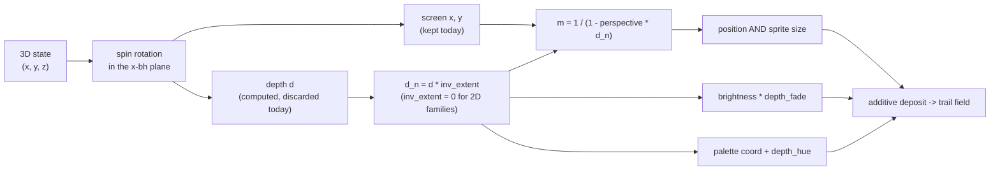

# 0063 — The attractor keeps its depth: perspective, haze, and a spin you can drive

> **Status:** **done 2026-08-04** — all five phases landed. Phases 1-4 (`dev`): `1f0fc41` the depth
> survives and pays for perspective, `6cd0d52` the two atmospheric cues, `c3c43d8` the integrated
> `spin`, `6f27462` the `attractor_depth` golden fixture. Phase 5 (`human`, the `preset-author`
> pass): `1855340` — both 3-D presets re-tuned, three findings routed to
> [design-backlog](../../design-backlog.md) 0061-0063. Mode 4 review: **no blockers, one major, two
> minor.** Verified: every one of the fourteen pre-existing golden baselines is byte-identical and
> the new one is the only addition; the mirror-identity property test is dimensionless algebra on
> the formula rather than a capture; the new fixture's sensitivity was *demonstrated* by
> neutralizing each of the four levers in turn and re-measuring, which caught a first-draft
> `depth_fade = 0.6` the guard would have slept through; the aspect still comes from the render
> target, not the accumulation grid (ADR-0037). The major finding is that Phase 5's measurement
> **falsified this plan's and ADR-0076's framing claim** — `perspective` chiefly *translates* the
> figure (~0.9x in NDC, phase-varying) rather than enlarging it (6 % across the legal range), so
> "recover the framing with a `zoom` edit" is advice that cannot work; ADR-0076 is accepted with a
> dated Outcome section and `presets/README.md` is corrected at this close.
> **Created:** 2026-08-04
> **Owner skill(s):** dev, human
> **Related ADRs:** [0076](../../adrs/0076-the-attractor-keeps-the-depth-it-already-computes.md) (this
> plan's decision), [0044](../../adrs/0044-swarm-world-is-a-25d-torus-sized-from-the-target.md) (the
> swarm's depth axis — the precedent this deliberately departs from),
> [0068](../../adrs/0068-the-projection-basis-is-a-per-family-property.md) (the per-family basis this
> derives the depth axis from)

## TL;DR

The attractor's 3-D families render flat because `project()` computes a view-space depth and throws
it away, leaving an orthographic projection whose rotation is perceptually ambiguous. This plan
keeps that depth and spends it on a perspective divide plus two atmospheric cues, adds a bindable
`spin` to a rotation that is currently a hardcoded constant, and leaves the 2-D families arithmetically
untouched. First user-visible behavior: with `perspective` bound, the Lorenz butterfly stops
flipping between readings and you can see which way it is turning.

## Context & problem

The user asked whether the strange attractors can be made to look more 3-D. Thomas and Lorenz are
genuinely three-dimensional and both read as flat patterns.

The mechanism is exact. `project()` (`core/src/render/scenes/particles/mod.rs:628-641`) rotates the
state in the plane spanned by `x` and the family's `bh` axis, then takes two dot products for screen
`x` and `y`. The third orthogonal component — `−p.x·sin + dot(p,bh)·cos` — is the rotation's other
output and is never written; the vertex shader emits `out.pos = vec4(ndc, 0.0, 1.0)` (`:731`).

An orthographic projection of a rotating transparent structure carries no information about the
direction of rotation: at `cs = −1, sn = 0` the horizontal term becomes `−p.x` and the vertical term
is unchanged, so **the image at rotation `π` is the exact `x`-mirror of the image at `0`**. Additive
blending supplies no occlusion to break the tie. This is textbook bistable structure-from-motion —
the percept flips and settles on "flat". The spin makes it worse by being slow: `SPIN_RATE = 0.18`
rad/s is `2π / 0.18` = **one revolution per 34.9 seconds**, so a viewer never accumulates motion
evidence for either reading. And no preset can change it — `SPIN_RATE` is a `const` (`:310`) that
appears in no `PARAMS` entry.

## Decision

We compute the depth `project()` already implies and spend it on perspective and haze, never on
occlusion. The vertex shader magnifies position *and* sprite size by `m(d) = 1 / (1 − perspective ·
d_n)`; `depth_fade` attenuates brightness with distance; `depth_hue` shifts the palette coordinate
with distance; `spin` becomes a bindable phase rate. The 2-D families receive an *inverse* depth
extent of exactly `0`, so `d_n = 0` and every cue is the identity — no branch, no division, no
`NaN`, and an exhaustive match forces a sixth family to answer the question.

We rejected depth-ordered occlusion (sorting 150 000 particles per frame buys nothing unless the
blending changes, and the accumulation *is* the scene — the user's explicit call), the swarm's
seeded-`z` parallax model (strictly worse for the 3-D families since perspective derives size and
parallax as one consistent term, and a lie the 2-D figures contradict), and volumetric raymarching
(a different renderer for a different look, which trades away the glow). Full reasoning in
[ADR-0076](../../adrs/0076-the-attractor-keeps-the-depth-it-already-computes.md).

## Architecture diagram



## Implementation phases

### Phase 1 — the depth survives, and the rotation becomes readable

- **Owner skill:** dev
- **What:** `project()` returns the depth alongside the screen position, the CPU sends a per-family
  inverse depth extent, and a new bindable `perspective` magnifies position and sprite size. The
  walking skeleton — the whole point of the plan is visible at the end of this phase.
- **Files touched:** `core/src/render/scenes/particles/mod.rs`.
- **The pieces:**
  - `AttractorFamily::inv_depth_extent()`, exhaustive over the enum: `1 / max(the two seed_box
    half-extents in the rotation plane)` for a 3-D family — **26** for Lorenz (basis XZ, so the plane
    is `x`–`y`, half-extents 20 and 26) and **4.5** for Thomas (basis XY, plane `x`–`z`) — and
    exactly `0.0` for every 2-D family. Derived from `seed_box` rather than hand-written per family,
    the same discipline `jitter_extent` (`:265`) already uses.
  - `m(d) = 1 / (1 − perspective · d_n)` applied to the world-space position **and** to `psize`,
    before the aspect division and before the view transform. For a segment, **both endpoints are
    magnified independently** so it foreshortens; the capsule's width takes the midpoint's `m`.
  - `perspective` clamped to `[0, 0.8]` where the uniform is packed. It means the figure's depth
    half-extent as a fraction of camera distance, so the near/far magnification ratio is
    `(1 + p) / (1 − p)` — `0.5` gives 3:1, `0.8` gives 9:1, and the singularity sits at `1`.
  - Default `perspective = 0` ⇒ `m ≡ 1` ⇒ byte-identical.
- **Done when:** the algebraic property the whole plan rests on is asserted directly, as a
  **dimensionless CPU test on the projection formula** — not a capture, which could only say the
  picture changed:
  - at `perspective = 0`, `project(q, rot = π)` equals `project(q, rot = 0)` reflected in `x`,
    exactly, for every sampled `q` on a 3-D family. This is the flatness, pinned.
  - at `perspective = 0.5`, that equality **fails** for every sampled `q` with non-zero depth,
    because `m(h) ≠ m(−h)`. This is the fix, pinned.
  - for a 2-D family the equality holds at *every* `perspective`, because `inv_extent = 0`.

  The Rust formula and the WGSL one must be bound together rather than transcribed twice — follow
  the precedent already in this file (`apply_saturation` is commented as mirroring
  `palette.rs::desaturate` verbatim) and Plan 0040's generated join bits, and say in a comment which
  is the source. Additionally: every existing golden baseline is **byte-identical**, and
  `core/tests/fixtures/attractor.toml` is De Jong so it cannot move even if a default were wrong.

### Phase 2 — atmosphere: distance dims it and colours it

- **Owner skill:** dev
- **What:** `depth_fade` and `depth_hue`, the substitutes for the occlusion this plan does not do.
- **Files touched:** `core/src/render/scenes/particles/mod.rs`.
- **What each does:** with `dn01 = (d_n + 1) / 2` (1 nearest), brightness is multiplied by
  `1 − depth_fade · (1 − dn01)` — so `depth_fade = 1` takes the far end to black — and the
  per-particle palette coordinate gains `depth_hue · (dn01 − 0.5)`, a shift of `±depth_hue/2` across
  the depth range. `depth_hue` rides the existing LUT sample (`:718-721`) and needs no new machinery.
  Both default to `0` and are exactly the identity there.
- **Why the pair rather than the fade alone:** distance washing out contrast is the cue ADR-0044
  calls "the oldest depth cue there is", but dimness alone is ambiguous with *being dimmer*. A hue
  shift is what makes it read as **distance** — real atmospheric perspective moves colour as well as
  contrast, and this is the cheapest cue in the plan.
- **Done when:** at `depth_fade = 0` and `depth_hue = 0` every capture is byte-identical. At
  `depth_fade = 0.8` on `attractor_lorenz`, the mean luminance of the frame's far half is measurably
  below its near half — asserted on the CPU-side per-particle multiplier across a sampled depth
  range rather than on pixels, since which screen region holds the far material depends on the spin
  phase. The two names appear in `PARAMS` and are reported as 3-D-only.

### Phase 3 — the spin becomes a lever, and it integrates

- **Owner skill:** dev
- **What:** A bindable `spin` replacing the hardcoded `SPIN_RATE` crawl.
- **Files touched:** `core/src/render/scenes/particles/mod.rs`.
- **The one thing that must not be got wrong:** the phase is **integrated** — `phase += spin ·
  SPIN_RATE · dt` — not computed as `time · spin · SPIN_RATE`. Under the multiply, a `spin` bound to
  audio would retroactively rescale all elapsed time every frame and snap the figure to a new angle
  on every change; the figure would jerk rather than accelerate. `spin` is a *rate* multiplier on
  today's 0.18 rad/s, so `1` is unchanged, `0` holds the figure still, and negative reverses it.
- **Done when:** `spin = 1` reproduces today's capture byte-identically at every step count.
  `spin = 0` holds the projection angle fixed across a 120-frame capture. And the integration
  property is asserted rather than assumed: a step sequence that ramps `spin` produces a phase equal
  to the running sum of `spin · SPIN_RATE · dt` — and **provably not** to `time · spin · SPIN_RATE`,
  which the same test computes and shows to differ. Determinism holds: the phase is a pure function
  of the injected `dt` sequence, which captures pin at 1/60 s.

### Phase 4 — a fixture that would notice, and the doc sweep

- **Owner skill:** dev
- **What:** A golden fixture exercising the new cues, and the operator docs the plan moved.
- **Files touched:** `core/tests/fixtures/attractor_depth.toml` (new) + its baseline,
  `presets/README.md`.
- **Why a new fixture:** the existing `attractor.toml` is **De Jong**, so by ADR-0076's design it
  can never exercise a single line this plan adds. A 3-D fixture with `perspective`, `depth_fade`,
  `depth_hue` and a non-default `spin` all non-zero is the only thing that would catch a regression
  here.
- **Docs the sweep owes** — `presets/README.md` is load-bearing for the `preset-author` lane, which
  keeps no catalogue of its own. The four new params go in the roster marked **3-D families only**
  (inert on De Jong, Clifford and every IFS figure, the same way `a b c d` already carry
  family-specific meanings). State three things an author cannot discover: `perspective` is clamped
  at `0.8` **silently**; it is applied before the view transform, so raising it makes the figure
  bigger as well as deeper and recovering the framing is a `zoom` edit; and `spin` is a multiplier on
  0.18 rad/s, i.e. `1` is one revolution per 34.9 s. `docs/presets.md` is **not** touched — no
  expression-grammar variable, function or operator changes.
- **Done when:** the new baseline exists, and the other fourteen are verified untouched. Standing
  trap: `LMV_BLESS` rewrites **all** baselines rather than the one you meant — restore the unrelated
  ones before committing.

### Phase 5 — judge the volume in motion

- **Owner skill:** human
- **What:** A `preset-author` pass over the two 3-D presets (`attractor_lorenz`, `attractor_thomas`)
  with the levers live, against real audio.
- **Questions it answers, and no capture can:** does perspective alone resolve the rotation, or does
  it need the haze to sell it? Where does `perspective` stop reading as depth and start reading as a
  fisheye — and is the `0.8` clamp anywhere near that point? Is `depth_hue` a real cue or does it
  just tint the picture? Does a `spin` bound to audio read as the figure being driven, or as
  instability? And the honest one: **at what `density` does the no-occlusion limit bite** — ADR-0044
  warns the illusion flattens as density rises, and ADR-0069's `density` key is exactly the lever
  that controls it, so this pass is where the two meet.
- **Done when:** the two 3-D presets ship re-tuned, and anything that could not be made to read is
  written up in `docs/design-backlog.md` rather than quietly left bound to nothing.

## Data shapes

```rust
// illustrative — not the final interface

impl AttractorFamily {
    /// Reciprocal of the family's half-extent along the view depth axis, in its
    /// own world units. **Exactly 0.0 for a 2D family** — that is what collapses
    /// every depth cue to the identity with no branch and no division.
    /// Derived from `seed_box`, taking the larger of the two half-extents in the
    /// rotation plane (the plane spanned by `x` and `basis().masks().0`).
    fn inv_depth_extent(self) -> f32;
}
```

```wgsl
// illustrative. `dim < 2.5` still returns early with depth 0; the 3D branch:
//   screen = vec2(p.x*cs + dot(p,bh)*sn, dot(p,bv))
//   depth  = -p.x*sn + dot(p,bh)*cs        // the rotation's other output
//   dn     = depth * inv_extent            // 0 for a 2D family
//   m      = 1.0 / (1.0 - perspective*dn)  // perspective clamped to [0, 0.8]
// then: world *= m, psize *= m, bright *= 1 - depth_fade*(1 - dn01),
//       coord += depth_hue*(dn01 - 0.5)
```

## Risks & open questions

- **The no-occlusion limit is real and bounded.** Crossing strands sum, so a dense figure still reads
  partly as X-ray. Haze narrows the gap; it does not close it. That is the user's explicit choice and
  ADR-0044's accepted cost, and Phase 5 is where the density at which it bites gets measured rather
  than guessed.
- **Two copies of one formula.** The perspective magnification exists in Rust (for Phase 1's property
  test) and in WGSL (for the render). If they drift, the test proves a formula the GPU is not
  running. Mitigated by making one the documented source and commenting the other against it — the
  file already does exactly this for `apply_saturation`.
- **`perspective` fights `zoom`.** Applied before the view transform, so raising it enlarges the
  figure as well as deepening it. Documented in Phase 4; not solved. If Phase 5 finds this
  intolerable, the fix is to normalize `m` by its value at `d_n = 0`, which is a one-line change and
  a separate decision.
- **The segment does not taper.** Endpoints magnify independently so a receding trace foreshortens
  correctly, but its width is uniform. A tapered capsule means the fragment's distance function
  interpolates a radius, which reworks ADR-0069's single-expression point/segment unification.
  Deliberately out of scope; a followup if Phase 5 wants it.
- **[Plan 0062](../0062-the-chaos-game-grows-a-fern.md) and [Plan 0061](../0061-the-build-stops-paying-for-what-it-is-not-building.md)
  both touch `particles/mod.rs`.** This plan edits `project()`, the vertex shader and `PARAMS` — 0062
  adds a family and a new `ifs.rs`, 0061 Phase 6 splits the file. All three overlap only in the
  family enum's method set, where each adds an arm or a method rather than changing one. Whichever
  lands second inherits the others' file; no ordering is wrong, and **0062 must give its IFS figures
  `inv_depth_extent() = 0.0`** if it lands second (they are 2-D), which its exhaustive match will
  force it to notice.
- **`spin` is per-family-meaningful only in 3-D**, but unlike the depth cues it is *not* inert in 2-D:
  the discrete maps rotate in-plane through the same angle (`project`'s `dim < 2.5` branch). So
  `spin` reaches all five families and the other three do not. That asymmetry is deliberate — an
  in-plane spin is a real look on De Jong today — but it must be stated in the docs sweep or it reads
  as an inconsistency.

## What this plan does NOT do

- **No occlusion, no sorting, no depth buffer.** ADR-0076 Alternative A, rejected on the user's call.
- **No volumetric raymarching, no lighting, no surfaces.** ADR-0076 Alternative C. An attractor is a
  measure-zero point set and the additive glow is what makes it beautiful; a lit solid is a different
  renderer.
- **No tilt or elevation control.** Offered at interview and not chosen. The view stays equatorial and
  the spin stays in the family's own rotation plane, so `basis()` remains the only thing deciding what
  plane you look at.
- **No depth for the 2-D families.** De Jong, Clifford and every IFS figure stay honestly flat — they
  have no third coordinate, and ADR-0076 Alternative B records why inventing one for them is worse
  than leaving them alone.
- **No segment taper**, and **no change to the trail, deposit, palette or view-transform machinery**.
- **No C ABI change, no `Scene` trait change, no new dependency, no new render idiom.**

## Followups (after this lands)

- Tapered capsules, if Phase 5 asks for them.
- Normalizing `m` at `d_n = 0` so `perspective` deepens without enlarging, if the `zoom` interaction
  proves annoying in practice.
