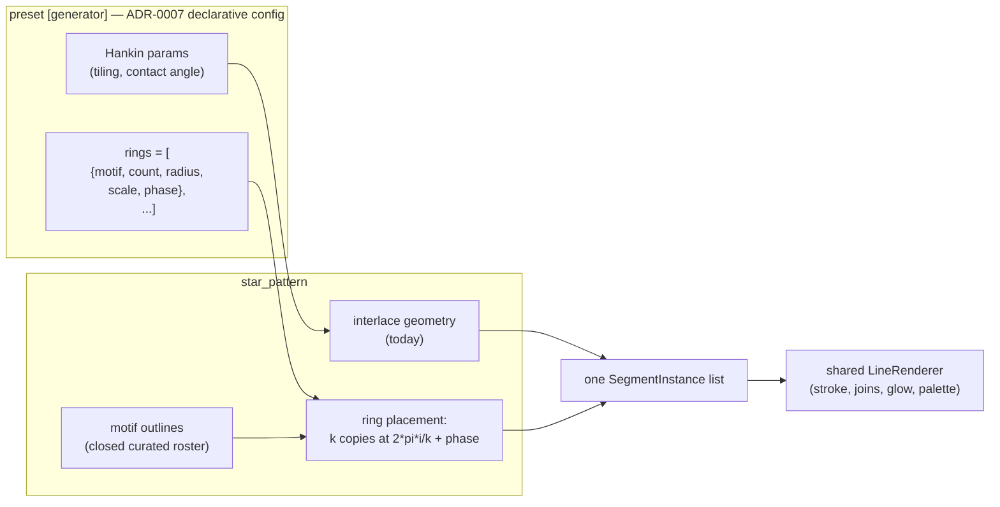

# 0065 — The mandala interior: `star_pattern` stops being hollow

> **Status:** **done 2026-08-06** — Phases 1, 2, 4, 5 and 7 landed on `plan-0065-mandala-interior`
> as `33e5efc` / `1904469` / `419418f` / `a35485a` / `b026ff3`, with `3c0e56a` recording the Phase 3
> human verdict and `d4030b2` merging `main`. The full gate is green on the merged tip (`fmt`,
> `clippy --all-targets -D warnings`, **566/566 nextest, 0 skipped**, doc links resolve) and **no
> golden baseline moved or was added** — `git diff main -- core/tests/golden/` is empty and
> `LMV_BLESS` was never run, exactly as the plan promised. Mode 4 review: **no blockers**.
>
> **Phase 6 did NOT run as a plan phase, and this closes anyway — deliberately, at the user's call.**
> The live judgement it asked for happens immediately after this close, outside the plan. Part of it
> is already answered from the running app: the user rejected the washed-out first draft, approved
> the solid-stroke retune, cut eight rings as lace, and kept `rings in weave` against the reviewing
> session's reading of the sample. What remains unanswered is counter-rotation against real music and
> `glow` + `thickness` together on adjacent thin rings, which is the additive-ceiling risk this plan
> named. Anything that pass turns up is ordinary `preset-author` work on shipped presets, or a
> backlog entry — not a reopened plan.
>
> > **Postscript, 2026-08-06, hours after this close: the Phase 6 pass ran and all three presets were
> > retired.** It did not come back against counter-rotation or the additive ceiling. It came back
> > against the mechanism: *"we don't have curves, anything curved is based on several lines, and
> > it's easy to see them — lines look upscaled and half baked."* Every motif is a parametric outline
> > sampled to straight segments, so at ornament scale the vertices show and a circle reads as a
> > polygon. That is a ceiling on the approach, not a tuning miss, and the retune to solid strokes had
> > already happened first — so this was not the inflated-glow hypothesis
> > ([design-backlog 0073](../../design-backlog.md)). `star_mandala`, `star_mandala_six` and
> > `star_weave` are deleted and the `star_pattern` coverage floor reverted to `0.34` with them.
> >
> > **The plan's deliverable stands and this entry is not reopened.** `rings` is shipped, tested and
> > documented, `star_pattern` is genuinely no longer hollow, and the 1-of-10 / 9-of-10 shell
> > measurement is unaffected by whether a preset ships it. What the retirement establishes is
> > narrower: placed outline geometry is the wrong mechanism *for a mandala*. That look now ships as
> > `presets/reaction_gilt.toml` — a Gray-Scott field's analytic iso-contours folded by
> > `kaleido_order`, with no geometry in the picture and therefore no vertex at any resolution. **No
> > preset in the library uses `rings` today**, which is a decision someone owes eventually and did
> > not need to make off one rejected look.
>
> **The gate went red, and the answer was to re-derive the floor rather than hold the plan.** The
> three presets measure `0.2442` / `0.2505` / `0.2544` against a `star_pattern` coverage floor of
> `0.34`. That floor is **derived from the shipped library** at half each family's sparsest member,
> with `MAX_FLOOR_SLACK` as the mechanism that forces re-derivation when the minimum moves — so the
> gate fired correctly, a human looked, the content is good, and `coverage_floor`'s own doc comment
> prescribes re-measuring. **Phase 7** was added at this close and does exactly that: `0.2442 / 2 =
> 0.12`, slack `2.04`. [Backlog 0072](../../design-backlog.md) stays **open at medium-high** as the
> measure's replacement; re-derivation is not its fix.
>
> **Two merge artifacts worth knowing about.** This lane and `main` each minted a design-backlog
> entry `0070` on 2026-08-06 for different findings, so this lane's `0070`/`0071`/`0072` renumbered
> to `0071`/`0072`/`0073` at the merge — the Phase 3 and Phase 5 commit messages still cite the old
> numbers and the mapping is recorded in the entries' own header. And Phase 5's roster cut rode in
> its own commit rather than Phase 3's, because Phase 3 is `human` and has no commit.
> **Created:** 2026-08-04
> **Owner skill(s):** dev, human
> **Related ADRs:** [0079](../../adrs/0079-the-mandala-interior-is-rings-of-motifs-inside-star-pattern.md)
> (this plan's decision), [0007](../../adrs/0007-line-geometry-generators.md) (the `[generator]`
> config seam it extends), [0060](../../adrs/0060-star-pattern-variants-interpolate.md) (the `variant`
> morph it composes with)

## TL;DR

`star_pattern` gains an optional `rings` roster on its `[generator]` table: concentric rings of
repeated motifs, each with its own count, radius, scale and phase, drawn through the shared
`LineRenderer` alongside — or instead of — the Hankin interlace it draws today. This closes
[design-backlog 0007](../../design-backlog.md)'s still-open "hollow ring" half with the *invest, do not
cut* decision the user made on 2026-07-26, and it makes the fourth reference image authorable
directly. First user-visible behavior: a preset declaring four rings draws an ornamental mandala with
a filled interior instead of a bare rim.

## Context & problem

One of the user's five reference images is not a fractal: it is a drawn ornamental mandala — rings of
discrete repeated motifs, thin bright strokes on black, each ring with its own count and radius. It
is line geometry, and this project has a line scene that has been waiting for exactly this.

[Design-backlog 0007](../../design-backlog.md) recorded `star_pattern` as reading like "a hollow ring",
established by a rendered sweep rather than argument: segments sit near the rim at every
`contact_angle_deg`, with no meaningful interior change across 12 / 20 / 28 degrees. The user's
verdict moved from "idea is interesting but looks poor" to "very nice, but can we make morphing
between shapes easier, slower" once preset-side mitigation landed. **That second ask was answered** —
[ADR-0060](../../adrs/0060-star-pattern-variants-interpolate.md) and
[Plan 0054](0054-the-line-scenes-catch-up.md) made `variant` a continuous contact angle. The
first ask, the hollow interior, was never decided; the entry says so explicitly and carries the
user's standing *invest, do not cut* call, along with three unchosen options ("more tilings, an
off-centre mirror, or drawing the underlying tiling grid").

The reference image is the missing specification. It says what to invest in.

## Decision

The ring generator lives **inside `star_pattern`**, as an optional `rings` array on its existing
`[generator]` table, alongside the Hankin parameters rather than replacing them. A preset draws the
interlace alone (today's behaviour, and what `rings`-absent means), the rings alone (the reference),
or both composited. The motif roster is a **closed curated set** chosen from rendered samples.

It goes there rather than into a new scene because the scene *has* the defect this fixes — a sibling
scene would leave `star_pattern` hollow and the backlog entry open, spending the investment decision
on something else — and because the two geometries share the one structural property that matters,
n-fold rotational symmetry about the frame centre, so a ring count and a fold order are chosen
together rather than fought. Rejected alternatives (a new `mandala` scene; deriving the interior from
the tiling; an open motif grammar) are in
[ADR-0079](../../adrs/0079-the-mandala-interior-is-rings-of-motifs-inside-star-pattern.md).

## Architecture diagram



## Implementation phases

### Phase 1 — rings exist and the interior fills

- **Owner skill:** dev
- **What:** The `rings` roster on `[generator]`, a provisional motif set, and the placement
  arithmetic. The walking skeleton: a preset with four rings renders a filled ornament.
- **Files touched:** `core/src/render/scenes/lines/star.rs`, `core/src/preset/schema.rs`,
  `presets/star_mandala.toml` (new).
- **The shape:** each ring is `{ motif, count, radius, scale, phase }`; motif `i` of a ring of `k` is
  placed at angle `2πi/k + phase`, scaled by `scale`, at distance `radius`. Motifs are parametric
  outlines sampled to segments — the same thing `parametric_curve` already does, placed rather than
  drawn once. Validate the roster once at load per the project's boundary rule: an unknown motif name
  is a load error, a zero or negative `count` is a load error.
- **The budget, stated because it decides how ambitious a preset may be:**
  `TierConfig::max_segments` is **20 000** at `Floor` (`tier.rs:241`) and 60 000 at `Rich`. A dense
  mandala of 8 rings × 32 motifs × 24 segments is **6 144** — comfortable, with room for the
  interlace on top. Truncation at the cap must be the existing silent-truncation behaviour rather
  than a new failure mode, and a preset that would exceed it is a thing Phase 5 documents.
- **Done when:** `rings` absent renders `star_rosette` and `star_lantern` **byte-identically** — the
  Hankin path is untouched. With `rings` present and the Hankin count at zero, the capture is the
  ornament alone. The measured lit-pixel coverage of a four-ring preset is materially above
  `star_rosette`'s, which is the "hollow ring" complaint stated as a number rather than as an
  opinion.

### Phase 2 — the sample set

- **Owner skill:** dev
- **What:** A rendered grid of motifs × counts × ring spacings, so the roster is chosen from images
  rather than from names.
- **Files touched:** captures under the scratch/report path; no shipped file changes.
- **What to render:** every provisional motif at three ring counts {8, 16, 32} and two stroke widths,
  plus three whole-mandala compositions of four to eight rings, plus one showing the rings composited
  **inside** the Hankin interlace — which is the composition backlog 0007 actually asked for and the
  one the reference image does not show. At 16:9 and portrait.
- **Also render the question ADR-0079 deliberately left open:** the reference's outer boundary is a
  *scalloped closed curve*, not a ring of separate motifs. Show it both ways — a motif ring whose
  members touch, and a separate boundary curve — because that is a look decision and not a design
  one.
- **Done when:** the grid exists with a plain index naming each cell, including the boundary A/B.

### Phase 3 — pick the roster

- **Owner skill:** human
- **Status:** **DECIDED 2026-08-06.** The verdict is recorded below verbatim, because it is a human
  judgement no commit can re-derive.
- **What:** The user picks which motifs ship, whether the scalloped boundary is a motif ring or its
  own thing, and which compositions become presets.
- **Done when:** the roster is closed with a decision per motif. **Dropping motifs here is expected**
  — a curated set is the point, and ADR-0079 records that a look outside it routes back through
  `architect` and `dev` rather than being added on request.

#### The verdict

**1. The roster closes at seven.** `circle`, `petal`, `teardrop`, `diamond`, `arc`, `trefoil`,
`chevron`. **`star` and `triangle` are cut** — `star` is an ornament at x8 and dissolves into texture
by x32, and `triangle` duplicates `chevron`'s sawtooth role at roughly twelve times the segment cost
(`chevron` is 2 segments, the cheapest member in the set). Every survivor holds its identity across
the whole 8-to-32 count range, which is the property the cut was made on.

**2. The scalloped boundary is a real curve primitive — which means it is NOT in this plan.** The
user was shown side A (24 touching `arc` members) and side B (40 overlapping `arc` members faking a
continuous curve), told explicitly that the engine has no boundary primitive and that side B is an
approximation, and chose **the primitive**. That is architect + dev work: a new roster member or a
new `[generator]` key, filed as [backlog 0071](../../design-backlog.md). **It does not gate Phases 4-5**
— none of the three chosen compositions carries a boundary ring.

**3. Three compositions ship:** **four rings**, **six rings**, and **rings in weave**. **Eight rings
is cut** — the centre muddles and the figure reads as lace rather than ornament. Note that
`rings in weave` was chosen *against* the reviewing session's reading of the sample, which was that
the twelve-fold interlace sits on top of the ornament as a separate coarse figure rather than framing
it. That reading may be wrong, and it may be an artifact of the sample's static params; **Phase 6 is
where it gets settled**, and it is exactly the half of backlog 0007 that only a live judgement can
answer. Keeping it also keeps backlog 0007's composition question answered rather than dropped.

#### What the same sitting found about the shipped preset — read before Phase 5

The user judged `presets/star_mandala.toml` in the running app and rejected it: *"maximally lame —
all lines are half transparent, line connections are visible, there is no curve lines"*. Those are
filed as [backlog 0072](../../design-backlog.md) and [backlog 0073](../../design-backlog.md), and **0072
lands directly on this plan's Phase 5**:

The preset's `glow` (0.85 -> 1.55) and `trails` (0.26 -> 0.40) were raised *only* to clear
`sanity.rs`'s 0.34 coverage floor, on a scene where that floor provably measures the halo rather than
the figure — the same lane measured the bare rosette and the 46x-denser mandala at an **identical**
0.403. The washed-out look the user rejected is what the gate selected for. **Phase 5 must not repeat
that trade for the three new presets:** the Phase 2 sample sheets, rendered at an untouched stroke
with no trails, are visibly crisper than the shipped preset and are the better reference for what
this geometry should look like.

### Phase 4 — the rings move

- **Owner skill:** dev
- **What:** Per-ring audio reach, so the ornament is a visualizer and not a wallpaper.
- **Files touched:** `core/src/render/scenes/lines/star.rs`,
  `core/src/render/scenes/lines/mod.rs` (`PARAMS`).
- **The levers:** a global `ring_phase` that advances alternate rings in opposite directions
  (counter-rotation is the single strongest ornamental motion and costs one sign), a `ring_spread`
  scaling every radius about the centre, and a `ring_scale` on the motifs. All bindable, all
  defaulting to the static configuration so Phase 1's captures do not move.
- **The gate hazard this phase must design around, not discover:** `core/tests/animation.rs` renders
  at 96×96 and diffs whole frames, so a rotationally symmetric figure is nearly invariant under
  rotation — [design-backlog 0009](../../design-backlog.md) documented exactly this penalty for
  `star_rosette`, and a ring mandala is *more* rotationally symmetric than the rosette was. **Spin
  alone will not pass the gate.** `ring_spread` and `ring_scale` are radial and will; the shipped
  presets must carry their animation on those.
- **Done when:** a shipped mandala preset passes `animation.rs` on a **radial** binding, and the
  counter-rotation is asserted on the placement arithmetic (adjacent rings' phases move in opposite
  directions for a positive `ring_phase`) rather than on pixels.

### Phase 5 — presets and the doc sweep

- **Owner skill:** dev
- **What:** Ship the chosen compositions and update the docs the plan moved.
- **Files touched:** `presets/star_mandala.toml` and any siblings from Phase 3, `presets/README.md`.
- **Docs the sweep owes:** `presets/README.md`'s structural table gains the `rings` roster with its
  five keys, the closed motif names, the segment budget and what happens at the cap, and the three
  new params. It is load-bearing for the `preset-author` lane, which keeps no catalogue of its own.
  `docs/presets.md` is **not** touched: no grammar change. **Also strike through
  [design-backlog 0007](../../design-backlog.md)** with a pointer here — its interior half is what this
  plan closes, and the entry has been half-struck since Plan 0054.
- **Done when:** the docs are swept, backlog 0007 is struck through in full, and every existing
  golden baseline is byte-identical (this plan adds geometry behind an absent-by-default roster and
  moves no pixel of anything already shipped).

### Phase 6 — judge it against music

- **Owner skill:** human
- **What:** A `preset-author` pass tuning the mandala presets live.
- **Questions it answers:** does counter-rotation read as one ornament breathing or as two unrelated
  figures? At what ring count does the figure stop being legible and start being lace? Does the
  interlace-plus-rings composition earn its cost, or is the ornament better alone — which is the half
  of backlog 0007 that only a live judgement can settle?
- **Done when:** the presets ship tuned, and anything that could not be made to read goes to
  `docs/design-backlog.md`.

### Phase 7 — the `star_pattern` coverage floor is re-derived from what now ships

- **Owner skill:** dev
- **Added 2026-08-06**, after Phase 5 landed three presets below the floor. It was not in the
  original plan because nobody expected this family's minimum to move; the mechanism that catches
  that is working exactly as designed, and this phase is the documented response to it.
- **Runs after Phase 6 and after `git merge main`**, in that order — both can move the number, and a
  floor derived before either is derived from a distribution that is about to change.
- **Files touched:** `core/tests/sanity.rs` only.
- **What:** Re-derive `coverage_floor(SystemKind::StarPattern)` from the distribution
  `every_preset_draws_a_real_shape` prints, and rewrite the doc-comment paragraph that carries the
  per-system table.

  This is the procedure that constant's own doc comment prescribes, verbatim: *"The response to a
  legitimately sparser new preset is to re-derive that system's floor from the printed distribution,
  and to say in the commit which preset moved the minimum — not to nudge a constant back until the
  run goes green."* The attractor floor moved the same way on 2026-08-03. `0.34` was half of
  `0.6908` (Star Lantern), derived from a three-preset roster that had never seen thin-stroke
  ornament; this plan added the content the constant was never measured against.

- **The arithmetic, done here so the phase is not tuning against a number it invented.** Each floor
  sits at **half** its family's sparsest shipped member, and `MAX_FLOOR_SLACK = 2.2` holds it there.
  Phase 5 measured the new minimum at `0.2442` (Star Mandala), so the floor is `0.2442 / 2 = 0.1221`
  → **`0.12`**, giving slack `0.2442 / 0.12 = 2.04`, inside `MAX_FLOOR_SLACK`. **Take the actual
  number from the post-merge, post-Phase-6 printed distribution** — if Phase 6's tuning moves the
  minimum, the half-rule is what is fixed, not the `0.12`.
- **What this costs, stated rather than discovered.** The band `0.12`–`0.34` becomes unpoliced on
  `star_pattern`. That is the same price `attractor`, `spectrum` and `reaction_diffusion` already pay
  for 3-5x internal spread, and the floor's only claim — *a preset drawing less than half of the
  thinnest shipped member of its own family is worth a look* — survives at the new value. A scene
  rendering nothing still fails at `0.0`, and ADR-0067 keeps a bare vignette from counting as a
  figure. The three mandalas also join `geometry_extent.rs`'s line-family sweep at the merge, which
  asserts every line preset draws segments at all.
- **What this is NOT.** It is not the fix for
  [backlog 0072](../../design-backlog.md) — that entry stays open at medium-high with all three of its
  measurements, and re-deriving is what happens on this family's floor *whether or not* the measure
  is replaced later. No other system's floor moves, `MAX_FLOOR_SLACK` is untouched, and no preset is
  retuned to meet a number.
- **Done when:** the full suite is green with the floor taken from the printed distribution; the
  per-system table in the doc comment carries the new `star_pattern` row with its new lowest preset
  and factor; the surrounding prose names which preset moved the minimum and why a 46-fold ornament
  of hairline strokes reads low at this test's 96x96 capture; and one sentence points at backlog 0072
  saying this re-derivation is not that entry's fix.

## Data shapes

```rust
// illustrative — not the final interface

/// One concentric ring of repeated motifs. `[generator] rings` is an array of these.
struct Ring {
    motif: Motif,   // closed curated roster; unknown name is a load error
    count: u32,     // copies around the ring; 0 is a load error
    radius: f32,    // world units from the centre
    scale: f32,     // motif size multiplier
    phase: f32,     // angular offset, radians
}
```

## Risks & open questions

- **`star_pattern`'s config surface roughly doubles**, and half of it has nothing structurally to do
  with Hankin tilings. ADR-0079 accepts this as the price of not leaving the scene hollow; a reader
  of `[generator]` will find contact angles and ring rosters side by side, and only a doc comment
  explains why.
- **The animation gate is the likeliest phase failure**, for a reason that is a property of the
  *test resolution* rather than of the look (backlog 0009). Phase 4 names the mitigation up front so
  it is designed for rather than diagnosed.
- **Two ways to exhaust one segment cap.** The interlace's count grows with the tiling, the rings' as
  rings × count × resolution, and the failure is the same silent truncation from either direction.
  Phase 5 documents it; nothing detects it.
- **Thin concentric strokes are the worst case for the additive ceiling.** Where adjacent rings'
  halos overlap they sum, and [Plan 0040](0040-line-joins-finish-the-job.md)'s close found
  exactly this on a mirrored line preset — the *quietest* part of the readout rendering as its
  brightest. Phase 6 should watch `glow` and `thickness` together, not separately.
- **Phase 3 is `human` and gates Phases 4-6**, so this plan does not close in one session by
  construction.
- **[Plan 0055](0055-the-fold-edge-becomes-a-choice.md) and
  [Plan 0064](0064-the-symmetry-stage-and-the-banded-palette.md) do not touch this file at all** —
  this plan is line-geometry work and shares nothing with the post chain. It can run in parallel with
  either.

## What this plan does NOT do

- **No open motif grammar.** ADR-0079 Alternative C — once motifs are authorable, so are their fills,
  joins and nesting, and the project already has `parametric_curve` for a future motif to be promoted
  from.
- **No new scene and no new `SystemKind`.** ADR-0079 Alternative A — the ninth scene slot is not
  spent and the exhaustive `SystemKind::ALL` factory is untouched.
- **No off-centre placement.** Rings are concentric about the frame centre, which is what makes them
  compose with the Hankin geometry and with `kaleido_*`. An off-centre mirror was one of backlog
  0007's three unchosen options and stays unchosen.
- **No new render idiom** — the shared `LineRenderer` draws it, as it draws the other four line
  scenes.
- **No C ABI change, no `Scene` trait change, no new dependency, and no existing golden baseline
  moved.**

## Followups (after this lands)

- Promoting a `parametric_curve` expression into the motif roster, if Phase 6 wants a shape the
  closed set does not have.
- Whether the interlace and the rings should be able to take different palette positions, if the
  composited look survives Phase 6.
