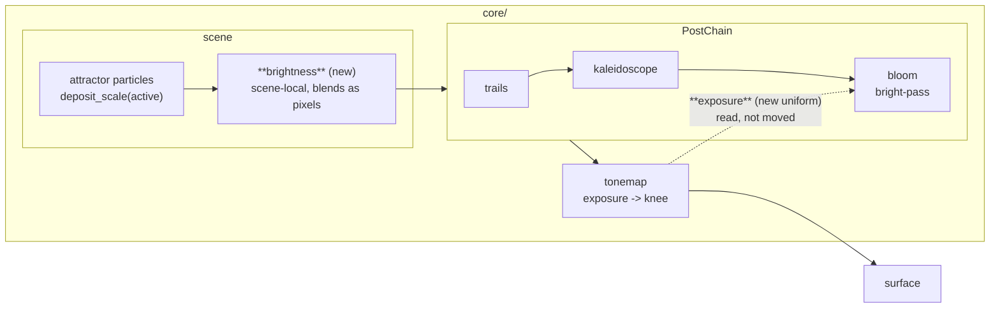

# 0066 — The level lever: the attractor gets a `brightness`, and bloom stops thresholding unexposed light

> **Status:** **done 2026-08-05** — all five phases landed on the `plan-0066-the-level-lever`
> branch and fast-forwarded to `main`. Phases 1-4 as `2a4f65c` / `2e2cc32` / `0f10f18` / `3502c2e`,
> and the terminal `human` Phase 5 as `d7bf78c`. Mode 4 review 2026-08-05: **no blockers**, one
> minor (the ADR did not anticipate the backdrop coupling Phase 5 found — recorded as ADR-0080's
> `Outcome`). **Verified:** the no-pixels claim held exactly — `git diff --name-status` over the
> whole range adds `composite_bloom_exposed.png` and modifies **zero** existing baselines; both
> halves of Phase 2's identity are asserted in `core/tests/bloom.rs`
> (`the_bright_pass_thresholds_exposed_light`); the whole gate is green on the merged tip (fmt,
> clippy, 538/538 nextest).
> **Created:** 2026-08-04
> **Owner skill(s):** dev, human
> **Related ADRs:** [0080](../../adrs/0080-the-attractor-owns-its-level-and-bloom-thresholds-exposed-light.md) (accepted 2026-08-05)
> **Closes:** [design-backlog 0057](../../design-backlog.md#0057--a-preset-has-no-scene-local-way-to-set-a-figures-level-so-exposure-gets-used-for-it-and-two-other-stages-disagree-with-that-use)

## TL;DR

The `attractor` scene is the only particle family with no level param, so the two presets that
needed one reached for `exposure` — the engine-wide camera stop, which crossfades across a dissolve
and sits *downstream* of the bloom bright-pass. This plan gives the attractor the same
scene-local `brightness` that `swarm` and `emitter` already carry, and passes the frame's exposure
into the bloom stage so `bloom_threshold` compares against exposed light. First visible behavior: a
preset can dim its attractor without dragging every dissolve into it, and `bloom_threshold` starts
discriminating at exposures where today `0.95` and `8.0` render alike.

## Context & problem

`presets/attractor_lorenz.toml:74` ships `exposure = "0.03"` and `presets/attractor_thomas.toml:60`
ships `"0.10"`. They are the first two shipped presets to bind `exposure` at all, and they bind it
because `particles/mod.rs:1695` has no level param — while `swarm.rs:473` and `emitter.rs:611` both
carry `brightness`. Three scenes draw additive particle marks; one of them cannot say how bright.

Two things then go wrong, both recorded in the backlog entry and both verified:

1. **`exposure` interpolates across a preset dissolve** (`tonemap.rs`, `crossfade_from`,
   [ADR-0024](../../adrs/0024-cross-preset-transitions.md)'s seam), so `0.03` drags the ~1 s blend
   from any neighbour through a badly exposed
   frame. Both presets' headers document buying level from `size`/`fade` first to avoid pushing it
   further — a workaround with a ceiling they have already reached.
2. **The bloom bright-pass runs before `exposure`.** The chain is scene → `PostChain` (trails,
   fold, bloom) → tonemap, so at `exposure = 0.03` the whole figure is over every threshold a
   preset can ask for (`MAX_THRESHOLD = 8.0`). Rendered on Lorenz, thresholds `0.95` and `8.0` are
   near-indistinguishable, so the preset ships the threshold pinned at the ceiling with a header
   saying to read it as *capped, not tuned*.

The unit of the second defect is the point: a threshold expressed in pre-exposure linear units is
only meaningful while every preset sits near `exposure = 1.0`. That was true until `990fedc` and is
not true now.

## Decision

Per [ADR-0080](../../adrs/0080-the-attractor-owns-its-level-and-bloom-thresholds-exposed-light.md):
add `brightness` to the attractor as a multiplier on its already-count-normalized deposit, and pass
the frame's evaluated `exposure` into the bloom stage so the bright-pass thresholds exposed
luminance. We rejected relocating the exposure multiply upstream (it would make the trails buffer's
*history* depend on an eased bindable), normalizing exposure at the crossfade (fixes one of the two
costs, and silently discards an authored value), and documenting the workaround as the technique.

**The pixel cost is smaller than it looks, and the arithmetic is why.** No golden fixture binds
`exposure` — `grep -l exposure core/tests/fixtures/*.toml` is empty across all 23 — so the new
factor is exactly `1.0` on every baseline, and multiplying by exactly `1.0` is the identity in
IEEE-754. **Every existing golden baseline is therefore byte-identical after this plan, and a diff
on one is a phase failure rather than a re-bless.** The only shipped looks that move are
`attractor_lorenz` and `attractor_thomas`, which Phase 5 retunes because they are the two presets
whose headers document the retired model.

## Architecture diagram



## Implementation phases

### Phase 1 — The attractor gets a level of its own

- **Owner skill:** dev
- **What:** `brightness` joins `particles::PARAMS`, defaulting to `1.0`, multiplying the
  per-particle additive deposit.
- **Files touched:** `core/src/render/scenes/particles/mod.rs` (`PARAMS`, `set_param`,
  `reset_params`, the `deposit_scale` packing at `:2069` and its use at `:734`).
- **Done when:** two captures of the same attractor fixture differing only in `brightness`
  (`1.0` against `0.5`) have **the same set of lit pixels and a lower mean over them** at the lower
  value — a level change, not a geometry change. The name matches `swarm`/`emitter` exactly, so a
  test asserting the three scenes' `PARAMS` all contain `brightness` pins the symmetry the ADR is
  buying. Default `1.0` reproduces today's output **byte-identically** — this is exact, not
  approximate, because the multiply is by literal `1.0`.

### Phase 2 — The bright-pass thresholds exposed light

- **Owner skill:** dev
- **What:** the frame's evaluated `exposure` reaches the bloom stage's uniform, and the bright-pass
  scales sampled luminance by it before the threshold-and-knee comparison.
- **Files touched:** `core/src/render/bloom.rs` (the `Bright` uniform, the WGSL bright-pass),
  `core/src/render/post.rs` and/or `core/src/render/mod.rs` (whatever hands the stage its per-frame
  params), `core/src/render/tonemap.rs` (expose the evaluated value — `exposure()` already exists
  at `:358`).
- **Done when:** at `exposure = 0.03`, captures at `bloom_threshold = 0.95` and `bloom_threshold =
  8.0` are **measurably different** — the property [backlog 0057](../../design-backlog.md) reports as
  absent today. At `exposure = 1.0` (the default, and every existing fixture) output is
  **byte-identical** to the pre-phase build. Both halves are asserted, because the second is what
  makes Phase 3 a check rather than a re-bless.

### Phase 3 — A fixture that pins the coupling, and proof nothing else moved

- **Owner skill:** dev
- **What:** a golden fixture binding both `exposure` and `bloom_threshold`, so the relationship
  Phase 2 introduces is guarded rather than resting on two shipped presets; plus the whole-suite
  check that no other baseline moved.
- **Files touched:** `core/tests/fixtures/composite_bloom_exposed.toml` (new) + its baseline,
  `core/tests/golden.rs` if the roster is explicit.
- **Done when:** the new fixture is blessed once, deliberately, with the frame looked at; and the
  full golden suite passes with **every pre-existing baseline byte-identical**. A moved baseline is
  a phase failure and means Phase 2's identity claim is wrong somewhere — do not bless it.
  (`LMV_BLESS` rewrites *all* baselines, not the targeted one, so bless the new fixture by adding
  it and running once, then confirm `git status` lists exactly one new PNG.)

### Phase 4 — The docs say which lever is which

- **Owner skill:** dev
- **What:** the operator docs stop implying `exposure` is a scene's level control and state the new
  threshold units.
- **Files touched:** `presets/README.md` (the `[particles]`/attractor param roster gains
  `brightness`; the bloom section states that `bloom_threshold` is compared **after** `exposure`;
  the `exposure` entry says it is the whole-frame correction, not a figure's level),
  `docs/preset-palettes.md` if it mentions `exposure`.
- **Done when:** an author reading `presets/README.md` alone can answer "my attractor is too
  bright — which knob?" without rendering, and the bloom section no longer describes a
  pre-exposure comparison. `presets/README.md`'s `[particles]` note that `density` can be re-aimed
  "without re-tuning `size`, `fade` or `exposure`" is corrected in the same pass if it still
  overstates the case — ADR-0065 makes it true of the sum and false of the picture.

### Phase 5 — Lorenz and Thomas stop documenting a retired model

- **Owner skill:** human
- **What:** a `preset-author` pass moving both presets' level onto `brightness`, re-tuning
  `bloom_threshold` now that it discriminates, and rewriting the two headers that currently explain
  the capped-not-tuned workaround.
- **Files touched:** `presets/attractor_lorenz.toml`, `presets/attractor_thomas.toml`.
- **Done when:** neither header describes `bloom_threshold` as capped; neither preset needs an
  `exposure` far from `1.0` to reach its level; and both are judged in motion against real audio,
  including through a dissolve from a neighbouring preset — which is the cost the ADR says this
  removes, so it is the one to confirm by watching.

## Data shapes

```rust
// illustrative — not the final interface
// bloom.rs, the bright-pass uniform, one field wider:
struct Bright {
    v: vec4<f32>, // x: threshold, y: knee band, z: exposure (new), w: unused
}
// WGSL: compare `luma(sample) * v.z` against `v.x`, keeping today's knee band arithmetic.
// At the default exposure of exactly 1.0 this is the identity, which is what makes
// every existing baseline byte-identical rather than approximately unchanged.
```

## Risks & open questions

- **`MAX_THRESHOLD = 8.0` keeps its number and changes its meaning.** It now caps a
  display-referred threshold. Whether 8.0 is still a sensible ceiling is *measured* in Phase 5 (is
  a real preset ever near it?) rather than asserted here; if it turns out to be reachable in normal
  use, that is a followup, not a mid-plan change.
- **The bloom stage now knows something the tonemap owns.** That is a real widening of the stage's
  contract and the ADR records it as a cost. Keep it a one-way read — the stage takes the value, it
  does not get to change it — or the composite's fixed-order property (ADR-0018) starts to rot.
- **Phase 5 is `human` and terminal**, so this plan does not close in one session. Phases 1-4 are a
  complete `dev` session with nothing gating them.
- **Two levers, one intent.** Nothing stops an author spending both `brightness` and `exposure` on
  the same problem. Phase 4's doc wording is the only defence, which is weak but proportionate —
  the alternative is an engine rule about which one a preset may bind, and that is worse.

## What this plan does NOT do

- **It does not touch `swarm` or `emitter`.** Both already have `brightness`; this closes the
  asymmetry rather than redesigning the family.
- **It does not retune the library for the tonemap knee.** That is
  [backlog 0038](../../design-backlog.md#0038--mid-tone-dominated-presets-lost-8--luminance-to-the-tonemap-knee-and-the-library-has-not-been-retuned),
  already routed to `preset-author`, and it wants `exposure` — which this plan is *freeing up* for
  exactly that use. Doing both at once would confuse which lever bought which change.
- **It does not move the exposure multiply out of the tonemap.** ADR-0080 Alternative A, rejected
  on the trails-history coupling.
- **It does not add a level param to the line or field families.** They have `brightness`/`glow`
  and `bg_bright` respectively; no one has reported a gap there.

## Followups (after this lands)

- Re-read [backlog 0038](../../design-backlog.md) with `exposure` no longer doing two jobs — the
  ~8 % knee retune it describes should get simpler, not just possible.
- If Phase 5 finds `bloom_threshold` still hard to aim, the next question is whether the knee band
  (`KNEE_FRACTION` of the threshold) should also be display-referred. Not in scope here.
