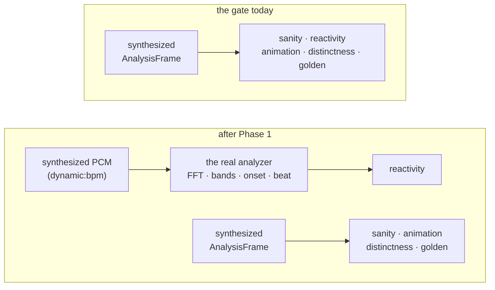

# 0067 — The curation route: a gate worth trusting, and the preset that has been waiting six weeks

> **Status:** **done** (closed 2026-08-09) — all six phases landed in the `plan-0067-curation-route`
> worktree, eight commits `ee08964..be7204c`, plus a `main` merge taking [Plan 0064](0064-the-symmetry-stage-and-the-banded-palette.md)'s
> symmetry stage. Mode 4 review: **no blockers and no code findings.** The one substantive item was a
> **factual error in this plan** — the `bar` claim, struck and corrected in Context & problem and in
> Phase 3 — which the implementation caught and correctly refused to act on. Verified rather than
> trusted: `reactivity` now drives PCM through `Renderer::capture_audio` → the real analyzer, and its
> non-vacuity test carries a **positive control** (the bound twin must clear the floor before the
> deleted twin's failure proves anything); Phase 1d landed as the recorded negative result the plan
> allows, with `ANIM_FLOOR` and `SIZE` genuinely unmoved and the ladder `#[ignore]`d, so CI cost is
> zero. Gate green after the merge: fmt, clippy, full nextest. **Moves no pixels.**
> **Created:** 2026-08-04
> **Extended:** 2026-08-04 — Phases **1c** and **1d** and a second Phase 4 trigger, from the
> `preset-author` handoff after `emitter_squall`. All three are about the same thing this plan is
> already about: the instruments that authorize content. They are additive and independent; if the
> plan is mid-flight, land them in any order.
> **Owner skill(s):** dev, human
> **Related ADRs:** [0081](../../adrs/0081-the-content-lane-lands-presets-and-architect-curates-the-set.md), supplementing [0017](../../adrs/0017-preset-author-skill-lane.md)
> **Closes:** [design-backlog 0056](../../design-backlog.md),
> [0060](../../design-backlog.md)
> (Phase 4's second trigger), and answers
> [0009](../../design-backlog.md)
> (Phase 1d)

## TL;DR

[ADR-0081](../../adrs/0081-the-content-lane-lands-presets-and-architect-curates-the-set.md) lets
`preset-author` commit presets directly, **gated on the behavioral suite**. This plan makes that
gate worth leaning on — today all five preset gates synthesize `AnalysisFrame` values and none of
them drives PCM through the analyzer, so a green suite is silence rather than evidence — and then
walks the first candidate through the new route: the untracked "Chthonic Coral Oracle", which
motivated Plan 0025 and never came home.

## Context & problem

Two problems that only look separate.

**The route.** ADR-0017 put curation at "`dev` embeds a curated preset" because embedding meant
editing Rust in two coupled spots. ADR-0022 retired that premise — `core/build.rs` globs
`presets/*.toml` — so the boundary has been standing on a fact that stopped being true. ADR-0081
moves it: the lane lands presets, `architect` curates the set at plan-close cadence.

**The gate that authorizes it.** `grep -l 'SpectrumAnalyzer\|push_samples' core/tests/*.rs` returns
`beat.rs`, `chain.rs`, `dsp.rs`, `saturation.rs`. It does **not** return `sanity.rs`,
`reactivity.rs`, `animation.rs`, `distinctness.rs` or `golden.rs` — the five gates a preset actually
passes through. Those construct analysis frames directly. So the sentence "gated on the behavioral
suite" currently means *the renderer produced a plausible frame from numbers we made up*, and it is
about to become the thing that authorizes shipping content without a second reader.

The two shipped instruments that *do* see real signal are `shot --audio <clip.wav>` and
`shot --signal dynamic:<bpm>` (Plan 0037 Phase 3), and the levels real material produces are
recorded in [`capturing.md`](../../capturing.md#what-real-material-actually-produces). The analyzer
path exists and is exercised; it is simply not in the loop the preset gates run.

**And the candidate.** `%APPDATA%\light-music-visualizer\presets\chthonic_coral_oracle.toml` has
never been tracked. It raised the entry that became ADR-0026 and Plan 0025, so the levers it asked
for shipped while the look that asked for them did not. It also carries ~~two pieces~~ **one piece** of rot read off
the file: `kaleido_order` is eased at `tau = 2.0`, sweeping a param whose math wants integers
through the values between them.

> **Corrected at close (2026-08-09).** This paragraph originally claimed a second piece of rot —
> that `kaleido_angle = "time * 0.06 + bar * 0.5"` names `bar`, "which stopped being a variable at
> ADR-0050". **That is false and the claim is struck.** `bar` is `VAR_NAMES[5]` in
> `core/src/preset/expr.rs` and is live today: it is the **beat** phase in `[0, 1)`, a misnomer kept
> for compatibility, as `docs/presets.md` documents. ADR-0050 *added* `bar_phase` — the genuine bar
> position — **alongside** `bar`; it retired nothing. Phase 3 correctly declined to act on this and
> left the line as authored, recording the correction in the preset's own header.

## Decision

Strengthen one gate so it sees real signal, then run the candidate through the route ADR-0081
opens. We rejected doing the candidate first — that is what happened last time and it is why the
file spent six weeks outside the repo — and we rejected converting all five gates to a PCM path,
because the point is a *credible* authorization, not a uniform one, and four of the five are asking
questions (does it animate, is it distinct, does it match its baseline) that synthesized frames
answer correctly and more cheaply.

## Architecture diagram

## Implementation phases

### Phase 1 — One gate stops making up its input

- **Owner skill:** dev
- **What:** `reactivity.rs` drives its presets from **PCM through the real analyzer** rather than
  from hand-built `AnalysisFrame`s, using the same synthesized generator `shot --signal
  dynamic:<bpm>` uses.
- **Files touched:** `core/tests/reactivity.rs`, whatever shared test helper builds frames today,
  possibly a small `core/src/dsp` re-export if the generator is not reachable from a test.
- **Done when:** the reactivity gate's numbers come from `push_samples` → analyzer → scene, not from
  a literal; the gate still passes over the shipped set; and a preset whose only band binding is
  deleted **fails** it, which is the property proving the signal reaches the picture. Determinism
  is preserved — the generator is seeded and the analysis is a pure function of its window
  (`CLAUDE.md`'s determinism rule), so the gate stays byte-reproducible run to run.
- **Note:** `reactivity` is the right one because it is the only gate whose *question* is about
  audio. The other four ask about the frame and are correct as they stand.

### Phase 1c — The distinctness report covers the families that have presets

- **Owner skill:** dev
- **Why it is here:** added 2026-08-04 from the `preset-author` handoff after `emitter_squall`
  landed. The report's family list is a hardcoded array in `core/tests/distinctness.rs:103` whose
  comment says, in bold, *"the moment a second preset lands in any of these three families, add it
  here"*. One has. The comment is doing its job; this phase is the response it asked for.
- **The omission is larger than the note that raised it, and that is the finding.** The comment
  justifies all three absences by preset count — a pairwise matrix needs two presets to say
  anything. That premise is stale for two of the three by a wide margin:

  | family | presets today | pairs the report has never measured |
  |---|---|---|
  | `emitter` | 2 | 1 |
  | `reaction_diffusion` | 5 | 10 |
  | `attractor` | 6 | **15** |

  So the report covers six of nine families and silently omits the two largest outside
  `fragment_field` — including the family that has had three plans of shape work
  ([0057](0057-the-attractors-compute-path.md), [0059](0059-lorenz-finds-its-plane.md),
  and 0063 in flight) and is the most likely in the library to have converged.
- **What:** add `Emitter`, `Attractor` and `ReactionDiffusion` to the array. If a family cannot be
  measured meaningfully by this instrument, **record why in the comment instead of leaving it out** —
  the array's own docstring is explicit that the reasoning has to be written down rather than
  inferred from an absence, and that is the property this phase preserves.
- **Files touched:** `core/tests/distinctness.rs`.
- **Done when:** the report prints a matrix for all nine families, or names in the comment the
  mechanical reason a family is absent (not a count that is no longer true). The test is advisory
  and asserts nothing, so "done" is the report being complete, not a threshold being met.
- **Watch the cost.** The test renders every preset in every listed family for 60 frames at 128x128.
  It captures 24 presets today; all nine families is 37, so this is roughly a **54 % increase** in
  that test's work, on a suite CI already pays for preset sweeps in more than once per push
  ([Plan 0061](0061-the-build-stops-paying-for-what-it-is-not-building.md) Phase 4b measured it). If
  the wall-clock grows materially, say so rather than absorbing it.
- **Expect the attractor matrix to be the interesting one and do not act on it here.** Six presets
  on one map family, several sharing a coefficient idiom, is exactly the configuration
  `struct_diff` was built to flag. Anything it flags is a *content* finding for the lane, not a
  reason to hold this phase.

### Phase 1d — The animation gate is measured against the two designs it penalizes

- **Owner skill:** dev
- **Why it is here:** added 2026-08-04. `core/tests/animation.rs` renders at 96x96 and gates on a
  whole-frame difference above `ANIM_FLOOR = 0.01`.
  [Backlog 0009](../../design-backlog.md)
  recorded in July that this penalizes two legitimate designs; it has now **rejected a shipped
  preset's better-looking draft**. `emitter_squall`'s sparse version — the same geometry at a fifth
  of the density, and the one the author preferred — scored `anim` **0.005** with three of four
  reactivity bands under 0.02. The shipped density is 5x higher and scores 0.018. That is a gate
  shaping content.
- **What:** measure before moving anything. Render both of 0009's cases plus a genuinely static
  control at a resolution ladder (96 / 192 / 384), and report what the statistic does.
- **Do the arithmetic first, because half the question is already settled and the phase must not
  pretend otherwise.** A figure invariant under rotation by `2*pi/k` produces an **identical image**
  under that rotation, so its whole-frame difference is zero at *every* resolution: Star Rosette's
  spinning ring is not a resolution problem and no ladder will rescue it. Only the thin-stroke /
  sparse case is plausibly resolution-bound, and even there it is empirical rather than obvious — a
  mark smaller than a pixel at 96x96 is lost or aliased rather than area-averaged, so whether the
  statistic separates *sparse but moving* from *static* is the thing being measured.
- **Files touched:** `core/tests/animation.rs`, and its floor constant only if the measurement
  supports moving it.
- **Done when:** the ladder is measured and one of two things is true — either a resolution is
  chosen with the floor re-derived at it, with the sparse probe clearing it and the static control
  still failing; or the measurement shows resolution does not separate them and the phase lands as a
  recorded negative result plus a comment on the constant. **Both are successful outcomes.** State
  the CI cost of whatever resolution is chosen: this gate sweeps the whole shipped set, and 384x384
  is 16x the pixels of 96x96.
- **The probes are free and both are non-vacuous.** The sparse case is `emitter_squall` with
  `spawn_rate` cut to a fifth (its header records the failing numbers). The symmetric case is
  `star_rosette` today. The static control is any preset with its bindings replaced by constants.
- **Not in scope:** a coverage-aware successor statistic. That was the alternative and it was not
  taken; if this phase's measurement is negative, *that* is when the design question is real.

### Phase 2 — The gate says what it can and cannot see

- **Owner skill:** dev
- **What:** the harness docs stop letting "the suite is green" be read as stronger than it is.
- **Files touched:** [`docs/capturing.md`](../../capturing.md) (a short section naming which gates run
  the analyzer and which synthesize), `presets/README.md` if it points at the suite as an
  acceptance check.
- **Done when:** a reader can tell, without opening a test file, which of the five gates would
  notice that a preset ignores the music. This is the sentence ADR-0081's Negative section is
  waiting on.

### Phase 3 — Chthonic Coral Oracle comes home, or is decided against

- **Owner skill:** human
- **What:** a `preset-author` pass: refresh the file against the v2 grammar, render it, judge it in
  motion, and decide whether it earns a place — including whether the regime-drift idea is better
  carried by a new preset than by restoring this one.
- **Files touched:** `presets/chthonic_coral_oracle.toml` (new, if it earns it).
- **Done when:** the file is either committed to `presets/` having passed the suite, or explicitly
  declined with the reason recorded in the backlog entry. **Both are successful outcomes** — the
  plan is about the route existing, not about this file shipping. ~~Two known repairs~~ **One known
  repair** first: the eased `kaleido_order` sweeps through non-integer values, which is a render
  question this pass answers by looking. (**Struck at close:** this bullet also ordered a repair to
  `bar` on the false premise that it "is no longer a variable" — see the correction in Context &
  problem. `bar` is live; nothing needed rebuilding on `beat_index` / `time_since_beat`, and the
  pass was right not to.)

### Phase 4 — The close ceremony grows a curation step

- **Owner skill:** dev
- **What:** the architect skill's close-ceremony bookkeeping gains the curation pass ADR-0081 makes
  its duty, hooked to "this plan touched `presets/`".
- **Files touched:** `.claude/skills/architect/SKILL.md` (the close-ceremony bookkeeping list),
  `.claude/skills/preset-author/SKILL.md` (the handoff description, which currently says the lane
  names candidates and hands off).
- **Done when:** both skills describe the same boundary, and neither still says `dev` embeds a
  curated preset. The architect's list states the trigger (the plan touched `presets/`) and the
  output (a one-line verdict in the close notes), because a duty with no trigger is the one this
  project has already proved gets skipped.

**A second trigger on the same step, added 2026-08-04 from the `preset-author` handoff
([backlog 0060](../../design-backlog.md)):**
*this plan fixed something a preset could have been framed around.*

- **What:** when a plan fixes an engine defect, grep `presets/` for headers citing it before the
  plan closes, and list what turns up in the close notes. The output is a **list**, not a re-tune —
  the judgement is content work and stays in the content lane.
- **Why it earns a line in a checklist.** Three instances, three engine fixes, three files that kept
  paying: `attractor_leviathan`'s `zoom` pinned at 0.72 to stay inside the fold's disc (lifted to
  1.80 a plan after ADR-0061 made it unnecessary); `attractor_clifford`'s framing cut from 1.10/1.42
  to 0.66/0.94 for the same reason, with a header that literally ended *"the general fix is a
  per-preset edge treatment — Plan 0055, approved, not built"* and stayed cut after it was built;
  and `swarm_dense`'s `kaleido_order = 1` dodging a smear ADR-0047 had already fixed, stale twice
  over by the time anyone read it. **Every one was found by a human opening a comment.** No
  instrument in this repo can see them, because nothing is wrong: a correct workaround for a defect
  that no longer exists renders fine and passes every gate.
- **It is a one-line search by construction.** This project's preset headers name the ADR, plan or
  backlog entry they are dodging, so `grep -rn "ADR-00NN\|Plan 00NN\|design-backlog 00NN"
  presets/*.toml` is the whole sweep. That property is worth stating in the skill text, because it
  is what makes the duty cheap enough to keep.

## Risks & open questions

- **Phase 1 could get expensive.** Running the analyzer per preset adds work to a gate that already
  sweeps the shipped set, and CI pays for preset sweeps more than once per push
  ([Plan 0061](0061-the-build-stops-paying-for-what-it-is-not-building.md) Phase 4b measured it).
  Keep the stimulus short — the analyzer needs enough window to fill, not a musical phrase — and if
  the gate's wall-clock grows materially, say so rather than absorbing it.
- **Phase 1 is adjacent to Plan 0061's CI work**, which owns `ci.yml` edits and the report
  generator's coverage. This phase touches `core/tests/` only. If both are live, that is the seam
  to keep clean.
- **Phase 4 edits `.claude/skills/**`.** Writes there are classifier-dependent rather than blocked;
  attempt the edit and report if it is refused rather than assuming.
- **Phase 3 may decline the preset**, which would leave ADR-0081's route demonstrated by a negative
  result. That is a weaker demonstration but not a failed one, and the entry says the same.

## What this plan does NOT do

- **It does not convert the other four gates to PCM.** They ask questions about the frame that
  synthesized analysis answers correctly and faster. Phase 2 documents that as a decision rather
  than leaving it as an omission.
- **It does not run a curation pass over the existing library.** Phase 4 installs the duty; the
  first pass belongs to whichever plan close next touches `presets/` — very likely
  [backlog 0058](../../design-backlog.md)'s fold-edge content work.
- **It does not change what `dev` may edit.** `dev` still edits presets when an engine change
  requires it (a renamed param, a retired default); what it stops doing is *couriering* new content.
- **It does not touch ADR-0017's other boundaries.** `preset-author` still writes no engine Rust.

## Followups (after this lands)

- If Phase 1's real-signal gate turns up shipped presets that pass while ignoring the music, that
  is a content finding worth its own backlog entry — and it would be the first time an instrument
  in this repo could have found it.
- The other four gates' blindness is now written down. If one of them ever needs to answer an audio
  question, this plan's Phase 1 is the pattern to copy.

## Curation verdict and cost decisions — close, 2026-08-09

**Curation (step 3b, second run — the first was [Plan 0064](0064-the-symmetry-stage-and-the-banded-palette.md)'s
close, which ran the step this plan installed).** `reaction_diffusion` goes from six presets to
**seven** with the Coral Oracle. `shot --presets presets --report`, run on the merged tree, flags
**no near-duplicate geometry in any of the nine families**, so the Oracle is distinct from the RD
presets Plan 0062 spread across regimes — the outcome that matters, since converging on that family
was the specific risk of restoring a six-week-old file. The workaround grep is clean: nothing in
`presets/` still pays for a fixed defect.

**The sweep also found two things on the Oracle, and they are the first real output this step has
produced.** Both are content findings for the `preset-author` lane; neither blocks the close:

- **Its `onset` response is 0.001, and 0.000 at realistic levels — effectively dead.** The header
  says `onset -> glow blooms on transients`. The preset passes `reactivity` on `bass` (0.107), so no
  gate notices. This is precisely the "green does not mean it reacts *well*" gap Phase 2 wrote into
  `capturing.md`, surfacing on the very first preset through the new route — which is a good sign
  for the instrument and a real note for the file.
- **Two clamp ceilings are never approached: `kill` at 98 % and `hatch` at 75 %.** The `kill` one is
  **correct and deliberate** — it is the feed/kill exception below, where the cap is a death state
  and the range is pulled in at both ends on purpose. `hatch` is not covered by that reasoning and
  is more likely a bound wider than its real range.

**The four open costs and questions, decided:**

| item | decision |
|---|---|
| `reactivity` 86 s → 167 s (1.8x) | **Backlog, not a followup plan.** ~85 % of the growth is warm-up hops that `capture_audio` *renders* when it only needs the analyzer's window to fill. That is a bounded fix with a named mechanism — a capture path that pushes samples without rasterizing during warm-up — and it is worth recording while it is understood. The cheaper `SIGNAL_HOPS = 16` was tried and correctly rejected: Squall at 10 % headroom is a gate that will fail on someone else's machine. |
| `distinctness` +82 % wall-clock | **Accepted, no followup.** It buys 28 `attractor` pairs and 15 `reaction_diffusion` pairs the report had never measured, on an advisory test, and the cost is documented at the top of the file. Proportionate. |
| Coral Oracle shipped on mild approval | **Open, routed to the content lane.** The plan's third outcome — that the regime-drift idea may be better carried by a **new** preset than by restoring this one — is neither answered nor foreclosed by shipping the file. It is content work and belongs to `preset-author`. |
| feed/kill deliberately not gained to their caps | **Backlog, and the interesting half is the rule, not the exception.** The Oracle's header records that for a Gray-Scott regime the cap is a **death state**, so the house "reach the cap on a peak" rule is actively wrong there — derived by rendering, not reasoned. The finding at close is that **the house rule itself is written down nowhere**: `cap / 0.85` and `cap / 0.60` appear only inside preset headers as folklore, so an exception to it has nothing to be an exception *to*. Documenting the rule and this exception together is the owed work. |

**Phase 1d's negative result is the one to read twice.** The ladder is flat because `frame_diff`
scores **occupancy** and occupancy is scale-invariant, so no resolution separates the sparse case
from the static control. That does not weaken
[backlog 0009](../../design-backlog.md) —
it sharpens it into a question that is now earned rather than speculative: the gate needs a
**coverage-aware** statistic, not a bigger render. A measurement that rules out the cheap fix is
worth more than one that confirms it.
