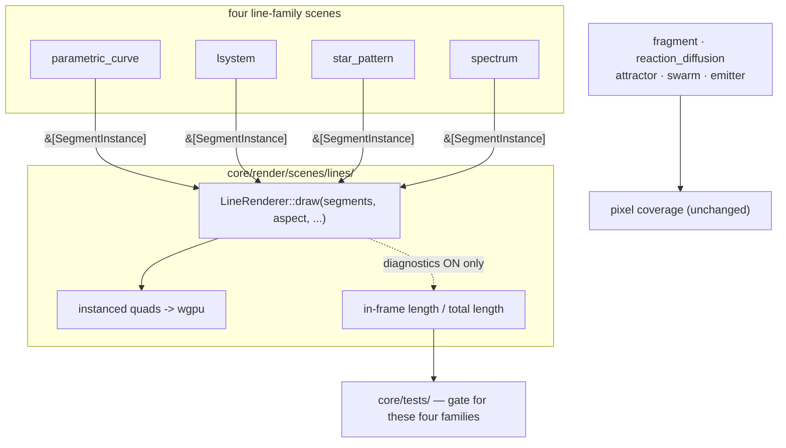

# 0069 — The instrument that sees a figure leave the frame

> **Status:** **done 2026-08-06** — all four phases landed on `plan-0069-in-frame-geometry` as
> `c3ce524` / `a359b67` / `9289a7c` / `1abf3a9`, one commit each. `main` was already an ancestor of
> the branch, so no merge was needed; the full gate is green on the tip (`fmt`,
> `clippy --all-targets -D warnings`, **546/546 nextest, 0 skipped**, doc links resolve) and **no
> golden baseline moved or was added**, as promised. Mode 4 review: **no blockers, three minor, one
> nit**. Verified rather than trusted — the `Scene` trait and the C ABI are untouched, the aspect has
> exactly one source (a free function with no `self`, no texture and no grid in scope, asserted at
> three aspects), the draw path costs one `Cell::get` when off, and Phase 2's byte-identity check is
> non-vacuous in both arms.
>
> **One done-when was not met literally, and the plan's arithmetic is why.** Phase 3 asked for a
> separation "at least an order of magnitude larger than the 0.055"; the shipped bar is `5x` and the
> comb measures `9.0x` (the corona `14.2x`). A comb roots every bar on a shared baseline, so a
> fully-driven bar at `scale = 3.80` keeps about `0.47` of its own length in frame **whatever else is
> done to it**, bounding the achievable separation near `0.53` — the same baseline-rooted fact that
> made this figure invisible to pixel coverage, showing up as a much weaker version of itself. The
> bar was set at a factor of `1.8` below the smaller measured separation so it is fitted to neither.
> That is an unchecked number in this plan, not a shortfall in the implementation.
>
> **What the plan did not anticipate: no absolute threshold orders this library either.** `Rose Zoom`
> (`0.3492`) and `Rose Overflow` (`0.3659`) bracket the frozen over-scaled comb (`0.3563`) and both
> are working exactly as authored — a figure flown into and a figure that outgrows the frame are the
> preset *names*. So this shipped as a **paired** instrument, convicting a configuration against its
> own repair, never against a floor. Recorded in ADR-0083's Outcome section.
> **Created:** 2026-08-04
> **Owner skill(s):** dev
> **Related ADRs:** [0083](../../adrs/0083-in-frame-geometry-is-measured-at-the-line-renderers-draw-seam.md) (**accepted with an Outcome section** at this close), supplementing [0067](../../adrs/0067-coverage-measures-the-scene-not-the-backdrop.md)
> **Closes:** [design-backlog 0054](../../design-backlog-archive.md#0054--pixel-coverage-cannot-see-a-figure-whose-tips-leave-the-frame-and-an-in-frame-geometry-fraction-is-the-successor) (archived at this close)

## TL;DR

Pixel coverage cannot see an over-scaled figure: a comb roots every bar on a shared baseline, so
clipping the tips costs a rounding error of lit pixels and the statistic goes the *wrong way*.
Plan 0058 measured this and shipped a report rather than a gate. This plan measures the right thing
instead — the share of drawn segment length that lands inside the render target — computed once
inside `LineRenderer::draw`, which already holds every endpoint and the target's aspect. All four
line-family scenes are covered with no `Scene` change and no per-scene code.

## Context & problem

Plan 0058 Phase 3's table is the argument:

```text
 ratio   cov@0.4  cov@1.0  preset
 0.8552   0.2878   0.2461  De Jong          <- lowest legitimate (correct content)
 0.9568   0.3164   0.3027  Leviathan        <- correct content
 1.0514   0.3866   0.4065  Spectrum Corona  <- OVER-SCALED, scale = 5.20
 1.0891   0.5088   0.5541  Spectrum Comb    <- OVER-SCALED, scale = 3.80
    inf   0.0000   0.0000  Spectrum Ridge (pre-repair)  <- 0/0, no denominator
```

The two defective presets score **above** the legitimate content, so no threshold ordering
separates them. A gate at `0.80` would sit `0.055` from correct attractor content and convict none
of the three known-bad configurations. The measure is wrong, not the threshold.

`LineRenderer::draw` (`renderer.rs:306`) receives `segments: &[SegmentInstance]` and the render
target's aspect. Every endpoint of the figure, and the shape of the box it has to fit in, are both
already in that function — for `parametric_curve`, `lsystem`, `star_pattern` and `spectrum` alike.
Nothing needs to be exposed, re-derived or added to a trait.

## Decision

Per [ADR-0083](../../adrs/0083-in-frame-geometry-is-measured-at-the-line-renderers-draw-seam.md):
compute the in-frame geometry fraction in `LineRenderer::draw`, behind a diagnostic switch that is
off in the shipped render path, and use it as a gate for the four line families while pixel
coverage keeps the rest. We rejected a `Scene` accessor (the same computation four times, over data
the renderer already holds, on a trait ADR-0002 keeps thin), harness re-derivation from the
generator config (duplicated generator math drifts exactly when it matters), and calibrating a
pixel-coverage threshold (measured impossible above).

## Architecture diagram



## Implementation phases

### Phase 1 — The fraction, computed where the segments already are

- **Owner skill:** dev
- **What:** `LineRenderer` gains an opt-in diagnostic that accumulates, per `draw` call, the total
  segment length and the length lying inside the world rectangle `[-aspect, aspect] x [-1, 1]`.
- **Files touched:** `core/src/render/scenes/lines/renderer.rs`.
- **Done when:** a figure entirely inside the frame reports **exactly 1.0** (this is exact, not
  approximate — no segment is clipped, so the two sums are the same sum); a figure entirely outside
  reports **exactly 0.0**; and a segment crossing the boundary contributes the *clipped* share of
  its length rather than all-or-nothing, verified on a hand-computed case where the answer is a
  round fraction. The aspect used is the one `draw` is handed — the render target's — and a unit
  test asserts no other source of aspect appears in the computation
  ([ADR-0037](../../adrs/0037-internal-grid-is-a-resolution-not-a-shape.md)).

### Phase 2 — The diagnostic changes nothing about the picture

- **Owner skill:** dev
- **What:** prove the switch is inert.
- **Files touched:** `core/tests/line_joints.rs` or a new `core/tests/geometry_extent.rs`.
- **Done when:** the same scene rendered with the diagnostic on and off produces **byte-identical**
  captures. This is the assertion ADR-0083's Negative section asks for, and it is exact rather than
  tolerance-based because the diagnostic path must not touch the instance buffer at all.

### Phase 3 — The gate, calibrated against the cases that already exist

- **Owner skill:** dev
- **What:** a test over the shipped line-family presets asserting the fraction, plus the two frozen
  defective configurations as non-vacuity fixtures.
- **Files touched:** `core/tests/geometry_extent.rs`, `core/tests/fixtures/` (the over-scaled comb,
  restorable from `git show 2efb80e^:presets/spectrum_comb.toml`).
- **Done when:** the over-scaled comb and corona measure **below** their repaired counterparts, and
  the separation between defective and correct content is **at least an order of magnitude larger
  than the 0.055 pixel coverage achieved** between its lowest legitimate preset and a plausible
  threshold. That comparison is the property this plan exists to buy, it is dimensionless, and it is
  the honest form of "the new measure convicts what the old one could not". The absolute fractions
  are **printed, not asserted** — they are measurements of specific presets and would freeze content
  that is allowed to move ([ADR-0071](../../adrs/0071-a-numeric-test-contract-states-a-property-or-names-its-machine.md)).
  `pre_repair_spectrum_ridge` stays where it is: it is the *total* case and `sanity.rs` is its home.

### Phase 4 — Say what it cannot see

- **Owner skill:** dev
- **What:** the harness docs describe the instrument, its reach, and the two things it is blind to.
- **Files touched:** [`docs/capturing.md`](../../capturing.md).
- **Done when:** the section leads with the four families it covers and the five it does not, states
  that it measures **length and not area** (so a thick stroke leaving the frame is under-counted),
  and states that a figure collapsed to a point scores a perfect 1.0 — which is `sanity.rs`'s
  question, not this one's. A reader must not be able to come away thinking this is an engine-wide
  gate.

## Data shapes

```rust
// illustrative — not the final interface
pub(crate) struct DrawExtent {
    pub total_len: f32,    // world units, summed over segments actually drawn
    pub in_frame_len: f32, // the share inside [-aspect, aspect] x [-1, 1]
}
impl DrawExtent {
    /// 1.0 when nothing was clipped. Undefined (and reported as such, not as 0)
    /// when `total_len` is zero — that is sanity.rs's case, not this one's.
    pub fn fraction(self) -> Option<f32> { /* … */ }
}
```

## Risks & open questions

- **A per-frame CPU loop over the segment list is new work on the draw path.** It must be off in the
  shipped path — that is what the switch is for — and Phase 2's byte-identical assertion is what
  makes "off" mean off. The loop is bounded by `LineRenderer`'s `capacity`, so it cannot grow
  unboundedly, but it is real cost when on and the docs should not pretend otherwise.
- **Clipping a segment against a rectangle has edge cases** (both endpoints outside but the segment
  crossing a corner; zero-length segments). Phase 1's hand-computed case should include the
  both-endpoints-outside crossing, because it is the one a naive endpoint test gets wrong and it is
  exactly what a badly over-scaled figure produces.
- **The `0/0` case is a reporting question, not a value.** Plan 0058's table printed `inf` for a
  preset drawing nothing. Return `None` and let the caller say "nothing drawn" rather than
  inventing a number — the total case has its own instrument.
- **Four families covered, five not.** If this instrument proves its worth, the temptation will be
  to reach for something universal. The honest next step is a *different* instrument for the
  particle families, not a blunter version of this one.

## What this plan does NOT do

- **It does not touch the `Scene` trait.** ADR-0083's central point.
- **It does not retire pixel coverage.** It stays the right question for the field and particle
  families and for "is anything drawn at all" everywhere.
- **It does not re-tune any preset.** If Phase 3 finds a shipped preset overshooting, that is a
  finding for the content lane, recorded in the backlog — not a preset edit inside this plan.
- **It does not measure area.** A stroke-width-weighted version is a different measure with a
  different failure mode; naming it here would invite building it by accident.

## Followups (after this lands)

- ~~If Phase 3 convicts a shipped preset, file it for `preset-author` with the measured fraction — the
  first time this repo has been able to name that defect mechanically.~~ **Answered, not pending
  (2026-08-06).** It did not fire and structurally could not have: the instrument shipped
  **paired**, convicting a configuration only against a frozen repair of itself, and a shipped preset
  has none. The two lowest scorers in the library, `Rose Zoom` (`0.3492`) and `Rose Overflow`
  (`0.3659`), are the lowest *by design*. See
  [ADR-0083's Outcome](../../adrs/0083-in-frame-geometry-is-measured-at-the-line-renderers-draw-seam.md).
  What this leaves open is filed as
  [backlog 0070](../../design-backlog.md#0070--the-in-frame-geometry-fraction-cannot-gate-new-content-and-the-number-it-computes-for-every-line-preset-is-not-in-the-authors-report).
- The particle families' equivalent, if wanted, is a genuinely different design: they have no
  segment list and their "figure" is a statistical cloud. Do not assume it is this measure with a
  different input. **Still open and correctly parked** — it needs a reference case before it is
  designable, and none exists.
