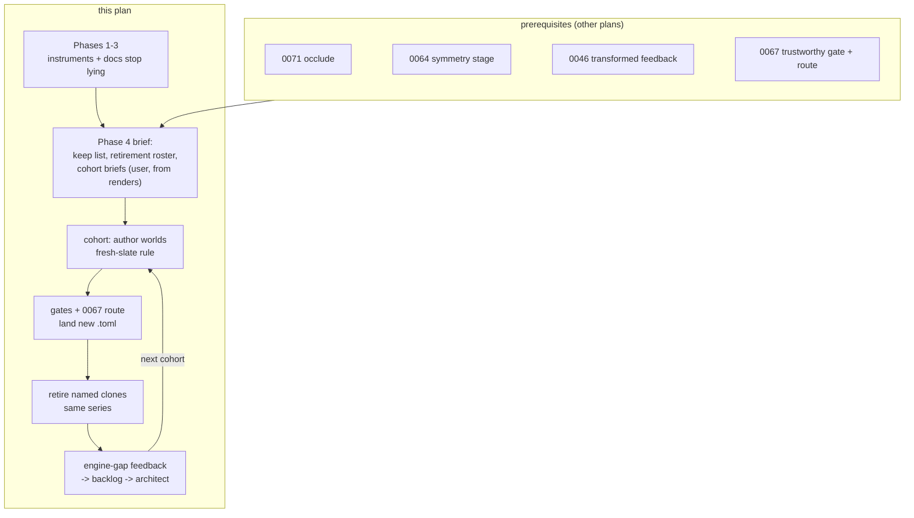

# 0075 — The content renaissance: the library is rebuilt as worlds, by replacement cohorts

> **Status:** **done 2026-08-11** — all six phases landed on `plan-0075-content-renaissance`
> (`873ca0a` Phase 1, `a6dcb51` Phase 2, `0d67416` Phase 3, `d4351ad` the brief, six cohort
> series `4cb2776`..`9ab6c36`, `bdb61f3` Phase 6). Mode 4 review: **no blockers, no majors,
> two minors, two nits** — 665/665 green after the merge with `main`, the 27-world set
> verified against the brief's keep list and roster, the depth-cue no-op and structural-rescue
> test bodies read against their done-whens. Close write-up in `docs/plans/README.md`.
> **Created:** 2026-08-09
> **Owner skill(s):** dev, human
> **Related ADRs:** [0089](../../adrs/0089-the-library-renews-by-replacement-cohorts.md) (the
> mechanism), [0081](../../adrs/0081-the-content-lane-lands-presets-and-architect-curates-the-set.md)
> (the landing route)
> **Serves:** [roadmap-visual-richness R6](../../roadmap-visual-richness.md)
> **Closes (Phases 1-3):**
> [backlog 0072](../../design-backlog.md#0072--sanityrss-coverage-floor-forces-dense-thin-stroke-line-scenes-into-washed-out-tuning-and-it-is-measuring-the-halo),
> [0067](../../design-backlog.md#0067--depth_fade-is-a-uniform-dimmer-on-every-flat-family-where-the-other-two-depth-cues-are-exact-no-ops),
> [0070](../../design-backlog.md#0070--the-in-frame-geometry-fraction-cannot-gate-new-content-and-the-number-it-computes-for-every-line-preset-is-not-in-the-authors-report),
> [0061](../../design-backlog.md#0061--perspective-moves-the-figure-far-more-than-it-enlarges-it-so-the-documented-way-to-recover-the-framing-does-not-work),
> [0062](../../design-backlog.md#0062--depth_hue-is-a-lightness-cue-on-a-lightness-ramp-it-wraps-at-the-ends-and-it-is-structurally-dead-under-ink_amount),
> [0063](../../design-backlog.md#0063--spins-usable-ceiling-is-set-by-fade-not-by-taste-and-the-pair-is-undocumented)
> **Gated on (Phases 4+ only):** [0071](0071-light-that-adds-without-covering.md),
> [0064](0064-the-symmetry-stage-and-the-banded-palette.md),
> [0046](0046-transformed-feedback.md), and [0067](0067-the-curation-route.md)'s Phases 1-2
> and 4. **Phases 1-3 are gated by nothing** and can interleave with the roster any time.

## TL;DR

The engine has outgrown the library, and the user has asked for a library that could not have
been written by editing the old one. [ADR-0089](../../adrs/0089-the-library-renews-by-replacement-cohorts.md)
sets the mechanism: **replacement cohorts under a fresh-slate rule, never a delete-all reset**.
This plan first fixes the instruments and documentation the new library will be authored
against (the backlog items that would otherwise shape or mislead every new world), then runs
the brief and the cohorts. Each cohort lands a few genuinely new worlds through the
[Plan 0067](0067-the-curation-route.md) route and retires a named list of old presets in the
same series — the set is never hollow, the gates never go vacuous.

## Context & problem

The full analysis is in ADR-0089's Context. In one paragraph: ~55 % of the 41 shipped presets
are template clones; most predate linear light, normalized bands, phrase time, `noise()`,
shaped marks, the IFS family and the depth levers; three shipped files are documented cases of
workarounds outliving the defects they dodged. The roadmap's R6 already promised a renaissance
once the capability waves landed. They now substantially have — what remains in front are the
last three look-surface movers (0071 in progress, 0064, 0046) and the gate-credibility work
(0067).

**The backlog investigation this plan came from** (2026-08-09, full sweep of open entries)
found three kinds of open item bearing on a rebuild:

1. **Instruments that would actively shape new content wrong** — the `sanity` coverage floor
   that selects for washed-out tuning on dense line scenes (0072, "will recur on the next
   mandala"), the animation-gate resolution question (0009, already routed to 0067 Phase 1d),
   and the geometry-fraction number that never reaches the author's report (0070). These are
   Phases 1-2 here, because a gate that rejects the better-looking draft (`emitter_squall`'s
   history) must not be the examiner of a whole new library.
2. **Documentation that points authors the wrong way** — the depth-lever trio (0061: the
   `perspective` orbit and its ~0.3 usable ceiling; 0062: `depth_hue`'s three regimes; 0063:
   the `spin`x`fade` smear ceiling). Phase 3, because these cost the last content pass a
   rendered ladder each, and the renaissance multiplies that cost by every new world.
3. **Capability gaps that are real but must NOT be prerequisites** — the slew-release
   smoothing form (0021, parked "awaiting an author want"), per-mark swarm variation (0068),
   the attractor tuple roster (0055), the LUT-coordinate wrap question (0075 item 2), the
   scalloped-curve primitive (0071), two-tone marks (0069). The cohorts are exactly the
   author-want generator these entries are waiting for; they get promoted through the normal
   loop **when a cohort hits them**, not pre-emptively. Bundling them here is the scope
   gravity the roadmap warns about.

## Decision

Run the renaissance as ADR-0089 specifies: instrument fixes first (dev), then a user-decided
brief from rendered evidence, then replacement cohorts (human, through the content lane),
with engine-gap feedback routed between cohorts. Sequenced last on the active roster, after
0071/0064/0046/0067 — except Phases 1-3, which are independent and can land whenever a
session has room.

## Architecture diagram

## Implementation phases

### Phase 1 — the sanity floor stops selecting for the defect

- **Owner skill:** dev
- **Area:** core (tests)
- **What:** resolve
  [backlog 0072](../../design-backlog.md#0072--sanityrss-coverage-floor-forces-dense-thin-stroke-line-scenes-into-washed-out-tuning-and-it-is-measuring-the-halo):
  at 96x96 the `sanity.rs` coverage statistic cannot see a dense thin-stroke figure (the bare
  rosette and a 46x-denser mandala score identically), so the only lever that clears the floor
  is inflating `glow`/`trails` — the exact look the user rejected. The entry names the two
  candidate mechanisms: a per-family floor that acknowledges what thin strokes render at
  96x96, or a structural occupancy measure (the radial-shell count already prototyped in the
  Plan 0065 lane). Choose at implementation and record why in the test.
- **Files touched:** `core/tests/sanity.rs` (and a helper if the structural measure is chosen).
- **Done when:** the honest tunings that failed the old floor pass the new measure — the three
  retired ring-mandala presets at `glow = 1.0` with no trails are recoverable from git history
  and their failing numbers are pinned in the backlog entry — **and** a scene that renders
  nothing still fails, which is the one job the current floor demonstrably does. No universal
  threshold is invented: whatever constant ships states its derivation next to itself
  (ADR-0071's rule).

### Phase 2 — two author traps close in code

- **Owner skill:** dev
- **Area:** core, standalone
- **What:** the two small code items from the sweep.
  1. **`depth_fade` becomes an exact no-op on flat families**
     ([backlog 0067](../../design-backlog.md#0067--depth_fade-is-a-uniform-dimmer-on-every-flat-family-where-the-other-two-depth-cues-are-exact-no-ops),
     its option 2): multiply the fade term by the family's has-depth flag, restoring
     ADR-0076's stated property that all three depth cues are identities at zero depth extent.
     The entry records that no shipped preset binds `depth_fade` on a flat family — verify
     with a grep at implementation; if that has changed, the affected baseline moves are
     listed in the commit.
  2. **The in-frame geometry fraction joins `shot --report`**
     ([backlog 0070](../../design-backlog.md#0070--the-in-frame-geometry-fraction-cannot-gate-new-content-and-the-number-it-computes-for-every-line-preset-is-not-in-the-authors-report)):
     the number `LineRenderer::draw` already computes gets a column in the author's own
     metrics table, which is where the over-scale defect class is actually introduced and the
     only place it can be caught for new content (ADR-0083 twice proved no absolute threshold
     exists).
- **Files touched:** `core/src/render/scenes/particles/` (one multiply in WGSL or its uniform
  prep), `standalone/examples/shot.rs`.
- **Done when:** on a `dn ≡ 0` family, captures with `perspective`, `depth_hue` and
  `depth_fade` each set alone are pixel-identical to the unset capture; `shot --report` prints
  the fraction for every line-family preset and omits the column for families that have no
  line seam.

### Phase 3 — the depth-lever docs stop pointing the wrong way

- **Owner skill:** dev
- **Area:** docs
- **What:** land the three measured corrections from the Plan 0063 content pass in the two
  files an author reads first:
  [0061](../../design-backlog.md#0061--perspective-moves-the-figure-far-more-than-it-enlarges-it-so-the-documented-way-to-recover-the-framing-does-not-work)
  (`perspective`'s dominant effect is a phase-varying **translation** at ~0.9x the parameter,
  a `zoom` cannot recover it, usable ceiling ~0.3 of the 0.8 legal range),
  [0062](../../design-backlog.md#0062--depth_hue-is-a-lightness-cue-on-a-lightness-ramp-it-wraps-at-the-ends-and-it-is-structurally-dead-under-ink_amount)
  (`depth_hue` reads as a hue cue only on a hue-travel ramp; keep it under
  `2 * min(hue_center, 1 - hue_center)` or it wraps; inert under a duotone remap), and
  [0063](../../design-backlog.md#0063--spins-usable-ceiling-is-set-by-fade-not-by-taste-and-the-pair-is-undocumented)
  (`spin` and `fade` are one look; the "2-4 is where rotation becomes legible" advice is wrong
  for every attractor preset that ships and goes).
- **Files touched:** `presets/README.md` (depth section), `docs/preset-palettes.md`
  (the `depth_hue` regime note). ADR-0076 itself gets a dated Outcome section — that edit is
  **architect's**, at this plan's close, per the append-only rule.
- **Done when:** each of the three entries' "What a fix would be" documentation items is
  present, with the measured numbers quoted rather than paraphrased; the stale "2-4" sentence
  is gone.

### Phase 4 — the brief: the target library, decided from renders

- **Owner skill:** human
- **What:** the user, with `architect` and the content lane, decides what the renaissance is
  aiming at — from rendered evidence, not file names (the concrete-examples workflow). Inputs:
  a contact sheet of all shipped presets under one real-material stimulus, and the roadmap's
  reference-look table. Outputs, appended to this plan file:
  1. **The keep list** — presets that survive on merit. Candidate criteria (a guess, to be
     re-decided here): authored geometry-first or post-craft-principles, measured distinct,
     and liked in the running app.
  2. **The retirement roster** — everything else, grouped into cohorts, each retirement named
     against the world that replaces it.
  3. **Cohort briefs** — one line per new world naming its reference look and mechanism.
     Guess: **three cohorts of 4-6 worlds**, target library **~18-24 worlds** total.
- **Done when:** the three lists exist in this file and the user has said "go" on cohort one.
- **Decided 2026-08-10** — the three lists are appended below
  ([The Phase 4 brief](#the-phase-4-brief--decided-2026-08-10)); the user designated the
  line families as cohort one. Authoring starts on the user's "go" in a fresh
  content-lane session.

### Phase 5 — the cohorts (repeat until the retirement roster is empty)

- **Owner skill:** human
- **What:** per cohort, the content lane authors its worlds under the **fresh-slate rule**
  (ADR-0089: a new world never begins by opening an old preset file), lands them through the
  [Plan 0067](0067-the-curation-route.md) route, and retires that cohort's named presets in
  the same commit series. Between cohorts, every wall the lane hit is handed to `architect`
  as backlog entries — this is the valve through which the parked capability entries (0021,
  0055, 0068, the LUT wrap, the curve primitive) get promoted **on demonstrated want**, each
  through its own ADR/plan, never absorbed into this one.
- **Done when (each cohort):** the new worlds are committed and green through the behavioral
  suite; the cohort's retirements are committed; the full suite runs green after the
  retirements (per-family floors re-derived by their own recorded rule where a family minimum
  moved); the distinctness report has been read and anything it flags is filed, not shipped
  around.
- **Done when (the phase):** the retirement roster from Phase 4 is empty.

### Phase 6 — the set's bookkeeping

- **Owner skill:** dev
- **Area:** docs
- **What:** the operator docs are swept for the new set — `presets/README.md` and
  `docs/preset-palettes.md` (count-free phrasing throughout, per the standing rule),
  `README.md` if the preset count or family roster is named anywhere user-facing, and the
  distinctness family array's comment if any family emptied. The workaround-header sweep
  (0067 Phase 4's grep) runs once over the final set.

  **Added at the cohorts 1-5 handoff (2026-08-11)** — three specific items the sweep must
  catch, recorded here so they are not re-found:

  1. `presets/README.md` still names the retired `fragment_kaleido` as the `kaleido_edge`
     squash/tile exemplar — cohort 2 retired that preset. Re-point the exemplar at a shipped
     world.
  2. `presets/README.md`'s IFS `vigor` description ("bushier, deeper, denser") inverts on a
     **space-filling** figure: on the dragon (two maps at exactly 0.7071, already
     space-filling) vigor above 1 overfills the region and dissolves the figure into dust —
     cohort 5 measured it on the loud frame and shipped the binding with the sign inverted.
     One-line caveat next to the row.
  3. For history readers, a record rather than an edit: commit `444600d`'s title says
     "firmament", but the world it ships is **Perseids** (the commit body is correct). History
     is never rewritten; this line is where the correction lives.
- **Done when:** the docs describe the library that ships; no doc names a count that the next
  cohort would re-drift.

## Risks & open questions

- **R3 (layered composition) is now designed —
  [ADR-0090](../../adrs/0090-a-preset-composes-two-scene-layers.md) /
  [Plan 0076](0076-the-second-layer.md) (closed 2026-08-11) — and this plan still does not
  hard-gate on it.** The preference is 0076 landing before Phase 4's brief so cohort worlds
  can be layered (the collage look is R3's own acceptance evidence); 0076 has now landed,
  so cohort 6 (the collage) is unblocked and the layered worlds can be authored directly.
- **Scope gravity** (the roadmap's own warning). Phases 1-3 are deliberately the *only*
  engine work here; every capability the cohorts ask for routes out through the backlog.
  The Mode 4 review should treat any engine code beyond Phases 1-2's named items as drift.
- **The gates still shape content.** Phase 1 removes the worst known instance, and 0067
  Phase 1d measures the other; but a new instrument can select for a new defect. Each
  cohort's done-when includes reading the reports, not just passing them — and a gate fix
  mid-renaissance is a legitimate feedback outcome.
- **The fresh-slate rule is unenforced.** It is stated in ADR-0089, this plan, and belongs in
  the content lane's skill docs (Phase 4's "go" is the moment to add it there). Holding it is
  a per-cohort review duty.
- **In-flight retunes may be partially discarded** (0071 Phase 5, backlog 0038/0058 walk
  presets the roster may retire). Accepted in ADR-0089: those passes keep the shipped app
  good during the transition.
- **Re-check backlog 0055 (attractor variety) before the brief** — its own text says the
  Plan 0059 Phase 4 levers may have closed some of the gap; the brief should know whether an
  attractor world needs the tuple roster or already has its variety.

## What this plan does NOT do

- **Delete the library up front** — ADR-0089's Alternative A, rejected.
- **Build the parked capabilities** (slew-release, swarm twinkle, tuple roster, LUT clamp,
  curve primitive, two-tone marks, R3). Each waits for a cohort to demonstrate the want, then
  goes through its own ADR/plan.
- **Touch the golden fixtures.** ADR-0023 decoupled them from content; retirements and
  landings move no baseline.
- **Change the curation boundary.** ADR-0081 stands; this plan is that route's heaviest user,
  not its editor.

## Followups (after this lands)

- The backlog entries the cohorts generate are the next design queue — by construction the
  highest-signal one this project will have had, since every entry comes from an author
  blocked on a real look.
- If the renaissance ends with a family empty (no world earned its scene), that is a finding
  about the scene, and it goes to `architect` as a scene-retirement question rather than
  quietly shipping a dead code path.

---

## The Phase 4 brief — decided 2026-08-10

Decided by the user from the rendered evidence: a contact sheet of all 45 shipped presets
under the report's own measured realistic stimulus (`bass 0.661 / mid 0.575 / treb 0.281 /
onset 0.145` + beat, 150 warm-up frames, floor tier), with the spectrum family supplemented
by real-audio `dynamic:110` filmstrips because a held `--set` cannot fill the band array.
Supporting measurements: `shot --presets presets --report` flags **zero near-duplicates**
across the library, so the case for replacement is idiom and era rather than geometry; git
provenance splits the set at 2026-08-04 (the post-craft era), and the user's keep list
deliberately cuts across that line — it was judged by look, not by date.

**The direction, in the user's own framing:** recreate the presets from scratch, family by
family — most were created against a limited engine, and the families themselves stay
supported. The plan's cohort-size guess (three cohorts of 4–6) is superseded by this
family-by-family structure; the ~18–24-world target stands (9 keeps + roughly 3–5 new worlds
per major family).

### The keep list (9)

| Family | Survives |
|---|---|
| `attractor` | Clifford, Barnsley Fern, Ink on Paper, Leviathan, Thomas |
| `fragment_field` | Supernova, Tiled Rosette, Banded Mandala |
| `swarm` | Drift |

### The retirement roster (36), grouped into family cohorts

Every retirement lands in the same commit series as its cohort's replacement worlds
(ADR-0089). **The newest wave retires too** — Chthonic Coral Oracle (the Plan 0067 curation
preset), Gilt, Droste Descent, Order Into Life, Starfield, Sparks and Squall — confirmed
deliberate by the user when asked explicitly; their measured knowledge stays findable in git
history.

| Cohort | Families | Retires |
|---|---|---|
| **1 — next** | `parametric_curve` + `lsystem` + `star_pattern` | Cathedral, Rose Draw, Rose Overflow, Rose Trails, Rose Web, Rose Zoom, Arrowhead, Fern Grow, Star Lantern, Star Rosette (10) |
| 2 | `fragment_field` | Aurora, Droste Descent, Ember, Glacier, Kaleido Field, Pulse Field, Smooth Pulse, Warp Drive (8) |
| 3 | `reaction_diffusion` | Chthonic Coral Oracle, Coral, Coral Bloom, Coral Head, Gilt, Reef, Reliquary (7) |
| 4 | `swarm` + `emitter` + `spectrum` | Dense, Storm, Starfield, Sparks, Squall, Spectrum Comb, Spectrum Corona, Spectrum Ridge (8) |
| 5 | `attractor` | De Jong, Order Into Life, Lorenz (3) |
| 6 | the collage | none of its own — gated on [Plan 0076](0076-the-second-layer.md) landing |

### Cohort briefs — one line per world, reference look → mechanism

`ROUTED` marks a capability that does not exist: a backlog promotion on demonstrated want,
per this plan's Decision — never a workaround, never absorbed here.

**Cohort 1 — the line families** (fully fresh; no keeps):

- Recursive subdivision line-art on paper — `lsystem` + ink mode; the roadmap's
  "nearly reachable today" look.
- Dense organic line-growth — a growth grammar under per-segment palette colour
  (Plan 0054), phrase-timed on `beat_index`.
- A rose successor — one Maurer world that earns the whole family's slot; the
  scalloped-curve primitive is ROUTED (backlog 0071) if the look demands it.
- An interlace successor — Hankin chords + ring levers under the symmetry stage; mind
  backlog 0073 (sampled motifs show vertices at ornament scale — stay at interlace scale
  or route the curve primitive).
- A neon line tunnel — a line source echoed into depth through `fb_zoom`/`fb_rotate`,
  bloom on the drop.

**Cohort 2 — fragment_field:** marbled fluid strata (domain warp under a terraced banded
palette, Plan 0064); neon kaleidoscopic tunnel (field source through transformed feedback +
kaleido fold + bloom); fractal glowing spiral (`fb_rotate` + `fb_zoom` echo of a warped
source). Resolve here the `blend = "add"` vs rich-palette trade Plan 0046 Phase 5 owed R6.

**Cohort 3 — reaction_diffusion:** two or three Gray-Scott worlds in regimes none of the
retiring corals occupied — feed/kill/flow extremes, one folded (the Gilt mechanism re-earned
fresh), one dark-on-light through ink; molten cellular field is ROUTED (roadmap R4), with a
folded RD maze as the substitute if unpromoted.

**Cohort 4 — swarm + emitter + spectrum:** particle shatter on light ground (shaped marks +
the ink inversion, beat-latched); a sky that twinkles — per-mark variation is ROUTED
(backlog 0068; the movable emitter source is the other half of that entry); a real spectrum
world (radial ring, `bin()` edges over band-scalar body; the waveform mesh stays ROUTED,
roadmap R5).

**Cohort 5 — attractor:** one or two new figure-worlds at coefficient tuples none of the
keeps occupy; the tuple roster stays ROUTED (backlog 0055) unless the cross-preset dissolve
plus per-preset tuples prove insufficient — that entry's own re-check (2026-08-10) says the
Plan 0059 levers likely closed most of the gap.

**Cohort 6 — the collage:** layered translucent worlds, R3's own acceptance evidence.
Briefs are written when Plan 0076 lands; deferred, not dropped.
