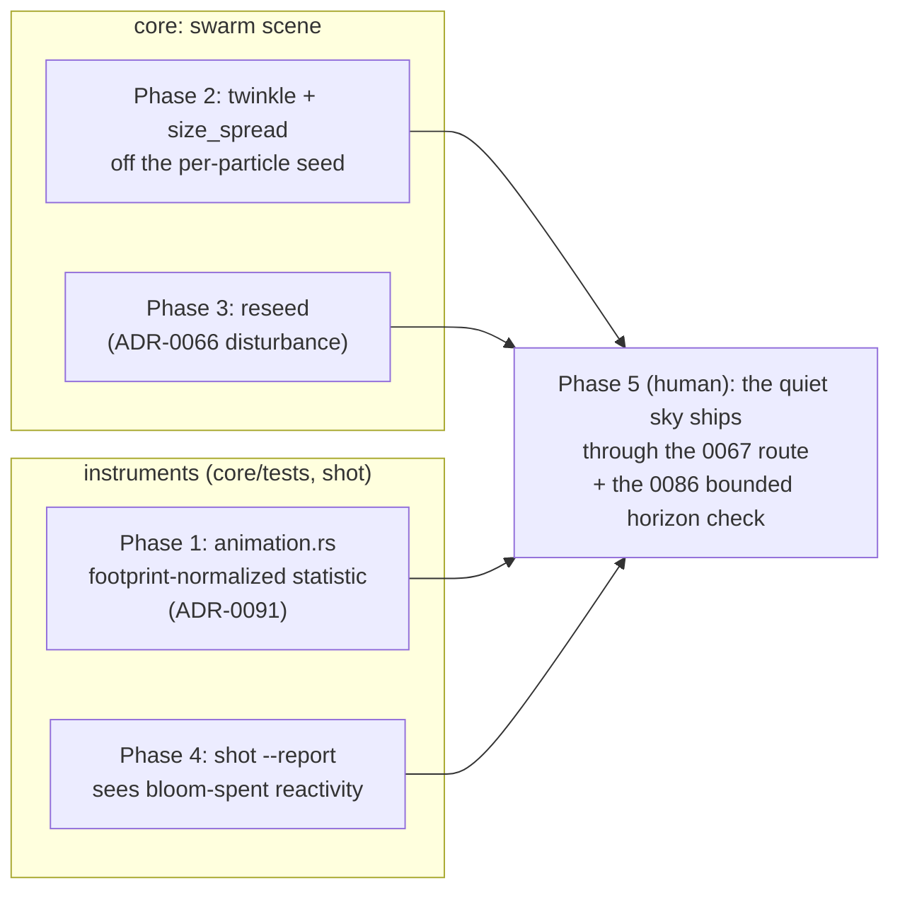

# 0077 — The quiet sky: the sparse idiom becomes gateable and the swarm individuates

> **Status:** done (closed 2026-08-12 — the four `dev` phases landed as `698b734` /
> `fae16e6` / `3bfc7c8` / `b1ca4e9`, every done-when verified at the Mode 4 review:
> no blockers, no majors, two minors both repaired in the close series. **Phase 5 is
> `human` and deliberately outstanding — see the plans README's Standing section**:
> the content lane authors Perseids' quiet sky through the Plan 0067 route, with the
> backlog-0086 bounded horizon check, and its verdict lands in the world's header.)
> **Created:** 2026-08-11
> **Owner skill(s):** dev, human
> **Related ADRs:** [0091](../../adrs/0091-the-animation-gate-scores-motion-against-the-figures-footprint.md)
> (the statistic), [0066](../../adrs/0066-a-reseed-disturbs-the-cloud-rather-than-replacing-it.md)
> (the reseed semantics Phase 3 reuses)
> **Closes:** [design-backlog 0009](../../design-backlog.md#0009--the-animationrs-gate-penalizes-two-legitimate-designs-informational)
> (the statistic half), [0068](../../design-backlog.md#0068--a-swarm-mark-has-no-per-mark-variation-so-the-only-scene-that-can-hold-a-starfield-cannot-make-one-twinkle)
> (option 1), [0085](../../design-backlog.md#0085--swarm-has-no-reseed-so-a-flow-field-pile-up-has-no-recovery-lever),
> [0088](../../design-backlog.md#0088--shot---reports-band-columns-cannot-see-reactivity-spent-on-bloom);
> discharges [0086](../../design-backlog.md#0086--no-capture-path-reaches-the-minutes-long-horizon-so-a-slow-accumulation-failure-is-invisible-to-every-instrument)'s
> trigger with a bounded check (0086 itself stays parked)
> **Queued:** after [Plan 0076](0076-the-second-layer.md) (landed) and Plan 0075's cohort 6, per the
> 2026-08-11 handoff decision — nothing here gates the collage.

## TL;DR

Plan 0075 cohort 4 lost a look: Perseids' quiet twinkling sky — sparse marks, low coverage,
slow shimmer — was routed out of the library because two independent walls price it out. The
animation gate's whole-frame statistic dilutes a sparse figure's motion into the empty frame
around it (backlog 0009, measured twice), and the swarm — the only scene that can hold a
starfield — has no per-mark variation, so nothing in it can twinkle (backlog 0068). This plan
fixes the gate's statistic (ADR-0091), gives the swarm per-mark life plus the `reseed` lever
cohort 4 also reached for (0085), teaches `shot --report` to see bloom-spent reactivity
(0088), and proves the whole stack by shipping the lost look through the normal curation
route. The named casualty becoming shippable *is* the acceptance evidence.

## Context & problem

Full histories live in the four backlog entries; the one-paragraph version: the sparse idiom
is legitimate content this project's instruments cannot currently gate and its swarm cannot
currently express. `emitter_squall` shipped at 5x its author's preferred density to clear
`ANIM_FLOOR`; Plan 0067 Phase 1d proved the resolution ladder flat (occupancy is
scale-invariant), closing the "render bigger" route and earning the coverage-aware-statistic
question; cohort 4 then lost Perseids outright, and separately watched Shatter collapse three
times over minutes of sustained force with no reseed lever and no instrument that reaches
that horizon. The report also mis-reads bloom-heavy worlds as dead (0088). All four items
promote from demonstrated want at the 2026-08-11 handoff.

## Decision

One plan, five phases: statistic first (the examiner must stop lying before new content
meets it), then the swarm capability pair, then the small report fix, then the quiet sky
lands as the plan's proof. Grouping over per-entry plans was user-decided at the interview;
0086's instrument stays unbuilt — its trigger (a slow-accumulation look shipping) is met
here by a bounded, one-off check rather than a gate, exactly as the entry's own "What a fix
would be" prescribes.

## Architecture diagram

## Implementation phases

### Phase 1 — the animation statistic stops diluting motion by emptiness

- **Owner skill:** dev
- **Area:** core (tests, metrics)
- **What:** implement ADR-0091 in `core/tests/animation.rs` (plus a helper beside
  `metrics::frame_diff` if the masked form is chosen): motion is measured against the
  figure's lit footprint, not the whole 96x96 frame. Masked-mean vs occupancy-normalized is
  chosen at implementation and the choice recorded in the test (the Plan 0075 Phase 1
  precedent), including the denominator's stated lower bound.
- **Files touched:** `core/tests/animation.rs`, `core/src/render/metrics.rs`.
- **Done when:** the two pinned non-vacuity probes separate — the rejected Squall draft
  (the shipped `emitter_squall` with `spawn_rate` cut to a fifth, per backlog 0009's
  pinned measurement) **passes**, and Phase 1d's static control **fails** — and the
  re-derived `ANIM_FLOOR` states its derivation beside itself (ADR-0071). The whole shipped
  library is swept under the new statistic; any preset the new floor convicts is *filed as a
  finding*, not re-floored around. No claim is made about the rotationally-symmetric case —
  identical frames score zero under any statistic, and the authoring docs keep saying so.

### Phase 2 — the swarm mark individuates

- **Owner skill:** dev
- **Area:** core (swarm scene)
- **What:** `twinkle` and `size_spread` on the swarm's mark, driven off the existing
  per-particle seed (`swarm.rs` already carries a seeded per-particle size factor and depth
  scale; nothing exposes a bound param through them). The emitter's `twinkle`
  (`emitter.rs`) is the semantic reference: **rate and phase both come off the seed**, so
  the field shimmers while the frame's total light sits still — the property a whole-field
  brightness term cannot fake (backlog 0068's measurement).
- **Files touched:** `core/src/render/scenes/swarm.rs`, `core/src/preset/schema.rs` (param
  registration), `presets/README.md` (roster rows).
- **Done when:** with both params at their defaults the capture is byte-identical to today
  (bless-to-bless against a clean control, per the standing baseline-drift rule); with
  `twinkle` bound at fixed audio, two captures at different times show per-mark brightness
  differences while the whole-frame mean stays within a bound the test derives from the
  twinkle depth and states — the "shimmer without breathing" property, not a frozen number.
  Determinism: the seed is the existing fixed per-particle seed; two runs are identical.

### Phase 3 — the swarm gains `reseed`

- **Owner skill:** dev
- **Area:** core (swarm scene)
- **What:** a `reseed` param with ADR-0066 semantics — a seeded *disturbance* of the
  existing population, its kick sized from the swarm's own domain the way
  `AttractorFamily::jitter_extent` derives from `seed_box` — **not** a respawn into a
  uniform box, which is the artifact class ADR-0066 removed and backlog 0064 caught
  returning once already.
- **Files touched:** `core/src/render/scenes/swarm.rs`, `presets/README.md`.
- **Done when:** a `reseed` pulse at fixed audio visibly disperses a converged population
  (frame-diff against the no-pulse control is nonzero) and the population re-converges to
  statistically similar coverage afterwards; `reseed` unbound is byte-identical to today.
  The *minutes-horizon* question — does the lever actually rescue a piled-up swarm — is
  explicitly **not** claimed here; that is Phase 5's bounded check, because no test at the
  suite's horizon can see it (backlog 0086).

### Phase 4 — the report sees bloom

- **Owner skill:** dev
- **Area:** standalone (shot)
- **What:** resolve backlog 0088: reactivity spent on `bloom_amount` reads ~0.000 in
  `shot --report`'s band columns because sRGB→linear palette peaks times glow sit just
  under the report's threshold. Either the band statistic accounts for the bloom
  contribution or the report gains a bloom column — chosen at implementation, recorded in
  the code, with the threshold's derivation stated if one moves (ADR-0071).
- **Files touched:** `standalone/examples/shot.rs` (and the metrics it calls).
- **Done when:** a bloom-only-binding fixture reads visibly nonzero where today it reads
  ~0.000, structural bindings report unchanged values, and the house workaround (a `flash`
  lever added only to be seen) is no longer necessary for the report to tell a bloom world
  from a dead one.

### Phase 5 — the quiet sky ships, and the horizon gets its one look

- **Owner skill:** human
- **What:** the content lane authors Perseids' quiet twinkling sky — sparse marks, low
  coverage, slow shimmer on swarm `twinkle` — under the fresh-slate rule, and lands it
  through the [Plan 0067](0067-the-curation-route.md) route at the author's preferred
  density, with no glow/trail inflation bought for the gates. Two riders:
  1. **The sanity floor is read, not fought.** If the swarm-family coverage floor prices
     out the legitimately sparse sky, re-derive it by the floor's own recorded rule and
     record the move (the 0072 precedent) — do not inflate the look to pass.
  2. **The 0086 bounded check.** If the world binds `reseed` or any sustained force, run
     one minutes-horizon observation (a long `shot` strip or a live app soak) and record
     the verdict in the world's header — the suite's own horizon is 0.5 s and cannot see a
     slow pile-up. This discharges backlog 0086's trigger without building the instrument;
     0086 stays parked.
- **Done when:** the world is committed and green through the behavioral suite under the
  Phase 1 statistic; its header records the density as *preferred, not bought*; the
  horizon verdict is in the header if the trigger applied.

## Data shapes

No new structs, no C ABI motion. Two new named swarm params (`twinkle`, `size_spread`), one
new swarm `reseed`, all through the existing named-param route; one statistic change inside
a test; one report column/statistic change inside `shot`.

## Risks & open questions

- **The normalized statistic's noise floor at tiny footprints.** The epsilon bound is the
  guard; if the quiet sky's footprint sits near it, the statistic is telling us the look is
  near-invisible at 96x96 — surface that rather than tuning the epsilon to pass (the 0072
  lesson: know what the gate currently catches before replacing it).
- **The library re-sweep may convict shipped presets.** Filed, not silently re-floored —
  and cohort retirements may have already removed the likely candidates; the sweep answers.
- **Twinkle interacts with the silence-motion floor.** Cohort 5 needed deliberate silent
  motion to clear 0.01; a seeded twinkle *is* silent motion, which helps — but it must not
  become the only animation a world has, or the anim gate passes a preset that ignores the
  music (the gates' standing blind spot; the reactivity gate still guards that half).
- **Phase 5 depends on cohort-6 timing.** If the renaissance's Phase 6 sweep runs first,
  the quiet sky lands as post-renaissance content through the same route; nothing breaks.

## What this plan does NOT do

- **Build 0086's long-horizon instrument** — one bounded check, verdict in a header; the
  entry stays parked with its trigger intact for the *next* slow-accumulation look.
- **The emitter's movable source** (backlog 0068 option 2) — stays open in the entry.
- **Touch the coverage/sanity statistic** beyond reading Phase 5's floor by its own rule —
  backlog 0072's fix already landed in Plan 0075 Phase 1.
- **Rescue the rotational-symmetry case** — arithmetic forbids it; docs carry it.

## Followups (after this lands)

- If the Phase 1 sweep files findings on shipped presets, they are content work for the
  lane, grouped with any retunes the renaissance still owes.
- If the quiet sky's header records a horizon verdict worth generalizing, 0086 has its
  second data point and its promotion case.
