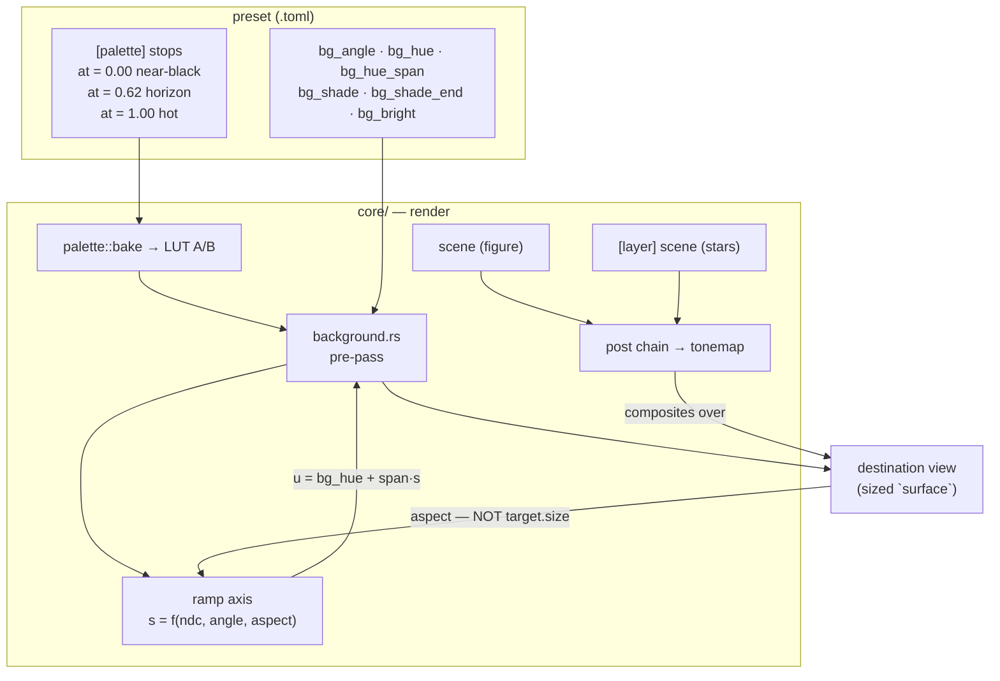

# 0080 — The sky gets a horizon: the backdrop paints a directional ramp

> **Status:** done 2026-08-12 — all six `dev` phases landed as six commits
> (`ac969a4..46a5f6c`). **Phase 7 is `human` and deliberately outstanding**, carried to the plans
> README's Standing section. Mode 4 review: **no blockers, no majors, three minors, one nit**
> (minors: the `preset-author` lane's own `systems.md`/`craft.md` did not know the ramp exists —
> the Plan 0078 `ink_gamma` minor repeated, and load-bearing because Phase 7's followup is that
> lane authoring a ramp world; `docs/capturing.md`'s "every golden baseline runs `bg_bright = 0`"
> was falsified by this plan's own fixture, the suite's first lit baseline; the plans README's
> standing baseline-drift control still said "8 of 20" against a suite of 26. All three repaired in
> the close series. Nit: `backdrop_ramp.rs:273`'s `+ 100.0` margin is the one threshold in the new
> suite without a stated derivation, in a suite otherwise exemplary on ADR-0071). Verified at the
> review: fmt + clippy clean, **573/573** `lmv-core` green, doc links exit 0, and the ADR-0058
> enumeration claim re-checked in `tonemap/tests.rs` (the shape records *whether* a
> `min_binding_size` is declared, not which, so 32 → 48 bytes moves nothing).
> **Created:** 2026-08-12
> **Owner skill(s):** dev, human
> **Related ADRs:** [0094](../../adrs/0094-the-backdrop-paints-a-directional-ramp.md) (this plan's
> decision), supplements [0018](../../adrs/0018-engine-wide-scene-compositing.md),
> [0086](../../adrs/0086-the-backdrop-colours-through-the-preset-palette.md),
> [0037](../../adrs/0037-internal-grid-is-a-resolution-not-a-shape.md) (the aspect trap this plan
> steps into)
> **Closes:** [design-backlog 0091](../../design-backlog.md)
>
> **Plan-accuracy drift recorded at the close, so the numbers here are not read as current:**
> Phase 1's "**All 20** golden baselines" is **26** (27 with this plan's own new one) — dev flagged
> it in the Phase 1 commit rather than absorbing it, and the plans README's standing control has
> been repaired to match. Phase 5's "whatever list `shot --report` walks for `bg_*` bindings"
> presumes a per-namespace roster that does not exist: the report walks a preset's bindings
> generically, so no code change was owed and dev verified the behaviour with a probe binding four
> `bg_*` names, one live gate and one dead, instead. The Risks section's open naming question
> (`bg_shade`/`bg_ramp_gamma`) closed by non-event — nothing better surfaced while writing Phase 6,
> and the names shipped as specified.

## TL;DR

The background pre-pass gains **one ramp axis** and paints a *segment* of the preset's palette
along it instead of a single sample — five new bindable params (`bg_angle`, `bg_hue_span`,
`bg_shade`, `bg_shade_end`, `bg_ramp_gamma`), all defaulting to exactly today's picture. The first user-visible
behavior is a photoreal dusk ground: a bright horizon band at the bottom of the frame fading
smoothly up through deep blue to near-black, authored entirely from the `[palette]` stops that
already exist, leaving the main scene and the one `[layer]` free for the figure and the stars.

## Context & problem

A content session riding Plan 0077's new swarm params tried to build a photoreal dusk — a bright
orange horizon band fading up through deep blue to near-black over the lower third, against a
user-supplied reference photo, with a music-driven starfield above it. The best approximation the
shipped engine can express is a hard-edged static slab (a `spectrum` scene at `scale = 0`) with a
thin glow rim. **The user's verdict on it is "unacceptable"**, so this is a demonstrated want with
a rejected workaround.

The engine has no static, screen-anchored, oriented gradient, and three surfaces each fail
structurally — the fragment field's axes are coupled and its clock is welded into the field phase;
the backdrop takes one palette sample times a *fixed* upward brightness tilt; and no post stage can
turn a hard edge into a quarter-frame fade (`bloom_radius = 3.0`, measured, barely visible). Full
reasoning, with the code citations, is in [ADR-0094](../../adrs/0094-the-backdrop-paints-a-directional-ramp.md).

The **layer budget** is the other half. This class of look needs three roles — ground, reactive
figure, star layer — and [ADR-0090](../../adrs/0090-a-preset-composes-two-scene-layers.md) caps
composition at a main scene plus one `[layer]`. The ground has to come from somewhere that is not
a scene slot.

## Decision

**Extend the backdrop pre-pass**, per ADR-0094: one ramp axis (`bg_angle`, radians, `0` = up),
a palette-coordinate travel along it (`bg_hue_span`, default `0`), a brightness ramp on the
same axis (`bg_shade` / `bg_shade_end`, defaults `0.72` / `1.0`) into which the existing hardcoded
`mix(0.72, 1.0, ndc.y)` tilt **retires**, so there is one brightness ramp rather than two, and one
response exponent (`bg_ramp_gamma`, default `1.0`) easing the axis position ahead of **both**
channels so the ramp stays one curve. The
horizon's vertical placement is authored by the `[palette]` stops' own `at` positions — no second
placement mechanism. The swept coordinate keeps the engine-wide repeat addressing.

We rejected a `gradient` scene (a new `SystemKind` would occupy the main slot or the one `[layer]`,
leaving the third role homeless), an orientation/time-scale lever on `fragment_field` (its axes are
coupled inside the warp loop, and it draws opaquely over the backdrop anyway), explicit
position/width params (splits placement across two tables that can disagree with the `[palette]`),
and clamping the swept coordinate (two shipped presets drive `bg_hue` outside `[0, 1]` and depend
on the wrap).

## Architecture diagram



## Implementation phases

### Phase 1 — the backdrop sweeps its palette (walking skeleton)

- **Owner skill:** dev
- **What:** The ramp axis and the colour sweep. `bg_hue_span` joins `PARAMS`/`set_param`/the
  uniform; the shader computes a normalized axis position `s` (fixed to bottom-to-top this phase)
  and samples the LUT at `u = bg_hue + bg_hue_span * s`. This alone renders the dusk ground.
- **Files touched:** `core/src/render/background.rs` (shader, `Bg` uniform, `PARAMS`, `set_param`),
  `core/tests/preset.rs` (the `declared_params_match_set_param` guard picks the new name up).
- **Done when:**
  - A preset with the dusk palette (`#060b24 → #1b2a5e → #c74b1d → #ff7a1f → #ffd06e`),
    `bg_hue = 1.0`, `bg_hue_span = -1.0`, `bg_bright` near `0.9`, renders a **continuous** vertical
    colour ramp: sampled down the frame's mid-column, the rendered colour tracks the palette's own
    colour at the coordinate that column's height implies, to within the LUT's 256-entry
    quantization. There is no edge anywhere in the column — the property that the shipped
    workaround fails.
  - **All 20 golden baselines are hash-identical** under a bless-to-bless control (bless twice on
    this branch, differing only by reverting the change — never `git diff` the committed
    baselines; 8 of 20 drift from their committed bytes on this box under a clean `LMV_BLESS`).
    The defaults are an arithmetic identity: `s ≡ 0.5 + 0.5 * ndc.y` and `u = bg_hue + 0.0 * s ≡
    bg_hue`, so this is a structural claim, not a tolerance. A non-identical baseline is a finding.

### Phase 2 — the brightness tilt becomes a ramp

- **Owner skill:** dev
- **What:** `bg_shade` / `bg_shade_end` join the uniform, and the hardcoded
  `mix(0.72, 1.0, clamp(0.5 + 0.5 * ndc.y, 0, 1))` is **deleted**, its two constants becoming the
  new params' defaults on the same axis as the colour sweep. One brightness ramp on the frame.
- **Files touched:** `core/src/render/background.rs`.
- **Done when:**
  - `bg_shade = 1.0, bg_shade_end = 0.0` produces a backdrop at full brightness at the ramp's start
    and black at its end — the direction today's engine cannot express at all.
  - The baselines are hash-identical again, by the same bless-to-bless control. This one is
    byte-identical **by construction**: the expression is still `mix(a, b, s)` with `a = 0.72`,
    `b = 1.0`, the same instruction and the same constants.
  - 17 of the 27 shipped presets bind `bg_bright` and none binds the new names, so no preset is
    re-tuned by this phase. If any preset's render moves, that is the finding.

### Phase 3 — the ramp eases

- **Owner skill:** dev
- **What:** `bg_ramp_gamma` (default `1.0`) shapes the axis position ahead of both the LUT
  coordinate and the shade mix, so brightness stops falling off linearly. The colour channel could
  be shaped by stop `at` placement instead — but `[palette]` is **shared with the scene**
  (ADR-0086/0090), so doing it there re-maps the figure too; this is the only lever that shapes
  the sky alone, and the only shape control the brightness ramp has at all.
- **Files touched:** `core/src/render/background.rs` (`c.z` is a free uniform word, so the buffer
  does not grow again).
- **Done when:**
  - The exponent uses **ADR-0092's shipped form**, `select(pow(s, g), s, g == 1.0)`
    (`core/src/render/ink.rs:135`), with the positive clamp and non-finite fallback on the **CPU**
    side (`ink.rs::applied_gamma`'s arrangement) so `1.0` reaches the uniform exactly and `pow`
    never sees `0^0`. The `g == 1.0` branch is a correctness requirement: `pow(x, 1.0)` is
    `exp2(1.0 * log2(x))` and is not bit-exact, so without it the *default* perturbs every
    backdrop-binding preset. Reuse the reasoning already written at that line rather than
    re-deriving it.
  - `bg_ramp_gamma = 2.5` on the dusk ground holds the horizon's brightness near its start and
    then falls away — a hot band with a long fade above it — and `0.4` drops fast into a dim tail.
    Both read as one curve: the colour and the brightness reach their midpoints at the **same**
    height, which is what "one ramp" means and what a per-channel curve would break.
  - Baselines hash-identical a third time, by the same bless-to-bless control.

### Phase 4 — the ramp rotates, and it takes the surface's aspect

- **Owner skill:** dev
- **What:** `bg_angle` (radians, `0` = bottom-to-top, matching `launch_angle`'s zero-is-up
  convention) turns the axis, and the pass learns the **destination surface** aspect to keep the
  authored angle true in screen pixels.
- **Files touched:** `core/src/render/background.rs` (the `aspect` term — `Bg.v.w` is currently
  unused and is its natural home), `core/src/render/mod.rs` (`composite_into` passes `surface` into
  `Background::render`).
- **Done when:**
  - **The aspect comes from `surface`, not from `target.size`.** These sit on adjacent lines in
    `composite_into` (`mod.rs:697` and `:702`) and the second is the chain's quantized, capped
    internal grid — ADR-0037's exact trap, shipped twice before. The backdrop paints `destination`,
    which is `surface`-sized.
  - **A negative control proves the term is live**, because at `bg_angle = 0` the aspect cancels
    (`d = (0, 1)`, denominator `aspect * 0 + 1`) and no default-angle test can tell a right aspect
    from a wrong one. At `bg_angle = π/4` on a **160x100** target, the ramp's mid-value crossing
    shifts **1.25 NDC** in x across the frame's height with the surface aspect (1.6), against
    **2.0 NDC** with the aspect forced to `1.0` — a 60 % error, in the shape of Plan 0046's
    `45x46` / `44x71` control.
  - Baselines hash-identical once more: `sin(0) = 0` and `cos(0) = 1` exactly, so the default path
    reduces to Phase 3's expression.

### Phase 5 — a fixture pins the ramp, and the instruments see it

- **Owner skill:** dev
- **What:** One golden fixture binding all four params (a swept colour ramp, a non-default shade
  ramp, a non-zero angle), plus the housekeeping the new names imply.
- **Files touched:** `core/tests/golden/` (fixture + baseline), `core/tests/` (the ADR-0058
  bind-group-layout enumeration), whatever list `shot --report` walks for `bg_*` bindings.
- **Done when:**
  - The fixture renders the ramp and its baseline is blessed **after comparing WARP against the
    hardware adapter** — the uniform grows 32 → 48 bytes, which changes this pass's
    `min_binding_size` (a Plan 0053 fix against a *measured* WARP mis-render). Record the two
    adapters' means in the commit; a divergence is a finding, not something to bless.
  - The ADR-0058 layout enumeration is re-run and its entry for `background-bind-layout` still
    reflects reality.
  - A preset binding the new names appears in `shot --report` with its bindings walked under the
    `bg_*` namespace like the existing three, and a dead gate on one of them flags.

### Phase 6 — the operator docs learn the ramp

- **Owner skill:** dev
- **What:** The doc sweep the new surface owes.
- **Files touched:** `presets/README.md` (the `bg_*` background-pass section),
  `docs/preset-palettes.md` (its backdrop section, added by ADR-0086).
- **Done when:** all six of these are written down:
  1. the four params, their defaults, and that `0` radians runs bottom-to-top;
  2. **placement is the `[palette]` stops' `at` positions** — the worked dusk example, with the
     palette and the four values side by side;
  3. the segment `[bg_hue, bg_hue + bg_hue_span]` **wraps** if it leaves `[0, 1]`, and what that
     looks like (the hot end at both ends of the sky) — the shape backlog 0062 uses for
     `depth_hue`;
  4. the fixed `0.72 → 1.0` tilt is **gone**, and `bg_shade`/`bg_shade_end` are where it went;
  5. **the backdrop is invisible to the gates** — coverage measures the scene (ADR-0067) and the
     animation gate strips `bg_*` (ADR-0091's Outcome) — so a ground painted here earns a preset
     nothing at `sanity`/`animation`, and the figure must carry them;
  6. the fragment field draws **opaquely** over the backdrop, so a ramp is invisible under that one
     system.

### Phase 7 — judge the dusk ground against the reference

- **Owner skill:** human
- **What:** The user renders the dusk ground in the running app and against the reference photo,
  and answers the three questions no test can: does the fade read as light rather than as a
  gradient, does the horizon sit where the palette `at` positions put it, and **does it band**.
- **Done when:** a verdict is recorded, including the banding one. A quarter-frame fade crossing
  most of the luminance range spends roughly **two pixels per 8-bit output level** at 1080p, which
  is the classic Mach-band configuration — the chain is float and linear until the tonemap, so the
  quantization is at the final write only, and nothing in it dithers. **Look for it deliberately at
  1080p and at the low `bg_ramp_gamma` end** (where the tail is flattest and the steps widest);
  reporting "no banding observed, at these two settings" is a result. If it bands, a dither is its
  own decision and its own ADR — do not add one inside this plan. If it reads, the look ships
  through the
  [ADR-0081](../../adrs/0081-the-content-lane-lands-presets-and-architect-curates-the-set.md) /
  [Plan 0067](0067-the-curation-route.md) curation route in the content lane — **not in this
  plan**. Group it with **Plan 0077 Phase 5** (Perseids' quiet sky, standing): that look and this
  ground are the same family, and both are one content pass.

## Data shapes

```rust
// illustrative — the uniform after Phase 4. `v.w` is unused today, so the
// aspect lands there and only one new vec4 is added: 32 -> 48 bytes.
#[repr(C)]
struct Bg {
    /// x: bg_hue, y: bg_bright, z: bg_vignette, w: aspect (from `surface`)
    v: [f32; 4],
    /// x: palette_mix, y: saturation, z: bg_ramp_gamma (CPU-clamped positive), w: unused
    c: [f32; 4],
    /// x: bg_angle, y: bg_hue_span, z: bg_shade, w: bg_shade_end
    g: [f32; 4],
}
```

## Risks & open questions

- **The aspect trap is the one to watch.** ADR-0037 has shipped twice, both times invisible at the
  development configuration. Here it is worse than usual: at the default angle the aspect term
  *provably* cancels, so the whole test suite could pass with the wrong source wired in. Phase 4's
  negative control is the mitigation, and it is a done-when rather than a suggestion.
- **A bright backdrop is untested territory.** Shipped presets sit at `bg_bright ≤ 0.039`; a dusk
  ground wants an order of magnitude more. The tonemap knee, `occlude` (ADR-0085) and the additive
  families over a lit plate have not been judged there. Phase 7 is where that surfaces; the
  neighbouring lever is Plan 0071 Phase 5's standing `occlude` retune.
- **A dusk world may struggle at `sanity`'s coverage floor** even with a full-looking frame,
  because the ground earns nothing. If it does, **read the floor rather than fight it** — re-derive
  by the floor's own recorded rule (the backlog-0072 precedent), do not lower it to fit a look.
- **The ADR-0058 LUT pair gets more likely to go live.** `background.rs`'s own note says to re-run
  its measurement "if a fragment-field preset ever binds `bg_bright`", and a bright backdrop makes
  that binding attractive. The pass and the fragment field share a `[Texture, Texture, Sampler]`
  layout shape. Phase 5 re-runs the enumeration; if a fragment-field preset later binds a ramp, the
  measurement is owed again.
- **A wide smooth ramp is exactly where 8-bit banding lives**, and this engine has never drawn one
  — every backdrop so far has been a dim wash at `bg_bright ≤ 0.039`, where there is no range to
  band across. Nothing dithers. Phase 7 looks for it rather than assuming either way; a dither, if
  owed, is a separate decision.
- **Open:** whether `bg_shade`/`bg_shade_end` are the right names beside `bg_bright`, and whether
  `bg_ramp_gamma` is the right name for a *positional* exponent (an author may read "gamma" as a
  colour or display gamma, which it is not). The defaults and the identity requirement are fixed by
  ADR-0094; if `dev` finds a clearly better name while writing the docs in Phase 6, raise it rather
  than silently renaming.

## What this plan does NOT do

- **No new `SystemKind`** — no `gradient` scene (ADR-0094 Alternative A).
- **No second `[layer]`.** The three-role budget is answered by the backdrop taking the ground
  role; ADR-0090's cap is untouched.
- **No orientation or time-scale lever on `fragment_field`.** A *moving* oriented field stays a
  legitimate separate want, unaddressed here.
- **No radial or elliptical gradient.** The vignette remains the only radial term and is unchanged.
- **No clamp on any palette coordinate**, here or elsewhere — the repeat addressing stands.
- **No alpha on the backdrop, and no foreground haze.** The pass owns the frame clear and writes
  `REPLACE`, so an alpha ramp would be inert — there is nothing beneath it to reveal (ADR-0094
  Alternative H). A ramp drawn *after* the scene, occluding the bottom of the figure, is a real and
  different capability; the dusk look does not need it (its horizon sits behind the stars) and
  nothing here forecloses it.
- **No dither.** See Phase 7 — whether the ramp bands is measured, not pre-empted.
- **It does not ship the dusk preset.** Authoring and landing the world is content-lane work
  through the Plan 0067 route, after Phase 7's verdict.

## Followups (after this lands)

- The dusk world itself, in the content lane, grouped with Plan 0077 Phase 5's standing quiet sky.
- Re-check whether a lit ramp makes `bg_bright` worth revisiting across the `swarm_*` and line
  families — `presets/README.md` has flagged that as unretuned since ADR-0056, and a ground the
  figure reads against is a stronger reason than the dim wash was.
