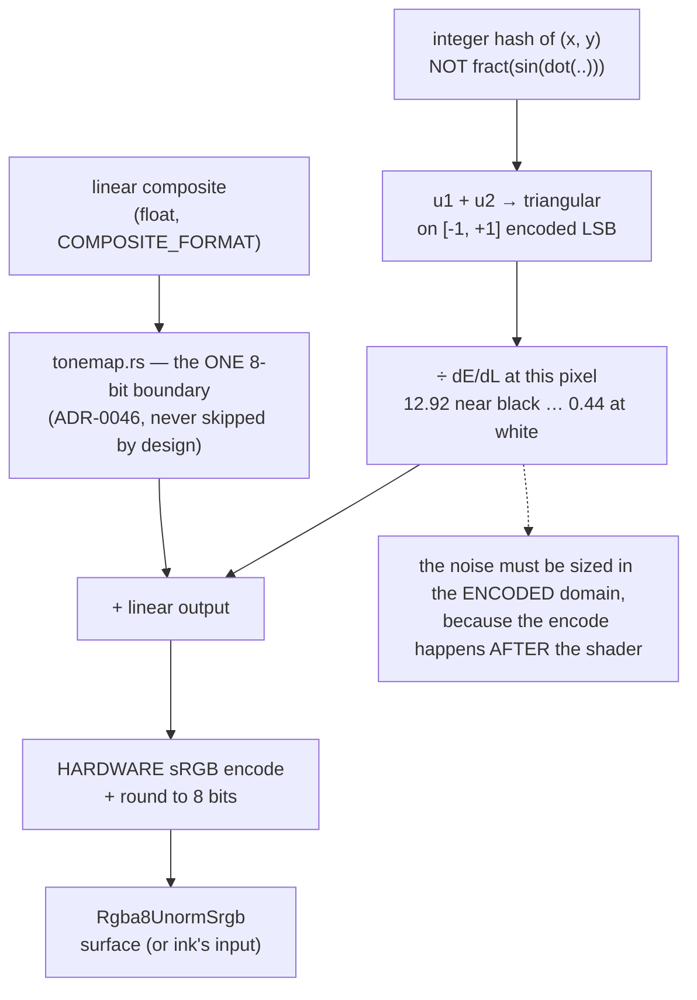

# 0082 — The gradient stops banding: the display write dithers

> **Status:** **done 2026-08-12** — all five phases landed (`b6743fa`, `ad7f39b`, `1492877`,
> `8c3aae7`, plus the self-repair `b6b5940` and the `human` verdict `e64a61b`). Mode 4 review:
> **no blockers, one major, five minors, three nits**. The major is this plan's own ADR — see
> [Close notes](#close-notes--2026-08-12) below, and
> [ADR-0096's Outcome](../../adrs/0096-the-display-write-dithers.md#outcome--2026-08-12-at-plan-0082s-close),
> which falsifies two of its claims. Approved by interview the same day; the dither's shape, the
> sequencing ahead of [0081](../0081-the-sky-gets-a-galaxy.md), and the decision to fix this before
> authoring the world were all settled there — see ADR-0096's Alternatives.
> **Created:** 2026-08-12
> **Owner skill(s):** dev, human
> **Related ADRs:** [0096](../../adrs/0096-the-display-write-dithers.md) (this plan's decision),
> attaches to [0046](../../adrs/0046-linear-light-hdr-composite-bloom-tonemap.md) (the format
> boundary), answers [0094](../../adrs/0094-the-backdrop-paints-a-directional-ramp.md)'s open banding
> question, unblocks [0095](../../adrs/0095-the-backdrop-paints-a-curved-band.md)
> **Closes:** [Plan 0080](0080-the-sky-gets-a-horizon.md) Phase 7's banding half
> **Blocks:** [Plan 0081](../0081-the-sky-gets-a-galaxy.md) — sequenced first by the user's call

## TL;DR

The tonemap dithers its output: ±1 encoded LSB of triangular noise from an **integer** hash of the
pixel coordinates, scaled by the inverse sRGB slope because the hardware encodes after the shader.
One site, always on, and it fixes every gradient in the engine at once. The measured 58-pixel
single-value plateaus in the dusk ground's dark tail become hairlines.

## Context & problem

Plan 0080 asked whether its ramp bands. **It does, measured rather than suspected**, and the user's
verdict on the running app is *"reads as light, but the banding is visible"* — the look works and
the quantization is the one thing spoiling it.

Run lengths down the mid-column of the 1080p renders, where a plateau of one identical 8-bit value
*is* the band:

| configuration | mean px/level | widest mid-range plateau | plateaus ≥ 16 px |
|---|---|---|---|
| `bg_ramp_gamma = 1.0` | 4.9 | 31 px at value 30 | 18 |
| `bg_ramp_gamma = 2.5` | 4.1 | 122 px at value 225 | 4 |
| `bg_ramp_gamma = 0.4` | 7.5 | **58 px at value 11** | 17 |

**0 % of the column is rail-pinned** on any channel in any of the three, so this is a gradient being
quantized and not a tonemap clip — which also retires a suspicion raised at Plan 0080's close that
`bg_bright = 0.85` was reaching the tonemap's shoulder. It is not; nothing clips.

The full reasoning, the three pipeline facts that decide the shape of the fix, and the seven
rejected alternatives are in [ADR-0096](../../adrs/0096-the-display-write-dithers.md).

## Decision

**The tonemap dithers**, per ADR-0096: TPDF noise of ±1 encoded LSB, from an integer hash of the
pixel coordinates, divided by the sRGB transfer function's local slope so the perturbation is one
*encoded* level everywhere. Static, always on, not a param.

We rejected ordered/Bayer dither (a cross-hatch on flat areas, and flat areas are the whole
problem), a baked blue-noise texture (a new binding and therefore a new bind-group-layout shape on
a pass live in every frame — ADR-0058 territory), the `fract(sin(...))` hash idiom (implementation-
defined precision, so the fix would itself diverge between adapters), a constant linear-space
amplitude (12.9x too strong near black, 2.3x too weak at white — wrong in both directions and worst
where the plateaus are), a non-sRGB surface with a shader-side encode (blast radius across
`context.rs`, the standalone surface, capture and the shim), an animated dither (gives up the
byte-equality property, and risks shimmer at 60 Hz), and a `dither` param defaulting off (the
library would keep the defect while the engine carried the cure).

## Architecture diagram

## Implementation phases

### Phase 1 — the dither lands, and it is adapter-exact

- **Owner skill:** dev
- **What:** The whole fix, in one shader. An integer bit-mixing hash on the fragment's integer
  coordinates yields two uniforms; their sum is triangular on `[-1, +1]`; that is divided by the
  sRGB slope at the pixel's own linear value and added before the write. **Reuse the arrangement
  `scenes/particles/` already ships** (`hash_unit` / `hash3`) rather than inventing a second hash
  idiom — and if that pair is genuinely reusable here, promoting it to a shared home is the right
  move rather than a third copy.
- **Files touched:** `core/src/render/tonemap.rs` (the shader, and the slope helper).
- **Done when:**
  - **The plateaus are gone, measured with the instrument that found them.** On the
    `bg_ramp_gamma = 0.4` dusk probe at 1920x1080, the widest mid-range single-value plateau down
    the mid-column falls from **58 px** to a hairline. State the bound as a property rather than a
    frozen number: with the error decorrelated, a plateau wider than a few pixels is a *statistical*
    event rather than a structural one, so assert against the **undithered control rendered in the
    same run** — an order-of-magnitude reduction in the widest plateau, not a number copied from
    this paragraph.
  - **WARP and the hardware adapter agree byte-for-byte**, not to within the 0.02 drift floor. This
    is the whole point of choosing an integer hash over the trig idiom, and it is a **sharper**
    check than this repo has been able to make before — record both adapters in the commit, and a
    single differing byte is a finding.
  - **The amplitude is right at both ends**, which is the claim Alternative D gets wrong. Assert it
    where the two disagree most: the perturbation must be ~1 encoded LSB in the **dark tail** and
    ~1 encoded LSB at the **bright end**, rather than 12.9 and 0.44. A flat-field probe at two
    linear levels, differenced against an undithered control, separates these — and it is the test
    that would catch someone deleting the slope term.
  - **The golden suite goes red here, on purpose and by prior agreement**, because every baseline
    moves. It stays red until Phase 2. Say so in the commit, as Plan 0080 said it of the docs guard.

### Phase 2 — the baselines re-bless, bounded and proved

- **Owner skill:** dev
- **What:** The one-time full re-bless. **This lands alone, in its own commit, with nothing else in
  it** — a commit that touches every baseline must be reviewable as exactly that.
- **Files touched:** `core/tests/golden/*.png` (all of them).
- **Done when:**
  - **Every channel of every baseline moved by at most one level**, asserted rather than trusted:
    `round(x + n)` with `|n| ≤ 1` differs from `round(x)` by at most 1, so the re-bless is *provably*
    bounded. Compare the pre-blessing bytes against the post-blessing bytes for all 27 and report
    the maximum delta. **A delta of 2 anywhere means the amplitude or the slope term is wrong**, and
    it is a finding rather than something to bless.
  - The eight baselines that drift from their committed bytes on this box under a clean `LMV_BLESS`
    are handled by the standing rule — bless-to-bless, never a `git diff` against the committed
    files — and the comparison above is made between the two *blessed* sets.
  - **The `≤ 1`-tolerance assertions in `backdrop_ramp.rs` still pass**, checked rather than
    reasoned about. ADR-0096 argues they should — the dither shifts the rounding threshold
    identically for two frames at the same pixel — but that is reasoning, and this is where it gets
    an observation.
  - **Every byte-equality test still passes**, in particular Plan 0075's `depth_fade` no-op against
    a live Lorenz control. This is the property that made "static" the right choice over "animated";
    if one of these fails, the dither has picked up a time or frame-index term it should not have.

### Phase 3 — the instrument becomes a guard

- **Owner skill:** dev
- **What:** The plateau measurement becomes a test, so the fix cannot be silently undone. This is
  the regression guard for Alternative D specifically: deleting the slope term leaves the bright end
  looking fine and re-bands the dark tail, which no existing test would notice.
- **Files touched:** `core/tests/` (a new suite, or `backdrop_ramp.rs` if it belongs there).
- **Done when:**
  - A synthetic dark ramp — injected, not a rendered scene, so it does not depend on any preset
    surviving — is rendered with and without the dither and the widest mid-range plateau is compared
    between the two. **Rail-pinned runs are excluded from the statistic**, because a genuinely flat
    region of a picture is not a band and counting it would make the test pass for the wrong reason.
  - The assertion is a **ratio between the two arms of the same run**, so it is a property rather
    than a machine measurement (ADR-0071), and both terms are the same kind of quantity (ADR-0074).
  - The test has a **positive control**: with the dither disabled it must fail. A banding test that
    cannot detect banding is the failure mode here.

### Phase 4 — the docs learn that the write dithers

- **Owner skill:** dev
- **What:** The doc sweep.
- **Files touched:** `docs/capturing.md` (the golden/drift section — the re-bless and what the
  suite's guarantees now mean), `presets/README.md` (a note where gradients are discussed: wide
  smooth ramps are safe now, and *why* the dark tail used to be the risky end),
  **`.claude/skills/preset-author/references/craft.md`** (the lane's own guidance — it currently has
  no reason to think a long dim tail is dangerous, and after this it genuinely is not).
- **Done when:**
  - `docs/capturing.md` records the one-time full re-bless, its date, and the bounded-by-one
    property that makes it safe — so a future reader finding "all 27 baselines changed in one
    commit" in the history has the explanation attached.
  - **Plan 0080's inverted arithmetic is corrected where it can mislead.** Its Phase 7 text says two
    pixels per level "is the classic Mach-band configuration"; two pixels per level is the *safe*
    case. The plan is closed and its own text is history, so the correction belongs in the operator
    docs and in this plan's record rather than in an edit to a `done/` file.

### Phase 5 — confirm on the running app

- **Owner skill:** human
- **What:** The user looks at the dusk ground again, at 1080p, fullscreen, at the low
  `bg_ramp_gamma` end where the 58-px plateaus were.
- **Done when:** a verdict is recorded on both halves:
  - **The bands are gone**, at the setting where they were visible.
  - **The grain that replaced them is not itself a problem.** At one encoded LSB it should be at or
    below the threshold of visibility, but it is a *fixed* pattern, and on a long-held still frame a
    fixed pattern can resolve as texture. If it does, that is ADR-0096 Alternative F — an animated
    dither — and it is one term, but it costs the byte-equality property and is its own decision.

## Risks & open questions

- **This is the first deliberate full re-bless in the project's history**, and it blinds the drift
  guard to anything unrelated landing in the same commit. Phase 2's isolation and its bounded-by-one
  assertion are the whole mitigation; do not let anything else ride along.
- **The `≤ 1` tolerances inherited from Plan 0080 are the most likely casualty.** The argument that
  they survive is sound but it is an argument. Phase 2 checks them; if one fails, the honest fix is
  to widen that assertion with the reason recorded, not to weaken the dither.
- **A fixed grain can read as texture on a held frame.** This engine is usually in motion, which is
  why static was chosen, but the dusk sky is nearly still by design — it is close to the worst case
  for this choice. Phase 5 is where that surfaces.
- **Ink re-quantizes.** When `ink_amount > 0` the ink pass reads the already-dithered 8-bit image,
  remaps it and writes 8 bits again. The dither's noise survives a smooth monotone remap, so this
  should be fine — but a steep `ink_gamma` compresses the range and could locally re-band. Not
  measured. If an ink-binding preset bands after this lands, that is the cause, and the same
  instrument answers it.
- **Open:** whether `hash_unit` / `hash3` in `scenes/particles/` are genuinely reusable here or
  whether the tonemap wants its own. If they are, they want a shared home rather than a third copy —
  Plan 0077's close already flagged that the emitter's `unit` hash is mirrored verbatim into
  `swarm.rs` and that "a third particle scene should promote it". This would be that third caller,
  arriving from an unexpected direction.

## What this plan does NOT do

- **No blue noise** (Alternative B). The hashed grain ships first; blue noise is a texture, a
  binding and an ADR-0058 enumeration entry.
- **No animated dither** (Alternative F). Static, so byte-equality tests survive. Named, not
  foreclosed — it is one term.
- **No `dither` param.** Always on; correct quantization is not a look.
- **No format change.** The surface stays `Rgba8UnormSrgb` and the hardware keeps doing the encode
  (Alternative E).
- **It does not touch the tonemap's curve.** ADR-0046's shoulder is unchanged; this adds a term at
  the write and nothing else.
- **It does not dither the degenerate fallback path.** When `tonemap.begin` cannot build its target
  the composite falls through to the old clipped 8-bit write, undithered. That is already the
  "never drop the frame" branch.

## Followups (after this lands)

- **[Plan 0081](../0081-the-sky-gets-a-galaxy.md) is unblocked**, and its Phase 6 verdict is no longer
  confounded — the galactic band is born onto a chain that already dithers.
- **If Phase 5 says the grain reads as texture**, Alternative F, with the observation as its
  evidence.
- The dusk world itself, in the content lane, still grouped with Plan 0077 Phase 5 and Plan 0080
  Phase 7 — **now three standing items on one family of looks, and one pass**.

## Close notes — 2026-08-12

**Verdict: landed cleanly, and unusually well evidenced. No blockers, one major, five minors, three
nits — and every finding is a consequence of something *this plan* got wrong, recorded honestly by
`dev` rather than absorbed.** Verified at the close rather than taken on the commit messages' word:
`fmt` clean, `clippy --workspace --all-targets` clean, doc links green; both dither tests reproduce
their recorded numbers exactly (`132 px -> 23 px`; dark sweep mean 0.3533 worst 2, bright 0.3384
worst 1); golden 27/27 green post-bless; `backdrop_ramp` 6/6, so the `<= 1` tolerances survived; all
four byte-equality tests pass including Plan 0075's `depth_fade` no-op against a live Lorenz control,
which is the property that made *static* the right choice; and the emitter burst test that caught the
rail defect is back to passing.

### The major: ADR-0096 was falsified in two places, and is accepted with a dated Outcome

Both are recorded in
[ADR-0096's Outcome](../../adrs/0096-the-display-write-dithers.md#outcome--2026-08-12-at-plan-0082s-close)
rather than edited into its body.

1. **The Decision's "three parts, each load-bearing" is four.** The ADR says nothing about the rails,
   and as written it produces a mean `0.18/255` DC lift on an exactly-black frame — half the noise
   discarded by the clamp at a value that was already exactly representable, over a suite where
   nearly every fixture runs `bg_bright = 0`. `dither_offset`'s fade is the missing part, and its
   inertness is a *property*, not a tuning: below the knee the slope is the exact constant 12.92, so
   `min(l, 1-l) * slope * 255` **is** the encoded byte value, and the fade is exactly inert at and
   above code value 1 — where every plateau this pass exists to dissolve lives.
2. **The third Positive consequence is false, and it was the ADR's headline argument.** The adapters
   do *not* agree byte-for-byte and cannot: the hash is exact (65 536 float values, zero differing
   bit patterns), but the **hardware sRGB encode downstream of it** is not — DX12 permits tolerance
   and WARP's approximation departs from the true curve below ~byte 20. Measured: 212 of 2 049 408
   channels move by 2. The integer hash still earned its place (Alternative C would have diverged on
   essentially *every* pixel), but the promised sharper-than-0.02 instrument does not exist and
   nothing should be built on it.

### Three numeric done-whens in this plan were wrong, and that is the plan's failure, not `dev`'s

- **Phase 1's fourth: "the golden suite goes red here, on purpose."** It did not. Every baseline
  moved, but the guard is a **tolerance** guard at 0.02 mean / 48 max_outlier and a one-level shift
  reports 0.0007-0.0013 — three orders of magnitude inside it. This is the architect rule about
  doing the arithmetic on every numeric done-when, failing on a claim about a *test outcome* rather
  than a threshold. Phase 2 was correctly relabelled a deliberate re-pin rather than the repair of a
  red build.
- **Phase 2's "a delta of 2 anywhere is a finding."** Same root cause as the major's second half.
  The correct statement is the one that landed: bounded-by-one is a **hardware** claim, and the
  shipped assertion reads its per-pixel bound off `is_software()` rather than assuming one.
- **This plan's TL;DR promised "hairlines."** The dusk ground's widest plateau went 58 px -> 20 px,
  not to a hairline. What the dither actually buys on that picture is the *level count* — 7.5 px per
  level became 2.1 — and the collapse of wide plateaus from 17 to 3.
  [`scratch-0082/README.md`](../../../core/tests/fixtures/scratch-0082/README.md) says so in those
  words, which is the right place for it.

### Minors and nits

- **The corrected WARP explanation lives in prose only.** `b6b5940` replaced a false claim (WARP
  "never produces" bytes 17/14/11) with a true, narrower one — and the disproof, that an undithered
  WARP ramp contains every byte from 6 to 18 with no gaps, is the entire justification for the
  `bound = 2` branch yet nothing asserts it. Cheap to add later; the test already holds the control
  image. **Not owed.**
- **The two "before" figures for the dusk probe disagree by 2.3x** — `b6743fa`'s `136 px at value 80`
  against the survey's `58 px at value 11`, both described identically. The axis each was scanned on
  was not recorded and is not recoverable. Repaired at the close as a *stated discrepancy* rather
  than an invented explanation, in `scratch-0082/README.md`, naming the before/after pair as the
  comparable one because it is the same instrument on both sides.
- **`docs/on-device-validation.md` had not learned the dither**, and here that is not a formality:
  the pass gained three `pow` per pixel on a fullscreen draw, and Phase 5's "the grain is not
  visible" verdict was taken on **one display** — a 6-bit + FRC panel running its own temporal
  dither over ours is exactly the case it cannot speak to. A checklist item covering both halves
  landed at the close.
- *Nit.* Both dither tests request `prefer_software: true`, so on any box the automated run takes
  the **loose** bound and the tight hardware claim rests on a doc-comment measurement. Fine as
  landed — the mean-|delta| assertion (a *derived* 1/3, +/- 0.05) is the adapter-robust guard and it
  is the one that catches a deleted slope term.
- *Nit.* `core/Cargo.toml:31`'s surviving mojibake from `d442f7a`, correctly scoped out by `dev`,
  repaired at the close. It was the last instance in the tree.
- *Nit, both benign and both recorded by `dev` in the phase commits.* The plan named `hash_unit` /
  `hash3` as the pair to promote; the pair actually promoted to `gpu::HASH_WGSL` is `mix32` /
  `unit01` (`hash_unit` is their CPU mirror). And Phase 3's guard went in-crate rather than to the
  `core/tests/` its file list named.

### Two scope decisions taken at the Step-1 gate, both correct

- **`mix32` / `unit01` promoted to `gpu::HASH_WGSL`** — this plan's open question, answered yes.
  It is the shared home Plan 0077's close asked a *third particle scene* to build, arriving instead
  from the display write. `hash_unit` in `scenes/particles/mod.rs` is documented as their CPU mirror
  and must move with them.
- **Phase 3's guard placed in-crate**, because an integration test cannot reach a `#[cfg(test)]`
  field and a public off-switch is precisely what [Alternative
  G](../../adrs/0096-the-display-write-dithers.md#alternative-g--a-dither-param-defaulting-off)
  rejects. Routing around that to satisfy a file list would have been the error.

### Bookkeeping, and what did not need doing

- **No ADR-0058 entry is owed.** The dither's amplitude reuses the `Ctl` uniform's `.z`, which was
  already a written-as-`0.0` padding slot before this plan — the layout shape and size are
  unchanged, and the enumeration test confirms it.
- **Two commits touched `scratch-0082/README.md` outside their phases' file lists.** Correct call,
  no finding: that file names this re-measurement as the reason it exists, and leaving it stale
  would have left the plan's own reference frame contradicting the plan.
- **Curation (step 3b).** No preset content landed — only `presets/README.md` — so no near-duplicate
  sweep is owed. The workaround grep over all 27 headers finds **nothing** citing banding or a
  step-breaking stop workaround; no shipped preset binds the ramp params yet, so the retired
  workaround `craft.md` now names was never landed in the library.
- **`ADR-0096` Alternative F is retired as a followup** by the `human` verdict, not foreclosed.
