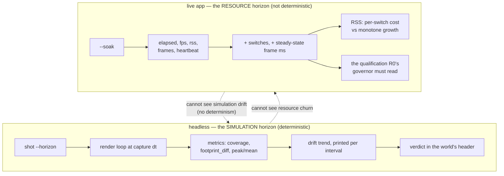

# 0085 — the show-length horizon gets an instrument

> **Status:** done (2026-08-15)
> **Created:** 2026-08-13
> **Owner skill(s):** dev, human
> **Related ADRs:** [ADR-0099](../../adrs/0099-the-show-length-horizon-is-a-spot-check-and-it-splits-in-two.md)
> **Closes:** [design-backlog 0082](../../design-backlog-archive.md), [design-backlog 0086](../../design-backlog-archive.md).
> **[design-backlog 0083](../../design-backlog.md) is HALF discharged** — the `switches` column it
> needs exists (Phase 3); the three paired runs it asks for are Phase 5 and have not been made, so
> that entry stays live.

## Close (2026-08-15)

Four `dev` phases, four commits: `3280136` (Phase 1, the horizon mode), `a1e62e5` (Phase 2, the
first subjects), `97b7227` (Phase 3, the soak columns), `9514e2b` (Phase 4, the governor's
qualification). **Phase 5 is `human` and deliberately outstanding** — it needs the live app on a
real machine for real minutes and, as this plan's own risk section says, it gates nothing; it
carries forward under Standing in [`docs/plans/README.md`](../README.md).

Mode 4 verdict: **no blockers, one major, three minors, one nit.** The major is not against this
implementation — it is the pre-existing headless-capture frame ceiling Phase 2 surfaced, filed as
[backlog 0093](../../design-backlog.md) with a candidate mechanism. Verified at the close: `fmt`
clean, `clippy --workspace --all-targets -D warnings` clean, `check-doc-links.mjs` exit 0, and the
21 tests this plan added or touched green on this box's hardware adapter.

**Three corrections this plan made to its own premises, all recorded rather than absorbed.**
`metrics::peak_to_mean` did not exist, despite ADR-0099 naming it an existing instrument — built in
Phase 1 and recorded in that ADR's `Outcome`. R0's governor is *not* unbuilt (Plan 0044 / ADR-0045,
2026-07-30) and the shipped one **never reads p99**, so the hazard lives in the description rather
than the code — corrected in `nfr.md`, this README's roadmap item 3, and `roadmap-visual-richness.md`
by Phase 4, and in backlog 0082 at this close. And Phase 3's own done-when was unsatisfiable as
written: it asked for "the two frame-time columns diverging" from a log that carried **no** `p99`
column at all, so three columns were appended rather than two.

## TL;DR

Everything this project measures happens in the first seconds of a preset's life; the live-show use
case runs for hours. Three observations have already landed in that gap — a world that collapsed
live three times while the suite stayed green, RSS growing 385 → 663 MB with no control beside it,
and a `frame_ms_p99` of 25 ms on preset switches that the unbuilt quality governor is specified to
read. This plan builds the two spot-check instruments ADR-0099 splits them into: a headless
simulation horizon in `shot`, and a preset-switch marker in the live `--soak` log. Neither is a gate.

## Context & problem

The four synthesized behavioral gates capture 30 frames at 1/60 s — **half a second**. The
PCM-driven reactivity gate measures a few seconds of hops. That is the whole of this repo's
temporal coverage, and three separate lanes have now walked into what it misses.

**Simulation drift.** Plan 0075 cohort 4's Shatter world piled onto its flow field's attractors
under minutes of sustained force and stayed there — three live collapses, and the suite green
throughout. The class is real and general: accumulating forces, feedback with net gain, populations
that migrate. Plan 0077 shipped the swarm a `reseed` as the recovery lever, and honoured the
caveat rather than waving it through — that plan's Phase 5 explicitly owes **one minutes-horizon
observation**, and there is no instrument to make it with.

**Resource drift.** Over three minutes of preset switching at Rich tier, 1080p, resident set grew
**385 → 663 MB** against ADR-0010's ~327 MB driver floor. Three minutes is short, the run switched
presets repeatedly (each switch builds a side's GPU resources), and Plan 0046 added two accumulation
buffers, so *some* growth is expected. **It was never measured against a no-feedback control**, so
nothing separates expected cost from growth that does not stop — and R6's feedback content now
ships, into a use case that runs for hours.

**The instrument the governor will read.** In the same run: fps median 165.0, minimum 114.3, **zero
of 158 rows below the NFR §1 60 fps floor, zero of 28,698 frames dropped** — and `frame_ms_p99`
peaking at **25.037 ms** while `frame_ms_avg` never passed 8.749. The spikes coincide with preset
switches and a fullscreen toggle: GPU resource rebuilds, not steady-state cost. The adaptive-quality
governor (roadmap item 3 / R0) is specified to read p99, so as things stand it would demote a preset
running at 165 fps, during the one event that is already visually disruptive.

The existing `--soak` mode (Plan 0009) samples elapsed / fps / RSS / frames / heartbeat every five
seconds. It has no notion of a preset switch, which is exactly the axis all three of these questions
turn on.

## Decision

Per [ADR-0099](../../adrs/0099-the-show-length-horizon-is-a-spot-check-and-it-splits-in-two.md), build
**two** spot-check instruments rather than one harness, because the failures do not share a
mechanism: simulation drift is deterministic and reproducible headless (injected `dt` since
ADR-0019 / Plan 0014), while RSS growth and p99 spikes come from live GPU resource churn that no
headless loop reproduces.

- `shot` grows a long-run mode reporting **image-domain drift statistics at intervals** over N
  simulated minutes, reusing `metrics`'s existing coverage / footprint / peak-to-mean instruments.
- `--soak` gains a **preset-switch marker** and a steady-state frame-time statistic beside `p99`.

We rejected making either a gate (measured cost — the reactivity gate's move to real PCM cost 1.8x
over 41 presets, and this is orders beyond) and rejected one combined harness (it would be blind to
two of the three entries whichever way it was built).

## Architecture diagram



## Implementation phases

### Phase 1 — `shot` renders a horizon and reports drift

- **Owner skill:** dev
- **What:** a long-run mode — N simulated minutes at capture cadence — that renders continuously and
  emits one statistics row per interval rather than one image per frame. The statistics are the
  existing ones: scene coverage, `metrics::footprint_diff` against the previous interval, and a
  peak-to-mean luminance ratio (the direct reading of "the population piled onto a few attractors").
  Output is a table plus the JSON shape `--report` already uses.
- **Files touched:** `standalone/src/shot/`, `docs/capturing.md`.
- **Done when:** running it on a world with a known accumulation axis prints a monotone trend in at
  least one statistic while a **static control world prints a flat one** — the non-vacuity half, and
  the thing that distinguishes an instrument from a number generator. Two determinism properties are
  asserted rather than assumed: the same world at the same horizon produces **identical** statistics
  across two runs, and the statistics at interval *k* do not depend on the horizon requested (a
  10-minute run's first interval equals a 2-minute run's first interval). Peak memory and wall clock
  are **reported, naming the machine** ([ADR-0071](../../adrs/0071-a-numeric-test-contract-states-a-property-or-names-its-machine.md)),
  not asserted.

### Phase 2 — the horizon has a first subject

- **Owner skill:** dev
- **What:** run Phase 1's mode over the worlds whose mechanism has an accumulation axis and record
  what it finds. The obvious roster is `swarm_shatter` (the world whose collapse raised the entry),
  `swarm_drift`, and the `trails`-heavy feedback worlds Plan 0046 enabled.
- **Files touched:** none in `core/`; the output is a table in the plan's phase commit and, where a
  world drifts, a note in that world's header.
- **Done when:** every world in the roster has a recorded trend over the same horizon, and the
  runtime cost per world is stated. **Finding nothing is the expected outcome and a successful one**
  — Shatter was already rebuilt at engine-default dynamics and Plan 0077 gave the swarm its `reseed`,
  so the known instance may well be repaired. What must not happen is the instrument shipping with
  no world ever having been through it.

### Phase 3 — `--soak` learns what a preset switch is

- **Owner skill:** dev
- **What:** one appended `switches` column (a monotone counter of preset changes and surface
  reconfigures since session start) and one appended steady-state frame-time column — the same p99
  statistic computed over a window that **excludes** frames following a switch or reconfigure. The
  existing five columns and the five-second cadence do not move.
- **Files touched:** `standalone/src/soak.rs`, `standalone/src/main.rs`, `docs/nfr.md` if it states
  the soak log's shape.
- **Done when:** a session in which presets are switched shows the counter climbing and shows the two
  frame-time columns **diverging across a switch and agreeing during steady state** — which is the
  whole claim, and it fails if the exclusion window is wrong in either direction. The per-frame cost
  stays what it is today: a comparison that returns immediately, with the write on the coarse tick
  and nothing new on the per-frame path. Nothing touches the audio callback.

### Phase 4 — the governor's qualification is written down where R0 will read it

- **Owner skill:** dev
- **What:** record, beside the roadmap item and the NFR that names the frame budget, that
  `frame_ms_p99` spikes on resource rebuilds while nothing is dropped, that the measured case is
  25.037 ms p99 against 8.749 ms avg and zero drops in 28,698 frames, and that the new steady-state
  column exists for exactly this reason. Name [backlog 0082](../../design-backlog-archive.md)'s three candidate
  responses without choosing between them — that choice is R0's.
- **Files touched:** `docs/nfr.md`, `docs/plans/README.md`'s roadmap item 3,
  `docs/roadmap-visual-richness.md` if it carries R0's description.
- **Done when:** a reader designing the governor meets the qualification before they meet the column,
  and `node scripts/check-doc-links.mjs` exits 0.

### Phase 5 — the paired RSS runs

- **Owner skill:** human
- **What:** the measurement [backlog 0083](../../design-backlog.md) asks for, which needs the live app
  on a real machine for a real duration. Three runs, all with `--soak`:
  1. feedback presets, switching, matched length;
  2. a **no-feedback control**, same length, same switching cadence;
  3. one longer run (tens of minutes) with **no switching at all**.
  Runs 1 and 2 separate "cost of what Plan 0046 landed" from "growth that does not stop"; run 3
  separates per-switch cost from monotone growth, which the new `switches` column now makes readable
  directly.
- **Done when:** the three RSS traces are recorded with their durations and switch counts, and the
  entry is answered in one of two directions: the control also climbs (there is something to fix, and
  it gets its own plan) or it does not (the growth is per-switch and bounded, which closes the entry).
  **Either answer closes it** — the entry's complaint is the missing control, not the number.

## Data shapes

```rust
// illustrative — not the final interface
/// One interval of a headless horizon run.
struct HorizonSample {
    elapsed_secs: f32,      // SIMULATED time, from injected dt — not wall clock
    coverage: f32,          // lit fraction of the scene, ADR-0067 semantics
    footprint_diff: f32,    // motion over the figure's own footprint vs the previous interval
    peak_to_mean: f32,      // concentration: has the population piled up?
}
```

The `--soak` additions are two appended columns on the existing tab-separated row —
`switches` (monotone `u64`) and `frame_ms_p99_steady` — following the same append-never-interleave
rule `diagnostics.log` states for its own frozen prefix.

## Risks & open questions

- **An image-domain statistic is a proxy for the thing that drifts.** Shatter's failure is particles
  piling onto attractors; what a capture sees is coverage falling and peak-to-mean rising. The
  correlation is strong and is not identity, so the mode reports a **trend** rather than asserting a
  threshold — and Phase 1's flat control is what stops the proxy being read as a measurement of the
  simulation itself.
- **The horizon mode is slow by construction** — 3,600 renders per simulated minute. That is
  acceptable for a spot-check and is a reason nobody will run it casually, which is the cost of
  ADR-0099 refusing a gate. Phase 2 states the real per-world figure so the lane can budget a sitting.
- **The steady-state exclusion window is a judgement with no obvious right value.** Too short and it
  keeps the rebuild spike it exists to exclude; too long and it hides genuine sustained cost. Phase 3
  asserts the *behaviour* (diverge across a switch, agree in steady state) rather than the constant,
  and the constant states its derivation.
- **Phase 5 needs a real machine for real minutes and cannot be done in CI.** It gates nothing —
  Phases 1–4 stand alone — so if it slips it carries forward as a standing item rather than holding
  the plan open.
- **A horizon run could expose a defect this plan is not scoped to fix.** If Phase 2 convicts a
  shipped world, the repair is content-lane work or its own plan; this plan records the finding.

## What this plan does NOT do

- **It does not add a gate, and must not become one.** ADR-0099's Alternative A is rejected on
  measured cost; nothing here runs in CI or fails a build.
- **It does not build the quality governor.** R0 is a separate, larger piece of work. Phase 4 writes
  down the qualification so R0's design starts from it; it does not pre-empt R0's choice among the
  three candidate responses.
- **It does not fix any RSS growth.** Phase 5 is a measurement, deliberately. Only if the control run
  also climbs is there something to fix, and that is a different plan.
- **It does not re-tune `swarm_shatter` or any world.** Judging a look is content work and stays in
  the `preset-author` lane.

## Followups (after this lands)

- The trigger for the headless horizon belongs in the content lane's own materials, since a duty with
  no stated trigger is one this project has evidence gets skipped. Its first named subject already
  exists: Plan 0077's standing Phase 5 rider.
- If the control run in Phase 5 climbs, the leak hunt is its own plan and starts from ADR-0010's
  floor and Plan 0012's measuring stick.
