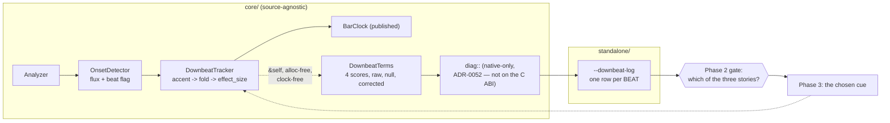

# 0086 — the downbeat finds a cue that is not the kick

> **Status:** done (2026-08-15) — **closed at Phase 2, by its own gate.** Phase 1 landed
> (`52dac85`, plus instrument follow-up `50ab2a1`); Phase 2 ran on three genres and its verdict
> named a defect **upstream** of every cue on the shortlist, so Phases 3-5 are superseded by
> [Plan 0095](../0095-the-downbeat-fold-gets-a-musical-beat.md) and
> [ADR-0109](../../adrs/0109-the-beat-clock-counts-onsets-not-beats.md) rather than executed here.
> See `Outcome` at the foot of this file. This is the outcome ADR-0097 was written to make
> possible, not a failed plan.
> **Created:** 2026-08-13
> **Owner skill(s):** dev, human
> **Related ADRs:** [ADR-0097](../../adrs/0097-the-downbeat-cue-is-chosen-against-per-beat-evidence.md),
> supplementing [ADR-0050](../../adrs/0050-downbeat-and-phrase-tracking-with-confidence-fallback.md) and
> [ADR-0082](../../adrs/0082-the-downbeat-gate-holds-and-the-estimator-is-diagnosed-first.md)
> **Closes:** [design-backlog 0042](../../design-backlog.md)'s open half

## TL;DR

The downbeat estimator publishes on 6 % of audible time, and on backbeat rock/pop it is 0.14 % — one
locked row in 727. Plan 0068 named the cause (the accent is 70 % bass, and a kick marks the half-bar
in a backbeat rather than the bar) and stopped there on purpose. This plan takes the repair, but it
**measures before it chooses**: ADR-0082's own `Outcome` records that the 1 Hz log carries band
levels, not per-beat accents, so the named cause is an inference. Phase 1 builds the per-beat
decomposition capture, Phase 2 runs it on real material, and the cue is picked at that gate from a
ranked shortlist.

## Context & problem

[Plan 0068](0068-why-the-downbeat-rarely-locks.md) measured 98 minutes of unambiguous 4/4
through the live app on `v0.48.0` — 5,900 audible rows, **352 locked, 6.0 %**. Split by genre:

| material | rows | locked | rate |
|---|---|---|---|
| four-on-the-floor techno | 5,173 | 351 | **6.79 %** |
| backbeat rock/pop | 727 | 1 | **0.14 %** |

Backbeat is **48x worse**, which is the opposite of the intuition and is what names the cause.
`BASS_WEIGHT = 0.7` (`core/src/dsp/downbeat.rs:71`) makes the accent chiefly a kick detector; a kick
marks every beat in four-on-the-floor and the half-bar in a backbeat, so it hardly ever marks the
**bar**. Peak confidence over the entire backbeat set was 0.2664 against the `0.25` gate — one row.

The practical consequence for content: `beat_in_bar`, `bar_index` and `bar_phase` are, in practice,
counters. `presets/README.md` and `docs/presets.md` now say so, which closed the authoring half and
left the capability where it was.

**And the cause was inferred.** ADR-0082 is explicit: the 1 Hz log records **band levels, not
per-beat accents**, so what exists is a ladder match plus a construction argument — the genre split
is exactly what a bass-dominant accent predicts — and *not* a measurement of the four alignment
scores on real audio. At least three different failures fit that same evidence:

- **The accent is too narrow.** A backbeat's information is the snare on 2 and 4; the accent never
  sees it. → a second accent band.
- **The accent is fine and the pattern is degenerate.** A kick on 1 and 3 is 2-periodic, so
  alignments 0 and 2 score alike and the fold is choosing between two equally good answers rather
  than failing to find one. → a cue that breaks the two-fold tie, which a second *percussive* band
  may not, since a snare on 2 and 4 is the same ambiguity phase-shifted.
- **The evidence window is thin.** `ACCENT_HISTORY = 32` is eight bars, eight observations per
  alignment. → a constant, not a feature.

`DownbeatTerms` (`downbeat.rs:110`) separates all three in one reading — the four `scores`,
`effect_raw` against `null_share`, `beats_seen`. Plan 0068 built it for exactly this and **nothing
outside the tests has ever called it.**

## Decision

Per [ADR-0097](../../adrs/0097-the-downbeat-cue-is-chosen-against-per-beat-evidence.md): capture the
per-beat decomposition on real backbeat material and a four-on-the-floor control, then choose the
cue at a `human` gate from a ranked shortlist — a second accent band, a harmonic-change cue, a
longer history, or a combination the data suggests. A candidate refused by the measurement is a
**recorded outcome**, in the shape Plan 0079 used for its morph paths.

`CONFIDENCE_THRESHOLD` does not move. ADR-0082 refused to adjust a safety gate using data collected
while the gate was shut, and that reasoning is untouched: if the gate moves at all it moves *after*
the estimator improves.

We rejected building the second accent band immediately (it commits to one of three failures that
fit the same evidence, and if the true defect is the degeneracy it adds a second 2-periodic signal)
and rejected opening with the harmonic-change cue (new DSP on the sacred path, whose cost wants
justifying by measurement first).

## Architecture diagram



## Implementation phases

### Phase 1 — the decomposition becomes observable per beat

- **Owner skill:** dev
- **What:** a `--downbeat-log <path>` mode on the standalone writing **one tab-separated row per
  detected beat** — beat index, the four alignment `scores`, `best`, `held`, `effect_raw`,
  `null_share`, `effect_corrected`, `beats_seen`, `locked`, and the four band levels for context.
  Off by default, like `--soak`: with the flag absent there is no logger and the loop is unchanged.
  `DownbeatTerms` reaches the shell through `lmv_core::diag`, which is **native-only** by
  [ADR-0052](../../adrs/0052-analysis-diagnostics-are-native-only.md) — **no C ABI change, and the
  `LMV_ABI_VERSION` does not move.**
- **Files touched:** `core/src/diag.rs`, `core/src/dsp/mod.rs` (accessor only),
  `standalone/src/main.rs`, a new `standalone/src/downbeatlog.rs`, `docs/capturing.md`.
- **Done when:** the estimator is **provably unchanged by being observed** — `terms()` stays `&self`,
  allocation-free and clock-free, and its `to_bits()` equality against the published
  `BarClock::confidence` is asserted on every case the existing suite covers, which is the property
  Plan 0068 already established and this phase must not break. Rows are written only on a beat, off
  the audio callback, on the thread that already consumes `AnalysisFrame`. A synthesized 4/4 pattern
  through the real analyzer produces rows whose `scores` favour the alignment the pattern was built
  with — the non-vacuity check, and it is what proves the log is wired to the estimator rather than
  to a default.

### Phase 2 — the measurement, and the gate

- **Owner skill:** human
- **What:** run the log on **backbeat rock/pop** and on a **four-on-the-floor control**, matched in
  duration, on the user's own material — the same material class Plan 0068 used, so the result is
  comparable to its 6.79 % / 0.14 % baseline. Then read the decomposition and decide.
- **Done when:** a table exists showing, per genre, the distribution of the four `scores`,
  `effect_raw`, `null_share` and `effect_corrected`, and the verdict names **which of the three
  stories the data tells**:
  - *scores flat, effect_raw low* → the accent carries no bar-scale structure → the accent feature;
  - *two scores tied and high, the other two low* → the 2-periodic degeneracy → a cue independent of
    the drum pattern;
  - *effect_raw healthy but effect_corrected near zero* → the noise correction is eating a real
    effect at this history length → the window or the measure.

  The cue for Phase 3 is chosen here, from that reading. **A reading that simply confirms the
  inferred cause is a successful outcome** — it converts an argument into evidence, which is the
  whole reason ADR-0097 spends a phase on it.

### Phase 3 — the chosen cue lands

- **Owner skill:** dev
- **What:** implement the cue Phase 2 named, inside `core/src/dsp/downbeat.rs` (and `onset.rs` if the
  cue needs a band the flux does not already produce).
- **Files touched:** `core/src/dsp/downbeat.rs`, possibly `core/src/dsp/onset.rs`,
  `core/src/dsp/mod.rs`.
- **Done when:** the hot-path contract is intact and asserted, not argued — the module keeps its
  panic-denial pragma, the estimator stays **allocation-free after construction** and **clock-free**,
  and its state remains fixed arrays. Determinism holds: the same window produces the same accent,
  pinned by a test that feeds one buffer twice. The synthesized patterns in the module's existing
  tests still classify correctly — **including the unaccented click train, which must still score
  near zero**, because a cue that raises confidence on material with no bar structure has not
  improved the estimator, it has broken the gate's meaning. `CONFIDENCE_THRESHOLD` is unchanged, and
  a test asserts the constant rather than trusting the diff.

### Phase 4 — re-measure through the same instrument

- **Owner skill:** human
- **What:** re-run Phase 2's capture on the same material with the cue in place, and report the lock
  rate beside the 6.79 % / 0.14 % baseline. **And watch for the thing that has never been
  observable:** ADR-0050 exists because a confidently-wrong beat 1 is the failure an author cannot
  work around, and both prior measurements ran with the gate shut ~94 % of the time, so there was
  little opportunity to see one. A cue that raises the lock rate materially *creates* the first real
  chance to test it.
- **Done when:** the new rate is recorded per genre against the baseline, and the mis-accent question
  has an observation rather than a silence — either "no confidently-wrong bar line was heard over N
  minutes at the new rate" or a described instance. **An improvement that does not rescue the
  backbeat case is a recorded outcome**, and it goes into ADR-0097's `Outcome` as what the
  measurement bought; it is not a failed phase.

### Phase 5 — the authoring docs stop hedging, if the measurement earns it

- **Owner skill:** dev
- **What:** `presets/README.md` and `docs/presets.md` currently state the measured rate and mark
  layer 2 (`beat_in_bar` / `bar_index` / `bar_phase`) decorative. Update them to whatever Phase 4
  measured — including leaving the hedge **in place, with a new number**, if that is what the data
  says.
- **Files touched:** `presets/README.md`, `docs/presets.md`, and
  `.claude/skills/preset-author/references/` if its tables name the bar variables.
- **Done when:** no doc states a lock rate that is no longer the measured one, and the content lane's
  own references agree with the operator docs — the minor raised at four consecutive plan closes, and
  load-bearing here because a preset author choosing between layer 1 and layer 2 reads exactly these.

## Data shapes

`DownbeatTerms` already exists and is not changed by this plan (`core/src/dsp/downbeat.rs:110`) —
four `scores`, `best`, `held`, `effect_raw`, `null_share`, `effect_corrected`, `beats_seen`,
`locked`. Phase 1 exposes it; Phase 3 changes what feeds it.

```text
# illustrative — one row per detected beat
beat  s0      s1      s2      s3      best held raw    null   corr   seen locked  bass   mid    treb   onset
412   0.7314  0.2201  0.7108  0.1994  0    0    0.5512 0.0930 0.4582 32   1       0.812  0.334  0.201  0.774
```

The row above is the **degenerate** case drawn deliberately: `s0` and `s2` tied and high is what a
kick on 1 and 3 looks like, and it is the reading that would send this plan at a harmonic cue rather
than a second percussive band.

## Risks & open questions

- **The measurement may not separate the three stories cleanly.** Real material is not one pattern,
  and a mixed set could produce a smeared distribution that supports no verdict. Mitigation is in
  Phase 2's design: matched-duration runs on *deliberately unambiguous* material of each kind, which
  is exactly how Plan 0068 got a usable genre split out of a half-and-half session.
- **A cue that helps backbeat could hurt four-on-the-floor.** The control run exists for this, and
  Phase 4 reports both genres. A net-negative change on the material that currently works is a reason
  to refuse the cue, not to average the two.
- **New DSP on the sacred path is where real-time bugs live.** If Phase 2 picks the harmonic-change
  cue, Phase 3 grows history buffers and per-hop work on the analysis path. The pragma, the
  fixed-array state and the determinism test are the guard, and the NFR §6 window budget is the
  ceiling — if the cue does not fit it, that is a finding and the shortlist's next entry is taken.
- **`--downbeat-log` writes on a beat, which is bursty.** At ~2 Hz for 120 BPM it is far coarser than
  the 1 Hz diagnostics writer's worst case, but it is event-paced rather than clock-paced, so a
  double-time detection could double it. It is off by default and on the render thread; the audio
  callback is untouched either way.
- **Phase 2 and Phase 4 need the user and their own music.** Neither is reproducible in CI, and that
  is inherent — a synthesized backbeat is a hypothesis about backbeats, which is what
  `downbeat.rs`'s existing tests already are and precisely what cannot settle this.

## What this plan does NOT do

- **It does not move `CONFIDENCE_THRESHOLD`, `SWITCH_MARGIN` or `HYSTERESIS_BEATS`.** ADR-0082's
  refusal stands; the gate keeps its meaning while the estimator changes underneath it.
- **It does not support meters other than 4/4.** ADR-0050 assumes it and documents it; a different
  meter still falls back to the counters rather than mis-accenting.
- **It does not put `confidence` or the decomposition into the expression grammar.** They are
  diagnostics by ADR-0050's explicit choice — authors get behaviour, not homework.
- **It does not touch the C ABI.** Analysis diagnostics are native-only (ADR-0052), so
  `LMV_ABI_VERSION` does not move.
- **It does not re-tune any preset onto the bar variables.** If Phase 4 earns it, that is content
  work and it is the `preset-author` lane's.

## Followups (after this lands)

- If the lock rate rises materially, the mis-accent question ADR-0050 guards becomes testable for the
  first time — and *that* is the evidence a future decision about `CONFIDENCE_THRESHOLD` would need.
- Phrase-level structure (8/16-bar arcs) is the capability the bar clock was always a step toward,
  and it is unreachable while layer 2 is fallback. It becomes a real question only after this.

## Outcome (2026-08-15)

**Phase 1 landed** (`52dac85`): `--downbeat-log` writes one row per detected beat, the estimator
is provably unchanged by being observed, and no C ABI moved. A **follow-up commit** (`50ab2a1`)
appended `bpm`, `time_since_beat` and `unix_ms` after the first two captures proved the reading
needed all three and the row carried none of them — the plan's own instrument was incomplete for
the phase it was built for, which is worth knowing before the next log is designed.

**Phase 2 ran** on three genres through the live app, 240 s each, on the user's own material.

| | techno ~130 | instrumental hip-hop | backbeat rock/pop | synthesized control |
|---|---|---|---|---|
| beats logged / 240 s | 899 | 756 | 705 | 48 / 48 built |
| **detections per musical beat** | **1.73x** | 1.35x-2.10x | **1.76x** | **1.00** |
| per-row ratio p10 / med / p90 | 0.99 / 2.03 / 4.83 | 0.68 / 1.95 / 3.67 | 0.95 / 1.92 / 4.43 | — |
| publish (`locked`) rate | 2.89 % | 1.59 % | 2.27 % | locks |
| `effect_raw` med | 0.0540 | 0.0816 | 0.0684 | — |
| `null_share` | 0.0968 const | 0.0968 const | 0.0968 const | — |
| `effect_corrected` med | **0.0000** | **0.0000** | **0.0000** | — |
| correction keeps | 10.3 % | 16.8 % | 12.7 % | — |
| sorted score profile | .613/.577/.548/.516 | .492/.430/.381/.332 | .718/.684/.642/.592 | — |
| top-2nd / 2nd-3rd (norm.) | .051 / .040 | .110 / .093 | **.040 / .043** | — |
| `best` == `held` | 37.2 % | 49.9 % | **23.3 %** | — |

**The verdict named none of the three stories, and a fourth.** `beat_index` counts
onset-detector events, not musical beats (`tempo.rs:122` / `tempo.rs:107-110` /
`onset.rs:70-73`), so `beat_index % 4` spans well under a bar at a ratio that is not a stable
integer within a track — a bar-locked accent precesses across all four alignments. That single
fact predicts the flat ladder, the modest `effect_raw`, the zero median corrected effect and the
1.6-2.9 % publish rate on all three genres, and it is **upstream of the accent feature**, so the
shortlist's leading entry could not have repaired it. Recorded as
[ADR-0109](../../adrs/0109-the-beat-clock-counts-onsets-not-beats.md); repaired by
[Plan 0095](../0095-the-downbeat-fold-gets-a-musical-beat.md).

**Three things the measurement did not settle, kept because they bound the claim:**

- **Plan 0068's 6.79 % / 0.14 % genre split did not reproduce.** All three genres landed in a
  narrow 1.6-2.9 % band and backbeat rock/pop was *not* the worst. Either the split needs
  material this set lacked, or the two statistics differ (0068 measured shares of audible 1 Hz
  rows; this measured shares of detected beats). n = 1 track per genre, 4 minutes each, against
  0068's 98 minutes.
- **ADR-0097's degeneracy story is not refuted**, and appears only where predicted: on backbeat
  rock/pop the top two alignments sit closer to each other than to the rest (top-2nd .040 below
  2nd-3rd .043), with `best` flipping on 17.0 % of beats. Weak, swamped by the fold-unit defect,
  present in the predicted direction — deferred, not discarded.
- **The hip-hop tempo is unresolved.** Ear says ~90, the estimator's median says 137.7, and the
  inter-detection gap histogram fits either. The ratio finding survives both readings (2.10x or
  1.35x), which is why it is recorded as a range.

**`CONFIDENCE_THRESHOLD` never moved**, as the plan promised.
