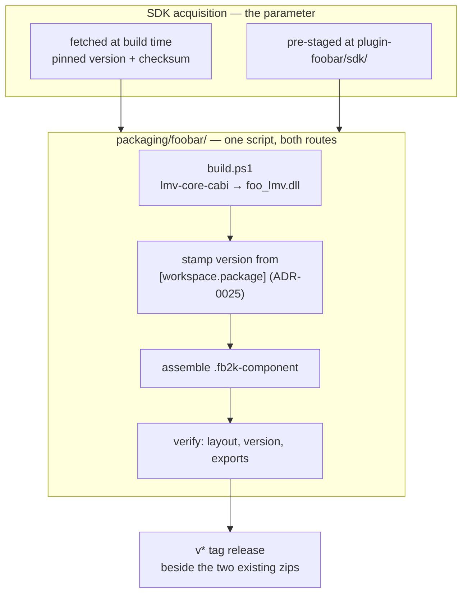

# 0102 — The component ships

> **Status:** done
> **Created:** 2026-08-16
> **Approved:** 2026-08-16 (user)
> **Closed:** 2026-08-16
> **Owner skill(s):** dev, human
> **Related ADRs:** [0115](../../adrs/0115-the-foobar-component-is-a-released-artifact-with-a-parameterized-sdk.md) (the foobar2000 component is a released artifact, and the SDK is a build parameter)

## Close (2026-08-16)

Phases 1-4 landed in three commits — `e5e03de` (the recipe), `07f1573` (the release job), `56c3edf`
(what a recipient reads). Phase 1's `human` answer was given in-session: the SDK licence is
BSD-style, permits binary redistribution, and puts a notice obligation only on redistributed
*source*, so Phase 3 took the **CI fetch** route. **Phase 5 is `human`, is the component's only
functional check, and is deliberately not run before the tag** — it tests the *released* artifact,
which does not exist until the tag this close writes is pushed. It is carried to
[`docs/on-device-validation.md`](../../on-device-validation.md), which is where everything CI cannot
run lives and which explicitly does not gate a close.

**Mode 4 verdict: no blockers, three majors, four minors.** The recipe was verified beyond reading
it: the pinned archive's SHA-256 was recomputed independently and matches `sdk-pin.ps1`; the
produced `.fb2k-component` holds exactly `x64/foo_lmv.dll` and nothing else; `target/dist` carries a
deliberate `v9.9.9` run beside the `v0.69.0` one, so the version-substitution path was exercised
rather than assumed; and every reader-facing claim in `READ-ME-FIRST.md` was checked against
`foo_lmv.cpp` (the View-menu command, `VK_SPACE`, `ui_element_subclass_playback_visualisation`, the
shared `%APPDATA%` folder, the `foo_lmv:` console prefix, the `0.0.0-dev` fallback the verify step
guards). All five phases carry one in-vocabulary owner tag; no Rust was touched, so the
source-agnostic core and the C ABI are untouched by construction.

**The majors, and what happened to each.** (1) The shipped troubleshooting text mis-diagnosed the
one first-run failure this project already has on file — [backlog 0102](../../design-backlog.md)
says a docked panel can render without presenting and revive only at a track boundary, with nothing
in the Console, and `READ-ME-FIRST.md` sent the reader to look for Console lines that will not be
there. **Fixed at this close**, along with a line for
[backlog 0103](../../design-backlog.md)'s undiscoverable layout-removal workaround. (2) Neither this
plan nor ADR-0115 names those two entries as distribution risks, though both are `Medium` and both
are the first thing a new plugin user meets; the plan's premise is reaching an audience, so they
belong on its risk register — **recorded here rather than back-edited into the ADR.** (3) On the
pre-staged SDK route the recipe stamps a version claim into a shipped document without checking what
is actually staged — filed as [backlog 0105](../../design-backlog.md) with the one-grep fix.

**What outlived the plan.** The component is now on the release critical path: `needs: [macos,
windows, foobar]` plus an exact three-zip count means a foobar-job failure produces *no release at
all*, standalone zips included. That is the correct trade and it raises the cost of the two minors
below.

## TL;DR

The foobar2000 component becomes a **released artifact**, versioned with the app and attached to
the same `v*` tag, built by one reproducible recipe in `packaging/foobar/`. A `human` phase reads
the SDK licence and decides whether the release workflow fetches the SDK or whether the recipe runs
locally; **both paths use the same script**, so the licence answer selects a route rather than
changing the design. This is the smallest real distribution win available to this project and it
has been one unread licence away for sixty plans.

## Context & problem

Half this architecture exists for the plugin. [ADR-0001](../../adrs/0001-rust-core-wgpu-cabi-foobar-shim.md)
chose a Rust core behind a C ABI *because* a C++ shim had to link it. There is a versioned
twelve-function ABI with a living spec, a conformance suite, a second coverage gate on
`lmv-core-cabi`, and a component version single-sourced from the workspace version
([ADR-0025](../../adrs/0025-foobar-component-version-single-sourced.md)). `plugin-foobar/build.ps1`
works today: it builds the C ABI staticlib, builds three SDK projects with MSBuild, links
`foo_lmv.dll` and can install it into a profile.

**No user can get it.** [NFR §8](../../nfr.md#8-distribution-v1) says so plainly — the SDK is
third-party, separately licensed and gitignored, so no runner can build the shim, and the component
"stays a local `plugin-foobar/build.ps1` artifact". That sentence honestly corrected an earlier
promise and then nothing moved.

The opportunity cost is the part worth stating. The foobar2000 component repository is a real
channel with a captive audience and **almost no competition in this category** — `foo_vis_milk2` is
the only serious visual component, `Shpeck` bridges twenty-year-old Winamp plugins, and everything
else is a spectrum readout. Meanwhile the half that *does* ship is an unsigned standalone `.exe`
that SmartScreen warns about, competing against a twenty-year content library. The plugin is the
weaker product in capability and much the stronger position in distribution, and it is the one
nobody can install.

## Decision

Per [ADR-0115](../../adrs/0115-the-foobar-component-is-a-released-artifact-with-a-parameterized-sdk.md):
the component ships, versioned with the app, from one recipe whose **SDK source is a parameter**
(fetched at build time, or pre-staged locally). We rejected **vendoring the SDK** (it is separately
licensed and was deliberately gitignored — a licence question resolved by ignoring it is not
resolved), a **self-hosted runner** (a personal workstation becomes release infrastructure, and a
permanent cost to answer a one-line licence question), **leaving it local** (the status quo being
fixed), and **bundling it into the Windows standalone zip** (different install mechanism, and both
sets of instructions get worse).

## Architecture diagram

## Implementation phases

### Phase 1 — read the licence

- **Owner skill:** human
- **What:** Read `plugin-foobar/sdk/sdk-license.txt` and the terms on the foobar2000 SDK download
  page, and answer one question: **may an automated build fetch and use the SDK, and may the
  resulting component be redistributed?**
- **Done when:** the user states the answer, and it selects Phase 3's route. If the answer is
  ambiguous, the ambiguous case is the manual route — this plan does not gamble on a reading of
  someone else's terms.

### Phase 2 — the recipe

- **Owner skill:** dev
- **What:** `packaging/foobar/` produces a versioned `.fb2k-component` from a pre-staged SDK,
  reproducibly, on the dev box.
- **Files touched:** `packaging/foobar/` (new), `plugin-foobar/build.ps1` (factor out the packaging
  step), `plugin-foobar/README.md`.
- **Notes for the implementer:** `packaging/macos/bundle.sh` is the model — **build, assemble,
  stamp, package, and verify**, so packaging runs the same on a developer's machine as in CI rather
  than being CI-only magic ([ADR-0038](../../adrs/0038-tag-driven-release-unsigned-universal-mac-app.md)).
  Pin the SDK release (**2025-03-07** today) rather than tracking latest: a component that silently
  rebuilt against a newer SDK is an untested change riding a version bump that says nothing about
  it.
- **Done when:** one command produces a `.fb2k-component` whose declared version equals the
  workspace version, and whose verify step fails loudly if the layout is wrong or the version was
  not substituted.

### Phase 3 — the route Phase 1 chose

- **Owner skill:** dev
- **What:** If fetching is permitted, `.github/workflows/release.yml` gains a Windows job that
  fetches the pinned SDK against a checksum, runs the Phase 2 recipe, and attaches the component to
  the tag. If it is not, `docs/releasing.md` gains the manual step and the recipe's output is
  attached by hand.
- **Files touched:** `.github/workflows/release.yml` **or** `docs/releasing.md`; `docs/nfr.md` §8
  either way.
- **Notes for the implementer:** editing `.github/workflows/*` needs a git credential carrying the
  `workflow` OAuth scope, or the push is rejected — `gh auth refresh -s workflow` is the fix.
- **Done when:** a `v*` tag produces three artifacts rather than two (or two plus a documented
  manual step), and **[NFR §8](../../nfr.md#8-distribution-v1)'s "CI does not ship a
  `.fb2k-component`" paragraph is corrected** — it is the authority on what a tag ships and it will
  be wrong the moment this lands.

### Phase 4 — what a recipient reads

- **Owner skill:** dev
- **What:** A `READ-ME-FIRST` for the component in the shape the two existing zips already carry:
  what it is, how to install it into foobar2000, which foobar2000 versions it targets, and that it
  is unsigned.
- **Files touched:** `packaging/foobar/READ-ME-FIRST.md`, `README.md`, `plugin-foobar/README.md`.
- **Done when:** a reader who has never seen this project can install the component from the zip
  without opening the repository.

### Phase 5 — it actually installs

- **Owner skill:** human
- **What:** Install the released artifact into a clean foobar2000 profile — not the dev profile
  `build.ps1 -Install` writes to — and play something.
- **Done when:** the component loads, reports the right version in foobar2000's component list,
  renders from `visualisation_stream`, and survives a track change and a preset switch. Record the
  result in [`docs/on-device-validation.md`](../../on-device-validation.md), which is where everything
  CI cannot run lives.

## Risks & open questions

- **Phase 1 may say no**, and the plan still completes — it lands on the manual route, which is
  strictly better than today. The plan is written so that answer is a branch rather than a failure.
- **A fetched SDK is a supply-chain input.** Pin the version and check the hash; a URL that changes
  its bytes is otherwise an untested component riding a routine release.
- **The component is unsigned**, like everything else here. Out of scope
  ([NFR §8](../../nfr.md#8-distribution-v1)).
- **Nothing in CI can test it.** No runner loads foobar2000, so Phase 5 is the only functional
  check and it is manual, exactly as the macOS path is.
- **Contention: none.** `packaging/`, `plugin-foobar/` and `docs/releasing.md` are touched by
  nothing on the roster. This runs in parallel with any other lane.

## What this plan does NOT do

- **No signing, no notarization, no installer.**
- **No submission to the foobar2000 component repository** — that is a separate, human, external
  process and it belongs with [Plan 0103](../0103-the-project-gets-an-audience.md).
- **No macOS plugin.** foobar2000's SDK is Windows-centric per ADR-0001, unchanged.
- **No C ABI change.**

## Followups (after this lands)

- Submit to the foobar2000 component repository ([Plan 0103](../0103-the-project-gets-an-audience.md)).
- Revisit whether the component's preset directory should be shared with the standalone app's, once
  real users have both installed.

### Added at the close (2026-08-16)

- **The SDK pin catches changed bytes, not staleness.** Nothing in this repository watches
  foobar2000's SDK changelog for a component-ABI break, and no runner can load foobar2000 to notice
  one. `sdk-pin.ps1`'s header names this honestly and lists the three guards that do exist, the
  third of which is "this comment". The SDK archive links
  <https://www.foobar2000.org/changelog-sdk>, so a scheduled job diffing that page is a concrete,
  small piece of work — and it is outside this plan.
- **`plugin-foobar/build.ps1:50` pins `/p:PlatformToolset=v143`** while the comment two lines above
  says "retargeted to the installed toolset". If GitHub's `windows-latest` image moves to a Visual
  Studio whose toolset differs, the `foobar` job fails at MSBuild — and since this close that fails
  the **whole** release, not just the component. Deriving the toolset from the `vswhere` result the
  script already computes is the fix.
- **A third copy of the `[workspace.package]` version regex survives** in
  `.github/workflows/release.yml`'s `windows` job. `packaging/foobar/lmv-version.ps1`'s own header
  names all three copies and this plan de-duplicated two of them; the workflow can dot-source the
  same function.
- **Neither this plan nor ADR-0115 names [backlog 0102](../../design-backlog.md) and
  [0103](../../design-backlog.md)** — a panel that attaches at 1x1 and looks broken until a track
  change, and a context menu that shadows foobar's layout-edit menu. Both are pre-existing, both are
  `Medium`, and both are what a stranger installing this artifact meets first. The shipped
  `READ-ME-FIRST.md` now names them; fixing them is separate work and it is the highest-value
  plugin work on the board now that the component actually ships.
