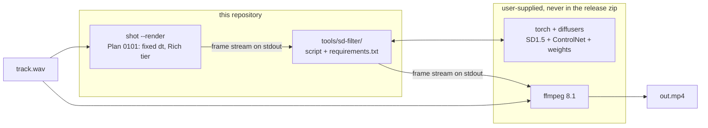

# 0106 — The frame stream passes through a diffusion model

> **Status:** done — closed 2026-08-25. All seven phases landed, including Phase 7's five items;
> the Phase 2 stop condition did not fire and Phase 6 returned a qualified yes. **Phase 2b chose
> `native`**, so the filter diffuses at the stream's own aspect and every square s/frame reading in
> the phase bodies below is superseded by Phase 7d's idle-GPU measurement. Mode 4 review at close:
> **no blockers, no majors**, four minors — two arithmetic slips repaired in
> `docs/diffusion-filter.md` at the close, the falsified `attractor_leviathan` figures in the Phase
> 6 log annotated, and this lane's ADR renumbered 0120 → **0122** to settle a same-day collision
> with `main`. Verified at close on the merged tree: 949 tests, `fmt`, `clippy`, all four Node
> gates, and the Python suite — with the colour pin and the figure gate each bitten and seen red.
> **Created:** 2026-08-16
> **Owner skill(s):** dev, human
> **Related ADRs:** [0122](../../adrs/0122-a-sidecar-tool-documents-itself-in-one-place.md) — written
> 2026-08-25, the documentation design pass; and
> [0121](../../adrs/0121-the-diffusion-filter-is-an-offline-stage-with-profiles-and-it-interpolates-its-own-stride.md)
> — the deferred ADR, written 2026-08-20 between Phases 2 and 3 against the spike's evidence exactly
> as Phase 2 said it would be
> **Hard dependency:** [0101](0101-the-engine-renders-a-music-video.md) Phases 1–2, for every
> phase except the spike. *(The transitive dependency on
> [0099](0099-the-horizon-reaches-its-own-length.md) for renders past ~2 minutes is
> **discharged** — it closed 2026-08-16 and the long-run path now completes.)*

## TL;DR

The offline render stream gains an optional **stdin→stdout diffusion filter**: attractors and
mandalas go in, and an img2img pass with ControlNet holding their geometry turns them into
material — a canyon, a cathedral rose window, a creature — while the shape keeps tracking the
music. The filter is a **Python script in `tools/`**, not a bundled runtime, so `lmv.exe` and the
release zip do not change at all. **Phase 1 is a throwaway spike and Phase 2 is a stop condition**:
nobody has yet seen what this engine's output looks like through a diffusion pass, and if it boils,
the plan ends there having cost an afternoon.

## Context & problem

The user asked for TouchDesigner-plus-TouchDiffusion: take this engine's abstract output and let a
diffusion model reimagine it. The architecture turned out to be nearly free, because
[Plan 0101](0101-the-engine-renders-a-music-video.md) /
[ADR-0114](../../adrs/0114-the-engine-renders-video-offline-and-delegates-encoding.md) already build
the pipe it needs: `shot --render clip.wav` walks a WAV at fixed injected `dt` and streams
self-describing frames to stdout for the user's own `ffmpeg`. **A diffusion stage is a filter
dropped in the middle of an existing pipe, and costs zero new Rust.**

So the architecture is not the risk. The picture is. Frame-independent img2img on moving abstract
content is notorious for **boiling** — a seething per-frame reinterpretation that reads as noise
rather than as a scene — and no amount of design removes that uncertainty. Two further unknowns
ride with it, and both are specific to this content rather than general:

- **An attractor is not a photograph.** It is thin bright filaments on dark ground. Canny edge
  detection on a filament produces a *double* edge, one line per side, so the model is conditioned
  on tubes where the render drew strands.
- **A mandala is radially symmetric, and diffusion is famously bad at preserving symmetry.**
  `star_rosewindow` either survives that or it does not, and the answer is not predictable from
  first principles.

The environment is measured rather than assumed (dev box, 2026-08-16): **RTX 3080 Laptop, 8 GB
VRAM**, driver 581.42, **Python 3.9.13**, **`ffmpeg` 8.1** already installed. That is comfortably
enough for SD1.5-class inference with ControlNet at fp16 (roughly 4–5 GB) and too tight for SDXL
plus ControlNet (roughly 7.5 GB) without offloading that would cost throughput over a
thousand-frame loop.

## Decision

The diffusion stage is an **out-of-process stdio filter** speaking Plan 0101's own frame format.
The repository ships a **script and a `requirements.txt`; no model, no weights, and no Python
runtime**, so [NFR §4](../../nfr.md#4-size-and-dependencies)'s ~10 MB soft cap is untouched and the
release artifact does not change. The AI stage **reimagines** rather than restyles — high denoise
with ControlNet holding the geometry — and **no audio data crosses the seam**: the image is the
whole signal.

We rejected **in-process Rust inference** (immature wgpu-native diffusion, no TensorRT path, and a
very large dependency against "lightweight is a feature"); **`shot` spawning and owning the
sidecar** (a three-process chain gives a broken pipe three candidate culprits, for ergonomics that
are one flag and a spawn to add later — it is a followup, not a rewrite); **the diffused frame
re-entering the renderer as a sampled texture** (genuinely the most interesting version, and it
needs a new `core` capability and its own ADR — it is the headline followup); and **publishing
frames to TouchDesigner over Spout** (gives away ownership of the loop, which the user explicitly
did not want).

## Architecture diagram



**`core/` does not appear in that diagram, and that is the point.** Nothing in this plan touches
the core, the C ABI, or `lmv.exe`.

## Implementation phases

### Phase 1 — the spike renders

- **Owner skill:** dev
- **What:** Produce the artifacts Phase 2 judges: a stills sweep and two or three short motion
  clips of a diffused attractor and a diffused mandala.
- **Files touched:** **none in the repository.** Everything lives under an untracked `spike/`.
  Note the `block-broad-git-add` hook will refuse a broad stage; do not add `spike/` to git.
- **Notes for the implementer:**

  **Frames come from tooling that already exists.** Plan 0101 is not built, so there is no stream
  yet — but `shot --frame-at <hop>` already writes one full-size frame under real audio *after the
  tonemap*, which is exactly one frame of what 0101 will stream. Loop it:

  ```powershell
  cargo run -p standalone --release --example shot -- `
    --preset-file presets/attractor_leviathan.toml --signal dynamic:110 `
    --frame-at $hop --size 768x768 --tier rich --out ("spike/frames/f{0:d4}.png" -f $i)
  ```

  Sixty frames at every third hop. The arithmetic: a hop is 512 samples at 48 kHz = 10.667 ms, so
  93.75 hops/s, so every third hop is **31.25 fps** and sixty frames is **1.92 s** — ample to see
  boiling. That quantization is precisely what 0101 Phase 1 removes; its note about the analysis
  hop and the frame rate being different clocks is this. `--signal dynamic:110` needs no asset and
  is the only synthesized kind with real dynamics. `--release` is not optional: this launches sixty
  processes and the cost is dominated by startup and shader compilation, not rendering — **expect
  10–15 minutes**, all of it an artifact of 0101 not existing yet.

  **Three subjects, because they fail differently:** `attractor_leviathan` (dense filaments, the
  hard ControlNet case), `star_rosewindow` (the radial-symmetry question), `attractor_ink`
  (black-on-white, inverted tonality, the easy control).

  **Models — SD1.5 class, not SDXL**, per the VRAM arithmetic above. `Lykon/dreamshaper-8` as the
  base: for reimagining into a scene a finetune is markedly better than stock SD1.5, which is the
  wrong default here. `lllyasviel/control_v11p_sd15_canny` to start, with `..._softedge` /
  `..._lineart` as the expected fallback for the double-edge problem named in Context.
  `StableDiffusionControlNetImg2ImgPipeline` is img2img and ControlNet in one call.

  **The coherence recipe is the design content of this phase.** Four lines, all load-bearing:

  ```python
  # illustrative — the algorithm, not the script
  for i, render in enumerate(frames):
      control = canny(render)                                            # STRUCTURE: this frame
      base    = render if i == 0 else lerp(render, prev_out, FEEDBACK)   # APPEARANCE: carried
      out     = pipe(prompt=PROMPT, image=base, control_image=control,
                     strength=STRENGTH, controlnet_conditioning_scale=CN,
                     num_inference_steps=STEPS,
                     generator=torch.Generator("cuda").manual_seed(SEED)).images[0]
      prev_out = out
  ```

  The control image comes from **this frame's render** and the img2img base carries the
  **previous output** — that split is the whole trick: geometry tracks the music frame by frame,
  material persists across frames. Taking the control from the previous output instead lets the
  shape drift off the audio. `SEED` is fixed for the entire render; a per-frame seed guarantees
  boiling whatever else is tuned.

  **Two passes, not twelve clips.** Stills cannot answer the boiling question and motion is too
  slow to sweep. Pass 1 (~1 minute): one mid-clip frame across `strength ∈ {0.45, 0.60, 0.75}` ×
  `cn_scale ∈ {0.6, 1.0}` × `control ∈ {canny, softedge}`, as one contact sheet. Pass 2
  (~5 minutes): all sixty frames through the two or three surviving cells, plus `FEEDBACK` at 0.0
  against 0.4 for the best one, assembled with `ffmpeg -r 31.25`.

  **Traps, each of which reads as "the model is bad" and is not:** in img2img the actual steps run
  are `steps × strength`, so `steps=4, strength=0.5` gives **two** steps and mud — use `steps=8`
  under LCM or `steps=20` without it. SD1.5 at 768² can duplicate or mirror content, which is its
  native-resolution artifact; drop to 512² rather than changing pipeline. Do not
  `enable_model_cpu_offload()` at 8 GB with SD1.5 — correct output, ruinous throughput over a
  thousand frames.

- **Done when:** a contact sheet and at least two motion clips exist, together with four measured
  numbers: **seconds per frame** at the chosen cell, **peak VRAM** during the run, the cell itself
  (strength, `cn_scale`, feedback, control type, prompt, steps, base model), and whether the
  radial symmetry of `star_rosewindow` survived. The timing figures quoted during the interview —
  roughly 0.1 s/frame for SD-Turbo at 512², 0.3 s/frame for SD1.5+LCM at 768² — are **rough
  estimates and unverified**; this phase replaces them with measurements, and every later phase's
  arithmetic is built on what it measures.

### Phase 2 — the look gate (STOP CONDITION)

- **Owner skill:** human
- **What:** Watch the clips and decide whether this is worth building.
- **Done when:** the user answers three questions. **Does it boil** — usable, usable only with
  feedback, or unusable? **Does the music still read** — after diffusion, does the visual still
  land on the beat, or has the AI stage flattened the dynamics into uniform busyness? And **is
  this something they would publish**?

  **If the answer to the first is "unusable" across every cell, the plan ends here** with a
  written diagnosis and nothing built. That is a good outcome for one afternoon, and it is the
  reason the spike precedes the architecture rather than sitting inside it.

  The second question is the one that is easy to forget and is the whole point of the application.
  A "no" there does not kill the plan; it **reopens the no-audio-conditioning decision**, and the
  repair would be denoise strength driven by the onset envelope — a protocol change carrying real
  data across the seam, not a tuning change. Phases 3–5 would need re-scoping before they start.

  **The ADR is written between this phase and the next**, by the architect, in a fresh session.
  The rejected alternatives are already enumerated in this plan's Decision; what they are missing
  is the evidence this phase produces, and an ADR written before it would be recording a guess as
  a decision.

### Phase 2b — the aspect measurement (GATE), added 2026-08-20

- **Owner skill:** dev
- **What:** Measure what a **16:9** frame costs and looks like through the banked cell, and ask the
  user which handling ships. Throwaway spike work under Phase 1's umbrella — same `spike/`, no
  repository file, no commitment.
- **Why this phase exists.** **Every measurement in this plan is square.** The spike rendered
  `--size 768x768`; the approved look, the 1.164 s/frame, the 2.7x for 768 and every `boil` figure
  are all square. The stream this filter actually sits in is **1920x1080**, and *Data shapes*
  promises the same geometry out. Nothing in this plan or
  [ADR-0121](../../adrs/0121-the-diffusion-filter-is-an-offline-stage-with-profiles-and-it-interpolates-its-own-stride.md)
  says how a 16:9 frame becomes a diffusion and comes back. That is the failure this repo has a rule
  about: **the configuration we measured at and the configuration we ship at disagree, and no
  measurement covers the disagreement.** SD1.5 is trained at 512 square and is known to degrade off
  it, so the answer is not derivable from what we have — it has to be looked at.
- **Notes for the implementer:** re-render one subject at `--size 1920x1080` (the same
  `shot --frame-at <hop>` loop Phase 1 used), then run the **same cell** — LCM 8 steps `cfg 2.0`,
  the same prompt, the same fixed seed, feedback 0.4 — three ways, ~120 frames each:
  1. **native non-square**, 1024x576;
  2. **square-then-stretch**, 768x768 diffused and stretched to 16:9 on the way out;
  3. **pad-then-crop**, letterboxed into 768x768, diffused, bars cropped off.

  Record **s/frame for each** — cost tracks pixel count, so arm 1 is not free and the existing
  timings do not transfer — and note where the model puts material in arm 3's bars. Report `boil`
  if it is cheap, but do not lean on it: it is only interpretable when the source is moving, and
  comparing across arms of **different geometry** is not the same-kind comparison
  [ADR-0074](../../adrs/0074-a-ratio-against-an-in-run-control-is-not-automatically-portable.md)
  requires. **The eye is the instrument here, as it was at Phase 2.**
- **Done when:** the three clips exist, their per-frame costs are recorded in the Implementation
  log with the machine named
  ([ADR-0071](../../adrs/0071-a-numeric-test-contract-states-a-property-or-names-its-machine.md)), and
  **the user has said which arm ships**, recorded as given. If the answer is anything other than
  square-then-stretch, the log gains a line saying that every s/frame figure above it was measured
  square and does not carry over.
- **What this gates, and what it does not.** It blocks **Phase 4 only**. Phase 3 is byte-identical
  pass-through with no model in it and does not care about aspect — it can land first, or
  alongside. Unlike Phase 2 this is **not a stop condition**: no outcome here ends the plan, it
  chooses between three ways of doing the same thing.

### Phase 3 — the pass-through stub

- **Owner skill:** dev
- **What:** `tools/sd-filter/` reads Plan 0101's frame stream on stdin and writes it unchanged to
  stdout, with **no model involved**.
- **Files touched:** `tools/sd-filter/` (new), `docs/capturing.md`.
- **Notes for the implementer:** **read 0101 Phase 1's stream-format note first.** It records a
  measurement against `ffmpeg` 8.1 that decides this phase's difficulty: the Y4M muxer accepts
  `yuv444p, yuv422p, yuv420p, yuv411p, gray8` and **errors on `rgb24`**, so a Y4M stream costs
  this filter a YUV round-trip, while NUT with `rawvideo` carries `rgb24` unconverted. Whichever
  0101 chose, this filter speaks it and does not invent a second format.
- **Done when:** `shot --render | sd-filter | <sink>` produces bytes **identical** to
  `shot --render | <sink>`. That is an exact property needing no tolerance, it proves the whole
  plumbing with no GPU and no weights, and it is **the one part of this feature that can be a real
  CI gate** — everything downstream of it is a model whose output is not reproducible across
  machines.

### Phase 4 — the filter does the work

- **Owner skill:** dev
- **What:** The stub grows the Phase 1 recipe at the Phase 2 cell, with strength, ControlNet
  weight, feedback blend, prompt, seed and control type as command-line configuration.
- **Files touched:** `tools/sd-filter/`, `docs/capturing.md`.
- **Notes for the implementer:** the model loads **once**, before the first frame, and the
  previous output is held across frames — this is a stateful stream filter, not a
  request/response service, and reloading per frame would dominate the runtime completely. Report
  progress on **stderr**, never stdout, which carries frames.
- **Done when:** a sixty-frame clip through the real pipe reproduces the Phase 1 result at the
  same cell, and two runs on this machine with the same seed and arguments produce the same
  bytes. **Same-machine only**, and the done-when says so on purpose: fp16 reduction order and
  cuDNN autotuning make cross-machine equality false, so per
  [ADR-0071](../../adrs/0071-a-numeric-test-contract-states-a-property-or-names-its-machine.md) this is a
  measurement that names its configuration rather than a property.
- **Amended 2026-08-20 by `architect`, after the Phase 2 gate, and carrying
  [ADR-0121](../../adrs/0121-the-diffusion-filter-is-an-offline-stage-with-profiles-and-it-interpolates-its-own-stride.md).**
  The gate approved a strided render, which the ADR resolves in favour of the frame-count contract.
  Three additions, and the phase stays one commit:
  - **`--stride N` emits N frames per N consumed.** The filter diffuses every Nth frame and fills
    the gap itself, so `frames in == frames out` still holds and the canonical `ffmpeg` command
    does not change. **Implement the held frame first** — repeat the diffused frame N times — because
    it needs no dependency and is a complete, shippable behaviour. Then render the same clip both
    ways and **ask the user**: the gate saw only the `minterpolate`-interpolated version and has
    never compared it against held, so which one ships is a `human` call, not `dev`'s. If
    interpolation wins, it is a new dependency and the ADR says `minterpolate` cannot be it.
  - **`--profile <name>` sets a known-good combination of the existing flags**, and any flag passed
    explicitly overrides it. The **expanded flag list is echoed on stderr** at the start of every
    run, so a render is reproducible from what ran rather than from a profile name whose meaning may
    have moved. Two profiles are enough to start: `quality` (**589,824 px**, the 20-step UniPC cell,
    feedback 0.6) and `fast` (**262,144 px**, the LCM 8-step `cfg 2.0` cell, stride 3).
  - **A profile names a pixel budget, not a side length — settled by Phase 2b, 2026-08-20.** The
    filter derives the diffusion geometry from the budget and the **incoming header**, rounding each
    axis to a multiple of 8, and never squashes or letterboxes. At 16:9 the quality budget is exactly
    **1024x576** and the fast budget is **680x384** (99.6 % of budget); the rule lands within 0.5 %
    at every aspect tried, so it needs no per-aspect table. **The fast budget is 262,144 px because
    that is the pixel count of the 512x512 cell the LCM ladder was measured at** — preserving the
    count preserves the measured cost, which a rounder-looking 512x288 would not. **`--size` therefore takes a pixel budget
    or a `WxH`**, and a `WxH` that disagrees with the stream's aspect is an error rather than a
    silent squash — the whole finding of Phase 2b is that squashing costs both look and throughput.
  - **Resolution is bought natively, not by upscaling**, and Phase 2b measured the price of the
    alternatives at an identical pixel count: native **2.721** s/frame delivering 100 % of its
    pixels, squashed-then-stretched 2.871 delivering 75 %, letterboxed 2.913 delivering 56 %. Native
    is both the cheapest and the most detailed, so no upscaler dependency is taken and none is
    tempting. ADR-0121's Alternative C still records the smaller-budget-plus-upscale route with its
    measurement intact, in case render cost later becomes binding.
  - **Done when**, in addition: `--stride N` is asserted to emit exactly as many frames as it
    consumed (an exact property, no tolerance, and it extends Phase 3's byte-count gate rather than
    replacing it); a profile's echoed expansion round-trips — passing the echoed flags without
    `--profile` produces the same bytes on this machine; and the held-versus-interpolated question
    has an answer from the user recorded in this log.

### Phase 5 — one command, and the documentation

- **Owner skill:** dev
- **What:** One canonical invocation end to end, and the setup written down.
- **Files touched:** `docs/capturing.md`, `tools/sd-filter/README.md`, `README.md`.
- **Notes for the implementer:** keep **exactly one** canonical command in `docs/capturing.md`, so
  there is one thing to fix rather than a wiki of incantations — the same posture 0101 Phase 2
  takes with `--ffmpeg`. State the prerequisites honestly: a CUDA GPU, a Python environment, and a
  first-run weight download of several gigabytes from Hugging Face.
- **Done when:** a reader who has never run this can go from a clean checkout to an MP4 by
  following `docs/capturing.md`, and the page states plainly that nothing here ships in the
  release zip.
- **Amended 2026-08-20 by `architect`, carrying
  [ADR-0121](../../adrs/0121-the-diffusion-filter-is-an-offline-stage-with-profiles-and-it-interpolates-its-own-stride.md).**
  Two additions, and the phase stays one commit:
  - **The canonical command does not change, and the page says so.** Because `--stride` preserves
    the frame count, the `ffmpeg` invocation carries no rate that has to agree with a flag on
    another process. That is the property worth writing down, not the command's text.
  - **Document the profiles as the thing a user types**, with the flag list each expands to, and
    state that the expansion is echoed on stderr on every run. Name the render cost honestly
    alongside them, from the measurements in the log: a 4-minute track at 30 fps is 7 200 frames,
    which is ~6.3 h at the 768 cell and ~2.1 h at `--stride 3` **on the machine those numbers were
    measured on** ([ADR-0071](../../adrs/0071-a-numeric-test-contract-states-a-property-or-names-its-machine.md)),
    not a portable figure.
  - **Done when**, in addition: `docs/capturing.md` names every profile and the flags it expands
    to, and states the measured cost with its configuration attached.

### Phase 6 — a real track

- **Owner skill:** human
- **What:** Render a full track with the chosen preset and cell, and watch it.
- **Done when:** the user says whether it is publishable. *(This done-when carried a two-minute
  ceiling — `shot --horizon` dying at ~3,601 frames — which **is gone**:
  [Plan 0099](0099-the-horizon-reaches-its-own-length.md) closed 2026-08-16, the wall was
  memory pressure from a capture path that never polled rather than a frame count, and the fix is
  one `poll` in `step_offscreen`. Track length is no longer a bound. **The one thing to carry
  forward:** a render mode that submits its own passes outside `step_offscreen` inherits the defect
  and none of the fix.)*

### Phase 7 — the gateable part actually gates, added 2026-08-24 by `architect`

- **Owner skill:** dev
- **What:** Five items from the Mode 4 close review, the Phase 6 render and the documentation
  design pass that followed — the test, gate, measurement and documentation surface. None changes what the filter draws; together they are the
  difference between a suite that passes *here* and a suite that means something *anywhere*,
  between a cost table that describes a render and one that describes a subroutine, and between
  a fact written once and the same fact written three times in three sets of words.
  **Order matters in one place: 7e before 7d**, so the figures are corrected in their new single
  home rather than three times in the old one.
- **Files touched:** `tools/sd-filter/test_sd_filter.py`, `tools/sd-filter/sd_filter.py`,
  `standalone/src/shot/render.rs` (one test), `.github/workflows/ci.yml`, `.githooks/pre-push`,
  `docs/capturing.md`, `README.md`, `tools/sd-filter/README.md`, `docs/diffusion-filter.md` (new),
  and one new `scripts/` gate.
- **Why this is a phase and not a followup:** Phase 3 called the pass-through *"the one part of
  this feature that can be a real CI gate"* and `docs/capturing.md` repeats it as shipped fact.
  Neither is true today — nothing runs the suite, and on any checkout but this one it would go
  red rather than green. A claim a document makes about its own gate is worth fixing inside the
  plan that made it.

**7a — the end-to-end group fails rather than skips on every checkout but this one.**
`test_sd_filter.py` reads `REPO/spike/clip.wav`. `spike/` is untracked *and not ignored*, and the
repository has **no tracked `.wav` at all**; the skip guard checks only for a built `shot`. So with
a built `shot` and no spike directory — the only configuration anyone else has, and this machine's
too once the lane's worktree is removed — `shot` exits non-zero, `check("shot exits 0")` fails and
the suite exits 1. **Synthesize the clip instead of guarding on it**: `wave` and `struct` are both
standard library, `--render` takes a WAV path and does not care what is in it (the property under
test is byte identity, not the picture), so a fraction of a second of any valid 48 kHz PCM makes
the group *run* everywhere rather than skip. That is strictly better than a second skip, and it is
what lets 7c mean anything. Keep the existing no-`shot` skip exactly as it is — it is correct, and
ADR-0016's printed notice is the right shape for it.

**7b — the YUV conversion is a second implementation of a `standalone/` function, and nothing
checks the pair.** `sd_filter.py`'s `yuv444_to_rgb` / `rgb_to_yuv444` invert
`standalone/src/shot/render.rs`'s `rgb_to_yuv` / `yuv_to_rgb` term for term — they agree today,
verified by reading both at the close, including plane order (Y, Cb, Cr) and clamp-not-wrap. But
the pass-through never converts and the diffused path is unassertable, so **no test in either
language touches the seam**: a constant edited on one side ships as a colour cast across every
frame, and no instrument in this repo would see it. Pin it with **one frozen table of RGB triples
asserted from both sides** — the same table in the Python suite and in a new `render.rs` test,
each carrying a comment naming the other as its twin. Include black, white, the three primaries,
the three secondaries, mid-grey and two saturated values whose chroma terms land outside `0..=255`,
since the clamp is the half most likely to be written differently in two languages.
**This is a property, not a measurement** ([ADR-0071](../../adrs/0071-a-numeric-test-contract-states-a-property-or-names-its-machine.md)):
the arithmetic is exact 8-bit integer output, identical on every machine, so the table is asserted
universally and names no configuration.

**7c — wire the suite into CI and the hook.** Add `python3 tools/sd-filter/test_sd_filter.py` to
the **`links` job** — it is `ubuntu-latest`, it already carries the three Node gates for exactly
this reason (cheap, platform-independent, cannot skip itself), and the suite is standard library
only. Add it to `.githooks/pre-push` behind a `command -v python3` guard, mirroring the `node`
guard three lines above it, with the same printed skip notice. **The `check` matrix is deliberately
not the home for this**: the end-to-end group's property is the same byte identity the in-process
group already asserts at four geometries against hostile payloads, and paying for it on three
build matrices buys the word "real" and nothing else.

**7e — the feature's documentation collapses to one page, and a gate keeps it there. Do this
BEFORE 7d.** Carries [ADR-0122](../../adrs/0122-a-sidecar-tool-documents-itself-in-one-place.md).
The filter is documented in three files, and profiles, `--size`, `--stride` and the check are each
written out **in full, in different words**, in both `docs/capturing.md` and
`tools/sd-filter/README.md` — so the copies cannot be diffed and disagree silently by construction.
The cost table exists in three places, which is how 7d's own file list missed one. Create
**`docs/diffusion-filter.md`** as the single canonical page and reduce the rest to pointers that
carry no facts: `docs/capturing.md` to ~12 lines keeping only the pipe-level fact (the encoder line
is invariant because `--stride` preserves the frame count), `tools/sd-filter/README.md` to install
plus a pointer, `README.md` to a paragraph, a link and **one** orientation figure. Then add the
gate — the canonical page wraps its figures in `<!-- figures:begin -->` / `<!-- figures:end -->` in
[ADR-0116](../../adrs/0116-an-index-row-is-a-pointer-and-a-gate-holds-it-to-one.md)'s idiom, and a new
`scripts/` check asserts **no other markdown naming `sd-filter` or `sd_filter.py` carries a cost
figure**, with `README.md`'s one line whitelisted and required to match inside the region. **Scope
the scan to files that name the filter**: `0.451` is also a curve value in ADR-0040, and a
units-only regex over `docs/` would convict it.
- **Done when (7e):**
  - `docs/diffusion-filter.md` exists and is the only place profiles, `--size`, `--stride`, the
    check and the cost table are stated. The other three files state none of them.
  - The new gate is wired exactly where the other three are — `.githooks/pre-push` and the CI
    `links` job — and **fails on a seeded violation**: add a cost figure to
    `tools/sd-filter/README.md`, watch it go red, remove it. A gate never seen to fail is a comment.
  - `node scripts/check-doc-links.mjs` passes. **Then check the fragment anchors by hand** — that
    checker does not validate them, and `README.md` links
    `capturing.md#a-filter-stage-between-shot-and-the-encoder`, which this phase deletes.
  - `docs/capturing.md` is materially shorter than the 2 119 lines it starts at, and what remains of
    the filter in it is about the *pipe*, not about the filter.

**7d — the cost every document quotes is the diffusion call, not the render.** `DiffusionStage`
times `self.pipe(...)` alone; `_read`'s colour decode and downscale, `_emit`'s LANCZOS upscale back
to the stream's geometry and its RGB→YUV encode, and the gap crossfades all sit outside the timer.
`_emit` runs **per emitted frame**, so at stride 3 each anchor pays three full-resolution upscales
and three full-frame colour encodes that nothing counts. `report()` then divides the diffusion-only
mean by the stride and prints it as *"per emitted frame"*, which is the label the documents took.
Measured against the wall clock on the Phase 6 render, the real figure is materially higher and the
GPU sits near half utilization with no throttle reason active — the same fact seen from the other
side. **Fix the instrument first, then the documents from what it reports**, in that order: a
corrected table taken from the current instrument would be wrong again the next time anyone
measures.
- **Done when (7d):**
  - `report()` prints a **wall-clock** cost per emitted frame — elapsed across the whole stream
    divided by frames emitted — and prints the diffusion-only mean *as well*, each labelled for
    what it measures. The two being different is the finding; collapsing them again loses it.
  - The wall-clock figure agrees with an independent stopwatch over a run of at least a thousand
    frames. **No threshold is stated here on purpose**: the factor is whatever the instrument and
    the clock agree on, and a number written into this plan before either ran would be the same
    error one level up.
  - The cost table in **`docs/diffusion-filter.md`** and `README.md`'s single orientation figure are
    corrected from the fixed instrument and still name their configuration. **If 7e ran first there
    are exactly two places**; if for any reason it did not, grep the figures rather than trusting a
    list — a first pass over exactly this question enumerated two copies of three ([ADR-0071](../../adrs/0071-a-numeric-test-contract-states-a-property-or-names-its-machine.md)).
  - Each corrected figure says **which cost it is**. The old numbers were not wrong about the
    machine; they were wrong about the scope, and a reader could not tell because nothing disagreed
    with anything.

- **Done when (7a–7c):**
  - The suite passes on a checkout with **no `spike/` directory at all** and a built `shot` —
    check it by moving the lane's `spike/` aside, not by reasoning about it. The end-to-end group
    **runs** in that state rather than skipping, and still skips with its notice when no `shot`
    is built.
  - Editing one constant in either `rgb_to_yuv444` or `rgb_to_yuv` turns the other language's test
    red. Verify by making the edit, watching it fail, and reverting — a cross-language pin that has
    never been seen to fail is a comment, not a test.
  - CI runs the suite on `ubuntu-latest`, and `docs/capturing.md`'s claim that the pass-through is
    "the only part that can be a real gate" is true as written rather than aspirational.
  - `docs/capturing.md`'s check count is refreshed if 7a/7b moved it — it currently says 186.

## Data shapes

The filter's contract with the pipe — illustrative, and deliberately minimal:

```
stdin   <- Plan 0101's frame stream (format fixed by 0101 Phase 1)
stdout  -> the same stream format, same geometry, same frame count
stderr  -> progress and diagnostics ONLY

--prompt <str>  --negative <str>  --strength <f>  --cn-scale <f>
--feedback <f>  --seed <int>      --steps <int>   --control canny|softedge|lineart
--model <hf-id> --controlnet <hf-id> --size <px>   --stride <int>
--profile <name>
```

Frame count in equals frame count out, always. A filter that drops or duplicates a frame
desynchronizes the audio mux downstream, and that failure is silent in the file.

**`--stride N` does not weaken that line, it pays for it.** Per
[ADR-0121](../../adrs/0121-the-diffusion-filter-is-an-offline-stage-with-profiles-and-it-interpolates-its-own-stride.md)
the filter consumes N frames, diffuses one, and **emits N** — filling the gap itself rather than
handing a changed rate downstream. Emitting at 30/N and teaching `ffmpeg` the new rate was the
obvious cheaper route and is ADR-0121's rejected Alternative A: it trades a loud failure for a
silent one, in a pipeline whose output is judged by eye hours after it ran.

**`--profile <name>` is a preset of the flags above, never a separate surface.** Any flag passed
explicitly overrides the profile, and the **expanded flag list is echoed on stderr**, so a render is
reproducible from what ran rather than from a name whose meaning may since have moved.

## Risks & open questions

- **The whole plan is gated on Phase 2, by construction.** This is the intended shape, not a
  weakness — but it does mean Phases 3–6 should not be estimated or scheduled until Phase 1 has
  run. **Discharged 2026-08-20:** both phases ran, the gate returned *usable with feedback* and
  *the music reads*, and the stop condition did not fire.
- **An ADR is owed and does not exist.** Deferred deliberately to after Phase 2 (see that phase).
  If Phases 3+ begin without it, that is a Mode 4 blocker. **Discharged 2026-08-20 by
  [ADR-0121](../../adrs/0121-the-diffusion-filter-is-an-offline-stage-with-profiles-and-it-interpolates-its-own-stride.md)**,
  which amended Phases 4 and 5 in the process.
- **Blocked on [0101](0101-the-engine-renders-a-music-video.md) Phases 1–2** for everything except
  the spike. The transitive block on [0099](0099-the-horizon-reaches-its-own-length.md) past
  ~2 minutes is **discharged** (closed 2026-08-16). Phase 1 is takeable **today** and depends on
  neither.
- **The stream format is settled: Y4M, `C444`, `XCOLORRANGE=FULL`, full-range BT.709**
  (0101 Phase 1; `docs/capturing.md`). Y4M *errors* on `rgb24`, so this filter owes a YUV round-trip
  the spike never paid — the spike read and wrote PNG files and has never seen a pipe. That is
  Phase 3's actual work.
- **Every spike measurement is square and the stream is 16:9.** Raised 2026-08-20; **Phase 2b
  exists to close it** and blocks Phase 4. Until it runs, the s/frame ladder, the 2.7x for 768 and
  the approved look are all statements about 768x768 and none of them is known to carry to 1920x1080.
- **Weights are a multi-gigabyte first-run download from a third party.** Hugging Face model IDs
  can move or be withdrawn — `runwayml/stable-diffusion-v1-5` already did. Pin what works and
  expect to re-pin.
- **Nothing here is reproducible across machines**, so nothing here can be a golden baseline. A
  diffused frame must never enter `core/tests/golden/`; Phase 3's stub is the only gateable part.
- **Python 3.9.13 is at the floor** of what current `torch`/`diffusers` target. If resolution goes
  badly, a 3.11 virtual environment is the fix rather than pinning old wheels.
- **Contention:** none. This plan touches `tools/` and `docs/` only, and no other roster entry is
  in either. It reads 0101's output but does not edit `standalone/src/shot/`.

## What this plan does NOT do

- **Nothing ships.** No model, no weights, no Python runtime in the release zip; `lmv.exe` and
  `foo_lmv.dll` do not change size, and there is no in-app Export button.
- **No `core/` change and no C ABI change.** The core never learns that a diffusion model exists.
- **No audio conditioning.** The image is the whole signal. Phase 2's second question is the
  measurement that would reopen this, not a hedge against it.
- **No real-time or live path.** This is offline creator tooling — and as of 2026-08-20 this bullet
  is **stronger than it was written**, not weaker. It used to say near-real-time preview at 512²
  *"looks reachable on this hardware"*; the Phase 2 followup spike measured that guess and it is
  wrong. The banked cell is **1.164 s/frame at 512²** against the 0.033 s/frame locked 30 fps needs,
  so **~35x remains**, against named levers worth ~2x (TensorRT) and ~1.3x (a T2I-Adapter). Worse,
  the two things that make it look right both cost throughput: the approved look **requires**
  classifier-free guidance (a second UNet evaluation per step, and two independent `cfg 1`
  configurations agree model choice will not remove it), and coherence is bought by the feedback
  blend, which measures 1.164 / 1.349 / 1.611 s/frame as it rises. Realtime is therefore its own
  plan with its own ADR, reopening two alternatives this plan rejected —
  [ADR-0121](../../adrs/0121-the-diffusion-filter-is-an-offline-stage-with-profiles-and-it-interpolates-its-own-stride.md)
  records the evidence it starts from and decides nothing about its architecture.
- **No `shot`-owned child process.** The filter is a pipe stage the user composes; promoting it to
  a `--diffuse` flag is a followup and is one flag plus a spawn, not a rewrite.
- **No timeline, cuts, or prompt automation across a track.** One prompt per render, matching
  0101's one preset per render.

## Implementation log

**Lane:** `WORK/lmv-plan-0106` on `plan-0106-diffusion-filter`.

| phase | owner | state | commit |
|---|---|---|---|
| 1 — the spike renders | dev | done | `3c15e79` (no repository files; artifacts under untracked `spike/`) |
| 2 — the look gate | human | done | `dc78cdd` |
| 2b — the aspect measurement | dev | done | `3376bbd`, closed `aa5cb52` |
| 3 — the pass-through stub | dev | done | `b87d823` |
| 4 — the filter does the work | dev | done | `92aedf7` |
| 5 — one command, and the documentation | dev | done | `4f683bf` |
| 6 — a real track | human | done | `79ca9bc` |
| 7a—7c — the suite runs everywhere, the seam is pinned | dev | done | `d597594` |
| 7e — one page, and a gate that keeps it there | dev | done | `1aa2f2a` |
| 7d — the instrument | dev | done | `e1a0e98` |
| 7d — the corrected figures | dev | done | `b1647a6` |

> **The per-phase sections below predate the implementation-log convention** (Plan 0112) and are
> prose rather than observations. They are left as written because they carry the spike's, the
> speed ladder's and Phase 2b's measurements, which are findings rather than scaffolding — which
> is also why this log runs longer than `## Implementation phases` above.


### Phase 1 — the spike ran, 2026-08-20

By `dev`, in the lane `WORK/lmv-plan-0106` on branch `plan-0106-diffusion-filter`, branched from
`5cf592d` at v0.75.0. **No repository file changed** except this log and the `Status` line, as the
phase specifies; every artifact lives under an untracked `spike/`.

**The subject material.** Caribou — *Odessa* (Swim, 2010), 4 s from 0:45, 48 kHz 16-bit PCM. Three
subjects at 768x768, `--tier rich`, 120 frames each: `attractor_leviathan`, `star_rosewindow`,
`attractor_ink`.

**The phase's frame-generation recipe is superseded, and the saving is the whole point of 0101.**
The plan budgeted 10–15 minutes for sixty `shot --frame-at` processes and named that cost "an
artifact of 0101 not existing yet". 0101 closed 2026-08-17, so this ran through `shot --render`
piped to `ffmpeg`: **all three subjects, 360 frames, in under 30 seconds**, one process each.
`--fps` also takes an exact rational, so the 31.25 fps hop-quantization workaround is gone —
frames were generated at a flat 30. The cost of `--render` was **not** felt in this phase at all;
it is now three orders of magnitude below the diffusion pass beside it.

**The cell that survived pass 1** — 24 cells (strength x cn_scale x control x size) on
`attractor_leviathan`, contact sheet at `spike/out/sheet_leviathan.png`, plus the same sweep on the
other two subjects:

| | |
|---|---|
| base model | `Lykon/dreamshaper-8` (**no fp16 variant published** — full weights) |
| ControlNet | `lllyasviel/control_v11p_sd15_softedge` (canny for the ink control) |
| strength | **0.75** |
| `controlnet_conditioning_scale` | **0.6** |
| feedback | **0.4** |
| steps / guidance / scheduler | 20 / 7.0 / UniPC |
| seed | 1234, fixed for the whole render |

`cn_scale = 1.0` is dead across every strength: it pins so hard to the render that the output is
the tinted attractor back. Reimagining lives at `cn 0.6`, and only `strength 0.75` produces
material rather than tint.

**The four numbers the phase owes.**

| | 512x512 | 768x768 |
|---|---|---|
| seconds per frame | **3.49–3.75** | **9.43** |
| peak VRAM reserved | **3.87 GiB** | **5.04 GiB** |

Both are on the dev box (RTX 3080 Laptop 8 GB, driver 581.42, torch 2.6.0+cu124, Python 3.12) and
are **measurements naming their configuration**, not properties (ADR-0071). The interview's
estimates — ~0.1 s/frame SD-Turbo at 512, ~0.3 s/frame SD1.5+LCM at 768 — are **out by 12x to 30x**
against this cell, which runs 20 UniPC steps with neither Turbo nor LCM. The sweep peaked at
**5.68 GiB** because it holds two ControlNets; a single-net render is the 3.87/5.04 above. A
four-minute track at 30 fps is 7 200 frames, so this cell is **7.0 hours at 512** and **18.9 hours
at 768** — that arithmetic is what Phase 2 is deciding about, and it is the strongest argument for
the LCM/Turbo followup.

**Does it boil — measured, not argued.** `spike/boil.py` computes
`mean|out[i]-out[i-1]| / mean|src[i]-src[i-1]|`, mean absolute per-pixel difference in 8-bit sRGB
over the same frame pairs with the source resized to the output's size: same statistic, same units,
one run, dimensionless (ADR-0074). Ratio ~1 means the filter moves no faster than the render it was
handed; >>1 means per-frame reinterpretation on top of it.

| run | src MAD | out MAD | boil | p90 |
|---|---|---|---|---|
| `lev512_fb0` (feedback **0.0**) | 15.06 | 21.31 | **1.41** | 1.73 |
| `lev512_fb4` (feedback **0.4**) | 15.06 | 15.54 | **1.03** | 1.25 |
| `lev768_fb4` (feedback 0.4) | 15.82 | 16.21 | **1.03** | 1.24 |
| `rose512_fb4` (feedback 0.4) | 2.32 | 12.19 | 5.26 | 10.74 |
| `ink512_fb0` (feedback 0.0) | 2.61 | 6.85 | 2.63 | 3.06 |

**Feedback is the whole coherence lever, and it is worth 1.41 -> 1.03 on one arm-to-arm comparison**
— same seed, same cell, the blend the only difference. Frames 60/61 of the 0.0 arm re-roll the
material completely (teal rock strata become yellow lightning veins); the same pair of the 0.4 arm
share their lava veins and cyan streak while the geometry moves. **Resolution buys detail, not
stability**: 768 measures the same 1.03.

**The instrument's caveat, and it must travel with the number.** `boil` is only interpretable when
the source is moving. `star_rosewindow` reads 5.26 while looking calm, because its own motion
(`src_mad` 2.32) is a sixth of the attractor's — in *absolute* terms that clip moves less per frame
(12.19) than the accepted leviathan one (15.54). A near-static preset inflates the ratio without
the picture seething. Read `out_mad` alongside it, or the number will condemn the wrong content.

**Radial symmetry survives**, which was the plan's named unknown for `star_rosewindow`. Every one of
the 24 cells keeps the 12-point star intact, and at `strength 0.75` real stained glass fills the
gaps between the points. The ink control behaved as predicted — minimal reinterpretation, paper
grain and brush character, and at 512/0.75 the model signs it with a red seal.

**Artifacts** (untracked, in the lane): `spike/out/sheet_{leviathan,rosewindow,ink}.png`, five clips
`spike/out/{lev512_fb0,lev512_fb4,lev768_fb4,rose512_fb4,ink512_fb0}.mp4` at 30 fps with the audio
muxed, one `cell.json` per run recording its full configuration, and the logs beside them.

**Two environment traps, both of which belong in Phase 5's setup documentation because they produce
a plausible-looking environment that fails at the first frame:**

- `pip install diffusers transformers accelerate controlnet_aux` **replaced `torch 2.6.0+cu124`
  with `2.13.0+cpu` from PyPI** — `controlnet_aux` declares a bare `torch` — and the run then died
  at `pipe.to("cuda")` with *"Torch not compiled with CUDA enabled"* after a 13-minute weight
  download. The `requirements.txt` this plan ships must pin torch **with its `+cuXXX` local version
  and its index URL**, installed in a step of its own, or `pip install -r` silently produces a
  CPU-only environment.
- Reinstalling torch alone then broke `torchvision` (`operator torchvision::nms does not exist`) —
  the two are version-locked, so `torchvision 0.21.0+cu124` had to be pinned to match. Pin the pair.

**What Phase 1 did NOT establish.** Whether the music still reads through the filter — that is
Phase 2's second question and it needs a human watching the clips with the audio, which is
precisely why it is a `human` phase. Nothing here touches `core/`, `tools/`, `standalone/` or the
release artifact.

### Phase 2 — the look gate passed, 2026-08-20, and it did not stop the plan

The user watched the five clips with audio. Recorded as given, because a gate's value is the
verdict rather than the summary of it:

> *"everything besides first one `ink512_fb0` are very good and interesting. What can we do to make
> it happen realtime and increase resolution? music reads very well"*

Against the phase's three questions:

1. **Does it boil?** **Usable with feedback.** The verdict tracks the measurement exactly — the four
   clips judged good are the four at `feedback 0.4`, and the one singled out as weak is
   `ink512_fb0`, the `feedback 0.0` control. That agreement is worth stating: the eye and
   `boil` picked the same arm without being shown each other.
2. **Does the music still read?** **Yes** — *"music reads very well"*. So the no-audio-conditioning
   decision **stands and is not reopened**: the image is still the whole signal, and the risk this
   question existed to catch did not materialize.
3. **Would you publish it?** **Not asked in these terms and not answered**, so it stays open. The
   ask that came back instead — realtime, higher resolution — is a stronger signal than a yes, but
   it is not the same answer and is not recorded as one.

**What the verdict costs in scope, and it is not small.** Both requests are things this plan
explicitly excludes: *"No real-time or live path"* and *"Near-real-time preview ... is a followup,
not a scope."* Realtime in particular **reopens two of the Decision's rejected alternatives** — a
filter that must sit in the live loop cannot be a stdio stage downstream of `shot --render`, so
either inference moves in-process or frames are published to another process. That is the ADR's
problem, not a phase's. The measured gap is the thing to design against: **3.6 s/frame at 512² is
0.28 fps, and locked 30 fps is ~110x away.**

**The ADR this plan owes is now owed against a wider question**, and the honest ordering is that one
cheap measurement comes first — whether the look survives a 2-4 step schedule — because every
realtime architecture is built on that answer and an ADR written before it would be recording a
guess. That spike continues below under Phase 1's umbrella: same throwaway `spike/`, no repository
file, no commitment.

### Phase 2 followup spike — the speed ladder, and where it stops, 2026-08-20

Run under Phase 1's umbrella at the user's request, after the gate asked for realtime and higher
resolution. Same throwaway `spike/`, no repository file. Its product is four findings the ADR needs,
and it did **not** reach realtime.

**Finding 1 — the look rides on guidance, not on step count, and that is the wall.** LCM-LoRA
(`latent-consistency/lcm-lora-sdv1-5`) at the schedule it is sold on — 4 steps, `cfg 1.0` — returns
a smoothed, desaturated render with no material at all. 6 steps at `cfg 1.5` recovers monochrome
rock and nothing else. **8 steps at `cfg 1.0` is still flat at every strength tried (0.75, 0.90,
1.00); the same 8 steps at `cfg 2.0` is the canyon.** So the variable that carries the material is
classifier-free guidance, which costs a second UNet evaluation per step. The distilled schedule
gives back 15 effective steps -> 6; guidance takes back the 2x it was supposed to save.

**Finding 2 — the banked speedup is 3.1x, measured over 120 frames, with the look intact.**

| cell | s/frame | boil | look |
|---|---|---|---|
| 20 steps UniPC `cfg 7.0` (the gate's cell) | 3.60 | 1.03 | rich strata, lava veins |
| **LCM 8 steps `cfg 2.0`** | **1.164** | **1.09** | **holds** |
| LCM 4 steps `cfg 1.0` | ~0.50 | not run | lost |
| LCM 8 steps `cfg 1.0` | ~0.90 | not run | lost |

Locked 30 fps at 512x512 needs 0.033 s/frame. From 1.164 that is **another ~35x**, and the
remaining named levers are bounded: TensorRT ~2x, a T2I-Adapter in place of ControlNet ~1.3x. The
gap closes only if guidance stops costing 2x — a model distilled to run at `cfg 1`, or
StreamDiffusion's residual CFG, which is engineering rather than a setting.

**Finding 1b — buying a guidance-free model does not recover the look, and that is the negative
result the realtime question turns on.** `Lykon/dreamshaper-8-lcm`, a dedicated LCM finetune loaded
with the LCM schedule and no LoRA, at 8 steps and `cfg 1.0`, produces the **same flat, materialless
picture** as the LoRA did at `cfg 1.0` — at strength 0.75, 0.90 and 1.00 alike. Two independent
`cfg 1` configurations now agree. So the 2x is not an artifact of bolting distillation onto a base
model; **the material this content needs comes from guidance itself**, and the ways out are residual
CFG (approximates guidance at ~1.1x rather than 2x), an untested turbo-class model, or accepting a
flatter look in the realtime mode than in the render mode. That last option is cheap and should not
be dismissed: the realtime path is a preview, and a preview that reads differently from the final
render is a normal thing for a creator tool, provided the difference is stated rather than
discovered.

**Finding 3 — "it changes too fast" is a separate axis from boiling, and feedback is its brake.**
The gate's follow-up complaint was rate, not incoherence. Measured on the LCM cell, 120 frames each:

| feedback | out MAD | boil | s/frame |
|---|---|---|---|
| 0.40 | 16.49 | 1.09 | 1.164 |
| 0.60 | 13.95 | **0.93** | 1.349 |
| 0.75 | 12.13 | **0.81** | 1.611 |

Below 1.0 the output moves *less* than the render driving it: it persists rather than chases. Note
the cost direction — **feedback makes each frame more expensive, not less**, so it is a quality
lever and never a realtime one.

**Finding 4 — temporal stride is the only rate lever that is also a speed lever, and the user
accepted its look.** Diffusing every Nth source frame and interpolating back to 30 fps was judged
*"actually fine"* at N=3 (`lcm_stride3_interp.mp4`). The saving is exact arithmetic rather than a
measurement — per-diffused-frame cost is unchanged, so stride N is N x fewer frames. N=5 and N=8
were rendered as clips; **their per-frame timings are void**, having been measured against a
concurrent GPU job, and the honest bound on N is musical rather than computational: at ~118 bpm a
beat is ~15 frames, so N=8 leaves under two diffused frames per beat and the geometry stops
tracking the music before the picture stops looking smooth.

**What the gate asked for, and the one contract it collides with.** The ask is three modes — a
quality render (feedback high, steps high, 768), and a realtime path (stride plus interpolation).
**Stride contradicts this plan's Data shapes**, which state that frame count in equals frame count
out *always*, because a filter that drops frames desynchronizes the audio mux silently. Two shapes
resolve it, and choosing is ADR work: **interpolate inside the filter** (one frame out per frame
in, contract intact, `ffmpeg` unchanged, filter owns an interpolator) or **emit at 30/N fps** (a
simpler filter, but the invariant goes and the canonical `ffmpeg` command grows a rate). The first
is recommended. Note also that the interpolation in the judged clip was `ffmpeg`'s `minterpolate`,
which is CPU-bound and **not realtime** — a live path needs GPU interpolation (RIFE class), which
is a new dependency and not a phase's decision.

**The two modes are two architectures, not two flags.** The offline one is Phases 3-5 as written,
plus a stride/interpolation surface and one amendment to the frame-count contract. The realtime one
cannot sit downstream of `shot --render`, which walks a WAV offline — it needs the live loop, and
that reopens the Decision's rejected *in-process inference* and *publish to another process*
alternatives. It should be its own plan, and this plan should not grow it.

### Phase 3 — the pass-through stub, 2026-08-20

`tools/sd-filter/sd_filter.py` reads the Y4M stream on stdin and writes it unchanged to stdout.

**It parses rather than copies, deliberately.** `shutil.copyfileobj` satisfies the done-when
byte-for-byte while proving nothing, and Phase 4 replaces the middle of this loop with a diffusion
call — so the frame boundaries are real here or they are unwritten work wearing a passing test. The
header and each `FRAME` line are re-emitted as **the exact bytes they arrived as** rather than
reserialized from parsed fields, so a stream carrying a tag this parser does not model still
round-trips exactly.

**Geometry is read off the stream and never assumed** — one stage handles 320x180 and 1920x1080
with no flag, which is what the self-describing header is for. A truncated frame, an unknown colour
tag, or garbage where `FRAME` belongs is a named error rather than a short write.

**One Windows-specific hazard is closed in code.** A stdio handle inherited in text mode turns every
`0x0A` in a frame payload into `0x0D 0x0A`, which corrupts the picture and passes silently; both
handles are pinned to binary mode, and the test payloads are seeded with `0x0A` and `0x0D` on
purpose so that failure cannot hide behind a buffer of zeroes.

**Done-when: met.** `tools/sd-filter/test_sd_filter.py` runs on the standard library with no GPU —
28 checks, all green: the round-trip at four geometries and four colour spaces, an unmodelled
header/`FRAME` tag surviving verbatim, five malformed streams failing loudly, and the end-to-end
property against real `shot --render` bytes. It **skips** the end-to-end group with a printed notice
when no built `shot` is present rather than passing quietly (ADR-0016's shape). Also smoked as the
three-stage pipe a user actually types — `shot | sd_filter | ffmpeg` — 600 frames at 320x180 to MP4.

**CI wiring was deliberately not done**: `.github/` is not in this phase's file list. The stage is
gateable, which was the phase's point; wiring the gate is architect's call.

### Phase 2b — the aspect measurement, 2026-08-20

**The plan's cost estimate for the re-render was superseded before it was written.** Phase 2b's
notes say to re-render with the `shot --frame-at` loop; Phase 1's own log had already retired that
for `shot --render`. 120 frames of `attractor_leviathan` at **1920x1080** took **16 seconds**, not
the 25–35 minutes a `--frame-at` loop would have cost.

**The three arms are pixel-count matched by construction**, which was not planned and is worth
keeping: `1024x576` and `768x768` are both **589,824** pixels. Cost differences between arms are
therefore geometry, not resolution — a same-kind comparison in
[ADR-0074](../../adrs/0074-a-ratio-against-an-in-run-control-is-not-automatically-portable.md)'s sense.
All three arms are judged at 1024x576.

**The cell is Phase 2's banked one, unchanged**: `Lykon/dreamshaper-8` + LCM-LoRA, softedge
ControlNet, strength 0.75, `cn_scale` 0.6, 8 steps, `cfg 2.0`, feedback 0.4, seed 1234, the canyon
prompt. `spike/aspect.py` execs `sd.py`'s definitions rather than copying them, so "the same cell"
means the same code.

**Measured on the dev box** — RTX 3080 Laptop 8 GB, torch 2.6.0+cu124, Python 3.12, 120 frames per
arm. These are measurements naming their configuration, not properties
([ADR-0071](../../adrs/0071-a-numeric-test-contract-states-a-property-or-names-its-machine.md)):

| arm | diffused at | s/frame | peak VRAM | non-upscaled pixels delivered |
|---|---|---|---|---|
| **native** | 1024x576 | **2.721** | 5.49 GiB | 589,824 (**100 %**) |
| **stretch** | 768x768 | **2.871** | 5.49 GiB | 442,368 (75 %) |
| **pad** | 768x432 band in 768x768 | **2.913** | 5.49 GiB | 331,776 (**56 %**) |

**Native is the cheapest arm and also the only one that delivers every pixel it paid for.** That was
not the expected result — the square arms were the ones the measurements existed for — and it
inverts the intuition that SD1.5 wants a square. The two square arms are *slower* despite an
identical pixel count, and both spend part of their output on an upscale: `stretch` stretches 768
columns to 1024, `pad` upscales both axes from a 768x432 band.

**The pad arm's bars stay black.** Measured on the raw 768x768 output before the crop: bar mean
**8.3 / 10.5 / 7.8** against a picture mean of 47.3 / 44.7 / 50.5, with isolated bar pixels reaching
120–140. The model does not paint material into the letterbox and nothing bleeds across the seam —
so pad's cost is the wasted 44 %, not a corrupted edge.

**A directional statistic, reported with its confound rather than as a finding.** Mean `|d/dy|` over
mean `|d/dx|`, against the source resampled to the same 1024x576: source **0.994** (isotropic),
`pad` 1.103 (+11 %), `native` 1.580 (+59 %), `stretch` 1.749 (+76 %). The ordering matches the eye —
`stretch` shows pronounced horizontal banding, `pad` the least — **but the prompt asks for "rock
strata", which are horizontal**, so this number cannot separate material the model was asked to draw
from smear the geometry introduced. It is recorded as suggestive and is not the basis of the choice.
`boil` is 1.061 / 1.020 / 1.023 (native / stretch / pad) and separates nothing.

**Artifacts:** `spike/out/aspect_{native,stretch,pad}.mp4`, a stacked `aspect_compare.mp4`, contact
sheets `aspect_sheet.png` and `aspect_f100.png`, and the raw pre-crop squares under
`spike/out/aspect_raw/`. All untracked, as Phase 1's artifacts are.

**Verdict, 2026-08-20 — `native` ships.** Recorded as given:

> *"native is the best"*

So the filter diffuses at the stream's own aspect and neither squashes nor letterboxes. That is the
arm the measurements also favour — cheapest per frame and the only one delivering every pixel it
paid for — and, unusually for this plan, the eye and the numbers agreed without either being shown
the other.

**The conditional this phase's done-when attached to any answer other than square-then-stretch, now
owed and discharged: every s/frame figure recorded above this entry was measured square and does not
carry over.** Specifically, Phase 2's banked **1.164 s/frame** is a 512x512 reading, the **2.7x for
768** is square-to-square, and the realtime gap quoted as **~35x** is computed from the 512 square
figure. The shipping geometry is 1024x576, where the same cell measures **2.721 s/frame** — 2.34x
the banked number, for 2.25x the pixels. **Nothing about the realtime conclusion changes**: the gap
was already unbridgeable by the named levers, and it widens rather than narrows. What must not
happen is a later phase quoting 1.164 as though it described a shipping render.

**Two consequences for documents this phase does not own**, both routed to `architect` and **both
discharged the same day** — ADR-0121's resolution clause now names a pixel budget spent at the
stream's own aspect, and Phase 4's profiles were restated in the same units:

1. **[ADR-0121](../../adrs/0121-the-diffusion-filter-is-an-offline-stage-with-profiles-and-it-interpolates-its-own-stride.md)
   is still `proposed`, and its resolution clause reads "768x768 or above"** — square, which this
   measurement retires. The honest restatement is a **pixel budget at the stream's own aspect**
   (589,824 px is the measured cell; 1024x576 is that budget at 16:9), plus the aspect Negative it
   already carries being closed. The ADR itself says this answer amends the bullet before
   acceptance.
2. **Phase 4's provisional profile sizes need the same edit** — `quality` and `fast` are written as
   768 and 512, which are square. They should name a pixel budget and derive the geometry from the
   stream.

### Phase 4 — the filter does the work, 2026-08-24

`tools/sd-filter/sd_filter.py` grew the cell, the flag surface, profiles and stride; Phase 3's stub
survives inside it as `--passthrough`. `requirements.txt` ships beside it, and the phase's two
`human` questions were both put to the user with artifacts rather than described.

**The done-when, item by item.** All measurements are from the dev box — RTX 3080 Laptop 8 GB,
torch 2.6.0+cu124, Python 3.12 — and name that configuration rather than claiming to be properties
([ADR-0071](../../adrs/0071-a-numeric-test-contract-states-a-property-or-names-its-machine.md)):

| done-when | result |
|---|---|
| 60 frames through the real pipe reproduce the Phase 1 result at the same cell | **met** — `spike/out/p4_samecell.mp4`, 2.984 s/frame |
| two runs, same seed and arguments, same bytes | **met** — `fd76350c…` twice over the whole stream |
| `--stride N` emits exactly what it consumed | **met** — asserted at 5 strides x 6 lengths x both gap fillers |
| a profile's echoed expansion round-trips to the same bytes | **met** — the echoed flags without `--profile` produce `fd76350c…` |
| the held-versus-interpolated question has an answer from the user | **met** — recorded below |

**The frame-count contract is asserted twice, in different currencies.** `run()` counts markers in
against payloads out and raises if they disagree — unreachable by configuration, which is the point,
because the failure it guards is silent in the file. The test then drives the real `push`/`finish`
accounting with the model stubbed out (`CountingStage` replaces only the three leaves that need a
GPU), across strides 1/2/3/5/8 and lengths 0/1/2/7/30/31, both gap fillers, asserting frames out and
the count of frames actually diffused. 186 checks, standard library only, no GPU: the suite still
runs where Phase 3's did.

**Two flags the plan's illustrative list omits are load-bearing and had to exist**: `--cfg` and
`--scheduler`. The two profiles differ in exactly those, so an echo without them would name a cell it
could not reproduce, and the round-trip done-when would be satisfiable only by accident.

**The `quality` profile does not ship the cell Phase 4 named, and this is the phase's substantive
finding.** The amendment specifies "the 20-step UniPC cell, feedback 0.6" at 589,824 px. Rendered at
that geometry it does not look like Phase 1's description of it: instead of strata and lava veins it
draws **white contour line-work over the attractor**, and it does so at feedback 0.4 and 0.6 alike —
so feedback is not the cause and the cell simply does not survive the move off 512/768 square. It
costs **6.24 s/frame** against the LCM cfg 2.0 cell's **2.97** at the same budget. Both arms are in
`spike/out/p4_cell_compare.png`, same frame, same geometry, same feedback. Put to the user as a
plan-versus-reality choice, with routing back to `architect` offered as the third option:

> *"Retune quality to the LCM cell"*

So `quality` is now **589,824 px, LCM 8 steps, `cfg 2.0`, strength 0.75, `cn_scale` 0.6, feedback
0.6, stride 1** — the cell Phase 2's gate approved, at the budget Phase 2b chose. The 20-step cell
is one flag away (`--scheduler unipc --steps 20 --cfg 7.0`) and nothing about it is lost.
**This contradicts the Phase 4 amendment and ADR-0121's profile bullet as written**, and both are
`architect`'s to reconcile at the close — the code carries the reason in a comment beside the
profile, not just here.

**The gap question, answered.** Three arms were rendered from identical anchors and offered:
`p4_gap_held.mp4`, `p4_gap_blend.mp4`, and `p4_gap_minterp.mp4` — the last being `ffmpeg`'s
`minterpolate` applied *outside* the filter, the arm the Phase 2 gate had actually judged.

> *"blend (in-filter crossfade)"*

**`--gap blend` is the default**, and it costs **no new dependency**: the crossfade is `PIL.Image.blend`
between the diffused frames on either side of a gap, and PIL is already required by the diffusion
path. That materially weakens ADR-0121's stated Negative — the interpolator was expected to be a
RIFE-class weight download — while leaving its substance intact, because a crossfade *dissolves* and
does not follow motion. `--gap held` remains, one flag away.

**The `minterpolate` arm demonstrated ADR-0121's Alternative A live, by accident.** Asked for 120
frames it produced **115**. Nothing errored, and the shortfall is invisible in the file — which is
precisely the failure the frame-count contract exists to make unrepresentable, observed rather than
argued.

**Measured cost of what ships**, per diffused frame at 1920x1080 in and out:

| profile | diffusion geometry | s/frame | per emitted frame | peak VRAM |
|---|---|---|---|---|
| `quality` | 1024x576 | **2.966** | 2.966 | 4.88 GiB |
| `fast` (stride 3) | 680x384 | **1.354** | **0.451** | 3.81 GiB |
| *(the retired 20-step cell)* | 1024x576 | 6.240 | 6.240 | 4.77 GiB |

**The same cell costs 2.984 here against Phase 2b's 2.721 — about 10 % more, and the difference is
real work rather than noise.** The spike read PNG files; the filter pays a YUV444→RGB decode, a
resample down from 1920x1080 and a resample plus RGB→YUV444 encode back up, per frame. That is the
price of being a pipe stage instead of a directory of images, and it is the number the documentation
quotes.

**Geometry, confirmed against the ADR's own worked examples rather than against itself**: 1920x1080
at the quality budget resolves to exactly **1024x576**, at the fast budget to **680x384**, and 4:3 to
**888x664** — the ADR's figures, reproduced by the shipped rule with no per-aspect table.

**A `human`-facing decision the code makes on its own, recorded because it is not in the plan**: with
no `--prompt` and no `--passthrough` the filter exits **2 before importing torch**, so a missing
prompt costs a second rather than a multi-gigabyte weight download. Exit 1 stays the malformed-stream
code.


### Phase 5 — one command, and the documentation, 2026-08-24

`docs/capturing.md` carries the one canonical invocation; `tools/sd-filter/README.md` carries the
setup, the flag reference and the sharp edges; `README.md` gains a short section under *Rendering a
music video* saying what the stage is and that none of it ships.

**The canonical command was run verbatim rather than composed on the page.** The pipe as printed —
`cargo run … --render` into the filter into the full `ffmpeg` line from the `--ffmpeg` section,
character for character — produced a 1920x1080 H.264 video with AAC audio muxed, 21 frames at
2.913 s/frame (`spike/out/p5_canonical.mp4`). A command that has never been executed as written is
the usual way this page rots.

**The property the amendment asked to be written down, and it is the reason the command is short:**
because `--stride` preserves the frame count, the encoder half carries **no rate that has to agree
with a flag on another process**. Change the profile, the stride or the prompt and the third line of
the pipe is unchanged. The page says that rather than reprinting variants of the command.

**The plan's cost estimate is superseded by measurement, in the direction of the render being
cheaper.** Phase 5's amendment says ~6.3 h for a 4-minute track and ~2.1 h at `--stride 3`, computed
from a 3.1 s/frame 768 reading. What ships measures **~5.9 h** for `quality` and **~54 minutes** for
`fast` on the dev box, because `fast` spends stride *and* a smaller budget. Both figures are printed
with the machine attached, and every run prints its own mean when it finishes so no reader has to
trust the table.

**Every prerequisite is stated as a cost rather than a step**: a CUDA GPU, a Python environment the
user builds, and a first-run multi-gigabyte weight download. The `requirements.txt` comments carry
Phase 1's two environment traps in full, which is where they are useful — beside the command that
triggers them, not in a plan nobody reads while installing.

**Done-when: met.** A reader with a clean checkout has the setup (`tools/sd-filter/README.md`), one
command (`docs/capturing.md`), and both pages state plainly that nothing here ships in the release
zip. Every profile is named with the flags it expands to, and the expansion is echoed on stderr on
every run.

**Left for `architect` at the close, and deliberately not done here:** ADR-0121 is still `proposed`,
and two of its clauses now disagree with what shipped — the profile bullet still describes `quality`
as the 20-step UniPC cell, and the Negative about the interpolator being a new dependency is weaker
than written, since the crossfade that shipped is `PIL.Image.blend`. Neither is a `dev` edit.


### Phase 6 — a real track, 2026-08-24/25

**The render.** Caribou — *Odessa* (Swim, 2010), 5:15, the track the Phase 1 spike judged; rendering
on a different track would have confounded *does the look hold over five minutes* with *does it hold
on unfamiliar material*. 48 kHz WAV, `--fps 30 --size 1920x1080 --tier rich`, `--profile fast`,
9 466 frames. Two variants: `star_rosewindow` → *"a stained glass cathedral rose window"*, and
`attractor_leviathan` → *"a vast canyon of luminous glowing rock strata"*, run sequentially because
two diffusion jobs on one 8 GB card contend rather than parallelize.

**The verdict, which is the done-when.** On `p6_rosewindow.mp4`:

> *"rose window is interesting, it would obviously be great if resolution would be higher, and with
> more variety. but as a way to make clip for music its fine"*

So **Phase 6 passes** — it is usable for its stated purpose — and **Phase 2's third question, which
[ADR-0121](../../adrs/0121-the-diffusion-filter-is-an-offline-stage-with-profiles-and-it-interpolates-its-own-stride.md)
recorded as never asked in those terms, is now answered**: a qualified yes. It carries two named
wants, **higher resolution** and **more variety**, both filed rather than absorbed — the second is
squarely inside this plan's *What this plan does NOT do* (*"No timeline, cuts, or prompt automation
across a track"*) and maps onto its own recorded followup.

**One qualifier the verdict did not have when it was given**: the clip watched was `fast`, which
diffuses at 680x384. `quality` is 1024x576 — 2.25x the pixels, the budget Phase 2b measured and
chose — and was never rendered on a real track. How much of the resolution complaint that answers is
an open question, and a still comparison is the cheap way to settle it.

**The frame-count contract held over a real render**: 9 466 in, 9 466 out, asserted by `run()`. The
container reports 9 465 because `ffmpeg -shortest` trims one frame to the audio's exact length —
the encoder's doing, not the filter's, and worth recording so it is not read as a contract break.

**The cost model, corrected by measurement, and this is the phase's substantive finding.**
Wall clock 21:38:54 → 23:37:46 = **7 132 s for 9 466 frames = 0.753 s per emitted frame**, against
the **0.536 s** the filter's own instrument reported. The gap decomposes exactly:

| factor | measured | what it is |
|---|---|---|
| instrument scope | **1.406x** | `_read`/`_emit` resamples and colour conversion, all outside the timer |
| preset | **1.188x** | 1.608 s/diffused here against the documented 1.354, *same instrument both sides* |
| **total against the docs** | **1.670x** | 0.753 measured against 0.451 documented |

1.406 x 1.188 = 1.670, and the decomposition closes. Confirmed from the other side by the second
variant: `attractor_leviathan` — the preset the documented 1.354 was measured on — runs at **0.650
s/frame** wall-clock against 0.634 predicted (0.451 x 1.406), within 2.5 %. So the shipped figure is
a **sound diffusion-only number for its own preset**, and the two errors are independent: a scope
mislabel that affects everything, and a genuine per-preset difference. Phase 7d fixes the
instrument; ADR-0122 (written as 0120) fixes where the numbers live.

> **Corrected at the close, 2026-08-25.** The `attractor_leviathan` half of this
> section is **falsified by Phase 7's own finding** — that run absorbed the 8.98-hour
> suspend described three paragraphs below, so its wall clock is not a cost
> measurement at all. **The `preset 1.188x` factor and the `0.650 s/frame within
> 2.5 % of predicted` confirmation do not stand**, and with them the tidy
> `1.406 x 1.188 = 1.670` decomposition. What survives is the `star_rosewindow`
> wall clock (0.753 s/frame over 9 466 frames) and the fact that the instrument
> disagreed with it — which is what sent Phase 7d to the stopwatch. The figures
> that ship come from Phase 7d's idle-GPU measurement, not from here.

**Two hypotheses died on the way, both worth recording so they are not re-run.** Thermal throttling:
the rate was **flat** across every interval (0.6365, 0.642) and `nvidia-smi` showed no throttle
reason active at 78 °C — so the short-run measurements were not living in a boost window. And GPU
starvation: utilization sat at **48 %** with the card un-throttled, which is not a GPU limit at all
but a CPU stage serialized with it — the same fact as the 1.406x, seen from the other side.

**An operational trap, recorded because it cost nine hours and looked like a crash.** The laptop
slept at ~23:47 mid-render. The pipeline **survived and resumed on wake** — `shot`, `sd_filter.py`
and `ffmpeg` were all still alive nine hours later, having simply been suspended — but the
supervising shell was killed, and an in-progress `ffmpeg` output has no `moov` atom, so `ffprobe`
reports *"Invalid data found"* on a file that is merely unfinished. Neither is a defect. A long
render wants sleep disabled; a partial output wants `ffprobe` read as "still writing", not "corrupt".


### Phase 7 — the gateable part actually gates, 2026-08-25

Deviations, findings and measurements only.

**Deviation, 7b (`d597594`).** The phase asks for two saturated RGB values whose chroma terms land
outside `0..=255`. Across the whole 8-bit cube the forward chroma terms reach exactly ±0.5 past
each end and no further — pure red's Cr is 255.5, pure cyan's is 0.5 — so the frozen table
carries **both directions**, and five of its seven inverse rows are where the clamp is exercised.

**Deviation, 7c (`d597594`).** CI installs `numpy` in the `links` job. The colour table pins array
functions, so without it that group would skip on the one runner that cannot skip anything else.

**Finding, 7b.** The table's first bite attempt passed — a —0.0002 edit to the green luma weight
moves no row. Its sensitivity was measured rather than assumed and is stated on both sides: it
catches any single-coefficient edit of ±0.0005 or larger, below which the shift is under 0.05 of
one 8-bit level.

**Finding, 7e.** The figure gate's first run put all 1 816 prose lines of `docs/capturing.md` in
scope — an ancestor heading inherited its descendant's mention, so the `# H1` matched. A section
now qualifies on its own lines only.

**Finding, against Phase 6's own log.** The `attractor_leviathan` variant recorded there is
contaminated. Its diffusion mean reads 11.853 s against `star_rosewindow`'s 1.608 s, and one sample
absorbed 32 335 s — the 8.98-hour suspend the same log describes. Its wall clock spans 2026-08-24
23:37:46 to 2026-08-25 11:05:06 for 9 466 frames (`spike/p6/run.log`). Phase 6's **preset 1.188x**
factor and its **0.650 s/frame, within 2.5 % of predicted** confirmation both rest on that reading.
The process pair that log calls suspended was still running, and exited on completion at 11:05:06.

**Measurement, 7d.** `attractor_leviathan`, 1920x1080 in and out, cut from the Phase 6 track, on an
otherwise idle GPU (RTX 3080 Laptop 8 GB, torch 2.6.0+cu124). Clips, source segments, script and log
kept at `spike/p7/`:

| profile | frames | instrument elapsed | stopwatch | instrument s/emitted | stopwatch s/emitted | delta |
|---|---|---|---|---|---|---|
| `fast` | 1 350 | 936.1 s | 944 s | 0.693 | 0.699 | 0.84 % |
| `quality` | 270 | 2 100.8 s | 2 103 s | 7.781 | 7.789 | 0.10 % |

The residual is `shot` startup, shader compilation and `ffmpeg` finalize, which sit outside the
stage. Diffusion call alone: `fast` 1.291 s over 450 diffused at stride 3, peak VRAM 3.81 GiB;
`quality` 7.499 s over 270 at stride 1, peak VRAM 4.88 GiB.

**Finding, and it is larger than the scope error this phase was scoped to fix.** The two shipped
figures were wrong in *different* ways. `fast`'s per-diffused number was sound — 1.354 s documented
against 1.291 s measured — and only its derived per-emitted number was wrong about scope, by 1.54x.
`quality`'s per-diffused number is wrong about the **machine**: 2.966 s documented against **7.499 s
measured, 2.53x**. `768 x 768 = 589 824`, which is exactly the `quality` pixel budget, so the shipped
figure is a **square** reading — the class this plan's own header already declares superseded —
carried into a profile that has diffused natively at 1024x576 since Phase 2b. A 4-minute track at
`quality` costs ~15.5 hours, not the ~5.9 documented.

**Hypothesis, unverified, recorded so it is not re-derived.** `_control` passes
`long_side = max(img.size)` as both `detect_resolution` and `image_resolution`, so at 1024x576 the
annotator runs against 1024 rather than 576 while a 768x768 frame pays nothing extra. That would make
the square arm structurally cheaper at equal pixel count. Nothing here measures it.

**Finding, ADR number collision.** `main` carries
`docs/adrs/0120-the-close-brief-is-a-section-of-the-plan.md` (commit `8b68cea`); this branch carries
`docs/adrs/0120-a-sidecar-tool-documents-itself-in-one-place.md`. Both `proposed`, different
filenames, so a merge takes both silently. 13 files on this branch cite the number.

**Finding, unrelated to this plan.** The repo carries 52 broken markdown fragment anchors, identical
on `main`; 49 point at `docs/design-backlog.md#NNNN--...` bodies moved to the archive without their
anchors re-pointed. None involve a file this phase changed. Not acted on.

**Not done, and not `dev`'s to do.** The `## Implementation log` close block (`### Notes`,
`### Close triggers`) is unwritten, the branch has not taken `main`'s eight commits, and the ADR-0120
collision above is unresolved. Phases 1—6's prose sections still predate the log convention.


### Notes

**Deviations**

- 7b (`d597594`): the frozen table carries **both** directions rather than the forward one the phase
  names — across the whole 8-bit cube the forward chroma terms leave `0..=255` by exactly ±0.5
  and no further, so five of the seven inverse rows are where the clamp is exercised.
- 7c (`d597594`): the CI `links` job installs `numpy`, which the phase does not mention. The colour
  table pins array functions and would otherwise skip on the one runner that cannot skip.
- 7a (`d597594`): the no-`spike/` property was verified on a clean tree built outside the repo rather
  than by renaming this lane's `spike/`, which was locked by the still-running Phase 6 render.

**Done-when criteria not satisfied as stated**

- 7d, *"the wall-clock figure agrees with an independent stopwatch over a run of at least a thousand
  frames"*: satisfied for `fast` (1 350 frames). `quality` was measured over **270** frames, not a
  thousand — at 7.781 s per emitted frame a thousand would have cost 2.2 hours of GPU. Both agree
  with the stopwatch (0.84 % and 0.10 %).
- 7b, *"two saturated values whose chroma terms land outside `0..=255`"*: not satisfiable as written
  in the forward direction; see the deviation above.

**Followups noticed, not acted on**

- 52 broken markdown fragment anchors repo-wide, identical on `main`; 49 are
  `docs/design-backlog.md#NNNN--...` bodies moved to the archive without their anchors re-pointed.
  None involve a file this plan changed. `scripts/check-doc-links.mjs` does not validate fragments.
- `_control` passes `long_side = max(img.size)` as both `detect_resolution` and `image_resolution`,
  which is a candidate cause of `quality`'s 2.53x and is **unmeasured**.
- Phases 1—6's log sections predate the implementation-log convention and are prose; this log runs
  600 lines against `## Implementation phases`' 374.
- `docs/adrs/0120` is claimed twice: this branch's
  `0120-a-sidecar-tool-documents-itself-in-one-place.md` and `main`'s
  `0120-the-close-brief-is-a-section-of-the-plan.md` (`8b68cea`), both `proposed`. Different
  filenames, so a merge takes both. 13 files on this branch cite the number.

### Close triggers

- **`presets/` touched:** no.
- **Plan header `Closes:`** none.
- **What shipped:** feature — a new `tools/sd-filter/` stage, a fourth `scripts/` gate and a new
  canonical doc page. **No release artifact changed**: `core/`, `core-cabi/`, `plugin-foobar/`,
  `lmv-ring/` and `packaging/` are untouched, and the only Rust in the whole plan is 85 added lines
  of test in `standalone/src/shot/render/tests.rs`.
- **Operator docs touched:** `README.md` and `docs/capturing.md`; `docs/diffusion-filter.md` is new.
  Not `presets/README.md`, `docs/presets.md`, `docs/preset-palettes.md`,
  `docs/on-device-validation.md`, `docs/nfr.md`.
- **Backlog probes (`node scripts/check-backlog-claims.mjs`):** exit 0 — 63 reductions across 38
  live entries, 4 unprobeable, no entry named. The plan **added** two live entries, 0125 and 0126,
  from Phase 6's two wants.
- **Outstanding `human` phases:** none. Phase 2 (`dc78cdd`) and Phase 6 (`79ca9bc`) are both done.
- **Not run on this branch:** `main`'s 8 commits are not merged, so `fmt`/`clippy`/`nextest` have
  never run on the combination.

## Followups (after this lands)

- **The diffused frame re-enters the renderer** as a texture the scene samples — the attractor
  drawing over its own hallucinated past, inside the engine. The genuinely novel version, needing
  a new `core` capability and its own ADR.
- **`shot --diffuse <filter>`** — 0101's `--ffmpeg` ergonomics applied to this stage, once the
  pipeline has proved itself.
- **Near-real-time preview — measured, and it is a plan rather than a followup.** This entry
  guessed ~0.1 s/frame at 512²; the Phase 2 followup spike measured **1.164 s/frame** for the cell
  that actually looks right, leaving ~35x to locked 30 fps. It is still the thing to want, and it
  is the first item the realtime plan starts from — see *What this plan does NOT do* and ADR-0121.
- **Audio-conditioned diffusion** — denoise from the onset envelope, prompt blend on bar
  boundaries — if Phase 2 finds the dynamics flattened, or simply as the next thing to want.
- **Demo material for [0103](../0103-the-project-gets-an-audience.md)**, which needs moving images
  and currently has none.
