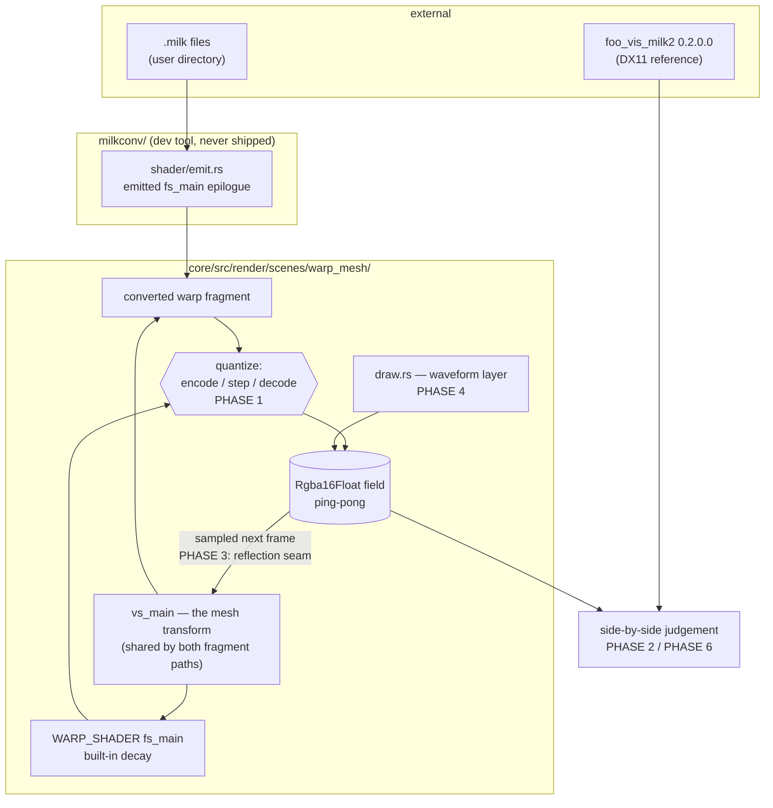

# 0108 — The MilkDrop import gets its tone back

> **Status:** done — **closed 2026-08-17, all six phases run.** Phases 1/3/4/5 landed as code
> (`b02cd45`, `60674da`, `6e92eb3`, `a07b0c6`) and were reviewed the same day; Phases 2 and 6 ran as
> one live look-gate session against `foo_vis_milk2` and are recorded below. The verdict on this
> plan's own central question is **still merely different** — and the gate found four engine defects
> this plan was never scoped to fix, which is worth more than the answer it went looking for. They
> carry to [Plan 0109](../0109-the-milkdrop-import-gets-its-geometry-back.md) and backlog 0113-0116.
> **Created:** 2026-08-17
> **Owner skill(s):** dev, human
> **Related ADRs:** [0118](../../adrs/0118-the-milkdrop-feedback-field-quantizes-in-the-encoded-domain.md) (proposed)
> **Closes:** design-backlog 0106, design-backlog 0107

## TL;DR

[Plan 0100](0100-the-engine-speaks-milkdrop.md) shipped the MilkDrop import and its Phase 7
judged it *mostly there, with defects* — and returned **merely different**, not better, on the
plan's own motivating claim about the HDR pipeline. Four defects explain the gap. This plan fixes
the one that dominates (the float feedback field never truncates, so every dim residual
accumulates), re-judges the HDR verdict on the same seven pairs at the same rig, and then hunts the
three draw-layer and warp-geometry defects one phase each — every hunt carrying a stop condition, so
a cause that resists costs one phase rather than the plan.

## Context & problem

The rig and the evidence are Plan 0100's Phase 7 (2026-08-16): real MilkDrop 2 via `foo_vis_milk2`
0.2.0.0 (DX11) in foobar2000 v2 against this engine's release `lmv.exe`, one track feeding both,
seven presets judged side by side. Structure, motion and reactivity survived conversion in **every**
pair — the bones are right. Four defects did not, filed as
[design-backlog 0106](../../design-backlog.md) and [0107](../../design-backlog.md):

1. **The float field never truncates.** MilkDrop's 8-bit feedback target floors `decay`-scaled dim
   pixels to zero; `Rgba16Float` keeps them and they integrate. One mechanism, four presentations:
   pastel wash (*Songflower*, *Cosmic Dust 2*), white-hot glow (*Contortion*), runaway to the clamp
   with channel fringing (*chasers 19 Portal*), and tonal **inversion** (*Fog Tunnel*). *Blur Mix
   3*, whose blur chain actively darkens, kept its blacks and looked genuinely good — the control
   that scopes this to the feedback path.
2. **The waveform draw layer misplaces or drops figures.** *Blur Mix 3* draws one steep diagonal
   stroke where the reference draws horizontal full-width traces; *Cauldron painterly 5*'s
   centrepiece spiro scribble is absent; *Cosmic Dust 2*'s `wave_usedots` beads never appear.
3. **A horizontal reflection seam in warp sampling** — content mirrors across a horizontal line with
   a bright ragged boundary (*Contortion*'s split sphere, *Cauldron*'s flipped top band, *Cosmic
   Dust 2*'s full-width false horizon).
4. **`chasers 19 Portal`'s mirror symmetry never takes effect** despite a clean conversion.

Defect 1 gates the rest: it inverts or washes the tone of every feedback-heavy preset, so the other
three are being judged through a broken frame, and the HDR verdict cannot be fairly re-read until it
is fixed. That is why the re-judge sits at Phase 2 rather than at the end.

**One thing this plan corrects on the way in.** Backlog 0107 names its own first suspect for defect
3 — *"check `s_fw`'s address mode against the reference's toroidal wrap first"* — and that suspect
is **already what the code does**: `warp_mesh/shader.rs:463` builds `s_fw` with
`AddressMode::Repeat`. Repeat produces a **shifted** copy, not the reflected one the fingerprint
describes, so the entry's leading hypothesis is falsified before the plan starts. Phase 3 names a
different one, below, with the arithmetic behind it.

## Decision

We take **backlog 0106 and 0107 together and leave 0108 (the conversion tail) filed**, because that
entry's own instruction is that its blank-render list is contaminated by both and re-counting it
first is wasted work. The truncation fix is
[ADR-0118](../../adrs/0118-the-milkdrop-feedback-field-quantizes-in-the-encoded-domain.md): quantize in
the **gamma-encoded** domain (a literal linear `1/255` floor is 13x too aggressive — the arithmetic
is in the ADR), driven by a runtime uniform, **on by default for `[milk]` bundles** and off for
native `warp_mesh` presets so nothing authored moves.

The three remaining defects are **unknown-cause hunts, and the plan says so.** Each gets its own
phase with a **stop condition**: a phase that cannot reproduce its defect on a minimal committed
fixture stops, records what it ruled out, and the plan continues. That was the user's call at the
interview over both alternatives — committing to fix all three (dishonest, since defect 3's first
suspect is already falsified) and reproduce-but-fix-optionally (yields evidence but may close the
plan with the defects still on screen).

The re-judge is the **same seven pairs, live, at the same rig** — rejected alternatives being
committed captures (cheaper and repeatable, but loses motion, which is half of what a feedback
preset is) and a wider set (no Phase 7 baseline to compare new presets against).

## Architecture diagram



## Implementation phases

### Phase 1 — the feedback field quantizes

- **Owner skill:** dev
- **What:** ADR-0118's encoded-domain quantization in **both** warp epilogues, driven by a runtime
  uniform, defaulting on for a `[milk]` bundle and off otherwise, with a bundle key to override.
- **Files touched:** `milkconv/src/shader/emit.rs` (the `Stage::Warp` epilogue at ~1440),
  `core/src/render/scenes/warp_mesh/mod.rs` (`WARP_SHADER`'s `fs_main`; `WarpUniform`),
  `core/src/render/scenes/warp_mesh/shader.rs` (`fill_uniform` — **`misc.w` is currently `0.0` and
  free**; `MilkUniform` needs no new member), `core/src/milk/` (the bundle key), the `warp_mesh`
  tests, `presets/README.md`.
- **Done when:**
  - **Off is an exact identity.** A native `warp_mesh` preset renders **byte-identical** to its
    pre-change output. Assert it against a live control rather than by argument — the
    [Plan 0075](0075-the-content-renaissance.md) Phase 2 form — so it cannot pass vacuously.
    `core/tests/golden/warp_mesh.png` must not move.
  - **On, the field reaches exact zero.** A converted feedback fixture with the deposit disabled
    settles to **exactly `0.0`** in its background in a finite number of frames, where the same
    fixture with quantization off converges to a **positive** value and never reaches zero. State it
    as that property; do not assert a frame count, which depends on `decay` and the starting level.
  - **The domain question is measured, not assumed.** ADR-0118's Notes flag that the reference's
    transfer function is a plain ~2.2 gamma rather than sRGB's piecewise curve, and that the two
    differ exactly in the near-black region this decision is about. Render the pair and record which
    was chosen and why; a one-line note in the ADR's Outcome is the deliverable, not a new constant
    justified in passing.
  - `core/tests/golden/warp_mesh_milk.png` is **expected to move** and is re-blessed. Use the
    bless-to-bless control this repo mandates (see Risks) — never a diff against the committed
    bytes.
  - The stale half-truth is repaired: `warp_mesh/mod.rs:1824`'s *"the reference's bound is its 8-bit
    target — which the shader epilogue's clamp reproduces"* described only the **ceiling**. Say what
    is now actually reproduced.

### Phase 2 — the HDR verdict gets its fair re-judge

- **Owner skill:** human
- **What:** Repeat Plan 0100 Phase 7 exactly — same seven presets, same rig, `foo_vis_milk2` beside
  `lmv.exe`, one track feeding both — and answer the question that plan could not: with the tone
  defect gone, is the HDR pipeline **better**, or still **merely different**?
- **Files touched:** none (a verdict; recorded as a dated `Outcome` on ADR-0118 and in the backlog
  0106 body at the close).
- **Done when:** a verdict is recorded on all seven pairs — *Contortion (Escher's Tunnel Mix)*,
  *Songflower (Moss Posy)*, *chasers 19 Portal*, *Blur Mix 3*, *Cauldron painterly 5*, *Cosmic Dust
  2*, *Fog Tunnel* — plus an answer to the two questions the tuning turns on:
  1. **Does the banding read?** ADR-0118's stated price is that quantizing inside the feedback loop
     re-introduces exactly what [ADR-0096](../../adrs/0096-the-display-write-dithers.md) dithers away at
     the display write, upstream of where that dither can reach. If it reads worse than the wash
     did, the recorded fallback is ADR-0118's **Alternative D** — floor to zero without quantizing
     the levels between — and that is a return to Phase 1, not a defect to file.
  2. **Did *Blur Mix 3* survive?** It is the one pair that already looked good, so it is the control:
     if the fix damages it, the switch is reaching presets it should not.
- **This is a real cut point.** *"Still merely different"* is a legitimate outcome, not a failure —
  it closes Plan 0100's central claim negatively on fair evidence, which is worth more than the
  feature was, and Phases 3-6 proceed regardless because they fix defects that are wrong either way.

### Phase 3 — the horizontal reflection seam

- **Owner skill:** dev
- **What:** Reproduce the mirrored-content seam on a minimal fixture and, if the cause is found, fix
  it.
- **Files touched:** `milkconv/src/shader/emit.rs` (~1418), `core/src/milk/mod.rs`
  (`run_vertex`, ~784), a fixture under `core/tests/fixtures/scratch-0108/`.
- **The leading hypothesis, with its arithmetic** — replacing the entry's falsified sampler suspect.
  `emit.rs:1418` builds the polar pair from `_lmv_p = (uv_orig - 0.5) * vec2<f32>(2.0, -2.0) *
  U.aspect.zw`, so `p.y = -(uv_orig.y - 0.5) * 2 * ay`. A preset that **reconstructs `uv` from
  `ang`** — the common `uv = 0.5 + 0.5 * float2(cos(ang), sin(ang)) * rad` idiom, and the shape most
  tunnel presets are made of — recovers `uv.y = 0.5 + 0.5 * p.y / ay = 0.5 - (uv_orig.y - 0.5)`,
  which is `uv_orig.y` **reflected about 0.5**. That is a mirror about the horizontal midline with
  its seam on the fixed line, which is the reported fingerprint including the ragged boundary.
  The negation is **correct** for the EEL per-vertex program (`run_vertex` works in +y-up clip space
  and the reference's per-vertex space is +y up). Whether it is correct in the **pixel** shader,
  where `uv` is texture space, is the open question — and it is answerable in one render.
- **Done when:** either
  - a fixture whose warp shader round-trips `uv` through `ang` renders content that is **not**
    mirrored about the horizontal midline, and the golden suite is re-blessed for whatever moved; or
  - **(stop condition)** the fixture does not reproduce the seam, in which case the phase commits the
    fixture, records that the `ang` round-trip is ruled out along with `s_fw`'s address mode, and
    the plan continues to Phase 4. A ruled-out hypothesis with a committed reproduction attempt is
    the deliverable in that branch.

### Phase 4 — the waveform draw layer

- **Owner skill:** dev
- **What:** Reproduce and, where found, fix the three draw-layer symptoms: the diagonal stroke where
  the reference draws horizontal traces, the missing spiro figure, and `wave_usedots` beads that
  never appear.
- **Files touched:** `core/src/render/scenes/warp_mesh/draw.rs`, `milkconv/tests/draw_layer.rs`,
  fixtures under `core/tests/fixtures/scratch-0108/`.
- **Where to start, in order of what the evidence supports:** `wave_usedots` first — the symptom is
  binary (beads appear or they do not), so it is the cheapest to convict, and `draw.rs:44`'s own
  note says a dot is drawn as a near-zero-length segment relying on the line renderer's
  across-the-stroke falloff, which is a mechanism that can fail to nothing. Then the mode geometry:
  `draw.rs:420` reads `wave_mystery`, whose meaning differs per mode by the reference's own design
  (`draw.rs:47`), so a mode picking up the wrong interpretation would misplace exactly one family.
- **Not a defect, and do not chase it:** the mono engine drawing one trace where stereo draws two is
  known and accepted (Plan 0100 Phase 4). Any finding must be beyond that.
- **Done when:** each of the three symptoms is either fixed with a test naming the behavioural claim
  ("`wave_usedots = 1` puts separated marks along the trace where `= 0` puts a continuous stroke"),
  or **(stop condition)** recorded as not reproduced on a committed fixture, with what was ruled out.
  A partial result — one of three fixed — is a successful phase and is reported as such.

### Phase 5 — `chasers 19 Portal`'s mirror fold

- **Owner skill:** dev
- **What:** One targeted reproduction of the preset whose uv-fold converts cleanly and is inert at
  render time.
- **Files touched:** `core/src/render/scenes/warp_mesh/`, `milkconv/src/`, a fixture under
  `core/tests/fixtures/scratch-0108/`.
- **Done when:** the fold takes effect and a test pins whichever stage was dropping it, or **(stop
  condition)** the phase records where the fold's value is lost — read the converted WGSL, the
  per-vertex outputs and the mesh vertex stage in that order — and files what it found. **Run this
  after Phase 3:** if Phase 3's hypothesis holds, a mirror that is being applied and then undone by
  a second reflection is a candidate explanation for this defect too, and Phase 3's answer may make
  this phase trivial or empty.

### Phase 6 — the final look pass

- **Owner skill:** human
- **What:** The seven pairs once more, plus *chasers 19 Portal* judged specifically on its fold, to
  say whether the import now reads as authored.
- **Files touched:** none (verdicts recorded at the close).
- **Done when:** a verdict per pair, and an explicit call on whether the waveform-led family (*Blur
  Mix* / *Fog Tunnel*) reads as authored — which is what backlog 0107 says Phase 4 decides. Any
  remaining divergence is filed as a fresh backlog entry rather than fixed here.

## Data shapes

```rust
// illustrative — not the final interface
// warp_mesh/shader.rs: MilkUniform.misc, whose .w lane is `0.0` today.
//   x: decay^dt   y: brightness   z: occlude   w: quantize steps (0.0 = off)
//
// The step count rather than a bool, so the look gate can A/B a tuning
// without a rebuild and Alternative D is reachable from the same lane.
```

```wgsl
// illustrative — the epilogue shape both fragment paths share
fn lmv_quantize(c: vec3<f32>, steps: f32) -> vec3<f32> {
    if (steps < 1.0) { return c; }              // exact identity when off
    let e = lmv_linear_to_encoded(c);           // domain measured in Phase 1
    return lmv_encoded_to_linear(floor(e * steps) / steps);
}
```

## Risks & open questions

- **The banding is the designed price and may lose the look gate.** ADR-0118 states it in
  Consequences and Phase 2 asks about it directly; the fallback (Alternative D) is chosen in
  advance so the answer routes rather than reopens.
- **Two of the three hunts may stop.** That is the shape the user chose. The plan is still worth
  running on Phase 1 alone, which is the defect that dominates every pair.
- **Do not `git diff` the committed baselines.** Eight drift from their committed bytes under
  `LMV_BLESS` on this box. Bless twice **on the same branch**, differing only by reverting the change
  under test, and compare bless-to-bless. The suite is **32 baselines** as of 2026-08-17 — re-derive
  the count rather than copying this one forward, which is what went stale in the plans README at 28.
- **[ADR-0037](../../adrs/0037-internal-grid-is-a-resolution-not-a-shape.md) applies and this family is
  a repeat offender.** Phases 1 and 3 both touch code near `U.aspect`. Any aspect used for
  screen-destined geometry comes from the **render target**, never from a grid or mesh size, and the
  development display cannot tell the two apart — test at a size where they disagree.
- **Re-conversion.** A bundle converted before Phase 1 emits a bare clamp and will not quantize. It
  degrades gracefully and nothing in the repository is affected; say so in `docs/presets.md` so a
  user with an existing converted directory knows to re-run `milkconv`.
- **Open: does the reference quantize per channel or on luminance?** Per channel is the assumption
  (it is what an 8-bit target does) and it is what would produce *Portal*'s observed per-channel
  fringing, which is weak corroboration. Not worth a phase; worth a sentence if the look gate sees
  hue shifts in the dark.

## What this plan does NOT do

- **Backlog 0108, the conversion tail** — the ~71 HLSL-array files and the 218 MD2 presets that
  convert but render blank. Deliberately left filed: that entry says its own list is contaminated by
  both defects fixed here, so re-ranking it before they land is wasted. Re-run `milkconv --render`
  after this closes and re-rank then.
- **Distribution and licensing.** Plan 0100 Phase 8 was *decide later*; nothing third-party enters
  the repository or a release, and the import path stays the converter plus a user-supplied
  `LMV_PRESET_DIR`.
- **MilkDrop `textures/` support**, per-vertex evaluation on a compute shader, and a `warp_mesh`
  content cohort ([Plan 0104](../0104-the-library-stops-being-lopsided.md) owns the last).
- **Any move on the engine-wide HDR chain.** ADR-0046's linear-light ordering and ADR-0096's display
  dither are inputs here, not subjects.

## Implementation log

**2026-08-17 — Phases 1, 3, 4 and 5 landed; Mode 4 review run the same day.** Commits `b02cd45`
(Phase 1), `60674da` (Phase 3), `6e92eb3` (Phase 4), `a07b0c6` (Phase 5). Review verdict: **no
blockers, two majors (both repaired at the review), three minors, one nit.** `fmt`, `clippy
--workspace --all-targets -D warnings`, the three doc gates and the plan's own tests all green,
including the full 32-baseline golden suite.

What each phase actually delivered, where it differs from what this plan asked for:

- **Phase 1 — delivered as specified.** The quantizer reaches both epilogues out of one text
  (`milk::shader::QUANTIZE_WGSL`), on `MilkUniform.misc.w` for a converted shader and a new
  `WarpUniform.misc3.x` for the built-in decay fragment — **which this plan did not anticipate**: an
  MD1-era bundle carries no custom warp shader, takes the built-in path, and washed out identically.
  All four done-whens were met by measurement: `warp_mesh.png` mean `0.0000` against its committed
  pre-change bytes, a bless-to-bless control moving exactly 1 of 32 baselines, the field reaching
  exact zero at a hundred times the brightness that shows the unquantized control, and the transfer
  function *rendered* rather than assumed. That last one is a dated `Outcome` on ADR-0118 — written
  by `dev` with the architect's authorisation, and correctly formed: appended below Alternatives,
  body untouched, dated.
- **Phase 3 — landed on a branch this plan's done-when does not offer.** The plan gives two (fixed
  and re-blessed, or *did not reproduce*). What happened is a third: **the fixture reproduces the
  seam exactly, the cause is named, and the fix is deliberately withheld.** `emit.rs` builds the
  polar pair as `(uv_orig - 0.5) * (2, -2) * aspect.zw`, which works out to `(nx, ny/aspect)` —
  *exactly* what `MilkRuntime::run_vertex` computes — and in the reference `rad`/`ang` reach a pixel
  shader as interpolated per-vertex attributes, the same numbers. So flipping the fragment's sign
  alone would put the engine in a state the reference cannot be in, and flipping both moves every
  converted preset's geometry. **The review endorses withholding it** and would have rejected the
  fix had it been applied. The cost is that design-backlog 0107 item 2 is *not* discharged and the
  seam is still on screen; Phase 6 is where the sign is settled.
- **Phase 4 — two of three symptoms fixed, exactly the partial result this plan says is a success.**
  `wave_usedots` beads (a mark had no caps, so it was a sub-pixel dash — 2 of 512 marks visible at
  320x180) and `wave_mode 5` mixing a stroke with beads (one of four emit sites did not read the
  flag). The third, *Blur Mix 3*'s diagonal, has a named suspect with arithmetic — `time * 0.05` in
  the mode 6/7 arm, the only use of `time` in the file — recorded as a comment at the line rather
  than removed, because removing it moves every mode-6 and mode-7 preset. *Cauldron painterly 5*'s
  absent spiro was **not reached**; the commit records where the next session should start.
- **Phase 5 — the fold was nowhere this plan said to look.** *chasers 19 Portal* is an MD1 file with
  no shader blocks and no per-vertex program at all; its mirror is a `flip` counter in three custom
  waves' per-point code, and `ElementRuntime::run_point` was restoring a register snapshot before
  every point, so the counter computed a constant. Scoped to a **wave** — a shape's instances stay
  independent. 3 368 of the corpus's 6 347 custom-wave presets read a per-point variable only
  carry-over can supply.

Two majors, both repaired in the review session:

1. **The Phase 5 carry also crosses the frame boundary, and nothing said so.** Nothing reseeds a
   working register between frames either, so on an **odd**-length trace the whole figure inverts
   every frame — an alternation at the *display's* refresh rate. The Phase 5 fixture is eight points,
   even, so it could not see it. Repaired with a doc section on `run_point` (naming it believed
   faithful but **unverified against the reference**, for Phase 6) and a second test,
   `a_waves_per_point_state_also_carries_across_the_frame_boundary`, that pins both parities.
2. **Phase 3's third branch**, recorded here.

Three minors and a nit, **left open for the next `dev` touch on this file** (none blocks the look
gates):

- `lmv_quantize`'s Alternative D branch returns its argument unclamped where the positive branch
  clamps to `[0,1]` first. On the built-in path the argument is not pre-clamped, so selecting
  Alternative D — which is exactly what Phase 2 may route to — silently also drops the 8-bit
  *ceiling* for MD1-era bundles. Not a regression, but an asymmetry nobody reasoned about.
- `draw.rs`'s module header and `dots` now say the caps make a mark *round*. The extension is purely
  geometric and the falloff runs across the stroke only, so the mark is a squared-off lozenge. It
  went from a 3.3:1 sub-pixel dash to roughly square, which is the complete and sufficient reason
  the beads read — "round" replaces one wrong mechanism with another.
- Phase 3's argument rests on "in MilkDrop `rad`/`ang` reach a pixel shader as interpolated
  per-vertex attributes", asserted from knowledge with no citation, in the one place the withheld
  fix turns.
- (repaired) `docs/presets.md` said every existing converted directory needs a re-convert; an MD1-era
  bundle with no `warp_shader` picks the fix up for free.

**What the two human gates still owe.** Phase 2: a verdict on all seven pairs plus the two questions
the tuning turns on (does the banding read? did *Blur Mix 3* survive?). Phase 6: the seven pairs
again, the *chasers 19 Portal* fold, and — added by this review — three questions the dev phases
handed forward, each of which needs the reference on screen and can be answered in the same sitting:

1. **Does the reference's warp `ang` measure y the same way its `uv` does?** Settles Phase 3's sign
   and design-backlog 0107 item 2.
2. **Does a mode-6 waveform drift in the reference?** Settles Phase 4's `time * 0.05`.
3. **Does a custom wave's per-point state survive the frame in the reference?** Settles major 1's
   open half. Reproduce with any preset whose custom wave has an odd sample count and a `flip`
   counter.

Also discharged by Phase 1 landing: [Plan 0104](../0104-the-library-stops-being-lopsided.md)'s four
`warp_mesh` worlds were waiting on it.

## The look gate — Phases 2 and 6, run 2026-08-17

One session, both `human` phases together, `foo_vis_milk2` 0.2.0.0 beside release `lmv.exe`, one
track feeding both, the same seven pairs as [Plan 0100](0100-the-engine-speaks-milkdrop.md)
Phase 7. The engine side ran a purpose-built set: the seven presets re-converted by the current
`milkconv`, each at three quantizer settings (**A** = 255 default, **B** = `quantize_steps = 0`, the
pre-Phase-1 picture, **C** = `-255`, Alternative D), so the A/B/C question was a browser keypress
rather than a restart.

### Phase 2's central question: still merely different

| Preset | closest variant | verdict | what actually dominates the pair |
|--------|-----------------|---------|----------------------------------|
| *Contortion (Escher's Tunnel Mix)* | C | wrong | the wash, cause open — plus a black ray artifact on all four frame edges |
| *Songflower (Moss Posy)* | C | wrong | **no video-echo stage** (`fVideoEchoAlpha = 1.000`) |
| *chasers 19 Portal* | B | wrong | **a negative `sx` is clamped away** |
| *Blur Mix 3* | C | wrong | **`time * 0.05`** in the mode 6/7 angle |
| *Cauldron painterly 5* | C | **better** | — (the spiro is still a mode-mapping gap) |
| *Cosmic Dust 2* | C | wrong | the wash; hue magenta where the reference is green |
| *Fog Tunnel* | A | wrong | the wash, presenting as tonal inversion |

**One better, six wrong, and not one of the six for the reason this plan was built on.** That closes
Plan 0100's motivating HDR claim **negatively on fair evidence**, which is the outcome Phase 2
explicitly named as legitimate and worth more than the feature.

### The two questions the tuning turned on — both clean

1. **Does the banding read? No.** No pair showed it. A, B and C differ far less than the defects
   around them, and where C was picked as closest it was by a hair and never *because* of banding.
   **ADR-0118 stands as written; Alternative D is not needed** and Phase 1 does not reopen.
2. **Did *Blur Mix 3* survive? Yes.** The quantizer did it no harm — the control holds. Its
   divergence is the waveform angle and is unrelated to the switch.

### What Phase 1 actually bought, stated honestly

The quantizer works and is measurable: `the_quantized_field_reaches_exact_zero` passes, and under a
dynamic-groove signal *Fog Tunnel* at **A** keeps its shading legible across eight hops where **B**
dissolves to flat white by the fourth. **But on the five pairs with no video echo the background sits
three orders of magnitude above the quantizer's floor**, so nothing it does can reach them.
**Backlog 0106's diagnosis was real but not dominant** — it claimed one mechanism with four
presentations, and the look gate found that at most one of the four (the dim-residual accumulation)
is truncation. The wash is something else and is still unexplained.

### Two of this plan's own conclusions are falsified

- **Phase 5's Portal diagnosis is wrong.** Its commit says *chasers 19 Portal*'s fold "is three lines
  of per-point code in each of three custom waves". The preset's mirror is `per_pixel_3=sx=-zm`, a
  negative x-scale — and `warp_mesh/mod.rs`'s `let sx = pow(max(in.t1.z, 1e-4), dt)` clamps the sign
  away, so the fold is not *inert*, it is replaced by a near-zero positive scale. The per-point carry
  fix Phase 5 landed is real, correct and reaches 3 368 corpus files; it simply is not this preset's
  fold. **Corpus reach of the real cause: 363 of 10 347 files (3.5 %)** assign a negative to
  `sx` / `sy` / `zoom` in per-pixel code — 229, 172 and 155 respectively.
- **Backlog 0106's "tonal inversion" is not a mechanism.** *Fog Tunnel* sets `bInvert = 0` and
  `bSolarize = 0`; it draws its waveform **over**, not additive (`bAdditiveWaves = 0`), at
  `wave_r/g/b = 0.65`. A mid-grey line over the reference's dark ground reads bright; over our washed
  near-white ground the same line reads dark. Nothing inverts — the ground overtakes the ink. The
  reference's tunnel is a skeleton of discrete rings and ours is a solid tube, which is the clearest
  single picture of the wash in the set.

### What the gate confirmed working

- **Phase 4's dot repair, on real content.** *Cosmic Dust 2*'s reference draws its trails as dotted
  beads, and ours now does too — the first confirmation of that fix outside its own test.
- **Phase 4's `time * 0.05` suspect, convicted.** The reference's *Blur Mix 3* traces stay horizontal;
  ours rotates. The phase deliberately left the term in pending exactly this observation, and its
  stop condition is now discharged: the term is wrong and comes out in Plan 0109.
- **Phase 1's quantizer**, per the dynamic-groove evidence above.

### What the gate could not settle

**Phase 3's seam.** *Cauldron*'s reference at the framing captured has no mirror to compare against,
and the pairs are unsynchronised, so the sign question stands exactly where Phase 3 left it. It
carries to Plan 0109 with the reproduction fixture already committed.

## Followups (after this lands)

- Re-run `milkconv --render` over `WORK/milkdrop-corpus` and re-rank backlog 0108's blank list
  against the fixed engine — the entry's own stated trigger.
- If Phase 2 says *better*, `docs/presets.md`'s MilkDrop section and Plan 0100's Phase 7 record both
  carry the provisional *merely different* verdict and want the correction.
- If Phase 2 says *still merely different* on a fair frame, that closes the HDR claim negatively and
  the distribution question (Phase 8, *decide later*) is worth re-reading in that light.
