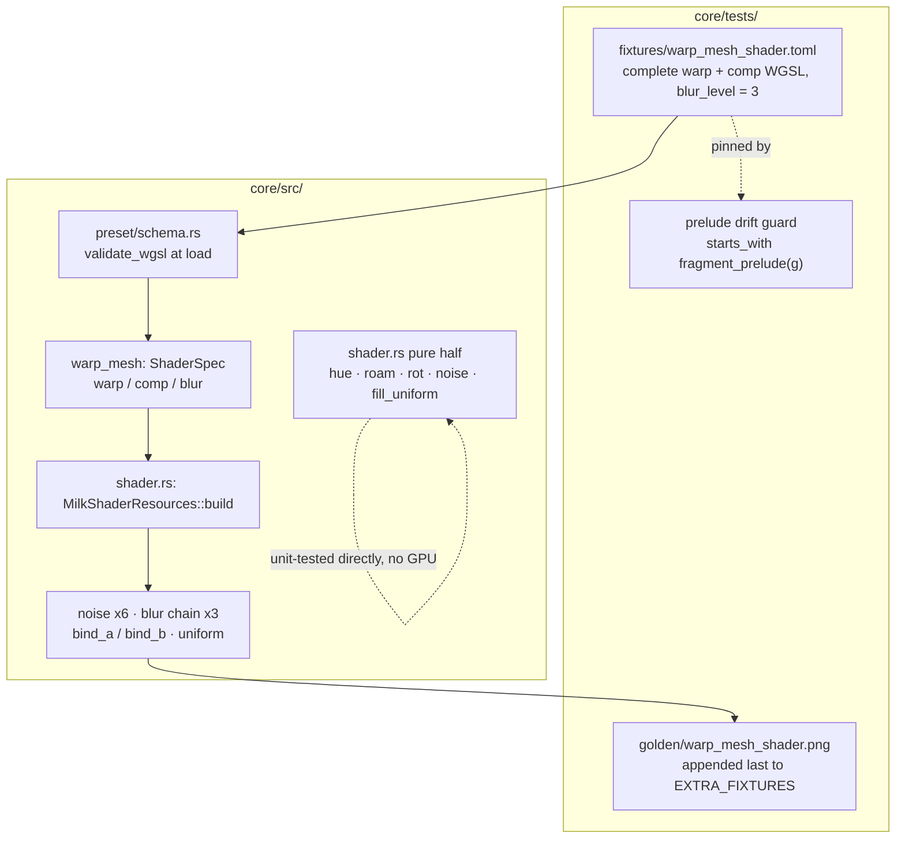

# 0110 — The shader surface stops being invisible

> **Status:** done — **closed 2026-08-19, the five `dev` phases run** (`4595e14`, `c2b36cc`,
> `916df90`, `e46232f`, `2b639fe`). Review: **no blockers, one major, three minors.** The major is
> that Phase 1's `#[path]`-declared test module is invisible to `hygiene.rs`'s skip rule, so it is
> scanned as hot-path code and passes only because its `#![allow(...)]` block spells the sentinel
> the guard greps for — the exact vacuous pass that guard's own header warns about, proven by probe
> and carried to the followups below. **Phase 6 (`human`) ran 2026-08-20, and the plan is
> complete.** The push landed as `v0.75.0`; CI run
> [`32272926929`](https://github.com/IgorKonovalov/light-music-visualizer/actions/runs/32272926929)
> on `main` (`7b9781d`) is green on all six jobs and puts `lmv-core` at **92.31 % lines** against
> floor **91** — the review's `~92.3 %` projection, confirmed to two decimals. See
> "Phase 6 — the CI reading" below.
> **Created:** 2026-08-18
> **Owner skill(s):** dev, human
> **Related ADRs:** [0033](../../adrs/0033-testing-strategy-coverage-ratchet-and-pre-push-gate.md) (the ratchet this restores), [0023](../../adrs/0023-golden-drift-guard-uses-frozen-fixtures.md) (the fixture discipline), [0058](../../adrs/0058-bind-group-layout-collisions-carry-evidence.md) (the adapter comparison Phase 5 owes), [0113](../../adrs/0113-milkdrop-presets-are-translated-ahead-of-time-onto-a-warp-mesh-idiom.md) (what the surface is for)

## TL;DR

`core/src/render/scenes/warp_mesh/shader.rs` is **719 lines at 0.00 % coverage** — not one of
them executes in CI — because every test fixture in the repo drives the warp mesh from EEL2
bytecode and **none carries WGSL**, and that file is deliberately built only for a bundle that
does. This plan writes the missing fixture: a hand-authored warp + comp shader pair, pinned by a
golden baseline, plus unit tests over the file's large pure-CPU half and over the wave/shape
element half of `milk/mod.rs`. The floor stays at 91; this plan earns its way back over it
rather than moving it.

## Context & problem

CI's `coverage` job has been red since 2026-08-16 21:37 (run `31974037098`, the `v0.71.0` push)
and every run since. It is the **only** failing job — `deny`, `check` on both platforms, `links`
and `miri` are green, and the `Release` workflow publishes fine.

The failing step is `Measure lmv-core line coverage and enforce the floor`
(`.github/workflows/ci.yml:166`), gating on `COVERAGE_FLOOR: "91"` (`ci.yml:35`):

| | lines | missed | line coverage |
|---|---|---|---|
| last green (run `31958383461`, 2026-08-16 16:21) | 16,042 | 1,033 | **93.56 %** |
| now (run `32008593831`, 2026-08-17) | 19,935 | 2,540 | **87.26 %** |

The MilkDrop/warp-mesh merge added **~3,893 lines of which ~1,507 are uncovered**. Where they
are:

| file | lines missed | line coverage |
|---|---|---|
| `core/src/render/scenes/warp_mesh/shader.rs` | **719** | **0.00 %** |
| `core/src/milk/mod.rs` | 271 | 52.62 % |
| `core/src/render/scenes/warp_mesh/draw.rs` | 128 | 72.53 % |
| `core/src/render/scenes/warp_mesh/mod.rs` | 116 | 88.79 % |
| `core/src/milk/vm.rs` | 87 | 71.84 % |

**The 0.00 % is not a runner artifact.** The coverage job runs on `windows-latest` precisely so
the DX12 WARP adapter makes GPU tests real (`ci.yml:145-147`, ADR-0016). The file is unreached
because of what it says about itself in its own header:

> Everything here exists **only for a bundle that carries WGSL**. A native `warp_mesh` preset —
> and a converted one without shaders — builds none of it, which is what keeps every existing
> golden byte-identical.

`core/tests/fixtures/warp_mesh_milk.toml` carries a `[milk]` table of EEL2 bytecode and **no**
`warp_shader`, `comp_shader` or `blur_level` keys. So `MilkShaderResources::build`, the six
procedural noise textures, the three-level blur chain, `fill_uniform`, `encode_clear` and
`encode_blur` have never run under any test, on any adapter. That is a test gap Plan
[0100](0100-the-engine-speaks-milkdrop.md) Phase 6 left behind and Plan
[0108](0108-the-milkdrop-import-gets-its-tone-back.md) widened.

**The arithmetic, because it decides the scope.** At the current denominator, a 91 % floor
allows `0.09 x 19,935 = 1,794` missed lines. There are 2,540. **This plan must eliminate at
least 746 of them.** The two files in scope offer `719 + 271 = 990`. So roughly **three
quarters of the available holes must close** — the margin is real but thin, and that thinness
is why the scope is two files rather than the one obvious one. Covering `shader.rs` alone and
perfectly reaches 90.87 %, which is still red.

## Decision

We write the fixture the engine never had: a **hand-authored WGSL warp + comp pair** checked in
as `core/tests/fixtures/warp_mesh_shader.toml`, carrying the complete modules the preset schema
demands, exercising the noise set, the blur chain and the uniform block, pinned by a golden
baseline appended to `EXTRA_FIXTURES`. Around it go unit tests for `shader.rs`'s pure half
(which needs no GPU at all) and for the wave/shape element half of `milk/mod.rs`. **The floor
stays at 91.**

We rejected **converting a real corpus preset** (`WORK/milkdrop-corpus`) because the output is
large, opaque and re-churns the golden whenever the converter changes — the fixture would pin
`milkconv`'s current opinion rather than the engine's contract. We rejected **converting at test
time** because it couples `core`'s test suite to the `milkconv` binary and pays conversion cost
on every run. We rejected **behavioral assertions without a golden** because 719 lines of
pipeline construction and bind-group wiring is exactly the code that breaks silently, and
`warp_mesh_milk` already set the precedent that this family gets pinned to pixels. And we
rejected **re-deriving the floor downward** — ADR-0033 permits it with a one-line note naming
the plan, and `ci.yml:33` even says 91 is "owed a second look", but lowering a ratchet to meet
uncovered code is how a ratchet stops meaning anything. That second look is a separate question
from this regression, and it is left as a followup.

**No new ADR.** The fixture applies patterns already decided — ADR-0023's frozen fixtures,
ADR-0033's ratchet, and the `warp_mesh_milk` precedent of a hand-written artifact guarded
against drift by a test. Nothing here is a cross-cutting tradeoff future readers would need the
rejected alternatives for; the paragraph above is enough.

### The one real hazard, and its settled answer

A hand-written fixture must inline the **complete** module: `milkconv/src/shader/emit.rs:121`
builds every converted shader as `fragment_prelude(group)` followed by translated code, and
`core/src/preset/schema.rs:1562-1570` runs `validate_wgsl` over the whole string at load. The
prelude is ~2 KB of generated text, and ADR-0118 changed it this month. A verbatim copy in a
`.toml` will drift.

The house already solved this. `warp_mesh_milk.toml` inlines compiled EEL2 assembly, and
`milkconv/tests/fixture.rs` asserts byte-for-byte that compiling the commented source produces
it — so the two cannot drift into a comment that used to be true. **Phase 2 owes the same
guard**: an assertion that the fixture's shaders begin with exactly
`milk::shader::fragment_prelude(WARP_GROUP)` and `(COMP_GROUP)`. When the prelude changes, that
test fails and names the repair, rather than the fixture silently pinning a stale surface.

## Architecture diagram



## Implementation phases

### Phase 1 — The pure half gets unit tests

- **Owner skill:** dev
- **What:** Unit-test everything in `shader.rs` that needs no GPU. This is the walking skeleton:
  it lands real coverage on the worst file before any fixture exists, and it cannot be broken by
  an adapter.
- **Files touched:** `core/src/render/scenes/warp_mesh/shader.rs` (add
  `#[cfg(test)] #[path = "shader_tests.rs"] mod tests;` at the foot — the private functions are
  not reachable from the existing sibling `tests.rs`), new
  `core/src/render/scenes/warp_mesh/shader_tests.rs`.
- **Done when** these properties hold. They are properties, not frozen numbers — each is exact
  or has a tolerance derived from the mechanism (ADR-0071):
  - `ShaderSpec::key` is stable across repeated calls on an equal spec, and differs when any one
    of `warp` / `comp` / `blur` differs.
  - `hue_corners` returns four rows whose **max channel is exactly 1.0** (the documented
    normalization) with `a = 1.0`, and is a pure function of `time`.
  - Every component `roam_vectors` produces lies in `0..=1` — the documented remap of a
    sine/cosine pair.
  - `rot_rows` fills `ROT_MATRICES * 4` rows; each matrix's upper 3x3 block is **orthonormal**
    (row norms 1, rows mutually perpendicular) to an f32 tolerance, because Rodrigues' formula
    produces a rotation and nothing else; each fourth row has `w == 1.0`. A different `salt`
    produces different axes; the same `salt` reproduces.
  - `noise_2d` / `noise_3d` return exactly `size*size*4` and `size*size*size*4` bytes, are
    deterministic in `(size, zoom, seed)`, and change with the seed. `zoom == 1` and `zoom > 1`
    take different arms — the interpolated arm's output has strictly lower mean absolute
    neighbour difference than the per-texel arm at equal size, which is what "smoothly
    interpolated" means and is checkable without freezing a number.
  - `fill_uniform` converts a per-second decay to this frame's factor: at `dt == 1.0` the
    `misc.x` lane equals the per-second value. The aspect lanes are reciprocal (`z == 1/x`,
    `w == 1/y`) and the **longer axis reads 1.0** at both landscape and portrait.
  - All of the above are **total on degenerate input** — zero size, non-finite or zero aspect,
    `dt == 0`, `zoom == 0`, `size == 0` — returning finite values and never panicking. The file
    carries the hot-path `#![deny(clippy::panic, clippy::indexing_slicing, ...)]` pragma; these
    tests are what make that claim observable.

### Phase 2 — A shader-carrying fixture, and the guard that keeps it honest

- **Owner skill:** dev
- **What:** The fixture that makes `MilkShaderResources::build` run at all, plus its drift guard.
- **Files touched:** new `core/tests/fixtures/warp_mesh_shader.toml`, `core/tests/warp_mesh.rs`.
- **How to author it.** Start from `warp_mesh_milk.toml` (same `[mesh]`, `[palette]`, `[params]`
  discipline, same header stating what it pins and why a shorter shader would pin less). Add
  `warp_shader`, `comp_shader` and `blur_level = 3` to the `[milk]` table. Each shader string is
  `fragment_prelude(g)` verbatim, then a small `@fragment fn fs_main` body. Generate the prelude
  text by printing it rather than transcribing it. The bodies must, between them, read:
  - `lmv_GetPixel` (binding 1 — `t_main`, so `bind_a` / `bind_b` both matter),
  - at least one 2D noise and one 3D noise sampler,
  - `lmv_GetBlur1`, `lmv_GetBlur2` and `lmv_GetBlur3` (which is what forces `blur_level = 3` to
    build all three levels),
  - and several distinct uniform lanes — `U.clock`, `U.bands`, `U.q`, `U.roam`, `U.rot`, `U.hue`
    — so `fill_uniform`'s output is load-bearing on the picture rather than merely written.

  `core/src/milk/shader.rs`'s own `the_prelude_is_valid_wgsl_at_both_groups` test shows the
  minimal shape of a valid module; the fixture bodies are that, with more reads.
- **Done when:**
  - The fixture parses and loads **clean** — no warnings — and `validate_wgsl` accepts both
    modules (a rejected module is a named load error, so a broken fixture fails loudly here
    rather than at render).
  - **The drift guard:** the fixture's `warp_shader` starts with exactly
    `milk::shader::fragment_prelude(milk::shader::WARP_GROUP)`, and `comp_shader` with
    `(COMP_GROUP)`. This is the `milkconv/tests/fixture.rs` discipline applied to WGSL.
  - The fixture **renders a real shape** and **animates** — the same two statistics
    `warp_mesh.rs` already applies to its other fixtures, against the same floors, so the new
    entry is comparable to the existing ones rather than measured differently.
  - **The shaders and not the defaults drive the picture:** the fixture renders differently from
    the same preset with `warp_shader`/`comp_shader` removed, which is the `[milk]`-vs-control
    argument `the_bundle_and_not_the_defaults_drives_the_transform` already makes one layer down.

### Phase 3 — The branches where the surface is partly absent

- **Owner skill:** dev
- **What:** Cover `build`'s `Option` arms and the no-blur-chain path. Three variants derived
  from the fixture **text in-test** — no new files, no new baselines.
- **Files touched:** `core/tests/warp_mesh.rs`.
- **Done when:** warp-only (no `comp_shader`), comp-only (no `warp_shader`), and
  `blur_level = 0` each build and render a finite frame without panicking; and the `blur_level =
  0` arm renders **differently** from the `blur_level = 3` arm, since the fixture's shaders read
  `lmv_GetBlur3` by construction. If those two arms come back identical, that is a finding about
  what bindings 12..14 resolve to when no chain is built — record it, do not tune the fixture
  until it goes away.

### Phase 4 — The element half of the runtime

- **Owner skill:** dev
- **What:** Unit-test the wave/shape element half of `MilkRuntime` — the 271 missed lines in
  `milk/mod.rs`. The existing 15 tests in `core/src/milk/tests.rs` cover the VM, the bundle and
  the q-bridge; the element path landed later, in Plan 0108, and carries almost none.
- **Files touched:** `core/src/milk/tests.rs`.
- **Done when** these hold:
  - **A wave's per-point state carries to the next point within a wave, and does not leak into
    the next wave.** This is the exact defect commit `a07b0c6` fixed; nothing currently pins it.
  - A shape instance's index reaches its program — instance `n` and instance `m` produce
    different `ShapeInstance` output when the program reads the instance variable.
  - `push_element` rejects an element whose register roster disagrees with the bundle's, with a
    named `BundleError` (the same shape `a_bundle_with_mismatched_rosters_is_rejected` asserts
    for the frame programs), and every `BundleError` variant's `Display` renders non-empty text.
  - `wave_spec` / `shape_spec` return `None` past the end and `Some` within it; `wave_count` and
    `shape_count` agree with what was pushed.
  - `take_snapshot` / `restore_snapshot` round-trip: a run, a snapshot, a divergent run, a
    restore, and the same run again produces identical output.
  - `uses_random` is true exactly when some pushed program draws randomness.

### Phase 5 — Compare adapters, bless once, measure

- **Owner skill:** dev
- **What:** Land the baseline safely and report the real number. This phase is bookkeeping in
  the same sense a landing is: it is where the recorded hazards bite.
- **Files touched:** new `core/tests/golden/warp_mesh_shader.png`, `core/tests/golden.rs`.
- **Done when:**
  - The new entry is **appended last** to `EXTRA_FIXTURES` (`core/tests/golden.rs:130`), never
    inserted. That array's own header states why: it is captured after the roster loop so that
    adding an entry moves no existing baseline, "which matters on WARP, where building GPU
    resources mid-run is documented to change what a later capture resolves to". Its doc comment
    gains a paragraph in the established voice saying what this sixth-plus-one fixture pins that
    no other can — that it is the only baseline in the crate executing a converted shader
    module, a procedural noise texture, or the blur chain.
  - **The ADR-0058 adapter comparison runs before the bless**, hardware against WARP, and its
    result is recorded in the plan's implementation log. This is not optional ceremony: a new
    pass whose bind-group layout matches a live pipeline's has been observed taking that other
    pass's uniform on WARP while hardware stayed correct — which blesses garbage. A 15-binding
    layout with two 3D textures is exactly the kind of new layout that needs the check.
  - **Exactly one baseline file is new or changed in `git status`.** `LMV_BLESS` rewrites every
    baseline it renders, not only the failing one; restore any others it touched before
    committing, and confirm with the diff rather than by intent.
  - `cargo llvm-cov nextest -p lmv-core --summary-only` is run locally and **both** numbers —
    total lines and missed — are recorded in the plan's implementation log with the margin over
    746. Note in the log that this box has a hardware GPU and CI has WARP, so hardware-gated
    tests execute here and skip there: **the local reading is an over-estimate of CI's**, which
    is the same asymmetry `ci.yml:29-33` records about the floor itself.

### Phase 6 — The CI reading

- **Owner skill:** human
- **What:** Push, and read the number CI actually produces. The plan's whole success criterion
  is a CI job, and only the user pushes.
- **Done when:** the `coverage` job passes at floor 91 on `main`. If it comes in under, the
  shortfall is the input to a followup phase — extending to `milk/vm.rs` (87) and
  `warp_mesh/draw.rs` (128), which together hold more than any plausible gap — and **not** a
  reason to lower the floor. That call was made in the Decision above and does not get remade
  under schedule pressure.

## Data shapes

The fixture's `[milk]` table, illustrative — the two shader strings are the new part, everything
else follows `warp_mesh_milk.toml`:

```toml
# illustrative — the real prelude is ~2 KB and is generated, not transcribed
[milk]
blur_level = 3
per_frame = """..."""      # as warp_mesh_milk.toml
warp_shader = """
<verbatim fragment_prelude(WARP_GROUP)>
@fragment
fn fs_main(in: VsOut) -> @location(0) vec4<f32> {
    let past = lmv_GetPixel(in.uv);
    let n    = textureSampleLevel(t_noise_mq, s_fw, in.uv * U.roam[0].xy, 0.0).xyz;
    let b    = lmv_GetBlur1(in.uv) + lmv_GetBlur3(in.uv);
    ...
}
"""
comp_shader = """..."""
```

The uniform block is **not** redefined here: it is `MilkUniform` in `shader.rs`, field-for-field
with `UNIFORM_WGSL` in `milk/shader.rs`, and a test already naga-parses that text so the two
cannot drift.

## Risks & open questions

- **The margin is thin.** 746 missed lines must go, and the two files in scope hold 990. If
  Phases 1–4 land short, Phase 6 names the extension (`vm.rs`, `draw.rs`) rather than reopening
  the floor decision.
- **WARP and 3D textures.** The fixture samples `texture_3d` through `t_noisevol_lq` /
  `_hq`, which nothing in the suite has asked a software adapter to do. If WARP refuses or
  diverges, drop the 3D reads from the fixture bodies and record that as a finding about the
  adapter — the 2D noise, the blur chain and the uniform block still carry the bulk of the file.
- **The denominator moves.** Coverage is a ratio, and any non-test code landing in parallel
  changes it. `milk/tests.rs` and `warp_mesh/tests.rs` are both absent from CI's per-file
  breakdown, which is why Phase 1 puts new tests in a **separate file** rather than an inline
  module — but whether an inline `#[cfg(test)] mod` would count is not established here. Phase 5
  measures; it does not assume.
- **CI time.** The `coverage` job already runs 22m43s and the fixture adds WARP render work to
  it and to `golden`. If the job approaches the runner limit that is a real cost, and the answer
  is a narrower capture size for this fixture, not a dropped assertion.
- **The fixture is hand-written, so it is only as representative as its author.** It pins that
  the surface *works*, not that any real preset renders correctly — Plan
  [0109](0109-the-milkdrop-import-gets-its-geometry-back.md) owns the latter.

## What this plan does NOT do

- **Does not move the coverage floor**, in either direction. `ci.yml:33` records that 91 was
  "measured once, on the wrong machine, and is owed a second look" — that re-derivation is a
  real and separate question, and doing it while a regression is red would launder the
  regression into the new number.
- **Does not touch `render/text.rs` (128 missed, 0.00 %) or `render/overlay.rs` (183 missed).**
  Both were already dark in the last green run; they are a standing gap, not this regression.
- **Does not cover `milk/vm.rs` or `warp_mesh/draw.rs`** unless Phase 6's reading forces it.
- **Does not convert a corpus preset, wire `milkconv` into `core`'s tests, or ship a
  shader-carrying preset to `presets/`.** Shipping `warp_mesh` worlds belongs to Plan
  [0104](0104-the-library-stops-being-lopsided.md) and the `preset-author` lane.
- **Does not change engine behavior.** If a phase finds a defect, it records it and the fix goes
  to a followup — a coverage plan that also changes what the code does cannot tell you which of
  the two moved the baseline.

## Implementation log (dev, 2026-08-18)

**Bookkeeping, not design.** Written by `dev` at the end of the dev phases so the
close ceremony and Phase 6 do not have to re-derive any of it. Everything below
is *what happened*; the phases above are still the contract.

**Lane:** `main` directly, no worktree. The session that began this plan was
killed mid-flight by a filesystem failure — `.git/refs/heads/main` came back as
41 NUL bytes, which reads as "your current branch appears to be broken" and shows
every tracked file as newly added. It was recovered from the reflog before Phase
3 started. `git fsck --full --strict` is clean, no work was lost, and Phases 1
and 2 were already committed when it happened.

### Where it stands

| phase | state |
|---|---|
| 1 — the pure half gets unit tests | **done**, committed `4595e14` |
| 2 — a shader-carrying fixture, and the guard | **done**, committed `c2b36cc` |
| 3 — the branches where the surface is partly absent | **done**, committed `916df90` |
| 4 — the element half of the runtime | **done**, committed `e46232f` |
| 5 — compare adapters, bless once, measure | **done**, committed with this log |
| 6 — the CI reading | **human**, not started |

### Phase 3 found nothing to record

The phase asked for a finding if `blur_level = 0` and `= 3` rendered identically,
since both fixture bodies read `lmv_GetBlur3` by construction. They do not:
`frame_diff 0.2998`. The chain is load-bearing on the picture, bindings 12..14
resolve to something distinguishable when no chain is built, and the followup
this plan reserved for that question is not needed.

Measured on WARP at 96x96 — warp-only coverage `1.0000`, comp-only `1.0000`,
no-blur `0.9998`.

### The ADR-0058 adapter comparison, before the bless

Run on the development box (Windows 10, DX12) under `golden.rs`'s own capture
conditions — 128x128 over 60 frames, the same `fixed_frame` — so the number
describes the baseline actually being blessed rather than a differently-measured
render:

| adapter | mean rgb |
|---|---|
| hardware | `235.4217  230.1932  235.1522` |
| WARP | `235.4122  230.1790  235.1396` |

`frame_diff 0.000267`, `max_channel_outlier 1`.

Agreement to a single 8-bit level. **The fifteen-binding layout with two 3D
textures does not alias on WARP**, which is the specific hazard this phase owed a
measurement for: a new pass whose bind-group layout matches a live pipeline's has
been observed taking that pass's uniform on WARP while hardware stayed correct,
and the golden suite would then bless the garbage. It did not happen here.

The probe was a throwaway test file, run once and deleted. Phase 5's file list is
`golden.rs` plus the baseline, and a permanent sibling to
`the_adapters_agree_on_the_warp_mesh` was not in its scope — but it is worth
having, and it is a followup below.

### The bless

`LMV_BLESS=1` rewrote five baselines. `git status` then showed **exactly one**
new file, `core/tests/golden/warp_mesh_shader.png`, and no modification to any
existing baseline — the other four came back byte-identical. Confirmed by the
diff rather than by intent, as the phase asks. A re-run without `LMV_BLESS` puts
every entry including the new one at `mean 0.0000  max_outlier 0`.

### The coverage reading, and why its total is not CI's

`cargo llvm-cov nextest -p lmv-core --summary-only`, 705 tests, on this box:

| | lines | missed | cover |
|---|---|---|---|
| local, 2026-08-18 | 29,232 | 10,827 | 62.96 % |

**That total does not reconcile with the 19,935 this plan is sized against, and
the gap is not something this plan did.** `core/src` has gained 765 lines since
CI's 2026-08-17 run, 382 of them test code — nowhere near the 9,297 the two
totals differ by. The two denominators are measuring different scopes, so **the
local percentage is not comparable to CI's in either direction** and no margin
should be read off it.

**The per-file rows are comparable, and they are exact.** Every file total in the
local report matches the plan's CI table to the line — `shader.rs` 719,
`milk/mod.rs` 572, `draw.rs` 466, `warp_mesh/mod.rs` 1,035, `vm.rs` 309 — and the
two files this plan does not touch still carry CI's exact missed counts
(`draw.rs` 128, `vm.rs` 87). Same files, same execution outcomes, same units.

So the arithmetic the Decision set up is answered per file:

| file | missed at CI (2026-08-17) | missed now | eliminated |
|---|---|---|---|
| `warp_mesh/shader.rs` | 719 (0.00 %) | 3 (99.58 %) | **716** |
| `milk/mod.rs` | 271 (52.62 %) | 55 (90.38 %) | **216** |
| | | | **932** |

**932 eliminated against the 746 the Decision requires — a margin of 186**, out
of the 990 the two files offered. `warp_mesh/mod.rs` also improved without being
in scope, 116 missed to 47, because the fixture drives it.

**The hardware/WARP asymmetry applies and points the usual way.** This box has a
hardware GPU and CI has only WARP, so hardware-gated tests execute here and skip
there — the gate is `device_type == Cpu`, not "discrete". The local reading is
therefore an over-estimate of CI's, the same asymmetry `ci.yml:29-33` records
about the floor itself. **Phase 6 is the only authority on whether the floor is
met**, and that was true before this discrepancy and is more true because of it.

### Followups this phase found

- **A permanent adapter check for the shader surface.** `the_adapters_agree_on_the_warp_mesh`
  is an `#[ignore]`d sibling guarding the native fixture; the shader surface now
  owns a baseline of its own and has no such guard. Same file, same shape.
- **The local/CI denominator gap is unexplained**, and should be explained before
  anyone sizes another coverage plan off a CI table. 19,935 against 29,232 is not
  a rounding difference, and the per-file agreement makes it stranger rather than
  less strange.

## Close review (architect, 2026-08-19)

**The denominator gap is not unexplained, and the log above is superseded on that one point.**
The local total reproduces exactly (29,232 lines / 10,827 missed / 62.96 %), and CI's full
per-file table pulled from run `32008593831` diffs against it into exactly two buckets:

- **`delta lines == delta missed`**, file after file — `bloom.rs` +507/+507, `particles/mod.rs`
  +1130/+1130, `expr.rs` +679/+679, and twenty-odd more. Extra mappings that never execute:
  pure inflation of both numerator and denominator, contributing nothing else.
- **`delta lines == 0`, misses down** — the real work. `warp_mesh/shader.rs` **-716**,
  `milk/mod.rs` **-216**, `warp_mesh/mod.rs` -69, `milk/bytecode.rs` -5, plus 1 in `schema.rs`
  and 3 in `render/mod.rs`.

So the two runs measure the same tree; the local one merges never-executed duplicate coverage
mappings out of `target/llvm-cov-target`. **`cargo llvm-cov clean --workspace` before measuring
is the first thing to try**, and that — not "the totals are incomparable" — is what a future
coverage plan should be told.

**Which makes the arithmetic a projection rather than a hope.** `headless()` is
`headless_on(true)`, software-preferred, so every GPU test here ran on WARP — the same adapter
CI uses. The hardware/WARP asymmetry the log invokes applies to the suite at large, not to the
files in scope, and the per-file eliminations transfer directly:

| | missed | lines | cover |
|---|---|---|---|
| CI, 2026-08-17 (run `32008593831`) | 2,540 | 19,935 | 87.26 % |
| projected next push | ~1,530 | ~19,943 | **~92.3 %** |

**1,010 missed lines eliminated against the 746 the Decision required**, and floor 91 allows
1,795 — roughly 265 lines of headroom. `vm.rs` and `draw.rs` stay untouched, as the plan wanted.
Phase 6 remains the authority; this is what it is expected to confirm.

**Version: no bump, deliberately.** The plan ships tests, a fixture and a baseline; the built
binary is byte-identical to `v0.74.0` and a tag push publishes release zips. `docs/releasing.md`
blesses "no bump" for a chore-only plan as a choice, and this is one.

## Phase 6 — the CI reading (2026-08-20)

**Done. The `coverage` job passes at floor 91 on `main`, so the plan's stated success criterion is
met and the shortfall branch of the done-when never fires.**

Run [`32272926929`](https://github.com/IgorKonovalov/light-music-visualizer/actions/runs/32272926929),
`main` at `7b9781d` (`v0.75.0`, pushed 2026-08-19 15:55Z). All six jobs green — `coverage`,
`check` on both platforms, `deny`, `links`, `miri`. `rust-cache` reported a restore-key hit
(`v0-rust-coverage-Windows_NT-x64-09dca0e9-810cc9d2`, full match false), so this is the cache-warm
reading `ci.yml:33` has been waiting for since Plan
[0061](0061-the-build-stops-paying-for-what-it-is-not-building.md) Phase 9.

| | missed | lines | cover |
|---|---|---|---|
| CI, 2026-08-17 (run `32008593831`) | 2,540 | 19,935 | 87.26 % |
| the close review's projection | ~1,530 | ~19,943 | ~92.3 % |
| **CI, 2026-08-19 (run `32272926929`)** | **1,538** | **19,992** | **92.31 %** |

Eight lines off on the missed count and forty-nine on the denominator. **The projection was sound,
and so was the method behind it** — `cargo llvm-cov clean --workspace`, then read per file rather
than off the total — which is what the next coverage plan should be told to do. Regions come in at
91.04 %; the gate is `--fail-under-lines`, so lines are the number that matters. The margin over
the floor is **1.31 points — 261 lines** of headroom before `coverage` goes red again.

Per file, against what the Decision required:

| file | missed 2026-08-17 | missed 2026-08-19 | lines | cover |
|---|---|---|---|---|
| `warp_mesh/shader.rs` | 719 (0.00 %) | **3** | 719 | **99.58 %** |
| `milk/mod.rs` | 271 (52.62 %) | 55 | 577 | 90.47 % |
| `warp_mesh/mod.rs` (not in scope, improved anyway) | 116 | 47 | 1,072 | 95.62 % |
| `warp_mesh/draw.rs` (untouched, as planned) | 128 | 128 | 465 | 72.47 % |
| `milk/vm.rs` (untouched, as planned) | 87 | 87 | 309 | 71.84 % |

`vm.rs` and `draw.rs` are untouched **to the line**, which is the cleanest reading available that
the floor was cleared by the two files in scope and nothing else: **the extension the done-when
named as the shortfall remedy is not owed.** `render/text.rs` is still 0.00 % (128 missed) and
`render/overlay.rs` 51.20 % lines / 44.49 % regions — both declared out of scope by this plan and
both still a standing gap.

**The fixture cost what the risk section budgeted.** `coverage` ran **24m05s** against the 22m43s
the plan recorded before it — **+1m22s, +6 %** — with 711 tests run, 711 passed (13 slow), 3
skipped, and no sign of the runner limit. The new tests are visible in the log by name
(`the_shader_fixture_draws_a_real_shape_and_animates`,
`each_partly_absent_shader_surface_builds_and_renders`, `the_fixture_reacts_to_audio` and eight
siblings), so **the fixture executes on WARP in CI and did not silently skip** — the one failure
mode a green job alone could not rule out.

**The 3D-texture risk did not materialize.** The fixture's `texture_3d` reads through
`t_noisevol_lq` / `_hq` are the first in this suite to ask a software adapter for one; every
`lmv-core::warp_mesh` test passed, so the fallback the risk section reserved — drop the 3D reads
and record it as an adapter finding — is not needed.

### What this run also discharges: Plan 0061 Phase 9

Phase 9 asked one CI run two questions. This run answers both.

**`coverage` is the longest job, so [ADR-0073](../../adrs/0073-the-windows-ci-critical-path.md)'s
Alternative A stays rejected.**

| job | wall clock |
|---|---|
| `coverage` | **24m05s** |
| `check (windows-latest)` | 11m33s |
| `check (macos-latest)` | 2m29s |
| `miri` | 2m22s |
| `deny` | 20s |
| `links` | 10s |

`coverage` leads by **2.1x**. `check (windows-latest)` is therefore not build-dominated, and
merging the two Windows jobs is not the win ADR-0073 said it would have to be to become worth
taking. Nothing routes back to `architect` as a supplement.

**The floor re-derives to the number it already carries, and its provenance is what changes.**
`ci.yml:25-34` records 91 as "measured once, on the wrong machine, and is owed a second look" —
94.85 % lines locally, with a ~3-point margin allowed because this box has a hardware GPU and CI
has WARP. CI's own reading is **92.31 %**, so that asymmetry was real and cost **2.54 points**,
inside the margin that was reserved for it. Two conclusions, and only the first is acted on here:

- **91 is now a CI-measured floor rather than an inherited guess.** The re-derivation is done; the
  constant does not move. The one edit owed is to `ci.yml`'s comment, which still tells a reader
  the number is unverified — a `dev` change, filed in the followups below.
- **Raising it is not taken.** A floor at 92 would leave 0.31 points — about 62 lines — and the
  denominator moves with any non-test code that lands. That is a ratchet decision under
  [ADR-0033](../../adrs/0033-testing-strategy-coverage-ratchet-and-pre-push-gate.md), and taking it
  inside the plan whose own margin created the headroom is exactly the laundering this plan's
  "What this plan does NOT do" section refused.

## Followups (after this lands)

- **`hygiene.rs` cannot see a `#[path]`-declared test module** (the review's one major).
  `is_cfg_test_module` matches `#[cfg(test)]` immediately followed by `mod <file stem>;`, and
  Phase 1 wrote `#[cfg(test)] / #[path = "shader_tests.rs"] / mod tests;` — neither adjacent nor
  stem-named. So `shader_tests.rs` is scanned as hot-path source and passes **only** because its
  `#![allow(...)]` block contains the literal `clippy::indexing_slicing` the guard greps for.
  Verified by probe: rename that lint and `hot_path_modules_carry_the_panic_pragma` fails naming
  the file. Nothing is unsafe — the file is test-only — but the guard is vacuous for a whole
  class now, and this is the tree's first such module. Teach the skip rule to step over an
  attribute run and to resolve `#[path]`.
- **A permanent adapter check for the shader surface**, as the log's own followup says. The
  measurement Phase 5 owed is recorded here, and here is where it stops: the native fixture's
  equivalent lives beside the test as `the_adapters_agree_on_the_warp_mesh`, an `#[ignore]`d
  sibling carrying its numbers in the doc comment. Same file, same shape.
- ~~Re-derive the 91 floor from a real cache-warm CI reading, as `ci.yml:33` has asked since Plan
  0061 Phase 9 — as its own decision, on a green tree.~~ **Done by Phase 6:** run `32272926929`
  reads **92.31 %**, the constant does not move, and raising it is refused with reasons above.
  ~~What is still owed is one `dev` edit — **`ci.yml:25-34`'s comment still says the floor is
  "measured once, on the wrong machine, and is owed a second look"**, which is no longer true.
  Replace that sentence with the CI reading and the run id.~~ **Done 2026-08-24:** the comment
  now carries the 92.31 % reading, run `32272926929`, and the refusal to raise to 92.
- `render/text.rs` at 0.00 % and `render/overlay.rs` at 44.49 %: decide whether they are
  untested or structurally unreachable, and say so in one place.
- ~~If Phase 3 finds that `blur_level = 0` and `= 3` render identically, that is a real question
  about the placeholder binding, not a test-authoring detail.~~ **Answered by Phase 3, not owed:**
  they differ at `frame_diff 0.2998`, so bindings 12..14 resolve to something distinguishable
  with no chain built.
