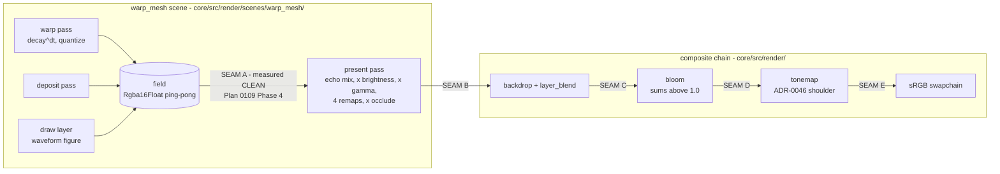

# 0111 — The MilkDrop import stops washing out

> **Status:** done — 2026-08-20. Phases 1, 2, 4 and 5 landed across seven commits
> (`b8c8524`..`afc65d6`); Phase 3 did not run, on Phase 2's stop condition; **Phase 6 is void
> rather than un-run** — see its section. Mode 4 review: **no blockers, one major, two minors.**
> The plan's premise did not survive it: the wash is at the **field**, not downstream.
> **Created:** 2026-08-19
> **Owner skill(s):** dev, human
> **Related ADRs:** none yet, deliberately — Phase 3 writes one (**ADR-0120**) if and only if the
> Phase 2 bisect names a stage whose semantics are a decision rather than a defect. Reads against
> [0118](../../adrs/0118-the-milkdrop-feedback-field-quantizes-in-the-encoded-domain.md) (the
> quantizer), [0119](../../adrs/0119-the-video-echo-blends-toward-its-copy-rather-than-adding-it.md)
> (the echo blend), [0046](../../adrs/0046-linear-light-hdr-composite-bloom-tonemap.md) (the tonemap) and
> [0071](../../adrs/0071-a-numeric-test-contract-states-a-property-or-names-its-machine.md) / [0074](../../adrs/0074-a-ratio-against-an-in-run-control-is-not-automatically-portable.md)
> (what a numeric assertion in here is allowed to claim).
> **Closes:** design-backlog 0121, 0119, 0120. **0113 is carried, not closed** — it closes only if
> Phase 3 runs *and* lands a mechanism; on the Phase 2 stop branch it takes a second dated update.

## TL;DR

The MilkDrop import's dominant remaining defect is the wash: five of Plan 0108's seven judged pairs
came back with a background that equilibrates far brighter than the reference's, and after two plans
nobody can say which stage does it. [Plan 0109](0109-the-milkdrop-import-gets-its-geometry-back.md)
Phase 4 built the instrument and **ruled the field itself clean**, which leaves the whole downstream
chain — present, blend, bloom, tonemap — as one undifferentiated suspect. This plan bisects that
chain with one statistic measured at five seams, stops the moment a seam separates a washed
conversion from the clean control, and fixes what the bisect names. Alongside it the three smaller
named defects land: the `decay` fallback's units error (first, because it corrupts instruments), the
`ang` branch cut's handedness, and the waveform figure's missing scale constant. A fourth look gate
judges the result.

## Context & problem

Four MilkDrop entries are live on the backlog and all four are fidelity, not reach:

| Entry | Claim | State entering this plan |
|---|---|---|
| [0113](../../design-backlog.md) | the converted feedback field equilibrates far brighter than the reference's | **High.** Instrument built; field ruled clean; three hypotheses dead |
| [0119](../../design-backlog.md) | `ang`'s branch cut on +x seams every per-vertex program continuous in it | Medium; shows on two MD1 presets carrying no shader block |
| [0120](../../design-backlog.md) | the converted waveform figure renders larger than the reference's | Medium; `fWaveScale` applied as a bare multiply |
| [0121](../../design-backlog.md) | a bundle that never names `decay` reads a per-frame default as a per-second one | Low-medium; latent for content, **has already corrupted one instrument** |

**What Plan 0109 Phase 4 actually bought.** `PingPongField` carries `COPY_SRC` and a test-only
`read_texture`; `warp_mesh/tests.rs` drives the scene directly, copies the field after every frame
and decodes it with `read_back_linear`, which does not clamp at 1. With the quantizer on, the field
converges by frame 120 and a zooming tunnel's background sits at `1e-6` linear and stays there. So
the field is not the wash, and neither is the decay multiply's domain
(`the_decay_domain_is_not_the_wash` derives both predictions and measures which one the frames ran
with). Phase 4's own live hypothesis — that a converted warp shader applies `decay` only when its
HLSL names it — was **falsified by census at the close**: the five washed presets carry no `warp_`
or `comp_` block at all.

**So the remaining suspect is everything between the field and the pixel, and nothing has looked
there.** That is four stages, in this order, and each is a plausible wash on its own arithmetic:

1. the **present pass** — the echo mix, then `× brightness × gamma`, then the four composite
   remaps, then `× occlude` on alpha;
2. the **backdrop + `layer_blend`** composite;
3. **bloom**, which sums above 1.0 freely by design;
4. the **tonemap** (ADR-0046), whose shoulder is what turns unbounded linear light into a picture —
   and therefore what turns a too-large linear value into a *bright wash* rather than a clip.

### One code fact worth stating before `dev` rediscovers it

`gamma` is applied as a **linear multiply**, not as a power:

```wgsl
// core/src/render/scenes/warp_mesh/mod.rs — PRESENT_SHADER, pp.a.z is gamma
var col = c.rgb * max(pp.a.x, 0.0) * max(pp.a.z, 0.0);
```

`milkconv/src/convert.rs:77` maps `fgammaadj` to `gamma` and `core/src/milk/outputs.rs:115` declares
it `Plain`, so the authored value arrives unconverted. A preset with `fGammaAdj = 1.9` therefore
takes a **1.9x unclamped linear gain on the whole composited field, feeding a tonemap whose shoulder
then spreads it** — which has the right sign, sits at the right place in the chain, and is named
"gamma" while performing a multiply. That last part is exactly the prose hazard ADR-0071's rule keeps
catching a level down.

**It is a lead, and the evidence is genuinely mixed.** All seven judged presets, read from the
corpus at their pinned paths (see Phase 6), against Plan 0109's Phase 5 verdicts:

| preset | `fGammaAdj` | `fDecay` | echo | 0109 verdict |
|---|---|---|---|---|
| *Blur Mix 3* | **1.0** | 1.0 | 0.0 | fixed — the clean control |
| *Songflower (Moss Posy)* | **1.0** | 1.0 | 1.0 | fixed, after the echo blend |
| *Contortion (Escher's Tunnel Mix)* | **1.0** | 0.99 | 0.0 | better, **still too bright** |
| *chasers 19 Portal* | 1.28 | 0.96 | 0.0 | fixed |
| *Fog Tunnel* | **1.8** | 0.98 | 0.4 | **still washed** |
| *Cosmic Dust 2* | **1.9** | 0.98 | 0.0 | **still washed** |
| *Cauldron painterly 5* | **2.7** | 0.98 | 0.0 | better, holds |

Gamma separates the two still-washed presets from the two clean ones and is **contradicted twice**:
*Cauldron painterly 5* carries the highest value in the set and reads fine, and *Contortion* washes
at unity — which is the backlog entry's own stated counter-evidence, and reading the file confirms it
rather than overturning it. So gamma is a lever the bisect must measure at seam B, **not a
diagnosis**, and a fix that only makes *Fog Tunnel* and *Cosmic Dust 2* better while leaving
*Contortion* bright has not found the wash.

Note also, against naive expectation, that the two clean controls are the two presets with
`fDecay = 1.0` — which converts to this engine's `MAX_DECAY` ceiling, essentially no fade at all.
Whatever the wash is, it does not track how much of the past survives.

## Decision

**We bisect the chain with one statistic and stop at the first seam that separates a washed
conversion from the clean control**, then fix the mechanism that seam names. We rejected *commit to a
fix in this plan* because every prior attempt on this defect that started from a candidate mechanism
has been falsified — three hypotheses are already dead and a fourth died at Plan 0109's close — and a
plan that must land a change ends by tuning until a picture matches. We rejected *diagnosis only, fix
in a successor plan* because the bisect's stop condition already gives the plan an honest exit, and
forbidding a fix that the evidence hands us would cost a whole extra plan cycle for nothing.

The three smaller defects run as their own phases in the same plan rather than as three plans,
because they touch the same four files and would otherwise contend. **Reach is out of scope** —
backlog [0109](../../design-backlog.md) (disk textures, 1 826 files) and [0108](../../design-backlog.md)
(the conversion tail) stay filed, on the ordering those entries themselves argue for: two look gates
have now returned *"still merely different"*, and reach is only worth buying once quality is judged
better.

## Architecture diagram



## Implementation phases

### Phase 1 — `decay`'s fallback converts, so an instrument can be trusted

- **Owner skill:** dev
- **What:** Closes backlog 0121. `FrameOutputs::read`'s `None` arm returns the seeded default
  **unconverted**, into a field whose own doc says "per second here" — so a bundle that never names
  `decay` fades at `0.98`/s (about `0.9997` per frame) instead of `per_second_factor(0.98) = 0.5455`.
- **Why it is first:** Phase 2's probe drives bundles directly, and Plan 0109 Phase 4 already ran an
  entire experiment through this bug — its reported fade numbers could not be reproduced from the
  committed code until the close review found it. Every later measurement in this plan is worth less
  until this lands.
- **Files touched:** `core/src/milk/outputs.rs`; whichever goldens move.
- **Done when:** the `None` arm converts through the same `convert` the `Some` arm uses, so the
  fallback is in the same vocabulary as the resolved value; a test drives a bundle naming no `decay`
  and asserts the field it reads back equals `convert(default, Rate::Factor, default)` **exactly**
  (both sides computed from the table, not from a literal — the point of the table is that a value
  cannot silently read its neighbour); and the commit message **names every fixture whose golden
  moved** and why that fixture's bundle omits `decay`. If no golden moves, say so — that is a claim
  about the fixture set, and it is checkable.
- **Amended 2026-08-19, twice, and the second amendment replaces the first.** The fix changes what
  `field_trace`'s un-overridden `decay` means, so Plan 0109 Phase 4's two quantizer probes go red.
  The first amendment read that as the probes having been *miscalibrated* and ordered them restated;
  **that was wrong.** `field_trace` takes a `decay_per_second` override and documents, in the comment
  above the call site, that the `None` fallback is near-unity and unusable for a fade experiment —
  so the probes were neutralizing `decay` **deliberately**, to isolate the quantizer. The repair is
  therefore to make that configuration explicit, not to restate anything:
  - **Also touched:** `core/src/render/scenes/warp_mesh/tests.rs`, plus `core/src/milk/tests.rs`
    for Phase 1's own test.
  - Both probes pass a named `NEUTRALIZED_DECAY = Some(0.98)` whose doc comment says why it is
    stated rather than defaulted. **Their names, claims, thresholds and recorded tables are
    unchanged** — the explicit value reproduces every committed digit, verified.
  - **Done when**, additionally: both probes pass unmodified apart from that argument, and the full
    workspace suite is green. Phase 1 lands as one commit, since the fix and the probes it re-aims
    cannot separate without leaving the suite red.
  - The measurement that *did* come out of this — the same field under a realistic converted
    `decay` — is recorded as
    [ADR-0118](../../adrs/0118-the-milkdrop-feedback-field-quantizes-in-the-encoded-domain.md)'s third
    `Outcome`, which also records the retracted first reading. Nothing in that ADR's Decision moves.

### Phase 2 — the wash bisect: one statistic at five seams

- **Owner skill:** dev
- **What:** Carries backlog 0113. Measure the same quantity at each seam of the chain, for a washed
  conversion and the clean control, and name the first seam at which they separate.
- **The statistic is the one that already exists:** `FieldTrace`'s `edge` — the mean over the
  outermost ring of texels, which is the background, where a centred deposit puts nothing. Using one
  statistic at every seam is the whole design: the numbers are then comparable across stages, and the
  quantity compared is always linear light against linear light (ADR-0074's same-kind requirement,
  which the dual-live ratio failed by comparing two terms that responded to the machine differently).
- **The two subjects:** *Geiss - Fog Tunnel* (still washed, and its defect is legible — the reference
  draws a skeleton of discrete concentric rings where this draws a solid tube, so the gaps between
  the rings **are** the background) and *Geiss - Blur Mix 3* (the clean control). Same signal, same
  hop, same size, same adapter, one run.
- **Files touched:** `core/src/render/scenes/warp_mesh/tests.rs` or a new `core/tests/milk_wash.rs`
  (`dev`'s call — seams B through E need a `Renderer`, which the scene-level probe deliberately does
  not have); read-back plumbing under `core/src/render/` as the seams require.
- **Done when:** the probe reports the `edge` statistic at seams A through E for both subjects, and
  the phase **names the first seam at which the washed/control ratio departs from what that ratio was
  at seam A**. The tolerance is **derived from the instrument, not chosen**: repeat the same capture
  three times and take the observed spread as the floor a departure must clear. Record the whole
  five-seam table in the plan's implementation log, whatever it says.
- **Stop condition — an honest exit, not a failure.** If no seam separates them, the phase stops. It
  records the five-seam table on backlog 0113 as a second dated update, Phase 3 does **not** run, and
  **Phases 4, 5 and 6 run anyway** — the stop ends the wash line, not the plan.
- **A stated lead, to be measured and not assumed:** seam B carries the `× gamma` linear multiply
  above. If seam B is where they separate, that is where to look first. If seam B is clean, gamma is
  dead as a wash mechanism and the log says so — which is worth almost as much, because it is the
  last candidate anyone has named.
- **A stated assumption:** the `edge` statistic reads the background only for a figure that does not
  fill the frame. *Fog Tunnel* qualifies. Put that in the probe's doc comment, so the next person who
  points this instrument at a frame-filling preset knows what it will measure instead.

### Phase 3 — the fix the bisect names

- **Owner skill:** dev
- **What:** Conditional on Phase 2 naming a seam. Change the arithmetic at that seam so it computes
  what the reference computes.
- **Files touched:** determined by Phase 2. Most likely `core/src/render/scenes/warp_mesh/mod.rs`
  (present shader), `core/src/milk/outputs.rs`, or `milkconv/src/convert.rs`.
- **Done when:** the mechanism is written down **as arithmetic** — what the reference computes, what
  this engine computes, and the one difference — *before* any code changes; the change makes this
  engine compute the stated thing; and a test asserts **that arithmetic**, not a picture. What a
  preset's authored value maps to is a property, and a property is assertable without a capture.
- **The hard guard: no tuning to a picture.** If the bisect names a *seam* but no mechanism survives
  being written down as arithmetic, this phase stops exactly as Phase 2 does and records the seam. A
  change that makes *Fog Tunnel* look right without a stated mechanism is worse than no change,
  because at the next gate it is indistinguishable from a fix.
- **ADR trigger:** if the named stage's behaviour is a *decision* rather than a defect — the most
  likely instance being "what `fGammaAdj` means when our target is linear and the reference's was
  8-bit display-referred" — this phase writes **ADR-0120**, against Phase 2's evidence rather than
  guessed up front. That placement is Plan 0106's shape and it is deliberate.
- **Bless scope:** a change at seam B or later moves every `warp_mesh` golden and possibly others.
  **Compare adapters before blessing** — a probe that adds render targets is precisely the shape that
  has twice produced a confidently wrong WARP picture here while hardware was correct, and a golden
  suite blessed under that condition blesses garbage.

### Phase 4 — `ang`'s handedness is measured, and only then is the seam a defect

- **Owner skill:** dev
- **What:** Closes backlog 0119. `vertex_position` computes `ang = atan2(py, px)` and lifts the
  negative half by `TAU`, so `ang` is `0..tau` with a discontinuity along +x. The seam runs centre to
  right edge on *Songflower (Moss Posy)* and reads full-width on *chasers 19 Portal* (that preset's
  own fold mirrors it) — both MD1 presets with no shader block, so `emit.rs` never runs and Plan
  0108's reading of this symptom is superseded.
- **The actual question, and it is not whether the cut exists.** The reference has the same branch cut
  in `atan2`, so MilkDrop presets are *authored against* a discontinuity at +x. What this engine also
  does is **flip y deliberately** — `let py = (0.5 - y) * 2.0`, commented *"so `ang` reads the way it
  looks"* — a convention authored for **this engine's** preset grammar, not for converted content. If
  the handedness differs from the reference's, then every angle-driven per-vertex program in the
  corpus runs mirrored and the seam is a *symptom* of that, not the defect.
- **Files touched:** `core/src/render/scenes/warp_mesh/mod.rs`, `core/src/render/scenes/warp_mesh/tests.rs`,
  possibly `milkconv/src/` if the correction belongs in the conversion rather than in the scene.
- **Done when:** a test pins this engine's `ang` against the reference's construction — **derived from
  the source format's convention or from the reference implementation, with the source named in the
  test's doc comment, never from a picture** — and states in one sentence whether the cut's location
  and its handedness agree.
  - **If they agree:** the phase changes no behaviour and records that the seam is authored-against.
    That is a complete outcome. **Do not smooth the wrap** — the entry says so, and it would break
    every preset that uses the cut deliberately.
  - **If they disagree:** the phase corrects the handedness and blesses what moves, with the same
    adapter comparison Phase 3 owes.
- **Prose guard:** whatever the test concludes, it must not attribute a convention to "MilkDrop" in
  general when it was read off one version of one implementation. Name the version. That is ADR-0071's
  rule applied to a comment, which is the level down where it keeps getting missed.

### Phase 5 — the waveform's scale constant, and whether the x-extent is a second defect

- **Owner skill:** dev
- **What:** Closes backlog 0120. `draw.rs` applies `*slot = held * scale` straight from `fWaveScale`
  onto a trace already normalized to `-1..1`, with no normalization constant and no comment on units.
- **The evidence that this is not one defect, and it is stronger than the entry recorded.** Two pairs
  reported an oversized figure independently, and the complaint does not scale with the authored
  value: *Blur Mix 3* (`fWaveScale = 3.266`, `nWaveMode = 6`) read as *less* wrong than *Cauldron
  painterly 5* (`1.139`, `nWaveMode = 5`). Across the seven pinned presets the authored value spans
  **0.0117** (*chasers 19 Portal*) to **3.266** — a factor of 279. A bare multiplier on a `-1..1`
  trace would make the low end invisible, and it is not, so `fWaveScale` is not a bare multiplier and
  the constant may well be mode-dependent. Separately, *Blur Mix 3*'s **crisp trace spans roughly the
  middle 57 % of the frame** while its blurred halo reaches the edges, where the reference draws
  full-width traces — amplitude and extent are different quantities and may have different causes.
- **Files touched:** `core/src/render/scenes/warp_mesh/draw.rs`, `milkconv/tests/draw_layer.rs`.
- **Done when:** the reference's normalization is **derived**, with its source named in the code
  comment, and applied; and the x-extent question is answered either "the same defect" (shown, by the
  corrected constant also correcting the span) or "a second one" (**filed as a new backlog entry**,
  with what was measured). `milkconv/tests/draw_layer.rs` already builds the figure as geometry, so
  both the amplitude and the span are assertable without a capture.
- **If the constant is not derivable** from a source available to `dev`, the phase says so, changes
  nothing, and the entry stays live. That is the correct outcome — matching a picture would produce a
  number that is right for one preset at one wave mode and wrong for the corpus, and nothing
  downstream would ever notice.

### Phase 6 — the look gate, fourth time

- **Owner skill:** human
- **What:** The same seven pairs, the same rig (`foo_vis_milk2` 0.2.0.0, DX11, beside release
  `lmv.exe`), the same three-variant judging set as Plan 0108 and Plan 0109 Phase 5.
- **Pin the playback volume, and record it with the verdicts — added 2026-08-19 by `dev`, from a
  live-app check, and it is not optional.** The waveform is the one un-normalized analysis output
  (design-backlog [0123](../../design-backlog.md)), so on the standalone's loopback path **the OS master
  volume slider changes the picture**. Measured on the development box: one instance, one preset, one
  clip, ten seconds apart, volume the only variable — at 18 % *Blur Mix 3*'s trace is a near-flat
  ribbon and at 60 % it swings roughly `±40 %` of frame height. Three of the seven pairs are
  waveform-led, so a gate run at an unpinned volume judges the volume as much as the conversion, and
  its verdicts are not comparable with Plan 0108's or Plan 0109's — **which were themselves run at
  volumes nobody recorded.** Set one level, write it down beside the verdicts, and do not touch it
  between pairs or between variants. The reference side needs the same treatment for the same reason.
- **Pin the reference by full path.** Plan 0108's gate lost a pair to *Geiss - Cosmic Dust 2 - Trails
  5b* being judged against the plain preset, and authoring this plan **very nearly repeated it** — a
  loose search matched *beta106i - Contortion (Wind Up)* and reported a `fGammaAdj` that would have
  made gamma look like a clean answer. All seven sit in one directory,
  `WORK/milkdrop-corpus/milkdrop-original/Milkdrop-Original/`:

  | | file |
  |---|---|
  | 1 | `Aderrasi - Contortion (Escher's Tunnel Mix).milk` |
  | 2 | `Aderrasi - Songflower (Moss Posy).milk` |
  | 3 | `Eo.S. + Phat - chasers 19 Portal.milk` |
  | 4 | `Geiss - Blur Mix 3.milk` |
  | 5 | `Geiss - Cauldron - painterly 5.milk` |
  | 6 | `Geiss - Cosmic Dust 2.milk` |
  | 7 | `Geiss - Fog Tunnel.milk` |

- **Done when:** a verdict per pair, plus answers to five questions:
  1. **Is the wash reduced on *Fog Tunnel* and *Cosmic Dust 2*?** Phase 3's acceptance case on real
     content — and specifically, does *Fog Tunnel*'s tunnel read as **discrete concentric rings**
     rather than as a solid tube.
  2. **Does *Contortion* still read too bright?** It washes at `fGammaAdj = 1.0`, so if Phase 3 landed
     a gamma fix and this pair is unchanged, the wash has more than one home. Also: **is the black ray
     artifact on the four frame edges still there?** Backlog 0113 retracted it *provisionally* as a
     presentation of the wash (`ob_size = ib_size = 0.01` in pure black, dragged inward stroke on
     stroke); this gate can settle it.
  3. **Is the seam gone on *Songflower* and *chasers 19 Portal*** — or, if Phase 4 concluded the
     handedness agrees, does it read as something the author placed rather than something we added?
  4. **Is the waveform figure the right size on *Blur Mix 3* and *Cauldron painterly 5*,** and does
     *Blur Mix 3*'s crisp trace now reach the frame edges?
  5. **Better, or still merely different?** Plan 0100 Phase 7 and Plan 0108 Phase 2 both returned
     *merely different*. A third *merely different* is a **product finding about the import's value**
     and must be recorded as one — it is the evidence backlog 0109 says to weigh before spending a
     plan on reach.
- **Cosmic Dust 2's hue is not evidence and must not be judged.** It drives `wave_r`/`wave_g`/`wave_b`
  from three independent LFOs on `time` at incommensurate ~4-7 s periods, so two renderers started at
  different moments are simply out of phase. Judge its **background level**, not its colour.

- **Not run, and VOID rather than deferred — recorded at the close, 2026-08-20 by `architect`.**
  This gate compares seven converted presets against the reference. **After this plan, not one of
  them renders a single pixel differently than it did before it**, so there is nothing for the gate
  to judge and running it would reproduce [Plan 0109](0109-the-milkdrop-import-gets-its-geometry-back.md)
  Phase 5's verdicts at a newly-pinned volume.

  That is arithmetic, not an estimate. The plan landed exactly one behavioural change — Phase 1's
  `decay` fallback — and it is **unreachable from a converted preset**: `convert.rs`'s prologue
  emits an assignment for every output carrying a non-empty initial-condition key, `fdecay` is
  `o("fdecay", "decay", 0.98, true, "")` with the key populated, so the slot always resolves `Some`
  and always took the converting arm. Phases 2, 4 and 5 shipped tests and one `#[cfg(test)]`
  accessor. Phase 3 did not run.

  Question by question: 1, 3 and 4 ask whether a fix worked, and no fix landed. 5 asks *better or
  merely different*, and nothing moved since the answer was last taken. Only question 2's **black-ray
  artifact** sub-question is independent of a fix — and it is one sub-question, not a seven-pair
  gate.

  **What is re-filed, and where.** The gate itself belongs to the successor that takes backlog 0113's
  reversed direction (the field), because that plan will land a change worth judging; it is named in
  Followups below and on 0113's Phase 2 update. The volume pinning above is not lost with it — it is
  [backlog 0123](../../design-backlog.md), an `architect`-owned entry with its own priority. The
  black-ray sub-question stays on 0113, where Plan 0109 filed it.

## Data shapes

```rust
// illustrative — not the final interface
/// One subject's background level at each seam of the chain, in linear light.
/// The same statistic throughout (`FieldTrace::edge`), so the washed/control
/// comparison at any seam is same-kind (ADR-0074) and the seam-to-seam
/// comparison is a ratio of two dimensionless ratios.
struct SeamTrace {
    a_field: f32,   // after warp/deposit/draw - known clean (Plan 0109 Phase 4)
    b_present: f32, // after echo mix, x brightness, x gamma, remaps, occlude
    c_blend: f32,   // after backdrop + layer_blend
    d_bloom: f32,   // after bloom
    e_tonemap: f32, // after the tonemap shoulder
}
```

## Risks & open questions

- **The bisect names no seam.** Real, and the stop condition is the answer: the five-seam table is
  itself worth having, because it converts "somewhere downstream" into "not at any of these five",
  which is the first thing anyone will have been able to say about this defect since Plan 0100.
- **A fix at seam B or later moves goldens broadly** — every `warp_mesh` baseline at minimum. Budget a
  bless, and **compare adapters before blessing**. This project has twice had WARP produce a
  confidently wrong picture that hardware rendered correctly: once when a new pass's bind-group layout
  aliased a live pipeline's, once when building GPU resources mid-run shifted what the trails stage
  resolved to. Phase 2 adds render targets, which is exactly that shape.
- **Phase 4 may correctly change nothing.** If the handedness agrees, the phase's product is a test
  and a sentence. That is a full phase and must not be padded into a change — "the seam is
  authored-against" is a finding the next three sessions would otherwise re-litigate.
- **Phase 5 may correctly change nothing**, for the same reason, if the constant is not derivable.
- **Two of the four defects may be one.** If the wash lives in the present pass's arithmetic, the
  `ang` seam's visibility could move with it — a seam is only visible against a background. Phase 6
  judges the result, not the phases; do not attribute a pair's improvement to a phase without evidence
  that it was that phase.
- **The wash may not be a single mechanism.** *Contortion* at `fGammaAdj = 1.0` is the standing
  argument that it is not. The plan is built to survive that: the bisect names *a* seam, and if a
  second subject separates at a different seam, that is a second entry rather than a failure.

## What this plan does NOT do

- **Conversion reach.** Backlog [0109](../../design-backlog.md) (disk textures — 1 826 files, 88.7 % of
  every conversion failure, and ADR territory because it reopens Plan 0100 Phase 8's deferred
  provenance question) and [0108](../../design-backlog.md) (HLSL arrays, ~71 files, plus 218 MD2 presets
  that convert but render blank) both stay filed. The ordering is the entries' own: reach is worth
  buying after quality is judged better, and Phase 6 question 5 is that judgement.
- **It does not reopen** ADR-0118's quantizer or ADR-0119's echo blend. Both were measured, and both
  measurements survived Plan 0109's close review.
- **No new scene, no new param, no C ABI change, no preset content.** `preset-author` has nothing to
  do here; a converted preset is generated, not authored.
- **It does not re-judge the geometry fixes Plan 0109 landed.** That plan's Phases 1, 2 and 3 read as
  fixed on real content and are not in this plan's gate questions except where a pair is shared.

## Contention

`core/src/render/scenes/warp_mesh/**`, `core/src/milk/outputs.rs`, `milkconv/src/convert.rs`,
`milkconv/tests/draw_layer.rs`. **No active plan touches these** —
[0104](0104-the-library-stops-being-lopsided.md) authors `presets/*.toml` (including the four
`warp_mesh` worlds, which read the params this plan may re-mean: if Phase 3 changes what `gamma`
does, tell that lane), and [0106](0106-the-frame-stream-passes-through-a-diffusion-model.md) is
`tools/` + `docs/` only. Safe to run in a worktree lane alongside either.

## Implementation log

### Phase 1 — done in the working tree, **not committed**, and it is blocked on an ADR question

Written 2026-08-19 by `dev`, in the lane `WORK/lmv-plan-0111` on branch
`plan-0111-milkdrop-wash`, branched from `5cf592d` at v0.75.0.

**The change.** `FrameSlots::read`'s `None` arm now returns
`convert(d.$field, Rate::$rate, d.$field)` rather than `d.$field`. `convert` widened to
`pub(super)` so the test can assert against the same function both arms use. Two doc comments
record the why. Verified both ways: with the fix an unnamed `decay` reads `0.54548466`; with the
arm reverted it reads `0.98`. The new test is
`milk::tests::an_unnamed_rate_converts_like_a_written_one`.

**No golden moved, and that is a claim about the fixture set rather than missing coverage.** The
golden set carries exactly two `[milk]` fixtures — `warp_mesh_milk` and `warp_mesh_shader` — and
**both declare `decay` in their `.regs` roster**, so both slots resolve to `Some` and both already
took the converting arm. The only fixture whose bundle omits `decay` is
`warp_mesh_lit_backdrop.toml`, whose `[milk]` table is empty by design, and it has no golden. No
preset in `presets/*.toml` carries a `[milk]` block at all.

**What it broke: 2 of 945 tests**, both Plan 0109 Phase 4 field probes, both in
`warp_mesh/tests.rs`. Full `--no-fail-fast` workspace sweep otherwise green, goldens and all four
preset gates included.

- `the_field_equilibrates_only_when_the_quantizer_runs` — the OFF-arm guard
  `off.f300.mean > off.f120.mean * 1.5` reads `0.2929` against a required `0.3351`.
- `the_quantized_background_stays_black` — the OFF-arm guard
  `off.f300.edge > off.f30.edge * 4.0` reads `0.000110` against a required `0.000128`.

In both cases the test's **primary** assertion still passes. What fails is the control-arm guard
that exists to prove the instrument still has dynamic range.

**Corrected before the commit landed.** The three paragraphs below read the two red probes as having
been calibrated against the defect, and concluded that ADR-0118's mechanism sentence was overstated.
**Both readings were wrong**, and the thing that settles it is four lines above the probes' own call
site: `field_trace` takes a `decay_per_second` override precisely because the `None` fallback is
near-unity, and says so. The probes were neutralizing `decay` **on purpose**. What the fix changed is
the meaning of the value they took for free — so the repair is one named argument, and their claims,
names, thresholds and tables all stand. `NEUTRALIZED_DECAY = Some(0.98)` reproduces every committed
digit. The measurement below is still correct and still worth having; it just describes a **second**
configuration rather than correcting the first, and it is recorded that way in ADR-0118's third
`Outcome`. Kept here rather than deleted, because the mis-reading is the instructive part: a probe
that looks miscalibrated may be deliberately configured, and the call site is where to check.

**The second configuration, measured rather than argued.** The control trace extended from 300 to
900 frames, at the converted `decay` a real bundle runs at:

```text
  off  f150 0.2461   f300 0.2929   f450 0.2963   f600 0.2963   f899 0.2963
```

**With a correct `decay` the unquantized field converges** — flat to four decimals from frame 450.
Under the bug the per-frame retention was `0.98^(1/60) = 0.99966`, a time constant near 2 900
frames, so at frame 300 the field was about a tenth of the way to its equilibrium and read as an
unbounded integrator. Corrected, retention is `0.5455^(1/60) = 0.98995`, a time constant near 100
frames. **This is a second configuration, not a correction of the probes'** — see the retraction
above.

**What it does and does not put in question.** ADR-0118's decision stands, its Context stands, and
the quantizer does demonstrable work in **both** configurations. With `decay` neutralized it is the
only bound at all. With `decay` converted the field settles either way, and the quantizer's
contribution is a settling point `2.28x` lower (`0.1298` against `0.2963`) and a background `90x`
lower, at exact black (`1.237e-6` against `1.115e-4`). The earlier draft of this log said `110x`; it
was read off rounded output, and the measured figure is `90x`.

**The repair, and why it is one argument rather than a restatement.** Both probes now pass a named
`NEUTRALIZED_DECAY = Some(0.98)` instead of `None`. Names, claims, thresholds and recorded tables are
all unchanged, and the explicit value reproduces every committed digit of both doc-comment tables —
checked against the committed numbers, on hardware, where they had been recorded on WARP. The
constant carries a doc comment explaining why it is stated rather than defaulted, so the next change
to the fallback cannot silently re-aim these two.

**The general lesson, which is the part worth keeping:** a probe that looks miscalibrated may be
deliberately configured, and `field_trace`'s call site said so in a comment four lines up. Read the
harness before concluding the experiment was wrong.

**Phase 1 lands as one commit** — `core/src/milk/outputs.rs`, `core/src/milk/tests.rs`,
`core/src/render/scenes/warp_mesh/tests.rs`. Phases 2 through 5 are untouched and unstarted.

### Phase 2 — the bisect ran, and it **stopped**: the wash is not downstream

**The five seams are three, measured.** Every post stage reports `active` only above zero and neither
converted subject binds `bloom`, `trails` or any kaleidoscope param; with no stage active
`PostChain::begin` hands the scene the tonemap's own input, so seams B, C and D are **one texture**.
`bg_bright` defaults to `0` and neither binds it, so the backdrop contributes nothing. The chain is
`field -> present pass -> tonemap -> display`: two stages.

```text
  seam        fog tunnel    blur mix 3    ratio     (hardware, 3 runs, bit-identical)
  A field     0.29798886    0.01990991    14.967
  B present   0.52298039    0.08744538     5.981
  E display   0.74454564    0.25118530     2.964

  seam        fog tunnel    blur mix 3    ratio     (DX12 WARP)
  A field     0.29793853    0.01192657    24.981
  B present   0.52290142    0.05914328     8.841
  E display   0.74456638    0.24515122     3.037
```

**No seam departs upward.** The ratio is maximal at the field and falls monotonically on both
adapters. The present pass and the tonemap **compress** the separation rather than creating it, so
**Phase 3 does not run** and Phases 4, 5 and 6 do — the stop condition, taken as written.

**The stop is not the one the plan drafted, and the difference matters.** The plan's branch was "no
seam separates them". These two separate by `15x` — at **seam A**, the seam this plan treats as ruled
clean. Plan 0109 Phase 4's probe drives `MilkBundle::from_assembly(None, None, None)`, an **empty**
bundle with synthetic params, so its `1e-6` background describes a stand-in and not any preset. On
*Fog Tunnel*'s own bundle the field background reads `0.298` — and backlog 0113 predicted exactly
that magnitude from the look gate ("three orders of magnitude above" the `3.03e-4` floor) before
anyone could measure it. **The built-in warp path is back in scope**, which is a redirection this
plan has no phase for; it is recorded on 0113 as a dated update and is the successor's question.

**The seam-B lead is dead as a wash mechanism.** `gamma` is a `1.9x` linear multiply and *Fog Tunnel*
carries `1.8`, so seam B was the plan's named suspect. The ratio *falls* across it. Gamma may still be
wrong on its own terms — that is Phase 3's ADR question and Phase 3 did not run — but it does not make
the washed subject diverge from the control.

**Instrument.** `core/src/render/milk_wash.rs`, `#[cfg(test)]`, plus two committed fixtures converted
from the pinned corpus paths. Seams B and E needed no plumbing: `Tonemap::src_texture()` already
existed and the display comes from `capture_preset`. Seam A needed one `#[cfg(test)]` method on the
`Scene` trait — gated so the shipped extension seam (ADR-0002) is unchanged, and taken instead of a
`dyn Any` downcast because the plan requires all seams from **one run**. No probe adds a render
target, which is what keeps this clear of the adapter hazard the plan's Risks name.

**Asserts no threshold** (ADR-0071), for two measured reasons: the hardware readings are
bit-identical across three runs, so there is no spread to derive a tolerance from; and *Blur Mix 3*
alone diverges `1.67x` between adapters at the field, so any ratio threshold would be
adapter-dependent.

**One gate is red and `dev` left it alone.** `check-backlog-claims.mjs` reports entry **0121**'s probe
broken at `docs/design-backlog.md:2446` — it asserts `present: None => d\.\$field`, the defect Phase 1
removed, so it fired **on delivery** rather than on decay. 0121 is a `**Closes:**` entry and archiving
it is the close ceremony's step 3c, which is `architect`'s call.

### Phase 4 — `ang` is pinned, and the reference comparison is **not decidable here**

**Half the done-when is delivered, half is not, and the split is clean.**
`ang_cuts_on_plus_x_and_turns_counter_clockwise_on_screen` pins this engine's construction from
`vertex_position`'s arithmetic: the cut is on **+x** and is a real discontinuity of nearly a full
turn (asserted against its two neighbouring vertices), `ang` is continuous everywhere else on the
ring, and it increases **counter-clockwise as seen on screen** because y is flipped before the
`atan2`. Neither can now move silently, and `milkconv/tests/warp_geometry.rs` already holds the
emitted WGSL epilogue and the draw layer to the same y-down/y-up asymmetry.

**The comparison against the reference could not be made.** The phase required it be derived from the
source format's convention or the reference implementation, with the source named, and never from a
picture. Neither exists in this environment: the corpus is `.milk` files with no MilkDrop source and
no authoring documentation, and a corpus-wide search for a preset stating a rotation direction
returns two files, both building their own Kardan rotation from `q` variables rather than reading the
per-vertex `ang`. A `.milk` preset does not record the convention it was authored against.

So **neither** of the phase's two branches was taken. The seam is not corrected, and it is also not
recorded as authored-against — that second claim needs the half that is missing, and asserting it
would be exactly the prose error ADR-0071's rule catches. Backlog 0119 stays live. What would settle
it, most direct first: MilkDrop 2's `milkdropfs.cpp` mesh setup, where the sign of the `y` handed to
`atan2f` is one line; the authoring documentation; or one reference capture of a deliberately
handedness-revealing preset, which is a look-gate artifact and not a test.

### Phase 5 — the entry splits: the x-extent is a second defect, the constant is not derivable

**The x-extent is a second defect and it is now backlog 0122**, shown by arithmetic rather than by a
picture. Modes 6/7 place points at `t = i/(count-1) - 0.5` and divide x by `aspect`; `uv_to_world`
multiplies x **by** `aspect`; the two cancel, so the trace's world length is `2.0` at every aspect
while the frame is `2 * aspect` wide. The trace covers `1/aspect` of the width — `0.5625` at 16:9,
which is the "middle 57 %" Plan 0109's gate reported. **The trace is normalized to the frame's height
rather than its width**, and at aspect 1 that is full width, which is why nothing caught it — the
ADR-0037 coincidence one level down. Pinned by
`a_straight_wave_trace_spans_one_over_aspect_of_the_width` as a property over three aspects. It is
independent of `wave_scale`, which is what makes it a separate entry.

**The amplitude constant stopped**, on the branch the phase provides for it. No MilkDrop source and
no authoring documentation are available, and matching a picture was refused. But the corpus is an
available source and it narrows the question: across the **552** presets in `milkdrop-original` that
set `fWaveScale` the median is **0.9724** — unity — with `p10 = 0.01` and `p90 = 3.235`. So
`fWaveScale` is authored as a multiplier *about 1*, and what is missing is a single **base
amplitude**, not a per-preset or mode-dependent correction. That also weakens the entry's own "factor
of 279, so it cannot be a bare multiplier" argument: a tenth of the corpus authors near-zero scales
deliberately, and a near-flat trace is a visible flat line rather than an invisible one. Recorded on
0120; nothing changed.

**Two corrections made while writing the Phase 5 test**, both mine and neither in the engine: the
draw geometry is world space rather than uv, and taking only each segment's start point drops the
trace's final vertex. The first is what made the `/aspect` look uncancelled on a first reading.

### Close review, 2026-08-20 — seam E is in a different domain, so the "falls monotonically" reading is half a claim

**Phase 2's conclusion stands. One sentence supporting it does not, and it is recorded in three
places the successor will read.**

Seams A and B are linear-light means read back from `COMPOSITE_FORMAT` textures. Seam E is a mean of
**sRGB-encoded** 8-bit code values: `HEADLESS_FORMAT = Rgba8UnormSrgb`, and the probe forms it as
`f32::from(byte) / 255.0` under a local binding named `linear`, which it is not. A ratio of encoded
values and a ratio of linear values are **not the same kind of quantity** (ADR-0074), so `5.981` and
`2.964` cannot be placed on one monotone sequence.

The drop across that column is the transfer function by itself. Encoding seam B's two means gives
`E(0.523) = 0.750` and `E(0.0874) = 0.327` — ratio `2.294`, **below** the observed `2.964`. So the
encoding alone over-explains the entire fall from B to E; no stage is needed to account for any of
it, and the residual runs the other way (Jensen, on a concave map over a ring with spread).

**And the tonemap cannot have compressed anything here.** `KNEE = 0.6`, below which
`tonemap::map` is *exactly* the identity, and both subjects' backgrounds sit under it. The bound is
also empirical: *Fog Tunnel*'s `0.74454564` against a pure-encode prediction of `0.7504` leaves under
1 % for the tonemap and Jensen combined. So the log's *"the present pass and the tonemap **compress**
the separation"* is right about the present pass — `14.967 -> 5.981` is like-for-like and real — and
**unsupported about the tonemap**, which for these two subjects is a no-op.

**What survives, in full.** The stop condition fired correctly: no seam departs upward, the
separation is already `15x` at the field, and the redirection to the built-in warp path is the
plan's finding. That rests on the A→B comparison and on the absolute magnitude at A, neither of
which touches seam E. What the E column does *not* do is rule the tonemap in or out for a subject
whose background exceeds the knee — for these two it is ruled out by the knee, not by the bisect.

**Corrected on backlog 0113 in place.** Two artifacts still carry the overstatement and are one
comment each, left for whoever next opens them rather than patched from this lane: the doc comment
on `the_wash_bisect_reports_every_seam` in `core/src/render/milk_wash.rs`, and the `linear` binding
name in `seam_trace`. Both are named in Followups.

## Followups (after this lands)

Written at the close, 2026-08-20, replacing the three conditionals this section carried while the
plan was in flight — all three resolved.

- **The successor, and it is the real one: the wash is at the field.** Backlog
  [0113](../../design-backlog.md) reversed direction under Phase 2 and has no plan. It inherits Phase
  6's look gate, because it is the next work that will change what a converted preset renders.
  `architect` owns the interview.
- **Backlog [0119](../../design-backlog.md)** (`ang`'s handedness) and **[0120](../../design-backlog.md)**
  (the waveform's base amplitude) both stopped on the same wall — no MilkDrop source, no authoring
  documentation, and a `.milk` file does not record the convention it was authored against. **They
  are one procurement question, not two engineering ones**: `milkdropfs.cpp` settles both.
- **Backlog [0122](../../design-backlog.md)** — the mode-6/7 trace normalized to height, filed by Phase
  5, pinned by test, unfixed. It has a stated fix and needs the same reference to confirm it.
- **Backlog [0123](../../design-backlog.md)** — the un-normalized waveform and the two frontends'
  disagreement. `architect`-owned, wants an interview. It gates the *validity* of any future look
  gate, so it is worth taking before the successor's.
- **Two comments carrying the close review's corrected claim**, one line each, for whoever next
  opens the file: the `linear` binding in `seam_trace` holds sRGB code values, and the doc comment
  on `the_wash_bisect_reports_every_seam` says the tonemap compresses the separation when for these
  two subjects it is the identity. Not worth a session of their own; worth doing when the successor
  reopens `milk_wash.rs`, which it will.
