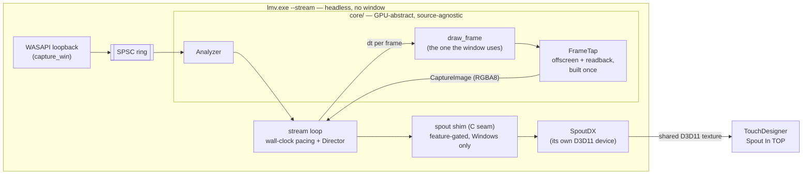

# 0115 — The engine becomes a live video source

> **Status:** done — closed 2026-08-30
> **Created:** 2026-08-25
> **Owner skill(s):** dev, human
> **Related ADRs:** [0125](../../adrs/0125-the-live-video-out-is-a-spout-sender-fed-by-a-frame-tap.md) (accepted, Outcome),
> [0146](../../adrs/0146-one-name-selects-the-gpu-and-each-side-matches-its-own-roster.md) (accepted, Outcome),
> [0115](../../adrs/0115-the-foobar-component-is-a-released-artifact-with-a-parameterized-sdk.md),
> [0114](../../adrs/0114-the-engine-renders-video-offline-and-delegates-encoding.md),
> [0001](../../adrs/0001-rust-core-wgpu-cabi-foobar-shim.md)
>
> **Closed 2026-08-30.** Eight phases including the added 3b, `b50592a`..`7e870aa` plus the close
> block's `bbbb5eb` and the out-of-band auto-rotate fix `64758ad`. Mode 4 review: **no blockers,
> two majors, three minors.** Verified at the close on the post-merge tree, not read off the log:
> `cargo fmt --all --check`, `cargo clippy --workspace --all-targets` and `cargo nextest run
> --workspace` all clean after `main` merged in, and the byte-identity and 300-frame residency
> tests were opened and read against the phases that named them. The two majors — the sender's
> adapter match being handed the description rather than the bare name, and `--stream` driving an
> unclamped `dt` where the window clamps at `MAX_DT` — are recorded in ADR-0146's Outcome and in
> Followups, and neither blocks the ship.

## TL;DR

`lmv --stream` runs the visualizer **headless** — no window, no swapchain — rendering live loopback
audio at a declared size and frame rate and publishing every frame as a **Spout sender**.
**TouchDesigner, on the same machine, picks it up with a Spout In TOP.** No codec, no network, one
or two frames of latency. The first user-visible behavior is Spout's own demo sender arriving in
TouchDesigner before a line of engine code is written; the first real one is this engine's picture
there, reacting to whatever is playing.

## Context & problem

The user wants this engine's video inside TouchDesigner, running on **the same Windows machine**,
with **no window** on our side. The engine becomes a headless source feeding somebody else's
composite — one step further out than
[NFR §10](../../nfr.md#10-live-performance-added-in-the-2026-07-21-follow-up-interview)'s "renders to
a projector", and the same live-show use.

Two things the engine already has make this small. `shot --render`
([ADR-0114](../../adrs/0114-the-engine-renders-video-offline-and-delegates-encoding.md), Plan 0101)
walks a clip headless, rendering through the same `draw_frame` the window presents through and
reading each frame back — with memory behaviour proven over 14,400 consecutive frames (Plan 0099).
And the foobar component ([ADR-0115](../../adrs/0115-the-foobar-component-is-a-released-artifact-with-a-parameterized-sdk.md))
already establishes how this repo takes on a third-party C++ SDK: fetched against a pinned hash,
never committed, staged by a script that CI and a developer run identically.

What is missing is a **wall clock** and a **sink**. The render path is driven by a file cursor at
whatever speed the machine manages — the property ADR-0114 was proud of, and the property a live
source must give up — and the frames have nowhere to go but a pipe.

**The transport question was asked twice and the second answer is the one that counts.** With
TouchDesigner on another machine over WiFi it is a bandwidth problem, and h.264 through `ffmpeg`
beats NDI by an order of magnitude. On one machine there is no link, no bandwidth problem, and no
reason to run a codec at all.
[ADR-0125](../../adrs/0125-the-live-video-out-is-a-spout-sender-fed-by-a-frame-tap.md) records the
decision, the three alternatives it beat, and the remote case that stays deferred.

## Decision

We add a **frame tap** to `core`'s render API — persistent offscreen target plus readback buffer,
drawn through the same `draw_frame` the window presents through, at a caller-supplied per-frame
`dt`, returning the `CaptureImage` every capture path already returns — and a **headless `stream`
mode** in the standalone that drives it from the live loopback ring at wall-clock cadence and
publishes each frame as a Spout sender through `SpoutDX`'s **CPU pixel** entry point.

**The tap is in `core`, the Spout sender is in `standalone`.** Spout is Windows, D3D11 and
third-party — everything the source-agnostic, GPU-abstract core rule forbids. That split is not
bookkeeping: it is what makes the tap transport-agnostic, so the deferred remote sink (ADR-0114's
`ffmpeg` pipe, already built for `--render`) attaches later without the core moving.

Two non-obvious calls, both stated in ADR-0125 with their exits. We take the **CPU pixel path, not
zero-copy** texture sharing, because zero-copy means unsafe `wgpu-hal` interop against a raw D3D12
device at the one seam [ADR-0001](../../adrs/0001-rust-core-wgpu-cabi-foobar-shim.md) keeps abstract —
and if measurement convicts the two copies, that is the known fix and nothing here has to move to
adopt it. And we add a **tap** rather than reusing `Renderer::capture_stream`, because that entry
point takes one fixed `dt` for a whole run (so a machine that falls behind would run the animation
slow against the music) and renders one named preset start to finish (so rotation, which a
four-hour source needs, is not expressible through it). `capture_frame` is not a candidate at all:
it builds a fresh texture and readback buffer on **every call**, right for QA tooling and wrong for
864,000 of them.

## Architecture diagram



## Implementation phases

### Phase 1 — Stage the SDK and prove the receiving half, with no engine code

- **Owner skill:** human
- **What:** establish, using Spout's **own** demo sender and TouchDesigner alone, that a Spout
  source arrives in a Spout In TOP on this machine and looks right — and read the four facts
  ADR-0125 flagged as unverified out of the staged SDK. **This is a stop gate:** if Spout does not
  reach TouchDesigner here, Phase 3 onward does not proceed as written.
- **Files touched:** none in the repo. Findings go in this plan's `## Implementation log`.
- **How:** download the pinned Spout2 release, unpack it outside the repo, run the bundled demo
  sender, and open a Spout In TOP in TouchDesigner. Then, for the colour question, have the demo
  sender publish a **known reference image** (a mid-grey patch and a black-to-white ramp) and put
  the same file into a Movie File In TOP beside it — if the two do not match, the TOP needs a
  colour setting, and this phase is where that is discovered rather than in Phase 6.
- **Done when** this plan's log records six things:
  - **Whether the demo sender appears in a Spout In TOP**, and the sender name TouchDesigner shows.
  - **The Spout2 release version and its SHA-256**, ready for a pin file in Phase 3.
  - **The licence**, read from the SDK's own licence file — ADR-0125 asserts BSD and this is the
    check on that assertion. If it is not a licence permitting a pinned fetch and redistribution of
    a linked binary, that is a blocking finding and the plan stops here.
  - **The exact `SpoutDX` CPU entry point** — its name, its signature, and the meaning of its
    channel-order and row-order flags — read from the staged headers, not from memory.
  - **How TouchDesigner reads the colour**: whether the reference image matched, and what the TOP
    needed if it did not.
  - **Whether a Spout sender survives the sending process changing resolution**, since Phase 4 must
    decide whether a resize tears down the sender or updates it.

### Phase 2 — The core grows a transport-agnostic frame tap

- **Owner skill:** dev
- **What:** `Renderer` gains a persistent tap — offscreen render target plus readback buffer,
  created once — and a per-frame entry point that draws through the same `draw_frame` every other
  path uses, at a caller-supplied `dt`, returning a `CaptureImage`. **Core-only: no new dependency,
  no C ABI change, nothing platform-specific, and nothing that names Spout.** This phase is
  independently valuable and would survive a Phase 1 that killed the rest of the plan.
- **Files touched:** `core/src/render/capture.rs` (reach the existing target/readback constructors
  from the new API), `core/src/render/capture_api.rs`, `core/src/render/mod.rs`, a new file under
  `core/tests/`.
- **Done when:**
  - **A frame taken through the tap is byte-identical to `capture_frame`'s frame at the same
    clock**, for the same preset and the same `AnalysisFrame`. This is the property that says the
    tap sits at exactly the stage ADR-0114 put the render tap at. It is asserted **exactly**, on
    the precedent of `standalone/tests/shot_cli.rs`'s
    `a_rendered_frame_is_byte_identical_to_the_png_the_app_writes` and for its reason: a tolerance
    would pass with the tap one stage too early, which is the failure most likely to ship unnoticed.
  - **One tap renders 300 consecutive frames with no per-frame GPU allocation.** State the claim
    against what is observable — the texture and buffer are built in the constructor and taken by
    reference per frame, so the test asserts that 300 calls complete and that the resident set does
    not grow across them beyond the sampling noise `ResidentSet` already reports for `--render`.
    Reuse that helper rather than writing a second one.
  - `cargo nextest run` and `cargo clippy --workspace --all-targets` are clean, and the hot-path
    panic-denial pragma is on any file added under `core/src/render/`.

### Phase 3 — The Spout shim: an `extern "C"` seam over SpoutDX

- **Owner skill:** dev
- **What:** a ~60-line C++ file exposing four `extern "C"` entry points (create, send, resize,
  destroy) over `SpoutDX`, compiled by a new `standalone/build.rs`, behind a **`spout` cargo
  feature that is off by default** and a Windows target cfg. Plus the SDK staging scripts, mirroring
  `packaging/foobar/` exactly.
- **Files touched:** `standalone/build.rs` (new), `standalone/src/spout/shim.cpp` (new),
  `standalone/src/spout/mod.rs` (new — the Rust side of the seam), `standalone/Cargo.toml`
  (the feature, and `cc` as a **build**-dependency), `packaging/spout/fetch-sdk.ps1` +
  `packaging/spout/sdk-pin.ps1` (new), `.gitignore`, `standalone/README` or the docs Phase 7 writes.
- **Notes for the implementer:**
  - **The SDK is never committed** — fetched against the Phase 1 SHA-256, gitignored. ADR-0115
    Alternative A is the precedent and `packaging/foobar/fetch-sdk.ps1` is the shape to copy.
  - The C seam exists so the C++ surface is four functions wide. This repo already runs a thin
    C++ shim over a C boundary in `plugin-foobar/`; this is the same discipline pointing the other
    way.
  - **`standalone/src/spout/mod.rs` is the only Rust that names Spout, and `core/` never does.**
- **Done when:**
  - With `--features spout`, a small example or ignored-by-default test publishes a known solid
    colour and a black-to-white ramp, and TouchDesigner's Spout In TOP shows them — **matching the
    reference the same way Phase 1 established**, so a channel-order or row-order flag that is
    wrong is caught here and not at Phase 6.
  - **Without the feature, `cargo build`, `cargo clippy --workspace --all-targets` and
    `cargo nextest run` behave exactly as they do today and need no SDK, no MSVC C++ step and no
    network.** This is the property that keeps CI and every ordinary build untouched, and it is the
    one to check deliberately rather than assume.
  - `fetch-sdk.ps1` fails loudly on a hash mismatch rather than proceeding.

### Phase 3b — The GPU becomes nameable, on both sides, from one flag

> **Added 2026-08-29, after Phase 3.** Phase 3 found that a Spout sender must live on the receiver's
> GPU and that a console process does not get it by default. The plan had no phase for choosing a
> GPU, and Phase 4 cannot be written without one. [ADR-0146](../../adrs/0146-one-name-selects-the-gpu-and-each-side-matches-its-own-roster.md)
> is the decision: **one `--gpu <name>`, and each side matches it against its own roster.**
>
> **Read ADR-0146's Context before starting.** The two adapters are *not* coupled on the CPU pixel
> path — our `wgpu` device never touches the shared texture, and `spout_probe.rs`, the instrument
> that produced the Phase 3 finding, uses no `wgpu` at all. The sender's adapter is a **correctness**
> constraint; the renderer's is a **frame-rate** one. On this machine both resolve to the RTX 3080,
> which is precisely why no reading taken here can distinguish them.

- **Owner skill:** dev
- **What:** the renderer's adapter becomes selectable and nameable in `core`, the two rosters become
  printable from the standalone, and one `--gpu` argument resolves both. No streaming yet — this
  phase makes Phase 4 expressible and is checkable on its own through the existing probe.
- **Files touched:** `core/src/render/context.rs` (the headless constructor's adapter preference,
  and the accessor for the resolved adapter description), `core/src/render/mod.rs` and every existing
  caller of `new_headless` (`shot`, the golden harness, `core/tests/`), `standalone/src/gpu.rs` (new
  — resolving one name against both rosters), `standalone/src/spout/mod.rs` (name-to-index lookup
  over the existing `adapters()`), `standalone/examples/spout_probe.rs` (take a name as well as an
  index), `standalone/tests/`.
- **Notes for the implementer:**
  - **The resolution is two independent lookups against one string, not a cross-API match.** Do not
    plumb PCI IDs or a LUID through the shim — ADR-0146 Alternative C is the answer to the zero-copy
    question and is deliberately not built here.
  - `wgpu::Instance::enumerate_adapters(Backends)` exists at the pinned `=30.0.0` and returns a
    future resolving to `Vec<Adapter>`. `RenderContext` already builds an adapter description
    through `describe_adapter` for ADR-0071 reports; the resolved name wants to be readable, not
    re-derived.
  - **The adapter preference stays in `wgpu`'s vocabulary** — a power preference, a name, or the
    existing software-fallback request. No platform type, no vendor branch, no backend branch: this
    is a `core` change that must not cost `core` its GPU-abstract rule, and it is **not** a C ABI
    change, so `LMV_ABI_VERSION` does not move.
  - `new_headless`'s existing `prefer_software` bool is what the golden harness and every QA path
    pass today. Whatever shape replaces it, **those callers must keep asking for exactly what they
    ask for now** — a golden that moves in this phase is a finding, not a rebless.
  - An **index** stays accepted alongside a name, for the machine with two identical adapters that a
    substring cannot separate.
  - The fallback path is the dangerous one: when the sender cannot match the renderer's name into the
    DXGI roster it reverts to the D3D11 default, which on a hybrid box is the wrong GPU. **That
    fallback prints.** A silent revert reproduces exactly the Phase 3 failure this phase exists to
    prevent.
- **Done when:**
  - `lmv --list-adapters` prints both rosters — what `wgpu` enumerates and what `lmv_spout_adapter_name`
    enumerates — with indices, on a build with the `spout` feature; and prints the `wgpu` roster
    alone without it.
  - **On this two-adapter machine, the two rosters are printed side by side and it is written down
    whether the descriptions are byte-identical.** ADR-0146's default rests on that match and calls
    it a heuristic; this is the one place it can be observed rather than assumed. If they differ, say
    how — the finding changes the default, not the flag.
  - `--gpu` resolves to the same physical GPU on both sides, by name and by index, and an
    unresolvable argument fails with a named error **listing both rosters** rather than an index
    nobody can interpret.
  - `spout_probe.rs` run with `--gpu` naming the discrete GPU reaches TouchDesigner exactly as the
    Phase 3 index did, and run with the integrated one does not — **the same observation Phase 3
    made, now driven by a name.** That is the control: a flag that resolves to the wrong GPU must
    still fail, or the resolution is not doing anything.
  - Every existing golden and capture path is **byte-identical, unblessed**, on both adapters. This
    phase touches the constructor every one of them goes through.
  - `cargo build`, `cargo clippy --workspace --all-targets` and `cargo nextest run --workspace`
    behave as they do today **without** the `spout` feature, needing no SDK and no C++ step.

### Phase 4 — `lmv --stream`: the headless live source

- **Owner skill:** dev
- **What:** the walking skeleton end to end. A `--stream` branch in `main()` **ahead of the event
  loop**, beside the existing `--list-devices` early exit: start loopback capture, build a
  **headless** `Renderer` at the requested size, open the tap and a Spout sender, then loop —
  drain the ring into the `Analyzer`, measure `dt`, render through the tap, hand the pixels to
  Spout, sleep to the next frame deadline. No window, no swapchain.
- **Files touched:** `standalone/src/stream.rs` (new), `standalone/src/lib.rs`,
  `standalone/src/main.rs`, `standalone/tests/`.
- **Notes for the implementer:**
  - Pacing reads the wall clock, so those call sites need the same
    `#[allow(clippy::disallowed_methods, reason = "…")]` shape `main.rs` already uses for frame
    pacing. **`core` still never reads a clock.**
  - Arg parsing, the request struct and the frame-deadline arithmetic are pure functions — put them
    where they are testable without a GPU or an audio device, as `shot/args.rs` and `shot/film.rs`
    are.
  - Built **without** the `spout` feature, `--stream` must fail with a named error saying the
    binary was built without it — not silently do nothing.
  - **The GPU is resolved by Phase 3b and consumed here, not re-decided.** `--gpu` feeds the
    headless `Renderer`'s adapter preference and the sender's index from one argument; with no flag
    the renderer takes `HighPerformance` and the sender follows it by name (ADR-0146).
- **Done when:**
  - `lmv --stream --size 1280x720 --fps 60`, with music playing, shows this engine's picture live
    in a TouchDesigner Spout In TOP, reacting to that music.
  - **No window is created** in that mode — checked deliberately, since the whole point of the mode
    is that there is nothing to look at locally.
  - **At exit the mode prints, to stderr, three numbers: frames emitted, wall-clock elapsed, and
    scene-clock elapsed.** They exist so Phase 6's reading is a measurement rather than an
    argument. **No threshold is asserted on them here.**
  - `--stream` with no capture device available fails with a named error naming the flag.
  - **The mode prints both resolved adapters by name at startup**, and on a machine with more than
    one adapter and no `--gpu`, prints the warning ADR-0146 requires — naming the symptom, since
    the receiver's own message names neither adapter. It proceeds rather than refusing.

### Phase 5 — The stream survives a set

- **Owner skill:** dev
- **What:** a source stuck on one preset for four hours is not what NFR §10 describes. Wire the
  existing `Director` into the stream loop so presets rotate exactly as they do in the window —
  `Director::advance(dt, frame)` is already the whole interface — with `--preset <name>` pinning one
  and disabling rotation. Add periodic resident-set reporting, reusing `ResidentSet`, and a
  per-stage cost line (render / readback / send) so Phase 6 can convict the right stage rather than
  guess.
- **Files touched:** `standalone/src/stream.rs`, `standalone/src/director.rs` (only if the existing
  API genuinely does not reach), `standalone/tests/`.
- **Done when:**
  - A ten-minute run at 60 fps rotates presets, and stderr shows the rotations.
  - `--preset <name>` holds that preset for the whole run and logs no rotation.
  - The run reports resident set at intervals and at exit in the shape `--render` already prints
    (`resident set N MB, growth +X MB across F frames`), and reports the three per-stage costs.
    **No growth or cost threshold is asserted here** — these are the readings Phase 6 is taken
    against.

### Phase 6 — The gate: in TouchDesigner, for real

- **Owner skill:** human
- **What:** run the finished mode into TouchDesigner and settle the things no test in this repo can.
  This phase can send the plan back: if the colour is wrong in a way Phase 1's setting does not fix,
  or the frame cost does not fit, those are findings with named next steps.
- **Files touched:** none. Findings go in the log, and into Phase 7's docs.
- **Done when** five things are written down:
  - **Colour fidelity.** Put the Spout In TOP beside a `shot --frame-at` PNG of the same preset at
    the same size and compare. ADR-0125 names this as the hazard nothing in the repo can catch, and
    this is the instrument.
  - **The largest size and frame rate that hold steady** for ≥ 30 minutes (108,000 frames at
    60 fps), with the per-stage cost line from Phase 5 saying what the limit was. **Write down
    which GPU rendered it** - the mode prints it, and a frame-rate figure that does not name its
    adapter is worthless on a machine with two (ADR-0071, ADR-0146).
  - **Latency**, estimated by eye against the audio — good enough to answer "can you cut to this",
    which is the question that matters.
  - **Resident-set growth** across that run.
  - **A plain sentence on whether this is usable** for the work the user actually wants to do in
    TouchDesigner.

### Phase 7 — Packaging and docs

- **Owner skill:** dev
- **What:** ship it, and write down what Phase 6 measured.
- **Files touched:** `.github/workflows/release.yml` (stage the pinned Spout SDK and build
  `lmv.exe` with `--features spout`, mirroring the existing `foobar` job), `packaging/` (the
  READ-ME-FIRST a tester finds in the zip), `docs/capturing.md` (a live-source section beside
  `--render`, since that page already owns the frame-stream story), `README.md` (the CLI flags),
  `docs/nfr.md` (§3 gains a sentence stating the streamed picture sits **outside** the 60 ms
  audio-to-visual budget, which binds the window and always did).
- **Done when:**
  - A release build of `lmv.exe` streams to TouchDesigner **without the user compiling anything**.
  - A reader who has never seen this plan can set up both sides from `docs/capturing.md` alone,
    including the TouchDesigner colour setting Phase 1 established.
  - `node scripts/check-doc-links.mjs` and `node scripts/check-index-rows.mjs` exit 0.

## Data shapes

```rust
// illustrative — not the final interface

/// Persistent offscreen target + readback for a sustained live tap. Built once;
/// every frame reuses it. Contrast `capture_frame`, which builds both on every
/// call — correct for QA tooling, wrong for 864,000 frames.
pub struct FrameTap { /* texture, view, readback buffer, padded_bpr */ }

impl Renderer {
    /// Build a tap sized to this renderer's configured target.
    pub fn open_tap(&self) -> Result<FrameTap, RenderError>;

    /// Advance the clock by `dt` real seconds, draw the active preset for
    /// `frame` through the same `draw_frame` the window presents through, and
    /// read the result back. `dt` is per call — a caller that falls behind stays
    /// in step with the music instead of running the animation slow.
    pub fn render_tapped(
        &mut self,
        tap: &mut FrameTap,
        frame: &AnalysisFrame,
        dt: f32,
    ) -> Result<CaptureImage, RenderError>;
}
```

```c
/* illustrative — standalone/src/spout/shim.cpp, the whole C++ surface */
typedef struct LmvSpout LmvSpout;
LmvSpout *lmv_spout_create(const char *sender_name, unsigned width, unsigned height);
int       lmv_spout_send(LmvSpout *, const unsigned char *rgba, unsigned width, unsigned height);
int       lmv_spout_resize(LmvSpout *, unsigned width, unsigned height);
void      lmv_spout_destroy(LmvSpout *);
```

## Risks & open questions

- **Phase 1 may fail, and it is placed first so that costs an hour.** If Spout does not reach this
  TouchDesigner install, or the licence is not what ADR-0125 assumes, the transport choice is wrong
  before any code exists. Phase 2 is deliberately independent of that outcome — a transport-agnostic
  frame tap is worth having either way, and the deferred remote sink needs exactly it.
- **The frame budget is not proven.** At 60 fps each frame has 16.7 ms for render, readback and
  send. At 1280x720 the readback is 3.69 MB a frame (221.2 MB/s sustained, and the same again on
  Spout's upload); at 1920x1080 it is 8.29 MB and 497.7 MB/s each way. `--render` sustains the
  readback side today with **no deadline** — nothing in this engine has ever run one against a wall
  clock. Phase 5's per-stage cost line is the instrument, and the mitigations if it does not fit are
  ordinary and already exposed: a smaller size, a lower frame rate, `--tier floor`. The
  extraordinary one — zero-copy sharing — is ADR-0125's Alternative A and stays unbuilt until a
  measurement convicts.
- **The readback blocks, deliberately.** `capture::read_back` is `map_async` + `poll(Wait)`, which
  this codebase forbids in the live *display* loop and which is fine here: there is no present
  deadline, only throughput, and the audio thread stays decoupled by the ring exactly as before. If
  it turns out to be what eats the budget, the fix is a two-frame readback ring — one buffer being
  mapped while the next is drawn — and it is deliberately **not** in scope, because a plan that
  builds it before measuring has guessed.
- **Colour is the likeliest way this ships looking wrong.** The tap reads back `Rgba8UnormSrgb` —
  display-referred, dithered in the encoded domain ([ADR-0096](../../adrs/0096-the-display-write-dithers.md))
  — and Spout publishes unlabelled 8-bit. This project has shipped a wash-out defect before
  ([Plan 0111](0111-the-milkdrop-import-stops-washing-out.md)), and no instrument here can see
  it. Phase 1 answers it with a reference image before we build, Phase 3 re-checks it on our own
  sender, and Phase 6 checks the real picture against a `shot` PNG. Three passes, because it is
  cheap to check and expensive to miss.
- **Falling behind is visible in a specific way.** The scene clock takes the measured `dt`, so a
  slow machine yields *fewer, correctly-timed* frames rather than a slow-motion picture. Spout has
  no frame-rate contract, so the TOP simply sees the latest frame — which is the behaviour we want,
  but it also means a stream running at half rate looks like a smooth stream, not a struggling one.
  The Phase 5 cost line is the only place that shows.
- **Two render loops now exist** — the window's `render` and the stream's — walking the same
  `draw_frame`. ADR-0125 names this as a cost. Only one runs per process, and Phase 4 keeps them
  structurally parallel (`pump_audio` → `dt` → render) so a change to one reads as an omission in
  the other.
- **A C++ build step reaches a second artifact.** `lmv.exe` is pure `cargo` today. The feature gate
  keeps that true for everyone who does not ask, but the release job now needs MSVC and a staged
  SDK where it did not. The foobar job proves the pattern; this doubles the surface it runs on.
- **Nothing in the golden suite can cover this mode.** Wall-clock paced, therefore not reproducible.
  Every done-when above touching the live path is either a byte-identity claim against a
  *deterministic* path (Phase 2) or a human reading (Phases 1, 3, 6). That is deliberate and it is
  the price ADR-0125 records.

## What this plan does NOT do

- **No macOS.** Spout is Windows-only; the Mac analogue is Syphon, a different SDK against a
  Metal/IOSurface seam. The mode is Windows-first for the same reason loopback capture is.
- **No remote / cross-machine streaming.** Deferred by the user's own answer. ADR-0125's
  Alternative D is the shape it takes when it comes — ADR-0114's `ffmpeg` pipe attached to the same
  tap — and it is a followup, not a phase.
- **No NDI.** ADR-0125 Alternative B, with its reasons and the condition under which it comes back.
- **No zero-copy texture sharing.** ADR-0125 Alternative A, unbuilt until a measurement demands it.
- **No async readback ring.** Named as the mitigation if Phase 5's cost line convicts the readback,
  and deliberately unbuilt until then.
- **No audio in the stream.** Spout is a video transport; TouchDesigner takes audio from its own
  source.
- **No windowed streaming.** Headless because the user asked for headless. Streaming *and*
  previewing would mean either two render paths per frame or presenting the tapped texture, and
  neither was asked for.
- **No C ABI change, so no foobar-plugin streaming.** The tap is native Rust API. Extending it
  across the C ABI is a versioned-contract change and its own ADR.

## Implementation log

> Written by `dev` — one row per phase as that phase's commit lands, and the close block after the
> last one. **The phases above are the contract; everything here is what happened.**

**Lane:** `plan-0115-live-video-source`, worktree `WORK/lmv-plan-0115`, branched from `main` at `5590a4f`.

| phase | owner | state | commit |
|---|---|---|---|
| 1 — Stage the SDK, prove the receiving half | human | done — gate passed | |
| 2 — The core grows a frame tap | dev | done | `b50592a` |
| 3 — The Spout shim | dev | done | `ae436cf`, `2df3555` |
| 3b — The GPU becomes nameable | dev | done | `b3925df`, `9347399` |
| 4 — `lmv --stream` | dev | done | `3291b92` |
| 5 — The stream survives a set | dev | done | `38800f3` |
| 6 — The gate in TouchDesigner | human | done — four of five answered | |
| 7 — Packaging and docs | dev | done | `7e870aa` |

Outside the phases, at the user's explicit instruction: **`64758ad`**, the auto-rotate fix Phase 5
uncovered.

### Notes

**Phase 1 — gate passed.** Spout 2.007.017 reaches TouchDesigner 2025.33070 on this machine. The
release version and both SHA-256 pins live in `packaging/spout/sdk-pin.ps1`; the licence verdict is
Simplified BSD and clause 2 binds the release archive, which Phase 7 discharges. Three findings
outlived the phase:

- **The receiving install is TouchDesigner Non-Commercial and caps the TOP at 1280x1280.** So
  1920x1080 — the size ADR-0125's 8.29 MB/frame and ~498 MB/s figures are stated at — **cannot be
  confirmed end to end on this install by anyone**. It bounds Phase 6's item 2 rather than this
  engine.
- **The operator is `Syphon Spout In`, not `Spout In`.** No TOP by the latter name exists;
  Derivative ships Spout and Syphon as one operator. This plan and ADR-0125 both used the wrong
  name throughout, which a reader following Phase 7's docs would have hunted for.
- **`SetSenderName` increments on collision**, so what a receiver lists is not necessarily what was
  asked for. `GetName()` is what the mode must print.

**Phase 2 — three disclosed deviations.**

- **The 300-frame residency test is in `standalone/tests/frame_tap_memory.rs`, not `core/tests/`.**
  The phase asked for both tests under `core/tests/` *and* for `ResidentSet` to be reused, and those
  cannot both hold: `ResidentSet` reads a per-OS working set, which is platform code `core` may not
  hold, and `core` cannot dev-depend on the standalone without a cycle. `ResidentSet::sample` went
  private → `pub` to allow the reuse — the one edit outside the phase's file list.
- **`open_tap` returns `FrameTap`, not `Result`.** `RenderContext` floors both dimensions at 1, so
  the constructor has nothing left to reject and a never-`Err` `Result` invites `.expect()`.
- **`render_tapped` draws under `SaltMode::Live`, not `Pinned`.** A tap is a live path, so
  `seed = "random"` (ADR-0051) must vary per launch as it does in the window. Byte identity with
  `capture_frame` is unaffected — every shipped preset declares something else.

Reading, asserted against nothing: 300 frames at 64x48 on the software adapter printed
`resident set 82 MB, growth -13.1 MB across 300 frames after a +33.0 MB warm-up`. **Non-vacuity
control:** multiplying the tap's `dt` by three made the byte-identity test fail at the first
differing pixel; reverted.

**Phase 3 — the shim, and the platform finding the rest of the plan turned on.**

- **THE PLATFORM FINDING: a Spout sender must live on the same physical GPU as its receiver, and on
  a hybrid laptop it does not by default.** Spout shares a D3D11 texture by handle and the receiver
  opens that handle on its own device. This box has `[0] AMD Radeon(TM) Graphics` and `[1] NVIDIA
  GeForce RTX 3080 Laptop GPU`, and Windows hands a console process the integrated one while
  TouchDesigner runs on the discrete one. The receiver reports only `Unable to open shared Spout
  Texture`, naming neither adapter. Pinning to adapter 1 made the picture appear. Spout's own demo
  sender is unaffected because OpenGL apps are routed to the discrete GPU by driver profile.
- **Four entry points became six.** `resize` is out — `SendImage` carries the dimensions and drives
  an in-place resize under the same sender name. `name` is in, because of the increment above. The
  two adapter functions are in because without them the shim does not work on this machine.
- **A hypothesis was tried, falsified by the receiver, and reverted.** Before the adapter was
  understood the pixel format was blamed; the shim was changed to publish `B8G8R8A8_UNORM` with a
  per-frame `rgba2bgra`, and **the receiver still refused it**. With the adapter pinned,
  `R8G8B8A8_UNORM` with no conversion is correct. **The frame path costs the two copies ADR-0125
  budgeted, not three**, and "does Spout need BGRA" now has a measured answer.
- **Colour is settled here:** the receiving TOP and a `Movie File In` TOP of the reference PNG are
  indistinguishable, with no colour setting on either.
- The feature-off path was checked by **removing** the SDK, not by assuming; the hash-mismatch path
  was **exercised** (wrong pin → exit 1, expected vs actual printed, archive deleted). `cc` is a new
  direct build-dependency and no new graph — already in `Cargo.lock` transitively, pinned to the
  resolved `=1.3.0`.

**Not about this plan, and now discharged elsewhere: the shared artifact store served this lane
another lane's `lmv-core`.** `frame_tap_memory.rs` failed with `no method named open_tap` while
`core/tests/frame_tap.rs` passed in the same worktree against the same source; the test linked an
`lmv_core` rlib containing neither new method, and cargo treated it as fresh. Filed and acted on as
**ADR-0147 + Plan 0134**, which revoked the store. One consequence for this plan: an earlier
full-suite run in this lane was **discarded rather than reported**, because which core it ran
against could not be known.

**Phase 3b — the GPU becomes nameable.**

- **The two rosters print byte-identical names** for both shared adapters, which is what ADR-0146's
  no-flag default rests on and which it only claims as a heuristic. **They are not the same
  enumeration:** wgpu lists **three** (the two above plus `Microsoft Basic Render Driver`) against
  the sender's **two**. Positions 0 and 1 agree here, so nothing on this machine would catch an
  index passed to the wrong API — the extra entry is what shows the orders are independent.
- **Deviation, agreed before starting: `new_headless` keeps its signature.** The phase listed "every
  existing caller" — **93 call sites across 61 files**, all wanting the adapter they already ask
  for. `RenderContext::new_headless_on` and `Renderer::new_headless_on` are the real constructors
  and the existing three delegate, so no call site changed and the byte-identical-golden criterion
  holds by construction. `RenderError` gains `NoSuchAdapter` and `AmbiguousAdapter`, both carrying
  the roster.
- **THE INSTRUMENT WAS DEFECTIVE AND GAVE A FALSE NEGATIVE FIRST.** The integrated-GPU control run
  showed a **normal, correct picture** — which reads as the platform finding above being wrong. It
  was not: **a Spout receiver that loses its sender keeps presenting the last texture it received**,
  and the probe published a *static* image, so a live feed and a frozen frame are the same picture.
  The probe now stamps a **liveness marker** (a white cell stepping across a bottom band, redrawn
  from the untouched reference each frame). With it the control resolves — one binary, one sender
  name, one argument different:

  | `--gpu` | resolved | the TOP showed |
  |---|---|---|
  | `"Radeon"` | [0] AMD integrated | error badge, empty texture |
  | `"RTX 3080"` | [1] NVIDIA discrete | the picture, marker stepping |

  **Three distinct symptoms were hit and they mean different things:** an empty texture is the wrong
  GPU, `No Active Sender Found` is the wrong sender name, and a correct-looking picture may be
  either live or frozen. **The same trap is loaded for Phase 6**, which judges colour and latency by
  eye in that TOP; whether `--stream` needs its own marker is a question for the close.

**Phase 4 — `lmv --stream`.**

- **No window is created, checked rather than argued:** with the mode running, `EnumWindows` filtered
  to the process reports **zero** top-level windows and `MainWindowHandle=0`.
- **NOT EXERCISED: "`--stream` with no capture device fails with a named error naming the flag."**
  The path exists and leads with `--stream:`, but every `CaptureError` is a genuine WASAPI failure
  and an unmatched device name **degrades to the default endpoint**, so reaching the state means
  disabling the box's audio. No test was written, because asserting that a string literal contains
  `--stream` tests nothing.
- Four deviations: **`stream.rs` is a binary module and `lib.rs` is untouched** (the loop needs
  `capture_win`, `config` and `director`, all declared in `main.rs`); **the tests live in the module,
  not `standalone/tests/`** (an integration test links the *library* and cannot see a binary
  module's items at all); **`Cargo.toml` gains `Win32_System_Console`** on a crate already linked, so
  Ctrl-C leaves through the exit path and the three numbers print; **`--frames N` and `--sender NAME`**
  were added, the first being how every bounded figure here was taken.
- One choice the plan left open: the headless renderer is pinned to **`Tier::Rich`** — there is no
  frame-time governor on this path, so an auto tier could not demote itself as the window's does.

**Phase 5 — and it began by finding that the thing it was told to reuse was broken.**

- **AUTO-ROTATE HAD NOT ROTATED SINCE 2026-07-26, IN THE SHIPPED WINDOWED APP.** The shell's branch
  called `on_preset_switched()`, which is bookkeeping *about* a switch and performs none. `git log -L`
  names `43e1278`, which correctly deferred the title and cap-overflow reads by one frame and took
  `cycle_preset()` with them. Fixed at the user's instruction in `64758ad`: both rotation paths now
  go through one `rotate_to_next` helper pairing the change with its bookkeeping.
  **The new test covers the contract, not the call site** — `AppState` needs a real window and lives
  in the binary, so nothing here can assert what the event loop's branch calls, and **that absence is
  what let it ship**.
- **Rotation is ON by default in this mode**, though `[rotate] auto` defaults `false` (ADR-0027) and
  the operator's config has it off: "exactly as the window does it" would mean a source that never
  rotates. Dwell bounds still come from the config; `--preset` turns it off.
- **Two stages are reported, not three, and it is structural.** `render_tapped` encodes, submits and
  then blocks mapping the readback, so no CPU-visible instant separates drawing from reading back;
  splitting them needs **GPU timestamp queries** — a device feature and a `core` seam.
- **An unexplained intermittent, recorded as one rather than as a mechanism.** Two mid-length runs
  came in ~3 % slow (7200 frames in 121.74 s rotating, 123.81 s pinned, against 120.00 s) while
  every other run hit its target exactly — 900 frames in 15.00 s, 21600 in 360.00 s, 36000 in
  600.00 s, 108000 in 1800.00 s. **Two explanations were proposed and both falsified**: the dissolve,
  by the pinned run having none and being *slower*; and permanent pacing debt, by the ten- and
  thirty-minute runs being five and fifteen times longer and landing exactly. Nothing here explains
  it. **The animation is not slow when the rate is** — scene clock tracks wall clock to 0.02 s,
  because `dt` is measured rather than assumed.

**Phase 6 — the gate, run by the user at the receiver.**

| # | item | verdict |
|---|---|---|
| 1 | Colour fidelity | **ok**, against a `shot --frame-at 300` PNG of the same preset and size |
| 2 | Largest size/rate steady ≥ 30 min | **1280x720 at 60 fps: 108,000 frames in 1800.00 s wall against 1799.99 s scene.** The *largest* was **not swept** — outstanding, not answered |
| 3 | Latency by eye | **good** |
| 4 | Resident-set growth | **+2.0 MB across 108,000 frames**, 280 MB peak |
| 5 | Usable for the work | **yes** |

- Per-stage across the thirty minutes: **3.67–7.82 ms** render+readback against **0.27–0.58 ms**
  Spout send. **The sink is not the limit, by an order of magnitude** — the reading ADR-0125's
  zero-copy exit was to be decided on, pointing away from building it.
- **A 17-minute termination was observed once, did not reproduce, and its cause is unrecoverable
  because the instrument discarded it.** An earlier run of the same command stopped at 61,200 of
  108,000 frames with no summary. It was piped through a `grep` whose pattern did not include
  `^--stream`, which is how this mode's errors begin, so any reason was deleted and the exit code
  read was `grep`'s. The re-run capturing everything completed all 108,000 frames with no error line.
  A second `lmv.exe` held the GPU from ~9 minutes into the failed run and its per-frame cost climbed
  4.04 → 11.40 ms against the clean run's 3.67–7.82 ms; **neither is established as the cause.**

**Phase 7 — packaging and docs.** The release job stages the pinned SDK and builds `--features
spout`; the zip carries **and verifies** `spout-license.txt`, which is the only thing that discharges
BSD clause 2 since Spout links **statically** and no DLL travels. **Measured, since ADR-0125
estimated it:** the feature costs **178,688 bytes (175 KB)** — 9,993,728 B without against
10,172,416 B with, so "~hundreds of KB" holds. **The shipped binary is now 9.70 MB against NFR §4's
~10 MB soft cap**, which is close whether or not this feature is in the build and is raised for the
close rather than acted on.

### Close triggers

- **`presets/` touched:** none — `git diff --name-only main...HEAD` reaches no `presets/` path.
- **Plan header `Closes:`** none
- **What shipped:** feature
- **Operator docs touched:** `README.md`, `docs/capturing.md`, `docs/nfr.md`,
  `packaging/windows/READ-ME-FIRST.md`
- **Backlog probes (`node scripts/check-backlog-claims.mjs`):** **1 broken — entry 0161**, whose
  probe names `renders/plan-0106-p6/run.sh`. That path exists in the **main checkout** and not in
  this worktree, so the break is a property of where the gate ran, not of this branch — the shape
  entry 0162 already describes. Left alone, as `dev` should.
- **Outstanding `human` phases:** none. Phase 6 ran; its item 2 **size sweep is deferred** by the
  user for time, and is bounded above by the receiver's 1280x1280 licence cap regardless.

## Followups (after this lands)

**Added at the close, 2026-08-30, from the Mode 4 review — the two majors and one minor, none of
which blocks the ship:**

- **The sender's name match is fed the description, not the name.** `gpu::follow_renderer` takes
  `Renderer::adapter_description()`, which is `describe_adapter`'s detail string, while the sender's
  roster holds bare DXGI names — so its exact-equality arm can never fire and the no-flag default
  rides entirely on the reverse-containment tolerance below it. `AdapterDescription` already
  separates `name` from `detail` for exactly this reason; the repair is to carry the bare name on
  `RenderContext` beside the description and match against that, which also makes the equality arm
  testable. Recorded in ADR-0146's Outcome.
- **`--stream` integrates an unclamped `dt`.** The window clamps at `MAX_DT = 0.25` so a long gap
  cannot dump a huge step into the dwell timer; the stream mode drives the same
  `Director::advance` and `render_tapped` with a raw measured delta, and it is the mode that runs
  unattended for hours next to a Windows console whose QuickEdit suspends the process on a click.
  **ADR-0152 and Plan 0140 own the general repair** — sanitizing `dt` at the scene seam — and this
  is a note that `standalone/src/stream.rs` is a second site, added after that plan's scope was
  written.
- **`stream.rs::parse` ignores an unrecognized flag** (`_ => {}`), so a misspelt `--sise 1920x1080`
  streams silently at the default size. Same shape as backlog 0159 / ADR-0148 / **Plan 0135**,
  whose scope predates this file — worth folding in there rather than fixing separately.

**From the original plan:**

- **The remote sink**, when TouchDesigner moves to another machine: ADR-0114's `ffmpeg` pipe
  attached to the same frame tap, h.264 over SRT or RTSP into a Video Stream In TOP. The user has
  said this matters later.
- **Zero-copy Spout** (ADR-0125 Alternative A), if Phase 5's cost line convicts the readback.
- **An async two-frame readback ring**, same trigger, cheaper than zero-copy and less invasive.
- **Syphon on macOS**, if the Mac frontend ever needs a video-out.
- **The stream mode over the C ABI**, so the foobar plugin can be a source too.
