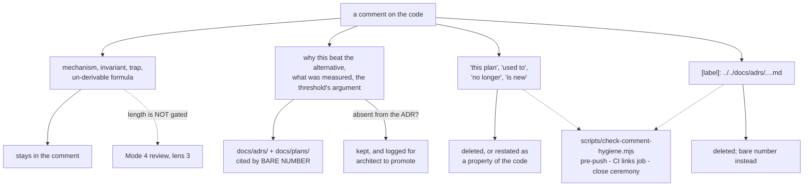

# 0118 — the comments stop narrating the plans that wrote them

> **Status:** done
> **Created:** 2026-08-25
> **Owner skill(s):** dev
> **Related ADRs:** [ADR-0127](../../adrs/0127-a-comment-carries-the-mechanism-and-the-decision-record-stays-in-docs.md)
> (proposed, and this plan is what accepts it),
> [ADR-0116](../../adrs/0116-an-index-row-is-a-pointer-and-a-gate-holds-it-to-one.md)
> **Supersedes:** [design-backlog 0129](../../design-backlog.md), which proposed guarding the links
> this plan deletes

## TL;DR

28,064 comment lines against 53,489 of code. 89 relative links in Rust comments that no gate can see
and eleven of which are already broken. 252 lines of narration written from inside a plan session
(`this plan`, `used to`, `no longer`). 61 comment blocks over 40 lines, eight of them over 100.

ADR-0127 splits a comment into what it must carry — mechanism, invariant, trap, un-derivable
formula — and what belongs in an ADR and is merely being copied. This plan builds the gate for the
two mechanical rot classes, deletes all 89 links in favour of bare-number citations, removes the
narration, and trims the 61 long blocks. **It leaves the 7,913 blocks of 40 lines or fewer alone**
and does not gate length, which ADR-0127 argues would fire on the wrong thing and be gameable by a
blank line.

## Context & problem

The verbosity is a harness artifact, not carelessness. Every phase commit in this project is written
by someone with a plan document open, and the plan's reasoning leaks into the code it produces. The
result is a codebase whose comments are, in bulk, a lossy second copy of `docs/` — with the two
properties a second copy always has: nothing compares it against the original, and it outlives the
context that made it legible.

`core/src/render/tonemap.rs` is the representative case. Its 100-line header carries a genuine trap
(*"Not skippable ... it is the format boundary"*), a formula and a C1-continuity argument worth
having in the code — and alongside them four lines restating ADR-0046's requirements, a note that
*"ADR-0028 / ADR-0032 are unchanged by this plan"*, and framing like *"the clipped composite this
plan exists to retire"*. The first group is why the file is navigable. The second is why it is 100
lines.

The links are the sharpest edge because they fail silently in three ways at once: they break when a
plan moves to `plans/done/` (which is a routine step of every close), they are invisible to
`scripts/check-doc-links.mjs`, which walks `.md` only, and they do not resolve in rendered rustdoc
at all. Eleven are broken on `main` right now, found at Plan 0117's close only because that plan's
own new link had to be repointed by hand.

**Measured at `e022a5d`**, over `core/src`, `standalone/src`, `lmv-ring/src`, `core-cabi/src`,
`core/tests` and `standalone/tests`:

| | total | outside contended trees | inside them |
|---|---|---|---|
| files in scope | 106 | 72 | 34 |
| relative links in comments | 89 | 51 | 38 |
| blocks of 40+ lines | 61 | 42 | 19 |
| lines inside those blocks | 3,850 | 2,718 | 1,132 |
| plan-relative narration lines | 252 | 164 | 88 |

**"Contended" is wherever a lane is live**, which is three lanes and not two:
`core/src/render/scenes/` (including `lines/`) for `plan-0113-shape-collage` and
`plan-0087-arc-primitive`, plus the three files `plan-0116-sanity-ground` reaches —
`core/tests/sanity.rs`, `core/src/render/metrics.rs` and `core/src/render/post/tests.rs`, the
callers of `is_lit` that Plan 0116 re-bases. That split is why Phases 6 and 7 are separate.

**`core/tests/sanity.rs` is the single heaviest file in the sweep** — 365 lines inside five blocks
of 40+, a third of everything Phase 7 now holds — and Plan 0116's own Phase 5 touches its module
docs directly. It sits in Phase 7 for that reason, not because of where it lives.

## Decision

**Take ADR-0127's rule, sweep the bounded subset, and gate only what a script can judge.**

Three things this plan deliberately does not do, each an ADR-0127 alternative with its reason:
it does not extend `check-doc-links.mjs` to `.rs` (Alternative A — that maintains a checker forever
to protect links that should not exist); it does not cap comment-block length (Alternative B — a
blank line games it, and it fires on `kaleidoscope.rs`'s mostly-legitimate 191-line header); and it
does not sweep all 28,064 lines (Alternative D — nine live lanes, 125 files).

**The rule that governs every deletion in Phases 3, 4, 6 and 7, and it is the one that makes this
plan safe:** a comment sentence may be deleted only when the fact it states is *already in* the ADR
or plan it cites. When the comment carries something the document does not — a measurement, a
caveat, a constant's provenance — **`dev` keeps the comment and records the file and line in the
implementation log.** `dev` does not write ADRs, and this plan does not change that; the architect
promotes those at the close. A sweep that deletes on sight would destroy the only copy of facts this
project paid for, and would be worse than the verbosity it fixes.

## Architecture diagram

## Implementation phases

### Phase 1 — the gate exists, and it only reports

- **Owner skill:** dev
- **What:** `scripts/check-comment-hygiene.mjs`, in the shape of its three siblings — walks the
  workspace, takes an optional `root` argument for the fixture tree, prints `file:line -> reason`,
  exits 1 on any finding. It rejects exactly two classes: a **relative link** in a `.rs` comment
  (both the `[label]: target` and `](target)` forms, targets starting `../` or `./`), and the
  **plan-relative vocabulary** (`this plan`, `the plan`, `used to`, `no longer`, `is new`,
  `previously`). Rustdoc intra-doc links are **not** a finding — `rustc` resolves those and they
  cannot rot silently. A documented escape comment suppresses one line, because the vocabulary list
  will have false positives.
  **Not wired into anything yet** — arming a red gate would block every push in the repo.
- **Files touched:** `scripts/check-comment-hygiene.mjs`, `scripts/fixtures/`.
- **Done when:** run bare, it reports both classes across the workspace and exits 1. Run against the
  seeded fixture tree it exits 1 with exactly one finding of each class and nothing else, the way
  `check-doc-links.mjs scripts/fixtures` already works. A comment containing the word "plan" in a
  sentence that is not plan-relative narration is **not** reported — the fixture tree carries one,
  because a gate that cries wolf gets escaped rather than obeyed.

### Phase 2 — the rule lands where authors read it

- **Owner skill:** dev
- **What:** ADR-0127's rule, stated once in `CLAUDE.md` under the cross-cutting non-negotiables, and
  pointed at from `.claude/skills/dev/SKILL.md` so the lane that writes comments reads it while
  writing them. Both entries say what a comment carries, what goes to the ADR, that citations are
  bare numbers, and that the gate exists. Neither restates ADR-0127 at length — that would be this
  plan committing the defect it is fixing, in the document that forbids it.
- **Files touched:** `CLAUDE.md`, `.claude/skills/dev/SKILL.md`.
- **Done when:** both name the rule in under ~12 lines each and cite `ADR-0127` by bare number. The
  ADR is the authority; these are pointers.

### Phase 3 — the 89 links go

- **Owner skill:** dev
- **What:** every relative link in a `.rs` comment becomes a bare-number citation — `ADR-0046`,
  `Plan 0045 Phase 3`. The **eleven already-broken ones are resolved by number, not deleted**: a
  broken link still names a real document, and `core/src/render/tests.rs:1284`'s `plans/0053-…`
  is Plan 0053 at its `done/` path. Where a link's label was carrying meaning the bare number loses
  (a title a reader needed), the title stays as prose.
- **Files touched:** ~40 `.rs` files across all six roots.
- **Done when:** `check-comment-hygiene.mjs` reports zero link findings. Every number that replaces
  a link resolves to a real file — check it, since a bare number that names nothing is a worse
  citation than a broken link, being unfalsifiable by any gate. Intra-doc links are untouched, and
  `cargo doc --workspace --no-deps` emits no new warnings.

### Phase 4 — the 252 narration lines go

- **Owner skill:** dev
- **What:** each is deleted or restated as a property of the code. *"used to be free-running until
  Plan 0095"* becomes *"the phase is locked, not free-running"* — same fact, no expiry. The
  **deletion rule from the Decision applies**: where the narration is the only record of something,
  it is kept and logged.
- **Files touched:** ~60 `.rs` files.
- **Done when:** `check-comment-hygiene.mjs` reports zero vocabulary findings, and every escape
  comment used is justified in one line at its site. `cargo nextest run --workspace` is green —
  comment-only edits cannot change behaviour, so a red run means something else moved.

### Phase 5 — the gate is armed

- **Owner skill:** dev
- **What:** `check-comment-hygiene.mjs` joins `.githooks/pre-push` and the CI `links` job, beside
  the three checkers already there. It runs before `fmt`, since it is the cheapest.
- **Files touched:** `.githooks/pre-push`, `.github/workflows/*.yml`.
- **Done when:** both call it, a seeded violation fails the hook locally, and CI is green on the
  swept tree. **Pushing a `.github/workflows/` edit needs the `workflow` OAuth scope on the git
  credential** — if the push is rejected, that is the cause, and `gh auth refresh -s workflow`
  is the fix rather than anything in the diff.

### Phase 6 — the long blocks come down, outside the contended trees

- **Owner skill:** dev
- **What:** the 42 blocks of 40+ lines — 2,718 lines — in the **72 uncontended files**, held
  to ADR-0127's rule — mechanism, invariant, trap, un-derivable formula stay; the restated decision
  record goes, cited by number. The tonemap header in ADR-0127's Context is the worked example of
  the target shape. **The Decision's deletion rule is the governing constraint of this phase.**
- **Files touched:** ~72 `.rs` files, the heaviest being `core/src/render/background.rs` (192),
  `kaleidoscope.rs` (191), `tier.rs` (171), `core/tests/composite.rs` (125), `bloom.rs` (118) and
  `standalone/src/shot/render.rs` (106). **Not `core/tests/sanity.rs`** — see Phase 7.
- **Done when:** no block over 40 lines survives in these files **unless** the log names it and says
  in one line what invariant needs the length — `kaleidoscope.rs`'s 191 lines may well be such a
  case, and ADR-0127 explicitly declines to gate this, so the log is the only record. No numeric
  target is set on how far the total falls: the ratio is an outcome of applying the rule, not a
  quota to hit, and a quota would be met by deleting the wrong lines. `cargo nextest run --workspace`
  green and `cargo doc --workspace --no-deps` warning-free.

### Phase 7 — the long blocks come down, inside the contended trees

- **Owner skill:** dev
- **What:** the same work for the **34 contended files** — 1,132 lines in 19 blocks of 40+.
  (Phases 3 and 4 already took this scope's 38 links and 88 narration lines; this phase is the
  trimming only.) The weight is concentrated: `core/tests/sanity.rs` alone is 365 of those lines.
- **Files touched:** ~31 `.rs` files under `core/src/render/scenes/`, plus `core/tests/sanity.rs`,
  `core/src/render/metrics.rs` and `core/src/render/post/tests.rs`.
- **Done when:** same bar as Phase 6. **This phase is separable and may be deferred** — the
  `plan-0113-shape-collage` and `plan-0087-arc-primitive` worktrees are live in exactly these
  directories, and a comment-only diff that collides with them buys a merge conflict for a cosmetic
  gain. Deferring it leaves the repo consistent, because the two *gated* classes are already clean
  here from Phases 3 and 4. If deferred, say so in the log and the close files it as a backlog entry.

## Risks & open questions

- **The deletion rule is the whole safety of this plan, and it is the part that erodes under
  fatigue.** Phases 6 and 7 are 3,850 lines of judgement, and the tempting move on line 3,000 is to
  delete a sentence that "looks like" ADR restatement without opening the ADR. The mitigation is
  structural rather than exhortative: `dev` logs what it keeps, and the close reads that list. A
  Phase 6 log with zero kept-and-flagged lines is itself suspicious — across 44 dense blocks it is
  unlikely that every fact was already in a document.
- **The vocabulary gate will annoy someone.** `no longer` and `the plan` occur in innocent
  sentences. The escape exists for that, and Phase 1's fixture pins one false-positive case — but if
  the escape count after Phase 4 is more than a handful, the word list is wrong and should be
  narrowed rather than escaped around. Report the count.
- **Comment-only diffs are invisible to every test in the repo.** Nothing here can be verified by
  the suite beyond "it still compiles and still passes", so the green run in each done-when is a
  floor, not evidence. The actual verification is reading, and the review is where it happens.
- **`cargo doc` behaviour on the removed links is assumed, not measured.** ADR-0127 states these
  hrefs resolve against the generated HTML tree rather than the repo; Phase 3's done-when checks
  only that no *new* warnings appear. If it turns out rustdoc was silently emitting broken anchors
  all along, that is a finding worth one line, not a change of plan.

## What this plan does NOT do

- **It does not gate comment length**, in any file, by any threshold — ADR-0127 Alternative B, with
  its reasons. Length stays a Mode 4 judgement.
- **It does not touch the 7,913 comment blocks of 40 lines or fewer** that carry no link and no
  narration. Most of them are the load-bearing layer and are the reason this codebase reads well.
- **It does not extend `check-doc-links.mjs`**, and it retires design-backlog 0129, which proposed
  exactly that before this question was asked.
- **It does not remove rustdoc intra-doc links.** Those are resolver-checked and are the linking
  mechanism ADR-0127 keeps.
- **It changes no behaviour.** Every phase is comments, one new script, and two gate call sites. No
  Rust expression, no constant and no test assertion moves. A moved golden or a changed test result
  in any phase means something went wrong, not that a comment was cut.

## Implementation log

> Written by `dev` — one row per phase as that phase's commit lands, and the close block after the
> last one. **The phases above are the contract; everything here is what happened.**

**Lane:** `main` directly.

| phase | owner | state | commit |
|---|---|---|---|
| 1 — the gate exists, and it only reports | dev | done | `37868d4` |
| 2 — the rule lands where authors read it | dev | done | `6ae4245` |
| 3 — the 89 links go | dev | done | `0003f42` |
| 4 — the 252 narration lines go | dev | done | `add5710` |
| 5 — the gate is armed | dev | done | `29a0a9d` |
| 6 — the long blocks come down, outside the contended trees | dev | done | `52c3bcb` |
| 7 — the long blocks come down, inside the contended trees | dev | done | `6e48021` |

### Notes

**Deviations.**

- The gate walks the **whole workspace**, not the plan's six measured roots, so Phases 3 and 4 also
  swept `core/build.rs`, `core-cabi/tests/ffi.rs`, `milkconv/**` and `standalone/examples/**` — 4
  links and 17 narration lines outside the plan's file lists (`0003f42`, `add5710`).
- Phase 5 also edited `README.md` and `docs/nfr.md`, which its file list does not name. Both
  document the pre-push / CI gate roster that phase changes, and both were already one gate stale —
  they said *three* Node gates where `check-filter-figures.mjs` had made it four (`29a0a9d`).
- The vocabulary list was **narrowed rather than escaped**: `the plan` is exempt in front of a
  number, since `the Plan 0045 Phase 4b defect` is the citation form ADR-0127 asks for (`add5710`).
  The plan asked for the escape count after Phase 4 — it is **0**.
- Phase 1's gate took a follow-up fix (`b4d0cba`): it counted newlines as it walked, so 10 of 441
  findings named a line holding code. It now derives the line from an index.
- Counts swept are the current tree's, not the plan's `e022a5d` snapshot: **131** links (plan: 89),
  **309** narration lines (252), **70** blocks of 40+ lines over **4,621** (61 over 3,850).

**Done-when criteria not satisfied as stated.**

- Phase 5's "a seeded violation fails the hook locally" was verified against a copy of the hook with
  the backlog step removed. On `main` the hook stops earlier, at `check-backlog-claims.mjs` — see
  Close triggers.
- Phases 6 and 7's "no block over 40 lines survives unless the log names it": **70 survive**, named
  below. **Phase 7 was reopened at the close review** — see `### Close-review repairs`.

**Kept rather than deleted, per the Decision's rule — the fact is in no document.**

- `core/src/render/kaleidoscope.rs:1` — the argument for authoring `kaleido_zoom` in **rings**
  rather than in `log r` ("only one spelling survives re-tuning `kaleido_radial`"). Neither ADR-0077
  nor Plan 0064 records it.
- `core/tests/sanity.rs:209` — `MIN_STRUCTURAL_SHELLS`'s two reasons for taking the structural
  measure over a per-family thin-stroke floor. Plan 0075 Phase 1 names the two candidate mechanisms
  and says *"Choose at implementation and record why in the test"*, so the argument was required to
  live here and no document holds it. Kept whole (close-review pass).
- `core/src/render/tier.rs:241` — the quoted tier rule *"lower if it does not measure clean"* is in
  no ADR or plan. The attribution was dropped and the fact kept as prose.

**Three defects the sweep found rather than caused.**

- `core/src/render/tier.rs`'s `mesh_grid` opened with a stray line describing the segment-count
  ceiling — a copy-paste leftover from a different field. Removed (`52c3bcb`).
- `core/src/render/ink.rs` described trails and kaleidoscope as running at "fixed 16:9 internal
  resolution"; they have followed the render target since ADR-0034. Restated (`52c3bcb`).
- `cargo doc --workspace --no-deps` emitted **no** warning about any of the 131 relative links,
  before or after — the same 62 pre-existing "links to private item" both times, which answers
  ADR-0127's Risks: rustdoc emits those hrefs without complaint.

**The 40+-line blocks that survive, and what needs the length.** 70 blocks, 4,376 lines:

- **A dated measurement with the machine it was taken on** — ADR-0071 puts the configuration beside
  the number, so the table cannot move to a document without breaking that pairing (32):
  `collage_cost.rs:1`, `arc_cost.rs:1`, `mark_cost.rs:1`, `animation.rs:489`, `dsp.rs:105`,
  `fft.rs:455`, `geometry_extent.rs:393`, `milk_wash.rs:1`+`:190`, `render/tests.rs:1113`+`:1234`,
  `tonemap/tests.rs:404`+`:572`, `shot/render.rs:1`, `shot/report.rs:452`,
  `tier.rs:123`+`:241`+`:312`, `backdrop_ramp.rs:466`+`:656`, `milk/mod.rs:1112`,
  `sanity.rs:138`+`:251`+`:347`+`:628`+`:1845`+`:2776`, `lines/star.rs:1`, `star/tests.rs:1643`,
  `warp_mesh/tests.rs:885`+`:1312`, `lines/renderer/tests.rs:1041`.
- **A derivation or formula a reader cannot redo from the code** (7): `tonemap.rs:1`, `bloom.rs:1`,
  `metrics.rs:589`, `palette.rs:1`, `scenes/marks.rs:1`, `preset/expr.rs:1`, `milk/shader.rs:77`.
- **An invariant, seam convention or adapter trap the code cannot state** — the aspect rule, the
  premultiplied-alpha seams, the WARP bind-layout hazard, the sampler conventions (29):
  `kaleidoscope.rs:1`, `tests/kaleidoscope.rs:1`, `background.rs:1`+`:584`, `post.rs:1`,
  `trails.rs:1`, `layer_blend.rs:1`, `gpu.rs:1`+`:109`, `ink.rs:1`, `transition.rs:1`, `tier.rs:1`,
  `line_joints.rs:1`, `attractor_trails.rs:1`, `composite.rs:1`, `downbeatlog.rs:39`,
  `milk/mod.rs:1`, `scenes/emitter.rs:1`, `warp_mesh/mod.rs:1`+`draw.rs:1`+`tests.rs:183`,
  `shape_field.rs:1`, `shape_collage.rs:1`+`layout.rs:1`, `lines/spectrum.rs:1`,
  `lines/lsystem.rs:1`, `particles/mod.rs:1`, `lines/renderer/tests.rs:436`, `sanity.rs:1`.
- **A roster whose per-entry rule governs adding the next entry** (2): `golden.rs:72`,
  `composite.rs:74`. Both were compressed to one line per entry with that rule kept intact.

**Followups noticed and not acted on.**

- `check-backlog-claims.mjs`'s advisory names 41 probed paths as moved since their entries were
  stamped, which is this sweep touching 130 files rather than any entry going stale.
- `docs/plans/done/0075-the-content-renaissance.md` Phase 1 links backlog 0072 by anchor
  (`design-backlog.md#0072--...`). That entry is now in `design-backlog-archive.md`, so the fragment
  no longer resolves. `check-doc-links.mjs` does not validate fragments and reports the file as fine.

### Close-review repairs

The Mode 4 review returned two majors; both are repaired in the commit carrying this section, and
the counts recorded above it are the pre-repair readings.

- **`core/src/render/tonemap.rs` cited ADR-0058 for a hazard ADR-0058 does not record.** Phase 6
  replaced the prose *"against this plan's own documented WARP pipeline-count risk"* with
  `(ADR-0058)`, which is the bind-group-layout collision decision. The pipeline-count sensitivity is
  ADR-0046's, stated in its Consequences and in Plan 0045's Risks. Corrected to ADR-0046.
- **Phase 7 was completed rather than left at its 5-line delivery.** Three of the four lanes the
  plan named as contended have since closed; only `plan-0098-nested-figure` is live, and it holds
  four files. Those four are **untouched and held**: `scenes/marks.rs` (68 lines),
  `scenes/marks/tests.rs`, `scenes/shape_field.rs` (42) and `scenes/shape_field/tests.rs`.

Phase 7's scope went **1,542 -> 1,306 lines** in blocks of 40+ (1,432 -> 1,196 excluding the two
held blocks). Workspace-wide: **41,110 -> 40,906** comment lines. `core/tests/sanity.rs`, the file
the plan called the heaviest in the sweep, went **565 -> 352** across 7 blocks -> 6.

**Twenty-four blocks of 40+ survive in this scope, and what needs the length:**

- **A derivation from the code's own arithmetic, or a formula a reader cannot redo** (7):
  `sanity.rs:305` (the floor table and the half-rule), `sanity.rs:485` (two arms of different kinds
  per ADR-0071, each with its own derivation), `metrics.rs:589` (the geometric-tail extrapolation
  and the 8-bit-quantum trap under it), `emitter.rs:1` (closed-form position and death time),
  `star.rs:1` (the congruent-segment argument for the flat ramp), `warp_mesh/tests.rs:183` (the
  branch cut and handedness, both read off `vertex_position` rather than a picture),
  `lines/renderer/tests.rs:436` (the alpha-1 backdrop-discard seam).
- **A dated measurement carrying the configuration it was taken on** (7): `sanity.rs:122` (the
  flatness distribution and the `0.0161` margin), `sanity.rs:1695` (the loud/moderate ratio table
  and why no threshold on that axis convicts anything), `star.rs:1` (step size, rebuild cost, the
  `1.2e-7` spread, the 60 % / 87 % extents), `warp_mesh/draw.rs:1` (28.5 % of the corpus at
  `fDecay >= 1.0`, 2 949 of 10 347), `warp_mesh/tests.rs:885` + `:1312` (the field instrument and
  the decay-domain hypothesis, both skipping with a notice per ADR-0016),
  `lines/star/tests.rs:1643` (a ratio stated as a property, ADR-0071), `lines/renderer/tests.rs:1041`
  (the aspect verified to bite, and why the outlier arm is the one that convicts).
- **An invariant or trap the code cannot state** (8): `sanity.rs:1` (two reference traps, each of
  which has already let a defect ship, and the `ink_*` terminal-stage fact this is the only record
  of), `shape_collage.rs:1` (three engine properties the look breaks without, plus the sRGB trap),
  `warp_mesh/mod.rs:1` and `particles/mod.rs:1` (ADR-0037 where the grid is user-visible),
  `layout.rs:1` (aspect deliberately not an input; allocation-free refill), `spectrum.rs:1` (the
  param roster, where each entry's no-op semantics is the thing an author cannot see),
  `lsystem.rs:1` (the normalization measurement that contradicts what ADR-0059 wrote).
- **Required by the plan that commissioned it** (1): `sanity.rs:209`, above.
- **Held for a live lane** (2): `marks.rs:1`, `shape_field.rs:1`.

`cargo doc --workspace --no-deps` emits the **same 48** "links to private item" warnings before and
after, compared against a detached worktree at `8848a12` rather than by recollection.

### Close triggers

- **`presets/` touched:** no.
- **Plan header `Closes:`** none. The header carries `Supersedes: design-backlog 0129`.
- **What shipped:** a feature (one new gate, armed at pre-push and in CI) plus a comment-only sweep.
- **Operator docs touched:** `README.md` (the pre-push step table), `docs/nfr.md` (the CI gate
  roster). Also `CLAUDE.md` and `.claude/skills/dev/SKILL.md`.
- **Backlog probes (`node scripts/check-backlog-claims.mjs`):** **exit 1**, naming entry **0129** —
  its `present: \]: \.\./\.\./docs/ in: core/src/render/tests.rs` probe is falsified by Phase 3.
  0129's own text says "**This entry closes when that plan closes**". The pre-push hook stops there
  until it does.
- **Outstanding `human` phases:** none.

### Close (2026-08-27)

**Mode 4: no blockers, no majors, five minors, one nit.** Phases 1-7 landed at `37868d4`, `6ae4245`
(+ `b4d0cba`), `0003f42`, `add5710`, `29a0a9d`, `52c3bcb`, `6e48021`, with the prior review's two
majors repaired at `807b6ef`.

Verified at the close rather than taken from the log: the diff over `37868d4^..HEAD` contains **no
non-comment Rust line** outside the fixture, so "changes no behaviour" is mechanical rather than
asserted; all **115 ADR** and **101 plan** bare numbers cited across the workspace's `.rs` files
resolve to real documents, which is Phase 3's done-when and is gated by nothing; the fixture bite
check exits 1 with exactly one finding per class; the corrected `tonemap.rs` citation is right —
ADR-0046's Consequences carry the WARP pipeline-count sensitivity in the same words; and the
deletion rule holds where it was probed — `tier.rs`'s deleted collage cost ladder is the *second*
copy of a measurement that lives in `core/tests/collage_cost.rs`, which is the file the reading was
taken in.

Version **0.84.0** (minor — the plan arms a new gate at pre-push and in CI).
