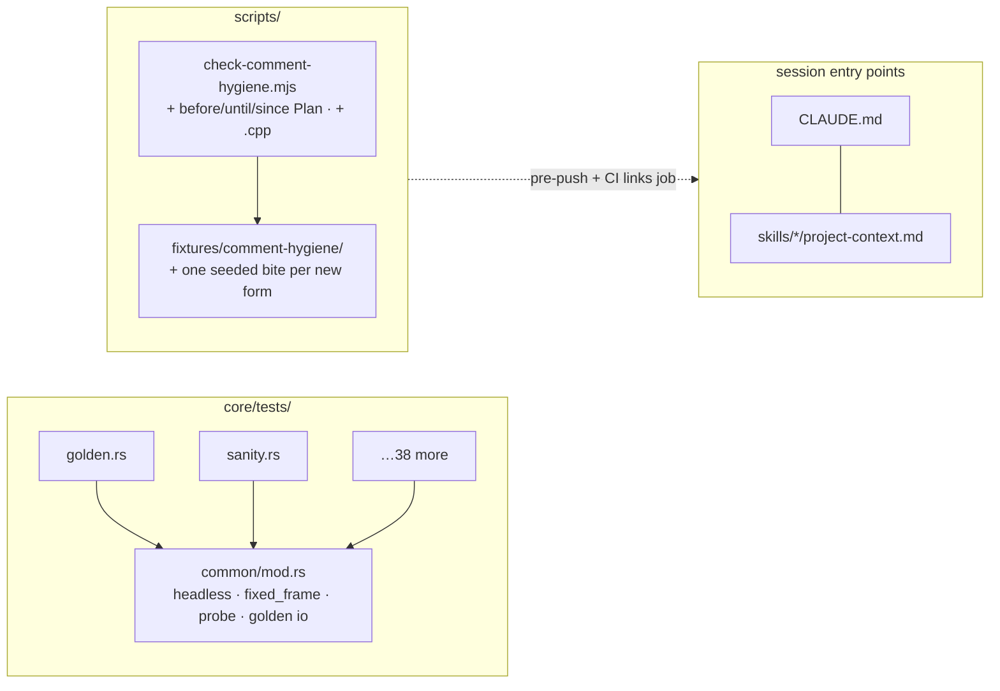

# 0124 — The review fixes that move no pixels

> **Status:** done — closed 2026-08-30. Phases 1, 2, 3, 5, 6 landed as `709544f`, `cf8c47a`,
> `fdb0fed`, `7c87aad`, `4780f9e`; Phase 4 had landed out of band and was verified, not redone.
> Mode 4 review: **no blockers, one major, five minors, two nits.** Verified on the lane after
> `git merge main`: `fmt` clean, `clippy --workspace --all-targets -D warnings` clean,
> `nextest --workspace` 1212 passed / 5 skipped, the golden suite green **unblessed**, all five
> Node gates exit 0, and the comment-hygiene fixture bite reports exactly ten findings across
> four files. Confirmed by reading the diff: outside the new fixture files, Phase 3 changed
> **only** comment lines, and the sole non-comment change under `core/src/render/` is the
> `#[allow]` move Phase 2 asked for. The major: the broken-literal defect survives outside
> `schema.rs` — filed as design-backlog 0168.
> **Created:** 2026-08-28
> **Owner skill(s):** dev
> **Related ADRs:** [ADR-0127](../../adrs/0127-a-comment-carries-the-mechanism-and-the-decision-record-stays-in-docs.md) (the hygiene gate this widens), [ADR-0113](../../adrs/0113-milkdrop-presets-are-translated-ahead-of-time-onto-a-warp-mesh-idiom.md) (the crate this maps), [ADR-0016](../../adrs/0016-gpu-tests-opt-in-ci-scope.md) (the skip shape the shared harness keeps)

**Drafted without an interview at the user's request.** The guesses: (1) no new ADR — every
item here is a mechanism fix under a decision that already exists; (2) the ABI-check
disagreement resolves toward the **shim's** behaviour (a newer core is accepted), because the
shim's comment argues it and the spec merely paraphrases; (3) the plan runs in a worktree lane
like every plan since 0047 and lands as a **patch** bump.

## TL;DR

The 2026-08-28 whole-codebase review found fourteen majors. This plan takes the six that are
mechanical, golden-neutral and safe to land in a day: a shared `core/tests/common/` harness
replacing 27 copies of `fn headless()`, four user-facing warning strings carrying ~20 literal
spaces from a missing `\`, a `#[allow]` and its doc block attached to the wrong function, a
comment-hygiene gate whose vocabulary misses the narration shape that actually survives in the
tree (and skips `.cpp` entirely), `milkconv/` and `core/src/milk/` absent from every map a session
reads first, and a C ABI spec sentence that says the opposite of what the shim does. **No file
under `core/src/render/` changes a pixel, and the golden suite proves it.**

## Context & problem

The review ran four lenses over the tree (layering, god modules, hot-path safety, doc/test
drift). Layering, real-time safety and the ABI came back clean; what it found was maintenance
debt and a few plain defects. Plans [0125](../0125-the-scenes-share-their-gpu-boilerplate.md) and
[0126](../0126-the-large-files-split-along-their-seams.md) take the structural half. This plan takes
what needs no design and no judgement, so that it can go first and so that the other two inherit a
harness and a gate that already work.

The specific findings, each confirmed by reading the line:

- `core/tests/`: `fn headless()` is defined in 27 of 40 integration files (14 byte-identical),
  `fixed_frame` ×7, `probe` ×7, `capture` ×7, `golden_dir`/`encode`/`decode` ×4. No
  `tests/common/` exists. Every new integration test starts by pasting the ADR-0016 skip block.
- `core/src/preset/schema.rs:756, :982, :1762, :1787`: a `format!` string broken across two lines
  without `\` — the operator sees `(x/y/rad/ang), which                      reads 0`.
- `core/src/render/scenes/particles/mod.rs:928-938`: the `seed` doc comment and
  `#[allow(clippy::indexing_slicing, reason = "spread/centre/pos index fixed [f32; 3] …")]` sit
  on `rebuild_if_stale` (`:961`); `seed` is at `:1078`. The reason string is false where it is.
- `scripts/check-comment-hygiene.mjs:229`: `VOCABULARY` is
  `this plan|the plan|used to|no longer|is new|previously`. Fourteen non-test comments in
  `core/src` + `standalone/src` narrate as `before Plan NNNN` / `until Plan NNNN`
  (`spectrum.rs:104,119,129`, `metrics.rs:336`, `palette.rs:779`, `schema.rs:1981`, …) and pass.
  The script globs `.rs` only, so `plugin-foobar/foo_lmv.cpp:13,548-551` is ungated.
- `CLAUDE.md:52-80`, `.claude/skills/architect/references/project-context.md:21-40`,
  `.claude/skills/dev/references/project-context.md:5-30`: none names `milkconv/` (8.4k lines, a
  workspace member outside `default-members`, so `cargo nextest run` skips its tests) or
  `core/src/milk/`. `tools/sd-filter/` and `presets/pending/` are unmapped too.
- `docs/specs/0001-c-abi.md:74-75` says the shim refuses a core whose ABI it was not built
  against; `plugin-foobar/foo_lmv.cpp:984` accepts `core_abi >= LMV_ABI_VERSION` with a comment
  saying why. The spec is the authority on the contract and it is wrong about this one clause.

## Decision

One plan, six phases, each independently committable and each reverting cleanly. The harness
extraction goes first because Plans 0125 and 0126 write tests against it. The gate widening lands
with its own fixture bite and with the fourteen surviving comments rewritten in the same commit —
a gate that goes red on the tree it is added to is not a gate. We rejected folding this into 0125
(the structural plan would then carry a docs sweep and a spec edit that have nothing to do with
GPU helpers) and rejected a per-finding micro-plan each (six close ceremonies for a day's work).

## Architecture diagram



## Implementation phases

### Phase 1 — One harness for forty test files
- **Owner skill:** dev
- **What:** Create `core/tests/common/mod.rs` holding the ADR-0016 headless constructor, the
  synthetic `fixed_frame`, the `probe`/`capture` helpers and the golden PNG `encode`/`decode`/
  `golden_dir` trio; every integration file that defines a copy switches to `mod common;` and
  deletes its own. Where copies differ (the size constant, `prefer_software`), the shared fn takes
  the difference as a parameter — no file's behaviour changes.
- **Files touched:** `core/tests/common/mod.rs` (new), the 27 files defining `headless()`, the
  4/7/7 defining the golden and probe helpers.
- **Done when:** `grep -c "fn headless" core/tests/*.rs` is 0 and `core/tests/common/mod.rs` is 1;
  `cargo nextest run -p lmv-core` passes with the **same test count** as before the phase (the
  skip notices still print on a CPU-only adapter — the ADR-0016 shape is preserved, not merely the
  outcome); the golden suite passes unblessed. `core/tests/hygiene.rs` is not extended — `common/`
  is test code and is outside the hot-path set by construction.

### Phase 2 — Four strings, one attribute
- **Owner skill:** dev
- **What:** Join the four broken `format!` literals in `schema.rs` with `\` continuations; move the
  `seed` doc block and its `#[allow(clippy::indexing_slicing, …)]` from `rebuild_if_stale` onto
  `seed`, and give `rebuild_if_stale` the one-line doc it actually needs.
- **Files touched:** `core/src/preset/schema.rs`, `core/src/render/scenes/particles/mod.rs`.
- **Done when:** a test in `core/tests/preset.rs` loads a preset whose `[per_vertex]`-less
  binding names `rad` and asserts the warning text contains no run of two or more spaces; clippy
  stays green with the attribute on `seed` and **fails** if it is removed (that is the proof it
  was doing work where it now sits — `dev` runs that negative once and states the lint it saw);
  golden suite unchanged.

### Phase 3 — The gate learns the narration shape that survives
- **Owner skill:** dev
- **What:** Extend `VOCABULARY` in `scripts/check-comment-hygiene.mjs` with
  `\b(before|since|until|pre-|after)\s+(plan|adr|phase)\s+\d` and `\bany more\b`; extend the file
  walk to `.cpp`/`.h` under `plugin-foobar/` with a C/C++ comment lexer of the same shape as the
  Rust one (line and block comments; string literals skipped). Seed one fixture file per new form
  under `scripts/fixtures/comment-hygiene/` so the fixture run bites on each. Then rewrite every
  comment the widened gate reports on the live tree — mechanism stays, history goes to a bare
  ADR/plan citation — in the **same commit**, so the gate lands green.
- **Files touched:** `scripts/check-comment-hygiene.mjs`, `scripts/fixtures/comment-hygiene/*`,
  the ~14 `.rs` files and `plugin-foobar/foo_lmv.cpp` it reports.
- **Done when:** `node scripts/check-comment-hygiene.mjs` exits 0 on the tree;
  `node scripts/check-comment-hygiene.mjs scripts/fixtures` reports **every** seeded file, old and
  new, and nothing else; `git diff --stat` for the comment rewrites touches no line outside a
  comment (state it in the log — a `cargo build` that emits the same binary hash before and after
  is the cheap check).

### Phase 4 — The maps name every crate

> **LANDED OUT OF BAND 2026-08-29, by `architect` during a documentation audit**, in the same pass
> that corrected the revoked artifact store in these same three files (Plan 0134 Phase 3) — the two
> phases touch the same paragraphs and splitting them would have meant editing them twice. All five
> `[workspace] members` now appear by name in all three maps; `core/src/milk/`, `tools/sd-filter/`
> and `presets/pending/` are mapped in `CLAUDE.md` and in both skill contexts; the C ABI count
> narration is retired for a rule that forbids restating the roster here at all. Both Node gates
> exit 0. **`dev` should treat this phase as done and verify rather than redo it** — the done-when
> grep above is the check. **The rest of Plan 0124 is untouched and still owed**, including the
> `core/tests/common/` harness that 0125 and 0126 depend on.

- **Owner skill:** dev
- **What:** Add `milkconv/` and `core/src/milk/` to `CLAUDE.md`'s "Where things live" (with the
  one-line reason it is outside `default-members`, in the same voice as the `core-cabi` entry),
  and to both skills' `project-context.md` crate lists; add the `--workspace` note that
  `milkconv`'s tests are skipped by a bare `cargo nextest run` next to the existing `core-cabi`
  one in `dev`'s context. Map `tools/sd-filter/` and `presets/pending/` in `CLAUDE.md` with one
  line each. Retire the "twelve, and then to thirteen" narration at `CLAUDE.md:165` for a
  count-free sentence.
- **Files touched:** `CLAUDE.md`, `.claude/skills/architect/references/project-context.md`,
  `.claude/skills/dev/references/project-context.md`.
- **Done when:** every `[workspace] members` entry in root `Cargo.toml` appears by name in all
  three files (`dev` states the grep); `node scripts/check-doc-links.mjs` exits 0.

### Phase 5 — The spec says what the shim does
- **Owner skill:** dev
- **What:** Rewrite `docs/specs/0001-c-abi.md:74-75` to state the shim's actual rule — it refuses
  a core whose `LMV_ABI_VERSION` is **lower** than the one it was built against and accepts an
  equal or newer one — and carry the shim's one-sentence justification from `foo_lmv.cpp:984`.
  This is a wording correction to the contract document, not a shape change; the `extern "C"`
  surface and `LMV_ABI_VERSION` do not move.
- **Files touched:** `docs/specs/0001-c-abi.md`.
- **Done when:** the spec's compatibility clause and the comparison at `foo_lmv.cpp:984` agree
  under a plain reading; the spec's function roster still lists exactly the fifteen names in
  `core-cabi/include/lmv_core.h`.

### Phase 6 — The unwired scripts get a line or get deleted
- **Owner skill:** dev
- **What:** `scripts/docs-shots.mjs`, `tuple-sheets.mjs`, `tuple-paths.mjs` are live tools
  referenced from docs — add a "Renderers, not gates" line to `CLAUDE.md`'s `scripts/` entry
  naming them. `milk-softness.mjs` and `softness-sheets.mjs` are Plan 0114 one-shot judging
  renderers referenced only from that closed plan — `git rm` them and re-point the two plan
  references at the commit that held them.
- **Files touched:** `CLAUDE.md`, `scripts/milk-softness.mjs`, `scripts/softness-sheets.mjs`,
  `docs/plans/done/0114-*.md`.
- **Done when:** every file in `scripts/*.mjs` is either wired into `.githooks/pre-push` or
  `.github/workflows/*.yml`, or named in `CLAUDE.md`; `check-doc-links` exits 0.

## Data shapes

None new. Illustrative shape of the shared harness, so the parameterisation is agreed rather
than discovered:

```rust
// illustrative — core/tests/common/mod.rs
pub fn headless(width: u32, height: u32) -> Option<Renderer>   // None = ADR-0016 skip, notice printed
pub fn fixed_frame() -> AnalysisFrame
pub fn golden_dir() -> PathBuf
pub fn encode(img: &CaptureImage, path: &Path)
pub fn decode(path: &Path) -> CaptureImage
```

## Risks & open questions

- **Phase 3 rewrites comments in files Plans 0125/0126 will restructure.** Ordering this plan
  first makes those merges trivial; running it in parallel would not. The sequence in
  `docs/plans/README.md` states it.
- **The widened regex may catch a legitimate mechanism sentence** ("after Phase 2 of the pipeline"
  where "phase" is a shader stage). `hygiene-allow: <reason>` exists for exactly that; `dev`
  reports each escape it adds in the log so the reviewer can judge whether the vocabulary
  over-reaches. More than three escapes on the live tree is the signal to narrow the pattern.
- **Phase 1's "same test count" can be satisfied by a harness that silently skips more.** The
  done-when therefore also requires the skip notices to be unchanged in shape; `dev` runs the
  suite once on the software adapter and once on hardware and reports both counts.
- **Open (architect, not this plan):** the review measured `core/src` at 37 % comment lines with
  three files above 1:1, mostly transcribed ADR arguments and measurements. ADR-0127 drew the
  mechanism/decision line and this plan widens its gate, but a ratio is not gated and the user
  has not yet said whether it should be. That is an ADR question and is parked until asked.

## What this plan does NOT do

- No GPU helper, no scene edit, no file split — [0125](../0125-the-scenes-share-their-gpu-boilerplate.md)
  and [0126](../0126-the-large-files-split-along-their-seams.md).
- Does not move `new_from_win32_hwnd` out of `core` or the `shot` thread-local diagnostic off
  the scene renderer — both are seam moves and belong to 0126.
- Does not touch the comment **weight** question; see the open item above.
- Does not change `LMV_ABI_VERSION` or any `extern "C"` signature.

## Implementation log

> Written by `dev` — one row per phase as that phase's commit lands, and the close block after the
> last one. **The phases above are the contract; everything here is what happened.**
> **Observations, never conclusions:** this says where to look, architect decides how it went.
> No per-criterion pass list, no self-assessment, no narrative — but a deviation from the plan or
> an unmet done-when is always disclosed. Stays shorter than `## Implementation phases` above.

**Lane:** `WORK/lmv-plan-0124` on `plan-0124-review-fixes-no-pixels` (the branch name is
shorter than the placeholder above guessed).

| phase | owner | state | commit |
|---|---|---|---|
| 1 — One harness for forty test files | dev | done | 709544f |
| 2 — Four strings, one attribute | dev | done | cf8c47a |
| 3 — The gate learns the narration shape that survives | dev | done | fdb0fed |
| 4 — The maps name every crate | dev | landed out of band, verified | (none — see notes) |
| 5 — The spec says what the shim does | dev | done | 7c87aad |
| 6 — The unwired scripts get a line or get deleted | dev | done, with a deviation | 4780f9e |

### Notes

**P1 — harness count.** `grep -c "fn headless" core/tests/*.rs` is 0. `common/mod.rs` holds
**four** constructors, not the one the done-when names: the copies differed in three ways and only
two are the "size constant, `prefer_software`" the phase anticipated — `layer.rs` also required a
hardware adapter and skipped on WARP (ADR-0058), `bloom.rs` called `new_headless_tiered`. The
ADR-0016 skip block itself is singular: one private `build()`, four entry points delegating.

**P1 — `probe`/`capture` were not extractable.** The phase lists them as x7 copies each. They are
seven *different* functions sharing a name: the `probe`s build seven different presets (one
returns `String`), the `capture`s take seven different argument lists. `common/` holds neither.

**P1 — eleven inline skip blocks remain**, in `arc_cost`, `attractor`, `backdrop_palette`,
`backdrop_ramp`, `background_composite`, `beat`, `collage_cost`, `field_cost`, `mark_cost`,
`palette_contour`, `reaction_diffusion`. They sit inside bespoke `capture_at`-shaped functions, not
a `fn headless`, so the phase's stated set did not reach them.

**P1 — "same test count".** `#[test]` under `core/tests/` is 236 at `HEAD` and 236 in the tree;
`cargo nextest run --workspace` 1199 passed / 5 skipped; golden green unblessed. The box has a
hardware GPU, so the CPU-only skip path was not exercised at runtime — what is checked is that its
branch and notice text are unchanged from the copies they replace.

**P2 — six strings, not four.** `schema.rs` carries six of the defect, not the four at the
line numbers in the phase: `:806`, `:1141`, `:1941`, `:1949`, `:1958`, `:1966`. All six rejoined.
A seventh at `core/src/dsp/mod.rs:57` is outside the file list and untouched (followup below).

**P2 — the negative clippy check does not fail, and the attribute is inert.** Removing
`#[allow(clippy::indexing_slicing, …)]` from `seed` leaves `cargo clippy --workspace --all-targets
-- -D warnings` green. `indexing_slicing` does not fire on a constant index into a fixed-size
array — exactly what the attribute's reason string describes — so it was inert on
`rebuild_if_stale` too. Two probes: `spread[0] + center[0]` in `seed` with the attribute absent
gave no diagnostic; `Some(1u32).unwrap()` in the same position gave `error: used unwrap() on Some
value … the lint level is defined here --> mod.rs:49`, so the deny does reach the function. Both
removed. The attribute is moved as the phase says and **not** deleted.

**P2 — `rebuild_if_stale` needed no new doc**; it already had its own correct block below the
misplaced one. Only the orphaned prose and the attribute moved.

**P2 — the test covers all six**, not the single `rad` case the phase names, and rejects `
` and
`	` alongside a two-space run. Bite check: re-breaking the first literal fails it; restored.

**P3 — 72 comments across 45 files, not ~14.** The user was asked before Phase 3 started and chose
to rewrite all of them. 40 in non-test `core/src` + `standalone/src`, 30 in tests, 2 in
`foo_lmv.cpp`.

**P3 — one false positive, rewritten rather than escaped.** *"not a lower bound … any more than it
is an upper one"* is the comparative idiom; it now reads *"no more a lower bound … than"*. **Zero
`hygiene-allow` escapes added**, so the phase's "more than three escapes" signal did not fire — the
single over-reach is recorded here instead.

**P3 — the walk is repo-wide, not `plugin-foobar/`-scoped.** `.c/.h/.cc/.cpp/.hpp` everywhere: the
repo holds three such files, all ours, and a directory-scoped walk would leave the fixture tree's
own `.cpp` unreachable when `scripts/fixtures` is the root. Only `foo_lmv.cpp` reported.

**P3 — `scripts/fixtures/README.md` was edited and is outside the phase's file list.** It carries
the expected-count table for `comment-hygiene/` and said "exactly two findings"; it now says four
files, ten findings.

**P3 — the binary-hash check in the done-when is void on this machine.**
`cargo build --release -p standalone` run **twice over identical source** gave `E1D367…` then
`82290BD…`, so the release build is not bit-reproducible here and the check cannot distinguish a
comment edit from anything else. Replaced by: every `+`/`-` line in `git diff -- '*.rs' '*.cpp'` is
a comment line (mechanically filtered, zero non-comment lines); `cargo doc --workspace --no-deps`
emits **64** intra-doc-link warnings both before and after; `cargo nextest run --workspace` 1200
passed / 5 skipped.

**P4 was verified, not redone**, per its out-of-band note, and **produced no commit**. All five
`[workspace] members` appear by name in all three maps; `core/src/milk/`, `presets/pending/`,
`tools/sd-filter/` are mapped in all three (`CLAUDE.md:50,67,71`; architect `:31,45,48`; dev
`:17,36,38`); `grep -n "twelve, and then to thirteen" CLAUDE.md` is empty.

**P5.** The clause said the shim refuses a core it was not built against; `foo_lmv.cpp:984` is
`core_abi >= LMV_ABI_VERSION`, refusing only an **older** one. Rewritten to the actual comparison
plus the shim's justification and its degrade-on-refusal. `LMV_ABI_VERSION` and the `extern "C"`
surface untouched; all fifteen header names still appear in the spec.

**P6 deviates, on the user's instruction given before Phase 1.** The phase says to `git rm`
`milk-softness.mjs` and `softness-sheets.mjs`; **both are kept**, and the `CLAUDE.md` line names
all five unwired scripts. The done-when is met by its first branch for every file. Two costs the
deletion would have carried, for the reviewer rather than as an argument: closed plan 0114
references the pair at **nine** places, and design-backlog **0161** holds a live `unprobeable:`
verification on them.

### Close triggers

- **`presets/` touched:** no — `git diff --name-only e6028bd..HEAD -- presets/` is empty. 74 files
  in total.
- **Plan header `Closes:`** none
- **What shipped:** one user-facing **fix** (Phase 2 — six operator messages that reached the
  console with a run of ~20 literal spaces in them), and otherwise **chore + docs**: a test
  harness, a widened gate, a corrected spec clause and a corrected map. No file under
  `core/src/render/` changes a pixel; the golden suite is green **unblessed** at every phase.
- **Operator docs touched:** `docs/specs/0001-c-abi.md` (the ABI compatibility clause, Phase 5),
  `CLAUDE.md` (the `scripts/` entry, Phase 6) and `scripts/fixtures/README.md` (the
  comment-hygiene expected-count table, Phase 3). No file under `docs/` other than the spec and
  this plan.
- **Backlog probes (`node scripts/check-backlog-claims.mjs`):** exit 0. All five Node gates exit
  0 on the tip.
- **Outstanding `human` phases:** none — every phase was `dev`-owned.

## Followups (after this lands)

Each is stated once here; the Notes above carry the evidence and do not repeat these.

- **`core/src/dsp/mod.rs:57` carries a seventh broken literal** of Phase 2's defect
  (`"… cannot be longer      than it"`). Outside Phase 2's file list, untouched, and not reached
  by the Phase 2 test either.
- **The `#[allow(clippy::indexing_slicing, …)]` on `Particles::seed` is dead** and was dead in its
  old position too. Deleting it is a one-line change this plan did not authorize.
- **The eleven inline ADR-0016 skip blocks** could now fold into `core/tests/common/`.
- **`cargo doc` emits 64 intra-doc-link warnings** over 31 files, unchanged by this plan and gated
  by nothing — neither `.githooks/pre-push` nor CI runs `cargo doc`.
- **The two judging renderers were kept rather than deleted.** If they should still go,
  design-backlog 0161's verification bullet on them has to move in the same change.
