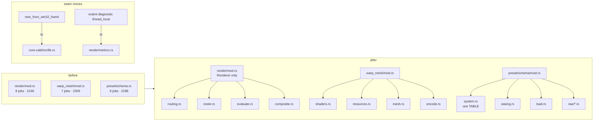

# 0126 — The large files split along their seams

> **Status:** done - closed 2026-09-03. Eight dev phases, `0d50935`..`463cf2d` plus `cb49877`.
> Mode 4 review: **no blockers, no majors against the code; one major doc-freshness repair (stale
> `standalone/src/main.rs` citations in Plans 0120/0133/0147 and design-backlog 0164, repaired at
> this close), five minors.** Independently verified: `cargo nextest run --workspace` 1520 passed /
> 5 skipped / exit 0; fmt clean; clippy --workspace --all-targets zero warnings; all five Node gates
> exit 0. Every numeric done-when re-measured at the line - `render/mod.rs` 1,186, `draw_frame` 199,
> `build_rings` 38, `main.rs` 37, `AppState` 14 fields, `wnd_proc` 100, both Phase 6 greps clean,
> `RLX_ABI_VERSION` 6 with an unchanged header and the same 15 `extern "C"` functions. The two
> done-whens dev reported by silence were checked and hold: `--help` is byte-identical (the `FLAGS`
> table diffs clean) and every README Controls row still dispatches. Phase 1's "no fn in
> `warp_mesh/` exceeds 150 lines" is unmet as written (`shader.rs::build` 331) - the plan wrote a
> directory-wide bound over a file-scoped scope list, and dev correctly declined to widen the phase.
> **Created:** 2026-08-28
> **Owner skill(s):** dev
> **Related ADRs:** [ADR-0002](../../adrs/0002-layered-preset-architecture.md) (the `Scene` seam stays where it is), [ADR-0072](../../adrs/0072-the-c-abi-ships-from-its-own-crate.md) (where the Win32 constructor moves to), [ADR-0037](../../adrs/0037-internal-grid-is-a-resolution-not-a-shape.md), [ADR-0127](../../adrs/0127-a-comment-carries-the-mechanism-and-the-decision-record-stays-in-docs.md)

**Drafted without an interview at the user's request.** The guesses: (1) a split is a *move*,
never a rewrite — every phase is gated on the golden suite unblessed and on `cargo public-api`-
style stability of `rlx_core`'s two-deep surface the shells use; (2) the `particles/` directory
(`mod.rs` + `shaders.rs` + `resources.rs` + `encode.rs` + `family.rs`) is the template every other
split copies, because it already exists and the review found it the healthiest large scene;
(3) the two seam moves (the Win32 constructor into `core-cabi`, the `shot` diagnostic
thread-local into `render::metrics`) are small enough to carry here rather than earn an ADR each —
neither reverses a recorded decision, both *enforce* one; (4) the `foo_ritmolux.cpp` split is in
scope but last, because `plugin-foobar/build.ps1` compiles one file and must learn a list.

## TL;DR

Seven files carry the review's structural majors: two 400-line functions in `warp_mesh/mod.rs`,
a 429-line `draw_frame` in `render/mod.rs` with a four-times-repeated closure, a `schema.rs`
holding nine responsibilities and five hand-kept parallel `SystemKind` tables, `star.rs` with a
motif roster and a ring ornament that never talk, a 28-field `AppState` in `standalone/main.rs`,
and a 189-line `wnd_proc` in `foo_ritmolux.cpp`. Plus one genuine OCP violation — `GeneratorConfig`
fans into four unrelated line scenes' `configure` matches — and two layering seams that leaked.
This plan splits each file along the seams the review named, one file per phase, moving code
without changing it, and closes the OCP hole and the two seams while the files are open. **Every
phase is golden-identical.** After it, adding a scene touches one table in `schema.rs` and one
factory arm instead of ~24 sites across ~12 files.

## Context & problem

The review's per-file findings, confirmed at the line:

- **`core/src/render/mod.rs`** (2246 lines, 0.89 comment:code) — 8 responsibilities:
  routing `:163-270,365-378`, `Roster` `:272-363`, `ParamSmoother` `:380-429`, per-frame
  evaluation `:431-759`, composite `:761-925`, then `Renderer` with a 429-line `draw_frame`
  `:1791-2219` where the `VertexSurface` closure appears at `:1908,:1937,:2000,:2030` and the
  outgoing/incoming side evaluation `:1907-1957` vs `:1999-2051` differs only in side and
  smoother. `evaluate_preset` takes 12 params under `#[allow(too_many_arguments)]`.
- **`core/src/render/scenes/warp_mesh/mod.rs`** (2359) — `Resources::build` `:1235-1670` (436
  lines), `Scene::render` `:1929-2352` (424); four inline WGSL programs `:394-831`; defaults in
  both `new` `:1153-1217` and `reset_params` `:1765-1797`.
- **`core/src/preset/schema.rs`** (2188) — `SystemKind` + five parallel rosters
  (`ALL :80`, `from_name :100`, `as_str :121`, `param_names :145`, `variant_roster_reminder
  :167`), `Easing` (render-time math) `:218-307`, load orchestration `:536-1015` with ~80 lines
  duplicated between `from_toml_str` and `build_layer`, twelve `Raw*` serde tables `:1133-2159`.
- **`core/src/render/scenes/lines/star.rs`** (1851) — motif roster `:649-1141` and ring ornament
  `:1143-1548` are independent; `build_rings` (208 lines) writes its `place` closure three times;
  `Scallop` is special-cased in six roster methods.
- **`standalone/src/main.rs`** (1692) — `AppState` 28 fields, 7-arg ctor; CLI `:1383-1481`,
  preset-dir seeding `:1512-1570`, HUD `:810-914` (whose own comment `:75-77` admits drift from
  `overlay.rs`), input `:921-1135`, capture bootstrap `:1137-1229` all still in the shell entry.
- **`plugin-foobar/foo_ritmolux.cpp`** (1076) — `wnd_proc` `:738-926` with the context menu built
  inline `:816-902`; five file-scope mutable globals (`g_session`, `g_popup_hwnd`, `g_abi_ok`,
  `g_debug_flags`, `g_cfg_preset`); `maybe_log_metrics` `:454-478` reopens its file and calls
  `CreateDirectoryW` + `GetFileAttributesW` every second.
- **`core/src/render/scenes/shape_collage.rs`** (1561) — kind dispatch by `f32` range
  (`kind < 1.5`, `< 2.5`, … `:429-476`, `:118`) mirrored separately in `sdf.rs`; a mismatch is
  a silent wrong shape rather than a compile error.
- **OCP**: `GeneratorConfig` (`scenes/mod.rs:55`) is matched inside `lines/lsystem.rs:380`,
  `parametric.rs`, `spectrum.rs` and `star.rs:1698` — a new generator variant edits four scenes
  that do not use it.
- **Two seams**: `core/src/render/mod.rs:1195 #[cfg(windows)] new_from_win32_hwnd` is the only
  platform branch in `core/`; `standalone/src/shot/report.rs:26,296` reaches
  `rlx_core::render::scenes::lines::renderer::{set_extent_diagnostic, take_draw_extent}` — a
  `thread_local!` inside a scene renderer, five modules deep.

## Decision

One phase per file, ordered so the cheapest and most template-like split goes first
(`warp_mesh`, because `particles/` shows exactly the target shape) and the shell splits go last.
Each phase is a **move**: functions keep their bodies, `pub` surface at the two-deep paths the
shells import stays byte-identical, and the golden suite passes unblessed. The only behavioural
edits are the three the review called bugs-adjacent — the `SystemKind` table consolidation, the
`GeneratorConfig` `_ => {}` arm, and the `shape_collage` `enum Kind` — each with a test that fails
on the old shape. We rejected a single big-bang reorganisation (unreviewable diff, and the
golden gate would fire once at the end where it can no longer say which move broke it); rejected
leaving `foo_ritmolux.cpp` alone (it is the file with the least test coverage and the most globals);
and rejected making the seam moves separate ADRs (they reverse nothing — ADR-0072 already says
`core-cabi` owns the ABI-side construction, and the diagnostic already has a home in `metrics`).

## Architecture diagram



## Implementation phases

### Phase 1 — `warp_mesh/` takes the `particles/` shape
- **Owner skill:** dev
- **What:** Split `warp_mesh/mod.rs` into `shaders.rs` (the four WGSL programs + POD uniforms),
  `resources.rs` (`Resources` build / encode_clear), `mesh.rs` (`MeshState` + grid helpers) and
  `encode.rs` (the five banner-separated stages of `render`), leaving `mod.rs` as params,
  scene struct and `impl Scene`. `Resources::build` and `render` each become a sequence of named
  stage fns under 120 lines. Defaults are declared once and `reset_params` reads them.
- **Files touched:** `core/src/render/scenes/warp_mesh/{mod,shaders,resources,mesh,encode}.rs`,
  `core/tests/hygiene.rs` only if the scan set needs the new files named (it scans `render/`
  recursively — verify, do not assume).
- **Done when:** no fn in `warp_mesh/` exceeds 150 lines (`dev` states the longest and its
  length); golden passes unblessed on both adapters for every `warp_*` and every converted
  MilkDrop preset in the suite; `hot_path_modules_carry_the_panic_pragma` passes with the new
  files carrying the pragma.

### Phase 2 — `render/mod.rs` keeps the `Renderer` and nothing else
- **Owner skill:** dev
- **What:** Move routing to `render/routing.rs`, `Roster` + `ParamSmoother` to `render/roster.rs`,
  binding evaluation to `render/evaluate.rs`, composite encoding to `render/composite.rs`, and
  the tier governor to `render/tier_governor.rs` as an `impl Renderer` continuation (precedent:
  `capture_api.rs`). Collapse `draw_frame`'s duplicated side evaluation into one `evaluate_side`
  and the four `VertexSurface` closures into one; bundle `(vars, frame, time, dt)` into one
  `FrameInputs` struct so `evaluate_preset`/`evaluate_layer` drop below the `too_many_arguments`
  threshold and lose their `#[allow]`.
- **Files touched:** `core/src/render/{mod,routing,roster,evaluate,composite,tier_governor}.rs`.
- **Done when:** `render/mod.rs` is under 1200 lines and `draw_frame` under 200; zero
  `#[allow(clippy::too_many_arguments)]` remain in `render/mod.rs`; every `pub` item the shells
  import (`Renderer`, `Tier`, `HeadlessOptions`, `RenderError`, `metrics::*`) resolves at the same
  path — `cargo build --workspace` with no shell edit is the proof; golden and `transition`
  suites pass unblessed.

### Phase 3 — `schema.rs` becomes a directory, and `SystemKind` becomes one table
- **Owner skill:** dev
- **What:** `preset/schema/{mod,system,easing,error,load}.rs` + `raw/{palette,smoothing,milk,
  particles,spectrum,generator,feedback,mesh}.rs`. In `system.rs`, one
  `const TABLE: [(SystemKind, &str, &[&str]); VARIANT_COUNT]` from which `ALL`, `from_name`,
  `as_str`, `param_names` derive; `variant_roster_reminder` is deleted (the array length is the
  reminder). Extract the ~80 duplicated lines between `from_toml_str` and `build_layer` into
  `compile_bindings` / `fold_smoothing` / `warn_vertex_use`.
- **Files touched:** `core/src/preset/schema.rs` → `core/src/preset/schema/**`, `core/src/preset/mod.rs`.
- **Done when:** a test asserts every `SystemKind` round-trips `as_str → from_name` and that
  `param_names(k)` is non-empty for all `k` — and that test is written **against `TABLE`'s
  length**, so a variant added to the enum without a row fails to compile rather than pass;
  `preset.rs`'s 56 tests pass unchanged; `presets/README.md`'s roster is unchanged.

### Phase 4 — `GeneratorConfig` stops editing scenes that do not use it
- **Owner skill:** dev
- **What:** Route `GeneratorConfig` through the `scenes::create` factory to the one scene it
  targets, so `lsystem`, `parametric`, `spectrum` and `star` each `configure` only their own
  variant and carry a `_ => {}` arm (or the factory never hands them a foreign one — `dev`
  picks whichever keeps the exhaustive-match policy at `scenes/mod.rs:581-600` intact and states
  it). Do the same audit for any other enum matched inside more than one scene.
- **Files touched:** `core/src/render/scenes/mod.rs`, `lines/{lsystem,parametric,spectrum,star}.rs`.
- **Done when:** adding a dummy `GeneratorConfig` variant on a scratch branch compiles with edits
  to **one** scene file and the factory only (`dev` performs the experiment, reverts it, and
  states the file count); golden passes unblessed.

### Phase 5 — `star.rs` splits into motif and rings; `shape_collage` gets an `enum Kind`
- **Owner skill:** dev
- **What:** `lines/star/motif.rs` (pure geometry: `Motif`, biarc chains, budgets, `ArcShape`,
  scallop) and `lines/star/rings.rs` (`RingSpec`, `RingMotion`, hysteresis, `build_rings` with
  its `place` closure hoisted to one fn); the `outline_at` arms the comment at `:806-810` says
  are test-only reference go under `#[cfg(test)]`. In `shape_collage.rs`, replace the `f32`
  range dispatch with `enum Kind` carrying `fn from_f32`/`as_f32`, used by both `Element::build`
  and the WGSL dispatch constants, so `sdf.rs` and the AABB builder cannot disagree.
- **Files touched:** `core/src/render/scenes/lines/star.rs` → `star/{mod,motif,rings}.rs`,
  `core/src/render/scenes/shape_collage.rs`, `shape_collage/sdf.rs`.
- **Done when:** `build_rings` under 100 lines; a test asserts `Kind::from_f32(k.as_f32()) == k`
  for every variant and that the WGSL constant table equals `Kind::ALL`; golden passes unblessed
  for every `star_*` and `collage_*` preset (the `star` goldens are the ones ADR-0090's drift
  memory names — bless-vs-committed control first if any moves).

### Phase 6 — The two seams go home
- **Owner skill:** dev
- **What:** Move `new_from_win32_hwnd` out of `core/src/render/mod.rs` into `core-cabi/src/lib.rs`
  (which already builds the surface-target arguments and is Windows-only by ADR-0072), exposed
  from `core` as a platform-free `Renderer::new_from_surface_target(SurfaceTargetUnsafe, …)`.
  Move `set_extent_diagnostic`/`take_draw_extent` from `lines/renderer.rs` into `render::metrics`
  as fields on the existing diagnostics facade, keyed to the `Renderer` rather than a
  `thread_local!`; `shot/report.rs` imports from `rlx_core::render::metrics`.
- **Files touched:** `core/src/render/mod.rs`, `core-cabi/src/lib.rs`, `core/src/render/metrics.rs`,
  `core/src/render/scenes/lines/renderer.rs`, `standalone/src/shot/report.rs`.
- **Done when:** `grep -rn "cfg(windows)\|cfg(target_os" core/src` returns nothing outside
  `Cargo.toml` feature gating; `grep -rn "thread_local" core/src/render/scenes` returns nothing;
  `standalone/tests/shot_cli.rs`'s report tests pass; the C ABI conformance suite in `core-cabi`
  passes and `RLX_ABI_VERSION` is unchanged (no `extern "C"` signature moved — the constructor
  was never exported).

### Phase 7 — `standalone/main.rs` becomes shell glue
- **Owner skill:** dev
- **What:** Extract `cli.rs`, `preset_dir.rs` (seeding + hot-reload), `capture_start.rs` (the three
  `cfg` arms), `hud.rs` (text composition, sharing colour/geometry consts with `overlay.rs` so
  the admitted drift at `:75-77` ends) and `input.rs`. Group `AppState`'s 28 fields into
  `Diagnostics { … }` and `Hud { … }` sub-structs; `App` already carries the options, so
  `AppState::new` takes `&App`. Retire the three copy-pasted arg scanners for one.
- **Files touched:** `standalone/src/{main,cli,preset_dir,capture_start,hud,input}.rs`,
  `standalone/src/overlay.rs`.
- **Done when:** `main.rs` under 700 lines; `AppState` under 15 direct fields; every hotkey in
  `README.md`'s Controls table still dispatches (`dev` walks the table against `input.rs` and
  states any row it could not match); `standalone/tests/*` pass; the `--help` text is
  byte-identical before and after (`diff` it).

### Phase 8 — `foo_ritmolux.cpp` splits and `build.ps1` learns a list
- **Owner skill:** dev
- **What:** `viz_session.cpp/.h` (`VizSession`, now owning `abi_ok` and `debug_flags`),
  `presets.cpp` (the roster over the C ABI), `host_window.cpp` (`wnd_proc` with
  `build_context_menu` / `dispatch_menu_command` extracted, class registration, pop-out),
  leaving `foo_ritmolux.cpp` as component metadata + service registration. `maybe_log_metrics` opens
  its file once and keeps the handle. `build.ps1` compiles a source list.
- **Files touched:** `plugin-foobar/{foo_ritmolux,viz_session,presets,host_window}.cpp`,
  `plugin-foobar/viz_session.h`, `plugin-foobar/build.ps1`.
- **Done when:** `build.ps1` produces a component that loads in foobar2000 and renders a preset
  (this project's on-device check, `docs/on-device-validation.md`); no function in
  `plugin-foobar/` exceeds 120 lines; the file-scope mutable globals are down to `g_session` and
  `g_popup_hwnd` (the two the Win32 callback model genuinely needs); the widened hygiene gate from
  Plan 0124 Phase 3 exits 0 on the new files.

## Data shapes

```rust
// illustrative — core/src/render/evaluate.rs (Phase 2)
pub(crate) struct FrameInputs<'a> { pub vars: &'a Variables, pub frame: &'a AnalysisFrame, pub time: f32, pub dt: f32 }

// illustrative — core/src/preset/schema/system.rs (Phase 3)
const TABLE: [(SystemKind, &str, &[&str]); VARIANT_COUNT] = [
    (SystemKind::Attractor, "attractor", particles::PARAMS),
    // …
];
```

## Risks & open questions

- **A move that is secretly a rewrite.** The golden gate catches pixel changes; it does not catch
  a `pub(crate)` that became `pub` or a doc comment that lost its invariant. `dev` diffs each
  moved fn body with `git diff --color-moved=dimmed-zebra` and reports any hunk that is not pure
  move. The review's comment-hygiene findings (measurements transcribed into `kaleidoscope.rs`,
  `expr.rs:1300-1336`, `particles/mod.rs:333-358`, `star.rs:20-37`) are **not** rewritten here —
  a split commit that also edits prose is unreviewable. They wait on the open ADR question
  0124 parks.
- **Phase 3 changes `schema.rs`, which Plan 0123 Phase 3 also touches** (`VAR_NAMES` slot
  arithmetic is in `expr.rs`, but 0123's `[latch]` table lands a new `Raw*` struct). Sequence:
  this plan starts after 0123 closes, or Phase 3 is deferred to the end of this plan. Stated in
  the execution order.
- **Phase 6's `metrics` move changes what `shot --report` reads.** The `report_reachability`
  memory says the report only walks select/clamp; this does not widen that, but the extent
  column must read the same values — `shot_cli.rs` has the assertion.
- **Phase 8 cannot be tested in CI** (no foobar2000 there). Its done-when is the on-device
  checklist, which is a `dev` run on this machine, not a `human` phase — the user need not act.
- **Phase 1 goldens on converted MilkDrop presets** — `warp_mesh` is the MilkDrop host and its
  suite includes converted fixtures; a move that reorders shader-module creation can shift WARP's
  allocation (memory: WARP allocation shifts trails). Compare adapters before concluding.

## What this plan does NOT do

- No shared GPU helper — [0125](0125-the-scenes-share-their-gpu-boilerplate.md), which lands first.
- No comment rewrite beyond what a move forces (a moved item keeps its doc; a deleted duplicate
  loses its copy). The comment-weight question is an ADR, parked in 0124.
- Does not touch `kaleidoscope.rs` or `expr.rs` — the review rated both splits `minor` and
  they can wait for a plan that has a reason to open them.
- Does not change the `Scene` trait, the C ABI shape, or any preset.

## Implementation log

> Written by `dev` — one row per phase as that phase's commit lands, and the close block after the
> last one. **The phases above are the contract; everything here is what happened.**
> **Observations, never conclusions:** this says where to look, architect decides how it went.
> No per-criterion pass list, no self-assessment, no narrative — but a deviation from the plan or
> an unmet done-when is always disclosed. Stays shorter than `## Implementation phases` above.

**Lane:** `WORK/rlx-plan-0126` on `plan-0126-the-large-files-split-along-their-seams`

| phase | owner | state | commit |
|---|---|---|---|
| 1 — `warp_mesh/` takes the `particles/` shape | dev | done | `0d50935` |
| 2 — `render/mod.rs` keeps the `Renderer` and nothing else | dev | done | `aacc984` |
| 3 — `schema.rs` becomes a directory, `SystemKind` one table | dev | done | `58ccc24` |
| 4 — `GeneratorConfig` stops editing scenes that do not use it | dev | done | `9e53124` |
| 5 — `star.rs` splits; `shape_collage` gets an `enum Kind` | dev | done | `111dff5` |
| 6 — The two seams go home | dev | done | `d2b1efa` |
| 7 — `standalone/main.rs` becomes shell glue | dev | done | `cb49877` |
| 8 — `foo_ritmolux.cpp` splits and `build.ps1` learns a list | dev | done | `463cf2d` |

### Notes

**Phase 1.** `mod.rs` 2,288 -> 771 lines. Longest fn in the four new files:
`encode::upload_uniforms`, **115 lines**. Longest fn anywhere under
`warp_mesh/`: `shader.rs::build`, **331** — with `draw.rs::waveform_figure`
(222) and `shader.rs::build_blur` (161) behind it. **The done-when's "no fn in
`warp_mesh/` exceeds 150 lines" is therefore unmet as literally stated**, and
was not attempted: `shader.rs` and `draw.rs` are not in the phase's
`Files touched`, and splitting the converted-shader runtime is a change to
allocation order this phase's golden gate exists to hold still.

Three deviations, all forced by the move:

- **`core/src/render/palette.rs` is edited and is not in the file list.** Its
  `band_contour` drift guard reads `scenes/warp_mesh/mod.rs` through
  `include_str!`; the WGSL now lives in `shaders.rs`, so the guard was pointed
  at it (and its label updated). It failed before the repair, which is the
  guard working. It now reads exactly like the `particles/shaders.rs` entry
  beside it.
- **Six `&x` -> `x` and one `&mut x` -> `x`** in `resources.rs` / `encode.rs`:
  the stage functions take by reference what was a local by value, so the
  borrow was redundant. Caught by clippy, not by hand.
- **The four new files name `shaders.rs` beside the existing `shader.rs`.** The
  plan's filename; the two are unrelated (`shader.rs` is the converted-shader
  runtime), and the header of each says so.

`WARP_SHADER`, `Resources`, `MeshState`, `build_indices`, `FIELD_FORMAT` and
`Vertex` widened from private-to-`warp_mesh` to `pub(super)` in their new files,
which is the same reach. `clamp_grid`, `vertex_count`, `vertex_position` and the
three grid bounds were `pub` and are re-exported from `mod.rs`, so every
`warp_mesh::` path outside the module is unchanged.

Verification beyond the done-when: every content line of `HEAD`'s `mod.rs` was
matched against the five files after the split; the 143 unmatched lines are the
visibility widenings, the `self.` -> `scene.` rename in the free functions, the
seven borrow fixes above, and rustfmt rewrapping three statements that fit at
the shallower indent.

**Phase 2.** `render/mod.rs` 2,567 -> **1,188** lines; `draw_frame` 436 -> **199**;
`#[allow(clippy::too_many_arguments)]` in `render/mod.rs`: **3 -> 0** (the third was
`draw_frame`'s own, retired by `(width, height)` becoming one `surface` pair).
Three bundles do it: `Active` (preset + its routes, which are read at the same
roster index), `FrameInputs` (vars, frame, time, dt) and `Scratch` (the two
per-frame buffers). `evaluate_side` replaces the outgoing/incoming pair, and one
`vertex_surface` replaces the four inline `VertexSurface` closures.

**No shell edit**: `standalone/`, `core-cabi/` and `plugin-foobar/` are untouched
and `cargo build --workspace` is green, which is the done-when's own proof that
every `pub` path the shells import still resolves.

One deviation. **`core/src/render/transition.rs` gains one method and is not in
the phase's file list.** `draw_frame`'s tail -- the dual-live budget latch and
the dissolve advance -- became `Renderer::advance_transition`, placed beside
`cancel_transition`, which is the method it calls and which already lives in that
file's `impl Renderer`. Leaving it in `mod.rs` as a sibling method would have met
the `draw_frame` bar and missed the 1,200-line one.

`capture_api.rs` (8 call sites), `render/tests.rs` (1) and `render/mod.rs` (1)
follow `draw_frame`'s signature; two `capture::` calls in `capture_api.rs` take an
unchanged `width, height` pair and are untouched.

The same line-by-line audit as Phase 1: of `HEAD`'s `mod.rs`, 161 lines have no
counterpart, and every one is a `pub(super)` widening, one of the three retired
`#[allow]`s, an argument the bundles absorbed, or one of the two evaluation
copies `evaluate_side` replaced.

**Phase 3.** `schema.rs` 2,414 lines becomes `schema/{mod,system,easing,error,load}.rs`
plus `schema/raw/` (the eight subsystem tables the plan names, plus `preset.rs`
for the four preset-level ones -- `RawPreset`, `RawLayer`, `RawLatch`, `RawSeed`
-- which belong to no subsystem). `from_toml_str` 294 -> 233, `build_layer`
183 -> 113. `presets/README.md` and the `presets/` tree are untouched, and
`core/tests/preset.rs` passes **66/66** unchanged (the plan says 56; the suite
grew since it was written).

**Deviation on `variant_roster_reminder`, and it is the one to look at.** The
plan says to delete it because "the array length is the reminder". It is not: a
variant added to the enum forces nothing, because an enum has no length -- the
reminder's *exhaustive match* was the only thing making a new variant fail the
build. Deleting it would have removed a guarantee while claiming to preserve it,
so it was **replaced** rather than deleted, by `SystemKind::row`, which returns
the variant's index into `TABLE` and is exhaustive for the same reason. Verified
by experiment: a scratch 13th variant fails at `system.rs:144`, which is `row`.
A `const _` block asserts each `TABLE` row sits at its own variant's `row()`.
The five parallel rosters are down to **one table and one index match**, and
`ALL`, `from_name`, `as_str` and `param_names` all read `TABLE`.

The ~80 duplicated lines between `from_toml_str` and `build_layer` become
`compile_bindings`, `fold_smoothing` and `warn_vertex_use`, taking a `Surface`
(`Preset` or `Layer`) that carries the three things the two surfaces differ in:
the message prefix, which TOML table a message names, and whether a compositing
parameter counts as known. **Every warning string is byte-identical** to what
each surface emitted before.

Two path repairs, both outside the phase's file list and both authorized before
the phase began:

- **`core/tests/hygiene.rs`** read `preset/schema.rs` by path, and its
  `system_names` parsed `from_name`'s match arms -- a shape `TABLE` does not
  have. It now reads `schema/system.rs` and takes the quoted strings out of the
  `TABLE` block, which is also rustfmt-proof. Its non-vacuity assertion
  (>= 12 names) still passes, so the parse is not silently empty.
- **`docs/design-backlog.md`: eight live probes**, not the three predicted --
  Phases 1 and 2 broke five more that nobody ran the gate against at the time.
  Seven are pure `in:` path repointing. The eighth (entry 0142) is not: rustfmt
  wrapped `scene_for_mut`'s signature across four lines once `pub(super)` made it
  long, and the probe was a single-line regex on that signature. It is
  re-anchored on the body line that carries the claim -- `.find(|(kind, _)| *kind
  == system)` -- which is what that same entry's own 2026-08-28 note says to do
  when a probe is anchored on a name instead of on the claim.
  `check-backlog-claims.mjs` exits 0.

**Phase 4.** The four line scenes' `configure` matches become `if let` on their
own variant, which is the shape `particles` and `warp_mesh` already had -- the
two that never carried the fan-out. Each of the four now names
`GeneratorConfig` **twice** (its signature and its own variant), down from six.

**Which of the plan's two options, and why.** The plan offered routing through
the factory instead. `scenes::create` keys by `SystemKind` and never sees a
`GeneratorConfig`, so that option meant adding routing the factory does not have.
The exhaustive-match policy `spectrum.rs` stated in a comment -- *"a new config
variant has to be acknowledged rather than silently ignored"* -- is preserved
whole, because `GeneratorConfig::element_count` is exhaustive and a new variant
must answer it. What changes is that it is acknowledged in **one** place rather
than five. Each scene's comment now says so.

**The experiment, run and reverted.** A scratch `Probe { n: u32 }` variant fails
to compile at **exactly one site in exactly one file** --
`core/src/render/scenes/mod.rs:244`, `element_count`'s match. Zero scene files,
which is one fewer than the done-when allows for.

**The audit for other enums matched inside more than one scene found none.**
Eleven types appear across two or more scene files; seven are `wgpu`'s
(`BindingType`, `ShaderSource`, `LoadOp`, `BufferUsages`, `BindingResource`,
`BufferBindingType`, `TextureSampleType`) and every use is a construction, not a
match. `OverflowContext` is constructed at five sites and matched at none;
`Piece` is `matches!`-filtered; `SystemKind` in `common.rs` is an `ALL` iteration.
`GeneratorConfig` was the only exhaustive fan-out.

**Phase 5.** `star.rs` 1,864 lines becomes `star/{mod,motif,rings}.rs` (970 /
506 / 500). `build_rings` is **38 lines**, against the done-when's 100: its four
ring kinds become `push_scallop`, `push_arc_motif`, `push_chain_motif` and
`push_polyline`, and the `place` closure written three times becomes one
`Placement::point`. `Kind::from_f32(k.as_f32()) == k` and the WGSL chain check
are one test, verified non-vacuous by breaking a threshold (`4.5` -> `4.6`),
which it convicts with both tables printed.

**One sub-item of this phase was not done, and it is deliberate.** The plan asks
that the `outline_at` arms the `arc_shape` doc calls test-only reference go under
`#[cfg(test)]`. They cannot, safely. `outline_at` is total today; gating two arms
makes the release-build match non-exhaustive, so it would need a `_ => {}`, and
that arm returns an **empty** outline. Whether `Circle` and `Arc` reach
`outline` in a release build is a runtime property of `build_rings`' branch
order, not a compile-time one -- the arc path `continue`s before reaching it
*today*. Trading a total function for a partial one to save twelve lines, on a
guarantee the compiler stops checking, is the wrong side of that trade. Left for
`architect`: the comment stating those arms are reference-only is accurate and
still there.

Three path repairs, same class as the earlier phases:

- **`core/tests/preset.rs`**'s `declared_params_match_set_param` table read
  `render/scenes/lines/star.rs`; it now reads `star/mod.rs`, where `PARAMS` and
  `set_param` both still live.
- The two `#[cfg(test)]` `f32` rosters `ALL_KINDS` and `kind_name` are **retired**
  rather than kept beside the enum -- `Kind::ALL` and `Kind::name` are the same
  two things, carrying the same `#[cfg(test)]` gate and the same reason for it.
- The two new `star/` files needed the panic-denial pragma; `hygiene.rs` caught
  it, which is that guard working.

`KIND_QUAD` and its seven siblings survive as `const`s defined from
`Kind::as_f32()`, because ~40 authored spec sites name them.

**Phase 6.** Both grep gates are clean:
`grep -rn "cfg(windows)\|cfg(target_os" core/src` returns **nothing**, and
`grep -rn "thread_local" core/src/render/scenes` returns **one line**, in
`shape_collage/tests.rs` -- a counting allocator in a test module, not the
production sink the finding named. `RLX_ABI_VERSION` is **6** on both sides and
`core-cabi/include/` has no diff; the conformance suite passes 9/9, `shot_cli`
25/25, `geometry_extent` and `golden` unblessed.

**Seam 1.** `new_from_win32_hwnd` becomes the platform-free
`Renderer::new_from_surface_target(SurfaceTargetUnsafe, w, h)`, and `core-cabi`
builds the Win32 handle itself. That needs `wgpu` types on the ABI side, and
rather than give `core-cabi` a second `wgpu` dependency, **`core` re-exports its
own** (`pub use wgpu;`): the two must be the same version or the target type does
not match, and a re-export makes that structural instead of a manifest promise.

**Seam 2 is where the plan asks for something it also forbids, and this is the
finding to look at.** It says to key the diagnostic "to the `Renderer` rather
than a `thread_local!`". The measurement happens inside `LineRenderer::draw`,
which the four line scenes reach through an `Rc<RefCell<..>>` owned by the scene
registry; there is no `&mut` path from the `Renderer` down to that call without a
new `Scene` trait parameter -- and **"Does not change the `Scene` trait"** is in
this plan's own *What this plan does NOT do*. So the thread-local **mechanism
stays** and only its **home** moves: `DrawExtent`, the two thread-locals and the
two accessors are now in `render::metrics`, and `lines/renderer.rs` reaches them
through two new functions (`extent_diagnostic_on`, `record_draw_extent`) instead
of touching the cells directly. That discharges what the finding actually
objected to -- a `thread_local!` five modules deep in a scene, and a shell
reaching `rlx_core::render::scenes::lines::renderer::` to read a diagnostic.
`shot/report.rs`, `core/tests/golden.rs` and `core/tests/geometry_extent.rs` all
import from `rlx_core::render::metrics` now. The relocated comment states the
reachability argument rather than the old "rather than a field on
`LineRenderer`" one.

**Phase 7.** Taken **after** Phase 8, not in plan order — the earlier session
skipped this row and this phase closes it. `main.rs` **4,525 -> 37 lines**;
`AppState` **43 -> 14 direct fields**.

**The plan sized this phase against a file that has since tripled, and the scope
was widened before the phase began.** It assumed 1,692 lines, a 28-field
`AppState` and a 7-arg constructor; the lane held 4,525, 43 and 11, because
Plan 0135, Plan 0115 and Plan 0131 all closed onto `main.rs` first. The five
files the plan names move ~2,465 lines and leave `main.rs` at **~2,050** — the
under-700 done-when is unreachable with them alone. **Two files the plan does
not name were added on the user's authorization**: `app_state.rs` and `run.rs`.

Three further deviations:

- **`AppState::new` takes `&mut App`, not the `&App` the plan asks for.** Nine
  of the eleven values are *moved* out of the launch state, which a shared
  borrow cannot do; the alternative was cloning an `OscSink`. The eleven
  parameters and their `too_many_arguments` allow are retired for three.
- **Four sub-structs, not the two the plan names.** `Diagnostics` and `Hud`
  alone leave 26 direct fields against a bar of 15; `Capture` and `Presets` are
  what reach 14.
- **`parse_tier_arg` keeps its own scanner** where `--soak` and
  `--downbeat-log` collapse into one `optional_path_flag`. Routing `--tier`
  through `flag_value` changes what an operator sees for a valueless flag: the
  message naming floor and rich becomes the generic expected-a-value one.

Two files outside the phase's list are edited, both path repairs a move forces,
and **one repair is not this phase's**:

- **`docs/design-backlog.md`: eight live probes repointed**, `in:` paths only,
  no claim touched. Six are this phase's. **Two are Phase 8's** — entry 0102's
  pair still named `foo_ritmolux.cpp` after that phase moved both strings into
  `viz_session.cpp`, so `check-backlog-claims.mjs` has been red since `463cf2d`.
- **`core/tests/chain.rs`: two comments** naming the file that owns
  `pump_audio` and the drain scratch, both now `app_state.rs`.

**Left for `architect`.** Backlog 0164's *prose* still names
`standalone/src/main.rs`; only its probe is repointed, because editing a claim
is not a `dev` call. Plan 0120 and Plan 0133 cite `main.rs` line numbers this
split invalidates. `app_state.rs` is **1,491 lines**, larger than the 1,200-line
bar Phase 2 held `render/mod.rs` to; no done-when covers it.

Verification beyond the done-when: the line-by-line audit Phases 1-3 ran. Of
`HEAD`'s 4,271 content lines, **66 have no counterpart** after the split, and
every one is a `use` path rewritten to `crate::`, part of the retired
11-argument signature, a relocated const's old doc, the old test module's
`use super::` blocks, the repointed `include_str!`, or rustfmt rewrapping a line
the `self.<group>.` prefix lengthened.

**Phase 8.** `foo_ritmolux.cpp` 1,086 lines becomes four translation units
(235 / 350 / 209 / 312) behind one 182-line `viz_session.h`. Longest function in
`plugin-foobar/`: **`wnd_proc`, 100 lines**, from 199 -- `build_context_menu`,
`dispatch_menu_command` and `handle_timer` came out of it. `build.ps1` compiles
a `$sources` list.

**The anonymous namespace had to go.** Everything was in `namespace { }`, which
is internal linkage and impossible across four files. It is now `namespace rlx`,
so the scoping stays and the linkage does not; each file keeps its own anonymous
namespace for what is genuinely private to it.

**Globals: `g_session` and `g_popup_hwnd`, as the done-when asks.** `g_abi_ok`
and `g_debug_flags` are now `VizSession` members. `g_cfg_preset` is the fifth the
plan counted, and it is **not** eliminated -- it is now file-static inside
`presets.cpp`'s anonymous namespace, reachable only through
`remember_current_preset` and `restore_remembered_preset`, so it is no longer a
*shared* global. Making it a function-local static was rejected on purpose:
foobar enumerates `cfg_var`s at startup, and a lazily-constructed one is a change
to config persistence rather than a refactor.

**On-device check: RUN, and it passes.** Built with MSVC, installed into the
foobar2000 v2 profile's `user-components-x64`, foobar2000 launched:
`foo_ritmolux.dll` is in the loaded-module list (12 `foo_*` components), and the
plugin diagnostics log **advanced 12.3 s over a 12 s wait**, last sample 0.6 s
old, `frames_total` climbing 246 -> 253 -> 260 at the idle cadence
(`kIdleTimerMs` = 150 ms, ~6.7 fps, which is what a stopped transport should
show). `gpu_bytes` 2,791,536 and `draw_calls` 22: a live renderer.

**A note for whoever runs this next.** Force-killing foobar2000 puts it into an
unclean-shutdown recovery on the following launch that loads **no components at
all** -- not ours, not its own. Two launches were read as "the component is
broken" before that was recognised. Close it through its window, not with
`Stop-Process -Force`.

**Keeping the log handle open introduced a defect, which the on-device run caught
and which is fixed.** The CRT's `fopen` in append mode opens **exclusive** on
Windows. Held for a whole session rather than for the microseconds of one write,
that locked every other reader out of `plugin-diagnostics.log` for as long as the
visualisation ran -- exactly when someone tails it, and exactly what
`on-device-validation.md`'s diagnostics steps assume they can do. It uses
`_wfsopen` with `_SH_DENYWR` now, and the second on-device run confirms the file
is readable while the session holds it. **A reviewer should look here first**:
the plan asked for the handle to be kept and did not price this.

The per-write `fclose` became `fflush`, so a crash mid-show still leaves the
samples that led up to it on disk.

### Close triggers

- **`presets/` touched:** none. `git diff --stat main...HEAD -- presets/` is empty
  across all eight phases.
- **Plan header `Closes:`** none
- **What shipped:** 68 files, +15,032 / -12,930 across the lane. Eight refactor
  commits, no feature. Two behavioural changes rode along, both recorded in the
  notes above: Phase 3 replaced `variant_roster_reminder` with
  `SystemKind::row`, and Phase 8 moved the plugin's diagnostics log from
  `fopen` append to `_wfsopen` with `_SH_DENYWR` after the on-device run found
  the handle it was asked to keep open locks every other reader out.
- **Operator docs touched:** none. The only `docs/` changes across the lane are
  `design-backlog.md` (probe `in:` paths, Phases 3 and 7) and this plan file.
  `README.md`, `docs/capturing.md` and `docs/on-device-validation.md` are
  unchanged.
- **Backlog probes (`node scripts/check-backlog-claims.mjs`):** exit **0**.
  It was **red at `463cf2d`** and Phase 7 repointed the eight it named — 0102
  (x2, Phase 8's, `foo_ritmolux.cpp` -> `viz_session.cpp`), 0154, 0164 (x2),
  0165 (x2) and 0181 (`main.rs` -> `capture_start.rs` / `app_state.rs` /
  `run.rs`). `in:` paths only; no claim edited.
- **Full suite:** `cargo nextest run --workspace` — exit **0**, **1520 passed,
  5 skipped**, 464.9 s. No suite was run under an ADR-0156 upward override at an
  earlier phase; the nine deferred GPU suites ran here.
- **Other gates:** `cargo fmt --all --check` clean;
  `cargo clippy --workspace --all-targets` zero warnings;
  `cargo build --workspace` green. `check-doc-links`, `check-index-rows`,
  `check-comment-hygiene` and `check-filter-figures` all exit 0.
- **Outstanding `human` phases:** none — all eight phases are `dev`.
- **Lane state:** `main` was merged into the lane at `ac01a37` before Phase 7,
  which brought `38eb942` and the four `docs(plans)` commits. The lane is not
  merged back.

## Followups (after this lands)

Raised by the Mode 4 review, none blocking. All are one-file edits; a future plan that opens the
file should take the one that applies rather than a plan being written for them.

- **`record_draw_extent` and `extent_diagnostic_on` want `pub(crate)`, not `pub`**
  (`core/src/render/metrics.rs`). Each has exactly one caller, in `scenes/lines/renderer.rs`, inside
  `core`. Before Phase 6 the *write* half of the extent diagnostic was module-private; the move made
  it public API, so an external caller can now write into what `shot --report` reads. Phase 6 was
  meant to narrow that surface and on the write half it widened it.
- **`core` re-exports all of `wgpu` (`core/src/lib.rs`) and nothing in `docs/` records it.** The
  mechanism follows from this plan's own `new_from_surface_target(SurfaceTargetUnsafe, ...)`
  signature and the code states the reason well, but the consequence is unrecorded: a `wgpu` bump is
  now a breaking change to `core`'s public API rather than an internal one. One line in the ADR-0072
  lineage, or an `Outcome` on it, settles it - not a new ADR on its own.
- **`standalone/src/app_state.rs` is 1,491 lines and `run::run` is 266**, past the 1,200 and 200
  bars Phase 2 held `render/mod.rs` and `draw_frame` to. No done-when covered either, because the
  plan sized Phase 7 against a `main.rs` that had since tripled. The file is coherent (four
  sub-structs and one `impl AppState`), so this is a size followup and not a layering one.
- **The foobar shim's member functions read the singleton through `g_session.` while reading
  sibling state through `this`** (`plugin-foobar/viz_session.cpp`, clearest in
  `maybe_log_metrics`). A faithful transcription of the pre-split file-scope `g_abi_ok`, but the
  move turned those into *members*, so a second `VizSession` would silently read the wrong object.
  `this->abi_ok` is the whole fix.
