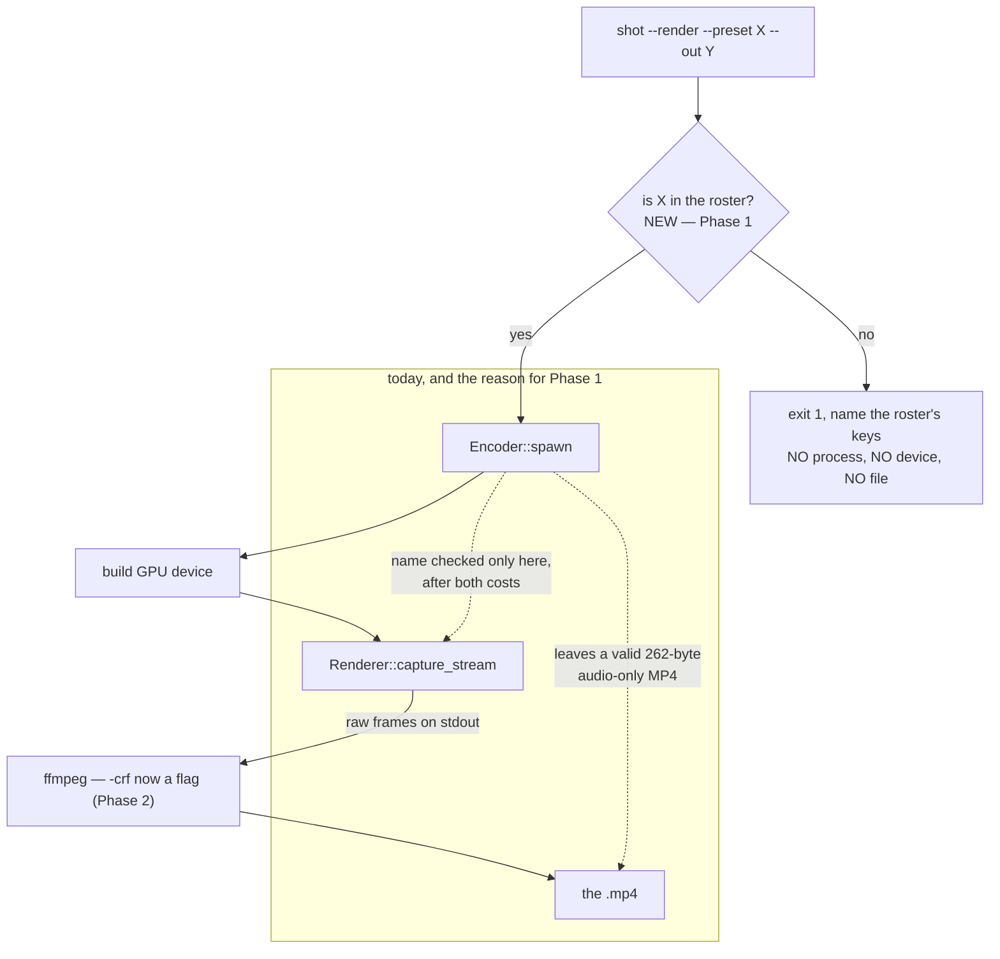

# 0139 — The render path validates before it spends

> **Status:** done — closed 2026-09-01. Phases 1-3 landed as `5cf50bc`, `fa211e0`, `4d8e4c8`.
> Mode 4 review: **no blockers, one major, four minors, three nits.** Verified on the lane with
> `main` merged in: `cargo nextest run --workspace` **1496 passed, 5 skipped, 0 failed**; `fmt`,
> `clippy --workspace --all-targets` and all five Node gates green. `resolve_preset` was read
> against `Renderer::select_preset_by_name_now` and makes the identical exact-equality
> comparison on the same roster, so a name it accepts is one the renderer finds. The major is a
> missing regression guard, not a defect: the spend-nothing ordering that is the whole point of
> Phase 1 is asserted by nothing, and is filed as design-backlog 0175. Backlog 0111 and 0112 are
> discharged and archived; 0174 and 0176 were also filed at this close.
> **Created:** 2026-08-29
> **Owner skill(s):** dev
> **Related ADRs:** none — both entries state *"No ADR needed"*.
> **Closes:** design-backlog 0111, 0112.

## TL;DR

`shot --render` spawns the encoder and builds a GPU device **before** it checks that `--preset`
names anything, so a typo exits 1 and leaves a **262-byte playable MP4** at the destination — a real
file a glance cannot tell from a short render. The same path's one canonical `ffmpeg` invocation is
archival-grade with no lever: a 4:41 track at 1080p60 rich measured **3.73 GB at 106 Mbit/s**, about
9x a typical upload recommendation. The first visible behavior is a misspelt `--preset` failing
instantly, naming the roster's keys, and writing no file.

## Context & problem

Both entries were raised from Plan 0101 Phase 5's real render, and both are about the same seam:
**the convenience path spends before it validates, and offers no lever once it is spending.**

Backlog 0111's failure is worse than untidiness. ADR-0114's rule for this path is that a missing
encoder is a named error and *never* a silent fallback, because a quietly-substituted encoder makes
an exported file untrustworthy. This is that hazard one step over — nothing was substituted, but the
artifact left at the destination is a valid, playable MP4 containing only the muxed audio, because
`ffmpeg` had already been spawned and exited 0. Reproduced with `--preset attractor_leviathan`, the
*filename*, where the roster key is the preset's `name` field `"Leviathan"` — which is also the
confusion an error naming the roster's keys would have caught.

Backlog 0112 is a convenience complaint with a real justification behind it: nothing is missing from
the *capability* — omit `--ffmpeg`, redirect stdout, run your own encoder, which `capturing.md`
documents — but the convenience path's whole stated reason to exist is that there is exactly one
command line to fix rather than a wiki of incantations. Today adjusting it means editing
`ffmpeg_args`. The entry also flags that it **may be discharged by backlog 0110 rather than on its
own**, since most of those bits are encoding shot noise that Plan 0128's density work should remove.

This plan exists in front of Plan 0103's outreach phases, which need demo material out of this path.

## Decision

**Fix the two cheap defects and nothing else.** Phases 1-2 are the validation and the `--crf` lever,
both small and both explicitly ADR-free by their own entries. Phase 3 is the doc sweep. The plan is
three `dev` phases with no human gate, which is what makes it takeable in any spare session.

**Backlog 0125's evidence gate is deliberately not here — [Plan 0128](0128-the-rendered-file-stops-looking-upscaled.md)
Phase 5 already owns it**, describes it better, and pairs it with that plan's own Phase 4 look gate
in one sitting. Duplicating it would have put the same `human` render on two roster rows.

We rejected folding backlog 0126 into this plan, because that entry says so in as many words: *"Do
not fold this into a resolution plan. It shares a verdict with backlog 0125 and nothing else — one
is a pixel budget against a VRAM wall, the other is a timeline the pipeline does not have."*

## Architecture diagram

## Implementation phases

### Phase 1 — Validate the preset name before spending anything
- **Owner skill:** dev
- **What:** Close backlog 0111. Check `name` against `presets` in `render::run()` before
  `Encoder::spawn`.
- **Files touched:** `standalone/src/shot/render.rs`.
- **Notes for the implementer:**
  - **The roster is already in hand** — the `(None, [only])` arm reads it two lines up. This is a
    membership test, not new plumbing.
  - **The error must name the roster's keys.** The reproduction is `--preset attractor_leviathan`
    (the filename) against a roster keyed on the `name` field (`"Leviathan"`), and an error listing
    the keys is what turns that from a puzzle into a typo.
  - Verify **no file is left at `--out`** on the failure path. That is the actual defect — a 262-byte
    playable MP4 that a glance cannot distinguish from a short render.
- **Done when:**
  - `shot --render --preset <not-a-preset> --out <path>` exits 1 naming the roster's keys, spawns no
    child process, builds no GPU device, and leaves **nothing** at `<path>`.
  - Passing a preset's *filename* rather than its `name` produces an error a reader can act on.

### Phase 2 — A size lever on the convenience path
- **Owner skill:** dev
- **What:** Close backlog 0112. Add a `--crf <n>` passthrough to the generated `ffmpeg` command.
- **Files touched:** `standalone/examples/shot.rs`, `standalone/src/shot/render.rs`,
  `docs/capturing.md`.
- **Notes for the implementer:**
  - The measured anchors, on a 30 s slice of `attractor_leviathan` at 1080p60 rich: shipped `-crf 18`
    is 119 Mbit/s, `-crf 23` is 60, `-crf 28` is 27. A typical 1080p60 upload recommendation is
    ~12 Mbit/s, so the shipped default is about **9x** it. Keep `18` as the default — it is the
    archival choice and it is deliberate; this adds a lever, it does not move the default.
  - **The existing tests pin the load-bearing arguments** so the colour tags cannot be lost. Extend
    them rather than replacing — a `--crf` that silently drops a colour tag is a worse defect than
    the one being fixed.
  - If this lands alongside Plan 0128, **re-measure**: backlog 0112 notes most of these bits are
    encoding shot noise that the density work should remove, so the numbers above may not survive it.
- **Done when:** `--crf 23` produces a materially smaller file than the default on the same input,
  with the colour tags intact, and `docs/capturing.md` documents the flag **and** names the raw-stream
  path as the other size-control route.

### Phase 3 — The capture doc says what the levers are
- **Owner skill:** dev
- **What:** Sweep `docs/capturing.md` for the two changes.
- **Files touched:** `docs/capturing.md`.
- **Notes for the implementer:**
  - This file is 144 KB behind six headings. **Put the new material where a reader looking for
    `--render` flags will find it**, not at the end.
  - State the failure behaviour from Phase 1 explicitly — that a bad `--preset` now costs nothing and
    writes nothing — because the old behaviour left artifacts people may have on disk.
- **Done when:** `--crf` and the validation behaviour are both documented in the `--render` section.

## Risks & open questions

- **Plan 0128 Phase 5 may not resolve backlog 0125 at all**, and that is an acceptable outcome that
  lands on this area rather than on that plan. If `quality` does not answer the ask, the next step is
  an ADR reopening
  [ADR-0121](../../adrs/0121-the-diffusion-filter-is-an-offline-stage-with-profiles-and-it-interpolates-its-own-stride.md)'s
  Alternative C — *diffuse at a smaller budget and upscale*, which **this same user rejected in the
  design interview** on the ground that generated detail is worth its price against inferred detail.
  That rejection was made before anyone had watched five minutes of output, which is what makes it
  reopenable rather than settled. A tiled or multi-pass approach that *generates* at higher
  resolution is the option neither the ADR nor Plan 0106 has costed.
- **Phase 2's measurements may be obsoleted by Plan 0128.** Backlog 0112 predicts it may be
  discharged by 0110 rather than on its own. If 0128 lands first, re-measure before claiming a
  default is right.
- **Phase 1 is small enough to look trivial and is the whole reason for the plan.** Resist merging it
  into a larger refactor of `render::run()`.

## What this plan does NOT do

- **It does not take backlog 0126** (nothing varies across a track). That entry is squarely inside
  Plan 0106's stated non-scope, its fixed seed is load-bearing — a per-frame seed *"guarantees
  boiling whatever else is tuned"* — and its denoise-from-onset lever reopens Plan 0106's
  no-audio-conditioning decision, which wants its own ADR and interview. It is the next plan in this
  area, not a phase of this one.
- **It does not change the default `-crf`.** Archival-grade is the deliberate default; this adds a
  lever beside it.
- **It does not touch the diffusion filter at all**, and it does not carry backlog 0125. That
  entry's evidence gate is [Plan 0128](0128-the-rendered-file-stops-looking-upscaled.md) Phase 5,
  which owned it first.

## Implementation log

> Written by `dev` — one row per phase as that phase's commit lands, and the close block after the
> last one. **The phases above are the contract; everything here is what happened.**

**Lane:** `WORK/lmv-plan-0139` on `plan-0139-render-validates`.

| phase | owner | state | commit |
|---|---|---|---|
| 1 — Validate the preset name before spending anything | dev | done | `5cf50bc` |
| 2 — A size lever on the convenience path | dev | done | `fa211e0` |
| 3 — The capture doc says what the levers are | dev | done | `4d8e4c8` |

### Notes

- Phase 1's assertions live in `standalone/src/shot/render/tests.rs`, which no phase's **Files
  touched** names; it is `render.rs`'s own `mod tests` and was read as part of it.
- **Inherited red, not this plan's:** `node scripts/check-comment-hygiene.mjs` exits 1 on
  `core/tests/preset.rs:2800` and `:2832` at this lane's base commit `af4d2b1`. Both lines come from
  `4e596c0`, a Plan 0146 phase commit, and this lane does not touch that file. The gate runs at
  pre-push and in the CI `links` job.
- **Followup noticed, not acted on:** `ffprobe` reads the encoded file as `bt709/unknown/unknown` -
  `-color_trc bt709` and `-color_primaries bt709` are on the generated command line and do not
  survive into the container as it reads them. Identical on both arms of the Phase 2 comparison, so
  it is a property of the shipped default and not of `--crf`.

### Close triggers

- **`presets/` touched:** no.
- **Plan header `Closes:`** design-backlog 0111, 0112.
- **What shipped:** a fix (Phase 1) and a feature (Phase 2's `--crf`), plus the doc sweep.
- **Operator docs touched:** `docs/capturing.md`.
- **Backlog probes (`node scripts/check-backlog-claims.mjs`):** exit 1, two broken, both this plan's
  own `Closes:` entries - 0111 `absent: presets\.iter in: standalone/src/shot/render.rs` now matches
  at `render.rs:704`, and 0112 `absent: --crf in: standalone/examples/shot.rs` now matches at
  `shot.rs:52`. No third entry broke.
- **Full suite:** `cargo nextest run --workspace` (not `-P fast`), exit 0,
  **1495 passed, 5 skipped, 0 failed**, 444.9 s. No suite was run under an upward override at an
  earlier phase - no phase touched a scene, the composite, the preset engine or the embedded set,
  so phases 1-3 each gated on `-P fast`.
- **Outstanding `human` phases:** none - all three phases are `dev`.
