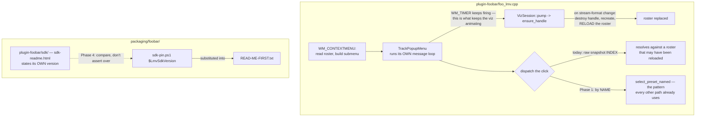

# 0141 — The plugin's seams stop drifting

> **Status:** done — closed 2026-09-01. Four phases, one commit each: `a7354b8` (menu selects by
> name), `e6f71f1` (the size table becomes a dated series), `c6a6449` (the growth attributed to
> Plan 0100), `c4165f6` (the recipe reads the staged SDK's version). Mode 4 review: **no blockers,
> two majors, three minors** — all five repaired in the close commit. Verified independently of the
> log: `lmv_select_preset` now has exactly one call site repo-wide; the bisect's byte deltas are
> corroborated by the diffstats of their own windows (34 lines / 9,386 lines / 823 lines of
> `core/src`); Phase 4's three failure modes re-exercised against a hand-edited `sdk-readme.html`.
> Full suite on the merged tree: `cargo nextest run --workspace` **1496 passed, 5 skipped, exit 0**,
> with `fmt`, `clippy --workspace --all-targets` and all five Node gates clean. Filed
> [backlog 0177 + 0178](../../design-backlog.md).
> **Created:** 2026-08-29
> **Owner skill(s):** dev
> **Related ADRs:** none — three mechanical repairs, no rejected alternative worth recording.
> **Closes:** design-backlog 0117, 0118, 0105.

## TL;DR

Three claims on the foobar2000 side that are no longer true. The preset menu dispatches a click by a
**snapshot index** across a modal wait, justified by a comment saying *"nothing on this thread can
reload presets between the build and the click"* — which is false, because `TrackPopupMenu` runs its
own message loop and keeps dispatching `WM_TIMER`, and that handler can destroy the handle, rebuild
it and reload the roster. `foo_lmv.dll` has grown **400 KB** since the C ABI spec measured it, so the
spec advertises ~1.07 MB of headroom where ~0.72 MB remains. And the shipped `READ-ME-FIRST.txt`
asserts an SDK version that, on the pre-staged route, nothing checks. The first visible behavior is
the preset menu selecting by name.

## Context & problem

This plan exists because **`plugin-foobar/` is the one area no plan on the current roster touches**,
so all three entries have sat since 2026-08-16 to 2026-08-18 with nothing scheduled to pick them up.
They are grouped by locality rather than by mechanism, and they are all small.

What they share is a shape worth naming: **each is a written claim that was true when written.** The
menu comment was true before `ensure_handle` grew the ability to reload a roster mid-playback. The
spec's headroom sentence was true at Plan 0097. The `READ-ME-FIRST` substitution was true on the
fetch route, which was the only route until ADR-0115 made the pre-staged route first-class. None of
them is a bug someone introduced; all three are statements the code drifted out from under.

The 0118 entry names what makes that self-correcting badly: the spec instructs a re-measure *"when a
dependency is added to this crate"*, and **the growth arrived without one**. Plan 0107 is confirmed
not to be the cause — it links nothing new. Plan 0100's MilkDrop conversion work landed between the
two measurements and is the obvious suspect, but nothing has attributed it, which is the point of
filing it.

## Decision

**Take the three repairs in order of how much they protect a user**, and attribute the size growth
rather than only correcting the number. Phase 1 is the menu dispatch — it removes a false claim from
a file whose comments are load-bearing, and it is a few lines. Phase 2 corrects the spec's size table
into a dated series. Phase 3 bisects the growth, because a soft cap nobody can attribute movement in
is a cap that gets discovered breached. Phase 4 makes the packaging recipe read the SDK's own version
marker instead of asserting over it.

No ADR: each entry states its own fix and none names a rejected alternative worth recording. 0117's
fix is the pattern every *other* selection path in the file already uses.

## Architecture diagram



## Implementation phases

### Phase 1 — The preset menu selects by name
- **Owner skill:** dev
- **What:** Close backlog 0117. Dispatch the menu click by preset name rather than by snapshot index,
  and correct the comment.
- **Files touched:** `plugin-foobar/foo_lmv.cpp`.
- **Notes for the implementer:**
  - The helper already exists and **every other selection path in the file uses it**, precisely
    because indices are snapshot-scoped (ADR-0117). The entry carries the exact shape:

    ```cpp
    } else if (listed != 0 && ucmd >= kMenuPresetBase && ucmd < kMenuPresetBase + listed) {
        if (select_preset_named(g_session.handle, snap.names[ucmd - kMenuPresetBase]))
            remember_current_preset(g_session.handle);
    }
    ```
  - **Correct the comment, and correct it accurately.** The safety comes from *re-resolving*, not
    from modality. Leaving the modality claim would be worse than the index, because it is the reason
    the index looked safe.
  - The existing post-dismiss guard checks `g_session.owner != wnd || g_session.handle == nullptr`. A
    handle that was **replaced** rather than dropped passes it — note that in the comment, since it is
    the second half of why the old reasoning failed.
  - **This contends with [Plan 0103](../0103-the-project-gets-an-audience.md) Phase 1**, which rewrites
    this same handler. Backlog 0117 calls itself a natural pickup for whoever takes that phase; if
    0103 is live, coordinate rather than racing.
- **Done when:** a menu click selects the preset whose name was displayed, and no code path resolves a
  preset by an index that outlived the snapshot it came from.

### Phase 2 — The size table becomes a dated series
- **Owner skill:** dev
- **What:** Close the first half of backlog 0118. Correct `docs/specs/0001-c-abi.md`'s size table.
- **Files touched:** `docs/specs/0001-c-abi.md`.
- **Notes for the implementer:**
  - Measured on the dev box at Plan 0107's close, release x64:

    | Artifact | Spec records (Plan 0097) | Measured 2026-08-18 | Delta |
    |---|---|---|---|
    | `foo_lmv.dll` — shipped | 8,879,104 B | 9,279,488 B | +400,384 B |
    | `lmv_core_c.dll` — built, not shipped | 8,824,320 B | 9,218,048 B | +393,728 B |

  - Against NFR §4's ~10 MB soft cap the real headroom is **~0.72 MB**, not the ~1.07 MB the spec
    claims. Delete that sentence rather than editing its number.
  - **Make it a series, not a new frozen pair.** The defect is that a before/after pair reads as a
    fact; a dated series reads as a trend, which is what a reader needs.
  - **Re-measure rather than copying the table above.** It is 2026-08-18 and plans have landed since.
    Per ADR-0071 the row names its machine and configuration.
  - Fix the re-measure trigger too: *"when a dependency is added to this crate"* did not fire, because
    the growth arrived without one.
- **Done when:** the spec carries a dated size series with a current measurement, states the real
  headroom, and names a trigger that would have caught this growth.

### Phase 3 — Attribute the 400 KB
- **Owner skill:** dev
- **What:** Close the second half of backlog 0118. Bisect the component size across Plans 0100-0106.
- **Files touched:** `docs/specs/0001-c-abi.md` (the finding).
- **Notes for the implementer:**
  - **This is a measurement phase, not a repair.** Nothing is over cap; the deliverable is knowing
    what moved.
  - Plan 0100's MilkDrop conversion work is the obvious suspect and Plan 0107 is confirmed not to be
    (it links nothing new — two small Rust functions and ~200 lines of C++). Confirm or refute rather
    than assuming.
  - Build only `core-cabi` — `cargo build -p lmv-core-cabi --release` — at each bisect point. That is
    the crate whose size is in question.
  - **This phase builds repeatedly and needs a free machine.** Do not start it during a show.
  - If the growth is attributable and unwanted, that is a **new backlog entry**, not a fix in this
    plan.
- **Done when:** the spec names which plan or dependency the ~400 KB came from, or records that a
  bisect could not attribute it and what was ruled out.

### Phase 4 — The recipe reads the SDK's own version
- **Owner skill:** dev
- **What:** Close backlog 0105. `build-component.ps1` fails when the staged SDK's version disagrees
  with the pin, instead of substituting the pin into `READ-ME-FIRST.txt` over it.
- **Files touched:** `packaging/foobar/build-component.ps1`.
- **Notes for the implementer:**
  - **The recipe is one grep short of it.** The SDK archive ships `sdk-readme.html` carrying
    `<h1>foobar2000 SDK, version 2025-03-07</h1>`, so the staged tree states its own version.
  - This also closes the smaller half: the script's `ok: SDK <version> staged` line currently prints
    **the pin, not what is staged**.
  - Today the only assertion about the staged tree is that `foobar2000/SDK/foobar2000.h` exists. The
    pin and the staged tree are the same fact **only on the fetch route**, where `fetch-sdk.ps1`
    checked a SHA-256.
  - The argument this repairs is ADR-0038's model as applied by ADR-0115: a local run is held to CI's
    bar. This is the one assertion where the local route was held to a looser one.
- **Done when:** a hand-staged SDK whose version disagrees with `sdk-pin.ps1` fails the build with a
  named error, and the `ok:` line prints the staged version rather than the pin.

## Risks & open questions

- **Phase 1 contends directly with Plan 0103 Phase 1**, which rewrites the same handler and is
  `approved`. If 0103 is in flight, this phase should be dropped into it instead of taken here —
  backlog 0117 says as much. Check the roster before starting.
- **Phase 3 may attribute nothing.** A bisect across six plans on a 400 KB delta can land on "the
  sum of many small things", which is a legitimate and unsatisfying result. Record it rather than
  forcing an attribution.
- **Phase 4 cannot be tested on CI**, which takes the fetch route by construction — that is exactly
  why the hole exists. The check needs a deliberately mis-staged SDK locally, and `dev` should state
  how it was exercised.
- **None of this is user-visible on the happy path.** All three are latent claims, and the plan will
  feel like it produced nothing. The counter is that two of them mislead a *developer* and the third
  ships a false statement to a user.

## What this plan does NOT do

- **It does not address backlog 0102 or 0103** (the 1x1 surface and the shadowed context menu). Both
  are claimed by Plan 0103's Phase 1 and one of them is the High.
- **It does not move the NFR soft cap.** Phase 2 corrects what is claimed about the headroom; whether
  ~10 MB is still the right cap is a different question and nothing here argues it.
- **It does not repair whatever Phase 3 finds.** An attributable and unwanted 400 KB is a new entry.

## Implementation log

> Written by `dev` — one row per phase as that phase's commit lands, and the close block after the
> last one. **The phases above are the contract; everything here is what happened.**

**Lane:** `WORK/lmv-plan-0141` on `plan-0141-plugin-seams`, branched from `main` at `f2b37d5`.

| phase | owner | state | commit |
|---|---|---|---|
| 1 — The preset menu selects by name | dev | done | `a7354b8` |
| 2 — The size table becomes a dated series | dev | done | `e6f71f1` |
| 3 — Attribute the 400 KB | dev | done | `c6a6449` |
| 4 — The recipe reads the SDK's own version | dev | done | `c4165f6` |

### Notes

- Phase 1's done-when reads as a live check ("a menu click selects the preset whose name was
  displayed"), which needs foobar2000 running with the component installed. Verified instead by
  build and by call-site sweep: `lmv_select_preset` has exactly two call sites, one of them inside
  `select_preset_named` against a snapshot that helper read itself, and the menu path now routes
  through the helper. The live click is carried, not run.
- Phase 2's re-measure found the growth is larger than the plan's table records, and still moving:
  `foo_lmv.dll` is 9,789,952 B on 2026-09-01 against 9,279,488 B on 2026-08-18, so +510,464 B has
  landed since backlog 0118 was filed, on top of the +400,384 B it names. Headroom on the decimal
  reading of NFR §4's cap is 210,048 B — 97.9 % of cap. The plan says Phase 2 does not move the
  cap and it did not.
- Phase 3 bisected the window the plan names (Plan 0097's close to Plan 0107's close) and did not
  extend to the +510,464 B that landed after 2026-08-18, which is outside the phase's scope. That
  second window is unattributed and is a candidate backlog entry.
- Phase 4's risk line asks how the check was exercised, CI being unable to reach it. Three local
  runs of `build-component.ps1 -SkipBuild` against a hand-edited `plugin-foobar/sdk/sdk-readme.html`:
  the pinned version passes and prints `ok: SDK 2025-03-07 staged at plugin-foobar\sdk (matches the
  pin)`; a marker reading `2011-03-11` fails naming both versions and their two files; a file with
  the marker deleted fails separately, naming what it expected. The staged tree was restored and the
  passing run re-run afterwards.
- Phase 4's marker is not shaped the way the plan and backlog 0105 quote it. They give
  `<h1>foobar2000 SDK, version 2025-03-07</h1>`; the file breaks that tag across three lines, so a
  one-line tag match finds nothing. The check matches the marker text and captures to end-of-line
  rather than as a date, so a version format only foobar2000 controls cannot fail it open silently.
- The `rust-lld` override (ADR-0147, adopted 2026-08-29) was carried as a suspected confound on the
  cdylib column in the Phase 2 commit, and Phase 3's bisect falsified it: the rebuilt Plan 0097
  baseline is 1,536 B (0.02 %) from the number recorded at that plan's close. The spec's wording was
  corrected in the Phase 3 commit rather than left as filed.
- Nothing was added to `docs/on-device-validation.md` for Phase 1's uncaptured live click. That file
  is not in any phase's `Files touched`, and where the item belongs is a placement call.

### Close triggers

- **`presets/` touched:** no.
- **Plan header `Closes:`** design-backlog 0117, 0118, 0105.
- **What shipped:** fix-only, plus docs. One behavioral change in shipped code (the menu dispatch,
  `plugin-foobar/foo_lmv.cpp`), one in release tooling that ships nothing itself
  (`packaging/foobar/build-component.ps1`), and two documentation phases in
  `docs/specs/0001-c-abi.md`. No new capability, no Rust touched anywhere in the plan.
- **Operator docs touched:** none. The four commits touch `plugin-foobar/foo_lmv.cpp`,
  `docs/specs/0001-c-abi.md`, `packaging/foobar/build-component.ps1` and this plan.
- **Backlog probes (`node scripts/check-backlog-claims.mjs`):** **exit 1, one broken** —
  `0105 absent: sdk-readme in: packaging/foobar/build-component.ps1`, matched at
  `build-component.ps1:212`. The probe is falsified **by the fix it was filed to demand**: Phase 4
  is what put `sdk-readme` in that file. Two neighbours did not break and both are worth reading
  before deciding: **0117**'s probe asserts `ensure_handle(...)` is still reachable from the modal
  loop, which is still true and always will be — the defect was the dispatch, not the reload — and
  **0118**'s probe asserts `8,879,104 B` is still in the spec, which the dated series deliberately
  keeps as its second row, so that probe can no longer distinguish a stale spec from a current one.
- **Full suite:** `cargo nextest run --workspace` on the lane at `c4165f6`, **exit 0** —
  `Summary [520.668s] 1492 tests run: 1492 passed (19 slow), 5 skipped`, across 59 binaries. This is
  ADR-0156's once-per-plan run and the nine deferred GPU suites are inside it; no suite was run
  under an upward override at an earlier phase, because no phase touched Rust. `cargo fmt --all
  --check` exits 0. Clippy was not run: the plan changes no Rust, and the four commits touch one
  `.cpp`, one `.ps1` and two `.md`.
- **Outstanding `human` phases:** none; the plan has no `human` phase. One verification is carried
  rather than run: Phase 1's live menu click, per the first note above.
