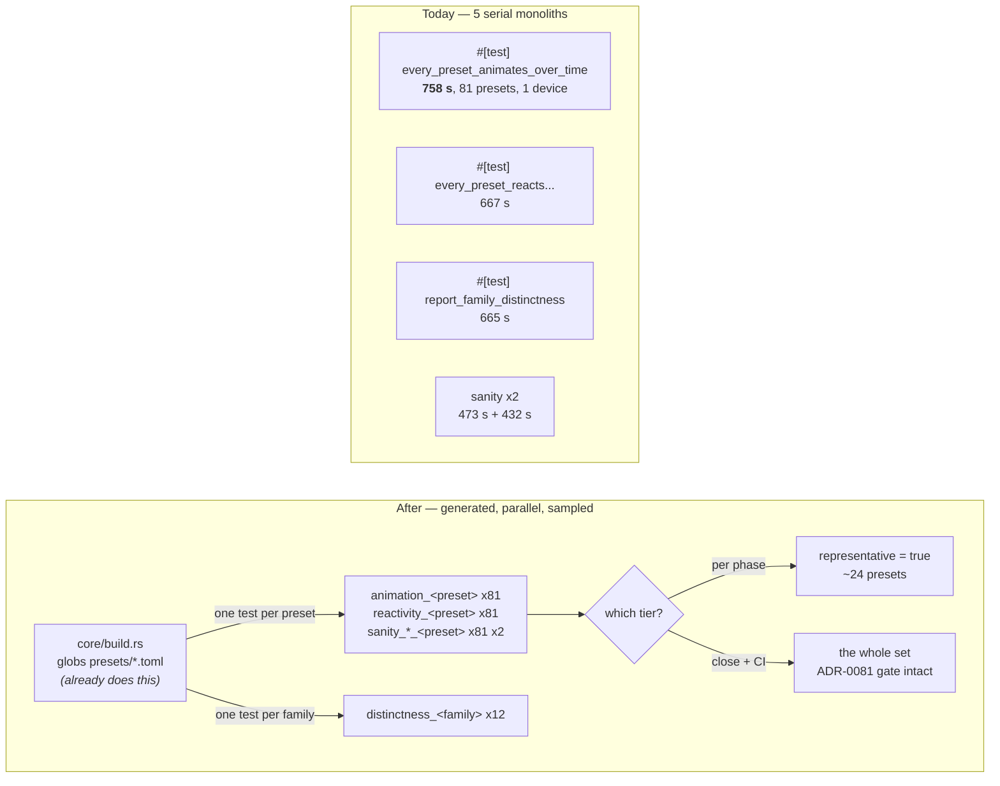

# 0146 — The preset sweeps stop being one long test

> **Status:** done — closed 2026-08-31
> **Created:** 2026-08-31
> **Owner skill(s):** dev
> **Related ADRs:** [0157](../../adrs/0157-the-preset-sweeps-split-per-preset-and-the-phase-tier-samples-a-declared-representative.md)
> (accepted, Outcome), [0156](../../adrs/0156-the-per-phase-gate-is-scoped-and-the-suite-is-owed-once-per-plan.md),
> [0081](../../adrs/0081-the-content-lane-lands-presets-and-architect-curates-the-set.md),
> [0022](../../adrs/0022-build-time-preset-embedding.md)
>
> **Sequenced after [0145](0145-the-per-phase-gate-stops-paying-for-the-preset-library.md)**, whose
> `fast` nextest profile is where Phase 6 hangs the sample.

## TL;DR

Five `#[test]` functions each render the whole 81-preset roster serially, and one of them is 87 % of
the suite's wall time. This plan generates **one test per preset** from the glob `build.rs` already
runs, splits `distinctness` per family, and adds a declared `representative` key so the per-phase
tier renders a sample while the close and CI keep rendering everything. Phase 1 is a spike that may
abort the whole plan.

## Context & problem

The user's ask: *"maybe we also should minimize number of presets that are used in tests, lets say we
have 2 per family."*

Measured on an idle box at `fd7f55b`, the sweeps are not slow because there is much work — they are
slow because the work cannot be spread. Full run: **7,965 s of test-wall in 869 s elapsed, average
concurrency 9.2 on 16 CPUs — 43 % of the machine idle.** The narrow run reaches 13.7 on the same box.
The whole gap is the tail, where only these five processes remain:

| roster monolith | wall |
|---|---|
| `animation::every_preset_animates_over_time` | **758 s (87 % of the suite)** |
| `reactivity::every_preset_reacts_to_at_least_one_band` | 667 s |
| `distinctness::report_family_distinctness` | 665 s |
| `sanity::a_louder_frame_is_reported_against_a_quieter_one` | 473 s |
| `sanity::every_preset_draws_a_real_shape` | 432 s |

Two arithmetic facts set the ceiling, and they are why this plan does both halves rather than either.
**Splitting only redistributes**: the five are similar sizes, so splitting one promotes the next, and
splitting all five reaches the packing floor of 7,965/16 ≈ **500 s** and stops — a 1.6x win.
**Only cutting the roster removes work.** The set is 81 presets across 12 families, lopsided:

```
attractor 19 · fragment_field 13 · reaction_diffusion 7 · shape_field 6
spectrum 5 · parametric_curve 5 · lsystem 5 · emitter 5
warp_mesh 4 · swarm 4 · star_pattern 4 · shape_collage 4
```

so two per family is 24 of 81, drawing most of its saving from two families.

## Decision

Adopt [ADR-0157](../../adrs/0157-the-preset-sweeps-split-per-preset-and-the-phase-tier-samples-a-declared-representative.md):
the four per-preset sweeps generate one test per preset from `build.rs`'s existing glob;
`distinctness` splits per family, never per preset, because its claim is pairwise within one; and a
declared `representative` key selects what the **per-phase tier** renders while the close and CI keep
rendering the whole set, so ADR-0081's curation gate is untouched.

We rejected sampling without splitting (leaves the machine 43 % idle and failures still name a loop
index), splitting without sampling (reaches ~500 s and cannot return the sweeps to the per-phase
gate — retained as this plan's fallback), and deriving the sample rather than declaring it
(first-N never samples a newly landed preset; hash rotation makes the same tree gate differently on
different commits). Full reasoning in ADR-0157.

## Architecture diagram



## Implementation phases

### Phase 1 — Spike: split the worst sweep, and find out whether this works at all
- **Owner skill:** dev
- **What:** Generate one test per preset for `animation::every_preset_animates_over_time` only, and
  measure. **This phase may end the plan** — see the stop condition.
- **Files touched:** `core/build.rs`, `core/tests/animation.rs`.
- **Done when:** the generated tests make the same assertions the loop made, one per preset, named
  after the preset; the roster is still enumerated from the glob so a new `.toml` gets a test by
  existing; and the log records, on an idle box with the precondition verified before and after:
  the wall of `-E 'binary(animation)'` before and after, the summed test-wall both ways, and the
  **per-test device-creation cost** derived from the difference. `cargo nextest list` shows one test
  per shipped preset.
- **Stop condition — evaluated 2026-08-31, and DISCHARGED. Do not re-apply it.** As written it was
  *"if the summed test-wall rises by more than it saves in elapsed, or the binary's wall does not
  fall, stop"*. The measurement tripped the first clause (+127.7 s of work against 67.9 s of binary
  elapsed and 5.8 s of suite elapsed) and `dev` correctly stopped. **The condition was wrong, not
  the result**: it convicts the design at exactly the phase ADR-0157 says cannot pay for itself,
  because splitting one sweep promotes the next rather than shortening the tail. It also compares
  added work against saved elapsed, which is not a test any redistribution can pass.

  **What decided it instead, measured at 4 and 16 logical CPUs on the same tree:** the monolith runs
  **133.5 s on 4 cores and 133.7 s on 16** — it cannot use the machine, whatever the machine is —
  while the split runs **89.5 s on 4** and **65.8 s on 16**, beating it 1.49x and 2.03x. That is the
  property the spike existed to establish, it holds on a small runner as well as a large one, and
  the plan continues on it. The replacement claim is Phase 2's.

### Phase 2 — Split the remaining per-preset sweeps
- **Owner skill:** dev
- **What:** The same generation for `reactivity`'s roster test and `sanity`'s loudness test, both
  **per preset** — and `sanity`'s shape test **per family**, which is a correction to this plan made
  2026-08-31 and explained below.
- **Files touched:** `core/build.rs`, `core/tests/reactivity.rs`, `core/tests/sanity.rs`.
- **`every_preset_draws_a_real_shape` splits per family, not per preset.** It carries a genuinely
  cross-preset **assertion**, not only a report: `report_coverage_distribution` returns a failure
  when a family's coverage floor sits more than `MAX_FLOOR_SLACK` below that family's lowest
  preset, which is a claim about a *family's distribution* and has no per-preset form. A per-preset
  split would either drop that gate or re-render the roster a second time to keep it. A per-family
  split preserves the gate and the printed distribution exactly, and still takes the test off the
  critical path, because the largest family is 19 presets rather than 81. `dev` found this while
  reading ahead at Phase 1; it is a defect in this plan, not in the code.
- **Done when:** `reactivity`'s roster test and `sanity`'s loudness test are generated per preset and
  `sanity`'s shape test per family, with **every assertion unchanged** — including the floor-slack
  gate, which must still fail on a family whose floor has been left behind. The reports survive too,
  per ADR-0071: the coverage distribution stays whole inside its family's test, and the loud/moderate
  ratio is printed per preset rather than as one sorted table, which is the one report this split
  does change and must be called out in the log.
- **The claim, and it replaces the retired concurrency anchor:** the plan's `9.2 at fd7f55b` came
  from a superseded measurement arm, and `dev` re-derived **8.98** on this tree, so the number is
  reproduced but is not the right test either — average concurrency counts *processes*, and a single
  sweep test uses about four logical CPUs, so the figure understates the machine's real occupancy.
  **State the property instead: the four split sweeps no longer appear among the last tests to
  finish, and the suite's elapsed falls.** Record elapsed before and after beside it.

### Phase 3 — Split `distinctness` per family
- **Owner skill:** dev
- **What:** Twelve tests, one per family, each doing that family's pairwise comparison.
- **Files touched:** `core/tests/distinctness.rs`.
- **Done when:** every family is its own test, the pairwise set within each family is exactly what the
  single test compared before (no pair dropped, no pair added — assert the pair count per family), and
  the printed matrix survives per family. **No sampling is applied here in this or any later phase**,
  and the file says why in a comment: two per family leaves one comparison and retires the check.

### Phase 4 — The `representative` key and its floor
- **Owner skill:** dev
- **What:** The schema key, its parsing, and the test that stops the sample rotting.
- **Files touched:** `core/src/preset/schema.rs`, `core/build.rs`, `core/tests/preset.rs`,
  `presets/README.md`, `docs/presets.md`.
- **Done when:** a preset may declare `representative = true`, absent means false, and an unknown
  value is a load-time error consistent with the rest of the schema. A test asserts the floor —
  **every family has at least two representatives** — and fails naming the family that does not. The
  two authoring docs describe the key, what it is for, and that it changes *nothing* about what the
  close and CI run.

### Phase 5 — Seed the representatives, and curate them
- **Owner skill:** dev
- **What:** Populate the key across all 12 families.
- **Files touched:** `presets/*.toml`.
- **Done when:** every family has at least two, seeded from `distinctness`'s own pairwise matrix by
  taking the two furthest-apart presets in that family, and the plan's log records the matrix reading
  each choice came from. This is a mechanical application of a stated rule, not a taste judgement —
  where the matrix is ambiguous (a tie, or a family of exactly four where the choice barely matters),
  say so in the log and let the close-ceremony curation settle it rather than inventing a preference.

### Phase 6 — Hang the sample on the per-phase tier
- **Owner skill:** dev
- **What:** Wire the sample to Plan 0145's `fast` profile so a phase renders representatives and the
  close renders everything.
- **Files touched:** `.config/nextest.toml`, `.claude/skills/dev/references/project-context.md`.
- **Done when:** the per-phase scope runs the representatives' generated tests and skips the rest,
  while a bare `cargo nextest run --workspace` still runs **every** preset — verified by a list diff,
  not by inspection. `dev`'s canonical-commands table says which scope renders which set. The
  close/CI path is unchanged, so ADR-0081's gate still sees the whole library.

### Phase 7 — Measure, and state what it cost
- **Owner skill:** dev
- **What:** The closing numbers, on an idle box.
- **Done when:** the log records elapsed and average concurrency for the full suite and for the
  per-phase scope, before and after, with the machine named per ADR-0071 and the quiet precondition
  verified. **The per-phase coverage gap is stated as a count, not a feeling:** how many of the 81
  presets a phase now renders, and how many wait for the close.

## Data shapes

```toml
# illustrative — the key Phase 4 adds, in a preset .toml
system = "attractor"
representative = true   # absent means false; the per-phase tier renders only these
```

```rust
// illustrative — what build.rs emits per preset, per sweep, in Phase 1
#[test]
fn animation_attractor_leviathan() {
    animates_over_time("attractor_leviathan");
}
```

## Risks & open questions

- **Device creation may eat the win, and it is the whole premise.** 81 processes each building a
  headless renderer against 1 renderer reused 81 times. Phase 1 exists to find out first and is
  allowed to end the plan.
- **The sweeps run on the WARP software adapter** (`headless()` prefers software), so they are
  CPU-bound and parallel tests compete for the same 16 threads rather than for a GPU. The packing
  floor is therefore real and near — do not expect better than total-work ÷ cores.
- **Sampling widens a per-phase blind spot exactly where the library is thickest** — `attractor` 19
  and `fragment_field` 13 both drop to 2. The close and CI still render everything, which is what
  keeps ADR-0081 intact, but a defect in preset 17 of 19 now waits for the close.
- **The floor test catches absence, never staleness.** Two representatives that stop being
  representative of a grown family still pass. That is a curation duty with no gate behind it, and it
  should be said plainly in `presets/README.md` rather than assumed.
- **A `build.rs` defect becomes a test-suite defect** across five suites rather than one table.
- **Open:** whether two per family is the right floor for `attractor` at 19. Deliberately not decided
  here — Phase 7's coverage count is the evidence to revisit it from.
- **`distinctness` costs what it costs because of captures, not because of pairs.** It renders each
  preset **once** into `caps` and then compares already-captured 128x128 images in memory, so it is
  **linear** in preset count like every other sweep: 665 s over the **67** presets in its nine listed
  families is **9.93 s per capture**, against `animation`'s 9.36 s. The pairwise half is image
  arithmetic on small buffers and is not a measurable share. It still must not be sampled — that is a
  claim about what the check *means*, not about what it costs — and Phase 3 splits it per family for
  the same packing reason as the rest.

## What this plan does NOT do

- **It does not change any assertion.** The same claims are made about the same presets; what changes
  is how many processes make them, and which presets the per-phase tier visits.
- **It does not sample `distinctness`**, ever — Phase 3 splits it and stops.
- **It does not weaken the close or CI sweep**, which is what ADR-0081 rests on.
- **It does not touch the per-phase gate's structure**, which is Plan 0145's; this plan only hangs a
  sample on the profile that plan creates.
- **It does not address the 43 % idle machine anywhere but these five tests.** Other tail effects, if
  any, are out of scope.

## Implementation log

> Written by `dev` — one row per phase as that phase's commit lands, and the close block after the
> last one. **The phases above are the contract; everything here is what happened.**

**Lane:** `main` directly.

| phase | owner | state | commit |
|---|---|---|---|
| 1 — Spike: split the worst sweep | dev | done | `c2fa99f` |
| 2 — Split the remaining per-preset sweeps | dev | done | `e2f84cf` |
| 3 — Split `distinctness` per family | dev | done | `1c52867` |
| 4 — The `representative` key and its floor | dev | done | `5107d8e` |
| 5 — Seed the representatives | dev | done | `4e596c0` |
| 6 — Hang the sample on the per-phase tier | dev | done | `d3effa9` |
| 7 — Measure, and state what it cost | dev | done | `a9df6bb` |

### Measurements

**Machine** (ADR-0071): AMD Ryzen 9 5900HS, 16 logical CPUs, Windows 10 19045, rustc 1.97.1,
cargo-nextest 0.9.140, on AC. **Tree:** `ee0792b`, Plan 0145's close. **Quiet precondition:**
`cargo` / `cargo-nextest` / `rustc` and test-binary processes enumerated before and after every run;
none present at any boundary, 16:21-16:55 CEST 2026-08-31. Test binaries were pre-built, so no
compile sits inside any figure; elapsed is nextest's own `Summary` wall and concurrency is summed
test-wall over it.

**Before:**

| arm | elapsed | summed test-wall | concurrency | tests |
|---|---|---|---|---|
| `-E 'binary(animation)'` | 133.7 s | 142.4 s | 1.07 | 3 |
| `--workspace` | 464.2 s | 4,169.5 s | 8.98 | 1230 |
| `--workspace -P fast` | 147.3 s | 2,002.8 s | 13.60 | 1203 |

The five roster monoliths were the last five tests to finish, at positions 1225-1230 of 1230:
`animation` 365.5 s, `reactivity` 336.4 s, `distinctness` 203.2 s, `sanity` loudness 172.8 s,
`sanity` shape 128.8 s.

**After:**

| arm | elapsed | summed test-wall | concurrency | tests |
|---|---|---|---|---|
| `-E 'binary(animation)'` | 65.8 s | 1,011.6 s | 15.19 | 83 |
| the same, `--test-threads=1` | 270.1 s | 270.1 s | 1.00 | 83 |
| `--workspace` | 458.4 s | 4,747.1 s | 10.36 | 1310 |

**Per-test device creation: 1.60 s.** Derived from the serial arm, which is the only one measuring
work rather than contention: 270.1 s serial after against 142.4 s serial before is +127.7 s across
the 80 renderer builds the split adds - 81 tests, one of whose devices the monolith already paid
for. Per-preset render work is 133.7/81 = **1.65 s**, so one device costs about what one preset's
three captures cost.

`animation` left the critical path: its 81 tests summed 986.3 s contended with a 32.0 s maximum, and
none of them appears in the suite's slowest eight or its last eight to finish. The last test is now
`reactivity` at 279.6 s.

`cargo nextest list -E 'binary(animation)'` enumerates 81 generated tests, diffing empty against the
81 `presets/*.toml` stems. Copying a preset to `presets/zz_glob_probe.toml` took the list to 82 with
no Rust edit and removing it returned it to 81.

**Phase 2, same machine and preconditions.** `reactivity` and `sanity`'s loudness test generate 81
tests each; `sanity`'s shape test generates 12, one per family the shipped set contains, diffing
empty against the 12 distinct `system` values in `presets/*.toml`.

Full suite **464.2 s -> 458.4 s (Phase 1) -> 441.6 s**, concurrency **8.98 -> 10.36 -> 15.18**; the
final figures are in `### What it cost` below. The critical path became `distinctness` at 290.4 s,
which is Phase 3's subject.

### Notes

**The Phase 1 stop condition trips on one of its two clauses. The plan is paused here.**

- *"the binary's wall does not fall"* - it fell: 133.7 s to 65.8 s, 2.03x, with concurrency inside
  the binary going 1.07 to 15.19.
- *"the summed test-wall rises by more than it saves in elapsed"* - it does, on every reading.
  Work added is **+127.7 s** (serial arm) against **67.9 s** of binary elapsed saved and **5.8 s**
  of full-suite elapsed saved (464.2 s to 458.4 s).

Both numbers are recorded above, per the phase's own instruction. Two observations that bear on
reading them: ADR-0157 predicts this full-suite result at Phase 1 in as many words - *"splitting one
merely promotes the next"* - and ADR-0157's Negative sizes the device-creation risk against *"the
~9 s of per-preset work"*, where the measured per-preset work is 1.65 s.

**The aggregate `driven_only` roster print is gone.** ADR-0136 asks that the set of presets still in
silence be visible; with one test per preset there is no end of a sweep to collect it at, so each
test prints its own branch label instead. Neither form is in `.config/nextest.toml`'s four-test
audible override, so both are captured by nextest unless the test fails.

**ADR-0136 cites `every_preset_animates_over_time`,** which no longer exists.

**Phase 2's done-when is met except in its letter, on one test.** It asks that the four split sweeps
*"no longer appear among the last tests to finish"*. Three of the four do not appear anywhere near
the tail; `sanity_shape_attractor` does, at **67.4 s** and position **1472 of 1481**. It is not among
the suite's slowest six and it is not the critical path, but it is in the last ten, so the criterion
is reported as partially met rather than passed. The cause is structural and was chosen at the plan
revision: `attractor` holds 19 of the 81 presets and the per-family split makes that family the
largest indivisible unit in the sweep. It is the same lopsidedness the plan's open question raises
about a two-per-family sample.

**Phase 3 splits `distinctness` into NINE tests, not the twelve its `What` line names.** The phase
contradicts itself: `Twelve tests, one per family` against a `Done when` of *"no pair dropped, no pair
added"*, and the plan's own followups record that this report covers **9 of the 12 families** by a
curated list and that changing that list is out of scope. The done-when and the scope note agree with
each other, so the curated nine is what shipped; twelve would have **added** 27 pairs across
`shape_field`, `warp_mesh` and `shape_collage`. The phase's `Files touched` names only
`core/tests/distinctness.rs` and not `core/build.rs`, which is consistent with hand-written tests over
the existing curated array rather than a generated fan-out, and that is how it is written.

**The pair count is preserved exactly: 322.** Per family — `attractor` 171, `fragment_field` 78,
`reaction_diffusion` 21, `parametric_curve`/`lsystem`/`spectrum`/`emitter` 10 each,
`swarm`/`star_pattern` 6 each. Each test asserts its own family's count against `n(n-1)/2` and all
nine pass, which is the no-pair-dropped claim made mechanically rather than by inspection. The two
printed matrices survive per family, verified by running `distinctness_star_pattern` alone. A second
assertion, not asked for by the phase, fails a curated family that ships fewer than two presets: that
is the one way this advisory can go quiet without anyone noticing, and it is the staleness the list's
own comment already records.

**Phase 4 ships the key without its floor test, which moves to Phase 5.** No preset declares the key
until Phase 5 seeds them, so that test is red at every commit between the two. Only that one
assertion crosses the boundary; nothing is dropped.

**The sample is selected by a marker in the test NAME** — `<sweep>_rep_<stem>` — because a nextest
predicate matches names and cannot read a `.toml`. The cost, stated in `presets/README.md`: flipping
the flag renames that preset's tests. ADR-0073's *"sampling cannot be a nextest filter"* was true of
roster loops; splitting them is what makes a filter possible.

**Phase 5's seeding, and the matrix reading behind each pair.** The rule applied is the phase's own:
the two furthest-apart presets in the family, by **`struct_diff`** — the shape metric, chosen because
it is the one `distinctness` flags near-duplicates on, so "furthest apart" means the same thing here
as it does there. Row alignment was checked rather than assumed: the printed matrix truncates names
to eight characters and `Clifford`/`Clifford Gallery` collide there, so rows were indexed by the
filename-sorted family order and the zero diagonal asserted before any pair was read.

| family | n | representative A | representative B | shape |
|---|---|---|---|---|
| attractor | 19 | Leviathan | Rho Walk | 0.325 |
| fragment_field | 13 | Tiled Rosette Mono | Whorl | 0.400 |
| reaction_diffusion | 7 | Etching | Flux Mono | 0.340 |
| shape_field | 6 | Contour Mono | Facet | 0.356 |
| parametric_curve | 5 | Loom | Nightbloom | 0.271 |
| lsystem | 5 | Coral | Rime | 0.232 |
| spectrum | 5 | Ridge | Skyline | 0.229 |
| emitter | 5 | Heartfall | Perseids | 0.262 |
| swarm | 4 | Drift | Stipple | 0.203 |
| star_pattern | 4 | Corona | Star Mandala Bordered | 0.247 |
| warp_mesh | 4 | Cauldron | Millrace | 0.249 |
| shape_collage | 4 | Collage Mono | Suprematist | 0.269 |

**Three of those families have no shipped matrix, and the numbers above were measured for them.**
`shape_field`, `warp_mesh` and `shape_collage` are absent from `distinctness`'s curated list, so the
phase's rule had nothing to read. Rather than invent a preference, the three were added to `FAMILIES`
in a **scratch** patch, the report run, and the patch reverted — `core/tests/distinctness.rs` is
byte-identical to its Phase 3 state and the committed list is still nine. Their rows above are
therefore real readings of the same statistic, taken the same way, from a report that does not ship
them. Nothing about the curated list changed, which the plan puts out of scope.

**No family's choice was ambiguous enough to defer.** The smallest winning margin over the
second-best pair is in `swarm` (0.203, a 4-preset family), which is the case the phase says barely
matters; every other family's maximum stands clear. The close-ceremony curation has the table above
to overrule any of it from.

**The floor test was proved to fail, not merely to pass.** Deleting `Rho Walk`'s flag reddens it with
*"Attractor ships 19 preset(s) and declares 1 representative(s) ([\"Leviathan\"]), under the floor of
2"*. It also prints every family's count on a pass, so the sample's shape is visible without a
special run.

**Phase 6's list diff.** `cargo nextest list --workspace` enumerates **1491** and
`-P fast` **1277**. The fast set is a strict subset — nothing is in it that is not in the full run —
and the 214 it defers are exactly the nine binaries' remainder: `animation` 59, `reactivity` 59,
`sanity` 74, `distinctness` 9, plus 13 across `attractor`, `golden`, `ink`, `background_composite`
and `reaction_diffusion`. The 72 admitted are 24 presets across each of `animation`, `reactivity`
and `sanity_loudness`. Every one of the 81 shipped stems still appears in the full list, checked per
stem rather than by count.

**This phase also moves the pre-push hook and CI's `check` job, which the plan does not mention.**
Both cite `-P fast` by design (ADR-0156), so both gain the same 72 tests and the same added time.
CI's `coverage` job runs everything and is untouched, so ADR-0081's curation gate is unaffected —
but three consumers moved here, not one.

**A counting trap worth recording, because it nearly entered these numbers.** `grep -c '^system'`
over `presets/*.toml` returns **85** for 81 files: `fragment_interferencemono`, `fragment_nebula`,
`fragment_sumi` and `fragment_vitrail` each carry a second `system = "..."` inside a later table.
`core/build.rs` reads only the preamble — it stops at the first `[section]` — so the generated tests
were always right; the naive grep used to check them was not.

**Three reports changed shape, none disappeared.** `sanity`'s loudness ratio prints one row per
preset instead of one sorted table, so the ranking is reconstructed by sorting a run's lines. The
shape sweep's flattest-preset ranking and its under-boundary-floor count are now scoped to the family
whose test printed them rather than to the whole library. The coverage distribution and its
floor-slack gate are unchanged, because they were already per family: verified by running
`sanity_shape_spectrum` alone, which prints `spectrum floor 0.28 lowest 0.0996 (Ridge) - factor 0.36
(max 2.2)` and evaluates the gate on it.

### What it cost (Phase 7)

Same machine and preconditions as Phase 1, at `d3effa9`, quiet verified before and after each run.
The `-P fast` arm was taken twice because the first reading found one foreign process at the
boundary; the tainted 212.6 s is discarded and the clean 205.8 s stands.

| | before (`ee0792b`) | after (`d3effa9`) | |
|---|---|---|---|
| **full `--workspace`** elapsed | 464.2 s | **435.6 s** | **-28.6 s, -6.2 %** |
| summed test-wall | 4,169.5 s | 6,594.7 s | +58 % |
| average concurrency | 8.98 | **15.14** | |
| tests | 1230 | 1491 | |
| **per-phase `-P fast`** elapsed | 147.3 s | **205.8 s** | **+58.5 s, +39.7 %** |
| summed test-wall | 2,002.8 s | 2,822.6 s | |
| average concurrency | 13.60 | 13.71 | |
| tests | 1203 | 1277 | |

**The structural claim landed in full and the timing claim did not.** No preset sweep appears
anywhere near the tail: the last five tests to finish are `tempo_probe` twice, two `standalone`
memory tests and `shot_cli`, and the suite's critical path is now `tempo_probe` at 69.5 s where it
was `animation` at 365.5 s. Concurrency went 8.98 to 15.14 on 16 logical CPUs. But the **elapsed win
is 6.2 %**, not the 1.6x ADR-0157 projected, because the sweeps' total work rose 58 % — device
creation at 1.60 s against 1.65 s of per-preset render, paid 243 times over three per-preset sweeps.
The packing bought back nearly all of that and 28.6 s more. **Splitting a serial sweep on a saturated
box trades work for schedulability at close to par**; what it unambiguously bought is the tail, the
failure attribution, and the ability to sample at all.

**The per-phase coverage gap, as a count.** A phase now renders **24 of the 81** presets — two per
family, through `animation`, `reactivity` and `sanity`'s loudness gate — and **57 wait for the
close**. It rendered **0 of 81** before, because ADR-0156 excluded all nine binaries outright, so
this is a coverage gain of 24 presets bought for 58.5 s per phase and not a saving of anything. The
close additionally runs `sanity`'s 12 per-family shape tests and `distinctness`'s 9, neither ever
sampled. On a median six-phase plan the tier now costs **20.6 min** against **14.7 min** before.

**The open question the plan left for this phase has its evidence.** Two per family means
`attractor` shows 2 of 19 per phase and `fragment_field` 2 of 13, while four families show 2 of 4.
The gap is widest exactly where the library is thickest, which is the shape the plan predicted; the
count above is what a revisit would argue from.

### Close triggers

- **`presets/` touched:** yes — 24 `.toml` gain `representative = true` (Phase 5, `4e596c0`), two per
  family across all 12. No parameter, expression or palette changed in any of them; the flag is
  harness metadata. `presets/README.md` gained the section documenting it.
- **Plan header `Closes:`** none.
- **What shipped:** a new preset schema key (`representative`, with its parsing, its rejection of a
  non-boolean and a floor test), a restructuring of five test sweeps from roster loops into generated
  per-preset and per-family tests, a `.config/nextest.toml` profile change that also moves the
  pre-push hook and CI's `check` job, and documentation in three operator files.
- **Operator docs touched:** `presets/README.md` (the `representative` flag, the floor, and that
  staleness is ungated), `docs/presets.md` (the key in the file anatomy), and
  `.claude/skills/dev/references/project-context.md` (which scope renders which presets).
- **Backlog probes (`node scripts/check-backlog-claims.mjs`):** exit 0 — 146 stated reductions hold
  across all 63 live entries, 8 unprobeable, 3 advisory rows (0146, 0161, 0172) whose probed paths
  have moved. No entry was convicted.
- **Outstanding `human` phases:** none — all seven phases are `dev`.
- **Full suite:** `cargo nextest run --workspace` (not `-P fast`), at `d3effa9` on a verified-quiet
  box: **exit 0, 1491 passed, 0 failed, 5 skipped, 435.562 s**.

## Followups (after this lands)

- **Every sweep is linear in preset count, and one render is the unit.** Measured per-capture cost is
  **9.4 s** (`animation`, 81 presets) and **9.9 s** (`distinctness`, 67), so a new preset adds roughly
  **38 s of summed work** across the four sweeps that render it. Today that lands on serial
  critical-path tests and shows up as **~9 s on the suite wall**; after this plan it is **0 s per
  phase** unless the preset is a representative, and **~2.4 s** on the close/CI wall. There is no
  super-linear term anywhere in these five tests — the growth question is entirely "how many renders,
  how well packed", which is what this plan answers.
- **`distinctness` covers 9 of the 12 families, by a curated list that a new scene does not join.**
  `shape_field`, `warp_mesh` and `shape_collage` are absent, and the file's own comment says nothing
  will fail when a family is missing. Out of scope here, but Phase 3 is the moment someone is looking
  at that list.
- **Two per family may be wrong for the lopsided families.** Phase 7's count is the evidence.
- **The exclusion list Plan 0145 moves into the profile may be under-inclusive** — six binaries
  outside the nine each cost over 200 s. Once these five split, re-deriving that list by measurement
  is a one-file edit.
- **CI pays this too, and for `check` it is a COST, not a reduction** — that job cites `-P fast` and
  gains the 72-test sample. Plan 0129 and Plan 0145 both left the same followup open; this plan makes
  it sharper, because the figure is now unmeasured in the direction that hurts.

Added by the Mode 4 review (2026-08-31):

- **The CI cost of this plan is unmeasured on a CI runner**, which is the machine ADR-0073 exists to
  defend. Two jobs moved: `check (windows-latest)` gained 72 sweep tests, and `coverage` reaches the
  same library through ~264 test processes rather than five roster loops, each paying its own device
  creation and its own profraw. Both are noted at the step in `ci.yml`. A single instrumented reading
  of each would settle whether the exclusion list wants re-deriving.
- **`representative` is parsed twice and cross-checked in one direction only.** `core/build.rs`
  line-scans the preamble; `core/src/preset/schema.rs` parses with serde. A `name` or `system` the
  two disagree on fails loudly (three sweeps panic naming the preset). A `representative` serde reads
  and the scan misses passes the floor test while silently dropping that preset out of the per-phase
  tier. Emitting the representative count from `build.rs` and asserting it against `default_presets()`
  closes it in one test.
- **Widening `distinctness`'s curated list to all twelve families adds 27 pairs** — `shape_field`
  15, `warp_mesh` 6, `shape_collage` 6 — and is out of scope here for exactly that reason. Phase 5
  measured those three families' matrices in a scratch patch and reverted it, so the readings exist
  in the log above and the shipped list is unchanged.
