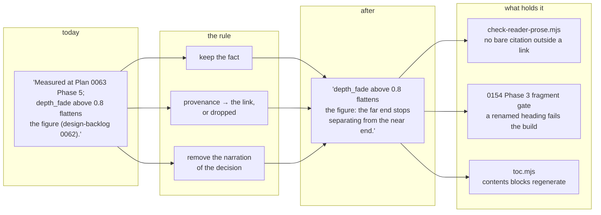

# 0155 — The reader documents stop explaining themselves

> **Status:** done — closed 2026-09-05. Five phases landed (`3fdd391`, `2bce9be`, `3bbcaf0`,
> `0dc85dd`, `18ee259`): 235 bare citations across the five Entrance A documents went to 0, the
> 121 that remain are all inside links, and `scripts/check-reader-prose.mjs` holds the result at
> pre-push and in CI. Mode 4 review: **no blockers, no majors, four minors, two nits.** Verified
> independently — `cargo nextest run --workspace` 1536/1536 pass (including
> `every_declared_param_is_documented_in_the_presets_readme`, which is the mechanical proof the
> parameter roster survived); all nine Node gates green; the site builds to 137 pages / 135
> routes / 26,893 B largest split route; a fragment sweep over all 412 tracked markdown files
> found zero unresolved anchors in any file this plan touched; and an independent numeric diff
> of the three rewritten files found nothing removed beyond what the log's own table names.
> Version: **none** (docs/chore-only).
> **Created:** 2026-09-05
> **Owner skill(s):** dev
> **Related ADRs:** [0168](../../adrs/0168-the-reader-documents-address-a-reader-and-the-record-stays-a-link.md)
> **Hard dependency:** [0154](0154-the-site-becomes-navigable.md) **Phase 3.** This plan renames
> headings, and under [ADR-0166](../../adrs/0166-a-published-document-splits-into-routes-by-size.md) a
> heading is a URL. `scripts/check-doc-links.mjs` deliberately never validates fragments, so today a
> renamed heading breaks every inbound anchor silently. 0154 Phase 3 turns that into a build
> failure. **Do not start this plan before that phase has landed.**
> **Lane guidance:** build on `main` directly. Every phase is markdown; no Rust compiles.

## TL;DR

Three documents a preset author lives in carry 235 bare references to plans and ADRs — *"Measured at
Plan 0063 Phase 5"*, *"ADR-0047's treatment"* — written for a skill session reconstructing why a
threshold exists, and read by someone who wants to know what a parameter does. This plan rewrites
that prose under one rule: keep the fact, demote the provenance to the link. The 109 citations that
are already links stay links; what goes is the clause built around them. A gate then holds the
result, so the five reader documents cannot silently drift back.

## Context & problem

The user's instruction was direct: a reader *"should understand how the application works, but not
why this or that decision were made."*

The citation convention that produced this prose is deliberate and good.
[ADR-0127](../../adrs/0127-a-comment-carries-the-mechanism-and-the-decision-record-stays-in-docs.md)
requires code comments to cite by bare number so a claim can be traced to the measurement that
earned it, and `CLAUDE.md` extends the habit to documentation. It has worked — this corpus is
unusually free of assertions nobody can check. It also addresses the wrong audience in the documents
a user reads.

Measured 2026-09-05 against the tree at `9dc2183`:

| Document | Bytes | Citations | Already links | **Bare, in scope** |
|---|---:|---:|---:|---:|
| `presets/README.md` | 273,211 | 220 | 63 | **157** |
| `docs/presets.md` | 75,803 | 68 | 20 | **48** |
| `docs/preset-palettes.md` | 65,009 | 54 | 24 | **30** |
| `docs/preset-guide.md` | 18,215 | 2 | 2 | 0 |
| `docs/preset-tuning-walkthrough.md` | 18,079 | 0 | 0 | 0 |

Two of the five are already clean. That is the most useful fact here: the register being asked for
is not hypothetical, it is what the illustrated guide and the tuning walkthrough already do, and the
other three can be brought to it rather than invented.

The work is bounded by what these documents are *for*. They are what the `preset-author` lane is
pointed at instead of keeping a private catalogue
([ADR-0017](../../adrs/0017-preset-author-skill-lane.md)) — the private copies rotted while these
stayed current. They cannot be thinned. And much of the provenance is what makes a number checkable:
*"measured at Plan 0063 Phase 5"* is the difference between a threshold a reader can trust and one
they take on faith.

## Decision

Rewrite the prose of the three documents that carry bare citations, under the rule recorded in
[ADR-0168](../../adrs/0168-the-reader-documents-address-a-reader-and-the-record-stays-a-link.md):

> **Keep the fact. Demote the provenance to the link.**

A sentence states what the software does and what the number is. The plan or ADR that earned it
becomes a link on that sentence, or is dropped where the sentence stands on its own. What is removed
is the narration of the decision — which plan measured it, in which phase, what it superseded — not
the measurement.

```
before:  Measured at Plan 0063 Phase 5; `depth_fade` above 0.8 flattens the figure
         because the far end of the attractor stops separating (design-backlog 0062).

after:   `depth_fade` above 0.8 flattens the figure: the far end of the attractor stops
         separating from the near end.
```

We rejected a mechanical strip alone (it reaches 7 % of the corpus and leaves plan numbers
mid-sentence on every long page), marked rationale regions (they edit `docs/` to serve the site and
depend on authors remembering a convention forever), and a reader-facing copy per document (the
split-source hazard ADR-0154 exists to prevent).

**A note on the owner tag.** Every phase below is tagged `dev` because the plan vocabulary is `dev`
or `human` and nothing else. This is editorial work on documentation, which is closer to
`architect`'s territory than to `dev`'s, and closer still to `preset-author`'s for the roster. The
vocabulary has no way to say that. It is flagged here rather than worked around; if this recurs, the
tag vocabulary is what needs an ADR.

## Architecture diagram



## Implementation phases

### Phase 1 — the rule, on the smallest real case

- **Owner skill:** dev
- **What:** Rewrite `docs/preset-palettes.md` — 30 bare citations, 65,009 bytes. This is the phase
  where the rule is established in practice, so its result is the reference for the four that
  follow. Where a passage cannot be rewritten without losing a fact, keep the citation as a link and
  note the passage.
- **Files touched:** `docs/preset-palettes.md`.
- **Done when:** No `Plan NNNN` or `ADR-NNNN` appears in the file outside a markdown link. Every
  measurement, threshold and named parameter that was in the document before is still in it — this
  is a rewrite of framing, not a cut, and the file does not get materially shorter. `node
  scripts/toc.mjs` regenerates the contents block and `node scripts/check-doc-links.mjs` exits 0.

### Phase 2 — the expression language

- **Owner skill:** dev
- **What:** Rewrite `docs/presets.md` — 48 bare citations, 75,803 bytes. This is the grammar
  reference; the `preset-author` skill points at it as **the** expression-language authority, so
  every function, variable, constant, operator and error message it documents must survive intact.
- **Files touched:** `docs/presets.md`.
- **Done when:** No bare citation outside a link. The grammar surface is unchanged — the set of
  documented functions, variables and constants before and after is identical, checked by listing
  them from both versions rather than by reading.

### Phase 3 — the roster's own sections

- **Owner skill:** dev
- **What:** Rewrite the ten smaller `##` sections of `presets/README.md` — the skeleton, the
  representative flag, the expression language summary, the palette surface, and the `[smoothing]`,
  `[latch]`, `[occupancy]`, world-space, `[layer]` and starting-point sections. Together they are
  about 40 KB and they are where a reader arrives.
- **Files touched:** `presets/README.md`.
- **Done when:** No bare citation outside a link in those sections. Every parameter name, default and
  range is unchanged. The three large sections are deliberately untouched and are Phase 4.

### Phase 4 — the three sections that are most of the document

- **Owner skill:** dev
- **What:** Rewrite `## Systems and their named parameters` (109,093 B), `## Engine-wide controls`
  (63,013 B) and `## Structural config` (47,757 B). This is the bulk of the 157 and the bulk of the
  risk: these sections are reference tables wrapped in prose, and the tables are what the
  `preset-author` lane reads.
- **Files touched:** `presets/README.md`.
- **Done when:** No bare citation outside a link anywhere in the file. The parameter roster is
  complete — the set of named parameters documented before and after is identical, listed from both
  versions and compared, not eyeballed. Under 0154's split these sections are 32 routes; each still
  opens with something that tells a reader what the section is for.

### Phase 5 — the gate, and the sweep

- **Owner skill:** dev
- **What:** `scripts/check-reader-prose.mjs` asserts that no bare `Plan NNNN` / `ADR-NNNN` appears
  outside a markdown link in the five Entrance A documents. Wire it into `.githooks/pre-push` and
  CI's `links` job beside the other gates, add its seeded bite check under `scripts/fixtures/`, and
  update `CLAUDE.md`'s `scripts/` block, which states the gate count.
- **Files touched:** `scripts/check-reader-prose.mjs` (new), `scripts/fixtures/`,
  `.githooks/pre-push`, `.github/workflows/ci.yml`, `CLAUDE.md`.
- **Done when:** The gate exits 0 on the rewritten tree, and exits 1 naming file and line when a bare
  citation is introduced into any of the five — provoked in all three directions (a bare citation
  added, a linked citation left alone, a citation in an Entrance B document ignored) and the tree
  restored. `CLAUDE.md`'s gate count is correct. The `preset-author` skill's pointers into these
  three documents still describe what is there.

## Risks & open questions

- **A fact can leave with its provenance, and nothing catches it.** The gate checks that citations
  are gone; no gate can check that a rewrite is good. The per-phase done-whens are written to make
  the loss checkable where it is mechanical — parameter sets, grammar surfaces, thresholds compared
  before and after by listing rather than reading. Prose judgement is not covered and cannot be.
- **This is 414 KB of judgement in one `dev` session.** If it does not fit, stopping cleanly at a
  phase boundary is correct and expected; the phases are ordered so each is independently valuable
  and leaves the tree consistent.
- **Heading renames move URLs.** 0154 Phase 3 makes inbound breakage a build failure, which is the
  hard dependency in the header. External links and bookmarks are not covered by anything.
- **The `preset-author` lane reads these files while they change.** A session running against a
  half-rewritten roster sees a consistent document at every phase boundary but not mid-phase.
- **Two conventions will now coexist.** Entrance B and all code comments keep bare-number citation
  per ADR-0127; these five documents forbid it. The boundary is a filename list in a gate script,
  and someone will eventually be surprised by it.

## What this plan does NOT do

- **It does not touch Entrance B.** `docs/capturing.md`, `docs/nfr.md`,
  `docs/on-device-validation.md`, `docs/releasing.md`, the two specs and the technique catalogue keep
  their citations, because their readers are contributors for whom the working record is the point.
- **It does not shorten the documents.** Completeness is the property ADR-0154 named as worth
  keeping, and the `preset-author` lane depends on it. A materially shorter file is a defect here,
  not a success.
- **It does not remove the 109 citations that are already links.** A link is inert until clicked.
- **It does not change any code, default, parameter name or behaviour.** Nothing under `core/`,
  `standalone/`, `plugin-foobar/` or `presets/*.toml` is touched.
- **It does not touch the site.** All of that is [Plan 0154](0154-the-site-becomes-navigable.md).

## Implementation log

> Written by `dev` — one row per phase as that phase's commit lands, and the close block after the
> last one. **The phases above are the contract; everything here is what happened.**
> **Observations, never conclusions:** this says where to look, architect decides how it went.

**Lane:** `main` directly, no worktree.

| phase | owner | state | commit |
|---|---|---|---|
| 1 — the rule, on the smallest real case | dev | done | `3fdd391` |
| 2 — the expression language | dev | done | `2bce9be` |
| 3 — the roster's own sections | dev | done | `3bbcaf0` |
| 4 — the three sections that are most of the document | dev | done | `0dc85dd` |
| 5 — the gate, and the sweep | dev | done | `18ee259` |

### Notes

**Deviations from the phases as written.**

- **P1 touched two files outside its `Files touched`.** Removing the trailing citation from
  `## Dark on light — …` and `` ## Flat colour on `shape_collage` — … `` moves the source slug they
  are addressed by. The 0154 Phase 3 gate failed the site build on the two inbound links,
  `docs/preset-guide.md:257` and `presets/README.md:4198`; both anchors were repointed in the same
  commit and nothing else in either file was touched. The same thing happened at larger scale in
  P4 — see below.
- **P3 rewrote the front matter too.** Lines 1-129 sit above `## Skeleton` and so inside no `##`
  section, which puts them outside P3's `What` and inside P4's "anywhere in the file". They carried
  16 bare citations and are the first thing a reader sees, so they went with the ten sections.
- **P1 fixed one thing that is not a citation:** a pre-existing `LUT'''s` typo, in a passage that
  phase rewrites around.
- **P1's `toc.mjs` done-when is vacuous for its file.** `docs/preset-palettes.md` carries no
  `toc:begin` block. It was run; it reports the repository's six blocks current.
- **P1's commit carried two link repairs that were not mine.** Another session committed plan
  0154's close (`9b48c22`) into this working tree mid-phase, and its repair of the two `0154` links
  in this plan's own header was in the tree when P1 committed. Nothing was lost. Every phase here
  used `git commit -- <paths>` rather than `git add`, because that session's staged rename was
  sitting in the index.

**Information deliberately removed, beyond citations.** Four passages published a measurement of
behaviour the engine no longer has. The current figures are kept and the superseded ones are gone:

| where | what went |
|---|---|
| `docs/presets.md`, `presets/README.md` | the downbeat-lock fold's old column (`0.00`, `0.79`, `4.16`); the three current figures stay, and techno's paragraph now argues from four-on-the-floor having no bar accent |
| `docs/presets.md`, `presets/README.md` | the fixed 1280x720 post grid and its 28 % stretch |
| `presets/README.md` | two polyline segment counts in the mandala budget; `492`, `1 092`, `20 000` and `576` against `24` stay |
| `presets/README.md` | `17.37`, the `Rich` luminance of the un-normalized attractor deposit, and the commit SHA `00d99d0`; the live pair `10.86` / `10.34` stays |

**Counts, and what was compared rather than read.** 235 bare citations to 0 across the five; 121
citations remain, all inside links. 450,330 to 442,992 bytes (-1.6 %). Per phase, the
backtick-quoted vocabulary of each file was listed before and after and diffed:

| phase | bare | bytes | identifiers lost |
|---|---:|---|---|
| 1 | 30 to 0 | 65,009 to 64,473 | none |
| 2 | 48 to 0 | 75,816 to 73,841 | none; grammar surface identical — 66 table row heads, 20 call forms |
| 3 | 41 to 0 | 273,211 to 271,801 | `00d99d0`, `17.37` |
| 4 | 100 to 0 | 271,801 to 268,403 | `` `0 = falloff` `` as a code span, whose value and name both stay in the table above it; and the retired presets `fragment_kaleido` and `reaction_gilt` |

**A citation form nothing in the repository was matching.**
`### Ink on paper — … (Plans 0027, 0078)` uses the **plural**, and
`site/src/plugins/strip-provenance.mjs`'s pattern is the singular — so that heading was reaching
the built site with both numbers in its route name. It is rewritten, and the new gate matches the
plural. **Nothing under `site/` was changed by this plan.**

**18 headings renamed across P1, P3 and P4; 21 inbound anchors repointed.** Old and new slugs were
computed with `github-slugger` over each whole document in reading order, which is what
`split-document.mjs` keys its fragment map on. One further match was in
`site/src/plugins/split-document.mjs`, inside the doc comment that explains that map by quoting
`presets/README.md#attractor-detail-sharpness-plan-0027` as an example of a link written with the
provenance still in it — reverted, because rewriting it destroys the example.

**The built site was checked at every phase that moved a slug**, not only the markdown:
`npm run build`, then `check-site-links.mjs` and `check-site-routes.mjs` — 137 pages, 135 routes,
largest split route 26,893 B. No route directory under `site/dist/` carries a citation any more.

**P5 — two link forms the first draft got wrong, both found by the shipped tree.** The gate
reported two false positives on `presets/README.md`: the collapsed reference `[ADR-0098]` and its
definition, which is written `> [ADR-0098]: …` **inside a blockquote**. A definition-line pattern
anchored at the start of a line does not see it, and a definition the scanner misses makes every
*use* of that label read as bare. Both patterns now allow a `>` prefix, and the fixture seeds that
shape.

**P5 — provoked in all three directions on the real tree, and the tree restored.** A bare
`Plan 0063` appended to `docs/preset-palettes.md` exits 1 naming `docs/preset-palettes.md:1141`
and printing the line; the same two citations written as links exit 0; the same bare pair appended
to `docs/capturing.md` exits 0, because Entrance B is out of scope. `git status` after: neither
file modified. The fixture bites at exit 1 with six breaks across three files.

**P5 — the skill pointers were checked, not assumed.** No file under `.claude/skills/` links into
any of the five with a `#fragment`, so the 18 renames reach none of them.

### Close triggers

- **`presets/` touched:** `presets/README.md` only, in Phases 3 and 4. **No `.toml` was touched** —
  `git diff --name-only 3fdd391^..18ee259 -- 'presets/*.toml'` is empty — so nothing about the
  shipped preset set, the embedded table or `core/build.rs`'s glob is affected.
- **Plan header `Closes:`** none
- **What shipped:** docs-chore-only, plus one new gate. No `core/`, `standalone/` or
  `plugin-foobar/` file was touched, and no default, parameter name or behaviour moved.
  The five documents went 450,330 -> 442,992 bytes (-1.6 %) and 235 bare citations -> 0; the 121
  that remain are all inside links.
- **Operator docs touched:** none. `docs/on-device-validation.md`, `docs/releasing.md` and
  `docs/capturing.md` are all Entrance B and are untouched by every phase.
- **Backlog probes (`node scripts/check-backlog-claims.mjs`):** exit 0.
- **Full suite:** `cargo nextest run --workspace` — exit 0, **1536 tests run, 1536 passed, 5
  skipped** (31 slow), 761.949 s. Run at the tip, after Phase 5's commit.
- **Outstanding `human` phases:** none. Every phase in this plan is `dev` and all five landed.

### Where a fresh read is worth most

The "information deliberately removed" table above. No gate can tell a good rewrite from a bad
one, and that judgement is the only thing in this plan a reviewer cannot check mechanically.

## Followups (after this lands)

- The same treatment for `docs/capturing.md` if it turns out non-contributors read it — it is the
  largest Entrance B document at 165,028 bytes and its `shot` CLI section is genuinely user-facing.
- An ADR on the phase owner-tag vocabulary, if editorial work recurs often enough that tagging it
  `dev` keeps being wrong.
