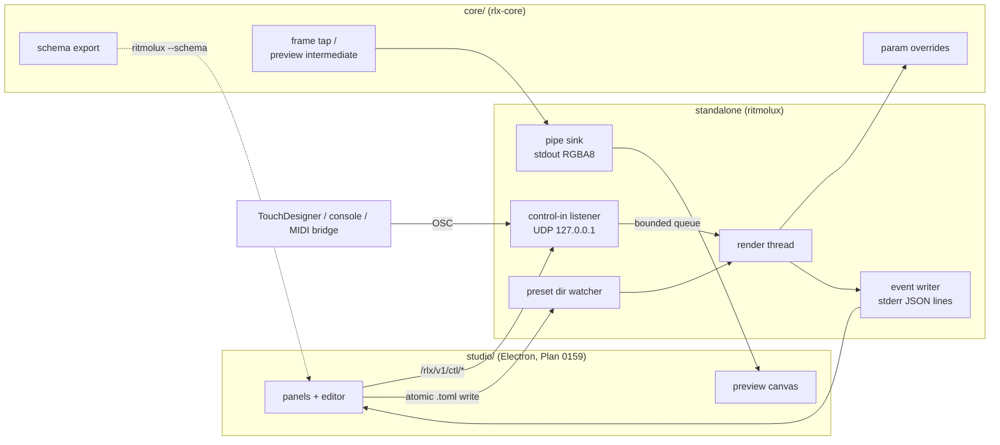

# 0158 — The player grows a studio-facing surface

> **Status:** done - closed 2026-09-10. Six `dev` phases on `plan-0158-studio-facing-surface`
> (`80123f0` -> `367c3a7`). Mode 4 review: **no blockers, two majors, six minors.** Full
> suite re-run on the merged tip: 1672 passed, 6 skipped, 441 s; clippy and fmt clean; all
> seven Node gates green. **Phase 7 stays open** and was extracted at the close to
> [`docs/on-device-validation.md`](../../on-device-validation.md), which is where `human` work
> that waits on hardware lives.
> **Created:** 2026-09-09
> **Owner skill(s):** dev, human
> **Related ADRs:** [0175](../../adrs/0175-the-studio-is-a-separate-application-that-never-draws-a-frame.md) (accepted),
> [0176](../../adrs/0176-the-player-is-driven-over-osc-control-in-and-reports-on-its-standard-streams.md) (accepted),
> [0125](../../adrs/0125-the-live-video-out-is-a-spout-sender-fed-by-a-frame-tap.md),
> [0143](../../adrs/0143-the-operator-console-is-a-second-surface-and-the-shell-owns-its-meaning.md),
> [0164](../../adrs/0164-the-osc-address-root-becomes-rlx-in-one-break.md),
> [0170](../../adrs/0170-a-parameters-reference-row-is-generated-from-the-declaration-the-engine-reads.md)

## TL;DR

The player learns to be driven and to report, so that a separate studio can edit a preset while
the music plays and see the result. Six things land, all opt-in and all costing a windowed run
nothing: an in-place parameter override in the core; an OSC control-in listener under
`/rlx/v1/ctl/`; a structured event stream on standard error; a JSON export of the preset schema;
a pipe sink for the existing headless frame tap; and a preview copy of the windowed show's frame,
read back without blocking the display loop. The first user-visible behavior is a slider in
TouchDesigner moving a parameter on the running player with no file involved. The last is the
studio's preview coming from a windowed player mid-show.

## Context & problem

ADR-0175 decides the studio is a separate Electron application that never draws a frame. That
leaves the player as the only renderer, and today it can be told almost nothing from outside:
hotkeys, the console, a preset file rewritten under the watcher, and a `config.toml`. It reports
almost nothing structured either: `eprintln!` lines for preset errors, a diagnostics log, and OSC
telemetry that carries levels for lights.

The live editor needs four things the player does not offer. A parameter must move at slider
rate and stay moved without the reload path, which is around 150 ms late and, through
`configure_active_scene` in `core/src/render/roster.rs`, snaps the smoothers and resets the latch
bank on every save. The player's facts must reach a parent process in order: which preset is
active, what failed to parse and where, what the frame rate is. The studio must know what a
preset *can* contain, which the engine already declares through `ParamSpec` and the serde
schema in `core/src/preset/schema/`, and which `presets/README.md` is generated from
(ADR-0170). And the studio must see the picture. `--stream` already renders headless and reads
every frame back to the CPU; its only sink is Spout, behind a feature and Windows-only.

## Decision

We build the surface in the player and the core, in the order that makes each phase useful on
its own, and we write the protocol down as a living spec while it lands. We rejected a JSON
socket protocol (a codec and a framing layer for no external-controller benefit), files as the
only channel (150 ms late and a state reset per save), and a second engine in the studio (a
divergent preview and a port). ADR-0176 carries the reasoning.

## Architecture diagram



## Implementation phases

### Phase 1 — A parameter moves in place, and a save does not reset the look
- **Owner skill:** dev
- **What:** The core gains a per-name override on the active preset that shadows the evaluated
  binding until cleared, and a reload of the *same* preset with only its bindings changed keeps
  the scene's accumulated state instead of snapping and resetting.
- **Files touched:** `core/src/render/roster.rs`, `core/src/render/mod.rs`, the param smoothing
  and latch modules, `core/src/render/tests.rs`, a new `core/tests/override.rs`.
- **Done when:**
  - `Renderer::set_param_override(name, value)` and `clear_param_override(name)` exist; an
    override applies on the next frame, survives across frames, and is dropped by a preset
    switch and by `set_presets`. A test asserts the routed value on the frame after the call
    equals the override and the frame after the clear equals the binding.
  - A reload that replaces the roster with one where only the active preset's bindings differ
    does not call `configure_active_scene`'s reset path: the smoothers keep their eased values,
    the latches keep their state, and a stateful scene keeps its field. The test drives a trails
    or feedback preset for a hundred frames, reloads with one constant changed, and asserts the
    accumulated field is not cleared. Phrase it as a property: the field's energy after the
    reload is within the same frame-to-frame change the run showed before it, not a fresh
    field's.
  - A reload that changes the system, or the roster's shape, still takes the full reset path.
  - The C ABI is untouched; `docs/specs/0001-c-abi.md` needs no reconcile.

### Phase 2 — The player listens
- **Owner skill:** dev
- **What:** `--control <host:port>` and `[control]` in `config.toml` open a UDP listener,
  loopback by default; a hand-written decoder beside the encoder parses `/rlx/v1/ctl/*`; decoded
  actions cross to the render thread through a bounded queue and apply between frames.
- **Files touched:** `standalone/src/osc.rs` (split the encoder's module into `osc/encode.rs`
  and a new `osc/decode.rs`), new `standalone/src/control.rs`, `standalone/src/cli.rs`,
  `standalone/src/config.rs`, `standalone/src/run.rs`, `standalone/src/osc/tests.rs`,
  `docs/configuration.md`, new `docs/specs/0003-studio-control-protocol.md`.
- **Done when:**
  - Every message ADR-0176's table names round-trips through the encoder and the decoder
    byte-for-byte, and a fuzz-shaped test feeds truncated, over-long and mistyped packets and
    asserts none panics and each is counted as rejected.
  - A `ctl/param` datagram sent to the loopback port changes the routed value on the next frame,
    through Phase 1's override. `ctl/preset` dissolves to the named preset. `ctl/transport`
    drives the same four verbs the console's strip does, by the same code path.
  - The listener thread allocates nothing per packet after start, never touches the ring or the
    analyzer, and the queue keeps the **last** value per parameter name under a flood so the
    render thread drains a bounded amount per frame. A test sends ten thousand datagrams for one
    name and asserts the frame after sees only the last.
  - With no `--control` and no `[control]` key, no socket is opened: a test asserts the listener
    is `None` and `netstat`-style enumeration is not needed because the constructor is never
    called.
  - `docs/specs/0003-studio-control-protocol.md` exists in the shape `docs/specs/README.md`
    prescribes, its index gains the row, and the spec's invariants name what this phase tests.

### Phase 3 — The player reports
- **Owner skill:** dev
- **What:** `--events` prints one JSON object per line on standard error, through the same
  hand-rolled writer `standalone/src/shot/json.rs` uses, for the roster ADR-0176 lists.
- **Files touched:** new `standalone/src/events.rs`, `standalone/src/preset_dir.rs` (errors and
  warnings become events as well as lines), `standalone/src/run.rs`, `standalone/src/diaglog.rs`
  (the health figures already computed there feed `health`), `core/src/preset/mod.rs` if the
  parser's span has to be surfaced, `docs/configuration.md`, `docs/specs/0003-…`.
- **Done when:**
  - Every event line begins with `{`, ends with `\n`, carries `"v": 1` and `"ev"`, and no
    existing human diagnostic line begins with `{`. A test renders every event through the writer
    and asserts each parses as one object with those two fields, and a second grep-shaped test
    holds every `eprintln!` format string in the standalone to a first character that is not `{`.
  - `preset_error` carries the file and the message, and the line and column whenever the TOML
    parser's span provides them; an expression error carries the parameter name. A test loads a
    preset with a deliberate syntax error and asserts the line matches the one the fixture put it
    on.
  - `hello` is the first line after start and carries the workspace version, the control port
    actually bound, and the schema hash Phase 4 defines; `health` arrives once a second while a
    frame is being drawn and carries fps, frame-time p50 and p99, and the rejected-control count.
  - Without `--events`, nothing on standard error changes: the test compares a run's stderr
    against the pre-plan baseline for the same arguments.

### Phase 4 — The engine states what a preset can contain
- **Owner skill:** dev
- **What:** `ritmolux --schema` prints the preset schema as JSON: every system, every
  `ParamSpec` row (name, default, range, doc line), and every structural table with its keys,
  types, enumerations and defaults; plus a stable hash of it that `hello` reports.
- **Files touched:** `core/src/preset/schema/` (a descriptor per table beside its serde struct),
  new `core/src/preset/schema/export.rs`, `standalone/src/cli.rs`, `core/tests/preset.rs`,
  `docs/capturing.md` or `docs/configuration.md` for the flag.
- **Done when:**
  - The parameter half is generated from the same `ParamSpec` declarations the README block is
    (ADR-0170), so the two cannot disagree: a test renders both from one walk and asserts the
    names, defaults and ranges are identical.
  - The structural half cannot silently miss a key: a test round-trips every shipped preset and
    every `docs/examples/` preset through the descriptor, asserting that every key each file uses
    is one the descriptor names, and that every key the descriptor names is accepted by the
    loader. A key added to a serde struct without a descriptor row fails the test.
  - The hash changes when and only when the emitted document changes: two runs on one build agree,
    and a test that mutates one default sees a different hash.
  - No JSON crate is added to any workspace crate.

### Phase 5 — The headless tap writes to a pipe
- **Owner skill:** dev
- **What:** `--stream --sink stdout` sends raw RGBA8 frames on standard output at the requested
  size and rate, on every platform and with no feature, with a `stream` event announcing the
  geometry before the first frame. The Spout sink is unchanged.
- **Files touched:** `standalone/src/stream.rs` (the featureless `run` becomes real; the sink
  becomes a small trait with two implementations), `standalone/src/cli.rs`,
  `docs/capturing.md`.
- **Done when:**
  - A parent process reading standard output receives exactly `width * height * 4` bytes per
    frame, frames arrive in order, and the first bytes of standard output are the first frame:
    a test spawns the player with `--frames 30 --sink stdout` on the software adapter and asserts
    the byte count and that the `stream` event on stderr preceded them.
  - Nothing else is ever printed on standard output while a sink is open: the grep-shaped test
    from Phase 3 extends to `println!` and `print!` in the standalone, allowing only the sink.
  - The default preview request is 640x360 at 30 fps; the cost line the Spout path prints
    (`render+readback`, `send`) is printed for this sink too, so a figure exists for a reader on
    another machine.
  - The writer blocks on a full pipe rather than dropping, and the deadline pacing absorbs it:
    a test stalls the reader for one second and asserts the run resumes at the correct frame
    index, in ADR-0125's shape, rather than drifting.

### Phase 6 — The windowed show gets a preview copy without a stall
- **Owner skill:** dev
- **What:** `--preview stdout` on a windowed run routes the frame through the console's
  preview intermediate (`Renderer::open_preview`, ADR-0143), copies it to a staging buffer at the
  preview size, maps it asynchronously and consumes it **one frame late** with a non-blocking
  poll, and writes it to the same pipe format Phase 5 defines from a writer thread.
- **Files touched:** `core/src/render/preview.rs`, `core/src/render/mod.rs`, new
  `core/src/render/preview_readback.rs`, `standalone/src/run.rs`, `standalone/src/stream.rs`
  (shared sink), `core/tests/console_preview.rs`, `docs/running.md`.
- **Done when:**
  - The show's pixels are unchanged with the preview on: the byte-identity assertion
    `core/tests/console_preview.rs` already makes is extended to the readback path.
  - No blocking wait enters the display loop: a grep-shaped test holds `core/src/render/` to
    no `wait_indefinitely` outside `capture.rs` and `capture_api.rs`, and the readback consumes
    the buffer mapped by the *previous* frame's submission.
  - Residency does not grow: the headless tap waits on purpose because a headless loop outruns
    the GPU (the note above `render_tapped`'s poll in `core/src/render/capture_api.rs`); the
    windowed loop is paced by the swapchain, and this phase asserts it, with the 300-frame
    residency test the console already runs extended to the preview readback.
  - The cost is measured and printed, not assumed: the `diagnostics.log` line for the console
    gains the preview's frame-time p50 and p99 with the readback on and off, in the shape
    ADR-0172 requires with a witness that the readback ran. The plan does not set a threshold;
    the number is reported and the human phase judges it.
  - The default stays **off**. Nothing changes for a run without the flag.

### Phase 7 — The on-device check
- **Owner skill:** human
- **What:** Two things CI cannot see: a real controller and a real show.
- **Done when:**
  - From TouchDesigner or any OSC sender on the same machine, `ctl/param` moves a parameter on a
    playing preset and `ctl/preset` switches it, with `--events` showing the acknowledgement in
    `health`'s counters.
  - A windowed player on the projector with `--preview stdout` piped to a file plays a track for
    ten minutes; the preview frames are visibly the show, and the frame-time line from Phase 6 is
    read and recorded in `docs/on-device-validation.md`.

## Data shapes

```jsonc
// illustrative — one event line on stderr
{"v":1,"ev":"preset_error","file":"C:\\...\\aurora.toml","line":41,"col":9,
 "message":"unknown function `bins`"}
{"v":1,"ev":"stream","width":640,"height":360,"fps":30,"format":"rgba8"}
{"v":1,"ev":"health","fps":59.8,"frame_ms_p50":4.1,"frame_ms_p99":9.7,"ctl_rejected":0}
```

```rust
// illustrative — the override, core side
impl Renderer {
    pub fn set_param_override(&mut self, name: &str, value: f32) -> Result<(), ParamError>;
    pub fn clear_param_override(&mut self, name: &str);
    pub fn clear_param_overrides(&mut self);
}
```

The schema document's exact shape is Phase 4's to fix; the plan holds it to two properties (the
params half is generated from `ParamSpec`, the structural half is round-trip gated) rather than
to a layout.

## Risks & open questions

- **Keeping the scene's state across a reload may be harder than skipping a reset.** If a
  scene's `configure` rebuilds GPU resources from the preset, "same system, new bindings" needs a
  narrower entry point than the current one. Phase 1 may land the override first and the
  state-keeping reload as its second commit; both are required for the phase to be done.
- **The TOML parser's span may not survive the loader's error type.** Phase 3's line and column
  are "whenever the parser provides them"; if `PresetError` flattens the span, the phase adds it
  to the type rather than parsing the message.
- **A blocking pipe write on a windowed run is a stall.** Phase 6 writes from a thread with a
  bounded queue that drops frames when the reader is slow; Phase 5's headless writer may block
  because that loop has no present deadline. The two policies are deliberate and documented.
- **A UDP listener on a show machine.** Loopback by default, off by default, no message can
  allocate or reach the audio path. The one real exposure is that anything on the machine can
  move a parameter, which is the feature.
- **Two lanes on `standalone/src/run.rs`.** Plan 0133 and Plan 0120 are approved and both touch
  the run loop; this plan should open after or beside them in a worktree and merge `main` before
  Phase 6.

## What this plan does NOT do

- **No studio.** Plan 0159 builds it; this plan is what it drives.
- **No `render` subcommand and no project file.** ADR-0175 decides both; each arrives with the
  studio plan that needs it (clip rendering, show projects), so the vocabulary grows with a use.
- **No MIDI.** A MIDI bridge is a program that speaks `ctl/*`; nothing in the player learns MIDI.
- **No Spout changes**, no macOS Syphon, and no change to telemetry's addresses or cadence.

## Implementation log

> Written by `dev` — one row per phase as that phase's commit lands, and the close block after the
> last one. **The phases above are the contract; everything here is what happened.**
> **Observations, never conclusions:** this says where to look, architect decides how it went.
> No per-criterion pass list, no self-assessment, no narrative — but a deviation from the plan or
> an unmet done-when is always disclosed. Stays shorter than `## Implementation phases` above.

**Lane:** `WORK/rlx-plan-0158` on `plan-0158-studio-facing-surface`.

| phase | owner | state | commit |
|---|---|---|---|
| 1 — A parameter moves in place | dev | done | `80123f0` |
| 2 — The player listens | dev | done | `a7e8a24` |
| 3 — The player reports | dev | done | `6d18fc6` |
| 4 — The engine states what a preset can contain | dev | done | `f512a2c` |
| 5 — The headless tap writes to a pipe | dev | done | `e9b27a2` |
| 6 — The windowed show gets a preview copy | dev | done | `367c3a7` |
| 7 — The on-device check | human | not started | |

### Notes

- **Phase 1, the field clause of the second done-when, could not be satisfied as stated.** The
  criterion asks for a test asserting "the accumulated field is not cleared" across a reload. The
  accumulation is cleared **only** by `PostStage::reset_resources`, and the only callers of that are
  `reset_for_capture` and `capture_audio_after_warmup` in `core/src/render/capture_api.rs` —
  `set_presets` never cleared it on either path, before this phase or after. A test on the field
  would therefore pass identically against the pre-phase engine. What I asserted instead is the
  clause that *is* observable, the eased values, in
  `a_rebind_keeps_the_eased_values_and_a_replacement_snaps_them` — and it carries a **control arm**
  (the same preset reloaded under a different name, which takes the full path) plus an assertion
  that the two arms differ by more than 10x, so a green run is evidence rather than a tautology.
  The latch half is asserted at unit level in `core/src/render/tests.rs`.
- **Phase 1 touched one file outside its list:** `core/src/render/composite.rs`, for the single
  `overrides: None` field on the outgoing side's `Active` — the outgoing half of a dissolve takes no
  overrides. Commit is the phase's own.
- **Phase 1 narrowed `set_presets`' rebind predicate to the two things the plan names** (roster
  shape and system), which is what `Roster::is_rebind_of` tests. The structural tables are still
  handed over on the rebind path, so a save that moved a `[palette]` still applies; the one
  non-idempotent hand-off, the `[layer]` scene construction, is skipped only while the layer's
  system is unchanged.

- **Phase 2 put `control.rs` in the standalone's LIBRARY**, not its binary: `standalone/src/lib.rs`
  declares it beside `osc`, so the file is at the path the plan names but reachable from
  `standalone/tests/`. That is what let the socket-to-pixels claim be tested at all.
- **Phase 2 added two files the plan does not list.** `standalone/tests/control_loopback.rs`
  carries the done-when's first bullet end to end — a real datagram on a real loopback port
  moving a rendered frame — which `standalone/src/osc/tests.rs` cannot reach, since it opens no
  socket and builds no renderer. `standalone/src/console/tests.rs` gained two tests holding a
  `ctl/transport` verb to the strip's own `action_for`. It also touched `standalone/src/input.rs`,
  `standalone/src/console.rs`, `standalone/src/main.rs`, `standalone/src/lib.rs` and
  `standalone/src/app_state.rs`, none of which the plan's file list names: the queue has to reach
  the renderer and the transport verbs have to reach the console's applier.
- **Phase 2's flood done-when is asserted in two places, and only one of them is the socket.**
  "The frame after sees only the last" is deterministic against the queue
  (`a_flood_of_one_name_leaves_one_slot_holding_the_last_value`) and is **not** assertable
  through a real socket: UDP may drop under a ten-thousand-datagram burst, so the last value
  received need not be the last sent, and a test that asserted otherwise would be asserting the
  kernel's buffer size. The socket test asserts the property that does survive that — a burst is
  handed to a frame one slot wide.
- **`auto` and `hold` are implemented as positions rather than presses**, which is narrower than
  ADR-0176's table reads: the console strip's rotation control is a toggle, and a control surface
  that repeats its state would otherwise turn rotation off with its second `auto`. Recorded in
  the spec's Provenance as the one place the implementation narrows the ADR.
- **Two comments landed in Phase 1 that `scripts/check-comment-hygiene.mjs` rejects**
  (`core/tests/override.rs`, plan-relative narration). Fixed inside Phase 2's commit rather than
  Phase 1's, so Phase 1's commit does not pass the pre-push gate on its own.
- **`docs/specs/0003-studio-control-protocol.md` is NOT published to the site.** Both sibling
  specs are in `site/src/plugins/rewrite-links.mjs`'s `PUBLISHED` map and this one is not, so the
  link `docs/configuration.md` now carries to it is rewritten to a github blob URL. Left as it
  is: what joins the site is not a `dev` call.

- **Phases 3 and 4 were implemented in the other order.** Phase 3's third done-when has `hello`
  carry "the schema hash Phase 4 defines", so Phase 3 cannot satisfy its own criteria until Phase 4
  has landed. Building 4 first makes both phases' done-whens true at their own commits and changes
  nothing about the final state; no phase block was edited.
- **Phase 4 touched seven files outside its list, all to give a closed roster one home.**
  `core/src/render/scenes/lines/mod.rs` (`CurveFamily::ALL`/`as_str`),
  `core/src/render/palette.rs` (`NamedPalette::ALL`/`as_str`),
  `core/src/render/feedback.rs` (`Deposit::ALL`/`as_str`/`from_name`),
  `core/src/render/scenes/particles/family.rs` (`AttractorFamily::MAPS`/`as_str`),
  `core/src/render/scenes/lines/hankin.rs` (`TILINGS`),
  `core/src/preset/schema/mod.rs` (`LayerJoin::ALL`/`as_str`) and
  `core/src/preset/schema/raw/feedback.rs` (the loader's own `max`/`add` pair, now read off
  `Deposit::ALL`). The export's `KeyKind::Roster` names a type rather than listing strings, so
  without these the document would have carried a second copy of every roster in the engine.
  `core/src/preset/schema/tests.rs` and `standalone/tests/help_cli.rs` also gained tests.
- **The descriptor-versus-serde check is real reflection, and both directions were verified to
  fail.** `FieldProbe` in `core/src/preset/schema/tests.rs` is a `Deserializer` that answers
  nothing and records the field roster `#[derive(Deserialize)]` asks it for. Adding an undescribed
  field to `RawMesh` fails the test; deleting the `layout` row from the `[spectrum]` descriptor
  fails the shipped-preset walk with five named files. Both were run and reverted.
- **`--schema` prints 59 KB on one line**: 12 systems, 7 engine stages, 343 parameters and 16
  structural tables, hash `0965e83a83985c0e` at this commit. It parses as JSON.

- **Phase 3's `hello` is the first EVENT, not the first line, and it cannot be the first line.**
  The greeting carries the control port actually bound; that port comes from the operator config;
  the config path resolves under the per-user directory; and that directory may still need
  migrating. So `migrate_app_dir`'s notice, and the tier and input lines a configured rig prints,
  precede it — observed on this machine, where all three appear. The invariant is recorded in
  `docs/specs/0003` as the narrower claim, and `stream_split.rs` asserts that narrower claim plus
  the stronger one that actually matters: the human diagnostics are **byte-identical** with
  `--events` and without it.
- **Phase 3's grep-shaped test carries an allowlist of five leading placeholders.** The done-when
  asks that every `eprintln!` format string begin with something other than `{`; nineteen existing
  call sites are `eprintln!("{msg}")` and friends, whose *rendered* line never begins with a brace.
  Rewording them would change operator-visible stderr, which the fourth done-when forbids. So
  `standalone/tests/stream_split.rs` allows a leading placeholder from a named list — four
  shell-built message variables and one constant whose value is fixed in the crate — and fails on
  any other, including a literal `{{`. It found one real case (`{PRESET_DIR_ENV}`) on its first run.
- **Phase 3 touched three files outside its list.** `core/src/diag/mod.rs` and
  `core/src/render/mod.rs` gained `frame_ms_p50`: `health` wants a median and `Metrics` mirrors the
  C ABI's `RlxMetrics`, so a field there would widen that surface — it is a native-only accessor
  beside the analysis snapshot instead, generalising the existing p99 into one percentile function.
  `core/src/preset/schema/error.rs` gained `PresetError::span()` and `param()`, which is what the
  plan's own risk note said to do if the span did not survive the loader's error type. It does
  survive — `PresetError::Toml` holds the whole `toml::de::Error` — so the accessor is a delegation
  rather than a new field. `standalone/src/input.rs`, `standalone/src/app_state.rs` and
  `standalone/src/cli.rs` were also touched, for the emission sites and the flag.
- **`preset` is reported from what is on screen, once per frame**, rather than from each of the six
  sites that can change the active preset. A switch dissolves, so a site announcing its own would
  name the incoming preset a frame before it was drawn.
- **An expression error carries no line or column, and that is structural**: it is raised after the
  document has been parsed into values, which carry no position. The done-when asks for the
  position "whenever the TOML parser's span provides them", and for this class it never does — the
  parameter name is what that arm carries instead, and the test asserts the span is absent so the
  expectation moves visibly if the loader ever grows one.
- **`health` carries two counters the plan's illustrative shape does not name** — `ctl_dropped`
  (actions the bounded queue had no room for) beside `ctl_rejected` (datagrams the decoder
  refused), plus `ctl_refused` (overrides the engine refused). Three different failures with three
  different fixes; one number would have hidden which.

- **Phase 5's Spout arm is not compiled anywhere I can reach, and the restructure moved it.**
  `--features spout` needs the third-party SDK staged by `packaging/spout/fetch-sdk.ps1`, which is
  not on this machine, and the only workflow that builds with it is `release.yml` on a `v*` tag —
  CI's `check` job does not. So `SpoutFrameSink` and the Spout half of `open_sink` are the one part
  of this plan the compiler has never seen. I kept the body a mechanical move of the code that was
  there and checked every call against `standalone/src/spout/mod.rs`'s signatures by hand
  (`SpoutSender::new(&str, u32, u32, Option<u32>) -> Result<Self, SpoutError>`,
  `send(&[u8], u32, u32)`, `name() -> &str`, `gpu::sender_adapter(Option<&str>, &str, &[String])`),
  but a hand check is what it is. **This is the highest-risk thing in the plan and it wants a
  reviewer's eyes.**
- **The `stream` event needs `--events`, which the plan's done-when does not say.** The frames
  flow either way; the geometry announcement is part of the structured stream and rides its flag.
  Documented in `docs/capturing.md` as the reason the studio always passes both.
- **`health` is not emitted on the headless path.** `render_tapped` does not record frame stats —
  only the windowed `render()` calls `diag.record_frame()` — so `Renderer::metrics()` would report
  zeros there. Emitting a `health` of zeros would be worse than emitting none. `hello` and `stream`
  are emitted on that path, which is what makes the pipe test able to see them.
- **Phase 5's stdout gate is an allowlist of files, not of call sites.** The done-when asks that
  nothing but the sink print to standard output; five files do (`--help`, `--list-devices`,
  `--schema`, and two in the `shot` CLI, a different binary), each on a path that exits before a
  sink could exist. `STDOUT_WRITERS` names them with that reason, and the test fails both on a new
  file and on an entry that stopped writing. It also had to learn an identifier boundary:
  `eprintln!(` contains `println!(`, so the naive search reported every diagnostic in the crate.
- **Phase 5 added `standalone/tests/stream_pipe.rs`**, which the plan's file list does not name —
  the done-when is about a process boundary and nothing inside the process can see it. It skips
  with a notice on a runner with no capture endpoint or no adapter; on this machine both were
  present and all three tests ran.

- **Phase 6 reads back at the intermediate's size, which is the window's, not a smaller "preview
  size".** The plan's *What* says "copies it to a staging buffer at the preview size", and the
  preview intermediate is built against the output's configured target — an exact
  `copy_texture_to_texture` has one extent, which is ADR-0143's whole guarantee. Anything smaller
  needs a **scaling blit**, which is a new render pass in `core` that no done-when asks for. So
  `--preview stdout` on a 1920x1080 window announces 1920x1080 and writes 8.3 MB a frame. Measured
  on this machine: **68 MB/s at ~22 fps in a debug build**, and at 165 Hz it would be 1.4 GB/s.
  **A downscale is worth deciding on before the studio drives this**, and it is the plan's call
  rather than mine.
- **Phase 6's cost is measured, and here are both arms.** Debug build, 1920x1080, ~7 s each, one
  machine, closed with a real window close so the exit line fires:
  `preview at exit: readback on, frame_ms p50 37.18 p99 76.44, 52 frames written, 0 dropped` and
  `preview at exit: readback off, frame_ms p50 30.72 p99 76.24`. So ~6.5 ms at the median and
  nothing at the p99, on a build whose show already runs at 30 fps. **A release-build reading at
  the projector is Phase 7's**, and these two are too short a sample to be more than a shape.
  The frame counts are ADR-0172's witness: the `on` arm delivered 52 frames, so it is a reading
  about a readback that ran.
- **The `wait_indefinitely` scan found a third legitimate site the done-when does not name.**
  `core/src/render/scenes/particles/mod.rs`'s `read_particles` is a `#[cfg(test)]` instrument that
  no shipped build compiles. Rather than allowlist the file and let a shipped wait hide there
  later, the test asserts that file's wait still sits **after** the `#[cfg(test)]` attribute that
  gates it.
- **The readback advances on the capture path as well as the present path.** Stating the rule as
  "a readback advances on every frame drawn through the intermediate" is what lets the one-frame-late
  contract, the byte identity and the 300-frame residency all be asserted with no window — the
  capture path already routes through the same intermediate by the same recorded commands.
- **Phase 6 touched five files outside its list**: `standalone/src/cli.rs` and
  `standalone/src/app_state.rs` (the flag and the frame-loop hook), `core/src/render/capture.rs`
  (`unpad_rows` widened to `pub(super)`), `core/src/render/capture_api.rs` (the capture-path step),
  and `standalone/tests/help_cli.rs` + `standalone/tests/console_preview_memory.rs` for the tests.
- **The windowed path was smoke-tested by hand**, since nothing in the suite opens a window:
  `--preview stdout --events` on this machine emitted `hello`, `roster`,
  `{"ev":"stream","width":1920,"height":1080,"fps":165,"format":"rgba8"}`, `preset` and `health`
  with live figures, and put 182 MB of whole frames on the pipe across 8 s. The first `health` read
  all zeros until the cadence was moved to start one interval in — the diagnostics window is empty
  before the first frame, and a row of zeros is indistinguishable from a stalled player.

### Close triggers

- **`presets/` touched:** no. `git diff --stat main...HEAD -- presets/` is empty; the generated
  parameter block in `presets/README.md` is unchanged, which
  `the_parameter_reference_block_is_current` confirms from the other direction.
- **Plan header `Closes:`** none
- **What shipped:** a feature. Six new operator-visible surfaces — `--control`, `--events`,
  `--schema`, `--stream --sink stdout`, `--preview stdout`, and `[control]` in `config.toml` — plus
  a new public core API (`set_param_override` and its two clears, the preview readback, the schema
  export, `frame_ms_p50`, `PresetError::span`/`param`). The C ABI is untouched:
  `git diff main...HEAD -- core-cabi/` is empty, so `docs/specs/0001-c-abi.md` needs no reconcile.
- **Operator docs touched:** `docs/configuration.md` (the five flags, `[control]`, the precedence
  rows, the complete example), `docs/capturing.md` (the two sinks and what the pipe promises),
  `docs/running.md` (mirroring the show). Also `docs/specs/0003-studio-control-protocol.md`, new,
  and its row in `docs/specs/README.md` — **that spec is not in the site's `PUBLISHED` map** while
  both of its siblings are, so the link `docs/configuration.md` carries to it is rewritten to a
  github blob URL. Left as it is: what joins the site is not a `dev` call.
- **Backlog probes (`node scripts/check-backlog-claims.mjs`):** exit 0.
- **Full suite:** `cargo nextest run --workspace`, exit 0 — **1672 tests run, 1672 passed, 6
  skipped**, 465 s, on the reference machine with a hardware adapter and a live capture endpoint.
  The nine GPU suites ADR-0156 defers ran. `cargo clippy --workspace --all-targets -- -D warnings`
  and `cargo fmt --all --check` are clean, as are all seven Node gates.
- **Outstanding `human` phases:** **Phase 7**, both halves. Nothing in CI can send a real OSC
  datagram from another program or watch a projector for ten minutes, and Phase 6's frame-time
  figures above are a debug-build shape rather than the release reading that phase asks for.

## Followups (after this lands)

- The same `ctl/*` vocabulary on standard input, if a parent-only channel is ever wanted
  (ADR-0176 Alternative C).
