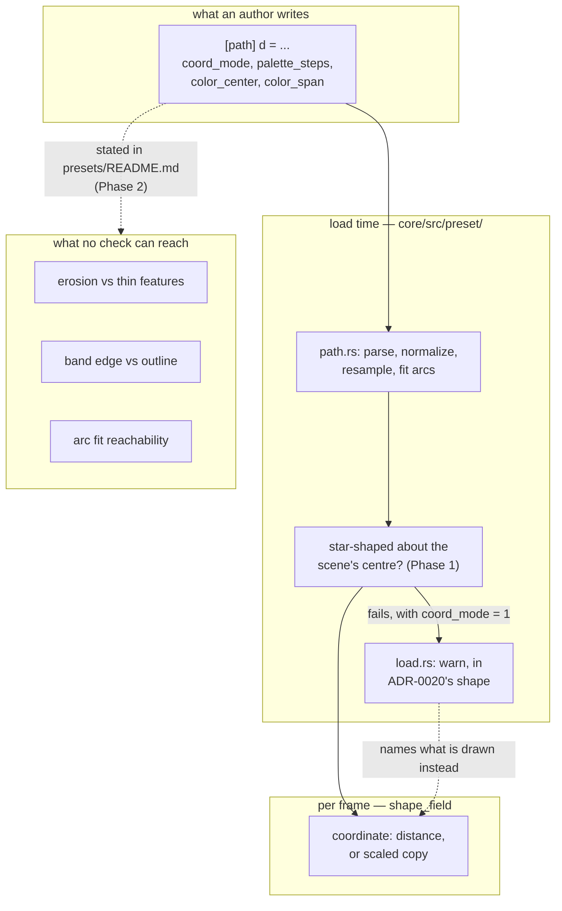

# 0160 — The silhouette's preconditions stop being silent

> **Status:** done — closed 2026-09-17. All four phases landed (`8282d3a0`, `2afbf736`, `692461c5`,
> Phase 3 in `7bfea383`), plus a pre-review `cargo doc` repair (`cf871dd8`) and the close review's
> own prose repairs (`cb56df74`). Mode 4 round 1: **no blockers, no majors, three minors, three
> nits** — every finding prose, all six repaired at the close. Verified: the full `--workspace`
> suite green on this tree (1991 passed, 6 skipped), `cargo doc -D warnings` green across all five
> crates, `fmt`/`clippy` clean, and all seven Node gates green including the backlog probes. Version
> **0.130.1** (patch).
> **Created:** 2026-09-09
> **Owner skill(s):** dev, human
> **Related ADRs:** [0179](../../adrs/0179-a-precondition-is-checked-at-load-or-it-is-written-down.md) (a precondition is checked at load, or it is written down)
> **Depends on:** [Plan 0092](0092-the-engine-draws-an-authored-path.md) (hard — `[path]` is the surface this is about, and 0092's own Phase 7 fixes the axis these figures are authored in)
> **Closes:** design-backlog 0217

> **Amended 2026-09-14, before any phase landed (architect validity sweep).** Five changes, each
> made in place below. (1) The plan gains the `## Implementation log` stub ADR-0120 asks for.
> (2) Phase 2 now lifts the constraints the shipped `shape_maple` and `shape_lion` headers already
> state, instead of writing them fresh. (3) The arc-chain piece counts are settled on the fitter's
> measured output (6, 16, 24), and `MAX_ARC_PIECES`'s doc is brought to the same figure. (4)
> Phase 3's timing question now accounts for the two channels a load warning has reached since
> this plan was written: `ritmolux --check` (Plan 0169) and the player's `preset_warning` event
> (Plan 0159 Phase 5, `bd037d4`). A warning names its binding (`db0df8e`, ADR-0192). (5) A new
> optional Phase 1b folds in backlog 0217: the arity probe re-prices a polyline, so the figures
> Phase 2 cites can be re-measured. Plan 0169 checks none of the four preconditions: `--check`
> runs the existing loader, and the loader still tests the `ring` by name.

## TL;DR

Four preconditions on the `shape_field` silhouette surface are neither checked nor documented, and
all four were found in one session by the first author to draw their own outline. One is
mechanically decidable and becomes a load-time warning against the **geometry** rather than against
the roster name; three cannot be checked and become prose in `presets/README.md`, next to the
parameters they constrain. ADR-0179 is the rule; this plan is the four instances of it.

## Context & problem

Plan 0092's `[path]` table replaced a closed roster of five names with arbitrary authored geometry.
Every one of the five — `disc`, `ring`, `polygon`, `star`, `heart` — is convex or near enough, broad
in every direction, and known to the engine by name. Preconditions that were universally true of
that set, or checkable against it by name, are now easy to violate, and unlike the parser's `A` and
multi-subpath refusals **they fail silently with a plausible wrong picture**.

The four, as the content lane met them:

1. **`coord_mode = 1` degenerates on a figure that is not star-shaped about its centre.** The
   scaled-copy coordinate needs a boundary radius along a ray; a koi's ray crosses its fins more than
   once, the shader takes the outermost, and the figure collapses to a dot inside four huge rays.
   `load.rs` already warns for exactly this geometry — but it tests `shape == RING_SHAPE`, and
   `presets/README.md` carries a block quote teaching that the `ring` is the special case, which
   actively reassures an author that their own contour is fine.
2. **Inward offsets erode, so thin features die.** At three interior bands a koi's fins and tail were
   eaten and it read as a lumpy blob; a lion's mane tufts likewise. Both ship at two. A maple
   survives three only because its lobes are broad. This decided the interior band count on every
   figure built against the surface, and nothing says so.
3. **The band-alignment rule is load-bearing and undocumented.** A band edge sits at every multiple
   of `1 / palette_steps`; the outline sits at `color_center + color_span`. Put the second on the
   first and the silhouette reads crisp; miss it and the figure dissolves — measured over four spans,
   with the leaf simply gone at 5 and 8 interior bands. It silently **forbids binding `color_span` at
   all** and restricts `color_center` to whole-band increments. `gamma` is the one safe interior
   binding, because at the outline `d = 1` and `1^g = 1`, so it provably cannot move the edge.
4. **The arc chain is unreachable for any real silhouette.** `presets/README.md` says *"Nothing in
   the table selects this — a smooth figure gets it"*. The actual gate in `path.rs` discards the fit
   when `pieces > MAX_ARC_PIECES` **or** `pieces * 2 > points.len()`, against an `ARC_FIT_BUDGET`
   fixed at the tightest figure size an author would reach for. A 39-vertex contour authored with
   **every** vertex smooth was discarded and rendered faceted, identically to a spiky maple. The axis
   is total curve detail at a fixed tolerance, not smoothness, and the document says otherwise.

## Decision

ADR-0179: a precondition an author can violate is **checked at load and named, or written down**;
which one applies is decided by whether the engine can see the violation. Item 1 is decidable from
data the engine already holds, so it becomes a check against the geometry, and the `ring` branch
becomes one instance of it. Items 2, 3 and 4 cannot be checked — 3 in particular is a property of a
binding that may sweep through the frame — so they become prose.

Item 4 is a **documentation correction, not a capability change.** Whether `ARC_FIT_BUDGET` or
`MAX_ARC_PIECES` should move is a measurement question with its own cost curve, and this plan does
not open it; it makes the document true about the engine as built.

## Implementation phases

### Phase 1 — The precondition is tested on the contour, not on the name

- **Owner skill:** dev
- **Files:** `core/src/preset/path.rs`, `core/src/preset/schema/load.rs`,
  `core/src/render/scenes/shape_field.rs`, and the tests beside each
- **Done when:**
  - **`PathShape` carries whether the contour is star-shaped about the centre the scene measures
    from**, computed once at parse over at most `MAX_SAMPLES` points, and recorded on the shape the
    way the normalization's centre and factor already are. It is a property of the geometry, so it is
    computed where the geometry is, not at the scene.
  - **The centre it tests about is the one `coord_mode = 1` actually divides by.** Read it out of the
    shader's own coordinate rather than assuming the origin: a test about the wrong point is a test
    that convicts good figures and clears bad ones, and the normalization means the two are close
    enough to look right in every figure that is broad in every direction — which is every figure
    already in the suite.
  - **The tolerance is chosen against real contours and recorded in the code with what it was
    measured on.** A contour that is star-shaped by a hair is the case that decides it. State the
    property the tolerance holds; do not freeze a number the plan has not earned.
  - **`load.rs` warns on the geometry, and the `ring` branch is one instance of it rather than a
    branch beside it.** One condition, one message shape, in ADR-0020's warn-but-load form. The
    message names what was found and what is drawn instead — the distance coordinate — the way the
    existing `ring` message does. It is built as `PresetWarning::about("coord_mode", …)`, as the
    `ring` warning already is (ADR-0192). That form is what anchors it to the binding's line in
    `ritmolux --check` and gives the `preset_warning` event its `param`.
  - **The scene draws the distance coordinate for a contour that fails the test**, so the warning and
    the picture agree. A warning beside a degenerate figure is worse than either alone.
  - **A star-shaped authored contour is unaffected** — `coord_mode = 1` is exactly the capability a
    figure like that wants, and a test that convicts it has failed. Pinned by a test with one
    star-shaped and one non-star-shaped literal, asserting opposite verdicts.
  - The full suite is green and no golden moves: every path literal in the suite today is broad in
    every direction and passes the test.

### Phase 1b — The arity probe prices a polyline (optional; backlog 0217)

- **Owner skill:** dev
- **Files:** `core/tests/path_cost.rs`, `core/src/preset/path.rs` (`MAX_SAMPLES`'s doc comment only)
- **Why it is here:** `the_contour_arity_is_priced_against_the_floor_tier` draws `LEAF` at every
  arity. `PathShape::from_dense` keeps the arc fit unless
  `pieces.len() > MAX_ARC_PIECES || pieces.len() * 2 > points.len()`, and the leaf fits to 16
  pieces. From `samples = 32` up, then, the test times the same 16-piece arc chain three times: it
  read 4.250, 4.232 and 4.230 ms on 2026-09-14. The module header's arity table (7.70 ms at 64,
  "~0.105 ms per segment, flat across the range") and `MAX_SAMPLES`'s own doc are figures this test
  can no longer re-take. Phase 2 rewrites the `presets/README.md` paragraph that quotes both.
- **Done when:**
  - **Every arity case is on the polyline route, by construction or by assertion, never by
    assumption.** Two routes work: a figure the fitter always discards (an all-corners polygon comes
    back from the fitter as the lines it went in as), or the `morph_to = d` route `polyline_probe`
    already uses. Whichever is chosen, the test states it, and the existing "drew a path rather than
    the roster's heart" assertion still holds for every case.
  - **The module header's arity table is re-taken from that run and dated**, naming the machine,
    tier and resolution as the current table does (ADR-0071: a measurement names its machine). The
    arc-comparison table beneath it is not re-taken. Its polyline column already comes from
    `polyline_probe`, so it measured a polyline.
  - **`MAX_SAMPLES`'s doc in `path.rs` is checked against the new slope.** If the per-segment figure
    or the share at 64 moved, the doc says the new figure with its date. If the ceiling's argument
    (the most the field may spend while leaving the composite chain room) no longer holds at 64,
    **stop and log it**: moving the ceiling is outside this plan (see *What this plan does NOT do*).
  - **The re-measure runs alone.** `binary(/_cost$/)` has been scheduled alone since Plan 0174
    Phase 1 (`6c33ddb`, ADR-0193), so this phase does not wait for 0174 to close. It must not change
    the file's `clippy::disallowed_methods` allow, which is the selector 0174 Phase 3's guard holds
    the override to.
  - **If this phase is not taken**, Phase 2 cites the arity slope as the dated Plan 0092 measurement
    of a polyline ("measured 2026-09-09"), not as a current reading, and backlog 0217 stays live
    rather than closing with this plan.

### Phase 2 — The three unhookable constraints are written down

- **Owner skill:** dev
- **Files:** `presets/README.md`, `core/src/preset/path.rs` (`MAX_ARC_PIECES`'s doc comment only)
- **Already written, and lifted rather than re-derived.** The shipped authored-path presets carry
  most of this phase's content as measured comments. Phase 2 moves it to where an author looks
  first, and cites the presets as the worked cases:
  - band alignment, the `color_span` / `color_center` consequences and the `gamma` proof:
    `presets/shape_maple.toml`'s header (the "THE RULE THE WHOLE FILE IS BUILT ON" and "WHAT MAY
    AND MAY NOT BE BOUND" blocks) and `presets/shape_lion.toml`'s alignment paragraph;
  - erosion versus thin features: `presets/shape_lion.toml`'s "THE INTERIOR IS TWO BANDS"
    paragraph;
  - `presets/README.md` already has a one-line summary of the rule in its worked-examples row for
    `shape_maple`, and its `coord_mode` section already calls an inward offset an erosion that
    rounds a **reflex** corner. The erosion paragraph extends that section rather than restating it
    elsewhere.
- **Done when:**
  - **Erosion is stated where the interior bands are documented**, in terms of what an author does
    about it: the band count is set by the figure's **thinnest** feature, not by its overall size,
    and a figure with fins or tufts takes fewer bands than a figure with broad lobes. Cite the
    measured cases — two bands for a koi and a lion, three for a maple — as the observations they
    are, not as a rule with a number.
  - **The band-alignment rule is stated with its arithmetic**: a band edge at every multiple of
    `1 / palette_steps`, the outline at `color_center + color_span`, and what it costs to miss —
    a dissolving silhouette rather than a subtly different one.
  - **Its two consequences are stated as consequences, because they are what an author acts on:**
    binding `color_span` is forbidden on a figure whose edge must stay crisp, and `color_center`
    moves in whole-band increments. **`gamma` is named as the safe interior binding**, with the
    reason — at the outline `d = 1` and `1^g = 1`, so it cannot move the edge — because the reason is
    what tells an author whether a fifth binding they think of is safe.
  - **The arc-chain paragraph is corrected.** *"A smooth figure gets it"* is false. State the real
    gate: the fit is kept only if it collapses the piece count against a tolerance fixed at the
    tightest figure size, so **detail** is the axis and a detailed contour is discarded however
    smooth it is. Name the measured cases that do fit, from `core/tests/path_cost.rs`'s arc
    comparison: a 4-cubic circle at 6 pieces, the 2-cubic leaf at 16 and a 4-cubic blob at 24. The
    reachable band is then visible. Say plainly that a real silhouette is usually outside it, and
    state both halves of the gate. The cap is `MAX_ARC_PIECES` (32). The half-arity test means that
    at `samples = 32` nothing over 16 pieces survives.
  - **One figure for the measured maximum.** `MAX_ARC_PIECES`'s doc says the measured counts "sit at
    25 and under", but the fitter's output on the three measured figures tops out at 24. The doc is
    corrected to name 24 and the figure it came from, so the README and the code quote the same
    number.
  - **The arity paragraph's timing figures** (0.105 ms per segment, 46 % at 64) are Phase 1b's
    re-taken readings with their date. If Phase 1b was not taken, they are cited as the dated Plan
    0092 measurement.
  - **No count and no threshold is stated that the plan has not measured.** Where the honest answer
    is "usually not", write that.
  - `node scripts/toc.mjs` is clean, and `node scripts/check-doc-links.mjs` passes.

### Phase 3 — The document is checked against the engine, once

- **Owner skill:** human
- **Done when:**
  - **An author reads Phase 2's three sections and builds one figure against them** — not a review of
    the prose, a use of it. The question is whether the constraints as written are enough to choose a
    band count and a palette configuration without rendering to find out.
  - **A verdict on whether Phase 1's warning arrives at the right moment, and in the right place.**
    It fires at load. Since this plan was written a load warning reaches the author on three
    channels, not one:
    - stderr, as before;
    - `ritmolux --check`, which places it on the `coord_mode` binding's line (Plan 0169, through
      the `param` ADR-0192 added);
    - the studio, through the `preset_warning` event, which anchors it to the same binding (spec
      0003, Plan 0172 Phase 4).

    The question is which of those an author building a figure actually sees, and whether that is
    enough. "Visible where the figure is" in the preview itself would still be a different plan.
  - Gates nothing. May carry forward to `docs/design-backlog.md` as new entries.

## Architecture diagram



## Risks & open questions

- **The centre the test uses may not be the centre the shader divides by**, and the two agree on
  every figure in the suite today. That is the ADR-0037 shape one level over: two sources that
  coincide on the configuration we test at. Phase 1's second done-when exists for it, and a
  non-star-shaped literal in the suite is what makes the disagreement observable at all.
- **Star-shapedness is a binary verdict on a continuous property.** A figure just inside the
  tolerance renders correctly and warns; a figure just outside renders the distance and warns. The
  warning is honest in both cases, but an author near the boundary will see it flicker between
  authoring sessions on unrelated edits to `d`. If that turns out to be common the answer is a
  quieter test, not a tighter one.
- **Phase 2 is prose against a surface with no gate.** The arc-chain sentence being wrong is the
  proof; nothing stops the replacement going stale the same way. ADR-0179 records this as a cost
  rather than solving it.
- **The band-alignment rule may be a symptom.** An outline that has to be manually aligned to a band
  edge is an engine deciding a palette boundary and a geometry boundary independently. Stating the
  rule is the right move now; whether the scene should place the outline on an edge by construction
  is a question this plan deliberately leaves open, and a real answer to it would retire Phase 2's
  second and third bullets.

## What this plan does NOT do

- **It does not move `ARC_FIT_BUDGET` or `MAX_ARC_PIECES`.** Making the arc chain reachable for a
  real silhouette is a measurement question with a per-pixel cost curve behind it, and Plan 0092
  Phase 2 already found that this surface's construction-based estimates were an order of magnitude
  out. It needs its own plan and its own measurement.
- **It does not fix the Y axis.** That is Plan 0092 Phase 7, and this plan's figures are authored in
  whatever frame that phase settles.
- **It does not touch `--report`.** A `beat_index`-driven preset measuring as inert is
  design-backlog 0192, and its fix perturbs an instrument the close ceremony curates on.
- **It does not add a gate for documented constraints.** Nothing here tests that Phase 2's prose
  stays true.
- **It does not refuse anything.** Every combination that loads today still loads.
- **It does not move `MAX_SAMPLES`.** Phase 1b re-measures the slope that set the ceiling. If the
  slope no longer supports 64, that is logged for a later plan, not acted on here.

## Implementation log

> Written by `dev` — one row per phase as that phase's commit lands, and the close block after the
> last one. **The phases above are the contract; everything here is what happened.**
> **Observations, never conclusions:** this says where to look, architect decides how it went.
> No per-criterion pass list, no self-assessment, no narrative — but a deviation from the plan or
> an unmet done-when is always disclosed. Stays shorter than `## Implementation phases` above.

**Lane:** `C:\Users\Igor Konovalov\WORK\rlx-plan-0160`, branch
`plan-0160-the-silhouettes-preconditions-stop-being-silent`

| phase | owner | state | commit |
|---|---|---|---|
| 1 — The precondition is tested on the contour, not on the name | dev | done | `8282d3a0` |
| 1b — The arity probe prices a polyline (optional) | dev | done | `2afbf736` |
| 2 — The three unhookable constraints are written down | dev | done | `692461c5` |
| 3 — The document is checked against the engine, once | human | done | committed with this row |

### Phase 3 — the document checked against the engine

Taken 2026-09-17 in the `preset-author` lane. **The test was a use, not a read**: one figure built
from the three written sections alone, with every choice and its predicted outcome recorded in the
draft's header *before* the first render. The draft is `target/gate0160/shape_crescent.toml` — not
shipped content, and nothing here lands in `presets/`.

The figure is a crescent, chosen because the prose names a crescent outright as a `coord_mode = "1"`
failure and because its horns taper to **zero width**, which is thinner than any case the prose
measures.

**Verdict on the palette configuration: the prose is sufficient, and decisively.** `palette_steps =
"16"`, `color_span = "0.125"` (2/16) and `color_center` resting at 14/16 and stepping by
`beat_index / 16` were all chosen by arithmetic, with no rendering. `14/16 + 2/16 = 1` is a band
edge at every step of the travel, and the first render came back with the silhouette crisp against
the ring family, exactly as predicted. `color_span` was left unbound and `gamma` bound, both
straight off the two stated consequences. **Nothing here needed a render to decide.**

**Verdict on the band count: the prose is not sufficient for a figure outside the measured set.**
The rule — the thinnest feature sets the count — is right and it is the useful framing, but its
three cases (koi fins and lion tufts at two, maple lobes at three) are **examples, not a measure**.
A crescent's horns are thinner than all three, and nothing in the section converts "thinner than a
koi's fin" into a number. Two was chosen by analogy, which is guessing at the same comparison the
prose invites rather than applying anything it states; the render then showed the horn tips rounded
off and the body intact — the predicted outcome, reached the wrong way. **What would close it is one
sentence: the inward offset per interior band is a knowable figure, and an author who could compare
it against their own thinnest feature's half-width would be choosing rather than guessing.**

**Verdict on the warning's moment and place: both right.** `ritmolux --check --strict` reports it
before any render, at the `coord_mode` binding's own `file:line:col`, with the mechanism and the
fallback in the message:

```text
target/gate0160/crescent_thin.toml:48:1: warning[engine]: parameter 'coord_mode' is ignored on an
authored contour that is not star-shaped about its centre: a ray from there crosses the outline more
than once ... The figure is drawn with the distance instead
```

Of the three channels the amendment lists, **`--check` is the one an author building a figure
actually meets**, and this session is the evidence: the draft was checked before every render
because that is what the workflow says to do. A render's stderr scrolls past a build log, and the
studio's `preset_warning` reaches only an author already in the studio. The warning needs no fourth
channel.

**A third finding, which the exercise produced rather than the gate asking for it: the prose's list
of failing figures is over-general, and the engine is the one that is right.** The section names
shape families — *"a crescent, a figure with fins, or a silhouette whose sinuses put one lobe across
the ray"* — but membership is geometric and depends on thickness. The **thick** crescent drawn here
renders correctly under `coord_mode = "1"`, with interior contours as true scaled copies, and warns
about nothing; only the **thin** variant, whose horns wrap past its own centre, trips the check.
Phase 1's decision to test the contour rather than the name is exactly what makes that work — an
author who reads "a crescent" as a rule would avoid a figure the engine draws correctly.

**Carried forward** to `## Followups` below — **not** to `docs/design-backlog.md`, which this plan
did not touch: the band-count measure, and the over-general list. Both are prose repairs in
`presets/README.md` and neither gates anything. Filing them as live backlog entries is owed and open.

### Notes

- **Phase 2 also rewrote the `ring` blockquote in `presets/README.md`**, beyond the four bullets the
  phase lists. It quoted the load warning verbatim and taught that the `ring` is *the* special case,
  and Phase 1 changed both the message and the condition — leaving it would have been a page saying
  the opposite of the engine. It now states the one condition, names the authored contour as the
  other instance, and says plainly that concavity alone is not it. The `[path]` section carries a
  one-sentence pointer at it.
- **Phase 1, the shipped maple fails the new test.** `worst ray gap 0.4017`, against a tolerance of
  0.02 — its sinuses put a neighbouring lobe across the ray into the next one. It ships at
  `coord_mode = "0"`, so no warning fires on it and no pixel of it moves; the reading is printed by
  `the_tolerance_separates_the_measured_contours` alongside the lion's 0.0000. Phase 2's erosion
  paragraph cites the maple as a worked case, which is unaffected — this is about a mode that
  preset does not use.
- **Phase 1b was taken**, so Phase 2 cites the re-taken readings. The arity table is now every row
  on the polyline (`morph_to` identical to `d`, the route `polyline_probe` already used), measured
  2026-09-17 on the AMD integrated adapter at 1920x1080, floor tier: **~0.095 ms per segment**,
  42.6 % of the floor budget at 64 and 24.4 % at 32. `MAX_SAMPLES`'s doc carries the new figure with
  its date; the ceiling's argument holds at 64, so nothing is logged for a later plan under *What
  this plan does NOT do*'s last bullet.
- **Phase 1 extends the verdict to a morph target**, which the plan's done-when speaks of in the
  singular ("a contour that fails the test"). Both endpoints of a `morph_to` pair are drawn, so
  either one failing takes the scaled copy away, on the scene and in the warning alike. An
  intermediate contour of a morph is still not tested and cannot be from the load boundary.

### Close triggers

- **`presets/` touched:** `presets/README.md` only. No `.toml` was added, edited, moved or removed,
  so the embedded set is unchanged.
- **Plan header `Closes:`** design-backlog 0217, which is already in
  `docs/design-backlog-archive.md` marked **Promoted** to this plan's Phase 1b. Phase 1b was taken
  (`2afbf736`), so the thing the entry asked for is done; there is no live entry to retire and
  `docs/design-backlog.md` was not touched.
- **What shipped:** a **fix plus docs**. Behaviour moved in two places — `coord_mode = "1"` now
  falls back to the distance on an authored contour that is not star-shaped about its centre, and
  the load warning fires on that condition instead of on the roster name, with a reworded message.
  No preset in the shipped set renders differently: both `[path]` presets bind `coord_mode = "0"`.
- **Operator docs touched:** none under `docs/`. `presets/README.md` is the only reader-facing page
  that moved — three new prose blocks under `shape_field`/`[path]`, the rewritten `ring` blockquote,
  and the arity figures.
- **Backlog probes (`node scripts/check-backlog-claims.mjs`):** exit 0 — *82 stated reductions still
  hold across all 35 live entries (3 unprobeable)*, plus the usual advisory list of moved paths,
  which is never part of the exit code.
- **Full suite:** owed to the conductor's pre-review gate (ADR-0207). What this session ran instead:
  `cargo nextest run -p rlx-core` whole (1493 passed, 6 skipped) after Phase 1, which covers the
  nine deferred GPU suites for the package the change lives in and is where "no golden moves" was
  checked; `cargo nextest run -p rlx-core --test path_cost` alone for Phase 1b's re-measure; and
  `cargo nextest run --workspace -P fast` after Phase 2 (1693 passed, 304 skipped). `cargo fmt --all
  --check` and `cargo clippy --workspace --all-targets -- -D warnings` are clean, as are
  `check-comment-hygiene`, `check-doc-links`, `check-reader-prose` and `toc --check`.
- **Outstanding `human` phases:** none. Phase 3 was taken 2026-09-17 in the `preset-author` lane and
  its three verdicts are above: the palette rule is sufficient to author against without rendering,
  the band-count rule is not, and the warning arrives at the right moment and place. Two prose
  findings carry forward to `## Followups` below; it gated nothing, as written.

## Close review

> Mode 4, round 1, conductor mode (ADR-0205) — a separate headless session handed this plan, this
> lane and nothing an implementer wrote. Full text as written to
> `tools/conductor/state/reviews/0160-round-1.md`. Six commits `8282d3a0..cf871dd8` over `main` at
> `69b2fad8`. No earlier round; nothing below was raised and fixed in a prior round.

**Verdict: Plan 0160 landed cleanly — no blockers, no majors, three minors and three nits.** The one
checkable precondition is checked on the geometry with a fixture that can tell the two candidate
centres apart, the scene and the load boundary decide the fallback on the same predicate, and the
three unhookable constraints are in `presets/README.md` next to the parameters they constrain. Every
finding is prose: an ADR cost claim the implementation falsified, a log sentence the tree
contradicts, an undated measurement table, and three smaller wording matters.

### Evidence

- **Full suite.** The lock wrapper returned the ledger record rather than a run (ADR-0207):
  `with-lock: skipped cargo nextest run --workspace: tree 0092221 is green in the suite ledger, run
  by gate 0160-pre-review at 2026-09-17T19:40:14.216Z: 1991 tests run: 1991 passed (7 slow), 6
  skipped`. That is this tree at full `--workspace` scope, including the nine deferred GPU suites
  and the full preset sweeps. `dev`'s close block owes its `Full suite:` to that gate; in conductor
  mode that is correct, and this record is it.
- `cargo doc --workspace --no-deps` under `-D warnings`: clean. It was **not** clean before
  `cf871dd8` — the pre-review gate caught `MAX_ARC_PIECES` and `star_shaped` linking private items,
  which is backlog 0246's trigger (a visibility change, not a doc edit) firing exactly as predicted.
- `cargo fmt --all --check` and `cargo clippy --workspace --all-targets -- -D warnings`: clean.
- `check-doc-links`, `check-index-rows`, `check-reader-prose`, `toc --check`,
  `check-comment-hygiene`, `check-filter-figures`: all OK.
- `check-backlog-claims.mjs`: exit 0 — 82 stated reductions hold across all 35 live entries (3
  unprobeable). The advisory lists 34 moved paths; the three this plan could have touched — 0021 and
  0092 on `core/src`, 0042 on `presets/README.md` — were read and none is falsified.
- `check-translations.mjs`: exit 0, and no translated source has moved since its translation was
  stamped. Nothing is owed on the Russian slice this close.

### Lens 1 — alignment with the plan and ADR-0179

Every phase carries a single in-vocabulary `**Owner skill:**` tag. The `## Implementation log` is
present and shorter than `## Implementation phases` (129 lines against 136), as ADR-0120 asks.

**Phase 1.** `PathShape` gains a `star_shaped` field computed at parse, on the **resample** rather
than the dense flatten — the right choice, argued in place: `points` is the contour the shader
walks, so the verdict is about the figure `coord_mode = 1` is actually computed on, and the work is
bounded at `MAX_SAMPLES` for free. `worst_ray_gap` is the shader's own crossing arithmetic, checked
line for line against `path_boundary_radius`: the same `s*u = a + e*t` solve, the same `denom`
epsilon, the same `[0,1]` segment test, the same positive-`s` filter. The shader keeps the max; the
CPU keeps the max and the min. The edge traversal runs the other way round, which inverts `t` and is
symmetric under the `[0,1]` test.

The plan's second done-when — *"the centre it tests about is the one `coord_mode = 1` actually
divides by"* — is the ADR-0037 shape one level up, and it is **properly probed**.
`the_verdict_is_about_the_bounding_box_centre_and_not_the_centroid` is built on an `L` block whose
bounding-box centre sits in the notch and whose area centroid sits inside the tall arm; it asserts
the fixture really is star-shaped about its centroid *first*, so the test cannot pass vacuously, and
then that the verdict follows the origin. That is the "find the configuration where the two sources
disagree" discipline the rule asks for, and it is the single best thing in this diff.

The sampler's completeness argument — two rays per vertex, because a double-crossing interval is
bounded by rays grazing a vertex — checks out. At the interval's boundary the near and far crossings
coincide at a vertex `v`, so the two edges crossed inside the interval are precisely the two edges
incident to `v`; the midpoint of the one leaving `v` toward the interval therefore has a direction
strictly inside it, and the code samples the midpoints of **all** edges. The reasoning in the
comment is sound, not merely plausible.

`load.rs` collapses the `ring` branch into one condition with one message shape, built as
`PresetWarning::about("coord_mode", …)` so it still anchors to the binding's line for
`ritmolux --check` and carries the studio's `param` (ADR-0192). The scene decides on the same
predicate, and the `None` arm — no `[path]` table, roster arm is the figure — keeps the `ring` test
where it belongs. The warning and the picture cannot disagree, which is the done-when that mattered.

`a_contour_that_is_not_star_shaped_renders_the_distance_under_either_mode` is a real test, not a
green one. It deliberately does **not** use the two-band look the other path tests use, on the
stated ground that its only seam sits on the outline where both coordinates are 1 by contract and
the two modes would match on *any* figure; it uses the banded look instead and carries a star-shaped
leaf control in the same run, asserting the control *does* move.

The morph extension is right and disclosed: `configure` ANDs both endpoints' verdicts, `load.rs`
does the same, and both name the limitation. `aligned_to` carries the verdict over, correctly —
reversal and cyclic rotation preserve the edge set, and `worst_ray_gap` is a function of the edge
set. `resampled` re-takes it rather than carrying it, also correctly and for the opposite reason.

**Phase 1b** was taken. The polyline route is forced **by construction** — `morph_to` identical to
`d` at `morph = 0`, verified against `pack_path`, where `morphing` puts the figure back on points
unconditionally. The plan's *"never by assumption"* is met, and the existing "drew a path rather
than the roster's heart" assertion still runs for every case. The arity table is re-taken, dated and
names the machine; a new inequality assertion keeps the axis honest. `MAX_SAMPLES`'s doc follows the
new slope and the ceiling's argument still holds at 64, so nothing is owed under *What this plan
does NOT do*.

**Phase 2.** All four done-whens are met, and the arc-chain correction is the strongest part: it
states **both** halves of the gate, names the reachable band from measured figures, and says plainly
that a real silhouette is usually outside it. The half-arity arithmetic checks against `from_dense`
— `pieces * 2 > points.len()` on the resample, so 32 at `samples = 64` and 16 at `samples = 32`, as
written. `MAX_ARC_PIECES`'s doc names 24 and explains why
`the_arc_fit_reports_what_a_curve_costs_in_pieces` reads 25 for the same blob (it refits the
64-point resample; `from_dense` fits the dense flatten), confirmed from `refit`'s definition. The
`ring` blockquote rewrite is beyond the four bullets and was disclosed; it was the right call,
because Phase 1 changed both the condition and the message.

**Phase 3** was taken in the `preset-author` lane and its three verdicts are recorded. The exercise
was a use rather than a read — every choice and its predicted outcome written before the first
render. Its own third finding, that the list of failing figures is over-general because membership
is geometric, is a better observation than the phase was looking for and vindicates Phase 1's
decision to test the contour rather than the name. One thing it claims did not happen; see M2.

### Lens 2 — layering, coupling, real-time safety

Nothing to report. No platform or audio-source type enters `core/`; no raw GPU call escapes the wgpu
layer. `worst_ray_gap` is `O(N²)` but runs **once at parse**, not per frame — at `MAX_SAMPLES = 64`
that is ~8k float operations at load, and the render path reads a `bool` field. No `unwrap`/`expect`
was added anywhere; the walk uses `.get()` throughout. No new hot-path module, so Plan 0002's scan
set needs no extension. The C ABI and the control protocol are untouched.

### Lens 3 — docs, bookkeeping, release

`presets/README.md` is the only reader-facing page that moved, and it is the right one — the
`preset-author` lane keeps no catalogue and reads that file, which is ADR-0179's own Positive
argument. No `ParamSpec`, structural table or `SystemKind` changed, so the generated parameter
block, the JSON schemas and `.taplo.toml` are correctly untouched. No hotkey, flag, env var or
config key moved, so `README.md`, `docs/running.md`, `docs/configuration.md` and the five
translations are correctly untouched. Two documents the sweep should have reached and did not:
`docs/preset-palettes.md` (N6) and this plan's own log (M2).

**Version: patch.** Behaviour moved in two places, but no author-facing capability was added and no
shipped preset renders differently.

### Lens 4 — correctness and determinism

The tolerance is handled the way ADR-0071 asks. `STAR_SHAPED_TOLERANCE = 0.02` is not asserted as a
threshold: `the_tolerance_separates_the_measured_contours` prints the whole table — every fixture
plus every shipped `[path]` contour at the arity it ships at — and asserts the **emptiness** of the
band around it, that every contour measured lands a factor of four clear either way. That is a
property, not a frozen number, and the test states why it is the right one: a figure decided
narrowly flips verdict on an unrelated edit to its `d`, which is the plan's own second risk. The doc
comment reports what the measurement found and says plainly that this is therefore not a threshold
on real figures at all.

No `aspect` derived from a grid size appears in the diff. No wall-clock read enters analysis;
`path_cost.rs`'s `clippy::disallowed_methods` allow is unchanged, so Plan 0174 Phase 3's guard
selector still holds. One arithmetic looseness in `presets/README.md` — *"about 0.095 ms per segment
… so 64 segments is 43 %"*, where 43 % is the whole frame cost including the baseline and the slope
alone gives 36 % — is inherited rather than introduced (the same `so` was equally loose at
0.105/46 %) and is not raised as a finding.

### Lens 5 — design integrity

The shape of the change is right. The precondition is computed **where the geometry is** and read
where it is needed; the scene takes a verdict rather than a contour to re-measure; the load boundary
and the scene consult one predicate instead of two that can drift apart. `applied_coord_mode`'s
`Option<bool>` is the correct encoding — `None` is genuinely "no contour, ask the roster", not a
third truth value — and the three-arm `match` in `load.rs` mirrors it exactly. No seam widened.

### Findings

All six were repaired at the close; none was carried from an earlier round, because there was none.

**minor**

- **M1 — `docs/adrs/0179-…md:54`: the ADR's cost claim is falsified by what landed.** The Decision
  says the test is *"an O(N) walk over at most `MAX_SAMPLES` points"*, and that claim carries weight
  — the Negative section leans on it to justify *"a load-time cost on a path that has none today"*.
  `worst_ray_gap` is **O(N²)**: two rays per vertex, each intersected against every edge, so
  2·64² ≈ 8k operations at the ceiling arity. The conclusion survives; the number does not. Repaired
  on the ADR-0054/0074 precedent — accepted **with a dated `Outcome` section** rather than by
  editing the body.
- **M2 — this plan, `### Phase 3`: the log said two findings were carried forward to the backlog,
  and they were not.** No entry was written — the diff over the whole range does not touch
  `docs/design-backlog.md`, and the close trigger eleven lines further down said so outright. The
  half that was false was the half a later reader would act on. Phase 3 gates nothing and *may*
  carry forward, so this was not an unmet done-when but a false statement in the record. Repaired by
  correcting the sentence and listing both findings under `## Followups`; **filing them as live
  backlog entries with ADR-0108 probes stays open and is the owner's**, since a new live entry adds
  a probe the gate runs and is outside what a close may repair.
- **M3 — `core/tests/path_cost.rs`: the arc-comparison table was a different day's reading and
  nothing said so.** Phase 1b re-took the arity table above it and dated it 2026-09-17. The arc
  table was deliberately not re-taken — correctly — but it was still introduced by *"Same machine
  and same configuration:"*, which read as *same run* when both came from 2026-09-09. It carried no
  date, and the sentence under it derived from the retired figures (1.03 ms baseline, ~0.105 ms
  segment) while the table above now reads 1.07 and 0.095. That is the module's own new observation
  turned on itself. Repaired by dating the arc section and marking its figures as that day's.

**nit**

- **N4 — `presets/README.md`: the quoted load warning was not quite verbatim.** The fenced `text`
  block writes a plain hyphen where `load.rs` emits an em dash, so a reader grepping their console
  output for the sentence gets no hit. Repaired.
- **N5 — `presets/README.md`: an unearned causal claim about the maple.** *"…which is part of why
  it draws under `\"0\"`"* attributes the choice to a test that did not exist when the maple was
  authored, and the preset's own header gives no such reason. Repaired by keeping the measurement —
  a worst ray gap of 0.40 against a 0.02 tolerance — and dropping the motive.
- **N6 — `docs/preset-palettes.md`: the two-coordinates section gained no pointer at the
  precondition.** It is the page an author reads when choosing a mode, and after this plan an
  authored contour may be refused `"1"` with a load warning. Repaired with one sentence and a
  pointer, not a copy.

### Close bookkeeping

- **Preset curation (step 3b).** `presets/` touched: `README.md` only — no `.toml` added, edited,
  moved or removed, so the embedded set is unchanged and there is nothing to judge against it. The
  stale-workaround sweep is clean **for a structural reason worth writing down**: this plan did not
  fix the degeneracy, it announced it, so no preset written around it is now paying for nothing. All
  four presets resting on `coord_mode = "1"` (`shape_pulse`, `shape_strataheart`, `shape_aperture`,
  `shape_heartmono`) draw roster arms, where the contour verdict is `None` and the roster test is
  unchanged; the two `[path]` presets bind `"0"` and neither header cites a defect it is dodging. No
  preset moves a pixel, which the green goldens confirm.
- **Backlog (step 3c).** Backlog 0217 is discharged: Phase 1b was taken (`2afbf736`), the arity
  probe is on the polyline at every arity by construction, and the header figures it said could no
  longer be re-taken have been re-taken. Its body was already archived **Promoted**; the close
  appends the `CLOSED` marker and moves its ledger row.
- **ADR-0179** flips `proposed → accepted`, with the dated `Outcome` M1 asks for.

## Followups (after this lands)

Both are Phase 3's, both are prose repairs to `presets/README.md`, and neither gates anything.
**Neither is in `docs/design-backlog.md` yet** — filing them as live entries with the probes
[ADR-0108](../../adrs/0108-a-backlog-claim-about-the-repo-carries-an-executable-probe.md) requires is
owed and open.

- **The band count needs a measure, not three examples.** *"The thinnest feature sets the count"* is
  the right framing and it does not convert. Its three cases — koi fins and lion tufts at two, maple
  lobes at three — are examples, and an author drawing a figure thinner than all three (Phase 3 drew
  a crescent whose horns taper to zero width) can only pick by analogy. The inward offset per
  interior band is a knowable figure; one sentence stating it would let an author compare it against
  their own thinnest feature's half-width and choose rather than guess.
- **The list of failing figures is over-general, and the engine is the one that is right.** The
  `coord_mode` blockquote names shape families — a crescent, a figure with fins, a silhouette with
  deep sinuses — but membership is geometric and depends on thickness. A **thick** crescent renders
  correctly under `"1"`, with interior contours as true scaled copies, and warns about nothing; only
  a thin one, whose horns wrap past its own centre, trips the check. An author reading "a crescent"
  as a rule would avoid a figure the engine draws correctly.
