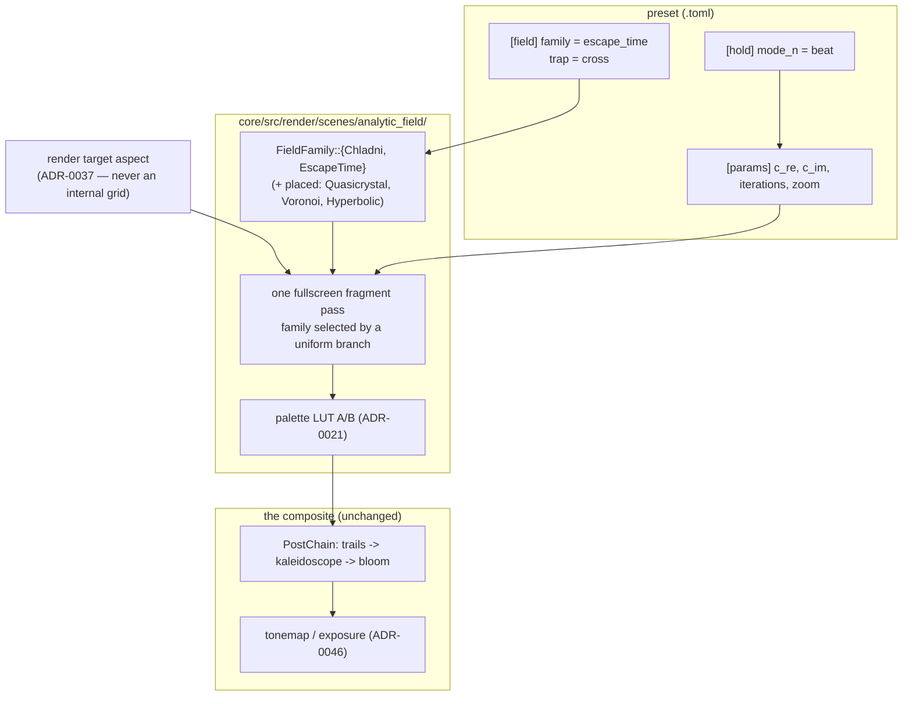

# 0163 — The analytic field

> **Status:** done — closed 2026-09-11. Five `dev` phases landed (`65d57d4`, `232afb3`,
> `9ae4650`, `cf11972`, `27f2a63`); the 2026-09-11 HELD review's one blocker — an empty
> `### Close triggers` block — was discharged in `f10bd6b`. Re-reviewed on the finished tree:
> **no blockers, no majors**, four minors and three nits carried to backlog 0206, 0207 and 0208.
> **Created:** 2026-09-09
> **Owner skill(s):** dev
> **Related ADRs:** [0180](../../adrs/0180-a-mathematical-world-joins-a-system-as-a-family-and-a-structural-parameter-is-held.md)
> (rules 1, 3 and 4),
> [0021](../../adrs/0021-shared-palette-system.md) (the palette LUT the field colours through),
> [0045](../../adrs/0045-quality-tiers-floor-and-rich.md) (where the iteration cap lives),
> [0046](../../adrs/0046-linear-light-hdr-composite-bloom-tonemap.md) (the HDR pipeline an escape-time
> glow finally uses),
> [0037](../../adrs/0037-internal-grid-is-a-resolution-not-a-shape.md) (aspect comes from the target),
> [0085](../../adrs/0085-how-much-a-scene-occludes-the-backdrop-is-one-number.md) (`occlude`)
> **Depends on:** [0161](0161-the-structural-parameter-is-held.md) — Chladni's mode numbers are
> integers on a musical edge and are worth little without `[hold]`.

## TL;DR

A thirteenth system, `analytic_field`: one fullscreen fragment pass whose output is a closed-form or
bounded-iteration function of position, coloured through the shared palette LUT. It ships with two
families — **`chladni`**, the cymatics plate whose two integer mode numbers come from the music, and
**`escape_time`**, Julia and Mandelbrot with a smooth iteration count and orbit traps. The system is
built to hold the rest of the stateless mathematics later (quasicrystal, Voronoi, hyperbolic tiling)
without another `SystemKind`.

## Context & problem

The engine has no escape-time fractal. [`roadmap-visual-richness.md`](../../roadmap-visual-richness.md)'s
reference table names the gap — *"Fractal glowing spiral | needs escape-time/IFS or feedback spiral,
HDR glow | have today: neither"* — and the pipeline that row was waiting on has existed since
ADR-0046. Nothing was ever built to use it.

It has no cymatics either, and that absence is the odder one:
[`generative-techniques-catalogue.md`](../../generative-techniques-catalogue.md) rates Chladni
*"cheapest of all — no state, pure per-pixel eval"* and *"thematically perfect for a music viz"*, and
ranks it second on its pick order. A Chladni plate's figure is decided by two integers; a music
visualizer has a dominant frequency to hand them.

The obvious home would be `fragment_field`, and it is the wrong one.
[ADR-0180](../../adrs/0180-a-mathematical-world-joins-a-system-as-a-family-and-a-structural-parameter-is-held.md)
Alternative B records why: that scene's parameter surface **is** the sine fold's own — `warp`,
`fold_speed`, and an integrated fold phase in its uniform (ADR-0132) — and its shader is a fixed
five-iteration fold with no family switch anywhere in it. Making it polymorphic risks the table and
the generated reference of a shipped system with thirteen presets, for a capability none of them
use.

## Decision

We add one system, `analytic_field`, and place every stateless per-pixel world inside it as a named
family, per ADR-0180 rule 1. Two families ship here; the rest are placed and unbuilt.

Its shape: one fullscreen fragment pass, no state between frames, no offscreen of its own, alpha
emitted across every pixel so `occlude` works as it does for `fragment_field`, and the field level
indexed into the palette LUT exactly as ADR-0021 specifies. It takes its aspect from the render
target handed to `Scene::render`, never from any internal grid — ADR-0037's rule, restated here
because a fullscreen field that computes a radius is precisely the shape that gets it wrong.

**The iteration budget is a preset parameter with a tier-set cap.** A tier that simply *chose* the
iteration count would make one preset two different pictures — an escape-time boundary at 48
iterations and at 512 is not the same image, unlike a particle count at two densities. So a preset
asks for `iterations`, `TierConfig` bounds what it may ask for, and a preset authored inside the
`Floor` bound renders identically on both tiers.

We rejected one `SystemKind` per formula (ADR-0180 Alternative A) and polymorphising
`fragment_field` (Alternative B).

## Architecture diagram



## Implementation phases

### Phase 1 — the system, and the Chladni plate through it
- **Owner skill:** dev
- **What:** `SystemKind::AnalyticField`, its `TABLE` row, the `[field]` config table with a `family`
  key, the fullscreen pass, the palette wiring, and the **`chladni`** family as the first arm.
  Chladni is the right walking skeleton: it is a closed form with no iteration, so the whole system
  seam is proved without any of Phase 2's numerics, and it is a shippable world on its own.
- **The figure** is the zero set of `cos(n·pi·x/L)·cos(m·pi·y/L) − cos(m·pi·x/L)·cos(n·pi·y/L)`.
  Parameters: **`mode_n`** and **`mode_m`** (Structural — the two integers), **`line_width`** (how
  wide a band around the zero set lights), and **`plate_mix`** (blends from the pure nodal lines
  toward the raw signed field, which reads as a standing wave rather than as sand).
- **Files touched:** `core/src/preset/schema/system.rs`, `core/src/render/scenes/analytic_field/`
  (new), `core/src/render/scenes/mod.rs`, `core/src/preset/schema/` (the `[field]` table),
  `core/src/render/mod.rs` (scene construction).
- **Done when:** a preset with `system = "analytic_field"` and `[field] family = "chladni"` renders
  the nodal figure for `mode_n = 3`, `mode_m = 5`; the figure is **square on a non-square target**
  (the aspect comes from the target, per ADR-0037 — check at 1280x800, not only at 16:9); `occlude`
  behaves as it does on `fragment_field`; and an unknown family name is a load error.

### Phase 2 — the escape-time family
- **Owner skill:** dev
- **What:** The **`escape_time`** family: `z -> z^power + c` iterated to an escape radius, with
  `[field] map = "julia" | "mandelbrot"` choosing whether `c` is a parameter or the pixel.
  Parameters: **`c_re`**/**`c_im`** (Modal — the continuous pair that is *the* audio lever for a
  Julia set), **`iterations`** (Structural, capped by tier), **`escape_radius`**, **`power`** (Modal,
  because fractional powers are a look), and **`interior`** (how the non-escaping set is coloured).
- **The palette coordinate is the smooth iteration count**, `nu = n + 1 − log2(log|z|)/log(power)`,
  not the integer `n`. The integer count bands the palette into visible contour steps; the smooth
  count is what makes the boundary read as a continuous glow. This is not an optimization — it is
  the difference between the textbook picture and the one worth shipping.
- **Files touched:** `core/src/render/scenes/analytic_field/`.
- **Done when:** a Julia preset renders a connected filled set for `c` inside the Mandelbrot set and
  a dust for `c` outside it; the palette across the escape boundary is free of integer banding at
  `palette_steps = 0`; a bass-driven `c_re` visibly morphs the set's topology; and no pixel emits a
  non-finite value at any parameter inside the declared ranges.

### Phase 3 — orbit traps
- **Owner skill:** dev
- **What:** `[field] trap = "none" | "point" | "line" | "cross" | "circle"`, colouring a pixel by the
  **minimum distance its orbit came to the trap shape** rather than by escape time alone, with
  **`trap_radius`** and **`trap_rotate`** as parameters. This is the difference between a fractal
  that looks like a mathematics textbook and one that looks like the reference imagery — the trap is
  what produces the filaments, rings and stained-glass structure the roadmap's "fractal glowing
  spiral" row is actually describing.
- **Files touched:** `core/src/render/scenes/analytic_field/`.
- **Done when:** each of the four trap shapes produces a visibly distinct structure from the same
  `c`; `trap_radius` sweeps continuously without a discontinuity in the image; and `trap = "none"`
  is byte-identical to Phase 2's output.

### Phase 4 — the tier cap and the golden regime
- **Owner skill:** dev
- **What:** `iterations` gains a `TierConfig` cap (ADR-0045) — `Floor` bounds it low enough to hold
  the frame budget on the iGPU baseline, `Rich` allows the deep look. A preset that asks for more
  than its tier allows is **clamped and says so** through the same channel a tier demotion announces
  itself, rather than silently rendering a different picture.
- **The golden preset is authored inside the stable regime** per ADR-0180 rule 3: bounded
  iterations, shallow zoom, and `c` away from the set boundary where one float of divergence flips a
  pixel from interior to exterior. Anything that cannot hold at the `0.02` mean-channel-difference
  floor `golden.rs` already declares is asserted as a structural statistic instead
  ([ADR-0071](../../adrs/0071-a-numeric-test-contract-states-a-property-or-names-its-machine.md)).
- **Files touched:** `core/src/render/tier.rs`, `core/tests/` (the golden + its preset).
- **Done when:** the same preset renders identically on `Floor` and `Rich` when it asks within the
  `Floor` bound; a preset over the bound is clamped with a notice, not silently; and the golden holds
  across a re-run on the software adapter.

### Phase 5 — documentation and the reference
- **Owner skill:** dev
- **What:** `docs/presets.md` gains the `[field]` table and an `analytic_field` row in the system
  table; `presets/README.md` is regenerated with the Structural/Modal grouping and the per-family
  annotation ADR-0180 rule 4 requires, so `mode_n` is visibly Chladni-only and `c_re` visibly
  escape-time-only; `docs/preset-guide.md` gets one picture per family via
  `scripts/docs-shots.mjs`; `docs/on-device-validation.md` gains the new system to its sweep.
- **Files touched:** `docs/presets.md`, `presets/README.md`, `docs/preset-guide.md`,
  `docs/images/`, `docs/on-device-validation.md`.
- **Done when:** every parameter in the system is documented with the family it reads on, no
  reference row was hand-written, and `node scripts/toc.mjs --check`,
  `node scripts/check-doc-links.mjs` and `node scripts/check-reader-prose.mjs` pass.

## Data shapes

```rust
// illustrative — not the final interface

/// Which closed-form world the field draws. Two arms ship in this plan; the
/// other three are placed by ADR-0180 rule 1 and built later.
pub enum FieldFamily {
    Chladni,
    EscapeTime,
    // Quasicrystal, Voronoi, Hyperbolic — placed, not built.
}

/// `[field]` — structural configuration, not bindable, in the shape `[curve]`
/// and `[particles]` already use.
pub struct FieldConfig {
    pub family: FieldFamily,
    /// EscapeTime only: whether `c` is a parameter (Julia) or the pixel
    /// (Mandelbrot).
    pub map: EscapeMap,
    /// EscapeTime only.
    pub trap: TrapShape,
}
```

Uniform layout note: the pass takes one `Params` block in `fragment_field`'s shape, with the
family selected by an integer the CPU writes — not by a shader permutation. Two byte-identical
pipeline layouts mis-render on the DX12 WARP software adapter (the quirk `fragment_field.rs:74`
documents), so this scene keeps its LUTs in their own bind group exactly as that scene does.

## Risks & open questions

- **Chaotic per-pixel iteration diverges across adapters.** This is the catalogue's own caveat and
  the reason ADR-0180 rule 3 exists. Phase 4 contains it by authoring the golden inside a stable
  regime; the residual risk is that a *preset* someone ships later sits outside that regime and has
  no baseline. That is accepted, and it is the same posture the project already takes toward
  rich-tier regressions.
- **`iterations` is the one parameter where the tier can change the picture.** Phase 4's clamp-and-
  announce is the containment. If the clamp turns out to bite common presets, the decision to
  revisit is the `Floor` bound, not the announce.
- **A fullscreen iterated pass is the most expensive scene in the engine at high `iterations`.**
  The frame-time governor demotes on a sustained miss, which is correct, but demotion changes
  `iterations` and therefore the image — the one place in this engine where a governor action is
  visible as content rather than as density. Worth watching on the on-device pass.
- **Five families' parameters on one system is a legibility cost**, accepted by ADR-0180 and
  contained by rule 4. It gets worse with each placed family that later lands; if the table becomes
  unreadable, the answer is per-family sub-tables in the generator, not a second system.
- **`power` as a Modal parameter means non-integer exponents**, which need a complex `pow` in the
  shader and can produce a branch cut. [backlog 0119](../../design-backlog.md) records exactly this
  class of defect for `ang`'s branch cut on the +x axis in the per-vertex program. Check the seam
  before shipping a fractional default.

## What this plan does NOT do

- **It does not build quasicrystal, Voronoi or hyperbolic tiling.** ADR-0180 rule 1 places them in
  this system; each is a later family arm, and the Voronoi one is
  [`roadmap-visual-richness.md`](../../roadmap-visual-richness.md)'s R4 item 2.
- **It does not add a raymarched SDF or anything 3D.** The catalogue lists SDF raymarching under the
  same idiom; it is a different cost class and deserves its own interview.
- **It does not touch `fragment_field`.** Its thirteen presets are unaffected — see Decision.
- **It does not author presets.** Two new families with no worlds built on them go to
  `preset-author`.
- **It does not add `[hold]`** — that is [0161](0161-the-structural-parameter-is-held.md).

## Implementation log

> Written by `dev` — one row per phase as that phase's commit lands, and the close block after the
> last one. **The phases above are the contract; everything here is what happened.**

**Lane:** `batch/2026-09-11`, worktree `C:\Users\Igor Konovalov\WORK\rlx-batch` (unattended batch run)

| phase | owner | state | commit |
|---|---|---|---|
| 1 — the system, and Chladni through it | dev | done | 65d57d4 |
| 2 — the escape-time family | dev | done | 232afb3 |
| 3 — orbit traps | dev | done | 9ae4650 |
| 4 — the tier cap and the golden regime | dev | done | cf11972 |
| 5 — documentation and the reference | dev | done | 27f2a63 |

### Notes

- Phase 1, files outside the phase's list, each forced by the new variant or by a gate: the
  exhaustive `SystemKind` matches in `core/tests/{golden,animation,reactivity,sanity,geometry_extent}.rs`;
  `core/tests/preset.rs` (`STRUCTURAL` roster + the `set_param` scan list); a golden fixture and
  baseline (`core/tests/fixtures/analytic_field.toml`, `core/tests/golden/analytic_field.png`); the
  regenerated `presets/README.md` block (a Phase 5 file - `the_parameter_reference_block_is_current`
  fails on any new parameter); and a gallery entry (`scripts/docs-shots.mjs`,
  `docs/images/gallery/analytic_field.png`, rendering the new teaching preset
  `docs/examples/field/chladni.toml`) - Phase 5 material pulled forward because
  `hygiene::every_system_has_a_gallery_image` fails without it. `core/src/render/mod.rs` was not
  touched: scene construction lives in `scenes/mod.rs::create`.
- Phase 1, bind-group layout: one group `[Texture, Texture, Sampler, Uniform]`, not the plan's
  "LUTs in their own group as `fragment_field` does". Every single-uniform group shape is already
  taken in `core/src` (`no_two_layouts_share_a_shape_without_recorded_evidence` prints them), so the
  two-group split would have needed a new ADR-0058 allowlist entry with hardware-vs-WARP evidence.
- Phase 1, `occlude`: with no post stage active, `fragment_field` itself does not let the backdrop
  through at `occlude = 0` - its REPLACE blend overwrites the backdrop, so its own shader comment
  ("at 0 the sky adds through an opaque field") holds only with a stage active. The analytic field
  mirrors it exactly on both paths, and `occlude_behaves_as_it_does_on_fragment_field` asserts parity
  on both plus the working stage-active path. Not fixed here (the plan does not touch
  `fragment_field`).
- Phase 1, golden: nine pre-existing baselines (`shape_field`, `warp_mesh*`, `shape_collage*`,
  `backdrop_*`) read mean <= 0.0013 / outlier <= 2 on this machine's WARP, identically on the
  unmodified tree, so adding the scene moved none of them; they were not re-blessed.
- Phase 1, `-P fast`: two runs each had one standalone process test fail under load and pass alone -
  `stream_show every_system_is_reported_by_the_key...` then `control_loopback
  a_preset_datagram_selects_by_name`, both recorded as load flakes in `docs/plans/README-archive.md`.
- Phase 2, the smooth count is `nu = n + 1 - log_p(ln|z_n| / ln R)`, not the plan's
  `n + 1 - log2(log|z|)/log(power)`: the plan's expression does not reduce to the textbook
  `n + 1 - log2(ln|z|)` at `power = 2`. The one used is continuous across every integer step for
  any radius, and differs from the textbook form by a per-radius constant.
- Phase 2, the palette coordinate is `nu / 32` (a fixed `ITERATIONS_PER_PALETTE`), not
  `nu / iterations`, so a pixel's colour does not change with the budget - the tier cap in Phase 4
  then recolours only pixels escaping past it. `map` on the `chladni` family is a load error.
- Phase 2, "no pixel emits a non-finite value" is asserted on a CPU port of the shader's escape arm
  (`analytic_field/mirror.rs`, 441 000 samples across every range's ends and past them), because an
  8-bit capture cannot show a NaN; `the_gpu_draws_the_set_the_mirror_computes` holds the port to
  the GPU's escape mask. The scene clamps `c`, `power`, `escape_radius`, `iterations` and a
  non-finite pan CPU-side, and the shader's argument rests on those clamps.
- Phase 2, `cpow` has one exit and a constant loop bound: an early `return` out of the whole-power
  branch validated in naga, built its pipeline cleanly, and then lost the device at the first draw
  on both WARP and the hardware adapter - on frames that never took that branch.
  `the_shader_is_valid_wgsl` and `the_pipeline_builds_on_the_adapter` were added while finding
  it; neither caught that failure, the captures did.
- Phase 2, a second golden (`analytic_field_escape`, an EXTRA fixture in `core/tests/golden.rs`)
  was added here rather than in Phase 4, so Phase 3's `trap = "none"` has a Phase 2 baseline to be
  compared with.
- Phase 3, trap geometry (the plan names the shapes, not their placement): every shape sits
  `trap_radius` from the origin in a frame turned by `trap_rotate` (whole turns) - the point and
  the cross's centre at that distance, the line at that offset, the circle at that radius, where
  `trap_rotate` is inert. A trapped pixel's palette coordinate is the nearest approach itself,
  inside the set and out; `trap` on `chladni` is a load error.
- Phase 3, "`trap = "none"` is byte-identical to Phase 2's output": the `analytic_field_escape`
  golden, blessed at Phase 2 and not re-blessed, reads mean 0.0000 / max outlier 0 after this
  phase on this machine's WARP; `trap_none_is_byte_identical_to_no_trap` holds the in-run half.
- Phase 4, `TierConfig::field_iterations` is Floor 64 / Rich 512 from arithmetic stated in its doc
  (1080p x 64 steps x ~12 flops against a ~2015 iGPU's peak), not a measurement - no target
  hardware is reachable from this lane. The doc names it as a constant to measure.
- Phase 4, the announce channel: the clamp is a new `OverflowContext::Iterations` reported through
  `Scene::mirror_overflow` -> `Renderer::cap_overflow()`, which the standalone already polls per
  frame and prints on the transition, as it does a tier demotion. That widens a context enum
  `tier.rs` (on `collage_elements`) calls an architect decision to widen, and it touched
  `core/src/render/scenes/mod.rs` (the enum, its `Display`, the trait method's doc) and a doc
  comment in `core/src/render/mod.rs` - outside the phase's file list. No standalone change was
  needed.
- Phase 4, "the golden holds across a re-run": two renderers built in turn capture the escape
  fixture byte-identically, and the stable regime is asserted as a structural statistic (ADR-0071)
  - no pixel escapes in the second half of the 48-step budget, against 0.23 of the frame at a
  control `c` just past the cardioid's cusp.
- Phase 5, `presets/README.md`'s contents block was stale from Phase 1 through Phase 4: each of
  those commits regenerated the parameter block (adding a `### System: analytic_field` heading)
  without running `node scripts/toc.mjs`, so `toc.mjs --check` would have failed on 65d57d4,
  232afb3, 9ae4650 and cf11972. Regenerated in this phase's commit.
- Phase 5, the guide's two pictures are `docs/images/gallery/analytic_field.png` (the `chladni`
  family, from Phase 1) and a new `docs/images/field/escape_time.png`, both rendered from teaching
  presets under `docs/examples/field/` because no shipped preset draws the system; rendered one at
  a time with the manifest entry's exact `shot` line, not by re-running the whole
  `scripts/docs-shots.mjs` sweep. `docs/preset-guide.md` also lost two statements the new system
  made false ("All twelve systems have one", `shape_collage` as "The newest system").

### Close triggers

- **`presets/` touched:** `presets/README.md` only - the generated parameter block, regenerated in
  65d57d4 (`the_parameter_reference_block_is_current` fails on any new parameter). No
  `presets/*.toml` was added or changed.
- **Plan header `Closes:`** none
- **What shipped:** feature - a 13th system, `analytic_field`, carrying two families: `chladni`
  (65d57d4) and `escape_time` with Julia and Mandelbrot maps and a smooth iteration count
  (232afb3), plus four orbit traps (9ae4650) and a tier-capped iteration budget that reports its
  own clamp (cf11972).
- **Operator docs touched:** `docs/presets.md`, `docs/preset-guide.md`, `presets/README.md`
  (generated block), `docs/on-device-validation.md`, `docs/examples/field/` (two teaching presets),
  `docs/images/field/`, `docs/images/gallery/analytic_field.png` and `scripts/docs-shots.mjs`
  (gallery entry, pulled forward into Phase 1 because
  `hygiene::every_system_has_a_gallery_image` fails without it).
- **Backlog probes (`node scripts/check-backlog-claims.mjs`):** exit 0 on the finished tree, in
  the per-phase gate run after Phase 5.
- **Full suite:** **not run by this lane** - the session ended while the command was still in
  flight, which is why this block was empty and why the plan was held. The run of record is the
  **reviewer's**, recorded in the Mode 4 section below: `cargo nextest run --workspace` (the full
  run, not `-P fast`) on `44631a6`, this machine's DX12 WARP adapter - exit 0, 1762 tests run,
  1762 passed (10 slow), 6 skipped, 452.9 s. Every `analytic_field` test and the nine pre-existing
  baselines named above pass on the finished tree. A re-close that wants the lane's own run rather
  than the reviewer's should say so; nothing else in this block depends on it.
- **Outstanding `human` phases:** none - all five phases are `dev` and all five landed.

## Close review (architect, Mode 4) - 2026-09-11 - HELD, then CLOSED

> **Re-close, 2026-09-11.** The blocker below was discharged in `f10bd6b`: the `### Close triggers`
> block is written, all six bullets, and the Phase 5 row names `27f2a63`. The lane declares the
> **Full suite** bullet as the reviewer's run rather than its own and says so explicitly, which is
> the honest form. Re-verified against the finished tree at the joint close of this plan and
> [0164](0164-the-cellular-system.md): `cargo nextest run --workspace` green, the seven Node
> gates green. **No blockers, no majors.** The minors below were not code-fixed and did not need to
> be: the two that are documentation were swept in the close commit
> (`docs/capturing.md`'s family list, and `docs/presets.md`'s false *"one or more presets for every
> built-in system"*), and the two that are code now carry backlog entries rather than living only
> in this file — the `fragment_field` `occlude` defect as
> [0206](../../design-backlog.md), the recovery line as [0207](../../design-backlog.md). The third nit,
> the stale *"Twelve systems"* prose, became [0208](../../design-backlog.md) as a class rather than an
> instance. The section below is left exactly as it was written, as the record.


> Written by `architect` in a fresh session, unattended batch run. **The plan is not closed.** Its
> `Status:` line is left as `dev` set it. This section is the review; the implementing lane owns the
> fix, and the close ceremony re-runs once it lands.

**Verdict: the engine work is sound and every done-when is met in the tree, but the plan is held on
one blocker - the implementer's `### Close triggers` block was never written.** No `human` phase
exists, so that is the only thing standing between this plan and `done/`.

**Full suite, run by the reviewer:** `cargo nextest run --workspace` (the full run, not `-P fast`) on
`44631a6`, this machine's DX12 WARP adapter - **green: 1762 tests run, 1762 passed (10 slow), 6 skipped, exit 0,
452.9 s.** Every `analytic_field` test, both new goldens and the nine pre-existing baselines the
log names pass on the finished tree.

### Blocker

- **The `### Close triggers` block is empty - every bullet, `Full suite:` included** (this file,
  the block above). ADR-0156 makes that bullet the only record that the nine GPU suites ran against
  the finished tree, and the review rubric treats a missing one as a blocker rather than a minor.
  The reviewer's own run above is recorded so the re-close is cheap, but it does not substitute for
  the lane's sign-off: the other five bullets (`presets/` touched, what shipped, operator docs,
  backlog probes, outstanding `human` phases) are also blank, and the Phase 5 row reads "committed
  with this row" rather than naming `27f2a63`. Taken on the conservative reading this run was
  told to take. **Fix:** `dev` fills the block, names the Phase 5 commit, and hands back.

### Minor

- **The recovery line misnames the clamp.** `standalone/src/app_state.rs:894` prints *"geometry is
  back within the segment cap"* whenever `cap_overflow()` goes from `Some` to `None`, and Phase 4
  routed the iteration clamp through that same channel - so an escape-time budget bound back under
  the Floor cap is announced as a geometry recovery. The log's *"No standalone change was needed"*
  holds for the onset and not for the recovery. Match on `OverflowContext` there, as
  `CapOverflow`'s `Display` already does.
- **The mirror's fidelity is proved on one branch only.**
  `the_gpu_draws_the_set_the_mirror_computes` (`core/src/render/scenes/analytic_field/tests.rs`)
  holds the CPU port to the GPU at `power = 2`, `map = julia`, `trap = none`. The finiteness sweep
  (`no_escape_time_sample_is_non_finite_across_the_declared_ranges`, 441 000 samples by the log)
  leans on the port for fractional powers, the Mandelbrot map and all four traps,
  none of which any GPU test compares against. One extra capture per untested branch (a
  fractional power and the Mandelbrot map at least) would let the sweep speak for the shader
  there too.
- **`docs/capturing.md:131` lists "all twelve" systems for `--report family=`** and omits
  `analytic_field`. An operator-doc sweep item; the close owes it.
- **A pre-existing `fragment_field` defect has no carrier.** The log's Phase 1 note finds that with
  no post stage active, `fragment_field`'s REPLACE blend overwrites the backdrop at `occlude = 0`,
  against its own shader comment. The new scene mirrors it faithfully and the parity test pins
  both. Correct for this plan (which does not touch `fragment_field`), but the finding lives only in
  this log; it becomes a `design-backlog.md` entry at the close.

### Nit

- `core/src/render/scenes/common.rs:3` and `:366` still say "Twelve systems".
- `Scene::mirror_overflow` now carries a clamp that is not a mirror's; the doc was updated, the name
  was not.
- `docs/plans/README.md`'s roster row reads `approved`; the plan reads `in-progress`.

### Rulings on the log's deviations (no action)

- **One bind group, not the LUTs in their own** (Phase 1): accepted. The plan's instruction existed
  to dodge the WARP layout quirk; a single group whose shape nothing else in the crate has dodges
  it the way ADR-0058's guard is built to check, without a new allowlist entry.
- **The smooth count** (Phase 2): accepted, and the plan was wrong - its
  `n + 1 - log2(log|z|)/log(power)` does not reduce to the textbook form at `power = 2`. The
  shipped `n + 1 - log_p(ln|z_n| / ln R)` is continuous across every integer step, which
  `the_smooth_count_is_continuous_across_every_integer_step` asserts with a control.
- **`OverflowContext::Iterations`** (Phase 4): accepted as authorised. `tier.rs` calls widening that
  enum an architect decision; Phase 4's own *"clamped and says so through the same channel a tier
  demotion announces itself"* is that decision. A demotion rebuilds every scene
  (`tier_governor.rs::apply_tier`), so the Floor cap does reach a live session.
- **`TierConfig::field_iterations` = 64 / 512 from arithmetic** (Phase 4): accepted, because the
  doc says so and `docs/on-device-validation.md` carries the measurement as two items.
- **The `sanity` coverage floor of 0.08 is borrowed**: accepted, because the comment says it is and
  says when to re-derive it.

### What was checked and held

- **Lens 1.** All five phases are present, each has one in-vocabulary `**Owner skill:** dev`, and no
  phase was added without note (`presets/proposed/` in `44631a6` is out of scope for this review).
  Every named test was opened: the 3,5 plate is held to an independent CPU formula at >0.99 pixel
  agreement **with a 2,4 control that must disagree**; squareness at 1280x800 by both a centre crop
  against an 800x800 render and the plate's own diagonal symmetry; `occlude` as a two-system parity
  with a non-vacuity assert; Julia connected/dust by 4-connected components plus a textbook-
  iteration mask; banding with a `palette_steps = 8` control the statistic must convict; the trap
  sweep by the halving property; `trap = none` byte-identical in-run and against the un-re-blessed
  Phase 2 golden; the tier pair byte-identical within Floor and the clamp equal to the at-cap
  picture with a notice. No tautologies found.
- **Lens 2.** No platform, capture or foobar type in `core/`; the C ABI and `core-cabi/` are
  untouched; the `Scene` trait gained no method; both new modules carry the hot-path panic pragma
  and sit under `render/`, which the hygiene guard scans; `render` allocates nothing per frame (the
  clamp is a `Copy` value).
- **Lens 3.** `docs/presets.md` (the `[field]` table, the system row, the error surface),
  `presets/README.md` (generated, per-family annotated), `docs/preset-guide.md` (one picture per
  family) and `docs/on-device-validation.md` are swept. `check-doc-links`, `toc --check`,
  `check-reader-prose`, `check-index-rows`, `check-comment-hygiene` and `check-backlog-claims` all
  exit 0 on this tree. Version bump owed at the close: **minor** (a new system is a feature).
- **Lens 4.** Aspect comes from the target (`a.x` is `Scene::render`'s `aspect`), and the test that
  would catch the grid-aspect bug runs at 1280x800 - the configuration where the two sources
  disagree. Every escape-time term is clamped CPU-side before the shader. The numeric thresholds are
  same-run comparisons with controls, not frozen cross-machine numbers.
- **Lens 5.** No layer inversion, no seam widened; the family switch is a uniform branch inside one
  scene, as ADR-0180 rule 1 intends, and the three placed families have a home that needs no new
  `SystemKind`.

## Followups (after this lands)

- Route to `preset-author`: `chladni` and `escape_time` with orbit traps, and specifically the
  question of whether a Julia `c` driven by two different bands reads as musical or as noise.
- The three placed-but-unbuilt families. Voronoi with edge emphasis discharges
  [`roadmap-visual-richness.md`](../../roadmap-visual-richness.md) R4 item 2 and is the cheapest of the
  three.
- Fractal flames (catalogue pick-order item 3) are the compute-path sibling of this plan and now the
  cheapest unbuilt entry on that list — they reuse the attractor's IFS and this plan's HDR posture.
