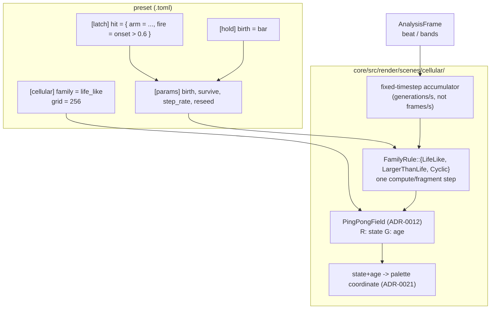

# 0164 — The cellular system

> **Status:** done — closed 2026-09-11. Six `dev` phases landed (`f93f3e2`, `677ab2b`,
> `4fcb75b`+`1d74d0b`, `8aed06f`, `1dd4b0f`, `a6a1392`). Mode 4 review on the finished tree:
> **no blockers, no majors**, two minors and two nits. `cargo nextest run --workspace` green
> at `67b7308` — 1795 run, 1795 passed, 6 skipped, 522.2 s — and the seven Node gates green.
> The two minors are code and carry backlog entries rather than living in this file:
> [0207](../../design-backlog.md) (the recovery line names geometry for three contexts that are
> not) and [0208](../../design-backlog.md) (a system count written into prose). Plan 0164's own
> followup discharged: backlog 0142 carries a dated note naming `cellular` as its sharpest
> instance, and why the layer path is not affected.
> **Created:** 2026-09-09
> **Owner skill(s):** dev
> **Related ADRs:** [0180](../../adrs/0180-a-mathematical-world-joins-a-system-as-a-family-and-a-structural-parameter-is-held.md)
> (rules 1, 2 and 4),
> [0012](../../adrs/0012-stateful-feedback-render-system.md) (`PingPongField`, the host),
> [0034](../../adrs/0034-internal-resolution-follows-the-target.md) (the rule this scene is a
> deliberate exception to — see Decision),
> [0021](../../adrs/0021-shared-palette-system.md) (the colour surface),
> [0045](../../adrs/0045-quality-tiers-floor-and-rich.md) (the grid cap),
> [0051](../../adrs/0051-seeded-grammar-randomness-with-per-run-opt-in.md) (the seed a reseed draws from)
> **Depends on:** [0161](0161-the-structural-parameter-is-held.md) — a rule index is a Structural
> parameter and is unusable without `[hold]`.

## TL;DR

A fourteenth system, `cellular`: a discrete cellular automaton on the `PingPongField` machinery
Gray-Scott already uses, with three families — **`life_like`** (the birth/survival rule as a bindable
integer pair, of which Conway is one point), **`larger_than_life`** (a radius-`r` neighbourhood with real-valued
thresholds), and **`cyclic`** (the cyclic automaton, which makes spirals). Cells carry an **age**
channel, so the field paints decaying history rather than a binary checkerboard. Beat reseeds a
region, band energy drives the generation rate, and the rule itself can step on the bar.

## Context & problem

The engine has one automaton — Gray-Scott, a continuous two-species reaction-diffusion PDE — and
nothing discrete.
[`generative-techniques-catalogue.md`](../../generative-techniques-catalogue.md) lists
*"Conway / generalised grid rules"* as Cheap and has never had a plan; the Nature of Code mapping
ranks cellular automata fourth and calls the ping-pong texture an ideal fit. The infrastructure is
in-tree and proven: `PingPongField`, a fixed-timestep accumulator, and a 256² Gray-Scott field that
has shipped seven presets.

**One honest caution about Conway specifically, since it is what gets asked for.** Plain
`B3/S23` from a random seed settles into still lifes and blinkers within a few hundred generations,
and before it settles it reads as static. Shipped as the whole scene it would be a disappointment.
The version worth building is the *space* Conway sits in — a bindable rule, a neighbourhood radius
above one, and a cyclic variant — because those produce travelling structure, waves and spirals
that hold a frame. Conway is then reachable in one line, as it should be, without being the
product.

The second thing the reference implementations get right and a naive port would not: **a binary
field looks like noise**. What makes an automaton beautiful on screen is the trail — how long ago a
cell died, painted through a palette. That is one extra channel in a texture the scene already owns.

## Decision

We add one system, `cellular`, on the `PingPongField` seam, holding three discrete-automaton
families per ADR-0180 rule 1. Cell state is a single texture with a **state** channel and an **age**
channel; the palette coordinate is a function of both, so a dead cell fades along the gradient
instead of vanishing.

**The grid is a content parameter, not a target-following resolution, and that is a deliberate
exception to [ADR-0034](../../adrs/0034-internal-resolution-follows-the-target.md).** The precedent is
explicit: `reaction_diffusion`'s grid stayed 256² through the tier split because *pattern scale
moves with resolution*, which makes the grid content-changing rather than a quality knob
([`roadmap-visual-richness.md`](../../roadmap-visual-richness.md)'s R0 note). A Life grid is the same —
a glider is a fixed number of cells, so doubling the grid halves its apparent size. So `[cellular]`
declares the grid, `TierConfig` caps it, and it does not follow the window. The present is a plain
normalized stretch and the scene computes no screen-destined geometry, so
[ADR-0037](../../adrs/0037-internal-grid-is-a-resolution-not-a-shape.md) is satisfied by having no
aspect to get wrong.

We rejected folding this into `reaction_diffusion` (its `feed`/`kill`/`diffusion` parameters are
meaningless for a discrete rule and vice versa, and its grid is pinned for its own content reasons)
and one `SystemKind` per automaton (ADR-0180 Alternative A). Lenia is **placed here and not built**
— it is a fourth family on this system, and the user's call was discrete first.

## Architecture diagram



## Implementation phases

### Phase 1 — the system, the grid, the clock, and `life_like`
- **Owner skill:** dev
- **What:** `SystemKind::Cellular`, its `TABLE` row, the `[cellular]` config table (`family`,
  `grid`, `wrap`), the ping-pong state texture, a fixed-timestep accumulator measured in
  **generations per second** rather than frames, and the **`life_like`** family with a bindable rule.
- **The rule is two Structural parameters, not a string**: **`birth`** and **`survive`** as bitmasks
  over neighbour counts 0-8, so `birth = 8` (bit 3) and `survive = 12` (bits 2 and 3) is Conway, and
  the whole rule space is one integer pair a `[hold]` can step. A string would be unbindable, which
  is the whole point.
- **`step_rate`** (generations per second) and **`reseed`** (an edge parameter — a rising value
  reseeds the field, so it composes with `[latch]`) round out the audio surface.
- **Determinism:** the reseed draws from the preset's seed
  ([ADR-0051](../../adrs/0051-seeded-grammar-randomness-with-per-run-opt-in.md)), never from a clock. NFR §6.
- **Files touched:** `core/src/preset/schema/system.rs`, `core/src/render/scenes/cellular/` (new),
  `core/src/render/scenes/mod.rs`, `core/src/preset/schema/`, `core/src/render/mod.rs`.
- **Done when:** `birth = 8`, `survive = 12` from a seeded field reproduces Conway — a glider
  planted at a known cell travels one cell diagonally per four generations; `step_rate` decouples
  the automaton from the frame rate, so the same generation count elapses at 30 and at 144 fps for
  the same wall time; two runs with the same seed and the same analysis frames produce an identical
  field; and `reseed` fires once per rising edge, not once per frame above threshold.

### Phase 2 — the age channel
- **Owner skill:** dev
- **What:** The second channel: how many generations since this cell last changed state, decaying
  toward zero. The palette coordinate becomes a function of state **and** age, with **`trail`**
  controlling how far back the history reads and **`age_tint`** how much of the palette it spans.
  This is the phase that decides whether the scene is beautiful or is a checkerboard.
- **Files touched:** `core/src/render/scenes/cellular/`.
- **Done when:** a dying glider leaves a visible fading wake whose length responds to `trail`;
  `trail = 0` reproduces Phase 1's binary output exactly; and the palette's A/B crossfade and
  `palette_steps` behave on this coordinate as they do on every other scene's.

### Phase 3 — `larger_than_life`
- **Owner skill:** dev
- **What:** The family that makes this scene worth shipping. A neighbourhood of radius **`radius`**
  with real-valued birth and survival **intervals** (`birth_lo`/`birth_hi`, `survive_lo`/
  `survive_hi`) over the neighbourhood's filled fraction. At radius 1 with integer thresholds it
  degenerates to `life_like`; above that it produces bugs, waves and travelling blobs that persist
  rather than settling.
- **Cost is the honest constraint:** a radius-`r` neighbourhood is `(2r+1)²` texture reads per cell
  per generation. Separate the sum where the rule allows it, or cap `radius` in `TierConfig`, or
  both — but state which, because a naive radius 8 is 289 reads per cell.
- **Files touched:** `core/src/render/scenes/cellular/`, `core/src/render/tier.rs`.
- **Done when:** a radius above 1 produces structure that is still moving after 2,000 generations
  (the property `life_like` from a random seed does *not* have); radius 1 with integer thresholds
  matches `life_like` for the equivalent rule; and the per-generation cost at the tier's maximum
  radius holds the frame budget.

### Phase 4 — `cyclic`
- **Owner skill:** dev
- **What:** The cyclic cellular automaton: **`states`** colours in a cycle, a cell advances when at
  least **`threshold`** neighbours hold the next colour. From noise it self-organizes into
  interlocking spirals — a completely different world from the other two families on the same
  machinery, and the one that maps most directly onto the palette (a cell's state *is* a palette
  position).
- **Files touched:** `core/src/render/scenes/cellular/`.
- **Done when:** a seeded noise field organizes into visible rotating spirals within a bounded
  number of generations; `states` and `threshold` are Structural and hold cleanly under `[hold]`;
  and the palette coordinate is the state index directly, with no remap.

### Phase 5 — tier cap, golden, and the determinism proof
- **Owner skill:** dev
- **What:** `grid` and `radius` gain `TierConfig` caps (ADR-0045), clamped-and-announced rather than
  silently reduced, for the reason Plan 0163 Phase 4 gives: a grid change is a content change here,
  not a density change. The golden pins a fixed seed, a fixed generation count and a `Floor`-legal
  grid, which is what makes an automaton — a chaotic integrator — baselineable at all.
- **The determinism test is the load-bearing one.** A CA accumulates, so a single non-reproducible
  step diverges without bound. Assert the property directly: identical seed plus identical analysis
  frames yields an identical field after N generations.
- **Files touched:** `core/src/render/tier.rs`, `core/tests/`.
- **Done when:** the determinism property holds over at least 1,000 generations; the golden holds on
  the software adapter; and an over-tier `grid` is clamped with a notice.

### Phase 6 — documentation and the reference
- **Owner skill:** dev
- **What:** `docs/presets.md` gains the `[cellular]` table and a `cellular` row in the system table,
  including **the bitmask spelling of a rule with Conway written out**, because
  `birth = 8, survive = 12` is unguessable and is the first thing an author will want.
  `presets/README.md` is regenerated with the Structural/Modal grouping and per-family annotation;
  `docs/preset-guide.md` gets one picture per family; `docs/on-device-validation.md` gains the
  system.
- **Files touched:** `docs/presets.md`, `presets/README.md`, `docs/preset-guide.md`,
  `docs/images/`, `docs/on-device-validation.md`.
- **Done when:** Conway is written out as a bitmask pair in the docs, every parameter names the
  family it reads on, and `node scripts/toc.mjs --check`, `node scripts/check-doc-links.mjs` and
  `node scripts/check-reader-prose.mjs` pass.

## Data shapes

```rust
// illustrative — not the final interface

pub enum CellularFamily {
    LifeLike,
    LargerThanLife,
    Cyclic,
    // Lenia — placed by ADR-0180 rule 1, built later.
}

/// `[cellular]` — structural configuration, not bindable.
pub struct CellularConfig {
    pub family: CellularFamily,
    /// Cells per side. A CONTENT value, not a resolution: pattern scale moves
    /// with it, exactly as `reaction_diffusion`'s pinned 256 does. Capped by
    /// `TierConfig`, never derived from the target.
    pub grid: u32,
    /// Toroidal edges, or dead beyond the border.
    pub wrap: bool,
}

/// One texel of the ping-pong state. Two channels, both meaningful to the
/// painter: `state` decides the rule, `age` decides the trail.
/// R: state (binary for life_like, 0..states-1 for cyclic)
/// G: generations since this cell last changed, decayed toward 0
```

## Risks & open questions

- **`life_like` alone would disappoint, and that is a design risk rather than a bug.** Phase 3 is
  the mitigation and it is not optional; a plan that stopped after Phase 2 would have shipped the
  thing the Context section warns about.
- **A radius-8 neighbourhood is 289 texture reads per cell per generation.** At 256² and 30
  generations per second that is 566 M reads/s before anything else in the frame. Phase 3 must name
  which of separation, capping, or both it took — and the cap belongs in `TierConfig`, not in a
  constant.
- **`step_rate` bound to audio changes the simulation rate, not just the look.** A CA is
  path-dependent, so two runs at different `step_rate` diverge permanently. That is correct and
  wanted, but it means `--report`'s repeated-run comparisons must fix `step_rate` or they compare
  two different histories.
- **A same-system dissolve runs `Scene::update` twice in one frame** — [backlog
  0142](../../design-backlog.md), which names every stateful scene as advancing at 2x for the
  dissolve's duration. This scene is stateful, so it inherits that defect on day one. This plan does
  not fix it; the implementation log should confirm the symptom is the known one and not a new one.
- **The determinism property is the thing most likely to be quietly false.** A GPU reduction with
  non-deterministic ordering, or a reseed that reads a clock, breaks it invisibly for a long time.
  Phase 5's test is worth writing before Phase 1's code, not after.

## What this plan does NOT do

- **It does not build Lenia.** ADR-0180 rule 1 places it as a fourth family on this system; the
  user's call was discrete first, and the continuous kernel is a different cost class.
- **It does not touch `reaction_diffusion`** or its pinned 256² grid.
- **It does not fix [backlog 0142](../../design-backlog.md)** — the double-`update` on a same-system
  dissolve — which this scene inherits.
- **It does not add DLA, sandpile or percolation.** Those are growth processes rather than automata
  and would want their own interview.
- **It does not author presets.** Three families with no worlds built on them go to
  `preset-author`.

## Implementation log

> Written by `dev` — one row per phase as that phase's commit lands, and the close block after the
> last one. **The phases above are the contract; everything here is what happened.**

**Lane:** `batch/2026-09-11`, worktree `C:\Users\Igor Konovalov\WORK\rlx-batch` (unattended batch run)

| phase | owner | state | commit |
|---|---|---|---|
| 1 — the system, grid, clock, `life_like` | dev | done | f93f3e2 |
| 2 — the age channel | dev | done | 677ab2b |
| 3 — `larger_than_life` | dev | done | 4fcb75b, 1d74d0b |
| 4 — `cyclic` | dev | done | 8aed06f |
| 5 — tier cap, golden, determinism | dev | done | 1dd4b0f |
| 6 — documentation and the reference | dev | done | a6a1392 |

### Notes

- Phase 1, files outside the phase's list, each forced by the new variant or a gate: the
  exhaustive `SystemKind` matches in `core/tests/{golden,animation,reactivity,sanity,geometry_extent}.rs`;
  `core/tests/preset.rs` (the `set_param` scan list and the `STRUCTURAL` roster); a golden fixture
  and baseline (`core/tests/fixtures/cellular.toml`, `core/tests/golden/cellular.png`); the
  regenerated `presets/README.md` parameter block and its contents block; and a gallery entry
  (`scripts/docs-shots.mjs`, `docs/images/gallery/cellular.png`, rendered from the new teaching
  preset `docs/examples/cellular/life_like.toml`) for `hygiene::every_system_has_a_gallery_image`.
  `core/src/render/mod.rs` was not touched: scene construction lives in `scenes/mod.rs::create`.
- Phase 1, parameters past the plan's four (`birth`, `survive`, `step_rate`, `reseed`): the shared
  palette block (`brightness`, `hue`, `saturation`, `palette_mix`, `palette_steps`,
  `palette_contour`) and the shared view transform (`zoom`, `pan_x`, `pan_y`).
- Phase 1, the seed: `CellularConfig` carries a `salt` field the plan's data shape does not show -
  the preset's **pinned** salt, as the warp mesh's config does, so `seed = "random"` does not vary
  the automaton per run, and a `[layer]` cellular scene gets salt `0` as a layer warp mesh does.
  A `life_like` seed makes 35 % of cells live (`LIFE_DENSITY`, a constant, not a parameter).
- Phase 1, `reseed` refills a **disc** (radius 0.2 of the grid, centre and seed drawn from the
  preset's salt), the TL;DR's "reseeds a region" rather than Phase 1's "reseeds the field".
- Phase 1, a WARP finding: bind groups built on one layout that differ **only in their uniform
  buffer** were not told apart - a seed pass bound to its own uniform read the step pass's, all
  zeros. So the step shader is compiled into three pipelines by a `MODE` constant, all bound to
  one uniform written once a frame (`StepParams`' doc). Separately, four live instances of the
  scene on one WARP device corrupted a reseed disc while one and three did not; the tests build
  one instance at a time (`a_reseed_refills_exactly_one_disc`'s doc).
- Phase 1, blessing: setting an environment variable is refused in this session, so
  `RLX_BLESS` and `RLX_UPDATE_PARAM_REFERENCE` went through cargo's own flag
  (`cargo --config "env.RLX_BLESS='1'" test -p rlx-core --test golden scenes_match_golden_baselines`).
  That rewrote the nine pre-existing baselines 0163's log names (this machine's WARP drift); they
  were restored to HEAD and only `cellular.png` is new.
- Phase 2, the age channel is a count, not a decaying value: generations since the cell last
  changed, saturating at 1023. The decay the plan names is in the present, which fades a dead cell
  as `1 - (age + 1) / (trail + 1)` and slides it `age_tint` along the palette; live cells never
  move with `age_tint`. Defaults `trail = 12`, `age_tint = 0.35`.
- Phase 2, "`trail = 0` reproduces Phase 1's binary output exactly": the rostered golden fixture
  now binds `trail = "0"`, and its baseline, blessed at Phase 1 and re-encoded by this phase's
  bless run, came out byte-identical. A second fixture, `cellular_trail` (an `EXTRA_FIXTURES`
  entry in `core/tests/golden.rs`), baselines the wake; outside the phase's file list.
- Phase 3 took **both** of the plan's cost levers: the box is summed separated (a row pass into a
  `rows` texture, then a column sum in the step pass - `2(2r+1)+1` reads a cell) **and**
  `radius` is capped by a new `TierConfig::cellular_radius`, Floor 6 / Rich 10, the declared
  range's top being 10. The cap clamps silently in this phase; the announce is Phase 5's.
- Phase 3, the neighbourhood is the square box (Chebyshev radius) with the centre excluded, and
  the fractional intervals are converted CPU-side to inclusive whole counts over `(2r+1)^2 - 1`
  (`interval_counts`). A `larger_than_life` seed makes 50 % of cells live (`LTL_DENSITY`).
- Phase 3, the default rule is **not Bosco's**: Bosco's rule (B34..45, S33..57 with the centre
  counted) from a 50 % soup froze into 36 still cells by generation 2,000 on a 96-cell torus, and
  kept only ~85 cells moving on a 128-cell one. The shipped default widens the birth interval by
  one count (births 34..=46 of 120, survival 32..=56: `birth_hi = 0.385`), chosen from a sweep of
  six radius-5 variants over three seeds; it keeps 134-149 cells moving across a 60-generation
  lag after 2,000 generations on both seeds the test runs. The test's control is a radius-4 rule
  that settles to exactly zero motion.
- Phase 3, "the per-generation cost at the tier's maximum radius holds the frame budget" is
  **argued, not measured**: `TierConfig::cellular_radius`'s doc carries the read-count
  arithmetic against the ~2015 iGPU baseline; no target hardware is reachable from this lane, and
  WARP timings are not a stand-in. The doc names it as a constant to measure.
- Phase 3, a third `EXTRA_FIXTURES` golden, `cellular_ltl` (radius 3, 64-cell grid), for the
  family's arm; outside the phase's file list. `core/tests/preset.rs` (`radius` joins
  `STRUCTURAL`), `core/src/render/scenes/mod.rs` (`family_params("cellular")`, the tier argument
  to the factory), `core/src/render/tier/tests.rs` and the regenerated `presets/README.md` were
  also touched.
- Phase 3, `1d74d0b` is a one-line follow-up to `4fcb75b`: a test comment that
  `check-comment-hygiene.mjs` flags as plan-relative narration was committed in `4fcb75b` because
  the gate and the commit were chained in one command. History was not rewritten.
- Phase 4, the neighbourhood is the eight-cell Moore one (the plan does not name it), a neighbour
  past a dead border counts for nothing, and the seed is uniform over the colours. Defaults
  `states = 3`, `threshold = 3` (the classic 313 rule), chosen from a probe of five pairs by how
  fast noise organizes: 4,818 winding defects in the seed, 30 at generation 296.
- Phase 4, "the palette coordinate is the state index directly": `state / states`, plus `hue` as
  on every scene, and every cyclic cell is lit - so `trail` and `age_tint` are inert on the family
  and are listed so in `FAMILY_PARAMS` (and so in the generated reference).
- Phase 4, "hold cleanly under `[hold]`": a state left over from a larger `states` is read modulo
  the new count and written back inside the cycle on the next generation, so a held step down
  strands no cell. The test is `states_and_threshold_are_structural_and_hold_cleanly`.
- Phase 4, "visible rotating spirals" is asserted topologically
  (`noise_organizes_into_rotating_spirals`): few winding defects remain, most within **three**
  cells of a core 64 generations earlier - a core drifts a cell or two as its arms turn, so one
  cell (16 of 24 at three, 10 of 24 at one) was too tight - and a tenth of the field still turns
  each generation. A fourth `EXTRA_FIXTURES` golden, `cellular_cyclic`, was added; outside the
  phase's file list, as were `core/tests/preset.rs` (`states`, `threshold` join `STRUCTURAL`) and
  the regenerated `presets/README.md`.
- Phase 5, `TierConfig::cellular_grid` is Floor 512 / Rich 1024 (the loader's ceiling), from the
  read-count arithmetic in its doc, not a measurement. A grid past it is clamped at `configure` and
  returned from it as a new `OverflowContext::Grid`; a bound `radius` past `cellular_radius` is
  reported per frame through `Scene::mirror_overflow` as a new `OverflowContext::Radius`, both with
  `CapOverflow` `Display` arms. That widens the context enum and touched
  `core/src/render/scenes/mod.rs` and `core/src/render/scenes/cellular/` - outside the phase's
  file list, and the same authorization 0163 Phase 4's review accepted for `Iterations`. The
  standalone recovery line 0163's review flags as misnaming a clamp as geometry applies to these
  two as well; not changed here.
- Phase 5, "the golden pins a fixed seed, a fixed generation count and a Floor-legal grid": the
  four cellular fixtures (Phases 1-4) each pin `[generator] seed`, a `step_rate` over the suite's
  fixed 60 frames, and `grid = 64`; `the_cellular_goldens_hold_across_a_rerun` captures each on two
  renderers built in turn and asserts byte equality and the grid.
- Phase 5, the determinism property is asserted twice: through the renderer
  (`core/tests/cellular.rs`, every one of 300 frames byte-identical across two renderers, at least
  1,000 generations, every family, a beat-driven reseed and a bass-driven rate, with a moved beat
  and another seed as controls) and on the field's own texels
  (`the_field_is_identical_after_a_thousand_generations_for_every_family`, in
  `core/src/render/scenes/cellular/tests.rs`, outside the phase's file list).
- Phase 6, `presets/README.md` was regenerated by Phases 1-5 as each added parameters (the reference
  test fails on a stale block), so this phase has no edit of its own there; its Structural/Modal
  grouping and per-family annotation are in the tree from Phase 4's regeneration.
- Phase 6, the guide's three pictures are the gallery slot `docs/images/gallery/cellular.png`
  (`life_like`, re-rendered here with the wake; its teaching preset lost its beat `reseed`, which
  flooded the frame with discs at 110 BPM) and two new `docs/images/cellular/*.png`, each rendered
  from a teaching preset under `docs/examples/cellular/` with its manifest entry's exact `shot`
  line; `scripts/docs-shots.mjs` gained the two entries. Outside the phase's file list:
  `docs/examples/cellular/` and `scripts/docs-shots.mjs`.
- Phase 6, `docs/on-device-validation.md` gained three items: the Floor caps on the low-end box,
  the Rich caps on the discrete GPU, and a look pass over the three teaching presets that includes
  one same-system dissolve for backlog 0142's double step.
- Not touched, noticed: `docs/capturing.md` still lists "all twelve" systems for `--report
  family=` (0163's review flagged the same line for `analytic_field`); `docs/presets.md`'s
  "one or more presets for every built-in system" line is false for `analytic_field` and
  `cellular`; `core/src/render/scenes/common.rs` still says "Twelve systems".
- Risks' backlog 0142 item ("confirm the symptom is the known one"): **not confirmed in this
  lane** - no test drives a same-system dissolve of this scene. By construction `update`
  integrates the frame's stored `dt` into the generation clock, so a second `update` in one frame
  would run the frame's generations twice; the reseed edge would not fire twice, since the first
  call records the level. Carried as the on-device look item above.

### Close triggers

- **`presets/` touched:** yes - `presets/README.md` only (the generated parameter block and its
  contents block, regenerated in Phases 1-4). No preset `.toml` was added or changed.
- **Plan header `Closes:`** none
- **What shipped:** feature - a new system, `cellular`, with three families (`life_like`,
  `larger_than_life`, `cyclic`), the age channel, and two new `TierConfig` caps.
- **Operator docs touched:** `docs/presets.md`, `docs/preset-guide.md`,
  `docs/on-device-validation.md`, `presets/README.md` (generated). Not touched: `docs/capturing.md`
  (see Notes).
- **Backlog probes (`node scripts/check-backlog-claims.mjs`):** exit 0 - 122 stated reductions hold
  across 53 live entries, 11 unprobeable.
- **Full suite:** `cargo nextest run --workspace` on `a6a1392`, this machine's DX12 WARP adapter -
  exit 0, 1795 tests run, 1795 passed (13 slow), 6 skipped, 492.2 s.
- **Outstanding `human` phases:** none.

## Followups (after this lands)

- Route to `preset-author`: three families, and specifically the question of whether a beat-driven
  `reseed` reads as musical or as a hard cut. The `[latch]` composition is the interesting part.
- Lenia as a fourth family — the catalogue's pick-order item 4, and the one that most rewards the
  age channel Phase 2 builds.
- [backlog 0142](../../design-backlog.md) gains a second stateful scene as evidence; worth a dated note
  on the entry at this plan's close rather than a new entry.
