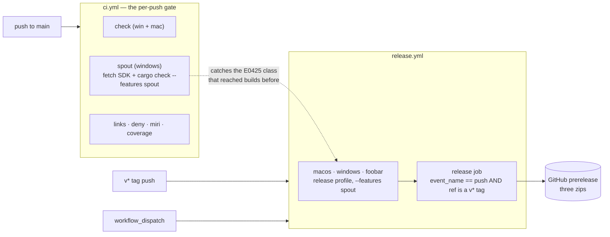

# 0165 — The release path stops being the first compile

> **Status:** done — closed 2026-09-10. Phases 0-2 landed as `ea77920`, `7807900` and `a9fc91b`;
> Phase 3 published `v0.113.0` (release run `34468008655`, all three zips, the first release since
> `v0.103.0`). Mode 4 review: **no blockers, three majors, four minors, two nits** — every major in
> the close rather than in the phases. Verified independently of the log: the Phase 0 conviction
> reproduced and cleared with a nested lane live, the over-cap bite check convicts, `--self-test`
> 10/10, `cargo nextest run --workspace` 1671/1672 with one isolated-green flake, `clippy
> --workspace --all-targets` clean, and the `spout` job green on CI run `34467912506`.
> **Version: none** — deliberate, not a miss: the diff is CI, one script and docs, so every shipped
> artifact is byte-identical.
> **Created:** 2026-09-10
> **Owner skill(s):** dev, human
> **Related ADRs:** [0181-the-gate-compiles-every-feature-a-release-ships](../../adrs/0181-the-gate-compiles-every-feature-a-release-ships.md),
> [0182-a-plan-lane-may-live-inside-the-repository](../../adrs/0182-a-plan-lane-may-live-inside-the-repository.md)
> **Closes:** design-backlog 0193, design-backlog 0194, design-backlog 0195

## TL;DR

The `spout` feature the shipped Windows binary enables is compiled for the first time by the job
that publishes it, and that has already eaten one release — `v0.112.0` died at `E0425` in a
`#[cfg(feature = "spout")]` call site and no GitHub Release was ever created. This plan adds a
`spout` compile job to the per-push gate, makes `release.yml`'s dry-run promise true instead of
merely written, and then publishes the `v0.113.0` that is tagged on `origin` but was never built.
Phase 0 comes first and is unrelated to the release path: four Node gates walk a worktree opened
inside the repository, which fails every push from the main checkout and is what would stop this
plan's own phases from landing.

## Context & problem

Four findings from unbreaking CI on 2026-09-10. Three are in the release path; the fourth is in
the gates themselves and blocks the other three from being pushed at all.

**1. Nothing compiles `--features spout` before a tag is pushed.** `ci.yml` contains no occurrence
of the string `spout`; `.githooks/pre-push` neither. Code behind `#[cfg(feature = "spout")]` is not
type-checked when the feature is off, so the whole gate is blind to it by construction. `v0.112.0`
is the worked example: `foobar` and `macos` green, `windows` red with `cannot find function
start_capture in the crate root`, the `release` job skipped by its `needs:`, and therefore **no
release at all** — a failure that announces itself only as an absent artifact. `e9b27a2` repaired
it seven commits later, incidentally, inside the Plan 0158 merge. ADR-0181 records the decision and
the rejected alternatives.

**2. `release.yml` promises a dry run it does not provide.** The `release` job's condition is
`if: startsWith(github.ref, 'refs/tags/v')` and the file contains no reference to
`github.event_name`. A `workflow_dispatch` launched against a **tag** ref satisfies that condition,
so it publishes — while the workflow's own header comment says `workflow_dispatch` "builds the same
artifacts without publishing anything, for dry runs", and `docs/releasing.md` said the Actions-tab
rehearsal "creates no release". Two documents describe a safety property the code does not have.
The doc half is corrected in the same commit as this plan; the code half is Phase 2.

**3. `v0.113.0` is tagged on `origin` and was never built or published.** GitHub does not trigger
workflows for tags pushed in bulk — more than three at once — and today's trailer-stripping history
rewrite force-pushed 131 of them. So the tag exists at `c5a08f1`, has zero Release runs, and the
newest published release remains `v0.103.0`. The trap is now written into `docs/releasing.md`;
publishing the missed version is Phase 3.

**4. One gate never adopted the tracked-set enumeration, and a lane opened inside the repository
blocks every push because of it.** `toc.mjs`, `check-doc-links.mjs` and `check-comment-hygiene.mjs`
take their file lists from `git ls-files` and walk only when git cannot answer, so a nested
checkout — untracked by definition — is already invisible to them. `check-filter-figures.mjs` scans
the working tree on purpose but leaves its exit code to the tracked half. `check-index-rows.mjs`
walks unconditionally, so it reads the seeded **red** fixture inside
`.claude/worktrees/plan-0161-structural-hold/`, whose skip is anchored to the real repo root's
absolute path and cannot match a second copy, and it convicts. That gate runs at
`.githooks/pre-push:147`, so **a clean main checkout cannot be pushed** while such a lane exists,
while CI stays green. ADR-0182 accepts the inside-the-repo lane and makes the enumeration rule
explicit; backlog 0195 carries the probes and the record of its own correction.

## Decision

Add a dedicated `spout` job to `ci.yml` rather than a step on the existing `check (windows-latest)`
job, and harden the `release` job's condition rather than merely correcting its comment. We rejected
the step-on-`check` shape because it serializes a network fetch into the gate's longest job (19m41s
on run `34448163324`) and names the wrong subject when it fails; we rejected comment-only because
the comment documents an intent — dispatch is a rehearsal — that the condition should simply
enforce. ADR-0181 carries the full argument, including why a dev-profile `cargo check` rather than
the real release build.

## Architecture diagram



## Implementation phases

### Phase 0 — The index-rows gate enumerates from git, like its siblings
- **Owner skill:** `dev`
- **What:** `check-index-rows.mjs` takes its `.md` list from `git ls-files` instead of an
  unconditional filesystem walk, falling back to the existing walk only when git cannot answer and
  **saying which source it used** — the shape `toc.mjs:119` and `check-doc-links.mjs` already
  implement, and ADR-0016's rule about a check that quietly measures less than it claims. Keep the
  existing `SKIP_DIRS`, keep both `SEEDED_TREES` skips, and keep `--self-test` working: the fixtures
  are tracked, so `git ls-files` reaches them, but note that its output is relative to the **cwd**
  rather than to the scan root — `check-backlog-claims.mjs` carries a comment on exactly that trap
  and is the reference. Then add `.claude/worktrees/` to the committed `.gitignore`, so the
  supported shape is visible to every clone instead of only to a machine-local
  `.git/info/exclude`.
- **Files touched:** `scripts/check-index-rows.mjs`, `.gitignore`
- **Done when:** `node scripts/check-index-rows.mjs` exits 0 in a main checkout that **has** a
  worktree under `.claude/worktrees/` — the exact condition that reds it today, and the one to
  reproduce before changing anything, because a fix verified against a tree without a nested lane
  has tested nothing. `node scripts/check-index-rows.mjs --self-test` still asserts the fixtures'
  exact counts, both roots still separable. The gate still convicts a genuinely over-cap row in
  `docs/`: add one, watch it fail, remove it.
- **Run this phase in the main checkout, not a sibling lane.** The done-when above requires a
  nested worktree to be present, and a lane at `WORK/rlx-plan-0165` has none inside it — the
  conviction is unreproducible there, so a fix written in a sibling lane cannot be verified by the
  criterion it has to meet. Either run the plan in the main checkout while a `.claude/worktrees/`
  lane is live, or create a throwaway one inside the lane and say so in the implementation log.
  ADR-0182 accepts both lane shapes; this phase is the one place where which one you are in changes
  what you can observe.
- **Do not take the three shapes ADR-0182 rejected** — a `.git`-entry probe on every walk, `.claude`
  in `SKIP_DIRS`, or a relative fixture skip alone. The reasons are recorded there, and the first
  two were the chosen shape until the evidence arrived.

### Phase 1 — The gate compiles the `spout` feature
- **Owner skill:** `dev`
- **What:** A new `spout` job in `ci.yml` on `windows-latest`: `actions/checkout`,
  `dtolnay/rust-toolchain@stable`, `Swatinem/rust-cache@v2`, then
  `./packaging/spout/fetch-sdk.ps1` (`shell: pwsh`, mirroring the `windows` job in `release.yml`),
  then `cargo check -p standalone --features spout`. Carry a comment naming ADR-0181 by bare
  number and stating what the job guards — that a `#[cfg(feature = "spout")]` call site is not
  type-checked by any other job.
- **Files touched:** `.github/workflows/ci.yml`
- **Done when:** the job appears in a CI run on `main` alongside `check`, `links`, `deny`,
  `coverage` and `miri`, and is green. Locally verifiable first: with the SDK staged,
  `cargo check -p standalone --features spout` succeeds on the current tree, and re-introducing
  `crate::start_capture` in place of `crate::capture_start::start_capture` reproduces the `E0425`
  this job exists to catch. **Do not commit that experiment** — it is a check that the guard has
  teeth, not a change.
- **Note on caching:** ADR-0181 leaves an SDK cache to first evidence rather than building it
  speculatively. Do not add `actions/cache` in this phase; if the fetch turns out to be slow or
  flaky, that is a followup with a measurement behind it.

### Phase 2 — A dispatch cannot publish, and the comment is true
- **Owner skill:** `dev`
- **What:** Narrow the `release` job's condition to the push event as well as the ref —
  `if: github.event_name == 'push' && startsWith(github.ref, 'refs/tags/v')` — so a
  `workflow_dispatch` on any ref, a tag included, builds the three zips as run artifacts and
  publishes nothing. Then make the header comment state the property as enforced rather than as
  hoped, naming ADR-0181's sibling finding by bare number.
- **Files touched:** `.github/workflows/release.yml`
- **Done when:** the condition names both the event and the ref, and the header comment's claim
  about `workflow_dispatch` is true as written for **every** ref it can be launched against. A
  dispatch on a tag ref is the case to reason about explicitly; it is what made the old comment
  false.
- **Trap:** pushing any change under `.github/workflows/` needs the `workflow` OAuth scope on the
  git credential — `gh auth refresh -s workflow`. `release.yml` says so at its own head; the push
  is rejected with a scope error naming neither the file nor the fix.

### Phase 3 — The missed version gets published
- **Owner skill:** `human`
- **What:** Re-push the `v0.113.0` tag so the Release workflow fires for it. The tag already
  exists on `origin` at `c5a08f1`, so the ref must be deleted and re-pushed — a no-op push of an
  unchanged ref emits no event:

  ```sh
  git push origin :refs/tags/v0.113.0
  git push origin v0.113.0
  ```

- **Done when:** a Release run exists for `v0.113.0`, its `macos`, `windows` and `foobar` jobs are
  green, and `gh release view v0.113.0` shows the prerelease carrying all three zips. Phases 1 and
  2 land first, so the build is guarded by the gate before the tag is pushed again.
- **Why `human`:** it publishes a public artifact, and pushing is the user's, never the agent's.

## Risks & open questions

- **The SDK fetch is now in the gate, so a third-party outage reds a push.** ADR-0181 accepts this
  as the price and names the cache as the mitigation if evidence arrives. The risk is real and
  deliberately untreated at draft time; treating it speculatively would add a cache key to maintain
  for a failure nobody has observed here.
- **`cargo check` does not link.** A link-only or LTO-only break in the `spout` path still reaches
  the tag push first. The plan narrows the window; it does not close it, and the ADR says so.
- **Phase 3 depends on a GitHub behavior we inferred, not read.** The claim that pushing more than
  three tags at once suppresses the workflow explains the observation — 131 tags pushed, zero
  Release runs for `v0.113.0` — but it was not verified against a documented limit in this session.
  If the re-push also produces no run, that inference is wrong and the cause is elsewhere; say so
  rather than re-pushing a third time.
- **The fallback walk stays reachable.** In a tree git cannot answer for, Phase 0's gate falls back
  to the walk and a nested lane becomes visible again. That is accepted in ADR-0182 and made legible
  by the source notice rather than removed.
- **`check-filter-figures.mjs` can still report a nested hit.** It scans the working tree by design,
  because an untracked scratch file holding a cost figure is still a second page. Its exit code comes
  from the tracked half, so this is noise and not a conviction — out of scope here, named so the
  next reader does not mistake it for the same bug.
- **`v0.112.0` can never be built from its own tree.** Its run is pinned to `f207c46`, a
  pre-rewrite SHA that no longer exists on `origin`, so `actions/checkout` cannot fetch it. The
  version is skipped, permanently. That is a consequence of the history rewrite and is recorded
  here so nobody later reads the gap as a lost artifact.

## Running this beside the live lanes

Safe to run in parallel with **[0161](../0161-the-structural-parameter-is-held.md)** (`core/src/**`,
`presets/README.md`, the `--report` path) and **[0159](../0159-the-studio-opens.md)** (`studio/**`):
there is no file in common with either, and no ordering dependency in either direction.

**The one contention is 0159's Phase 6**, *The release job and the gate*, which touches
`.github/workflows/` for a `studio` CI job and the release workflow, `.githooks/pre-push`,
`.gitignore` and `docs/releasing.md` — every file this plan shares with anything live sits in that
single phase. It also moves the release's asset count from three zips to four, in the same publish
step Phase 2 here edits.

**So land this plan first.** It is three small phases against 0159's eight, Phase 0 unblocks pushing
for every session in the main checkout, and then 0159's Phase 6 merges `main` and writes its studio
job beside a `spout` job and a hardened publish condition that already exist. The reverse order asks
the smaller plan to resolve the larger one's workflow edits.

## What this plan does NOT do

- **It does not add a `spout` step to `.githooks/pre-push`.** That gate's budget is ~28 s
  (ADR-0033) and an SDK fetch plus a shim compile does not fit. CI is the enforcement point, as it
  already is for `cargo doc`, Miri and coverage.
- **It does not touch the `--stream` feature's behavior**, its shader path, or the Spout shim. This
  is a gate plan; the code under the gate is untouched.
- **It does not publish `v0.112.0`** — see the risk above. Nor does it re-tag or re-number it.
- **It does not audit the other unpublished versions.** `v0.111.1` also shows no Release run and
  no release, and the published set stops at `v0.103.0`; whether that whole gap shares Phase 3's
  cause is a separate question this plan deliberately does not open.

## Implementation log

> Written by `dev` — one row per phase as that phase's commit lands, and the close block after the
> last one. **The phases above are the contract; everything here is what happened.**

**Lane:** `main`, in the main checkout at `WORK/Ritmolux` — no worktree of its own. Phase 0's
done-when needs a nested lane present to be observable at all, and
`.claude/worktrees/plan-0161-structural-hold` was live and `locked` throughout.

| phase | owner | state | commit |
|---|---|---|---|
| 0 — The index-rows gate enumerates from git | dev | done | `ea77920` |
| 1 — The gate compiles the `spout` feature | dev | done | `7807900` |
| 2 — A dispatch cannot publish | dev | done | `a9fc91b` |
| 3 — The missed version gets published | human | done | run `34468008655` |

### Notes

- **Phase 1's teeth check could not be run as worded, and a different mutation was used.** The
  done-when says to re-introduce `crate::start_capture` in place of
  `crate::capture_start::start_capture` and watch `E0425` reproduce. That call site — now
  `standalone/src/stream.rs:707` — is **not** behind `#[cfg(feature = "spout")]`: `mod stream` is
  declared unconditionally in `main.rs` and only the Spout *sink* inside it is gated, so the
  mutation reds the ordinary `cargo check -p standalone` as well and demonstrates nothing about the
  new job. The mutation actually used was a genuinely gated one, inside the
  `#[cfg(all(feature = "spout", windows))]` arm of `open_sink`: `let roster = adapters();` ->
  `let roster = standalone::adapters();`. Result — `cargo check -p standalone` **green**,
  `cargo check -p standalone --features spout` **red** with
  `error[E0425]: cannot find function 'adapters' in crate 'standalone'` at `stream.rs:626`.
  Reverted, not committed; `git status` was clean before the Phase 1 commit.
- **Phase 1's done-when is only half-verified in this session.** The local half is done (SDK staged
  via `packaging/spout/fetch-sdk.ps1`, `cargo check -p standalone --features spout` finished in
  13.11 s, and the mutation above). The other half — *the job appears in a CI run on `main`
  alongside `check`, `links`, `deny`, `coverage` and `miri`, and is green* — needs the push,
  which is not `dev`'s. Unverified until then.
- **The pre-push hook is red at this tip, by design, and closing the entries is what clears it.**
  Three probes are falsified by these commits, and `.githooks/pre-push:149` runs
  `check-backlog-claims.mjs`: 0193 `absent: spout in: .github/workflows/ci.yml` (now matches at
  `ci.yml:123`), 0194 `absent: github\.event_name in: .github/workflows/release.yml` (matches at
  `release.yml:212`), and 0194 `present: artifacts without publishing anything in:
  .github/workflows/release.yml` (the header comment was rewritten, so the phrase is gone).
  ADR-0181 predicts the first — *"it goes red on the commit that discharges it, which is the
  intended signal"*. Repairing a falsified entry is an `architect` call, so nothing here touched
  them.
- **0195's two probes still pass, and that is not an oversight.** Both are `present:` claims about
  `SKIP_DIRS` and the absolute-path fixture skip, and Phase 0 kept both by instruction — the walk
  they describe survives as the fallback.
- **Followup noticed, not acted on:** the `spout` job uses `dtolnay/rust-toolchain@stable`, as the
  phase specifies, while `check` and `coverage` install nothing and let rustup resolve
  `rust-toolchain.toml` on first invocation. The pin still wins inside the job, so this is a
  difference in shape rather than in toolchain — but it is the only job in `ci.yml` that names a
  toolchain action.
- The Spout SDK is now staged at `standalone/spout-sdk/` in this checkout. It is gitignored and
  untracked; nothing was committed from it.

### Close triggers

- **`presets/` touched:** no. No file under `presets/` was read or written; the three commits touch
  `scripts/`, `.gitignore` and `.github/workflows/` only.
- **Plan header `Closes:`** design-backlog 0193, design-backlog 0194, design-backlog 0195 — all
  three are discharged by the code that landed (0195 by Phase 0, 0193 by Phase 1, 0194 by Phase 2),
  and all three are still **live entries** in `docs/design-backlog.md`; see the probe note above.
- **What shipped:** fix-only, and none of it in a shipped artifact. Two gate changes and one
  workflow condition; no Rust, no C++, no preset, so `ritmolux.exe`, the `.app` and the foobar
  component are byte-identical to what the previous tag would have produced.
- **Operator docs touched:** none in this session. `docs/releasing.md`'s half of finding 2 and the
  bulk-tag-push trap were written before it, in the commit that landed the plan.
- **Backlog probes (`node scripts/check-backlog-claims.mjs`):** **exit 1**, `backlog claims: 3
  broken` — the three listed in the Notes above. The advisory half reports 65 moved paths and is
  never part of the exit code.
- **Full suite:** `cargo nextest run --workspace` (not `-P fast`), run at the tip of `a9fc91b`.
  **Exit 0** — `Summary [565.841s] 1672 tests run: 1672 passed (17 slow), 6 skipped`.
- **Outstanding `human` phases:** **Phase 3** — delete and re-push the `v0.113.0` tag
  (`git push origin :refs/tags/v0.113.0` then `git push origin v0.113.0`) so the Release workflow
  fires for it. Not started, and it needs these three commits pushed first, which the phase's own
  ordering requires. The plan's risk section covers the case where the re-push still produces no
  run: the bulk-tag inference is then wrong, and it says not to push a third time.

### Close addendum — written by `architect` at the Mode 4 review, 2026-09-10

**Phase 3 ran, and it is also the experiment the risk section describes.** The delete-and-re-push
produced run `34468008655` where the original push had produced none, and all four jobs went green:
`foobar`, `windows`, `macos`, then `release`. `v0.113.0` is published as a prerelease carrying
`ritmolux-v0.113.0-{windows-x64,macos-universal,foobar2000-component}.zip`. The tag still
dereferences to `c5a08f1`, so this is a build of the intended tree.

**The `windows` job is the result worth keeping.** It is the job that killed `v0.108.0` and
`v0.112.0`, and it is the only one that compiles `--features spout` at release profile. The gate's
`cargo check` predicted green and the `lto = "fat"` build agreed — the first time the gate and the
real build have both run on this feature.

**What the experiment does NOT settle.** The re-push explains `v0.113.0` and nothing before it.
Nineteen tags in the `v0.93.0`-`v0.113.0` window produced no Release run at all, eighteen of them
pushed before the history rewrite, and that remains unexplained. It is backlog 0196, filed at this
review because the plan deferred the question without leaving an entry or a probe behind.

**Two record corrections the review measured**, both in
[ADR-0181](../../adrs/0181-the-gate-compiles-every-feature-a-release-ships.md)'s `Outcome`: the `E0425`
cost **two** releases (`v0.108.0`, run `33992293177`, 2026-09-05), and the dispatch-on-tag publish
was **already realized** (run `31955362251` published `v0.70.0`), which means Phase 2 removes a
recovery path rather than purely tightening one.

**Phase 1's second half is verified.** The `spout` job is green on CI run `34467912506`, alongside
`check`, `links`, `deny`, `coverage` and `miri`, at 3m30s against `check (windows-latest)`'s 25m —
ADR-0181's "wall clock does not move" holds with room.

## Followups (after this lands)

- `docs/developing.md` names which gates are deliberately outside the pre-push hook — "`cargo
  deny`, doctests, Miri, and the coverage job" — and the new `spout` job joins that list. Sweep it
  at the close.
- If the SDK fetch proves slow or flaky in practice, cache it on the pinned hash, with the
  measurement in the commit message.
