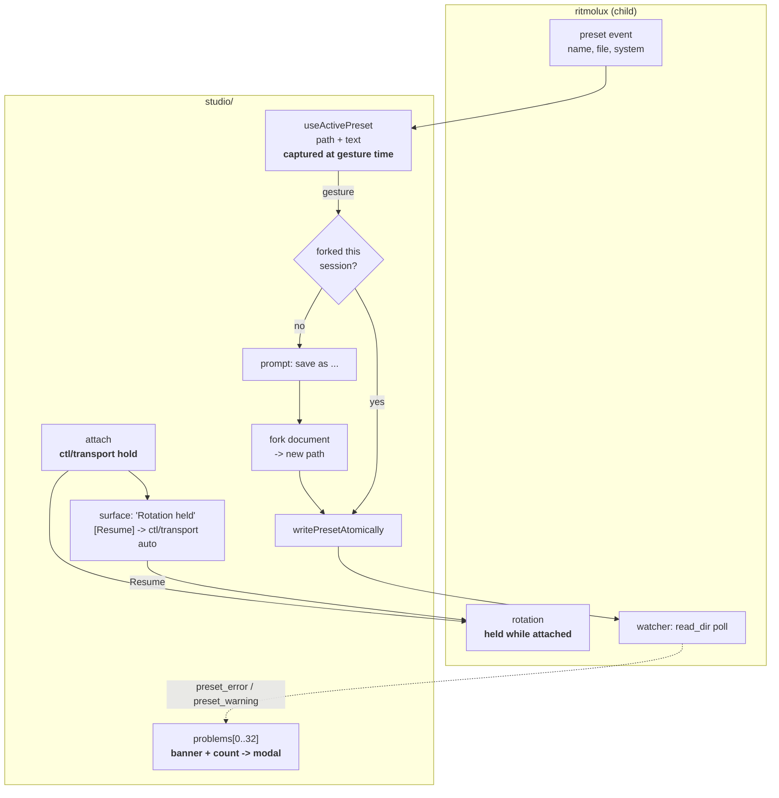

# 0168 — The studio stops surprising the author

> **Status:** done — closed 2026-09-10. Phases 1-3 landed as 4221c6a, 231424d, dadce82.
> Mode 4 review: **no blockers, one major, three minors, one nit.** The full workspace suite was
> re-run against the finished tree (1717 passed, 6 skipped) and the studio's own gate is green
> (29 files, 263 tests); the fork gate, the byte-equality of the source document, the gesture-time
> capture and the problems list were each read as assertions rather than taken from the log.
> **Created:** 2026-09-10
> **Owner skill(s):** studio-builder
> **Related ADRs:** [0189](../../adrs/0189-an-edit-forks-the-preset-and-the-studio-holds-rotation.md) (proposed —
> this plan is what accepts it), [0184](../../adrs/0184-the-player-reports-what-it-loaded-and-the-studio-re-derives-nothing.md)
> (the file under the editor stays the player's own, and this plan does not reopen it),
> [0183](../../adrs/0183-the-studio-drives-one-player-and-the-show-loop-is-extracted.md),
> [0178](../../adrs/0178-the-studio-shell-conventions.md)
> **Blocks:** [0167](0167-the-studio-becomes-handable.md) Phase 7 — the tester handoff does not run
> until Phase 1 below has landed.

## TL;DR

The studio edits whatever preset rotation last brought in, writes it without asking, and shows one
problem out of up to thirty-two. A smoke run damaged three curated presets in six minutes from
gestures the author experienced as one click. This plan makes an edit fork the preset instead of
overwriting it, holds rotation while the studio is attached, and puts every problem in reach. It
ships nothing new for a VJ to learn; it removes three ways the studio can surprise them.

## Context & problem

Plan 0167 built the studio to the point where it could be handed to someone, then ran a smoke run on
the development machine before handing it over. The three phases it shipped worked. What the session
turned up instead was recorded in that plan's `## What the developer-machine smoke run found`, and
two of the three findings are in front of the handoff rather than behind it.

**Finding A — the studio rewrites an existing preset with no confirmation, and rotation decides which
one.** Every editing gesture writes straight to the path the player named, with no prompt and no
undo. Rotation is on by default with a 20–130 s dwell, so the preset under the editor changes by
itself while the author works. In six minutes, three different presets each took `system = "swarm"`
from what the owner experienced as clicking the system picker once; a fourth had all five `[palette]
stops` recoloured, 49 differing lines. Four files modified, no prompt, no record, recovery by hand
from the shipped set. [ADR-0189](../../adrs/0189-an-edit-forks-the-preset-and-the-studio-holds-rotation.md)
settles what replaces it, and names the current behaviour as its rejected Alternative A.

**Finding B — only the first of several problems is ever shown.** `usePlayerEvents` keeps up to 32
problems, newest first; `App.tsx` renders `player.problems[0]` and nothing else, with no count saying
there are more. Changing the system is the reliable way to produce several at once, and for a
structural reason: the rewrite keeps the outgoing system's `[params]` bindings and structural tables,
and each one the incoming system does not declare is its own warning. It is also, per finding A, the
gesture most likely to have landed on a preset the author did not intend — the two findings meet on
the same click.

**Finding C's audio note is here too, and only its documentation half.** The smoke run's capture
endpoint was `live WASAPI 48000/4 Microphone Array (Realtek(R) Audio)`, while
`packaging/studio/READ-ME-FIRST.md` promises *"there is no audio setup"*. A tester who gets the same
endpoint reports *"it does not react to my music"* and has been told by the handoff note that this
cannot happen. Why the endpoint was the microphone is a diagnosis this plan does not attempt — that
is [backlog 0203]. What is repaired here is the sentence that would send the tester to the wrong
conclusion.

## Decision

Take ADR-0189 whole, in one `studio-builder` run, and add the two smaller repairs that stand in the
same doorway. **Every phase is studio-only**: no event, no field, no widening of spec 0003, and no
Rust. The one part of finding B that would move the spec — giving `preset_warning` a line and column
so a warning can be marked in the file tab like an error — is deliberately not here; it is
[backlog 0202], to be taken with a `dev` lane when something else needs one.

The order is finding A first, because it is the one blocking Plan 0167 Phase 7, and because the
problems modal is most useful once the system picker has stopped landing on the wrong file.

## Architecture diagram

## Implementation phases

### Phase 1 — An edit forks the preset, and rotation is held while the studio is attached
- **Owner skill:** studio-builder
- **What:** [ADR-0189](../../adrs/0189-an-edit-forks-the-preset-and-the-studio-holds-rotation.md), all
  three parts. A gesture against a preset this session has not already forked prompts for a name,
  writes the whole document there, and switches the editor to it; later gestures against that fork
  write silently at today's cadence. The fork's source is the `path` + `text` pair `useActivePreset`
  already holds, captured when the gesture fires rather than re-read after the answer. The studio
  sends `ctl/transport hold` on attach and carries a line saying rotation is held, with a control
  that sends `auto`. An embedded preset takes the same path — its fork is its first file.
- **Files touched:** `studio/renderer/hooks/useActivePreset.ts` (the gate and the captured pair),
  `studio/electron/preset/writer.ts` (a create-new alongside the replace),
  `studio/renderer/views/Editor.tsx`, `studio/renderer/components/ParamRow.tsx`,
  `studio/renderer/components/PaletteEditor.tsx`, `studio/renderer/components/TableEditor.tsx`,
  `studio/renderer/components/MapEditor.tsx`, `studio/renderer/components/PresetEditor.tsx`,
  `studio/renderer/hooks/usePlayer.ts`, `studio/renderer/App.tsx`, and the tests beside each.
  `studio/README.md` and `packaging/studio/READ-ME-FIRST.md` (an author needs to be told their edit
  makes a copy, before they discover it).
- **Done when:**
  - **No gesture writes an existing preset.** A test drives each of the five gesture classes — a
    param release, a palette edit, a structure-tab key, a map row, and `Ctrl+S` — against a preset
    the session has not forked, and asserts **zero** writes before the author answers and **exactly
    one**, to the new path, after. This is the assertion the smoke run's four modified files exist
    for, and nothing in the tree makes it today.
  - **The source file is byte-identical after a full editing session.** A test forks, then runs a
    series of edits against the fork, and asserts the original document's bytes are unchanged. Not a
    line count: equality.
  - **The fork is taken from what was on screen when the gesture fired.** A test changes the active
    preset between the gesture and the answer and asserts the written document is the one the gesture
    was made against, and that neither the outgoing nor the incoming file is written. This is the race
    a save-as prompt opens and the reason ADR-0189 captures the pair rather than the path.
  - **An embedded preset is editable.** A gesture against one prompts and produces a file; the
    surface no longer disables editing on `status: 'embedded'`. A test covers the whole path from
    gesture to written file.
  - **`ctl/transport hold` is sent on attach, once, and repeating an attach does not toggle
    rotation.** A test asserts the message on the wire and asserts a second attach sends the same
    position rather than the opposite one — the invariant spec 0003 states and this is the first
    consumer to depend on for correctness.
  - **The resume control sends `auto` and the surface says which state it is in.** A test asserts
    both arms.
  - **The TOML editor did not move.** `toml.test.ts`'s `changes exactly one line, and only the value
    on it` and `writes back byte for byte when the value does not move` pass **unchanged, with no
    edit to either** — the fork changes where bytes land, never how they are produced, and an edit to
    those two tests means something else happened.

### Phase 2 — Every problem is reachable, not only the first
- **Owner skill:** studio-builder
- **What:** Finding B's studio half. The banner carries a count when there is more than one problem
  and opens a modal listing every problem `usePlayerEvents` holds — newest first, each with its file
  and message, errors distinguishable from warnings. Built entirely from state that already exists.
- **Files touched:** `studio/renderer/App.tsx`, a new
  `studio/renderer/components/ProblemsModal.tsx`, `studio/renderer/hooks/usePlayerEvents.ts` (if the
  count needs surfacing), and the tests beside each.
- **Done when:**
  - **Every problem the hook holds is reachable.** A test pushes three problems, asserts the banner
    reads a count of three, opens the modal, and asserts all three appear with their file and message
    — the assertion that says the list is the hook's list and not the first element repeated.
  - **The hook's 32 bound is the modal's bound.** A test pushes 40 and asserts 32 are listed, newest
    first, and nothing is thrown. The bound is not re-declared in the modal: it reads whatever the
    hook kept.
  - **An error and a warning are told apart in the list.** A test pushes one of each and asserts they
    render distinguishably — the file tab can only mark the error (a `preset_warning` carries no
    span, which is [backlog 0202]), so the list is the only place a warning is legible at all.
  - **The file tab's existing gutter markers are unchanged.** Its tests pass with no edit.
  - **Nothing under `studio/shared/protocol.ts` and nothing under `docs/specs/` is touched by this
    phase.** Stated as a property of the diff, because the moment this phase needs a field it has
    become [backlog 0202] and belongs to a `dev` lane.

### Phase 3 — The handoff note stops promising an audio setup that may not hold
- **Owner skill:** studio-builder
- **What:** `packaging/studio/READ-ME-FIRST.md`'s *"There is no audio setup."* is true when the
  capture endpoint is the default output device and false when it is a microphone, which is what the
  smoke run got. The note names the symptom, says what to look at, and stops promising the case
  cannot arise. One paragraph, no new mechanism.
- **Files touched:** `packaging/studio/READ-ME-FIRST.md`.
- **Done when:**
  - A tester whose picture does not react has a sentence telling them what to check and what to send
    back, rather than a sentence telling them this cannot happen.
  - `node scripts/check-doc-links.mjs` passes. The file is **not** in
    `site/src/plugins/rewrite-links.mjs`'s `PUBLISHED` map and does not join it here — that is Plan
    0167's own named non-goal and needs a route and a menu entry together.

## Risks & open questions

- **The prompt lands mid-drag-release, which is the worst moment for a dialog.** ADR-0189 names this
  as its cost and leaves the placement to this lane. If a modal at that instant reads as the studio
  refusing to work, the honest answer is a different surface for the same consent — an inline name
  field, a first-edit banner — not a return to writing through.
- **Re-opening a fork across sessions is unresolved.** The studio has no memory of what it authored,
  so on the next launch its own fork is "a preset the studio did not create" and forks again. Phase 1
  must pick something; the cheapest honest answer is that the session is the unit and a second fork is
  the price, and a marker in the document is the alternative. Whichever it takes, say so in the log —
  it is the part of ADR-0189 most likely to need a follow-up.
- **Forks accumulate in the watched directory.** Backlog 0172 already records that it is never pruned;
  this makes it fill faster. Out of scope here and worth a line in the log if it becomes unpleasant
  during the phase.
- **Holding rotation changes a running show.** It is announced on the surface, but the first VJ to
  open the studio mid-set will still be surprised once. Plan 0167 Phase 8 is where that gets observed
  on a projector rather than argued about here.

## What this plan does NOT do

- **It does not give `preset_warning` a span.** That moves spec 0003 and needs a `dev` phase;
  [backlog 0202] holds it. Without it a warning cannot be marked in the file tab, which is exactly why
  Phase 2's list is the only place a warning is legible.
- **It does not diagnose why the capture endpoint was the microphone.** [backlog 0203]. Phase 3
  repairs the sentence that would mislead a tester, not the behaviour.
- **It does not prune the seeded preset directory.** Backlog 0172, untouched.
- **It does not add undo.** ADR-0189 Alternative E — recovery is not consent, and the fork removes the
  need.
- **It does not repair the drop accounting, add clip rendering, or add show projects.** Plan 0167's
  followups, all still owed and none of them in this doorway.

## Implementation log

> Written by the implementing lane — one row per phase as that phase's commit lands, and the
> close block after the last one. **The phases above are the contract; everything here is what
> happened.** **Observations, never conclusions:** this says where to look, architect decides
> how it went. No per-criterion pass list, no self-assessment, no narrative — but a deviation
> from the plan or an unmet done-when is always disclosed. Stays shorter than
> `## Implementation phases` above.

**Lane:** `main` directly.

| phase | owner | state | commit |
|---|---|---|---|
| 1 — An edit forks the preset, and rotation is held | studio-builder | done | 4221c6a |
| 2 — Every problem is reachable | studio-builder | done | 231424d |
| 3 — The handoff note stops promising an audio setup | studio-builder | done | dadce82 |

### Notes

**Phase 1 — the two calls the plan left to this lane.** The prompt is an inline name field in the
editor's status strip, replacing the path line while a gesture is held; no overlay, and the preview
is never covered at the instant a slider was released. Fork identity is **session-scoped** — a set
of paths in the hook, so a relaunch asks again and makes a second fork. Both were put to the owner
before the phase started.

**Phase 1 — what an embedded preset's fork is made of.** No event carries the embedded document's
text and ADR-0184 forbids the studio resolving one, so the fork is `templateFor` on the system the
`preset` event named, plus the gesture's edit. It is a real file and editable from there on, but it
is **not** a copy of what was on screen: the embedded preset's own bindings are not in it. Visible
in `Editor.tsx`'s `base` memo and in the embedded test's assertions.

**Phase 1 — five files beyond the phase's list, and one path in it that needed nothing.**
`shared/ipc-channels.ts`, `electron/ipc/presetHandlers.ts` and `electron/preload/api/preset.ts` carry
a `preset:create` OS channel beside `preset:write`, because the create-new in `writer.ts` refuses a
name that exists and that refusal has to reach the renderer. `components/ForkPrompt.tsx` and
`components/Rotation.tsx` are the two surfaces. The five editor components the plan listed take
`writable` as a prop and needed no edit — only `Editor.tsx`'s computation of it moved.

**Phase 1 — the library's new preset goes through the same create.** It previously used
`preset.write`, which would have overwritten a curated preset whose name collided; it is now the
create that refuses, and the file it makes is registered as this session's own so editing it does
not ask for a name.

**Phase 1 — the refusal is a check plus a rename, not an atomic no-clobber.** Node has no portable
one, and `open` with `wx` would claim the name with an empty `.toml` the watcher reads as a broken
preset. Recorded in `createPresetFile`'s own comment.

**Phase 2 — one file beyond the phase's list.** `components/Banner.tsx` gained an optional `action`
so the count can sit on the banner it summarises; every existing caller renders as before.
`usePlayerEvents.ts` needed nothing — the length was already reachable.

**Phase 3 — one line beyond the phase's list.** Section 5 promised six things and listed seven;
corrected while the file was open.

**The gate, after each phase:** `npm run typecheck`, `npm run lint`, `npm test` in `studio/` — 29
files, 263 tests, green. `shared/toml.test.ts` and `renderer/editor/diagnostics.test.ts` were not
edited. `shared/protocol.ts` and `docs/specs/` are untouched by the whole plan.

**Not run:** the studio was built (`npm run build`) but not launched against a real player. Every
done-when here is a test; what a person would see — the prompt mid-drag, the held-rotation line on a
projector — is Plan 0167's Phase 7 and Phase 8.

[backlog 0202]: ../../design-backlog.md
[backlog 0203]: ../../design-backlog.md
