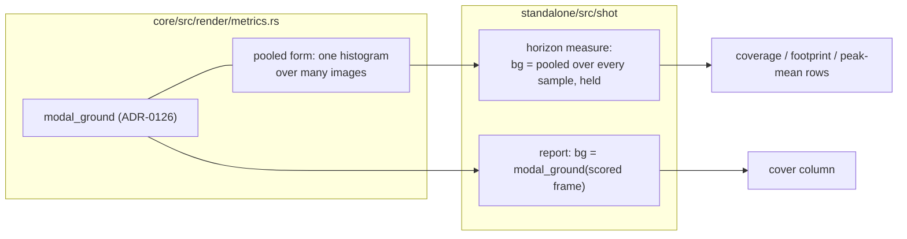

# 0170 — The horizon reads the frame's own ground

> **Status:** done — closed 2026-09-14. Phases `58a0a65` (1) and `4888399` (2). Mode 4: no blockers,
> no majors, three minors, two nits. Architect's full `cargo nextest run --workspace` after merging
> `main`: 1918 passed, 6 skipped. Backlog 0210's recipe reproduced. Backlog 0213 filed. Version 0.122.2 (patch).
> **Created:** 2026-09-11
> **Owner skill(s):** `dev`
> **Related ADRs:** [0126](../../adrs/0126-the-sanity-lens-measures-departure-from-the-frames-own-ground.md)
> (accepted — this plan extends its estimator to the two `shot` readings that never adopted it)
> **Closes:** design-backlog 0210, 0211.

## TL;DR

`--horizon` takes its background colour from the top-left pixel of frame 0, and on a seeded cellular
field that pixel can be a live cell: a field frozen into rings on black read coverage **0.9818**
against a true **0.0182**. This plan gives `--horizon` and `--report` the ground estimator the sanity
lens already uses (`metrics::modal_ground`, ADR-0126), pooled over every sampled image for the
horizon so the ruler still never moves. The second phase settles the Larger than Life default: it is
not changed, and the one test and the grammar reference stop claiming it keeps moving.

## Context & problem

- **0210 (Medium):** `measure` in `standalone/src/shot/horizon.rs` samples the ground once, from
  `images.first()`'s corner, and holds it for every row, so that the mask cannot move under the
  statistics. Coverage, footprint and peak/mean all read through it. The first image is frame 0, a
  cellular world's seed soup, whose corner is live about half the time. `--report`
  (`standalone/src/shot/report.rs`) uses the same corner convention on the frame it scores, and
  `docs/capturing.md` describes its `cover` column that way.
- **0211 (Low):** the default rule (radius 5, birth 0.28-0.385, survival 0.26-0.47) was chosen by a
  test on a 128-cell torus from two salts. On Tide Bugs' own 256 grid with reseed off, nothing moves
  from 90 s on. The test's name, `larger_than_life_is_still_moving_after_two_thousand_generations`,
  claims a property of the family that one grid and two seeds cannot carry.

## Decision

The interview chose the pooled modal ground and documentation over a re-sweep. The horizon takes
`modal_ground` over the histogram of **every** sampled image together, computed once and held — so
the noisy frame 0 is outvoted by the settled frames, and the ruler still does not move between rows.
`--report` takes `modal_ground` of the frame it scores. We rejected `modal_ground` of frame 0 alone (a
50 % soup is a near-tie, and ties resolve to the brighter band, the live cell), keeping the corner with
a warning (the reading stays wrong), and a scene-declared clear colour (widens what the shell asks the
core, for a problem the existing estimator solves). For 0211 we rejected a re-sweep: it costs GPU test
time with no guarantee a sustaining rule exists, and the one shipped world already reseeds on purpose.

## Architecture diagram

## Implementation phases

### Phase 1 — `--horizon` and `--report` measure from the frame's own ground
- **Owner skill:** dev
- **What:** A pooled form of `modal_ground` in `core/src/render/metrics.rs` (one luminance histogram
  summed over a slice of images, the same band mean and the same `NO_GROUND` rule). `measure` uses it
  once over all sampled images; `report.rs` uses `modal_ground` on the frame it scores. The horizon's
  header prints the ground it measured from. `docs/capturing.md` stops saying "corner".
- **Files touched:** `core/src/render/metrics.rs`, `core/src/render/metrics/tests.rs`,
  `standalone/src/shot/horizon.rs`, `standalone/src/shot/report.rs`, `docs/capturing.md`.
- **Notes for the implementer:**
  - Treat `NO_GROUND` exactly as `core/tests/sanity.rs` does. Do not invent a third treatment.
  - The pooled form must give the same answer as `modal_ground` on a slice of one image, so the two
    cannot drift; test that equality.
  - `--report`'s `cover` column moves on any preset whose corner was not its modal ground. Run
    `shot --presets presets --report` before and after and put the `cover` changes in the log. The
    property to check is that **every** change is on such a preset; one that is not is a finding.
- **Done when:**
  - a metrics test pools one half-lit frame with six mostly-black frames and gets black;
  - the pooled form equals `modal_ground` on a single image;
  - re-running backlog 0210's recipe prints coverage from 60 s on as the complement of what it printed
    on 2026-09-11 — about 0.018 where it printed 0.9818 — and the header names a black ground.

### Phase 2 — The Larger than Life default is documented as settling
- **Owner skill:** dev
- **What:** Rename the sustain test so it states what it measures (the default rule, a 128-cell torus,
  salts 12 and 13), and rewrite its doc so it does not claim the property for the family. Add a
  paragraph to `docs/presets.md`'s `larger_than_life` section: a world on this family with no reseed
  settles, on the default rule within about a minute, so `reseed` is how a world stays alive.
- **Files touched:** `core/src/render/scenes/cellular/tests.rs`, `docs/presets.md`.
- **Notes for the implementer:**
  - The default values do not change, so `presets/README.md` (generated) does not either.
  - `docs/presets.md` is a reader document: no bare plan or ADR citations in it
    (`scripts/check-reader-prose.mjs`).
  - Backlog 0211's second probe names the old test function and goes red on this phase by design.
- **Done when:** the test carries its new name and an accurate doc, and `docs/presets.md` says an
  unreseeded `larger_than_life` world settles.

## Risks & open questions

- **A duotone preset has two grounds.** `modal_ground` breaks ties toward the brighter band, and
  ADR-0126's Outcome records that as arbitrary but deterministic. The horizon inherits that; the
  header naming the ground is how a reader sees which one it picked.
- **Pooling assumes the settled frames outnumber frame 0.** A two-row horizon (an interval equal to
  the length) pools two images and can still tie. The header line is the visible check.
- **`--report`'s near-duplicate flags do not read the ground**, so they should not move; if they do,
  that is a finding.

## What this plan does NOT do

- **It does not change the Larger than Life default** or re-sweep it.
- **It does not re-sample the ground per row.** The horizon's fixed ruler stays; only its source moves.
- **It does not touch the sanity lens**, which already measures this way.

## Implementation log

> Written by `dev` — one row per phase as that phase's commit lands, and the close block after the
> last one. **The phases above are the contract; everything here is what happened.**

**Lane:** branch `plan-0170-horizon-ground`, worktree `.claude/worktrees/plan-0170-horizon-ground`

| phase | owner | state | commit |
|---|---|---|---|
| 1 — `--horizon` and `--report` measure from the frame's own ground | dev | done | 58a0a65 |
| 2 — The Larger than Life default is documented as settling | dev | done | 4888399 |

### Notes

- **Deviation, P1 (58a0a65), agreed at the Step 2 gate:** also edited `standalone/src/shot/horizon/tests.rs`
  (corner-ground test rewritten as `the_ground_is_pooled_over_every_row_and_held_for_the_whole_run`);
  `--horizon --json` gains `"ground":[r,g,b]`; `report.rs`'s silent-baseline corner read (behind
  `reactivity_footprint`) moved to `modal_ground` too. `docs/capturing.md`'s "row *k* does not depend
  on the horizon's length" is restated as holding only while two runs print the same ground; its
  sample report rows' `cover`/`level` cells were updated.
- **P1, 0210's recipe** (reseed 0, trail 0, step_rate 12, `--horizon 3 --interval 30 --size 96x96`):
  coverage 0.4975/0.9806/0.9818x4/1.0000 became 0.5025/0.0194/0.0182x5, header `ground (0, 0, 0)`;
  footprint at 150 s and 180 s reads 0.0337 and 0.0139 (was 0 and 0.0003).
- **P1, `--report --json` before/after** (with a temporary, uncommitted corner-vs-modal trace): `cover` moved
  on 93 of 113 presets, `level` on 93, `reactivity_footprint` on 91; every move is on a preset whose
  corner differs from its modal ground on that capture; no other column and no `distinctness` block
  moved. Largest `cover` moves: On White 0.9922->0.2580, Collage Mono 0.8755->0.1524, Echo Plate
  0.9951->0.3498, Seahorse 0.9801->0.4148, Shatter 0.9973->0.5798; up: Anemone 0.5233->0.8769.
- **P2:** preceding `larger_than_life` paragraph in `docs/presets.md` ("keep travelling") also reworded.
- **Followups noticed:** `docs/preset-tuning-walkthrough.md`'s `--report` rows carry corner-era `cover`;
  `docs/capturing.md` cites `reaction_coral_bloom`, not in `presets/`; `cellular_tide_bugs.toml`'s
  header says "motion 0.000 from 60 s on"; `cargo clippy -p rlx-core --all-targets` alone fails on
  dead fields in `core/src/render/context.rs` (the `--workspace` form is clean).

### Close triggers

- **`presets/` touched:** no
- **Plan header `Closes:`** design-backlog 0210, 0211
- **What shipped:** fix-only (`shot --horizon` / `--report` readings; `--horizon --json` gains a `ground` key)
- **Operator docs touched:** `docs/capturing.md`, `docs/presets.md`
- **Backlog probes (`node scripts/check-backlog-claims.mjs`):** exit 1 — 2 broken: 0210 (`corner` probe
  in `horizon.rs`), 0211 (old test name in `cellular/tests.rs`)
- **Full suite:** `cargo nextest run --workspace` exit 100 — 1234 passed, 1 failed
  (`path_cost::the_contour_arity_is_priced_against_the_floor_tier`, a wall-clock probe; passes alone),
  682 not run; rerun `cargo nextest run --workspace --no-fail-fast` exit 0 — 1917 passed, 6 skipped
- **Outstanding `human` phases:** none

## Followups (after this lands)

- **The horizon's length-independence test still states the unconditional property.**
  `a_horizon_is_reproducible_and_does_not_depend_on_its_own_length` in `standalone/tests/shot_cli.rs`
  never compares the two runs' `ground` keys, though pooling makes shared rows equal only while the
  ground is. Filed as design-backlog 0213.
- **Corner-era measurements stand in eighteen preset headers and in `docs/preset-tuning-walkthrough.md`.**
  The list is in the close write-up in `docs/plans/README-archive.md`; re-measuring is content work.
  `cellular_tide_bugs.toml`'s *"motion 0.000 from 60 s on"* is known wrong: the corrected horizon reads
  footprint 0.0337 and 0.0139 at 150 s and 180 s.
