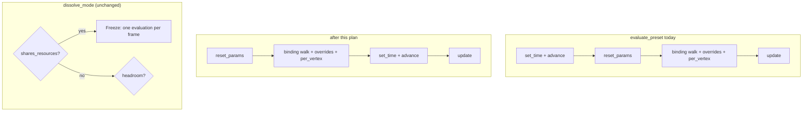

# 0181 — A scene advances after its frame's bindings

> **Status:** done 2026-09-15. Phases `00c9587`, `b4d2c15`, `5b93cd6`; conductor close review round 1:
> no blockers, no majors, three minors (one fixed at the close), one nit. Full `nextest --workspace`,
> `cargo doc`, `fmt` and `clippy` re-run green by the review. Version 0.123.2 (patch).
> **Created:** 2026-09-14
> **Owner skill(s):** `dev`
> **Related ADRs:** [0198](../../adrs/0198-a-scene-advances-after-its-frames-bindings.md) (accepted),
> [0024](../../adrs/0024-cross-preset-transitions.md), [0132](../../adrs/0132-a-rate-parameter-integrates-a-phase.md),
> [0135](../../adrs/0135-every-scene-rate-integrates-through-one-shared-phase.md)
> **Closes:** design-backlog 0191; design-backlog 0142 (falsified, see below)

## TL;DR

`evaluate_preset` calls `scene.advance(dt)` before it resets the scene's parameters and applies the
preset's bindings. Any scene that integrates a bound value inside `advance` therefore integrates the
**previous** frame's value. On the frame a preset switch lands, that previous value belongs to
another preset, or is the scene's default. Two scenes do this today: `emitter` (its sprite `spin`)
and `shape_collage` (its `drift`, `spin`, `density` fades, recomposition edge and canvas rebuild).
This plan moves `advance` to after the binding walk in both evaluation functions, so every scene
integrates the values its own frame bound, and a future scene cannot get this wrong.

The plan was drafted to add a once-per-frame guard for backlog 0142 (a same-system dissolve
advancing a shared scene twice). **Reading the tree falsified that entry**: the dissolve governor
never runs a same-system dissolve live, so the double advance is unreachable in a shipped build.
This plan builds no guard. It pins the veto that makes the path unreachable, and closes the test
hatch that could build it anyway. **This reverses an interview answer, and the user confirmed it at approval on 2026-09-14.**

## Context & problem

### Backlog 0142's premise does not hold

The entry's reasoning: `scene_for_mut` resolves a scene by `SystemKind`, so both sides of a
same-system dissolve get one `Box<dyn Scene>`, and `evaluate_preset` runs twice against it per frame.
The first half is true. The second half needs the dissolve to run **dual-live**, and the governor
refuses exactly that:

- `Renderer::dissolve_mode` (`core/src/render/transition.rs`) asks `scenes::shares_resources(a, b)`
  before anything else.
- `shares_resources` (`core/src/render/scenes/mod.rs`) is `a == b || (both draw through the shared
  LineRenderer)`.
- `dual_live_eligible(true, _, _)` returns `false` unconditionally, so the mode is `Freeze`.
- Under `Freeze`, `draw_frame` in `core/src/render/mod.rs` skips `encode_outgoing_side` (it is gated
  on `Transition::is_dual_live`). The shared scene is evaluated **once** per frame, for the active
  preset.

The governor's wiring test already asserts this for one same-system pair
(`dissolve_mode_freezes_a_shared_scene_pair_and_an_unresolvable_one` in `core/src/render/tests.rs`).
The pure function's test asserts the veto holds even with frame-time headroom. `Mode::Freeze`'s own
doc calls it "the same-scene answer".

The only way to reach a same-system dual-live frame is `Renderer::begin_transition_forced`, a
`#[cfg(test)]` helper that overwrites the governor's answer. No test uses it on a shared pair today,
and nothing stops one from doing so.

The entry's other claim, that "no test reaches the dual-live render path", is also stale:
`dissolve_at` in `core/src/render/tests.rs` drives it through that same helper for an independent
pair.

**A frame-stamp guard would not help even if the path were reachable.** Both sides of a dual-live
frame encode into one command buffer and share one submission. A single scene object encoded twice
writes its uniforms twice before that submission, so both draws would read the second write. That
is the GPU half of the veto, and the reason ADR-0024 put the veto there. A guard that made the second
`advance` a no-op would still leave the two sides drawing one set of uniforms.

### Backlog 0191 holds, and its population is exactly two scenes

`evaluate_preset` (`core/src/render/evaluate.rs`) runs, in order: `set_time`, `advance(dt)`,
`chain.set_dt`, `reset_params` on the side and the scene, the binding walk, the live overrides, the
`[per_vertex]` table, then `update`. `evaluate_layer` has the same order.

ADR-0135 already records the consequence as a convention: `Phase::step` is "called from
`Scene::update`, never from `advance`, because `advance` runs before the frame's `set_param` calls".
Most scenes follow it. They store `dt` in `advance` and integrate in `update`:
`fragment_field`, `parametric`, `spectrum`, `swarm`, `warp_mesh`, `cellular`. `particles` and
`reaction_diffusion` drain a fixed-step accumulator in `advance` that reads no parameter.

Two scenes break the convention:

| Scene | What `advance` reads that a binding sets | Site |
|---|---|---|
| `emitter` | `self.spin`, integrated into `spin_integral` | `core/src/render/scenes/emitter.rs`, `fn advance` |
| `shape_collage` | `rebuild()` reads `count`, `layout`, `seed`, `size_hierarchy`, `angle_bias`, `roster`. `step(dt)` reads `drift`, `spin`, `density` and the `recompose` edge | `core/src/render/scenes/shape_collage.rs`, `fn advance` |

The backlog entry says the switch frame integrates "at the scene's defaults". That is only true for
a freshly built scene. `reset_params` runs **after** `advance`, so at `advance` time the scene holds
the values the **previous frame's** bindings wrote. On a switch those come from whichever preset last
drove that system, which may be the outgoing preset or one from much earlier. It is still one frame
of wrong rates, and still invisible as a rate. On `shape_collage` it is also one frame of wrong
recipe: a fresh capture generates the default canvas on frame 1 and regenerates the bound one on
frame 2.

**The entry's cost estimate is wrong, and it is what kept this filed.** It says reordering "changes
which frame's parameters drive which frame's integration for every preset" and moves every golden.
But a scene that stores `dt` in `advance` produces the same result whichever side of the binding
walk `advance` sits on, and so does a scene that drains a parameter-free accumulator. Only the two
scenes in the table can move. That makes the structural fix as cheap as the scene-local one.

## Decision

**0191.** `evaluate_preset` and `evaluate_layer` call `scene.set_time` and `scene.advance` **after**
the binding walk, the overrides and the `[per_vertex]` table, immediately before `scene.update`. The
`Scene::advance` doc changes accordingly: `advance` runs after this frame's parameters are applied,
so a scene may integrate a bound value there or in `update`, and both are correct.
`side.chain.set_dt` and the two `reset_params` calls stay where they are.

We rejected four alternatives:

- **Move the integration into `update` in the two offending scenes** (the scene-local fix). It is
  pixel-equivalent to the reorder, but it keeps a trait-order contract that two scenes
  already broke and the doc comment could not prevent. Holding it would need a text guard over every
  `advance` body. The reorder removes the trap instead of guarding it.
- **Reorder only on the frame a switch lands.** That is two evaluation orders chosen by a frame
  flag, which is two answers to one question (the pattern ADR-0191 retired). It also leaves the
  steady-state one-frame lag.
- **Leave it filed.** The population grows every time a rate is converted properly, as Plan 0140
  showed. The fix is cheap now.
- **A per-frame stamp making a second `advance`/`update` a no-op**, the interview's answer for 0142.
  See Context: the path is unreachable, and the guard would not make it renderable.

**0142.** No guard. `begin_transition_forced` refuses `Mode::DualLive` for a pair
`scenes::shares_resources` reports as shared and keeps `Freeze`, so a test cannot build a frame the
governor forbids. The governor wiring test is widened from one same-system pair to every
`SystemKind`. The veto is recorded in ADR-0198 as load-bearing for per-frame scene **state** as well
as GPU state. Relaxing it later (for example to let same-system dissolves animate) needs per-side
scene instances, and that is a new decision.

## Architecture diagram

## Implementation phases

### Phase 1 — The shared-scene veto is pinned, and the test hatch honours it

- **Owner skill:** dev
- **What:** Widen the governor wiring test to assert `Mode::Freeze` for a same-system pair on
  **every** `SystemKind`, iterating `SystemKind::ALL` so a new system is covered when it is added.
  Make `begin_transition_forced` keep `Freeze` when the two presets' systems share resources, and
  give its doc the reason: the governor forbids that frame, and a test that builds it observes a
  defect no shipped build can have.
- **Files touched:** `core/src/render/transition.rs` (`begin_transition_forced`);
  `core/src/render/tests.rs` (`dissolve_mode_freezes_a_shared_scene_pair_and_an_unresolvable_one`,
  plus one new test for the forced helper).
- **Done when:**
  - For every `SystemKind`, two presets of that system dissolve at `Mode::Freeze`. The test builds
    its pair list from `SystemKind::ALL`, not from a literal list.
  - `begin_transition_forced(to, Mode::DualLive)` on a same-system pair leaves
    `Transition::is_dual_live()` false on every dissolve frame. On an independent pair it still
    turns dual-live on, which the existing `dissolve_at` tests exercise.
  - The existing dual-live tests (`dissolve_at` and its callers, the layered-pair reproducibility
    test) pass unchanged. Every pair they force is independent.

### Phase 2 — Every scene advances on the values its frame bound

- **Owner skill:** dev
- **What:** In `evaluate_preset` and `evaluate_layer`, move `scene.set_time(time)` and
  `scene.advance(dt)` below the `[per_vertex]` block, directly above `scene.update(frame)`. Rewrite
  `Scene::advance`'s doc to state the new contract. Add the two behavioural tests below **before** moving the lines, and record in
  the log that both fail on the unmoved tree.
- **Files touched:** `core/src/render/evaluate.rs`; `core/src/render/scenes/mod.rs` (the
  `Scene::advance` doc); tests beside the existing emitter and collage tests (or in
  `core/src/render/tests.rs` through a headless renderer, whichever reaches the integrated value). A
  `#[cfg(test)]` accessor on the **concrete** scene type is acceptable. A new `Scene` trait method is
  not (ADR-0002).
- **Done when:**
  - **The switch frame integrates the bound rate.** A fresh `emitter` preset that binds `spin = K`
    (with `K` ≠ the default) has `spin_integral == K * dt` after its first evaluated frame, not
    `DEFAULT_SPIN * dt`. Compare exactly: both sides are one product of the same two `f32` values.
  - **The switch frame builds the bound canvas.** A fresh `shape_collage` preset that binds `seed`
    (or `count`) to a non-default value regenerates its canvas **once** across its first two frames,
    and the canvas on frame 1 is the bound recipe's. Today it builds the default canvas on frame 1
    and regenerates on frame 2. Read the generation count or the recipe, not pixels.
  - Both tests fail on the tree before the lines move.
  - The latch countdown in `LatchBank::advance` is **not** touched. Its `dt.max(0.0)` belongs to
    Plan 0175, which rules on backlog 0212's three sign guards.
  - **Bless discipline.** `cargo nextest run --workspace`: the baselines that may move are
    `core/tests/golden/emitter.png`, `shape_collage.png` and `shape_collage_roster.png`, plus any
    other golden whose fixture declares `system = "emitter"` or `"shape_collage"` at the top level
    or in a `[layer]`. A moved baseline outside that set is a **stop**: it means some other scene's
    `advance` read a parameter, which contradicts the population table above. Name it in the log
    rather than blessing it. The per-preset sweeps (`sanity`, `animation`, `distinctness`,
    `reactivity`) must stay green without retuning. They are gates, and a one-frame shift should not
    cross one.

### Phase 3 — The prose follows the order

- **Owner skill:** dev
- **What:** Rewrite the code comments that argue from the old order:
  - the "Stored, not integrated" comments in `fragment_field.rs` and `lines/parametric.rs`, which
    say this frame's rate "has not been set yet";
  - `Phase`'s doc in `scenes/mod.rs`, which says integrating in `advance` "would use the previous
    frame's";
  - the emitter and collage `advance` docs;
  - any comment in `evaluate.rs` that explains `advance`'s position;
  - the negative-control comment in `a_degenerate_frame_delta_cannot_reach_a_scene`
    (`core/src/render/tests.rs`). It explains that the stretched frame "has to be" the second one
    because `evaluate_preset` advances before the bindings. After Phase 2 the reason is gone. The
    second frame still works, so keep it, and state what the test needs instead of the old order.

  A scene that stores `dt` in `advance` and integrates in `update` stays correct, so no code in those
  scenes changes. Only the stated reason does.
- **Files touched:** `core/src/render/scenes/fragment_field.rs`, `lines/parametric.rs`, `mod.rs`,
  `emitter.rs`, `shape_collage.rs`, `core/src/render/evaluate.rs`, `core/src/render/tests.rs`
  (comments only).
- **Done when:**
  - `grep -rn "set yet\|previous frame's" core/src/render/scenes` finds no comment that places
    `advance` before the bindings. These comments wrap across lines, so read each hit rather than
    counting them.
  - `node scripts/check-comment-hygiene.mjs` exits 0.
  - `cargo nextest run --workspace` moves nothing beyond what Phase 2 blessed.

## Risks & open questions

- **The user chose the guard in the interview.** This plan rejects it on evidence gathered after
  the interview. If the user still wants same-system dissolves to animate live, that is a different
  plan: per-side scene instances, which ADR-0030's mid-run allocation argument weighs against. Settle
  it at approval.
- **A scene `set_param` that depends on state `advance` just computed.** None found, since every
  `set_param` in the roster stores. If Phase 2's run turns one up, it shows as a golden outside the
  bless set, which is the stop.
- **`shape_collage`'s recomposition edge fires one frame earlier.** A `recompose` binding that
  crosses its threshold now recomposes on the frame it crosses. Collage presets bound to `beat` will
  shift their recomposition by one frame. That is the fix, not a regression, but a curator comparing
  renders across the change will see it.
- **Backlog probes.** 0191's probes match `scene\.advance\(dt\);` and `scene\.reset_params\(\);` in
  `evaluate.rs`. Both lines survive the move, so the probes stay green while the claim becomes false.
  0142's probes (`routing.rs`'s `.find`, `particles`' `spin_time.step`) are unaffected. `dev` reports
  the probe exit and leaves both entries alone. Archiving them, 0142 as falsified, is the close's
  step 3c.

## What this plan does NOT do

- **No once-per-frame guard, and no per-side scene instances.** Same-system dissolves keep freezing.
- **No change to `LatchBank::advance`** or any frame-delta guard. Plan 0175 owns backlog 0212.
- **No change to what `advance` means for fixed-step scenes.** `particles` and
  `reaction_diffusion` still drain their accumulators there.
- **No preset edits.** No preset works around the one-frame lag, so there is nothing to un-dodge.

## Implementation log

> Written by `dev` — one row per phase as that phase's commit lands, and the close block after the
> last one. **The phases above are the contract; everything here is what happened.**
> **Observations, never conclusions:** this says where to look, architect decides how it went.
> No per-criterion pass list, no self-assessment, no narrative — but a deviation from the plan or
> an unmet done-when is always disclosed. Stays shorter than `## Implementation phases` above.

**Lane:** `C:\Users\Igor Konovalov\WORK\rlx-plan-0181` on branch `plan-0181-a-scene-advances-after-its-frames-bindings`

| phase | owner | state | commit |
|---|---|---|---|
| 1 — The shared-scene veto is pinned, and the test hatch honours it | dev | done | 00c9587 |
| 2 — Every scene advances on the values its frame bound | dev | done | b4d2c15 |
| 3 — The prose follows the order | dev | done | 5b93cd6 |

### Notes

- Phase 2: both behavioural tests (`a_fresh_emitter_integrates_its_bound_spin_on_its_first_frame`,
  `a_fresh_collage_builds_its_bound_canvas_once_on_its_first_frame`, in `core/src/render/tests.rs`)
  failed on the unmoved tree: the emitter integrated `0` against `K * dt = 0.05416667`, and the
  collage's frame-1 canvas was generated from seed `0` rather than `4242`. They reach the concrete
  scene through a test-only forwarding `Scene` wrapper swapped into the renderer's roster.
- Phase 2: `cargo nextest run --workspace` after the move was green with no bless: no golden,
  inside or outside the emitter/collage set, left its tolerance.
- Phase 3 deviation: also rewrote the comment in `WarpMeshScene::update`
  (`core/src/render/scenes/warp_mesh/mod.rs`), which said `advance` runs before the frame's
  `set_param` calls. The file is not in the phase's list; the done-when grep over
  `core/src/render/scenes` required it. The failing-frame assertion message in
  `a_degenerate_frame_delta_cannot_reach_a_scene` still says "a longer first frame" while the
  stretched frame is the second; the phase is comments-only, so it was left.

### Close triggers

- **`presets/` touched:** no
- **Plan header `Closes:`** design-backlog 0191; design-backlog 0142 (falsified)
- **What shipped:** fix (render evaluation order), plus tests and comments
- **Operator docs touched:** none
- **Backlog probes (`node scripts/check-backlog-claims.mjs`):** exit 0 - 135 reductions hold across 58 live entries, 12 unprobeable; 0191 and 0142 left in place
- **Full suite:** `cargo nextest run --workspace --no-fail-fast` (under the suite lock) at 5b93cd6's tree - exit 0, 1936 passed, 6 skipped
- **Outstanding `human` phases:** none

## Close review

> The conductor-run close review (ADR-0205), round 1, 2026-09-15, written in a fresh session given
> the plan and the lane. There were no earlier rounds, so no finding was resolved by a fix round.

**Verdict: Plan 0181 landed as written; no blockers, no majors, three minors (one fixed at the close)
and one nit.** The reorder is exactly the two-function move the plan specified, the population table
holds against the tree, both behavioural tests assert the done-when's claims exactly, and the
shared-scene veto is pinned for every `SystemKind` and honoured by the test hatch. What did not fully
land is Phase 3's intent: two comments outside its file list still state the retired order as fact.

Lane: `C:\Users\Igor Konovalov\WORK\rlx-plan-0181`, branch
`plan-0181-a-scene-advances-after-its-frames-bindings`. Phase commits `00c9587` (1), `b4d2c15` (2),
`5b93cd6` (3), log close block `d78df81`, all on `538f736`.

### Findings

**minor**

1. **`core/src/render/scenes/particles/mod.rs:1706-1708` states the retired order as a fact.** The
   comment reads "the renderer calls `advance` before it routes this frame's bindings, so `self.spin`
   is last frame's value there and this frame's here". Since `b4d2c15` that is false. Phase 3 exists
   to rewrite exactly this class of comment; this one escaped because it says "last frame's" and the
   done-when grep keyed on "set yet|previous frame's", and because the plan's own file list omitted
   the file. It is the attractor's copy of the ADR-0135 convention the plan retires, so it is the
   comment a scene author is most likely to read. **Fix:** say what `WarpMeshScene::update`'s
   rewritten comment says - the phase steps in `update` against this frame's bound `spin`, and
   `advance` only stores `dt`, so the scene has one integration site. **Open.**

2. **`core/src/render/scenes/cellular/tests.rs:71-72` claims to drive "the renderer's per-frame
   order - `set_time`, `advance`, `reset_params`, `set_param`, `update`, `render`"**, and
   `Driver::frame` (lines 125-135) calls them in that order. The renderer's order is now
   `reset_params`, `set_param`, `set_time`, `advance`, `update`. Results are unaffected for
   `cellular`, which only stores `dt` in `advance`; but the doc claims fidelity to the renderer, and a
   copy of this driver for a scene that reads a parameter in `advance` (emitter, collage) would test
   the order no shipped build runs. **Fix:** move the two calls below the parameter loop, or drop the
   claim. **Open.**

3. **`docs/on-device-validation.md:209-212` asked a tester to watch for the defect this plan proved
   unreachable.** The cellular item said a same-system dissolve "steps twice per frame for the
   dissolve's duration (design-backlog 0142)" and that the automaton "briefly runs at double speed".
   Every same-system dissolve freezes (ADR-0198), so the tester would be looking for something no
   build can show. **Fixed in the close commit:** the item now asks whether the frozen outgoing frame
   reads as a defect.

**nit**

4. **`core/src/render/tests.rs:2360`, the assertion message in
   `a_degenerate_frame_delta_cannot_reach_a_scene`, says "a longer first frame"** while the stretched
   delta is the second (`&[dt, dt * 3.0, dt, dt]`). Disclosed in the log and left because Phase 3 was
   comments-only. **Fix:** "a longer second frame". **Open.**

### Lens 1 - alignment

- **Phases.** All three landed as specified, one commit each. The single deviation (the
  `warp_mesh/mod.rs` comment rewrite, outside the file list) is disclosed and correct.
- **Owner tags.** Every phase carries `**Owner skill:** dev`. In vocabulary.
- **The log is shorter than the phases section**, and carries the lane, the commit map and the close
  triggers.
- **Phase 1 tests, read.** `dissolve_mode_freezes_a_shared_scene_pair_and_an_unresolvable_one` now
  builds a same-system pair for every entry of `SystemKind::ALL` (not a literal list) and asserts both
  `pair_shares_resources` and `Mode::Freeze` for each. The veto input is asserted beside the mode,
  which is the right call: a headless renderer's missing headroom freezes every pair, so the mode
  alone could not distinguish the two reasons.
  `a_forced_dual_live_dissolve_keeps_a_shared_scene_pair_frozen` checks `is_dual_live()` is false
  before every captured dissolve frame of a `fragment_field` pair until the transition ends, then
  forces an independent pair and asserts it goes dual-live after its opening frame. Matches both
  done-when bullets.
- **Phase 1 code.** `pair_shares_resources` is extracted from `dissolve_mode` unchanged (an
  unresolvable preset still reads as shared), and `begin_transition_forced` (still `#[cfg(test)]`)
  replaces a requested mode with `Freeze` when the pair shares. The existing `dissolve_at` tests and
  the layered-pair test are untouched and pass.
- **Phase 2 tests, read.** `a_fresh_emitter_integrates_its_bound_spin_on_its_first_frame` binds
  `spin = 3.25`, asserts it differs from the declared default, and asserts
  `spin_integral == K * FALLBACK_DT` exactly. That exactness is sound: `EmitterScene::advance` is
  `spin_integral += finite(spin, DEFAULT_SPIN) * dt` from `0.0`, and `capture_frame` steps by
  `FALLBACK_DT`. `a_fresh_collage_builds_its_bound_canvas_once_on_its_first_frame` binds
  `seed = 4242`, reads `built_recipe()` after frames 1 and 2, asserts frame 1's seed is the bound one
  and frame 2's recipe is identical, so `rebuild` (which regenerates only on a recipe change)
  generated once. It reads the recipe, not pixels, as the done-when asks. Both reach the concrete
  scene through a test-only forwarding `Observed<T>` wrapper swapped into the roster slot, plus
  `#[cfg(test)]` accessors on the concrete types; no `Scene` trait method was added (ADR-0002 held).
  The log records both failing on the unmoved tree with the observed values; the review did not
  re-run that negative.
- **Phase 2 code.** `evaluate_preset` and `evaluate_layer` both move `set_time` + `advance` to
  directly above `update`, after the binding walk, the overrides, the `[per_vertex]` table and (in
  the layer) the `mix` binding. `side.chain.set_dt` and both `reset_params` stay put. No early return
  lies between the old and new position, so no path now skips `advance`. `LatchBank::advance` is
  untouched.
- **Population table, re-derived from the tree.** Every `Scene::advance` in
  `core/src/render/scenes` either stores `dt` (`cellular`, `swarm`, `warp_mesh`, `fragment_field`,
  `parametric`, `spectrum`), drains a parameter-free `FixedStep` (`particles`,
  `reaction_diffusion`), or is one of the two named scenes (`emitter`, `shape_collage`). No
  `set_param` reads `self.time` (every read is in `update`), so moving `set_time` below the bindings
  cannot change a stored value either.
- **Bless discipline.** No golden left its tolerance, inside the permitted set or outside it. The
  plan allowed three baselines to move and required none to; that is consistent with a one-frame
  shift on a 120-frame capture.

### Lens 2 - layering, real-time safety, contracts

No platform or audio-source type entered `core/`; no `extern "C"` change; no OSC address or event
change. The only non-test addition is `pair_shares_resources` (`pub(super)`), a pure read of the
roster. `evaluate.rs` gained no `unwrap`/`expect`; the new `expect`s are all in `#[cfg(test)]` code.

### Lens 3 - docs and bookkeeping

- No operator-facing behaviour changed (no flag, key, default, param or count). The one reader
  document the plan made stale is `docs/on-device-validation.md` (finding 3), found by grepping
  `docs/` for backlog 0142 and 0191. `docs/presets.md` does not describe the per-frame call order.
- **ADR-0198 accepted with a dated `Outcome`**: its Negative consequences predicted that the
  `emitter` and `shape_collage` goldens would move, and none did.
- **Backlog 0191** is discharged and archived. **Backlog 0142** is archived as falsified; its
  `unprobeable:` bullet retires with the body.
- Version: **patch** (a fix-only plan), 0.123.1 to 0.123.2, with the studio's two copies.
- No `presets/` file touched. The curation grep for ADR-0198, ADR-0135, Plan 0181 and backlog
  0142/0191 over `presets/*.toml` finds nothing, so no preset dodges the one-frame lag.

### Lens 4 - correctness and determinism

The change is an ordering inside a pure evaluation; no wall-clock read or unseeded randomness was
added. The case the tests do not build is **a switch onto a scene that last ran a different preset**
(a warm scene, whose previous-frame values are another preset's rather than the defaults). Both new
tests use a freshly built scene. That is sufficient: after the reorder nothing `advance` reads can
come from a previous frame, whatever that frame held, so the warm case is the same code path with
different stale values that are never read.

The emitter's exact `f32` equality is a property (one product of the same two values added to
`0.0`), not a measurement.

### Lens 5 - design integrity

The reorder removes a trait-order trap rather than guarding it, which is ADR-0198's decision, and the
`Scene::advance` doc now states the contract (after `reset_params`, every binding, the overrides, the
per-vertex table and `set_time`, immediately before `update`). The veto stays the single guarantee
that one scene object is evaluated at most once per frame, and the test hatch can no longer
contradict it. The `Scene` seam did not widen.

### Gate

Run by the review, not taken from the log:

- `cargo nextest run --workspace --no-fail-fast` under the suite lock: **exit 0, 1936 passed
  (3 slow), 6 skipped, 624.9 s.** It matches the log's `**Full suite:**` bullet. `main`'s one new
  commit (`3db17e2`, `docs/design-backlog.md` only) was merged during the run; it touches no Rust and
  no file a test reads, so the Rust tree the suite ran is the merged tree's.
- `cargo doc --workspace --no-deps` with rustdoc warnings denied: clean.
- `cargo fmt --all -- --check`: clean. `cargo clippy --workspace --all-targets -- -D warnings`: clean.
- `node scripts/check-comment-hygiene.mjs`: OK. `node scripts/check-backlog-claims.mjs`: OK, 137
  reductions across 59 live entries, 12 unprobeable.

## Followups (after this lands)

- The two stale comments and the assertion message above (close-review findings 1, 2 and 4) are
  comment-only `dev` edits.
