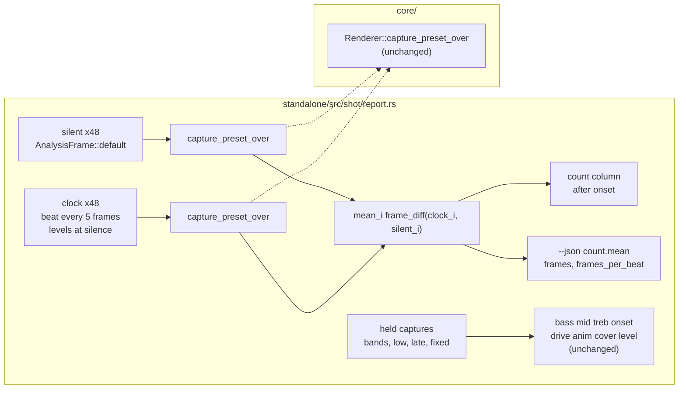

# 0182 — The report hears a counter

> **Status:** done 2026-09-15. Phases `5e97086`, `162ae7f`; conductor close review round 1:
> no blockers, no majors, three minors (one fixed at the close). Full `nextest --workspace`,
> `cargo doc`, `fmt` and `clippy` re-run green by the review. Version 0.124.0 (minor).
> **Created:** 2026-09-14
> **Owner skill(s):** `dev`
> **Related ADRs:** [0196](../../adrs/0196-the-report-hears-the-musical-clock-in-a-column-of-its-own.md) (accepted, Outcome),
> [0134](../../adrs/0134-motion-is-two-readings-and-anchoring-is-why-neither-can-be-a-threshold.md),
> [0042](../../adrs/0042-reachability-measured-on-the-expression-tree.md),
> [0109](../../adrs/0109-the-beat-clock-counts-onsets-not-beats.md)
> **Closes:** design-backlog 0192

## TL;DR

`shot --report` holds the musical clock still. Every capture it takes repeats one `AnalysisFrame`,
and none of its stimuli sets a counter, so a preset driven by `beat_index`, `bar_index` or a `[hold]`
on the `bar` edge reads as inert. `shape_maple` steps its rings once per onset and prints
`onset 0.000`. This plan adds a `count` column beside `onset`. It is measured from a synthetic clock
at silence, a beat every five frames for 48 frames, and differenced frame by frame against a silent
capture of the same length. No existing column's stimulus or number changes, so every curation
verdict already recorded stays comparable. Afterwards `shape_maple` and `shape_lion` read non-zero in
`count`, and a preset that reads no clock reads exactly `0.000`.

## Context & problem

Backlog 0192 has the finding. The report's four reactivity columns and `drive` each capture a held
frame. `band_stimuli_at` and `AnalysisFrame::fully_driven` set levels, the band array and `beat`,
and leave `beat_index`, `time_since_beat`, `beat_in_bar`, `bar_index` and `bar_phase` at their
`Default` zeros (`core/src/dsp/mod.rs`). A counter that does not move produces no inter-frame
motion either, so `anim` cannot see it.

The class is wider than the two presets that found it. On 2026-09-14, **27** shipped presets bind a
clock variable outside a comment: `beat_index` in 19, `bar_index` in 6, `time_since_beat` in 3 and
`bar_phase` in 2. Eight more carry a `[hold]` table, five of them on `beat` and three on `bar`. A
bar-held binding re-samples only when `bar_index` changes (`core/src/preset/schema/hold.rs`), so
under a held capture it never re-samples.

**Two constraints shape the fix.** The report's numbers are what the close ceremony's curation step
reads and what commit messages and ADR Outcomes quote. So the obvious fix, running the clock inside
`drive`, would make every `drive` value before it incomparable with every one after.
And the main table has no spare width: its widest row, a line family with `geom`, is 99 characters,
and `no_report_table_line_wraps_at_a_hundred_columns` holds it under 100.

## Decision

Take ADR-0196: a `count` column, placed after `onset` and read from a stimulus of its own.

- **The stimulus** is 48 frames (`REPORT_FRAMES_LATE`) at silence. Levels, the band array and `bpm`
  stay at `Default`. A beat lands every 5 frames from frame 5. On a beat frame `beat` is `true`,
  `beat_index` steps and `time_since_beat` is 0. `bar` ramps across each beat,
  `beat_in_bar = beat_index mod 4`, `bar_index = beat_index / 4`, and `bar_phase` ramps across the
  bar. That gives 9 beats, and bar edges at frames 20 and 40.
- **The reading** is the mean over *i* of `frame_diff(clock[i], silent[i])`. Both sequences come
  from `capture_preset_over`, so they differ in the clock fields and nothing else.
- **The layout:** `geom` moves to its own one-column block, which frees the width `count` needs. The
  arithmetic is 99 − 7 + 7 = 99. `--json` gains `"count": {"mean", "frames", "frames_per_beat"}`
  after `"drive"`.

We rejected running the clock inside `drive`, which would move every historical `drive` number, and
documenting the blind spot, because the misreading has already happened once. ADR-0196 also records
why the clock fires `beat` with its counter, why the cadence is 720 BPM rather than a musical tempo,
and why the reading is a mean rather than one depth.

## Architecture diagram



## Implementation phases

### Phase 1 — The clock stimulus and the `count` reading

- **Owner skill:** dev
- **What:** `report.rs` gains the clock stimulus builder, a `count: f32` on `PresetReport`, the two
  48-frame captures per preset inside `build_family_report`, the `count` cell after `onset`, `geom`
  moved to its own block, and the `count` JSON key. The `write_holds` doc comment stops saying the
  report is blind to counter-driven response and points at ADR-0196. Tests cover the stimulus, the
  table, the JSON and the behaviour on real captures.
- **Files touched:** `standalone/src/shot/report.rs`; `standalone/src/shot/report/tests.rs`;
  `standalone/tests/shot_cli.rs` (a fixture library for the GPU claims, in the shape of
  `tiny_report_library`).
- **Done when:**
  - **The stimulus moves the clock and nothing else.** A GPU-free unit test builds it and checks
    each of its 48 frames field by field against `AnalysisFrame::default()`. Every level, `*_raw`,
    the whole `spectrum` and `waveform`, `bpm`, `novelty` and the downbeat diagnostics are equal.
    `beat` is `true` on exactly the frames where `beat_index` differs from the previous frame, and
    there are 9 of them. `beat_in_bar == beat_index % 4` and `bar_index == beat_index / 4` on every
    frame, and `bar_index` takes the values 0, 1 and 2.
  - **A clock-free preset reads exactly zero.** A shot_cli fixture binds nothing to the clock and
    declares no `[hold]`. Its `--json` `count.mean` is `0` exactly, not merely printed as `0.000`.
    The two sequences are byte-identical because two captures of the same inputs on one machine and
    binary are (`docs/capturing.md`). **If this reads non-zero, stop.** Either the two captures
    differ in something besides the clock, or capture is not repeatable on this adapter, and either
    finding voids the column's premise.
  - **A counter reaches the column, directly and through a hold.** Two twin fixtures, identical to
    the clock-free one except for one binding each, read `count.mean` strictly greater than `0`.
    One binds its hue to `beat_index`. The other binds a time-varying hue under `[hold]` on `bar`.
  - **The motivating presets read non-zero.** `shot --presets presets --report family=shape_field`
    prints a `count` cell other than `0.000` for `Path Maple` and `Path Lion`
    (`presets/shape_maple.toml`, `presets/shape_lion.toml`). Their `onset` and `mid`
    cells are unchanged from before the phase. The log quotes both rows.
  - **No existing number moves.** Run `--report --json` over `presets/` on one machine before and
    after the phase. With the `count` key removed from each preset object, the two outputs are
    byte-identical. The log names the adapter.
  - **The table still fits.** The widest row, a line family, with `count` present and `geom` in its
    own block, is at most 100 columns. `no_report_table_line_wraps_at_a_hundred_columns` passes with
    its table count updated for the new block. `the_geometry_column_appears_only_for_families_with_a_line_seam`
    still holds for the block.
  - **The cost is recorded, with one stop.** The log records the wall time of
    `shot --presets presets --report` before and after the phase, on the reference machine, naming
    its adapter. **If the time more than doubles, stop and report before Phase 2.** The frame
    arithmetic predicts about a third more rendering: 96 frames on top of 312 per preset at 192 px.
    A doubling would mean per-frame readback is the cost, and a sampled capture primitive in
    `core/src/render/capture_api.rs` is a different plan.

### Phase 2 — The reader says what `count` is

- **Owner skill:** dev
- **What:** The operator docs describe the new column where the other columns are described, and
  correct what the plan made false.
- **Files touched:** `docs/capturing.md` (the sample block and the column table under
  `### What the report's columns mean`; the `### Held bindings` section); `docs/testing.md` (the
  stimulus table, if `--report`'s stimuli are listed there, and nothing otherwise).
- **Done when:**
  - The column table has a `count` row saying three things. It answers "does the musical clock
    reach the picture". It is a mean over a 48-frame sequence at a deliberately fast cadence, so its
    magnitude is not comparable to the band columns beside it. And like `drive` it is read against
    family neighbours, never as a threshold. The sample block carries the column, and `geom`'s new
    block is shown or described.
  - The `### Held bindings` section no longer says the report is blind to `beat_index`-driven
    response or cites backlog 0192. It no longer says no shipped preset declares a `[hold]` table,
    which has been false since eight do. It says a `beat`- or `bar`-held binding now moves `count`.
  - `node scripts/check-reader-prose.mjs`, `node scripts/check-doc-links.mjs` and
    `node scripts/toc.mjs --check` exit 0. If `toc.mjs --check` reports drift from a new heading,
    `node scripts/toc.mjs` regenerates the block and the regenerated file is committed.

## Data shapes

```rust
// illustrative — not the final interface
const CLOCK_FRAMES: usize = REPORT_FRAMES_LATE as usize; // 48
const CLOCK_FRAMES_PER_BEAT: usize = 5;                   // 720 BPM at FALLBACK_DT, on purpose

fn clock_stimulus() -> Vec<AnalysisFrame> {
    (0..CLOCK_FRAMES).map(|i| {
        let beat_index = (i / CLOCK_FRAMES_PER_BEAT) as u32;
        let into_beat = i % CLOCK_FRAMES_PER_BEAT;
        AnalysisFrame {
            beat: i > 0 && into_beat == 0,
            beat_index,
            time_since_beat: into_beat as f32 / 60.0,
            bar: into_beat as f32 / CLOCK_FRAMES_PER_BEAT as f32,
            beat_in_bar: beat_index % 4,
            bar_index: beat_index / 4,
            bar_phase: ((beat_index % 4) as f32 + into_beat as f32 / CLOCK_FRAMES_PER_BEAT as f32) / 4.0,
            ..Default::default()
        }
    }).collect()
}
```

```text
"drive":0.103,"count":{"mean":0.041,"frames":48,"frames_per_beat":5},"rate":{...}
```

## Risks & open questions

- **Readback may dominate the cost.** `capture_preset_over` reads back every frame, so the phase
  adds 96 readbacks per preset where that preset's other 192 px captures take 11. Phase 1's stop
  condition catches a doubling. Anything short of that ships, and the log carries the number.
- **The fast clock under-reads a smoothed counter.** A `[smoothing]` constant longer than a beat
  (0.083 s here) turns a stepped binding into a partial glide, so `count` reads such a preset lower
  than it responds at a real tempo. It still reads non-zero. The docs row says the magnitude is not
  a tempo reading.
- **A preset that reads only `beat` now shows in two columns,** `onset` (held `beat: true`) and
  `count`. That is correct, and ADR-0196 records the coupling. A curator separating the two reads
  the preset's bindings.
- **Backlog 0192's probe goes red on delivery.** `absent: beat_index: in: standalone/src/shot/report.rs`
  fails once the stimulus sets the field. `dev` reports the red and leaves the entry alone. Archiving
  it is close-ceremony step 3c.
- **The byte-identity check assumes capture is repeatable within one run.** `docs/capturing.md`
  claims that on one machine and binary, and the exact-zero fixture tests it directly. If the
  library comparison shows any other key moving, that is the finding, not noise to filter.

## What this plan does NOT do

- **It does not change any existing column's stimulus, capture depth or statistic,** including
  `drive`, the realistic-levels block, the footprint block and the transient probe.
- **It does not set `bpm`.** A `tempo`-gated binding stays invisible to every rendered column. The
  reachability walk's real-analyzer frames remain where a tempo gate is exercised.
- **It does not add `count` to the footprint or realistic-levels blocks.** Those blocks are per-band
  readings, and the clock is not a band.
- **It does not touch `core/`.** No capture primitive changes, and no `Scene` or ABI surface moves.
- **It does not update `docs/preset-tuning-walkthrough.md`.** Its steps quote band, `anim`, `cover`
  and transient columns and none that read the clock. Its samples already predate `drive`, `rate`
  and `level`, which is a separate staleness this plan leaves alone.
- **It does not edit the preset-author skill.** `render-loop.md`'s "bands live, `anim` alive" check
  gains a `count` clause at the close, as architect bookkeeping.

## Implementation log

> Written by `dev` — one row per phase as that phase's commit lands, and the close block after the
> last one. **The phases above are the contract; everything here is what happened.**
> **Observations, never conclusions:** this says where to look, architect decides how it went.
> No per-criterion pass list, no self-assessment, no narrative — but a deviation from the plan or
> an unmet done-when is always disclosed. Stays shorter than `## Implementation phases` above.

**Lane:** `C:\Users\Igor Konovalov\WORK\rlx-plan-0182` on branch `plan-0182-the-report-hears-a-counter`

| phase | owner | state | commit |
|---|---|---|---|
| 1 — The clock stimulus and the `count` reading | dev | done | 5e97086 |
| 2 — The reader says what `count` is | dev | done | 162ae7f |

### Notes

- **Phase 1, measurements.** Debug `shot` binaries, before and after, run back to back on the
  reference machine. `shot` makes the wgpu default adapter request (no `--gpu`); the machine's Dx12
  roster is AMD Radeon(TM) Graphics (integrated) and NVIDIA GeForce RTX 3080 Laptop GPU (discrete),
  and nothing `shot` prints says which of the two it took.
  - `shot --presets presets --report` wall time: **163.4 s before, 203.6 s after** (112 presets).
  - `--report --json` over `presets/`: 112 `count` objects removed from the after output, and the
    result is byte-identical to the before output.
  - `--report family=shape_field`, after (before rows were the same without the `count` cell):
    `Path Lion       0.167  0.000  0.009  0.000  0.191  0.169  0.000 0.0050+  0.774 0.0895    9+   28+`
    `Path Maple      0.175  0.000  0.016  0.000  0.169  0.180  0.000 0.0072+  0.854 0.2166   14+   16+`
  - Clock fixtures (`the_count_column_hears_a_counter_and_reads_exactly_zero_without_one`):
    still `0`, `beat_index` hue `0.06380889`, `bar`-held hue `0.048871923`.
- **Phase 1, deviation.** `count.mean` is written with Rust's shortest round-trip float formatting,
  not through `num`'s four places, so an exact zero reads `0` in the JSON (`0.0000` otherwise).
- **Phase 1, beyond the file list's wording.** The main table's prose gains a `count` line beside
  `drive`'s. In `shot_cli.rs`, the transient test's parser comment that described `geom` as the
  table's trailing column was rewritten.
- **Phase 2, beyond the named sections.** In `docs/capturing.md` the settled-measurement sentence
  under the column table now excepts `count`, and the `--report --json` schema paragraph gains
  `count` and a paragraph on its object. `docs/testing.md` is untouched: its stimulus table lists
  the preset gates' stimuli, not `--report`'s. The sample block's two rows are copied from the
  Phase 1 after-run, so `Shatter`'s `rate` reads `0.0358+` where the old sample read `0.0357+`; the
  `geom` sample rows are from the same run.
- **Risks, backlog 0192's probe.** The plan expected it to go red on delivery. It did not:
  `check-backlog-claims.mjs` exits 0, because `clock_stimulus` sets the field in struct shorthand
  (`beat_index,`), so `report.rs` still contains no `beat_index:`.

### Close triggers

- **`presets/` touched:** no
- **Plan header `Closes:`** design-backlog 0192
- **What shipped:** feature (`shot --report` `count` column and `--json` `count` object)
- **Operator docs touched:** `docs/capturing.md`
- **Backlog probes (`node scripts/check-backlog-claims.mjs`):** exit 0 (133 reductions hold, 57 live
  entries, 11 unprobeable)
- **Full suite:** `cargo nextest run --workspace` (under the conductor suite lock), exit 0, 1940
  passed, 6 skipped
- **Outstanding `human` phases:** none

## Close review

> The conductor-run close review (ADR-0205), round 1, 2026-09-15, written in a fresh session given
> the plan and the lane. There were no earlier rounds, so no finding was resolved by a fix round.

**Verdict: Plan 0182 landed cleanly; no blockers, no majors, three minors.** One is fixed in the
close commit and two stay open.

Lane: `C:\Users\Igor Konovalov\WORK\rlx-plan-0182`, branch `plan-0182-the-report-hears-a-counter`.
Phase commits `5e97086` (1), `162ae7f` (2), log close block `cce5867`, all on `7417dfb`. `main` had
not moved past it, so `git merge main` was a no-op and the review's gate is the close's gate.

### What was checked, and what it showed

**Lens 1, alignment with the plan and ADR-0196.**

- **Phases and log.** Both phases landed, each as its own commit with a single `dev` tag. The log is
  shorter than the phases section and discloses its three deviations.
- **Full suite (re-run, not trusted).** `cargo nextest run --workspace` under the suite lock:
  **1940 passed, 6 skipped**, 624 s, matching the log. `cargo fmt --check`,
  `cargo clippy --workspace --all-targets -D warnings` and
  `RUSTDOCFLAGS="-D warnings" cargo doc --workspace --no-deps` are clean.
- **Stimulus.** `clock_stimulus` matches ADR-0196 Decision 1 and the plan's data shape.
  `the_clock_stimulus_moves_the_clock_and_nothing_else` destructures `AnalysisFrame` exhaustively,
  compares every non-clock field bitwise against `Default`, and asserts `beat == stepped`, 9 beats,
  the bar trio against `beat_index`, and `bar_index` values `[0, 1, 2]` with edges at 20 and 40.
- **Reading.** `mean_aligned_diff` is frame-aligned, and its unit test checks an exact zero and an
  arithmetic value. Both captures go through `capture_preset_over`, which runs `reset_for_capture`
  and advances the same `FALLBACK_DT`. They run after every existing column's captures, whose calls
  and order are unchanged.
- **GPU claims (re-run).** The shot_cli clock test ran rather than skipping and printed
  `still 0, counted 0.06380889, held 0.048871923`, identical to the log. The still twin is asserted
  bitwise `0.0` and textually `"0"`, and the other two `> 0`.
- **Motivating presets (re-run).** `shot --presets presets --report family=shape_field` prints
  `Path Lion` `count 0.191` and `Path Maple` `count 0.169`. Both rows are byte-identical to the log's
  quotes, with `onset 0.000` and `mid 0.000` unchanged beside them.
- **No existing number moves.** Not re-run, because it needs a before binary. The claim is
  consistent with the diff, which changes no existing stimulus, capture call, depth or statistic.
- **Cost.** 163.4 s to 203.6 s (+25 %), under the doubling stop.
- **Width and `geom`.** The widest row is 2 + 14 + 7x7 + 8 + 2x7 + 2x6 = 99. The width test now
  counts 8 table lines and requires the `count` table among them. The geometry test asserts the
  main header ends at `fall`, the `["preset", "geom"]` block header, an aligned row, and `-` for an
  undrawn preset in a line family.
- **JSON.** Key order, the schedule, balanced braces and an exact `0` are pinned. `f32` `Display`
  never emits an exponent, so the full-precision mean stays valid JSON.
- **Phase 2.** `docs/capturing.md` carries the `count` row with its three required claims, the
  sample and `geom` block, and a corrected `### Held bindings`. `check-reader-prose`,
  `check-doc-links`, `toc.mjs --check` and `check-comment-hygiene` exit 0.

**Lens 2, layering and real-time safety.** `core/` is untouched, and no `Scene`, C ABI or control
protocol surface moved. The work is confined to the offline report. In `core/src/render`, only the
hold edges in `roster.rs` read the clock fields, so no scene reacts to the clock outside a binding.
The exact zero has no scene-internal exception.

**Lens 3, docs and bookkeeping.** `docs/capturing.md` is swept. `docs/testing.md` is correctly
untouched, because its stimulus table is the preset gates'. The walkthrough is excluded by the plan.
Owed at close: ADR-0196 accepted with an Outcome, backlog 0192 archived, and a minor version bump
for the new report column and JSON key.

**Lens 4, correctness and determinism.** Every new numeric assertion is exact by construction or a
strict `> 0` property, and none is a frozen measurement. The stimulus is a pure function of
constants.

**Lens 5, design integrity.** The change adds one stimulus builder, one statistic helper, one field
and two renderer edits, each beside its siblings. No seam widened.

### Findings

**blocker:** none. **major:** none.

**minor**

1. **`.claude/skills/preset-author/references/render-loop.md:170-171` prints the old table.**
   - **What:** its "real row" sample still carries `geom` as the trailing column and has no
     `count`, and the prose above it says a `geom` column appears for line families.
   - **Why it matters:** the content lane reads this page as the table's shape.
   - **Fix:** the sample shows the new layout, and step 7 gains the plan's `count` clause.
   - **Open.** The conductor session's permissions deny edits under `.claude/`, so this is the
     owner's, or a human-started session's, together with the followup below.
2. **`standalone/src/shot/report.rs:110` mirrors core's crate-private `scenes::FALLBACK_DT` as
   `CAPTURE_DT`, and nothing holds the two equal.**
   - **Why it matters:** if `FALLBACK_DT` moves, the stimulus's `time_since_beat` stops being the
     seconds the capture renders. The blast radius is one envelope's reading in `count`.
   - **Fix:** replace the mirror if `FALLBACK_DT` ever becomes reachable from `standalone`.
   - **Open.**
3. **ADR-0196's Neutral consequence predicted backlog 0192's probe would go red on delivery. It did
   not.**
   - **What:** the stimulus sets `beat_index` in struct shorthand, so the probe's absence of
     `beat_index:` held on the fixed tree.
   - **Fix:** accept ADR-0196 with a dated Outcome, and archive backlog 0192 so the probe retires.
   - **Fixed at the close.**

### Close notes

- **Preset curation (step 3b):** not triggered. No `.toml` moved, and no shipped preset names
  ADR-0196, Plan 0182 or backlog 0192.
- **Backlog:** 0192 archived as discharged. `check-backlog-claims.mjs` is green before and after.

## Followups (after this lands)

- Architect, at close: add a `count` clause to `.claude/skills/preset-author/references/render-loop.md`'s
  pre-ship `--report` check.
