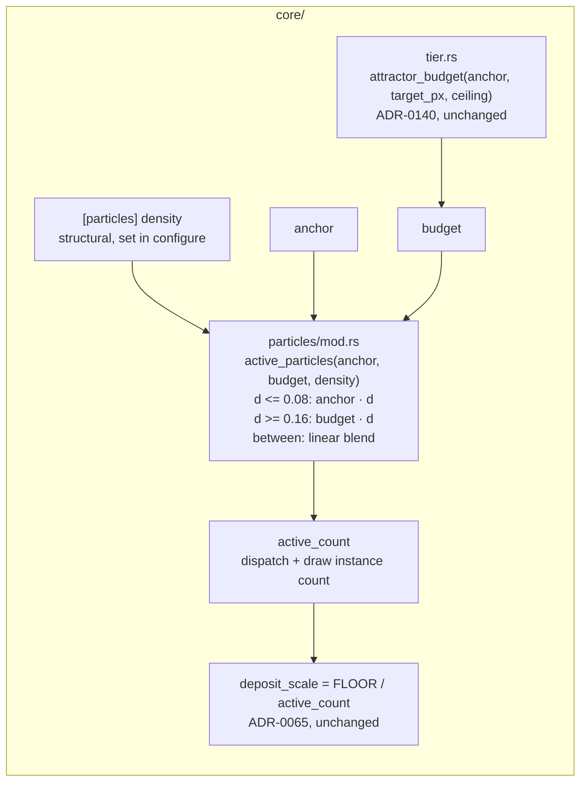

# 0183 — A low density is a trace count

> **Status:** done (closed 2026-09-17) — all three phases landed (`a98773de`, `887590bd`,
> `af3055d2`), plus the close-review repairs in `cc068151`. Conductor close review round 1:
> **no blockers, no majors, two minors and one nit**, all three repaired at the close. Verified: the
> full suite green on the reviewed tree (1986 passed, 6 skipped, nothing blessed and no baseline
> moved), `cargo doc --workspace` clean under `-D warnings`, and ADR-0195's four properties each
> asserted on the value at sizes where the old law and the new one disagree. ADR-0195 accepted.
> Version **0.128.1** (patch — a fix plan).
> **Created:** 2026-09-14
> **Owner skill(s):** `dev`, `human`
> **Related ADRs:** [0195](../../adrs/0195-a-low-density-is-a-trace-count-and-the-law-scales-only-a-cloud.md) (accepted),
> [0140](../../adrs/0140-a-sample-budget-is-a-density-against-the-render-target.md),
> [0069](../../adrs/0069-the-attractor-trades-sample-count-for-trace-length.md),
> [0065](../../adrs/0065-the-attractor-deposit-is-normalized-by-particle-count.md)
> **Closes:** design-backlog 0186

## TL;DR

An attractor preset at `[particles] density = 0.02` draws 3,000 trajectories at a 640x360 `Rich`
window, 12,000 at a 1080p window and 27,000 under a 1080p `--render`, each at a matching fraction of
the light. For a cloud that is ADR-0140 working as intended. For the ten trace worlds, whose look
*is* the count, it is a different picture on every display. This plan resolves the drawn count
against the tier's **anchor** at or below `density = 0.08` and against ADR-0140's budget at or above
`0.16`, blending linearly between the two (ADR-0195). A trace draws the count its author picked at
every size, a cloud is untouched, and no committed baseline moves. The first visible change is
`fragment_sumi` in a maximized `Rich` window reading as the calligraphy it reads as in a small one.

## Context & problem

Backlog 0186 has the finding and ADR-0195's Context has the arithmetic. Three facts shape this plan:

- **The quantity is invisible at the size every test runs at.** Goldens are `Floor` at 128x128,
  sanity is 96x96, and `Floor`'s live ceiling is its anchor. At all of these the budget equals the
  anchor and the law is a no-op. A test for this has to be written at a target above `REFERENCE_PX`
  (230,400 px) at `Rich`, or with the offline ceiling. Any test written at the usual sizes passes
  before and after the fix and proves nothing.
- **The count is resolved in two places in the scene, and both need the anchor.**
  `AttractorScene::set_target_size` calls `active_particles(self.budget, self.density)` after moving
  the budget, and `configure` calls it again when a preset switch sets `density`. The scene already
  stores `anchor` (it is the lower clamp ADR-0140 passes to `attractor_budget`). So the resolution
  gains one argument and neither call site needs new state.
- **The two stale preset headers become true rather than wrong.** `attractor_thomas.toml`'s *"1 000
  particles at the floor tier, 3 000 at rich"* and `fragment_sumi.toml`'s *"~1000 particles"* are the
  `Floor` and `Rich` anchor counts, and after the fix they hold at every size. What does go stale is
  the reader prose that promises the opposite. `presets/README.md` says *"`density = 0.02` is 1 000
  points on one and 3 000 on the other in a small window, and proportionally more in a big one"*, and
  its blockquote says *"a preset tuned in a small window keeps its look at 1080p rather than thinning
  out"* about the cloud case alone.

## Decision

Take ADR-0195: a transition band `TRACE_DENSITY = 0.08` to `CLOUD_DENSITY = 0.16`, with the effective
budget blended linearly from anchor to budget across it. We rejected retuning the trace presets per
display (ADR-0140's rejected per-preset duty, and a preset can only be tuned for one display), a
single threshold (a 4x-18x step in count at one density value), a per-preset scaling key (a name
whose correct value the density already implies for every shipped world) and a power law (never
exactly fixed for a trace).

## Architecture diagram



## Implementation phases

### Phase 1 — The count resolves against the anchor for a trace, proven at a size the law reaches

- **Owner skill:** dev
- **What:** `active_particles` takes the anchor and resolves ADR-0195's effective budget. Both call
  sites pass `self.anchor`. `TRACE_DENSITY` and `CLOUD_DENSITY` are named constants beside
  `MIN_PARTICLE_DENSITY`, with a doc comment that gives the formula, the two exact arms, the band's
  steepness and why the boundary sits where the authored population leaves a gap (the mechanism, not
  the decision record, per ADR-0127). The outer arms keep today's `f32` expression verbatim, so the
  cloud arm and the `budget == anchor` case are exact rather than within a rounding.
- **Files touched:** `core/src/render/scenes/particles/mod.rs` (`active_particles`, its two call
  sites, the two constants); GPU-free unit tests beside `active_particles`; the existing built-scene
  test `the_render_path_resolves_a_larger_budget_than_a_window_does` in
  `core/src/render/scenes/mod.rs` (its `resolved` closure already builds the attractor at 1920x1080
  under both ceilings), or a sibling beside it, extended with an active-count read. Add a `#[cfg(test)]` hook
  beside `sample_budget` if the count is otherwise unreachable, and keep it `cfg(test)` for the
  reason that function's doc gives.
- **Done when:**
  - **A trace is a fixed count, at a size the old law scales.** For `density` in
    `{0.0005, 0.006, 0.02, 0.06, 0.08}`, the resolved count at 640x360, 1280x720, 1920x1080 and
    3840x2160, under both `Rich` ceilings and both `Floor` ceilings, equals
    `(anchor as f32 * density).round() as u32` (floored at 1). Named values: `density = 0.02` gives
    **3,000** at `Rich` and **1,000** at `Floor` at every one of those sizes. The same assertion fails
    on today's tree at 1920x1080 `Rich` (12,000 live, 27,000 offline), which is the non-vacuity.
  - **A cloud is untouched.** For `density` in `{0.16, 0.18, 0.4, 0.5, 1.0}` at every size and
    ceiling above, the count equals today's `(budget as f32 * density).round() as u32`. Checked
    against the old expression evaluated in the test, not against a frozen number.
  - **Where the budget is the anchor, nothing changed at any density.** At 128x128 and 96x96 at both
    tiers and both ceilings, and at 1920x1080 `Floor` live, the count equals today's for a sweep of
    `density` from `MIN_PARTICLE_DENSITY` to `1.0` in steps of `0.0005`, including every value inside
    the band.
  - **Continuous and monotone.** Over the same sweep at 3840x2160 `Rich` offline (the steepest case,
    `budget / anchor = 18`), the count never decreases as `density` rises. At `0.08` and `0.16` it
    equals the adjacent arm's value exactly. The count at `0.16` is **432,000** and at `0.08` is
    **12,000**.
  - **The built scene agrees with the function.** In the GPU test, an attractor scene configured
    with `density = 0.02` and sized to 1920x1080 reports an active count of 3,000 under both
    `SampleBudget::Live` and `SampleBudget::Offline` at `Rich`, and its `sample_budget()` still
    reports 600,000 and 1,350,000. The budget is unchanged; only the drawn count moved.
  - `cargo nextest run --workspace` moves **no golden and no sanity baseline, with nothing blessed**.
    Every baseline is `Floor` at or under `REFERENCE_PX`, so property 3 is the reason, and a baseline
    that moves is a stop, not a re-bless. `node scripts/check-backlog-claims.mjs` is reported by exit
    code. Entry 0186's first probe matches `active_particles.self\.budget` and is expected to go red
    on delivery. `dev` reports it and leaves the entry alone.

### Phase 2 — The reader, the schema doc and the two headers say what a density buys

- **Owner skill:** dev
- **What:** Every prose surface that states how `density` scales gains the trace half beside the
  cloud half, count-free where possible. The `[particles] density` key's schema doc sentence names
  the band, and the editor schemas regenerate from it. The two preset headers get a comment-only edit
  saying the counts they quote hold at every window size.
- **Files touched:**
  - `presets/README.md`: the `### [particles] — for attractor` section, meaning the blockquote that
    begins *"`density` is a fraction of a budget that moves with the window"*, the bullet ending
    *"proportionally more in a big one"*, and the `density` row of the key table. Hand-written prose
    outside the generated params block.
  - `core/src/preset/schema/raw/particles.rs`: the `density` `KeyDesc` `doc`, then
    `presets/schema/*.schema.json` and `.taplo.toml` regenerated with `RLX_UPDATE_PRESET_SCHEMA=1`,
    never hand-edited.
  - `docs/capturing.md`: the `--render` budget table's surrounding prose. A density at or below the
    trace boundary draws the same count under `--render` as in a window of the same tier.
  - `docs/nfr.md`: the tier paragraph that explains ADR-0140's law.
  - `presets/attractor_thomas.toml`: the *"At the full 50 000 particles"* sentence becomes a
    statement about `density = 1.0`, and the ladder sentence says its counts hold at any window
    size. **Comments only.**
  - `presets/fragment_sumi.toml`: the *"~1000 particles"* header clause gains the tier and the
    size-independence. **Comments only.**
- **Done when:**
  - The README states both halves. Above the cloud boundary a density is a proportion of a budget
    that grows with the window. At or below the trace boundary it is a count that does not, and the
    count at each tier is `anchor * density`. The band between is named as scaling partly with the
    window.
  - No prose touched by this phase quotes a drawn count for a trace density as varying with window
    size. `grep -n "proportionally more in a big one" presets/README.md` returns nothing.
  - `presets/attractor_thomas.toml` and `presets/fragment_sumi.toml` render **byte-identically** to
    before the phase: the golden, sanity and per-preset sweeps pass with nothing blessed, which is
    the evidence that only comments moved.
  - `core/tests/preset_schema.rs` passes against the regenerated schemas.
  - `node scripts/check-doc-links.mjs`, `node scripts/check-reader-prose.mjs` and
    `node scripts/toc.mjs --check` exit 0.

### Phase 3 — The look gate at the size the defect lives at

- **Owner skill:** human
- **What:** A judgement session, in the `preset-author` lane or by the owner, on whether a trace now
  reads as the same drawing at every size. Render `fragment_sumi`, `attractor_thomas` and
  `attractor_lorenzgallery` at 640x360 and 1920x1080 `Rich`, as a still (live ceiling) and as a short
  `--render` (offline ceiling), on the tree before Phase 1 and after it. Put them side by side.
  Include `attractor_leviathan` and `attractor_fernmono` (the cloud and the sparsest figure) as the
  control for "a cloud did not move".
- **Files touched:** none committed. Captures land under `target/`, and the verdict goes into the
  implementation log.
- **Done when:**
  - The owner records a verdict for each trace world: whether the 1080p after-frame reads as the same
    pen drawing as the 640x360 frame, where the 1080p before-frame read as a denser, dimmer fog.
  - The two cloud controls are recorded as unchanged between before and after at 1080p.
  - **If a trace reads wrong at 1080p after the fix** (for example, strokes now read thin or faint
    against a large frame), the plan stops here with the verdict in the log. ADR-0195 is not accepted
    at close, and the finding goes back to `architect`. A fixed count may be necessary without being
    sufficient, and that is a design question, not a retune.

## Data shapes

```rust
// illustrative — not the final code
pub const TRACE_DENSITY: f32 = 0.08;
pub const CLOUD_DENSITY: f32 = 0.16;

fn active_particles(anchor: u32, budget: u32, density: f32) -> u32 {
    let drawn = if density <= TRACE_DENSITY {
        (anchor as f32 * density).round()
    } else if density >= CLOUD_DENSITY {
        (budget as f32 * density).round() // today's expression, verbatim
    } else {
        let w = (density - TRACE_DENSITY) / (CLOUD_DENSITY - TRACE_DENSITY);
        let effective = anchor as f32 + (budget - anchor) as f32 * w;
        (effective * density).round()
    };
    (drawn as u32).clamp(1, budget)
}
```

`budget >= anchor` holds by `attractor_budget`'s own lower clamp, so `budget - anchor` cannot
underflow. The blend arm's `f32` product stays exact enough: `effective * density` at the 4K offline
ceiling is below 432,000, well inside `f32`'s 2^24 integer range.

## Risks & open questions

- **A fixed count may not be the whole look.** The stroke's screen width comes from its NDC `size`,
  and each particle's deposit is normalized by count rather than by covered area. So a fixed count at
  a larger target should draw the same fraction of the frame at the same per-pixel level. That is
  reasoning from the draw, not a measurement, and Phase 3 is where it is judged.
- **A `--render` test or report at a large target on a trace preset moves a number.** Every such
  count is a comparison of one run against another (`shot_cli`'s byte-identical determinism), not
  against a frozen figure. That was checked by reading, not by running, so an assertion Phase 1's
  run turns red is a named stop in the log.
- **The band has no occupant, so it is untested by content.** Phase 1 asserts its arithmetic. How a
  world authored at 0.12 looks at two sizes is unknown, and ADR-0195's Negative section says so.
- **`nfr.md`'s pre-ADR-0140 frame-time readings stay stale either way.** This plan changes cost only
  for sparse worlds, and in the cheaper direction. Re-taking them is already owed to
  `docs/on-device-validation.md` and is not taken here.

## What this plan does NOT do

- **It does not change ADR-0140's budget, its ceilings or `REFERENCE_PX`.** `attractor_budget` and
  every tier constant are untouched. So is `shot --render`'s header, which prints the budget.
- **It does not retune any preset.** No density, `brightness`, `fade` or `size` value changes. The
  two header edits are comments.
- **It does not add a `[particles]` key** or a load warning for a density inside the band. A band
  value is legal and means something.
- **It does not touch `swarm` or `emitter`**, which have no `density` key.

## Implementation log

> Written by `dev` — one row per phase as that phase's commit lands, and the close block after the
> last one. **The phases above are the contract; everything here is what happened.**
> **Observations, never conclusions:** this says where to look, architect decides how it went.
> No per-criterion pass list, no self-assessment, no narrative — but a deviation from the plan or
> an unmet done-when is always disclosed. Stays shorter than `## Implementation phases` above.

**Lane:** `C:\Users\Igor Konovalov\WORK\rlx-plan-0183` on branch `plan-0183-a-low-density-is-a-trace-count`

| phase | owner | state | commit |
|---|---|---|---|
| 1 — The count resolves against the anchor for a trace | dev | done | a98773de |
| 2 — The reader, the schema doc and the two headers | dev | done | committed with this row |
| 3 — The look gate at the size the defect lives at | human | done | this row |

### Notes

- Phase 1, backlog probe: `node scripts/check-backlog-claims.mjs` exits 0 and reports 33 live
  entries. Entry 0186 is **not among them** — it left `docs/design-backlog.md` for
  `docs/design-backlog-archive.md` on promotion (ADR-0206), so its
  `present: active_particles.self\.budget` probe is no longer evaluated and does not go red as the
  phase's last bullet expected. The probe string would no longer match the tree.
- Phase 1, done-when scope: `active_particles` gained the anchor argument, so the trait hook added
  for the built-scene assertion is a second one — `Scene::active_sample_count`, `#[cfg(test)]`
  beside `sample_budget` — rather than a hook beside `sample_budget` in the particles scene alone.
  The GPU assertion landed as a sibling test, `a_trace_preset_draws_its_anchor_count_at_1080p`, and
  `the_render_path_resolves_a_larger_budget_than_a_window_does` is unchanged.
- Phase 2, file list: regenerating with `RLX_UPDATE_PRESET_SCHEMA=1` rewrote one file the phase's
  `Files touched` does not name — `docs/specs/player-schema.json`, the committed snapshot of what
  `ritmolux --schema` prints, which `preset_schema::the_player_schema_snapshot_is_current` holds to
  the same `KeyDesc` `doc` the editor schemas render. It carries the one changed sentence and
  nothing else.
- Phase 2, prose beyond the listed anchors: two sentences adjacent to the named ones also asserted
  the old behaviour and were changed with them — `docs/capturing.md`'s lead *"A render draws the
  attractor denser than a window does"* (now *"gives the attractor a larger sample budget"*), and
  the `density` row of `presets/README.md`'s `[particles]` key table, which the phase does name.

### Phase 3 — the look gate

Taken 2026-09-17. The captures were prepared in the `preset-author` lane and **the verdict is the
owner's**, given on the side-by-side sheets: *"after the changes figures became more neat, I like it
overall."* The before-tree is `main` at `0d3dd766`, this branch's parent; the after-tree is this lane
at Phase 2. Captures landed outside the repository and nothing is committed. Per world: a still at
`--tier rich --frames 300 --set bass=0.6,mid=0.5,treb=0.4,tempo=120` at 640x360 and at 1920x1080 (the
live ceiling), and for the three traces a 1920x1080 `--render` of `renders/plan-0106-p7/seg09.wav` at
`--fps 30`, read at 6 s (the offline ceiling).

**The 1080p after-frame reads as the same pen drawing as the 640x360 frame in all three trace
worlds.** What follows is the reading of the sheets the verdict was given on.

- **`fragment_sumi`** (`density = 0.02`). Live, before: the strands fuse into one solid glowing
  ribbon and the individual strokes are gone. After: the loops read open, strand by strand, as they
  do at 640x360. Offline, before: a woolly fog carrying no readable mark. After: discrete strokes
  with ground visible between them.
- **`attractor_thomas`** (`density = 0.02`). Live, before: lighter and more diffuse than its own
  640x360 frame, the rim accents washed out. After: that frame's stroke weight and dark rim accents
  are back. Offline, before: a graphite smudge in which no single stroke can be followed. After: a
  pen drawing.
- **`attractor_lorenzgallery`** (`density = 0.006`, the sparsest). Live, before: the disc fills in
  and the interior orbits wash out. After: the interior reopens with ground between the strokes, as
  at 640x360. Offline, before: a flat filled disc. After: a legible coil.

**The two cloud controls are unchanged, measured rather than judged.** `attractor_leviathan` and
`attractor_fernmono` produce **byte-identical** 1920x1080 PNGs before and after (4,443,672 and
607,532 bytes). So does every 640x360 frame in the set, all five worlds — the law being a no-op where
the budget already equals the anchor.

**The phase's stop condition did not fire.** No trace read thin or faint at 1080p after the fix; the
after frames read crisper than the before frames rather than weaker.

Observation, not a conclusion: at 1080p after, a stroke reads slightly more contrasted than the same
world's 640x360 stroke. The drawn count is the anchor's at both sizes, so what differs is the pixel
count the same marks resolve into.

### Close triggers

- **`presets/` touched:** yes. `presets/README.md` (hand-written prose only, outside the generated
  params block), `presets/attractor_thomas.toml` and `presets/fragment_sumi.toml` **comments only**,
  and the generated `presets/preset.schema.json` + `presets/schema/*.schema.json`. No preset value
  moved; `.taplo.toml` regenerated to no change.
- **Plan header `Closes:`** design-backlog 0186. It is **not in the live backlog file** — it moved to
  `docs/design-backlog-archive.md` on promotion (ADR-0206), so no live entry needs retiring and its
  probes are no longer run.
- **What shipped:** a fix. Engine behaviour changes for `[particles] density` at or below `0.08`, plus
  the reader, schema-doc and header prose that describes it.
- **Operator docs touched:** `docs/capturing.md` (the `--render` budget section), `docs/nfr.md`
  (§1's tier paragraph), `presets/README.md`, `docs/specs/player-schema.json`.
- **Backlog probes (`node scripts/check-backlog-claims.mjs`):** exit 0 — 75 stated reductions across
  33 live entries, 2 unprobeable, 34 advisory moved-path rows.
- **Full suite:** owed to the conductor's pre-review gate (ADR-0207). Observation: at Phase 1's
  done-when, `cargo nextest run --workspace` on Phase 1's tree exited 0 with 1986 passed, 6 skipped,
  nothing blessed and no golden or baseline modified. Phase 2's tree was run against
  `-p rlx-core --test golden --test sanity --test animation --test reactivity --test distinctness
  --test attractor --test ink --test suite`: 656 passed, 4 skipped, exit 0, again with nothing
  blessed.
- **Outstanding `human` phases:** none. Phase 3 was taken 2026-09-17 in the `preset-author` lane and
  its verdict is above: the three trace worlds pass, both cloud controls are byte-identical, and the
  stop condition did not fire. Whether ADR-0195 is accepted at close is the review's call on that
  record.

## Close review

> Conductor-run close review (ADR-0205), round 1, 2026-09-17. Written in a fresh session handed the
> plan and the lane and nothing an implementer wrote. Reviewed tip `af3055d2`; the full review is
> also at `tools/conductor/state/reviews/0183-round-1.md`, which is gitignored, so this is the
> record. **There were no earlier rounds**, so no finding is carried here from a fix round.

**Verdict: Plan 0183 landed cleanly — no blockers, no majors, two minors and one nit.** The density
law is implemented exactly as ADR-0195 specifies, every one of the ADR's four properties is asserted
on the value at sizes where the old law and the new one genuinely disagree, and the three findings
are all stale doc-comment or reader prose, repaired at the close in `cc068151`.

### Evidence this review ran on

- **Full suite.** `with-lock.mjs suite -- cargo nextest run --workspace` printed the ledger record
  rather than re-running (ADR-0207): *skipped — tree `230e457` is green in the suite ledger, run by
  gate `0183-pre-review` at 2026-09-17T09:08:11.760Z: 1986 tests run: 1986 passed (7 slow), 6
  skipped.* That record is the full-suite evidence. Nothing blessed; the diff against `main` touches
  no baseline file at all.
- **`cargo doc --workspace --no-deps` under `-D warnings`** — all five crates clean. It matters
  here: the phase added a doc comment carrying an intra-doc link and a fenced block, and the
  pre-push hook mirrors `-p rlx-core` alone.
- `cargo fmt --all --check` and `cargo clippy --workspace --all-targets -- -D warnings`: clean.
- `check-doc-links`, `check-index-rows`, `check-reader-prose`, `toc --check`,
  `check-comment-hygiene`, `check-filter-figures`, `check-translations`: all exit 0.
- `check-backlog-claims.mjs`: exit 0 — 75 stated reductions across 33 live entries, 2 unprobeable,
  34 advisory moved-path rows; re-run after the merge from `main`, 80 across 34. Nothing this plan
  touched convicted an entry.
- **Translation advisory:** *no translated source has moved since its translation was stamped.* All
  five `.ru.md` files are current. This plan edited no translated source.

### Lens 1 — alignment with the plan and the ADR

Every phase carries a single in-vocabulary `**Owner skill:**` tag, and all three landed. The
`## Implementation log` is 101 lines against `## Implementation phases`' 103 — inside the rule, and
observations rather than conclusions throughout. Two deviations are disclosed and both are the right
call: backlog 0186's probe did not go red on delivery because the entry had already left the live
file on promotion (ADR-0206) and the gate reads only that file; and the built-scene hook landed as
`Scene::active_sample_count` with a sibling test rather than an extension of
`the_render_path_resolves_a_larger_budget_than_a_window_does`, which the plan allowed and which is
the better shape — one test pins the budget, the other pins what is drawn out of it.

Every test the plan named was opened and its assertion body read. They map onto ADR-0195's four
properties one for one, and none is tautological:

- `a_trace_density_draws_the_anchor_count_at_every_target` sweeps five densities across all sixteen
  `(tier, ceiling, size)` pairs over 640x360..3840x2160. **Its non-vacuity is checked, not claimed**:
  the last two lines evaluate the old expression at 1920x1080 `Rich` and pin 12,000 live and 27,000
  offline, so the 3,000 above is a change.
- `a_cloud_density_resolves_exactly_as_the_budget_alone_does` compares against the old expression
  **evaluated in the test**, so a later `attractor_budget` change cannot make it pass by moving both
  sides.
- `where_the_budget_is_the_anchor_no_density_moved` is why no baseline moves, and it is **swept, not
  sampled** — 2,000 densities at three size/tier cases, each guarded by `assert_eq!(budget, anchor)`
  so a constant change that breaks the premise fails loudly instead of passing vacuously.
- `the_count_is_monotone_and_neither_boundary_is_a_step` runs the same sweep at the steepest pair the
  shipped tiers reach, guards `budget / anchor == 18`, and asserts **continuity at the nearest
  representable `f32` neighbour of each boundary** rather than as prose.
- `a_trace_preset_draws_its_anchor_count_at_1080p` drives the **built scene** through the real
  `configure` → `set_target_size` order and reads both hooks off it, which is the point: a
  recomputation would pass with `configure` never reaching `active_count`, and `configure` is one of
  the two call sites that had to gain the anchor.

The arithmetic checks out against the tier constants (`Rich` 150,000 / 600,000 / 2,700,000; `Floor`
50,000 / 50,000 / 900,000; `REFERENCE_PX` 230,400). The doc comment's *"8x at a 1080p `Rich` window,
36x at a 4K `Rich` render"* is `2 * (600,000/150,000)` and `2 * (2,700,000/150,000)`, both correct
and both agreeing with ADR-0195's Negative section.

Phase 3, the `human` look gate, was taken and its verdict recorded verbatim; the stop condition did
not fire, and the two cloud controls are recorded as **byte-identical PNGs** before and after rather
than judged — the stronger claim, and the right one for a control. On that record **ADR-0195 is
accepted at close.**

### Lens 2 — layering, coupling, real-time safety

Nothing to report. `active_particles` is a pure function of three integers and a float, called only
from `set_target_size` and `configure`, both off the hot path. No allocation, lock, logging,
`unwrap` or `expect` anywhere in the diff's engine code; no platform, audio-source or GPU-backend
type enters `core/`; the C ABI and the control protocol are untouched. **The `Scene` trait gained
`active_sample_count`, and it is not a seam widening** — `#[cfg(test)]` on both the default and the
impl, documented with the reason, mirroring `sample_budget`'s existing shape. The item does not
exist outside `cfg(test)`, so no shipped path can reach it.

### Lens 3 — docs, bookkeeping, release

The operator-doc sweep is near-complete: `presets/README.md` (blockquote, key-table row and the
"1 000 points on one and 3 000 on the other" bullet), `docs/capturing.md` (a fourth consequence
bullet, and its lead corrected from *"draws the attractor denser"* to *"gives the attractor a larger
sample budget"* — the distinction the whole plan turns on), `docs/nfr.md` §1, the `KeyDesc` doc, and
the regenerated schema files. Generated files were regenerated rather than hand-edited, and
`preset_schema::the_player_schema_snapshot_is_current` passing in the green suite is the evidence.
Phase 2's own grep done-when is satisfied. One reader document the file list missed is finding M2.

**Preset curation (step 3b).** `presets/` was touched, comments and generated schemas only — no
preset value moved, corroborated by the green golden/sanity/sweep run. **Nothing new landed, so
there is nothing to judge against the shipped set.** The stale-workaround grep across
`presets/*.toml`, read in full rather than piped, finds **no preset header dodging the defect this
plan fixed** — no `[particles]` value anywhere is pinned to work around ADR-0140's scaling, and no
preset header other than the two the phase corrected quotes a drawn count at all.

**Version: patch.** The plan corrects the behaviour of an existing key and adds no surface.

### Lens 4 — correctness and determinism

`budget >= anchor` is guaranteed by `attractor_budget`'s own `clamp(anchor, ceiling.max(anchor))`,
so `budget - anchor` cannot underflow, and the doc comment cites exactly that clamp.
`effective * density <= budget <= 2,700,000`, well inside `f32`'s 2^24 integer range. Both outer
arms keep today's `(n as f32 * density).round()` expression verbatim, so properties 2 and 3 are
exact rather than within one particle — what ADR-0195's Notes section asked for. No wall-clock read,
no unseeded randomness, no `aspect` derived from a grid.

**The lens-4 question this plan is itself an instance of — what the development configuration cannot
see — is answered rather than dodged.** Every golden is `Floor` at 128x128 and every sanity frame
96x96, where `budget == anchor` and the law is a no-op twice over; an assertion written there would
pass before and after and prove nothing. The new tests are deliberately written above `REFERENCE_PX`
under both ceilings, and `TRACE_SIZES` carries a comment saying so.

**Every numeric assertion added is a property, not a measurement.** 3,000, 1,000, 12,000, 27,000,
216,000 and 432,000 are exact integer consequences of committed tier constants, reproducible on any
machine; the one test that touches an adapter does CPU arithmetic only and skips with ADR-0016's
printed notice where there is none.

### Lens 5 — design integrity

Dependencies still point inward. `active_particles` gained an argument rather than the scene gaining
state — both call sites already held `self.anchor`, as the plan predicted. The two constants sit
beside `MIN_PARTICLE_DENSITY` where a reader of one finds the others. No god module, no train wreck,
no `Scene` learning about engine lifecycle or backend. The band constants are a classification of
authored intent, and the doc comment's claim about which population gap they bracket was checked
against `presets/*.toml`: the densest attractor trace is `attractor_thomasred` at `0.060` and the
sparsest figure `attractor_fernmono` at `0.18`, so both ends fall in empty space.

### Findings

#### minor — `active_count`'s doc comment still carried the old formula

`core/src/render/scenes/particles/mod.rs:667`. The field doc read *"How many of `budget` are actually
stepped and drawn — `round(budget * density)` (ADR-0069)"*, which is false for every `density` below
`CLOUD_DENSITY`. It sits fifteen lines above the `density` field and contradicted `active_particles`'
own doc in the same file. **Repaired in `cc068151`**: it now names the effective budget.

#### minor — the on-device checklist still said the drawn count depends on the window

`docs/on-device-validation.md:373`. The `Rich` calibration item said *"the drawn count now depends on
it, and the relief lever for an attractor miss is that ceiling rather than the anchor"*. Both halves
are conditional on density: for a trace world the count does not depend on the window, and lowering
the live ceiling relieves nothing there. The item asks the operator to run *"an `attractor_*`"*,
either kind, so it could send a reading the wrong way. This reader document was not in Phase 2's file
list. **Repaired in `cc068151`.**

#### nit — three doc comments still called `density` a bare fraction of the budget

`core/src/preset/schema/raw/particles.rs:14`, `core/src/render/scenes/mod.rs:368` and
`core/src/render/scenes/particles/mod.rs:676`. The `KeyDesc` `doc` six lines below the first of them
was corrected by Phase 2, so the file disagreed with itself. Weaker than the two above because none
states a formula — imprecise rather than wrong — but they are the three places a reader looking for
what the key means will land. **Repaired in `cc068151`.**

## Followups (after this lands)
